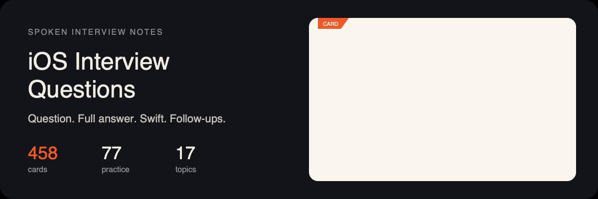

# iOS Interview Questions

<p align="center">
  <a href="./assets/readme/hero.svg"></a>
</p>

<p align="center">
  <a href="#topics">Topics</a> ·
  <a href="#start-here">High frequency</a> ·
  <a href="#junior">Junior</a> ·
  <a href="#mid">Mid</a> ·
  <a href="#senior">Senior</a> ·
  <a href="CONTRIBUTING.md">Contributing</a>
</p>

Spoken-answer notes for iOS interviews. Each card is one question: a full answer in our own words, a short Swift example, and the follow-ups interviewers actually ask.

**458** cards · **381** with a written answer · **77** practice prompts · **17** topics

English first. Russian twins come later, same files and `{#slug}` anchors. Answers are rewritten, not copied.

## How to study

1. Open **[Start here](#start-here)** — every `Frequency: High` card, grouped by topic.
2. Switch difficulty: **[Junior](#junior)** / **[Mid](#mid)** / **[Senior](#senior)**.
3. Or read one file in [`topics/`](topics) from top to bottom.
4. System-design, algorithm, and take-home **practice** cards are prompts only. Talk them through. Do not look for a pasted solution.

The lists below stay collapsed so you can jump. The answers live in the topic files.

## A card looks like this

From [ARC vs garbage collection](topics/memory.md#arc-vs-gc):

```markdown
## ARC vs garbage collection {#arc-vs-gc}

- Level: Mid
- Frequency: High

### Answer
Swift uses Automatic Reference Counting, not a tracing garbage collector.

### Example
weak var owner: Owner?

### Follow-ups
- Weak vs unowned — when is each the right choice?
```

Practice cards swap `Answer` / `Example` for a short `Prompt`.

## Topics

| Topic | File | Cards |
| --- | --- | ---: |
| Swift | [swift.md](topics/swift.md) | 95 |
| Memory | [memory.md](topics/memory.md) | 10 |
| Concurrency | [concurrency.md](topics/concurrency.md) | 27 |
| Architecture | [architecture.md](topics/architecture.md) | 25 |
| UIKit | [uikit.md](topics/uikit.md) | 46 |
| SwiftUI | [swiftui.md](topics/swiftui.md) | 30 |
| Combine | [combine.md](topics/combine.md) | 3 |
| Networking | [networking.md](topics/networking.md) | 18 |
| Persistence | [persistence.md](topics/persistence.md) | 16 |
| Performance | [performance.md](topics/performance.md) | 14 |
| Security | [security.md](topics/security.md) | 8 |
| Accessibility | [accessibility.md](topics/accessibility.md) | 5 |
| Frameworks | [frameworks.md](topics/frameworks.md) | 19 |
| Objective-C runtime | [objc-runtime.md](topics/objc-runtime.md) | 18 |
| System design | [system-design.md](topics/system-design.md) | 54 |
| Algorithms | [algorithms.md](topics/algorithms.md) | 28 |
| Behavioral / process | [behavioral.md](topics/behavioral.md) | 42 |

## Start here

High-frequency cards — the ones that show up across sources. Open a topic, then a card.

<details>
<summary><strong>Swift</strong> — 51 · high</summary>

- [Dictionary vs array](topics/swift.md#dictionary-vs-array) — Junior
- [Classes vs structs](topics/swift.md#classes-vs-structs) — Junior
- [Array vs set](topics/swift.md#array-vs-set) — Junior
- [Float vs Double vs CGFloat](topics/swift.md#float-double-cgfloat) — Junior
- [map vs compactMap](topics/swift.md#map-vs-compactmap) — Junior
- [Why immutability matters](topics/swift.md#immutability) — Mid
- [Value type vs reference type](topics/swift.md#value-vs-reference) — Junior
- [Result type](topics/swift.md#result-type) — Mid
- [Type erasure](topics/swift.md#type-erasure) — Senior
- [Protocols](topics/swift.md#protocols) — Junior
- [Property observers](topics/swift.md#property-observers) — Junior
- [final keyword](topics/swift.md#final) — Mid
- [Nil coalescing](topics/swift.md#nil-coalescing) — Junior
- [if let vs guard let](topics/swift.md#if-let-vs-guard-let) — Junior
- [try vs try? vs try!](topics/swift.md#try-try-try) — Junior
- [Optional chaining](topics/swift.md#optional-chaining) — Junior
- [String? vs String!](topics/swift.md#string-optional-vs-iuo) — Junior
- [guard](topics/swift.md#guard) — Junior
- [Custom property wrappers](topics/swift.md#property-wrappers) — Mid
- [Enum associated values](topics/swift.md#enum-associated-values) — Mid
- [Closures](topics/swift.md#closures) — Junior
- [Generics](topics/swift.md#generics) — Mid
- [Escaping vs non-escaping closures](topics/swift.md#escaping-closures) — Mid
- [Extension vs protocol extension](topics/swift.md#extension-vs-protocol-extension) — Mid
- [defer](topics/swift.md#defer) — Mid
- [Opaque return types](topics/swift.md#opaque-return-types) — Mid
- [Result builders](topics/swift.md#result-builders) — Mid
- [self vs Self](topics/swift.md#self-vs-self) — Mid
- [let vs var](topics/swift.md#let-vs-var) — Junior
- [Implicit vs explicit types](topics/swift.md#implicit-vs-explicit) — Junior
- [Method dispatch](topics/swift.md#method-dispatch) — Mid
- [Copy-on-Write](topics/swift.md#copy-on-write) — Mid
- [Swift collections](topics/swift.md#collections) — Junior
- [Struct memory layout](topics/swift.md#struct-memory-layout) — Senior
- [some vs any](topics/swift.md#some-vs-any) — Mid
- [Associated types](topics/swift.md#associated-types) — Mid
- [static](topics/swift.md#static) — Junior
- [Enums](topics/swift.md#enums) — Junior
- [lazy](topics/swift.md#lazy) — Junior
- [Stored vs computed properties](topics/swift.md#stored-vs-computed) — Junior
- [What is an optional](topics/swift.md#optionals) — Junior
- [Access control](topics/swift.md#access-control) — Junior
- [Any vs AnyObject](topics/swift.md#any-vs-anyobject) — Junior
- [Hashable, Equatable, Comparable](topics/swift.md#hashable-equatable) — Junior
- [Identifiable](topics/swift.md#identifiable) — Junior
- [Type safety](topics/swift.md#type-safety) — Junior
- [mutating](topics/swift.md#mutating) — Junior
- [switch](topics/swift.md#switch) — Junior
- [Higher-order functions](topics/swift.md#higher-order-functions) — Junior
- [== vs ===](topics/swift.md#identity-vs-equality) — Junior
- [deinit](topics/swift.md#deinit) — Junior

</details>

<details>
<summary><strong>Memory</strong> — 7 · high</summary>

- [ARC vs garbage collection](topics/memory.md#arc-vs-gc) — Mid
- [How Swift handles memory](topics/memory.md#swift-memory-management) — Junior
- [Explain ARC](topics/memory.md#explain-arc) — Junior
- [Identify and resolve a retain cycle](topics/memory.md#retain-cycle) — Mid
- [Identify and resolve a memory leak](topics/memory.md#memory-leak) — Mid
- [weak vs unowned](topics/memory.md#weak-vs-unowned) — Mid
- [autoreleasepool](topics/memory.md#autoreleasepool) — Mid

</details>

<details>
<summary><strong>Concurrency</strong> — 23 · high</summary>

- [GCD](topics/concurrency.md#gcd) — Mid
- [Concurrency problems](topics/concurrency.md#concurrency-problems) — Mid
- [Thread-safe shared state](topics/concurrency.md#thread-safe-state) — Mid
- [GCD vs OperationQueue](topics/concurrency.md#gcd-vs-operationqueue) — Mid
- [Task vs Task.detached vs TaskGroup](topics/concurrency.md#task-detached-taskgroup) — Mid
- [main.async vs main.sync](topics/concurrency.md#main-async-vs-sync) — Mid
- [Actor vs serial DispatchQueue](topics/concurrency.md#actor-vs-serial-queue) — Mid
- [Task groups vs async let](topics/concurrency.md#taskgroup-vs-async-let) — Mid
- [Sendable](topics/concurrency.md#sendable) — Mid
- [Task cancellation](topics/concurrency.md#task-cancellation) — Mid
- [@MainActor](topics/concurrency.md#main-actor) — Mid
- [Checked continuations](topics/concurrency.md#checked-continuation) — Mid
- [Locks](topics/concurrency.md#locks) — Mid
- [Quality of Service](topics/concurrency.md#qos) — Mid
- [AsyncSequence](topics/concurrency.md#async-sequence) — Mid
- [Concurrency vs parallelism](topics/concurrency.md#concurrency-vs-parallelism) — Junior
- [GCD vs async/await](topics/concurrency.md#gcd-vs-async-await) — Mid
- [Thread explosion](topics/concurrency.md#thread-explosion) — Senior
- [DispatchGroup](topics/concurrency.md#dispatch-group) — Mid
- [DispatchSemaphore](topics/concurrency.md#dispatch-semaphore) — Mid
- [Actor reentrancy](topics/concurrency.md#actor-reentrancy) — Senior
- [Swift 6 strict concurrency](topics/concurrency.md#swift-6-concurrency) — Senior
- [Isolation domains](topics/concurrency.md#isolation) — Senior

</details>

<details>
<summary><strong>Architecture</strong> — 13 · high</summary>

- [Delegates](topics/architecture.md#delegates) — Junior
- [MVC](topics/architecture.md#mvc) — Junior
- [MVVM](topics/architecture.md#mvvm) — Mid
- [VIPER](topics/architecture.md#viper) — Senior
- [MVVM-C](topics/architecture.md#mvvm-c) — Senior
- [SOLID](topics/architecture.md#solid) — Mid
- [Clean Architecture](topics/architecture.md#clean-architecture) — Senior
- [Dependency injection](topics/architecture.md#dependency-injection) — Mid
- [Protocol-oriented programming](topics/architecture.md#protocol-oriented-programming) — Mid
- [Singletons — when they help](topics/architecture.md#singletons) — Mid
- [Design patterns in iOS](topics/architecture.md#design-patterns) — Mid
- [Repository pattern](topics/architecture.md#repository) — Mid
- [Feature flags](topics/architecture.md#feature-flags) — Mid

</details>

<details>
<summary><strong>UIKit</strong> — 23 · high</summary>

- [Storyboards vs code layouts](topics/uikit.md#storyboards-vs-code) — Junior
- [Size classes](topics/uikit.md#size-classes) — Mid
- [@IBOutlet vs @IBAction](topics/uikit.md#iboutlet-vs-ibaction) — Junior
- [UIImage vs UIImageView](topics/uikit.md#uiimage-vs-uiimageview) — Junior
- [Aspect fill vs aspect fit](topics/uikit.md#aspect-fill-vs-fit) — Junior
- [Cell reuse identifiers](topics/uikit.md#reuse-identifiers) — Junior
- [prepareForReuse](topics/uikit.md#prepare-for-reuse) — Junior
- [Table view with remote images](topics/uikit.md#remote-images-table) — Mid
- [Collection view vs table view](topics/uikit.md#collection-vs-table) — Mid
- [Intrinsic content size](topics/uikit.md#intrinsic-content-size) — Mid
- [Auto Layout formula](topics/uikit.md#autolayout-formula) — Junior
- [Auto Layout anchors](topics/uikit.md#auto-layout-anchors) — Junior
- [UIViewController lifecycle](topics/uikit.md#viewcontroller-lifecycle) — Junior
- [setNeedsLayout vs layoutIfNeeded](topics/uikit.md#setneedslayout) — Mid
- [frame vs bounds](topics/uikit.md#frame-vs-bounds) — Junior
- [Responder chain](topics/uikit.md#responder-chain) — Mid
- [Passing data in iOS](topics/uikit.md#passing-data) — Mid
- [UIStackView](topics/uikit.md#stack-view) — Junior
- [UINavigationController](topics/uikit.md#navigation-controller) — Junior
- [Diffable data source](topics/uikit.md#diffable-data-source) — Mid
- [Safe area](topics/uikit.md#safe-area) — Junior
- [Modal vs push](topics/uikit.md#modal-vs-push) — Junior
- [Dark mode](topics/uikit.md#dark-mode) — Junior

</details>

<details>
<summary><strong>SwiftUI</strong> — 23 · high</summary>

- [SwiftUI vs UIKit](topics/swiftui.md#swiftui-vs-uikit) — Mid
- [SwiftUI environment](topics/swiftui.md#environment) — Mid
- [@Published](topics/swiftui.md#published) — Mid
- [@State](topics/swiftui.md#state) — Junior
- [View initializer vs onAppear](topics/swiftui.md#init-vs-onappear) — Mid
- [@StateObject vs @ObservedObject](topics/swiftui.md#stateobject-vs-observedobject) — Mid
- [Environment object vs observed object](topics/swiftui.md#environmentobject-vs-observedobject) — Mid
- [How an observable object announces changes](topics/swiftui.md#observable-object-changes) — Mid
- [Programmatic navigation](topics/swiftui.md#programmatic-navigation) — Mid
- [GeometryReader](topics/swiftui.md#geometry-reader) — Mid
- [Why SwiftUI views are structs](topics/swiftui.md#views-are-structs) — Mid
- [MVVM in SwiftUI](topics/swiftui.md#swiftui-mvvm) — Mid
- [ObservableObject vs @Observable](topics/swiftui.md#observableobject-vs-observable) — Mid
- [Choosing SwiftUI property wrappers](topics/swiftui.md#swiftui-property-wrappers) — Mid
- [SwiftUI view lifecycle](topics/swiftui.md#swiftui-lifecycle) — Mid
- [@Binding](topics/swiftui.md#binding) — Junior
- [UIKit in SwiftUI](topics/swiftui.md#uikit-representable) — Mid
- [PreferenceKey](topics/swiftui.md#preference-key) — Mid
- [LazyVStack vs VStack](topics/swiftui.md#lazyvstack-vs-vstack) — Mid
- [When SwiftUI re-renders a view](topics/swiftui.md#swiftui-rerender) — Mid
- [MV vs MVVM in SwiftUI](topics/swiftui.md#swiftui-mv) — Mid
- [AttributeGraph](topics/swiftui.md#attribute-graph) — Senior
- [View identity vs a ViewBuilder property](topics/swiftui.md#view-identity) — Senior

</details>

<details>
<summary><strong>Combine</strong> — 2 · high</summary>

- [Combine and reactive programming](topics/combine.md#combine) — Mid
- [Combining publishers](topics/combine.md#combine-operators) — Mid

</details>

<details>
<summary><strong>Networking</strong> — 11 · high</summary>

- [Making a network request](topics/networking.md#network-request) — Junior
- [NotificationCenter](topics/networking.md#notification-center) — Junior
- [URLSession](topics/networking.md#urlsession) — Mid
- [URL vs URLRequest](topics/networking.md#url-vs-urlrequest) — Junior
- [Push notifications](topics/networking.md#push-notifications) — Mid
- [Token authentication](topics/networking.md#token-auth) — Mid
- [HTTP methods](topics/networking.md#http-methods) — Junior
- [JSON](topics/networking.md#json) — Junior
- [REST](topics/networking.md#rest) — Mid
- [HTTP status codes](topics/networking.md#http-status) — Junior
- [Retry with backoff](topics/networking.md#retry-backoff) — Mid

</details>

<details>
<summary><strong>Persistence</strong> — 8 · high</summary>

- [Codable](topics/persistence.md#codable) — Junior
- [Key decoding strategies](topics/persistence.md#key-decoding-strategies) — Mid
- [CloudKit vs Core Data](topics/persistence.md#cloudkit-vs-core-data) — Mid
- [Core Data](topics/persistence.md#core-data) — Mid
- [UserDefaults — good and bad uses](topics/persistence.md#userdefaults) — Junior
- [SwiftData](topics/persistence.md#swiftdata) — Mid
- [How you persist data on iOS](topics/persistence.md#persist-options) — Junior
- [Core Data migration](topics/persistence.md#core-data-migration) — Mid

</details>

<details>
<summary><strong>Performance</strong> — 11 · high</summary>

- [In-memory cache](topics/performance.md#in-memory-cache) — Mid
- [Identify and resolve crashes](topics/performance.md#crashes) — Mid
- [Debugging on iOS](topics/performance.md#debugging) — Junior
- [Identify and resolve performance issues](topics/performance.md#performance-issues) — Mid
- [Launch time](topics/performance.md#launch-time) — Senior
- [NSCache vs Dictionary](topics/performance.md#nscache-vs-dictionary) — Mid
- [LRU cache](topics/performance.md#lru-cache) — Mid
- [Hang vs hitch vs crash](topics/performance.md#hang-hitch-crash) — Mid
- [dSYM](topics/performance.md#dsym) — Mid
- [Instruments](topics/performance.md#instruments) — Mid
- [Binary / IPA size](topics/performance.md#binary-size) — Senior

</details>

<details>
<summary><strong>Security</strong> — 6 · high</summary>

- [Face ID / Touch ID](topics/security.md#biometrics) — Mid
- [App Transport Security](topics/security.md#ats) — Junior
- [Keychain](topics/security.md#keychain) — Mid
- [API keys](topics/security.md#api-keys) — Mid
- [SSL pinning](topics/security.md#ssl-pinning) — Senior
- [Encoding vs encryption vs hashing](topics/security.md#encoding-vs-encryption) — Mid

</details>

<details>
<summary><strong>Accessibility</strong> — 4 · high</summary>

- [Testing with VoiceOver](topics/accessibility.md#voiceover) — Mid
- [Accessibility focus in SwiftUI](topics/accessibility.md#accessibility-focus) — Mid
- [Dynamic Type](topics/accessibility.md#dynamic-type) — Junior
- [Main accessibility problems to solve](topics/accessibility.md#accessibility-problems) — Mid

</details>

<details>
<summary><strong>Frameworks</strong> — 1 · high</summary>

- [StoreKit](topics/frameworks.md#storekit) — Mid

</details>

<details>
<summary><strong>Objective-C runtime</strong> — 6 · high</summary>

- [Messaging and nil](topics/objc-runtime.md#objc-messaging) — Mid
- [isa and object layout](topics/objc-runtime.md#isa) — Senior
- [RunLoop](topics/objc-runtime.md#runloop) — Mid
- [Timer pauses while scrolling](topics/objc-runtime.md#timer-runloop) — Mid
- [+load vs +initialize](topics/objc-runtime.md#load-vs-initialize) — Senior
- [Mach-O and dyld](topics/objc-runtime.md#mach-o) — Senior

</details>

<details>
<summary><strong>System design</strong> — 31 · high</summary>

- [How to run a mobile system design interview](topics/system-design.md#sd-interview) — Senior
- [Edge-first mobile design](topics/system-design.md#edge-first) — Senior
- [Design an image upload pipeline](topics/system-design.md#image-upload) — Senior
- [Design a news feed](topics/system-design.md#news-feed) — Senior · Practice
- [Design a chat app](topics/system-design.md#chat-app) — Senior · Practice
- [Design an image loading library](topics/system-design.md#image-loader) — Senior · Practice
- [Design a caching library](topics/system-design.md#caching-library) — Senior · Practice
- [Design a file downloader](topics/system-design.md#file-downloader) — Senior · Practice
- [Design a pagination library](topics/system-design.md#pagination) — Senior · Practice
- [Design a push notification system](topics/system-design.md#push-system) — Senior · Practice
- [Design a networking library](topics/system-design.md#network-library) — Senior · Practice
- [Design an analytics library](topics/system-design.md#analytics-library) — Senior · Practice
- [Design a location sharing library](topics/system-design.md#location-sharing) — Senior · Practice
- [Design an A/B experiment library](topics/system-design.md#ab-experiments) — Senior · Practice
- [Design Notes / Gmail / Facebook (iOS client)](topics/system-design.md#design-client-app) — Senior · Practice
- [Real-time ETA polling](topics/system-design.md#eta-polling) — Mid · Practice
- [Design a video streaming player](topics/system-design.md#video-streaming) — Senior · Practice
- [Design a short-form video feed](topics/system-design.md#short-video-feed) — Senior · Practice
- [Design an audio player](topics/system-design.md#audio-player) — Senior · Practice
- [Design a server-driven UI engine](topics/system-design.md#sdui) — Senior · Practice
- [Design a payment checkout](topics/system-design.md#payment-checkout) — Senior · Practice
- [Build a checkout UI in 60 minutes](topics/system-design.md#checkout-ui) — Mid · Practice
- [Design deep links](topics/system-design.md#deep-links) — Senior · Practice
- [Design an offline-first sync engine](topics/system-design.md#offline-sync) — Senior · Practice
- [Design search with autocomplete](topics/system-design.md#search-autocomplete) — Senior · Practice
- [Design a live delivery tracker](topics/system-design.md#delivery-tracker) — Senior · Practice
- [Unread count / badge](topics/system-design.md#unread-badge) — Senior · Practice
- [Design iCloud-style device sync](topics/system-design.md#icloud-sync) — Senior · Practice
- [Design a home screen of rails](topics/system-design.md#home-rails) — Senior · Practice
- [Design an offline media catalog](topics/system-design.md#offline-media) — Senior · Practice
- [Design a short match / score simulator](topics/system-design.md#match-simulator) — Mid · Practice

</details>

<details>
<summary><strong>Algorithms</strong> — 6 · high</summary>

- [Two-sum](topics/algorithms.md#two-sum) — Mid · Practice
- [Big-O](topics/algorithms.md#big-o) — Junior
- [Fibonacci](topics/algorithms.md#fibonacci) — Junior · Practice
- [Sliding window](topics/algorithms.md#sliding-window) — Mid · Practice
- [Reverse a linked list](topics/algorithms.md#reverse-list) — Mid · Practice
- [Merge two sorted lists](topics/algorithms.md#merge-lists) — Junior · Practice

</details>

<details>
<summary><strong>Behavioral / process</strong> — 23 · high</summary>

- [Code review process](topics/behavioral.md#code-review) — Mid
- [Test doubles](topics/behavioral.md#test-doubles) — Mid
- [Test types](topics/behavioral.md#test-types) — Junior
- [Snapshot tests](topics/behavioral.md#snapshot-tests) — Mid
- [Swift Package Manager](topics/behavioral.md#spm) — Junior
- [Code signing](topics/behavioral.md#code-signing) — Mid
- [Minimum deployment target](topics/behavioral.md#deployment-target) — Mid
- [XCTest and UI tests](topics/behavioral.md#xctest) — Mid
- [Testing async code](topics/behavioral.md#test-async) — Mid
- [App and scene lifecycle](topics/behavioral.md#app-lifecycle) — Junior
- [Background tasks](topics/behavioral.md#background-tasks) — Mid
- [Swift Testing](topics/behavioral.md#swift-testing) — Mid
- [Take-home interview](topics/behavioral.md#take-home) — Mid
- [Improve an existing take-home app](topics/behavioral.md#improve-existing-app) — Mid · Practice
- [Screening OA / assessment platform](topics/behavioral.md#screening-oa) — Mid
- [STAR stories](topics/behavioral.md#star) — Mid
- [Continuous integration](topics/behavioral.md#ci) — Mid
- [Third-party vs custom](topics/behavioral.md#third-party-vs-custom) — Mid
- [FAANG iOS loop](topics/behavioral.md#faang-ios-loop) — Senior
- [CIS product-company iOS loop](topics/behavioral.md#cis-ios-loop) — Senior
- [India product-company iOS loop](topics/behavioral.md#india-ios-loop) — Senior
- [Brazil product-company iOS loop](topics/behavioral.md#brazil-ios-loop) — Senior
- [Marketplace iOS loop](topics/behavioral.md#marketplace-ios-loop) — Senior

</details>

## Junior

<details>
<summary><strong>Swift</strong> — 57 · Junior</summary>

- [Dictionary vs array](topics/swift.md#dictionary-vs-array) — Junior
- [Classes vs structs](topics/swift.md#classes-vs-structs) — Junior
- [Tuples](topics/swift.md#tuples) — Junior
- [Array vs set](topics/swift.md#array-vs-set) — Junior
- [Float vs Double vs CGFloat](topics/swift.md#float-double-cgfloat) — Junior
- [map vs compactMap](topics/swift.md#map-vs-compactmap) — Junior
- [One-sided ranges](topics/swift.md#one-sided-ranges) — Junior
- [Strings are collections](topics/swift.md#strings-are-collections) — Junior
- [UUID](topics/swift.md#uuid) — Junior
- [Value type vs reference type](topics/swift.md#value-vs-reference) — Junior
- [Compare two tuples](topics/swift.md#compare-tuples) — Junior
- [Protocols](topics/swift.md#protocols) — Junior
- [When functions omit return](topics/swift.md#omit-return) — Junior
- [Property observers](topics/swift.md#property-observers) — Junior
- [Raw strings](topics/swift.md#raw-strings) — Junior
- [assert()](topics/swift.md#assert) — Junior
- [CaseIterable](topics/swift.md#caseiterable) — Junior
- [Nil coalescing](topics/swift.md#nil-coalescing) — Junior
- [if let vs guard let](topics/swift.md#if-let-vs-guard-let) — Junior
- [try vs try? vs try!](topics/swift.md#try-try-try) — Junior
- [Optional chaining](topics/swift.md#optional-chaining) — Junior
- [String? vs String!](topics/swift.md#string-optional-vs-iuo) — Junior
- [guard](topics/swift.md#guard) — Junior
- [Closures](topics/swift.md#closures) — Junior
- [@main](topics/swift.md#main-attribute) — Junior
- [#available](topics/swift.md#available) — Junior
- [Variadic functions](topics/swift.md#variadic) — Junior
- [let vs var](topics/swift.md#let-vs-var) — Junior
- [Implicit vs explicit types](topics/swift.md#implicit-vs-explicit) — Junior
- [Class vs object](topics/swift.md#class-vs-object) — Junior
- [Swift collections](topics/swift.md#collections) — Junior
- [print vs debugPrint](topics/swift.md#print-vs-debugprint) — Junior
- [static](topics/swift.md#static) — Junior
- [Enums](topics/swift.md#enums) — Junior
- [lazy](topics/swift.md#lazy) — Junior
- [Stored vs computed properties](topics/swift.md#stored-vs-computed) — Junior
- [What is an optional](topics/swift.md#optionals) — Junior
- [Access control](topics/swift.md#access-control) — Junior
- [inout](topics/swift.md#inout) — Junior
- [Any vs AnyObject](topics/swift.md#any-vs-anyobject) — Junior
- [private(set)](topics/swift.md#private-set) — Junior
- [Downcasting](topics/swift.md#downcasting) — Junior
- [Functions vs methods](topics/swift.md#functions-vs-methods) — Junior
- [Subscripts](topics/swift.md#subscripts) — Junior
- [Hashable, Equatable, Comparable](topics/swift.md#hashable-equatable) — Junior
- [Identifiable](topics/swift.md#identifiable) — Junior
- [Type safety](topics/swift.md#type-safety) — Junior
- [mutating](topics/swift.md#mutating) — Junior
- [switch](topics/swift.md#switch) — Junior
- [Multiple inheritance](topics/swift.md#multiple-inheritance) — Junior
- [Higher-order functions](topics/swift.md#higher-order-functions) — Junior
- [Stored properties on an enum](topics/swift.md#stored-properties-on-enum) — Junior
- [== vs ===](topics/swift.md#identity-vs-equality) — Junior
- [Swift module](topics/swift.md#swift-module) — Junior
- [@discardableResult](topics/swift.md#discardable-result) — Junior
- [typealias](topics/swift.md#typealias) — Junior
- [deinit](topics/swift.md#deinit) — Junior

</details>

<details>
<summary><strong>Memory</strong> — 2 · Junior</summary>

- [How Swift handles memory](topics/memory.md#swift-memory-management) — Junior
- [Explain ARC](topics/memory.md#explain-arc) — Junior

</details>

<details>
<summary><strong>Concurrency</strong> — 1 · Junior</summary>

- [Concurrency vs parallelism](topics/concurrency.md#concurrency-vs-parallelism) — Junior

</details>

<details>
<summary><strong>Architecture</strong> — 4 · Junior</summary>

- [Delegates](topics/architecture.md#delegates) — Junior
- [MVC](topics/architecture.md#mvc) — Junior
- [OOP pillars](topics/architecture.md#oop-pillars) — Junior
- [Global variables](topics/architecture.md#global-variables) — Junior

</details>

<details>
<summary><strong>UIKit</strong> — 29 · Junior</summary>

- [Storyboards vs code layouts](topics/uikit.md#storyboards-vs-code) — Junior
- [Add a shadow to a view](topics/uikit.md#view-shadow) — Junior
- [Round view corners](topics/uikit.md#round-corners) — Junior
- [XIBs vs storyboards](topics/uikit.md#xib-vs-storyboard) — Junior
- [Segues](topics/uikit.md#segues) — Junior
- [Storyboard identifiers](topics/uikit.md#storyboard-identifiers) — Junior
- [viewWithTag() pros and cons](topics/uikit.md#view-with-tag) — Junior
- [@IBOutlet vs @IBAction](topics/uikit.md#iboutlet-vs-ibaction) — Junior
- [UIImage vs UIImageView](topics/uikit.md#uiimage-vs-uiimageview) — Junior
- [Aspect fill vs aspect fit](topics/uikit.md#aspect-fill-vs-fit) — Junior
- [UIActivityViewController](topics/uikit.md#activity-view-controller) — Junior
- [UIVisualEffectView](topics/uikit.md#visual-effect-view) — Junior
- [Cell reuse identifiers](topics/uikit.md#reuse-identifiers) — Junior
- [prepareForReuse](topics/uikit.md#prepare-for-reuse) — Junior
- [Auto Layout formula](topics/uikit.md#autolayout-formula) — Junior
- [Auto Layout anchors](topics/uikit.md#auto-layout-anchors) — Junior
- [UIViewController lifecycle](topics/uikit.md#viewcontroller-lifecycle) — Junior
- [UIView lifecycle](topics/uikit.md#uiview-lifecycle) — Junior
- [frame vs bounds](topics/uikit.md#frame-vs-bounds) — Junior
- [Points vs pixels](topics/uikit.md#points-vs-pixels) — Junior
- [UIStackView](topics/uikit.md#stack-view) — Junior
- [UINavigationController](topics/uikit.md#navigation-controller) — Junior
- [UITabBarController](topics/uikit.md#tab-bar-controller) — Junior
- [Gesture recognizers](topics/uikit.md#gesture-recognizers) — Junior
- [Launch screen](topics/uikit.md#launch-screen) — Junior
- [UIWindow and the view hierarchy](topics/uikit.md#view-hierarchy) — Junior
- [Safe area](topics/uikit.md#safe-area) — Junior
- [Modal vs push](topics/uikit.md#modal-vs-push) — Junior
- [Dark mode](topics/uikit.md#dark-mode) — Junior

</details>

<details>
<summary><strong>SwiftUI</strong> — 4 · Junior</summary>

- [@State](topics/swiftui.md#state) — Junior
- [ButtonStyle](topics/swiftui.md#button-style) — Junior
- [@Binding](topics/swiftui.md#binding) — Junior
- [@AppStorage](topics/swiftui.md#appstorage) — Junior

</details>

<details>
<summary><strong>Networking</strong> — 8 · Junior</summary>

- [Making a network request](topics/networking.md#network-request) — Junior
- [Showing web content](topics/networking.md#web-content) — Junior
- [NotificationCenter](topics/networking.md#notification-center) — Junior
- [URL vs URLRequest](topics/networking.md#url-vs-urlrequest) — Junior
- [HTTP methods](topics/networking.md#http-methods) — Junior
- [JSON](topics/networking.md#json) — Junior
- [HTTP status codes](topics/networking.md#http-status) — Junior
- [Local vs remote notifications](topics/networking.md#local-notifications) — Junior

</details>

<details>
<summary><strong>Persistence</strong> — 4 · Junior</summary>

- [Codable](topics/persistence.md#codable) — Junior
- [UserDefaults — good and bad uses](topics/persistence.md#userdefaults) — Junior
- [Listing files in a directory](topics/persistence.md#list-directory) — Junior
- [How you persist data on iOS](topics/persistence.md#persist-options) — Junior

</details>

<details>
<summary><strong>Performance</strong> — 1 · Junior</summary>

- [Debugging on iOS](topics/performance.md#debugging) — Junior

</details>

<details>
<summary><strong>Security</strong> — 2 · Junior</summary>

- [App Transport Security](topics/security.md#ats) — Junior
- [App Sandbox](topics/security.md#app-sandbox) — Junior

</details>

<details>
<summary><strong>Accessibility</strong> — 1 · Junior</summary>

- [Dynamic Type](topics/accessibility.md#dynamic-type) — Junior

</details>

<details>
<summary><strong>Frameworks</strong> — 2 · Junior</summary>

- [Playing a custom sound](topics/frameworks.md#custom-sound) — Junior
- [NSAttributedString](topics/frameworks.md#attributed-string) — Junior

</details>

<details>
<summary><strong>Objective-C runtime</strong> — 3 · Junior</summary>

- [NSError](topics/objc-runtime.md#nserror) — Junior
- [nil, Nil, NULL, NSNull](topics/objc-runtime.md#nil-null) — Junior
- [isKindOfClass vs isMemberOfClass](topics/objc-runtime.md#iskindof-vs-ismember) — Junior

</details>

<details>
<summary><strong>Algorithms</strong> — 8 · Junior</summary>

- [Big-O](topics/algorithms.md#big-o) — Junior
- [Recursion](topics/algorithms.md#recursion) — Junior
- [Fibonacci](topics/algorithms.md#fibonacci) — Junior · Practice
- [Reverse an integer](topics/algorithms.md#reverse-integer) — Junior · Practice
- [Palindrome](topics/algorithms.md#palindrome) — Junior · Practice
- [Second largest](topics/algorithms.md#second-largest) — Junior · Practice
- [Anagram](topics/algorithms.md#anagram) — Junior · Practice
- [Merge two sorted lists](topics/algorithms.md#merge-lists) — Junior · Practice

</details>

<details>
<summary><strong>Behavioral / process</strong> — 11 · Junior</summary>

- [Arrange-Act-Assert](topics/behavioral.md#arrange-act-assert) — Junior
- [Test types](topics/behavioral.md#test-types) — Junior
- [Swift Package Manager](topics/behavioral.md#spm) — Junior
- [Scheme vs target](topics/behavioral.md#scheme-vs-target) — Junior
- [TestFlight](topics/behavioral.md#testflight) — Junior
- [Git merge vs rebase](topics/behavioral.md#git-merge-rebase) — Junior
- [Git Flow](topics/behavioral.md#git-flow) — Junior
- [Info.plist settings](topics/behavioral.md#info-plist) — Junior
- [Waterfall vs Agile](topics/behavioral.md#waterfall-vs-agile) — Junior
- [App and scene lifecycle](topics/behavioral.md#app-lifecycle) — Junior
- [App Store review](topics/behavioral.md#app-store-review) — Junior

</details>

## Mid

<details>
<summary><strong>Swift</strong> — 35 · Mid</summary>

- [Why immutability matters](topics/swift.md#immutability) — Mid
- [Result type](topics/swift.md#result-type) — Mid
- [Operator overloading](topics/swift.md#operator-overloading) — Mid
- [#error directive](topics/swift.md#error-directive) — Mid
- [#if swift](topics/swift.md#if-swift) — Mid
- [canImport()](topics/swift.md#can-import) — Mid
- [final keyword](topics/swift.md#final) — Mid
- [Custom property wrappers](topics/swift.md#property-wrappers) — Mid
- [Enum associated values](topics/swift.md#enum-associated-values) — Mid
- [Generics](topics/swift.md#generics) — Mid
- [Multi-pattern catch](topics/swift.md#multi-pattern-catch) — Mid
- [Escaping vs non-escaping closures](topics/swift.md#escaping-closures) — Mid
- [Extension vs protocol extension](topics/swift.md#extension-vs-protocol-extension) — Mid
- [defer](topics/swift.md#defer) — Mid
- [Key paths](topics/swift.md#key-paths) — Mid
- [Conditional conformances](topics/swift.md#conditional-conformances) — Mid
- [Opaque return types](topics/swift.md#opaque-return-types) — Mid
- [Result builders](topics/swift.md#result-builders) — Mid
- [targetEnvironment()](topics/swift.md#target-environment) — Mid
- [self vs Self](topics/swift.md#self-vs-self) — Mid
- [@autoclosure](topics/swift.md#autoclosure) — Mid
- [Method dispatch](topics/swift.md#method-dispatch) — Mid
- [Copy-on-Write](topics/swift.md#copy-on-write) — Mid
- [some vs any](topics/swift.md#some-vs-any) — Mid
- [Associated types](topics/swift.md#associated-types) — Mid
- [Abstract class in Swift](topics/swift.md#abstract-class) — Mid
- [Failable and throwing initializers](topics/swift.md#failable-throwing-init) — Mid
- [Designated vs convenience initializers](topics/swift.md#designated-convenience-init) — Mid
- [String.count complexity](topics/swift.md#string-count) — Mid
- [Composition over inheritance](topics/swift.md#composition-over-inheritance) — Mid
- [@frozen](topics/swift.md#frozen) — Mid
- [Macros](topics/swift.md#macros) — Mid
- [Never](topics/swift.md#never) — Mid
- [Typed throws](topics/swift.md#typed-throws) — Mid
- [Mirror and reflection](topics/swift.md#mirror) — Mid

</details>

<details>
<summary><strong>Memory</strong> — 7 · Mid</summary>

- [ARC vs garbage collection](topics/memory.md#arc-vs-gc) — Mid
- [Identify and resolve a retain cycle](topics/memory.md#retain-cycle) — Mid
- [Identify and resolve a memory leak](topics/memory.md#memory-leak) — Mid
- [weak vs unowned](topics/memory.md#weak-vs-unowned) — Mid
- [autoreleasepool](topics/memory.md#autoreleasepool) — Mid
- [Deep vs shallow copy](topics/memory.md#deep-vs-shallow) — Mid
- [Stack vs heap](topics/memory.md#stack-vs-heap) — Mid

</details>

<details>
<summary><strong>Concurrency</strong> — 21 · Mid</summary>

- [GCD](topics/concurrency.md#gcd) — Mid
- [Concurrency problems](topics/concurrency.md#concurrency-problems) — Mid
- [Which thread runs deinit](topics/concurrency.md#deinit-thread) — Mid
- [Thread-safe shared state](topics/concurrency.md#thread-safe-state) — Mid
- [GCD vs OperationQueue](topics/concurrency.md#gcd-vs-operationqueue) — Mid
- [Task vs Task.detached vs TaskGroup](topics/concurrency.md#task-detached-taskgroup) — Mid
- [main.async vs main.sync](topics/concurrency.md#main-async-vs-sync) — Mid
- [Actor vs serial DispatchQueue](topics/concurrency.md#actor-vs-serial-queue) — Mid
- [Task groups vs async let](topics/concurrency.md#taskgroup-vs-async-let) — Mid
- [Timeout on an await](topics/concurrency.md#async-timeout) — Mid
- [Sendable](topics/concurrency.md#sendable) — Mid
- [Task cancellation](topics/concurrency.md#task-cancellation) — Mid
- [@MainActor](topics/concurrency.md#main-actor) — Mid
- [Checked continuations](topics/concurrency.md#checked-continuation) — Mid
- [Locks](topics/concurrency.md#locks) — Mid
- [Quality of Service](topics/concurrency.md#qos) — Mid
- [DispatchWorkItem](topics/concurrency.md#dispatch-work-item) — Mid
- [AsyncSequence](topics/concurrency.md#async-sequence) — Mid
- [GCD vs async/await](topics/concurrency.md#gcd-vs-async-await) — Mid
- [DispatchGroup](topics/concurrency.md#dispatch-group) — Mid
- [DispatchSemaphore](topics/concurrency.md#dispatch-semaphore) — Mid

</details>

<details>
<summary><strong>Architecture</strong> — 13 · Mid</summary>

- [MVVM](topics/architecture.md#mvvm) — Mid
- [MVP](topics/architecture.md#mvp) — Mid
- [SOLID](topics/architecture.md#solid) — Mid
- [KVC](topics/architecture.md#kvc) — Mid
- [Dependency injection](topics/architecture.md#dependency-injection) — Mid
- [Protocol-oriented programming](topics/architecture.md#protocol-oriented-programming) — Mid
- [Functional programming in Swift](topics/architecture.md#functional-programming) — Mid
- [KVO](topics/architecture.md#kvo) — Mid
- [Singletons — when they help](topics/architecture.md#singletons) — Mid
- [Design patterns in iOS](topics/architecture.md#design-patterns) — Mid
- [atomic vs nonatomic vs copy](topics/architecture.md#atomic-nonatomic) — Mid
- [Repository pattern](topics/architecture.md#repository) — Mid
- [Feature flags](topics/architecture.md#feature-flags) — Mid

</details>

<details>
<summary><strong>UIKit</strong> — 17 · Mid</summary>

- [Size classes](topics/uikit.md#size-classes) — Mid
- [Color values outside 0...1](topics/uikit.md#color-out-of-range) — Mid
- [Child view controllers](topics/uikit.md#child-view-controllers) — Mid
- [Table view with remote images](topics/uikit.md#remote-images-table) — Mid
- [Collection view vs table view](topics/uikit.md#collection-vs-table) — Mid
- [Intrinsic content size](topics/uikit.md#intrinsic-content-size) — Mid
- [IBDesignable](topics/uikit.md#ibdesignable) — Mid
- [UIMenuController](topics/uikit.md#menu-controller) — Mid
- [setNeedsLayout vs layoutIfNeeded](topics/uikit.md#setneedslayout) — Mid
- [File’s Owner](topics/uikit.md#file-owner) — Mid
- [Memory warning](topics/uikit.md#memory-warning) — Mid
- [Responder chain](topics/uikit.md#responder-chain) — Mid
- [Passing data in iOS](topics/uikit.md#passing-data) — Mid
- [UIControl target is nil](topics/uikit.md#uicontrol-target-nil) — Mid
- [Diffable data source](topics/uikit.md#diffable-data-source) — Mid
- [Device orientation](topics/uikit.md#orientation) — Mid
- [Collection view inside a table cell](topics/uikit.md#nested-collection) — Mid

</details>

<details>
<summary><strong>SwiftUI</strong> — 23 · Mid</summary>

- [SwiftUI vs UIKit](topics/swiftui.md#swiftui-vs-uikit) — Mid
- [SwiftUI environment](topics/swiftui.md#environment) — Mid
- [@Published](topics/swiftui.md#published) — Mid
- [View initializer vs onAppear](topics/swiftui.md#init-vs-onappear) — Mid
- [@StateObject vs @ObservedObject](topics/swiftui.md#stateobject-vs-observedobject) — Mid
- [Environment object vs observed object](topics/swiftui.md#environmentobject-vs-observedobject) — Mid
- [How an observable object announces changes](topics/swiftui.md#observable-object-changes) — Mid
- [Programmatic navigation](topics/swiftui.md#programmatic-navigation) — Mid
- [GeometryReader](topics/swiftui.md#geometry-reader) — Mid
- [Why SwiftUI views are structs](topics/swiftui.md#views-are-structs) — Mid
- [MVVM in SwiftUI](topics/swiftui.md#swiftui-mvvm) — Mid
- [ObservableObject vs @Observable](topics/swiftui.md#observableobject-vs-observable) — Mid
- [Choosing SwiftUI property wrappers](topics/swiftui.md#swiftui-property-wrappers) — Mid
- [SwiftUI view lifecycle](topics/swiftui.md#swiftui-lifecycle) — Mid
- [UIKit in SwiftUI](topics/swiftui.md#uikit-representable) — Mid
- [LazyVGrid](topics/swiftui.md#lazyvgrid) — Mid
- [ViewModifier](topics/swiftui.md#view-modifier) — Mid
- [PreferenceKey](topics/swiftui.md#preference-key) — Mid
- [AnyView](topics/swiftui.md#anyview) — Mid
- [LazyVStack vs VStack](topics/swiftui.md#lazyvstack-vs-vstack) — Mid
- [matchedGeometryEffect](topics/swiftui.md#matched-geometry) — Mid
- [When SwiftUI re-renders a view](topics/swiftui.md#swiftui-rerender) — Mid
- [MV vs MVVM in SwiftUI](topics/swiftui.md#swiftui-mv) — Mid

</details>

<details>
<summary><strong>Combine</strong> — 3 · Mid</summary>

- [Combine and reactive programming](topics/combine.md#combine) — Mid
- [Subjects in Combine](topics/combine.md#combine-subjects) — Mid
- [Combining publishers](topics/combine.md#combine-operators) — Mid

</details>

<details>
<summary><strong>Networking</strong> — 10 · Mid</summary>

- [URLSession](topics/networking.md#urlsession) — Mid
- [URLCache](topics/networking.md#url-cache) — Mid
- [Push notifications](topics/networking.md#push-notifications) — Mid
- [Token authentication](topics/networking.md#token-auth) — Mid
- [REST vs GraphQL](topics/networking.md#rest-vs-graphql) — Mid
- [REST vs RPC](topics/networking.md#rest-vs-rpc) — Mid
- [REST](topics/networking.md#rest) — Mid
- [WebSocket](topics/networking.md#websocket) — Mid
- [Reachability](topics/networking.md#reachability) — Mid
- [Retry with backoff](topics/networking.md#retry-backoff) — Mid

</details>

<details>
<summary><strong>Persistence</strong> — 12 · Mid</summary>

- [Key decoding strategies](topics/persistence.md#key-decoding-strategies) — Mid
- [CloudKit vs Core Data](topics/persistence.md#cloudkit-vs-core-data) — Mid
- [Core Data](topics/persistence.md#core-data) — Mid
- [NSSortDescriptor](topics/persistence.md#sort-descriptor) — Mid
- [SwiftData](topics/persistence.md#swiftdata) — Mid
- [NSPredicate](topics/persistence.md#nspredicate) — Mid
- [NSFetchRequest](topics/persistence.md#nsfetchrequest) — Mid
- [NSFetchedResultsController](topics/persistence.md#fetched-results-controller) — Mid
- [NSCoding and archiving](topics/persistence.md#nscoding) — Mid
- [Core Data delete rules](topics/persistence.md#core-data-delete-rules) — Mid
- [Core Data vs SQLite vs Realm](topics/persistence.md#core-data-vs-sqlite) — Mid
- [Core Data migration](topics/persistence.md#core-data-migration) — Mid

</details>

<details>
<summary><strong>Performance</strong> — 10 · Mid</summary>

- [In-memory cache](topics/performance.md#in-memory-cache) — Mid
- [Battery life issues](topics/performance.md#battery) — Mid
- [Identify and resolve crashes](topics/performance.md#crashes) — Mid
- [Identify and resolve performance issues](topics/performance.md#performance-issues) — Mid
- [NSCache vs Dictionary](topics/performance.md#nscache-vs-dictionary) — Mid
- [LRU cache](topics/performance.md#lru-cache) — Mid
- [Hang vs hitch vs crash](topics/performance.md#hang-hitch-crash) — Mid
- [App Thinning](topics/performance.md#app-thinning) — Mid
- [dSYM](topics/performance.md#dsym) — Mid
- [Instruments](topics/performance.md#instruments) — Mid

</details>

<details>
<summary><strong>Security</strong> — 5 · Mid</summary>

- [Face ID / Touch ID](topics/security.md#biometrics) — Mid
- [Keychain](topics/security.md#keychain) — Mid
- [Secure hash](topics/security.md#secure-hash) — Mid
- [API keys](topics/security.md#api-keys) — Mid
- [Encoding vs encryption vs hashing](topics/security.md#encoding-vs-encryption) — Mid

</details>

<details>
<summary><strong>Accessibility</strong> — 4 · Mid</summary>

- [Testing with VoiceOver](topics/accessibility.md#voiceover) — Mid
- [Accessibility focus in SwiftUI](topics/accessibility.md#accessibility-focus) — Mid
- [Main accessibility problems to solve](topics/accessibility.md#accessibility-problems) — Mid
- [Accessibility accommodations](topics/accessibility.md#accessibility-accommodations) — Mid

</details>

<details>
<summary><strong>Frameworks</strong> — 16 · Mid</summary>

- [SpriteKit vs SceneKit](topics/frameworks.md#spritekit-vs-scenekit) — Mid
- [Core Graphics](topics/frameworks.md#core-graphics) — Mid
- [Core Image](topics/frameworks.md#core-image) — Mid
- [iBeacons](topics/frameworks.md#ibeacons) — Mid
- [StoreKit](topics/frameworks.md#storekit) — Mid
- [HealthKit](topics/frameworks.md#healthkit) — Mid
- [GameplayKit](topics/frameworks.md#gameplaykit) — Mid
- [ReplayKit](topics/frameworks.md#replaykit) — Mid
- [CALayer subclasses](topics/frameworks.md#calayer-subclasses) — Mid
- [CADisplayLink](topics/frameworks.md#cadisplaylink) — Mid
- [CGAffineTransform](topics/frameworks.md#affine-transform) — Mid
- [Core Location](topics/frameworks.md#core-location) — Mid
- [App Intents](topics/frameworks.md#app-intents) — Mid
- [WidgetKit](topics/frameworks.md#widgetkit) — Mid
- [Live Activities](topics/frameworks.md#live-activities) — Mid
- [App Clips](topics/frameworks.md#app-clips) — Mid

</details>

<details>
<summary><strong>Objective-C runtime</strong> — 10 · Mid</summary>

- [Messaging and nil](topics/objc-runtime.md#objc-messaging) — Mid
- [unrecognized selector](topics/objc-runtime.md#unrecognized-selector) — Mid
- [RunLoop](topics/objc-runtime.md#runloop) — Mid
- [Timer pauses while scrolling](topics/objc-runtime.md#timer-runloop) — Mid
- [@dynamic](topics/objc-runtime.md#dynamic) — Mid
- [_ vs self.](topics/objc-runtime.md#underscore-vs-self) — Mid
- [Category vs inheritance](topics/objc-runtime.md#category-vs-inheritance) — Mid
- [Category vs class extension](topics/objc-runtime.md#category-vs-extension) — Mid
- [@synthesize](topics/objc-runtime.md#synthesize) — Mid
- [ivar in a category](topics/objc-runtime.md#ivar-in-category) — Mid

</details>

<details>
<summary><strong>System design</strong> — 7 · Mid</summary>

- [Design a clock app](topics/system-design.md#clock-app) — Mid · Practice
- [Design a recipe app](topics/system-design.md#recipe-app) — Mid · Practice
- [Design a live wallpaper app](topics/system-design.md#live-wallpaper) — Mid · Practice
- [Real-time ETA polling](topics/system-design.md#eta-polling) — Mid · Practice
- [Build a checkout UI in 60 minutes](topics/system-design.md#checkout-ui) — Mid · Practice
- [Design a Recently Deleted album](topics/system-design.md#recently-deleted) — Mid · Practice
- [Design a short match / score simulator](topics/system-design.md#match-simulator) — Mid · Practice

</details>

<details>
<summary><strong>Algorithms</strong> — 18 · Mid</summary>

- [Two-sum](topics/algorithms.md#two-sum) — Mid · Practice
- [Balanced parentheses](topics/algorithms.md#balanced-parens) — Mid · Practice
- [Remove duplicates from a sorted list](topics/algorithms.md#sorted-list-dups) — Mid · Practice
- [Sliding window](topics/algorithms.md#sliding-window) — Mid · Practice
- [Graph traversal](topics/algorithms.md#graph-traversal) — Mid · Practice
- [Product except self](topics/algorithms.md#product-except-self) — Mid · Practice
- [Peak element](topics/algorithms.md#peak-element) — Mid · Practice
- [Three-sum](topics/algorithms.md#three-sum) — Mid · Practice
- [Linked-list cycle](topics/algorithms.md#linked-list-cycle) — Mid · Practice
- [Merge intervals](topics/algorithms.md#merge-intervals) — Mid · Practice
- [Prefix trie](topics/algorithms.md#trie) — Mid · Practice
- [Reverse a linked list](topics/algorithms.md#reverse-list) — Mid · Practice
- [Odd-even linked list](topics/algorithms.md#odd-even-list) — Mid · Practice
- [Serialize a binary tree](topics/algorithms.md#serialize-tree) — Mid · Practice
- [Phone keypad combinations](topics/algorithms.md#phone-keypad) — Mid · Practice
- [Circular buffer](topics/algorithms.md#circular-buffer) — Mid
- [Rate limiter](topics/algorithms.md#rate-limiter) — Mid · Practice
- [Merge k sorted lists](topics/algorithms.md#merge-k-lists) — Mid · Practice

</details>

<details>
<summary><strong>Behavioral / process</strong> — 26 · Mid</summary>

- [How Swift has changed since 2014](topics/behavioral.md#swift-since-2014) — Mid
- [Code review process](topics/behavioral.md#code-review) — Mid
- [Test-driven development](topics/behavioral.md#tdd) — Mid
- [Test doubles](topics/behavioral.md#test-doubles) — Mid
- [Snapshot tests](topics/behavioral.md#snapshot-tests) — Mid
- [Swift vs Objective-C](topics/behavioral.md#swift-vs-objc) — Mid
- [Objective-C interop](topics/behavioral.md#objc-interop) — Mid
- [Porting ObjC to Swift](topics/behavioral.md#objc-to-swift) — Mid
- [Learning a new framework](topics/behavioral.md#learn-framework) — Mid
- [Working across Apple platforms](topics/behavioral.md#multiplatform) — Mid
- [Code signing](topics/behavioral.md#code-signing) — Mid
- [xcconfig and environments](topics/behavioral.md#xcconfig) — Mid
- [Minimum deployment target](topics/behavioral.md#deployment-target) — Mid
- [XCTest and UI tests](topics/behavioral.md#xctest) — Mid
- [Testing async code](topics/behavioral.md#test-async) — Mid
- [State restoration](topics/behavioral.md#state-restoration) — Mid
- [Background tasks](topics/behavioral.md#background-tasks) — Mid
- [Swift Testing](topics/behavioral.md#swift-testing) — Mid
- [Take-home interview](topics/behavioral.md#take-home) — Mid
- [Improve an existing take-home app](topics/behavioral.md#improve-existing-app) — Mid · Practice
- [Screening OA / assessment platform](topics/behavioral.md#screening-oa) — Mid
- [STAR stories](topics/behavioral.md#star) — Mid
- [Continuous integration](topics/behavioral.md#ci) — Mid
- [Code coverage](topics/behavioral.md#code-coverage) — Mid
- [Third-party vs custom](topics/behavioral.md#third-party-vs-custom) — Mid
- [Binary framework vs SDK](topics/behavioral.md#binary-framework) — Mid

</details>

## Senior

<details>
<summary><strong>Swift</strong> — 3 · Senior</summary>

- [Type erasure](topics/swift.md#type-erasure) — Senior
- [Struct memory layout](topics/swift.md#struct-memory-layout) — Senior
- [ABI and module stability](topics/swift.md#abi-stability) — Senior

</details>

<details>
<summary><strong>Memory</strong> — 1 · Senior</summary>

- [Side tables](topics/memory.md#side-tables) — Senior

</details>

<details>
<summary><strong>Concurrency</strong> — 5 · Senior</summary>

- [Thread explosion](topics/concurrency.md#thread-explosion) — Senior
- [Actor reentrancy](topics/concurrency.md#actor-reentrancy) — Senior
- [Swift 6 strict concurrency](topics/concurrency.md#swift-6-concurrency) — Senior
- [Isolation domains](topics/concurrency.md#isolation) — Senior
- [Global actors](topics/concurrency.md#global-actor) — Senior

</details>

<details>
<summary><strong>Architecture</strong> — 8 · Senior</summary>

- [VIPER](topics/architecture.md#viper) — Senior
- [MVVM-C](topics/architecture.md#mvvm-c) — Senior
- [TCA](topics/architecture.md#tca) — Senior
- [Clean Architecture](topics/architecture.md#clean-architecture) — Senior
- [Phantom types](topics/architecture.md#phantom-types) — Senior
- [Modular architecture](topics/architecture.md#modular-architecture) — Senior
- [Optimistic updates](topics/architecture.md#optimistic-updates) — Senior
- [Kotlin Multiplatform from iOS](topics/architecture.md#kmp) — Senior

</details>

<details>
<summary><strong>SwiftUI</strong> — 3 · Senior</summary>

- [EquatableView](topics/swiftui.md#equatable-view) — Senior
- [AttributeGraph](topics/swiftui.md#attribute-graph) — Senior
- [View identity vs a ViewBuilder property](topics/swiftui.md#view-identity) — Senior

</details>

<details>
<summary><strong>Performance</strong> — 3 · Senior</summary>

- [Compile time](topics/performance.md#compile-time) — Senior
- [Launch time](topics/performance.md#launch-time) — Senior
- [Binary / IPA size](topics/performance.md#binary-size) — Senior

</details>

<details>
<summary><strong>Security</strong> — 1 · Senior</summary>

- [SSL pinning](topics/security.md#ssl-pinning) — Senior

</details>

<details>
<summary><strong>Frameworks</strong> — 1 · Senior</summary>

- [Foundation Models](topics/frameworks.md#foundation-models) — Senior

</details>

<details>
<summary><strong>Objective-C runtime</strong> — 5 · Senior</summary>

- [isa and object layout](topics/objc-runtime.md#isa) — Senior
- [Method swizzling](topics/objc-runtime.md#method-swizzling) — Senior
- [+load vs +initialize](topics/objc-runtime.md#load-vs-initialize) — Senior
- [Keep-alive thread](topics/objc-runtime.md#resident-thread) — Senior
- [Mach-O and dyld](topics/objc-runtime.md#mach-o) — Senior

</details>

<details>
<summary><strong>System design</strong> — 47 · Senior</summary>

- [How to run a mobile system design interview](topics/system-design.md#sd-interview) — Senior
- [Edge-first mobile design](topics/system-design.md#edge-first) — Senior
- [Design an image upload pipeline](topics/system-design.md#image-upload) — Senior
- [Design a news feed](topics/system-design.md#news-feed) — Senior · Practice
- [Design a chat app](topics/system-design.md#chat-app) — Senior · Practice
- [Design an image loading library](topics/system-design.md#image-loader) — Senior · Practice
- [Design a caching library](topics/system-design.md#caching-library) — Senior · Practice
- [Design a file downloader](topics/system-design.md#file-downloader) — Senior · Practice
- [Design a pagination library](topics/system-design.md#pagination) — Senior · Practice
- [Design a push notification system](topics/system-design.md#push-system) — Senior · Practice
- [Design a file uploader library](topics/system-design.md#file-uploader) — Senior · Practice
- [Design a networking library](topics/system-design.md#network-library) — Senior · Practice
- [Design an analytics library](topics/system-design.md#analytics-library) — Senior · Practice
- [Design Instagram / Facebook stories](topics/system-design.md#stories) — Senior · Practice
- [Design a flight booking flow](topics/system-design.md#flight-booking) — Senior · Practice
- [Design a location sharing library](topics/system-design.md#location-sharing) — Senior · Practice
- [Design an A/B experiment library](topics/system-design.md#ab-experiments) — Senior · Practice
- [Design a JSON parsing library](topics/system-design.md#json-parser) — Senior · Practice
- [Design a contacts app with live status](topics/system-design.md#contacts-realtime) — Senior · Practice
- [Design a photo editor](topics/system-design.md#photo-editing) — Senior · Practice
- [Design Notes / Gmail / Facebook (iOS client)](topics/system-design.md#design-client-app) — Senior · Practice
- [Design a video streaming player](topics/system-design.md#video-streaming) — Senior · Practice
- [Design a short-form video feed](topics/system-design.md#short-video-feed) — Senior · Practice
- [Design an audio player](topics/system-design.md#audio-player) — Senior · Practice
- [Design a collaborative editor](topics/system-design.md#collaborative-editor) — Senior · Practice
- [Design video calling](topics/system-design.md#video-calling) — Senior · Practice
- [Design a server-driven UI engine](topics/system-design.md#sdui) — Senior · Practice
- [Design a payment checkout](topics/system-design.md#payment-checkout) — Senior · Practice
- [Design a product catalog](topics/system-design.md#ecommerce-catalog) — Senior · Practice
- [Design Airbnb search and booking](topics/system-design.md#airbnb-booking) — Senior · Practice
- [Design a calendar client](topics/system-design.md#calendar-client) — Senior · Practice
- [Design deep links](topics/system-design.md#deep-links) — Senior · Practice
- [Design an offline-first sync engine](topics/system-design.md#offline-sync) — Senior · Practice
- [Design search with autocomplete](topics/system-design.md#search-autocomplete) — Senior · Practice
- [Design a live delivery tracker](topics/system-design.md#delivery-tracker) — Senior · Practice
- [Design a crash reporter](topics/system-design.md#crash-reporter) — Senior · Practice
- [Design an on-device LLM assistant](topics/system-design.md#on-device-llm) — Senior · Practice
- [Design a ChatGPT-style client](topics/system-design.md#chatgpt-app) — Senior · Practice
- [Design a restaurant ordering app](topics/system-design.md#restaurant-ordering) — Senior · Practice
- [Design an e-reader](topics/system-design.md#e-reader) — Senior · Practice
- [Unread count / badge](topics/system-design.md#unread-badge) — Senior · Practice
- [Design a maps / navigation client](topics/system-design.md#maps) — Senior · Practice
- [Design a wallet / balances screen](topics/system-design.md#wallet) — Senior · Practice
- [Design iCloud-style device sync](topics/system-design.md#icloud-sync) — Senior · Practice
- [Design a home screen of rails](topics/system-design.md#home-rails) — Senior · Practice
- [Design an offline media catalog](topics/system-design.md#offline-media) — Senior · Practice
- [Design clipboard / proximity sync](topics/system-design.md#clipboard-sync) — Senior · Practice

</details>

<details>
<summary><strong>Algorithms</strong> — 2 · Senior</summary>

- [Binary tree by column](topics/algorithms.md#tree-columns) — Senior · Practice
- [In-memory file system](topics/algorithms.md#in-memory-fs) — Senior · Practice

</details>

<details>
<summary><strong>Behavioral / process</strong> — 5 · Senior</summary>

- [FAANG iOS loop](topics/behavioral.md#faang-ios-loop) — Senior
- [CIS product-company iOS loop](topics/behavioral.md#cis-ios-loop) — Senior
- [India product-company iOS loop](topics/behavioral.md#india-ios-loop) — Senior
- [Brazil product-company iOS loop](topics/behavioral.md#brazil-ios-loop) — Senior
- [Marketplace iOS loop](topics/behavioral.md#marketplace-ios-loop) — Senior

</details>

## Contributing

New questions go through the ritual in [CONTRIBUTING.md](CONTRIBUTING.md): one source at a time, dedup by meaning, rewrite the answer, then regenerate this page with `python3 scripts/generate_readme.py`.

The local source log lives in `inbox/` and stays out of git.

## What this is not

- Not a dump of someone else's repo, course, or paid bank.
- Not tagged by company. A Sber or Flipkart recap can enrich a card; the card itself stays generic.
- Not a checklist with progress boxes.
- Practice prompts do not include third-party solutions.
