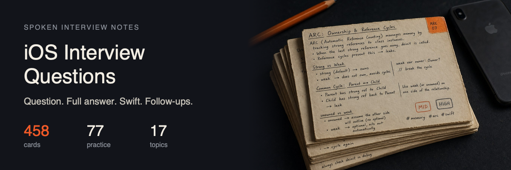

# iOS Interview Questions

<p align="center">
  
</p>

<p align="center">
  <a href="#start-here">High frequency</a> · <a href="#swift">Swift</a> · <a href="#memory">Memory</a> · <a href="#concurrency">Concurrency</a> · <a href="#architecture">Architecture</a> · <a href="#uikit">UIKit</a> · <a href="#swiftui">SwiftUI</a> · <a href="#combine">Combine</a> · <a href="#networking">Networking</a> · <a href="#persistence">Persistence</a> · <a href="#performance">Performance</a> · <a href="#security">Security</a> · <a href="#accessibility">Accessibility</a> · <a href="#frameworks">Frameworks</a> · <a href="#objc-runtime">Objective-C runtime</a> · <a href="#system-design">System design</a> · <a href="#algorithms">Algorithms</a> · <a href="#behavioral">Behavioral / process</a> · <a href="CONTRIBUTING.md">Contributing</a>
</p>

Spoken-answer notes for iOS interviews. Open a topic, read the question, then press **Show answer** for the spoken version and the Swift.

**458** cards · **381** with a written answer · **77** practice prompts · **249** often asked · **17** topics

English first. Russian twins come later, same files and `{#slug}` anchors. Answers are rewritten, not copied.

## How to study

1. Start with **[High frequency](#start-here)** — open one topic, one question.
2. Or jump a subject in the row above and open that deck.
3. Inside a topic the cards sit by **Junior / Mid / Senior**.
4. Practice cards are prompts only. Talk them through. There is no pasted solution.

<h2 id="start-here">High frequency</h2>

The questions that show up across sources. Open a topic, say the answer, then reveal.

<details>
<summary><strong>Swift</strong> · 51 often asked</summary>

<table>
<tr><td>

</td></tr>
<tr><td>

<h4 align="center">== vs ===</h4>

<code>Junior</code> · <code>High</code><br>[Full card](topics/swift.md#identity-vs-equality)

<details>
<summary><strong>Show answer and Swift</strong></summary>

**`==`** is `Equatable` — same *value*. **`===`** is identity — same *instance* (classes only). Two `UIView`s can be `==` if you defined that, and still `!==`. Two structs are never `===`; they have no identity. Typical miss: using `===` on a struct, or `==` on a class that only inherited `NSObject`’s pointer equality and thinking you compared fields.


```swift
class Box { var n: Int; init(_ n: Int) { self.n = n } }
let a = Box(1)
let b = a
let c = Box(1)
a === b   // true
a === c   // false
```


**Then they usually ask**

- Why does `NSObject`’s default `==` often match `===`?
- When do you write `==` on a class by hand?
- How does this show up in a unit test of a cache?

</details>

</td></tr></table>

<table>
<tr><td>

</td></tr>
<tr><td>

<h4 align="center">Access control</h4>

<code>Junior</code> · <code>High</code><br>[Full card](topics/swift.md#access-control)

<details>
<summary><strong>Show answer and Swift</strong></summary>

Swift access is about **who can name the symbol**. Tightest to loosest: `private` (this declaration), `fileprivate` (this file), `internal` (this module, the default), `package` (this Swift package), `public` (importers can use it), `open` (importers can subclass / override — classes only). **`public` is visible across modules but not subclassable from outside**; `open` is. Apple uses that split on purpose — some `NSManagedObject` hooks are `public` so you can call them but not override them. Framework authors use `open` only when subclassing is the contract. App targets almost never need `open`. Typical miss: marking a type `public` but leaving its `init` `internal`, so clients cannot construct it.


```swift
public struct Token {
    public let raw: String
    public init(raw: String) { self.raw = raw }
}

open class Plugin {           // only if clients must subclass
    open func start() {}
}
```


**Then they usually ask**

- `public` vs `open` — when is `open` a mistake?
- `private` vs `fileprivate` after Swift 4 (same-file extensions)?
- Why does a `public` struct need an explicit `public init`?
- How do you expose a getter but keep the setter inside the type?
- Why would a framework author mark a method `public` instead of `open`?

</details>

</td></tr></table>

<table>
<tr><td>

</td></tr>
<tr><td>

<h4 align="center">Any vs AnyObject</h4>

<code>Junior</code> · <code>High</code><br>[Full card](topics/swift.md#any-vs-anyobject)

<details>
<summary><strong>Show answer and Swift</strong></summary>

`Any` is every type: structs, enums, functions, classes. `AnyObject` is **class instances** only (the Swift name for `id`). You need `AnyObject` for `weak` / ObjC interop / “this must be a reference.” You need `Any` for a heterogeneous box (`[Any]`). Both erase information — you downcast to get work done. Typical miss: `[AnyObject]` for a list of structs, or using `Any` where a protocol would do.


```swift
let mixed: [Any] = [1, "a", { 0 }]
let objects: [AnyObject] = [UIView(), NSString(string: "x")]
```


**Then they usually ask**

- `any Protocol` vs `Any` vs `AnyObject`?
- Why is `weak var x: Any` illegal?
- When is a generic better than `Any`?

</details>

</td></tr></table>

<table>
<tr><td>

</td></tr>
<tr><td>

<h4 align="center">Array vs set</h4>

<code>Junior</code> · <code>High</code><br>[Full card](topics/swift.md#array-vs-set)

<details>
<summary><strong>Show answer and Swift</strong></summary>

An **array** keeps order and allows duplicates. A **set** stores unique `Hashable` elements and answers `contains` in expected constant time. Reach for a set when the question is membership or uniqueness, not “the third item.” Interviewers often follow with “how do you unique an array and keep order” — `Set` alone will not do that. Typical mistakes: using an array and `contains` in a loop (quadratic), or assuming `Set` iteration is stable in a way you should depend on. If you need both fast lookup and a stable display order, keep the array and a set of seen keys.


```swift
let tags = ["ios", "swift", "ios"]
let unique = Set(tags)
unique.contains("swift")

func uniqued(_ values: [String]) -> [String] {
    var seen = Set<String>()
    return values.filter { seen.insert($0).inserted }
}
```


**Then they usually ask**

- Why does `Set` require `Hashable` when `Array` does not?
- How do you test that two sets are equal if order differs?
- When is an array still better even if values must be unique?
- Why is `NSSet` / `Set` a hash lookup and `NSArray` a scan?

</details>

</td></tr></table>

<table>
<tr><td>

</td></tr>
<tr><td>

<h4 align="center">Classes vs structs</h4>

<code>Junior</code> · <code>High</code><br>[Full card](topics/swift.md#classes-vs-structs)

<details>
<summary><strong>Show answer and Swift</strong></summary>

**Structs** are value types: assignment copies the value. **Classes** are reference types: assignment copies a pointer to the same instance. Default to a struct unless you need identity (`===`), inheritance, `deinit`, or Objective-C interop. Interviewers want that default plus a real reason to switch, not “classes are more object-oriented.”

A classic trap: two `Person` objects share one `Address` class. Change Brian’s street and Ray moves too — same instance. Fix it with a new `Address` or make `Address` a struct. Another trap: a `mutating` method on a struct is legal, but you cannot call it on a `let` instance. A `let` class can still mutate its properties. Common mistakes: saying structs always live on the stack (they do not), mutating a struct you passed into a function and expecting the caller to see it, or using a class just so two screens can share a bag of mutable state.


```swift
struct Size { var width: Int }
class Box { var size: Size }

var a = Size(width: 10)
var b = a
b.width = 20          // a.width is still 10

let box = Box(size: Size(width: 10))
let also = box
also.size.width = 20  // box.size.width is 20
```


**Then they usually ask**

- When is a class the better model even if you do not need inheritance?
- What does `mutating` mean on a struct method?
- How does copy-on-write change the “structs are copies” story for `Array`?
- Two models share an `Address` class — why does editing one move the other?

</details>

</td></tr></table>

<table>
<tr><td>

</td></tr>
<tr><td>

<h4 align="center">Closures</h4>

<code>Junior</code> · <code>High</code><br>[Full card](topics/swift.md#closures)

<details>
<summary><strong>Show answer and Swift</strong></summary>

A **closure** is a function without a name that can capture values from the scope where it was created. Trailing-closure syntax, `$0`, and `{ [weak self] in }` are the interview surface. Closures are **reference types** even when you store them in a struct — two copies of the struct can share the same closure heap object. That is why they participate in retain cycles when they capture `self` strongly and `self` stores the closure. Non-escaping closures (the default for function arguments) run before the callee returns; escaping ones can run later. You can often collapse `{ (a: String, b: String) -> Bool in return a < b }` down to `{ $0 < $1 }` or even `sort(by: <)`. Typical misses: capturing a huge value graph by accident, and using `unowned self` for a view controller that can dismiss first.


```swift
let add: (Int, Int) -> Int = { $0 + $1 }
let names = ["zoe", "ada"].sorted { $0 < $1 }

func makeCounter() -> () -> Int {
    var n = 0
    return { n += 1; return n }
}
```


**Then they usually ask**

- What does a capture list actually do?
- Why can a closure keep an object alive?
- When do you need `self.` inside a closure?
- Is a closure a value type or a reference type?
- What is trailing-closure syntax, and when do you still write the label?

</details>

</td></tr></table>

<table>
<tr><td>

</td></tr>
<tr><td>

<h4 align="center">Dictionary vs array</h4>

<code>Junior</code> · <code>High</code><br>[Full card](topics/swift.md#dictionary-vs-array)

<details>
<summary><strong>Show answer and Swift</strong></summary>

An **array** is an ordered list you index with `Int`. A **dictionary** is a hash map: you look up a value by a `Hashable` key. Interviewers are checking whether you pick the collection for the access pattern, not by habit. Use an array when order and duplicates matter, or when you iterate everything. Use a dictionary when you keep asking “give me the thing with this id.” Typical miss: scanning an array of models with `first(where:)` in a hot path, or treating dictionary iteration as a positional index. Since Swift 4, dictionaries keep insertion order when you iterate, but you still do not subscript them with `0`.


```swift
struct User { let id: String; let name: String }

let users = [User(id: "1", name: "Ada"), User(id: "2", name: "Grace")]
let byID = Dictionary(uniqueKeysWithValues: users.map { ($0.id, $0) })
let ada = byID["1"]
```


**Then they usually ask**

- What happens if you build a dictionary and two keys collide?
- When would you keep both an array and a dictionary of the same data?
- Why must dictionary keys be `Hashable`?

</details>

</td></tr></table>

<table>
<tr><td>

</td></tr>
<tr><td>

<h4 align="center">Enums</h4>

<code>Junior</code> · <code>High</code><br>[Full card](topics/swift.md#enums)

<details>
<summary><strong>Show answer and Swift</strong></summary>

A Swift enum is a value type that is one of a closed set of cases. Add a raw value (`String`, `Int`) when you persist or decode it. Add **associated values** when cases carry different payloads (`Result`, network errors). Enums can have methods, computed properties, and `switch` must be exhaustive — that is the interview win over a pile of booleans. Typical mistake: `isLoading` + `error` + `value` as three optionals instead of `enum State { idle, loading, failed(Error), ready(Value) }`.


```swift
enum LoadState<Value> {
    case idle
    case loading
    case failed(Error)
    case ready(Value)
}
```


**Then they usually ask**

- Raw value vs associated value — can a case have both?
- Why is an exhaustive `switch` safer than `if` on booleans?
- When do you still want a struct instead of an enum?
- What is an `indirect` enum, and why does a tree need it?

</details>

</td></tr></table>

<table>
<tr><td>

</td></tr>
<tr><td>

<h4 align="center">Float vs Double vs CGFloat</h4>

<code>Junior</code> · <code>High</code><br>[Full card](topics/swift.md#float-double-cgfloat)

<details>
<summary><strong>Show answer and Swift</strong></summary>

**`Double`** is a 64-bit IEEE float and Swift’s default for literals like `3.14`. **`Float`** is 32-bit — half the precision, smaller, and almost never what you want unless an API or a file format forces it. **`CGFloat`** is Core Graphics’ scalar: on modern 64-bit Apple platforms it is the same width as `Double`, but it is still a different type. Interviewers ask this because UIKit and Core Animation speak `CGFloat` and people slap `as` on numbers until it compiles. Do not mix them without an explicit conversion, and do not store model data as `CGFloat` just because a view used it.


```swift
import CoreGraphics

let temperature: Double = 36.6
let hairline: CGFloat = 1 / 3
let width = CGFloat(temperature) + hairline
let compact = Float(temperature)
```


**Then they usually ask**

- Why does `let x = 1.0` infer `Double` and not `CGFloat`?
- What breaks if you compare `Float` and `Double` values that “look” the same?
- When would you actually choose `Float` in an iOS app?

</details>

</td></tr></table>

<table>
<tr><td>

</td></tr>
<tr><td>

<h4 align="center">Hashable, Equatable, Comparable</h4>

<code>Junior</code> · <code>High</code><br>[Full card](topics/swift.md#hashable-equatable)

<details>
<summary><strong>Show answer and Swift</strong></summary>

**`Equatable`** is `==`. **`Hashable`** is `Equatable` plus a stable `hash(into:)` so the type can be a `Set` / `Dictionary` key. **`Comparable`** is `<` (and the rest) so you can sort. Synthesize them when all stored properties already conform — do not write a custom hash that ignores a field you use in `==`. Typical miss: mutating a property that participates in `==` after the value is in a set.


```swift
struct UserID: Hashable, Comparable {
    let raw: String
    static func < (l: Self, r: Self) -> Bool { l.raw < r.raw }
}
```


**Then they usually ask**

- Why must `==` and `hash` agree?
- When do you write `hash(into:)` by hand?
- `Comparable` vs a `sort` closure?
- Two values, same `hashValue`, different `==` — can both live in a `Set`?
- `Identifiable` vs `Hashable` — which one does `ForEach` actually need?

</details>

</td></tr></table>

<table>
<tr><td>

</td></tr>
<tr><td>

<h4 align="center">Higher-order functions</h4>

<code>Junior</code> · <code>High</code><br>[Full card](topics/swift.md#higher-order-functions)

<details>
<summary><strong>Show answer and Swift</strong></summary>

A higher-order function takes or returns a function: `map`, `filter`, `compactMap`, `reduce`, `sorted`, `forEach`. You pass a closure instead of writing a loop. Prefer them when the transform is a one-liner; keep a `for` when you have early exits or multiple outputs. Typical miss: a `forEach` with side effects you then cannot test, or `reduce` that is just a worse `map`.


```swift
let raw = ["1", "3", "4", "6"]
let evenSum = raw.compactMap(Int.init).filter { $0.isMultiple(of: 2) }.reduce(0, +)
```


**Then they usually ask**

- `map` vs `compactMap` vs `flatMap`?
- When is a `for` loop clearer?
- What does `sorted(by:)` use under the hood (introsort-family, not Timsort)?
- `for` vs `forEach` — can you `return` / `break`?

</details>

</td></tr></table>

<table>
<tr><td>

</td></tr>
<tr><td>

<h4 align="center">Identifiable</h4>

<code>Junior</code> · <code>High</code><br>[Full card](topics/swift.md#identifiable)

<details>
<summary><strong>Show answer and Swift</strong></summary>

`Identifiable` is a stable **`id`** so SwiftUI / diffable lists can tell rows apart. `ForEach(items)` wants `Identifiable` (or an explicit `id: \.key`). The `id` must not change when the row’s display text does — a UUID or a server primary key, not `name`. `Hashable` is for sets and dictionary keys; you can be `Identifiable` without being a good `Dictionary` key if `id` is the only identity. Typical miss: `ForEach(0..<count)` with a changing array, or `id: \.self` on a `String` that is not unique.


```swift
struct Team: Identifiable, Hashable {
    let id: UUID
    var name: String
}

ForEach(teams) { team in
    Text(team.name)
}
```


**Then they usually ask**

- Why is `id: \.name` a bug when two teams can share a name?
- `Identifiable` + `Hashable` — can `id` and `==` disagree?
- Diffable snapshot item IDs — same rule?

</details>

</td></tr></table>

<table>
<tr><td>

</td></tr>
<tr><td>

<h4 align="center">Implicit vs explicit types</h4>

<code>Junior</code> · <code>High</code><br>[Full card](topics/swift.md#implicit-vs-explicit)

<details>
<summary><strong>Show answer and Swift</strong></summary>

**Explicit** means you wrote the type (`var name: String = "a"`). **Implicit** means the compiler inferred it (`var name = "a"`). That is **type inference**: the compiler picks a concrete type from context. It is not dynamic typing — the type is fixed at compile time. Write the type when the right-hand side is ambiguous (`[]`, `nil`, a protocol existential) or when the name does not make the type obvious. Typical miss: `var x = 0` and later assigning a `Double`, or thinking inference is slower at runtime.


```swift
var name = "onthecodepath"           // inferred String
var port: Int = 443                  // explicit
var items: [User] = []               // explicit — [] alone is ambiguous
```


**Then they usually ask**

- When does inference fail (`nil`, empty array)?
- Is an inferred type any less safe than an annotated one?
- When do you annotate a closure’s parameter types?
- Type inference vs type safety — do they conflict?

</details>

</td></tr></table>

<table>
<tr><td>

</td></tr>
<tr><td>

<h4 align="center">Nil coalescing</h4>

<code>Junior</code> · <code>High</code><br>[Full card](topics/swift.md#nil-coalescing)

<details>
<summary><strong>Show answer and Swift</strong></summary>

**`??`** unwraps an optional or uses the value on the right. The right-hand side is only evaluated if the left is `nil`, so it is cheap to write `name ?? loadDefault()`. You can chain `a ?? b ?? c`. Interviewers want this instead of `if let` when you truly have a default. Hiding a programming error behind `"unknown"` or `0` is the usual smell — you wanted `guard` or `throw`. The right side must match the unwrapped type; `?? []` is the everyday “empty if missing” move.


```swift
let nickname: String? = nil
let display = nickname ?? "Guest"

let counts: [String: Int] = [:]
let taps = counts["home"] ?? 0
```


**Then they usually ask**

- Is the right-hand side of `??` always evaluated?
- How do you chain several optionals with defaults?
- When is `??` worse than `guard let`?

</details>

</td></tr></table>

<table>
<tr><td>

</td></tr>
<tr><td>

<h4 align="center">Optional chaining</h4>

<code>Junior</code> · <code>High</code><br>[Full card](topics/swift.md#optional-chaining)

<details>
<summary><strong>Show answer and Swift</strong></summary>

**`foo?.bar`** reaches into an optional and bails to `nil` if any step is `nil`. The whole expression becomes optional, even if `bar` was not. You can chain methods and subscripts: `user?.address?.street.prefix(1)`. Interviewers contrast this with force unwrap and with `if let` when you need a stable unwrap for several lines. A chain that ends in `Void` is `Void?`, which is why `foo?.doSideEffect()` is legal and easy to ignore. Do not hide a long chain of UI queries behind `?.` and then wonder why nothing happened.


```swift
class Node {
    var next: Node?
    var value = ""
}

let head = Node()
let deep = head.next?.next?.value   // String?
head.next?.value = "child"
```


**Then they usually ask**

- Why is the type of `foo?.count` optional even if `count` is `Int`?
- How does optional chaining interact with assignment?
- When should you stop chaining and bind with `guard let`?

</details>

</td></tr></table>

<table>
<tr><td>

</td></tr>
<tr><td>

<h4 align="center">Property observers</h4>

<code>Junior</code> · <code>High</code><br>[Full card](topics/swift.md#property-observers)

<details>
<summary><strong>Show answer and Swift</strong></summary>

**`willSet`** and **`didSet`** run around a stored property assignment. `willSet` sees `newValue` before the write; `didSet` sees `oldValue` after. They do not run when you set the property from the type’s own `init`, which surprises people who put logging there. They are for reacting to change — clamp, notify, sync a side table — not for computing a value; that is a computed property. Setting the same property again inside `didSet` can recurse, so you need a condition. Do not confuse observers with KVO; these are Swift-only and do not fire for wrapped `self.x` mutations the way people hope unless you actually assign the property.


```swift
var score = 0 {
    willSet { print("heading to \(newValue)") }
    didSet { print("was \(oldValue)") }
}

score = 10
```


**Then they usually ask**

- Why don’t observers fire in `init`?
- What happens if `didSet` assigns to the same property?
- How do observers behave on a property inside a struct you mutate through a `var`?

</details>

</td></tr></table>

<table>
<tr><td>

</td></tr>
<tr><td>

<h4 align="center">Protocols</h4>

<code>Junior</code> · <code>High</code><br>[Full card](topics/swift.md#protocols)

<details>
<summary><strong>Show answer and Swift</strong></summary>

A **protocol** is a contract: properties and methods a type promises to implement. You use it to talk to “anything that can persist” without naming the concrete class, which is how you test and how you keep UI away from URLSession. Conformance can be on the type or in an extension. Interviewers will push from “it’s like an interface” into existentials (`any`), associated types, and default implementations. The usual mistakes: protocols with twenty optional-ish methods that nobody implements correctly, and putting a protocol on a type just to inject something that should have been a function.


```swift
protocol Describable {
    var summary: String { get }
}

struct User: Describable {
    let name: String
    var summary: String { name }
}

func printSummary(_ item: any Describable) {
    print(item.summary)
}
```


**Then they usually ask**

- What is the difference between `any Describable` and `some Describable`?
- Can a protocol require an initializer?
- When do you use a protocol with an associated type instead of a generic function?

</details>

</td></tr></table>

<table>
<tr><td>

</td></tr>
<tr><td>

<h4 align="center">Stored vs computed properties</h4>

<code>Junior</code> · <code>High</code><br>[Full card](topics/swift.md#stored-vs-computed)

<details>
<summary><strong>Show answer and Swift</strong></summary>

A **stored** property occupies memory on the instance (`let` / `var` with no getter). A **computed** property is a getter (and optional setter) that derives a value each time. `willSet` / `didSet` attach only to stored properties. Computed properties can live on enums and in protocol extensions; stored ones cannot (except on classes/structs). Typical miss: a computed property that does I/O or allocates, so a loop that reads `view.frame` five times becomes five times the work — cache it if you need it twice.


```swift
struct Size {
    var width: Double
    var height: Double
    var area: Double { width * height }
}
```


**Then they usually ask**

- Can a computed property be `lazy`?
- Where do property observers fire relative to a custom setter?
- Why might you back a computed property with a private stored cache?

</details>

</td></tr></table>

<table>
<tr><td>

</td></tr>
<tr><td>

<h4 align="center">String? vs String!</h4>

<code>Junior</code> · <code>High</code><br>[Full card](topics/swift.md#string-optional-vs-iuo)

<details>
<summary><strong>Show answer and Swift</strong></summary>

**`String?`** is a real optional: you must unwrap it. **`String!`** is an implicitly unwrapped optional — still an optional at heart, but Swift unwraps it for you and crashes if it is `nil`. IUOs exist for two-phase setup: outlets, `awakeFromNib`, and some Objective-C imports. New Swift code should take `String?` or a non-optional once the value exists. Interviewers want “I do not use `!` to avoid typing `?`.” `IBOutlet var title: UILabel!` is historical; many teams now write `?` or load views in `init`.


```swift
var name: String? = "Ada"
var title: String! = "Engineer"

print(name?.count as Any)   // Optional(3)
print(title.count)          // 8 — traps if title is nil
title = nil
```


**Then they usually ask**

- Is `String!` a different type at runtime from `String?`?
- Why did UIKit outlets use `!` for so long?
- What happens if you pass a `String!` into a function that takes `String`?

</details>

</td></tr></table>

<table>
<tr><td>

</td></tr>
<tr><td>

<h4 align="center">Swift collections</h4>

<code>Junior</code> · <code>High</code><br>[Full card](topics/swift.md#collections)

<details>
<summary><strong>Show answer and Swift</strong></summary>

`Array` is a **value type** with copy-on-write — assignment looks like a copy, the buffer is shared until mutation. It is an ordered random-access list — default choice, `O(1)` subscript. `Set` is unordered unique `Hashable` values — membership and uniqueness, not index. `Dictionary` is a hash map from `Hashable` keys. `Range` / `ClosedRange` are intervals, not bags of elements, though they are sequences. All of these sit on `Sequence` / `Collection` so `map` and `filter` work the same. None of them are thread-safe. Pick `Set` when you keep asking “have I seen this id?”; pick `Array` when order matters; do not use a dictionary as an ordered feed. Typical mistake: `contains` on a large `Array` in a hot path instead of a `Set`.


```swift
let ids = Set([1, 2, 2, 3])          // {1, 2, 3}
let names = ["a": 1, "b": 2]
let firstThree = 0..<3
let ordered = [3, 1, 2]
```


**Then they usually ask**

- When is `Set` faster than `Array.contains`?
- Why is `Dictionary` unordered, and what is `Dictionary` iteration order in practice?
- How do `Range` and `Array` both conform to `Collection`?
- Sequence vs Collection — can you walk a Sequence twice?

</details>

</td></tr></table>

<table>
<tr><td>

</td></tr>
<tr><td>

<h4 align="center">Type safety</h4>

<code>Junior</code> · <code>High</code><br>[Full card](topics/swift.md#type-safety)

<details>
<summary><strong>Show answer and Swift</strong></summary>

Swift checks types **at compile time**. You cannot assign a `String` to an `Int` without a conversion. Optionals make “maybe missing” part of the type, so `nil` is not a silent crash later. Type inference still picks a concrete type — it is not dynamic typing. Typical miss: `as!` / `try!` to “get past” the compiler.


```swift
let n = 3            // Int
// let n: Int = "3"  // does not compile
let parsed = Int("3") // Int?, not Int
```


**Then they usually ask**

- Type safety vs type inference — do they conflict?
- How do optionals fit this story?
- What does `Any` do to the safety?

</details>

</td></tr></table>

<table>
<tr><td>

</td></tr>
<tr><td>

<h4 align="center">Value type vs reference type</h4>

<code>Junior</code> · <code>High</code><br>[Full card](topics/swift.md#value-vs-reference)

<details>
<summary><strong>Show answer and Swift</strong></summary>

A **value type** is copied on assignment: structs, enums, tuples. A **reference type** is shared: classes, actors, and closures. This is the semantics question; classes-vs-structs is the language feature that usually implements it. Interviewers want you to talk about identity, mutation you can see from two variables, and what `let` actually protects. Copy-on-write means `Array` and `String` look like values but share storage until a write. The trap is a struct that stores a class — the struct copies, the class does not.


```swift
struct Value { var n: Int }
class Ref { var n: Int; init(n: Int) { self.n = n } }

var v1 = Value(n: 1)
var v2 = v1
v2.n = 2                 // v1.n == 1

let r1 = Ref(n: 1)
let r2 = r1
r2.n = 2                 // r1.n == 2
```


**Then they usually ask**

- Are closures value types or reference types?
- What does `===` tell you that `==` does not?
- How can a struct still share mutable state?
- Why are `Int`, `String`, and `Array` structs instead of classes?

</details>

</td></tr></table>

<table>
<tr><td>

</td></tr>
<tr><td>

<h4 align="center">What is an optional</h4>

<code>Junior</code> · <code>High</code><br>[Full card](topics/swift.md#optionals)

<details>
<summary><strong>Show answer and Swift</strong></summary>

An optional is **`enum Optional<Wrapped> { case none, some(Wrapped) }`**. `nil` is `.none`. That is why `switch`, `map`, and `??` work — it is a real type, not a pointer flag. You unwrap with `if let` / `guard let`, `??`, optional chaining, or (rarely) `!`. IUOs (`String!`) are still optionals that unwrap implicitly and crash if `nil`. Typical mistakes: “optional means a pointer that can be NULL,” and treating `Optional.none` as a value you persist without encoding the absence.


```swift
enum Optional<Wrapped> {
    case none
    case some(Wrapped)
}

let n: Int? = Int("x") // .none
print(n.map { $0 * 2 } ?? 0)
```


**Then they usually ask**

- How is this different from ObjC `nil` messaging?
- Is `Optional` an enum or a struct?
- What does `map` on an optional return?
- When is `Optional.none` the wrong model (empty string vs missing)?
- Is `nil` a different value from `Optional.none`?
- Name every common unwrap: `if let`, `guard let`, `??`, `?`, `map` / `flatMap`, `!`, IUO — when is each honest?

</details>

</td></tr></table>

<table>
<tr><td>

</td></tr>
<tr><td>

<h4 align="center">deinit</h4>

<code>Junior</code> · <code>High</code><br>[Full card](topics/swift.md#deinit)

<details>
<summary><strong>Show answer and Swift</strong></summary>

`deinit` is the class (or actor) teardown hook: it runs when the last strong reference goes away, just before the object is destroyed. Structs and enums do not have it — they have no identity to tear down. You use it to invalidate a `Timer`, stop a socket, or assert in debug that cleanup ran. You cannot `throw`, you cannot `await` in a non-isolated `deinit` (isolated `deinit` on actors is the newer exception), and you must not start work that needs `self` to stay alive. Typical miss: capturing `self` strongly in a timer you only invalidate in `deinit` — the `deinit` never runs.


```swift
final class Ticker {
    private var timer: Timer?

    func start() {
        timer = Timer.scheduledTimer(withTimeInterval: 1, repeats: true) { [weak self] _ in
            self?.tick()
        }
    }

    deinit { timer?.invalidate() }
}
```


**Then they usually ask**

- Why is there no `deinit` on a struct?
- Which thread runs `deinit`?
- Isolated `deinit` on an actor — what did that fix?

</details>

</td></tr></table>

<table>
<tr><td>

</td></tr>
<tr><td>

<h4 align="center">guard</h4>

<code>Junior</code> · <code>High</code><br>[Full card](topics/swift.md#guard)

<details>
<summary><strong>Show answer and Swift</strong></summary>

**`guard`** is an early-exit check. The condition must be true or you leave the scope immediately. That is why `guard let` can bind names for the rest of the function: the compiler knows they exist after the line. You can `guard` any `Bool`, not just optionals — `guard index < count else { return }`. Interviewers like `guard` because it keeps the happy path flat. The else block cannot fall through; if you write `print` and forget `return`, it will not compile. Nested `guard`s that all return the same error should often become one function that throws.


```swift
func firstWord(in text: String?) -> String? {
    guard let text, !text.isEmpty else { return nil }
    return text.split(separator: " ").first.map(String.init)
}
```


**Then they usually ask**

- Why must `guard`’s else exit the current scope?
- Can you `guard` a boolean that is not an optional bind?
- How do you `guard` several optionals at once?

</details>

</td></tr></table>

<table>
<tr><td>

</td></tr>
<tr><td>

<h4 align="center">if let vs guard let</h4>

<code>Junior</code> · <code>High</code><br>[Full card](topics/swift.md#if-let-vs-guard-let)

<details>
<summary><strong>Show answer and Swift</strong></summary>

**`if let`** unwraps for the `if` body only. **`guard let`** unwraps for the rest of the scope and forces you to leave on failure (`return`, `throw`, `break`, `continue`, or something that never returns). Prefer `guard` for preconditions at the top of a function so the happy path stays unindented. Prefer `if let` when both the nil and non-nil paths do real work. Swift’s shorthand `if let name` / `guard let name` binds the same name. The miss is a pyramid of `if let` that should have been three `guard`s.


```swift
func greet(_ name: String?) {
    guard let name else { return }
    print("hi \(name)")
}

func label(_ name: String?) -> String {
    if let name {
        return name
    }
    return "anonymous"
}
```


**Then they usually ask**

- What statements are legal in a `guard` else block?
- When is `if let` clearer than `guard let`?
- How does optional binding interact with `async` / `throws`?

</details>

</td></tr></table>

<table>
<tr><td>

</td></tr>
<tr><td>

<h4 align="center">lazy</h4>

<code>Junior</code> · <code>High</code><br>[Full card](topics/swift.md#lazy)

<details>
<summary><strong>Show answer and Swift</strong></summary>

`lazy var` is a stored property that is computed **once**, the first time you read it, then kept. Use it for work you might never need — building a heavy formatter, opening a file, wiring a child object. It must be `var` because the first read mutates storage. It is **not** thread-safe: two threads can run the initializer twice. It is not `let`, and it is not a computed property (those recompute every time). A `let` that still needs work at init is an immediately-invoked closure: `let area = { Double.pi * r * r }()` — eager, once, and safe to share. Typical mistakes: `lazy` for a cheap `DateFormatter` you always use, and capturing `self` in a `lazy` closure that then leaks.


```swift
final class Report {
    lazy var formatter: DateFormatter = {
        let f = DateFormatter()
        f.dateStyle = .medium
        return f
    }()
}
```


**Then they usually ask**

- `lazy var` vs a computed `var` vs `let` initialized in `init`?
- Why is `lazy` unsafe across threads?
- How do you make a `let`-like value that is computed once at runtime?
- Can a struct’s `lazy` property be read from a `let` instance?

</details>

</td></tr></table>

<table>
<tr><td>

</td></tr>
<tr><td>

<h4 align="center">let vs var</h4>

<code>Junior</code> · <code>High</code><br>[Full card](topics/swift.md#let-vs-var)

<details>
<summary><strong>Show answer and Swift</strong></summary>

`let` is a binding you cannot reassign. `var` is a binding you can. For a **value type**, `let` also freezes stored properties — you cannot mutate a `let` struct. For a **class**, `let` only freezes the reference: you cannot point it at another instance, but you can still change the object's properties. That is the follow-up interviewers want. Prefer `let` until mutation is required; it documents intent and lets the compiler catch accidents. Typical mistake: “`let` means the object is immutable” while holding a `let` class full of `var` properties.


```swift
struct Point { var x: Int }
class Box { var value: Int = 0 }

let p = Point(x: 1)
// p.x = 2 // error

let box = Box()
box.value = 2 // ok
// box = Box() // error
```


**Then they usually ask**

- Why can you mutate a `let` class but not a `let` struct?
- How does this interact with `mutating` methods?
- When would you use `let` on a reference type on purpose?

</details>

</td></tr></table>

<table>
<tr><td>

</td></tr>
<tr><td>

<h4 align="center">map vs compactMap</h4>

<code>Junior</code> · <code>High</code><br>[Full card](topics/swift.md#map-vs-compactmap)

<details>
<summary><strong>Show answer and Swift</strong></summary>

**`map`** transforms every element and keeps the same count. **`compactMap`** transforms and drops `nil`, so you get a shorter non-optional array. This is the everyday “parse these strings into ints” question. People still reach for `flatMap` on optionals out of muscle memory; that overload moved to `compactMap`. Another miss: `map` + `filter { $0 != nil }` + force-unwrap, which is just `compactMap` written the long way. `flatMap` is still the right name when you map to an array and want one flattened array.


```swift
let raw = ["1", "x", "3"]
let mapped = raw.map(Int.init)         // [1, nil, 3]
let compact = raw.compactMap(Int.init) // [1, 3]

let nested = [[1, 2], [3]]
let flat = nested.flatMap { $0 }       // [1, 2, 3]
```


**Then they usually ask**

- What does `map` on an optional do?
- When is `flatMap` the right choice instead of `compactMap`?
- How would you rewrite `compactMap` with `reduce`?

</details>

</td></tr></table>

<table>
<tr><td>

</td></tr>
<tr><td>

<h4 align="center">mutating</h4>

<code>Junior</code> · <code>High</code><br>[Full card](topics/swift.md#mutating)

<details>
<summary><strong>Show answer and Swift</strong></summary>

A struct/enum method that writes `self` (or a stored property) must be marked **`mutating`**. It replaces the whole value; that is why you cannot call it on a `let` instance. Class methods do not need `mutating` — the reference stays, the object changes. Typical miss: “mutating makes it a class.”


```swift
struct Counter {
    var n = 0
    mutating func bump() { n += 1 }
}

var c = Counter()
c.bump()
// let frozen = Counter(); frozen.bump() // error
```


**Then they usually ask**

- Why is `mutating` illegal on a class?
- What does `self = …` mean inside a mutating method?
- How does this interact with a `let` property that holds a struct?

</details>

</td></tr></table>

<table>
<tr><td>

</td></tr>
<tr><td>

<h4 align="center">static</h4>

<code>Junior</code> · <code>High</code><br>[Full card](topics/swift.md#static)

<details>
<summary><strong>Show answer and Swift</strong></summary>

`static` belongs to the **type**, not an instance. `static let` is a shared constant. `static func` is called as `Foo.bar()`. On a class, `class func` is overridable; `static func` is not (it is `final` on the type). Stored `static var` is shared mutable state — treat it like a singleton field. Typical mistake: using `static var` as a cache and wondering why tests leak state across cases.


```swift
enum Theme {
    static let accent = "teal"
    static func label(_ name: String) -> String { "\(accent)-\(name)" }
}

Theme.label("button")
```


**Then they usually ask**

- `static` vs `class` on a method?
- Where does a `static var` live, and is it thread-safe?
- When is `static` better than a singleton object?

</details>

</td></tr></table>

<table>
<tr><td>

</td></tr>
<tr><td>

<h4 align="center">switch</h4>

<code>Junior</code> · <code>High</code><br>[Full card](topics/swift.md#switch)

<details>
<summary><strong>Show answer and Swift</strong></summary>

Swift `switch` must be **exhaustive**, can match tuples, ranges, optionals, and enum associated values, and can add `where`. No implicit fallthrough — use `fallthrough` if you really want it. That is why it beats a pile of `if` for state. Typical miss: `default` that swallows a new enum case you should have handled.


```swift
switch state {
case .ready(let value) where value > 0: show(value)
case .ready: showEmpty()
case .loading, .idle: showSpinner()
case .failed: showRetry()
}
```


**Then they usually ask**

- Why is exhaustiveness a safety feature?
- `where` vs a nested `if`?
- How do you match two values at once (a tuple)?

</details>

</td></tr></table>

<table>
<tr><td>

</td></tr>
<tr><td>

<h4 align="center">try vs try? vs try!</h4>

<code>Junior</code> · <code>High</code><br>[Full card](topics/swift.md#try-try-try)

<details>
<summary><strong>Show answer and Swift</strong></summary>

**`throws`** marks a function that *may* fail; **`throw`** is the statement that actually produces the error. **`try`** calls a throwing function and lets the error keep going — the caller is `throws` or you are inside `do/catch`. **`try?`** turns failure into `nil` and throws the error away. **`try!`** unwraps and crashes if an error appears. **`rethrows`** only throws if a closure argument throws (`map` is the usual example). Interviewers want a hard rule: `try!` is for “if this fails the program is already wrong,” never for network or decoding. `try?` is fine when you truly do not care why it failed; otherwise catch and log. Mixing `try?` with a later force-unwrap is just `try!` with extra steps.


```swift
enum AgeError: Error { case negative }

func checked(_ age: Int) throws -> Int {
    guard age >= 0 else { throw AgeError.negative }
    return age
}

let ok = try? checked(9)      // Optional(9)
let no = try? checked(-1)     // nil
// let crash = try! checked(-1)
```


**Then they usually ask**

- How do you keep the error when you do not want the function to be `throws`?
- When is `try!` acceptable in app code?
- What does `try?` do to the success type?
- `throw` vs `throws` vs `rethrows`?

</details>

</td></tr></table>

<table>
<tr><td>

</td></tr>
<tr><td>

<h4 align="center">Associated types</h4>

<code>Mid</code> · <code>High</code><br>[Full card](topics/swift.md#associated-types)

<details>
<summary><strong>Show answer and Swift</strong></summary>

An associated type is a placeholder the conforming type fills in — `Collection.Element`, `Iterator.Element`. The protocol is then a **PAT**: it is not a concrete type by itself, because the compiler does not know the placeholders. You cannot write `let c: Collection`. You use a generic (`func sum<C: Collection>(_ c: C)`), an opaque `some Collection<Int>`, or `any Collection<Int>` (primary associated types). Type erasure (`AnyCollection`) is the older escape hatch. Interviewers want “why `let x: Iterator` does not compile,” not a recitation of `associatedtype`. Typical mistake: adding an associated type when a generic method on the protocol would do.


```swift
protocol Stack {
    associatedtype Element
    mutating func push(_ value: Element)
    mutating func pop() -> Element?
}

struct IntStack: Stack {
    private var storage: [Int] = []
    mutating func push(_ value: Int) { storage.append(value) }
    mutating func pop() -> Int? { storage.popLast() }
}

func peekCount<S: Stack>(_ stack: S) -> String { "stack" }
```


**Then they usually ask**

- Why did `any Collection` need primary associated types to be useful?
- Associated type vs a generic on the protocol method?
- How would you type-erase a PAT without `any`?

</details>

</td></tr></table>

<table>
<tr><td>

</td></tr>
<tr><td>

<h4 align="center">Copy-on-Write</h4>

<code>Mid</code> · <code>High</code><br>[Full card](topics/swift.md#copy-on-write)

<details>
<summary><strong>Show answer and Swift</strong></summary>

Copy-on-write means assignment **shares storage** until someone mutates. `Array`, `String`, and `Dictionary` do this: `var b = a` is cheap; `b.append` copies only if the buffer is not uniquely referenced. You build the same thing with a class heap buffer plus `isKnownUniquelyReferenced`. If the buffer is unique, mutate in place; if not, copy, then mutate. Interviewers want the uniqueness check, not “structs are cheap.” Typical mistakes: putting a class inside a struct and thinking you got value semantics, or copying on every write even when the buffer is unique.


```swift
final class Storage { var values: [Int] }

struct List {
    private var storage: Storage

    init(_ values: [Int]) { storage = Storage(values: values) }

    mutating func append(_ value: Int) {
        if !isKnownUniquelyReferenced(&storage) {
            storage = Storage(values: storage.values)
        }
        storage.values.append(value)
    }
}
```


**Then they usually ask**

- Why must `append` be `mutating` if the class can change in place?
- What happens if two threads mutate CoW storage without synchronization?
- Why don't most of your model structs need custom CoW?
- Copy an `[Class]`, `popLast` one array, mutate an element — who sees the new name?

</details>

</td></tr></table>

<table>
<tr><td>

</td></tr>
<tr><td>

<h4 align="center">Custom property wrappers</h4>

<code>Mid</code> · <code>High</code><br>[Full card](topics/swift.md#property-wrappers)

<details>
<summary><strong>Show answer and Swift</strong></summary>

A **property wrapper** is a type marked `@propertyWrapper` with a `wrappedValue`. Writing `@Clamped var score` is sugar for storing a `Clamped` instance and talking to its wrapped value. `$score` is the `projectedValue` if you define one — that is how `@State` exposes a `Binding`. You write wrappers for clamping, UserDefaults, analytics, and locking. Interviewers want you to know they are types, not compiler magic, and that composition and `init` rules get awkward. Do not wrap everything; a function is clearer when there is no reused pattern.


```swift
@propertyWrapper
struct Clamped {
    private var value: Int
    var wrappedValue: Int {
        get { value }
        set { value = min(max(newValue, 0), 10) }
    }
    init(wrappedValue: Int) {
        value = min(max(wrappedValue, 0), 10)
    }
}

struct Game {
    @Clamped var lives = 3
}
```


**Then they usually ask**

- What is `projectedValue` and how do you read it?
- How does `@State` use a property wrapper?
- What are the limits of composing two wrappers on one property?

</details>

</td></tr></table>

<table>
<tr><td>

</td></tr>
<tr><td>

<h4 align="center">Enum associated values</h4>

<code>Mid</code> · <code>High</code><br>[Full card](topics/swift.md#enum-associated-values)

<details>
<summary><strong>Show answer and Swift</strong></summary>

An enum case can carry a **payload**: `case loaded(Data)`, `case failed(Error)`. That is how Swift models a state machine without a pile of optional properties that can be inconsistent. Associated values are not raw values — raw values are a single compile-time companion like `String` for every case. You unwrap with `switch` or `if case`. Interviewers love “loadable” enums versus `isLoading` + `value` + `error`. The miss is putting a mutable class in the payload and then wondering why two `.loaded` values share storage.


```swift
enum LoadState {
    case idle
    case loaded(Data)
    case failed(Error)
}

func title(for state: LoadState) -> String {
    switch state {
    case .idle: return "—"
    case .loaded(let data): return "\(data.count) bytes"
    case .failed: return "failed"
    }
}
```


**Then they usually ask**

- How do associated values differ from raw values?
- Can a case have more than one associated value?
- Why is an enum safer than three optionals for loading UI?

</details>

</td></tr></table>

<table>
<tr><td>

</td></tr>
<tr><td>

<h4 align="center">Escaping vs non-escaping closures</h4>

<code>Mid</code> · <code>High</code><br>[Full card](topics/swift.md#escaping-closures)

<details>
<summary><strong>Show answer and Swift</strong></summary>

A closure is **non-escaping** when it is called before the function returns — that is the default for arguments. **`@escaping`** means the function stores it or calls it later: completion handlers, `DispatchQueue.async`, Combine sinks. Escaping closures can outlive `self`, so they capture strongly unless you write `[weak self]`. Non-escaping closures can use `self` without writing `self.` in many cases, because the compiler knows the cycle cannot form that way. Interviewers will ask why `@escaping` appeared on your completion handler. Marking something `@escaping` “just in case” when you call it synchronously is a lie to the compiler and to readers.


```swift
var handlers: [() -> Void] = []

func store(_ handler: @escaping () -> Void) {
    handlers.append(handler)
}

func runNow(_ handler: () -> Void) {
    handler()
}
```


**Then they usually ask**

- Why can non-escaping closures skip `self.` in instance methods?
- How does `@escaping` interact with `async`?
- What retain cycle does a stored completion handler usually create?
- `@escaping` vs `@autoclosure` — can a parameter be both?

</details>

</td></tr></table>

<table>
<tr><td>

</td></tr>
<tr><td>

<h4 align="center">Extension vs protocol extension</h4>

<code>Mid</code> · <code>High</code><br>[Full card](topics/swift.md#extension-vs-protocol-extension)

<details>
<summary><strong>Show answer and Swift</strong></summary>

A **type extension** adds methods, computed properties, or conformances to one concrete type. A **protocol extension** adds a default implementation to every current and future conformer. Neither can add stored properties. The interview trap is dispatch: if a method lives only in a protocol extension and is **not** a protocol requirement, it is statically dispatched from the compile-time type. Override it on a class and call it through the protocol, and you may still run the default. Put the method on the protocol if you want dynamic dispatch. Use type extensions for conveniences; use protocol extensions for shared behavior you are willing to make a default.


```swift
protocol Speaker {
    func greet()
}

extension Speaker {
    func greet() { print("hello") }
    func wave() { print("wave") }   // not a requirement
}

struct Person: Speaker {
    func greet() { print("hi") }
}

let speaker: any Speaker = Person()
speaker.greet()   // hi
speaker.wave()    // wave — static if only on the extension
```


**Then they usually ask**

- Why can’t extensions add stored properties?
- What is the witness-table vs static-dispatch gotcha?
- When is a free function clearer than a protocol extension?

</details>

</td></tr></table>

<table>
<tr><td>

</td></tr>
<tr><td>

<h4 align="center">Generics</h4>

<code>Mid</code> · <code>High</code><br>[Full card](topics/swift.md#generics)

<details>
<summary><strong>Show answer and Swift</strong></summary>

**Generics** let a function or type work with a placeholder (`T`) that is filled in at the call site. Constraints (`T: Hashable`) are how you keep that placeholder from being “anything” when you need `==` or a hash. You use them for collections, parsers, and “this algorithm does not care what the element is.” Interviewers will walk from `func first<T>` to associated types on protocols. The misses: over-generic APIs nobody can spell, and using `Any` because the generic signature got awkward. A generic type is still one concrete type at runtime for each specialization the compiler builds.


```swift
func first<T>(_ items: [T]) -> T? { items.first }

struct Stack<Element> {
    private var items: [Element] = []
    mutating func push(_ item: Element) { items.append(item) }
    mutating func pop() -> Element? { items.popLast() }
}
```


**Then they usually ask**

- How do you constrain `T` to more than one protocol?
- When do you use an associated type instead of a generic on the protocol itself?
- What is type specialization?

</details>

</td></tr></table>

<table>
<tr><td>

</td></tr>
<tr><td>

<h4 align="center">Method dispatch</h4>

<code>Mid</code> · <code>High</code><br>[Full card](topics/swift.md#method-dispatch)

<details>
<summary><strong>Show answer and Swift</strong></summary>

Swift picks one of three paths. **Static dispatch** (direct call) is the default for structs, enums, `final` class methods, and `private` members the compiler can prove. **Table dispatch** uses a vtable on classes and a **protocol witness table** on protocol existentials — the callee is chosen at runtime. **Objective-C message send** (`objc_msgSend`) is what `@objc dynamic` and most UIKit overrides use: you can swizzle it, and it is slower. `final` and value types are not just style — they let the compiler devirtualize and sometimes inline. Typical mistake: putting a hot method on a protocol existential in a tight loop and wondering why it does not optimize like a generic.


```swift
protocol Drawable { func draw() }
struct Circle: Drawable { func draw() {} }

final class Icon {
    func render() {} // static — class is final
}

func paint(_ item: any Drawable) {
    item.draw() // witness table
}
```


**Then they usually ask**

- What does `dynamic` change?
- Generic `func paint<T: Drawable>(_ item: T)` vs `any Drawable` — which can specialize?
- Why does `final` help performance?
- Can you `override` a method that lives only in a class `extension`?
- A method exists only in a protocol extension — static or witness-table?

</details>

</td></tr></table>

<table>
<tr><td>

</td></tr>
<tr><td>

<h4 align="center">Opaque return types</h4>

<code>Mid</code> · <code>High</code><br>[Full card](topics/swift.md#opaque-return-types)

<details>
<summary><strong>Show answer and Swift</strong></summary>

**`some Protocol`** means “one concrete type that conforms, but I will not name it.” The compiler knows the type; the caller only sees the protocol. That preserves identity and lets the compiler specialize, which is why SwiftUI’s `some View` works. `any Protocol` is a box that can hold different conformers at runtime. With `some`, both branches of an `if` must return the same underlying type — hence `Group` / `AnyView` when they do not. Interviewers want that contrast. Returning `some View` and then changing the body to two different view types is the compile error everyone hits.


```swift
func badge() -> some Equatable {
    "new"
}

func label(highlighted: Bool) -> some Equatable {
    highlighted ? "on" : "off"
}
```


**Then they usually ask**

- How does `some` differ from `any`?
- Why does SwiftUI use `some View` instead of `any View` everywhere?
- What do you do when two branches need different concrete types?

</details>

</td></tr></table>

<table>
<tr><td>

</td></tr>
<tr><td>

<h4 align="center">Result builders</h4>

<code>Mid</code> · <code>High</code><br>[Full card](topics/swift.md#result-builders)

<details>
<summary><strong>Show answer and Swift</strong></summary>

A **result builder** (`@resultBuilder`) turns a stack of statements in a closure into one value by calling `buildBlock`, `buildIf`, `buildEither`, and friends. SwiftUI’s `@ViewBuilder` is the one you already use: a `VStack` body can list views without returning an array. You can write a tiny builder for strings or for test steps. Interviewers want the mechanism, not a SwiftUI tutorial. Builders hide control flow — `if` becomes `buildEither` — so debugging a generic `some View` error is painful. Do not invent a builder when a `[Item]` parameter would do.


```swift
@resultBuilder
struct StringBuilder {
    static func buildBlock(_ parts: String...) -> String {
        parts.joined()
    }
}

@StringBuilder
func title() -> String {
    "Hello"
    " "
    "Swift"
}
```


**Then they usually ask**

- Which `build*` methods does `if/else` need?
- How does `@ViewBuilder` use this?
- When is a result builder the wrong abstraction?
- Why does a `body` with more than ten children need a `Group` / `TupleView` split?

</details>

</td></tr></table>

<table>
<tr><td>

</td></tr>
<tr><td>

<h4 align="center">Result type</h4>

<code>Mid</code> · <code>High</code><br>[Full card](topics/swift.md#result-type)

<details>
<summary><strong>Show answer and Swift</strong></summary>

**`Result<Success, Failure>`** is an enum with `.success` and `.failure` where `Failure` is an `Error`. You use it when a value has to travel through a callback, a cache, or Combine and you cannot `throw` across that boundary. `get()` turns it back into `throws`; `Result { try … }` goes the other way. Interviewers compare it with optionals (`nil` is not a reason) and with `async`/`throws` (often cleaner at a function boundary). Swallowing the error with `try?` just to stuff a `Result` somewhere is the usual smell.


```swift
enum ParseError: Error { case empty }

func parse(_ text: String) -> Result<Int, ParseError> {
    text.isEmpty ? .failure(.empty) : .success(text.count)
}

switch parse("hi") {
case .success(let count): print(count)
case .failure(let error): print(error)
}
```


**Then they usually ask**

- How do you convert `Result` to `throws` and back?
- When do you prefer `async throws` over `Result`?
- Why is `Result<T, Error>` sometimes worse than a typed failure?

</details>

</td></tr></table>

<table>
<tr><td>

</td></tr>
<tr><td>

<h4 align="center">Why immutability matters</h4>

<code>Mid</code> · <code>High</code><br>[Full card](topics/swift.md#immutability)

<details>
<summary><strong>Show answer and Swift</strong></summary>

**Immutability** means a value does not change after you create it: `let` bindings, value types, and APIs that return a new value instead of mutating in place. Interviewers are not grading whether you type `let` by habit. They want the reasons: local reasoning (no surprise mutation behind a shared reference), safer concurrent reads, and fewer side effects when you pass data into a view or a test. `let` on a class instance only freezes the pointer, not the object’s properties. The other miss is treating “I used a struct” as thread-safe while that struct still holds a class or a callback that mutates something else.


```swift
struct Account {
    let id: String
    var balance: Int
}

let frozen = Account(id: "a1", balance: 10)
var working = frozen
working.balance += 5
// frozen.balance is still 10
```


**Then they usually ask**

- Does `let` on a class make the object immutable?
- How does copy-on-write interact with `let` arrays?
- When is a mutable class still the honest model?

</details>

</td></tr></table>

<table>
<tr><td>

</td></tr>
<tr><td>

<h4 align="center">defer</h4>

<code>Mid</code> · <code>High</code><br>[Full card](topics/swift.md#defer)

<details>
<summary><strong>Show answer and Swift</strong></summary>

**`defer`** schedules work for when the current scope exits — `return`, `throw`, `break`, or falling off the end. Several `defer`s run in reverse order, last-in first-out. A `defer` nested *inside* another `defer` runs when that inner block exits, not as a fourth item on the outer stack. You use it so cleanup sits next to setup: close the file, end the activity, unlock. It does not catch errors and it does not create a new scope for failures; it just delays statements. Interviewers like “unlock even if we throw.” Putting `return` inside `defer` is illegal. Reading a variable in `defer` sees the value at exit time, not at the `defer` line.


```swift
func parse() -> Int {
    var step = "start"
    defer { print(step) }
    defer { print("second") }
    step = "done"
    return 1
}
// prints "second" then "done"
```


**Then they usually ask**

- In what order do stacked `defer` blocks run?
- Does `defer` run if the function throws?
- Why is `defer` better than duplicating cleanup before every `return`?
- What prints if one `defer` contains another `defer`?

</details>

</td></tr></table>

<table>
<tr><td>

</td></tr>
<tr><td>

<h4 align="center">final keyword</h4>

<code>Mid</code> · <code>High</code><br>[Full card](topics/swift.md#final)

<details>
<summary><strong>Show answer and Swift</strong></summary>

**`final`** on a class (or method) forbids subclassing or overriding. That is both a design signal — “this type is not an extension point” — and a performance hint, because the compiler can skip vtable dispatch. You see it on helpers, view models, and anything you do not want people to inherit from just to poke at internals. Interviewers also want: `final` is implied for structs and enums already. Marking a class `final` does not make it a value type. The miss is leaving every UIKit subclass open “just in case,” then discovering override soup.


```swift
final class ImageCache {
    func data(for key: String) -> Data? { nil }
}

// class DiskCache: ImageCache {} // error
```


**Then they usually ask**

- Does `final` change ARC or value semantics?
- Why might the compiler generate faster code for `final` methods?
- When do you mark a single method `final` but leave the class open?

</details>

</td></tr></table>

<table>
<tr><td>

</td></tr>
<tr><td>

<h4 align="center">self vs Self</h4>

<code>Mid</code> · <code>High</code><br>[Full card](topics/swift.md#self-vs-self)

<details>
<summary><strong>Show answer and Swift</strong></summary>

**`self`** is the current instance. **`Self`** is the current type — the class, struct, or the concrete conformer in a protocol. You use `Self` in protocol requirements (`func copy() -> Self`), in static factories, and when a subclass should return its own type. **`Self.self`** is the metatype value (`Point.Type`) — what you pass to `JSONDecoder.decode(User.self)`. `self` is what you write in escaping closures and to disambiguate a property from a parameter. Interviewers will put both on a whiteboard because the words sound the same when spoken. `Self` in a protocol is a PAT constraint; it is one reason those protocols needed type erasure for so long.


```swift
struct Point {
    var x: Int
    static func zero() -> Self { Self(x: 0) }
    func doubled() -> Self { Self(x: x * 2) }
}

extension Point {
    func offset(_ x: Int) -> Point {
        var copy = self
        copy.x += x
        return copy
    }
}
```


**Then they usually ask**

- Why do some protocols use `Self` in a return type?
- When must you write `self.` inside a closure?
- How does `Self` behave in a class hierarchy versus a struct?
- `self` vs `Self` vs `Self.self` — one sentence each?

</details>

</td></tr></table>

<table>
<tr><td>

</td></tr>
<tr><td>

<h4 align="center">some vs any</h4>

<code>Mid</code> · <code>High</code><br>[Full card](topics/swift.md#some-vs-any)

<details>
<summary><strong>Show answer and Swift</strong></summary>

`some P` is an **opaque** type: the caller knows it conforms to `P`, the compiler still knows the concrete type. That lets it specialize and keep a small fixed layout. `any P` is an **existential**: the value is boxed, the concrete type can change at runtime, and calls go through a witness table. Use `some` for a return type you control (`some View`). Use `any` when you must store mixed conformers or the type changes. A protocol with associated types often cannot be a bare type — you write `any Collection` or a generic. Typical mistake: “`any` is just the new spelling of the protocol name” without the box cost, or returning `any View` from a SwiftUI `body`.


```swift
func label() -> some Equatable { "ok" }
// let a = label(); let b = label(); a == b // same underlying type

var items: [any Equatable] = [1, "x"]
```


**Then they usually ask**

- Why is `some View` required in `body` instead of `any View`?
- How does this relate to PAT (protocol with associated types)?
- When is the existential box a real performance problem?
- `func f<T: Equatable>(_: T)` vs `func f(_: some Equatable)` — same idea?

</details>

</td></tr></table>

<table>
<tr><td>

</td></tr>
<tr><td>

<h4 align="center">Struct memory layout</h4>

<code>Senior</code> · <code>High</code><br>[Full card](topics/swift.md#struct-memory-layout)

<details>
<summary><strong>Show answer and Swift</strong></summary>

A struct is a contiguous bag of stored properties plus **padding** so each field meets its **alignment**. `MemoryLayout<T>.size` is the payload, `stride` is how far to the next element in an array (size rounded up to alignment), `alignment` is the address multiple. Reordering fields can shrink the stride — `Bool` then `Int64` then `Bool` wastes more than `Int64` then two `Bool`s. That matters in huge arrays and when you pass structs to C. The compiler may also use extra spare bits (for example optionals). Typical mistake: summing `MemoryLayout` of fields and expecting that to equal the struct.


```swift
struct Padded {
    var flag: Bool
    var value: Int64
}

struct Tight {
    var value: Int64
    var flag: Bool
}

MemoryLayout<Padded>.stride // often 16
MemoryLayout<Tight>.stride  // often 16 still on 64-bit, but size can differ
```


**Then they usually ask**

- Why is `stride` what an `Array` uses, not `size`?
- How does this change with `@frozen` and library evolution?
- When would you care enough to reorder properties?

</details>

</td></tr></table>

<table>
<tr><td>

</td></tr>
<tr><td>

<h4 align="center">Type erasure</h4>

<code>Senior</code> · <code>High</code><br>[Full card](topics/swift.md#type-erasure)

<details>
<summary><strong>Show answer and Swift</strong></summary>

**Type erasure** hides a concrete type behind a box that only promises a protocol (or a fixed generic parameter). You need it when callers should not see `IntStore` vs `DiskStore`, or when a protocol has `associatedtype` / `Self` and used to be illegal as a type. `AnySequence`, `AnyPublisher`, `AnyHashable`, and `AnyView` are the standard-library versions of that box. Swift’s `any Protocol` is language-level erasure; `some Protocol` is the opposite — the compiler still knows the concrete type. Interviewers want the “why,” not a memorized `AnyCancellable`. Building your own eraser is easy to get wrong: you forget to forward a method, or you erase so hard you lose `Equatable` and identity.


```swift
protocol Store {
    associatedtype Item
    func all() -> [Item]
}

struct AnyStore<Item>: Store {
    private let _all: () -> [Item]

    init<S: Store>(_ store: S) where S.Item == Item {
        _all = store.all
    }

    func all() -> [Item] { _all() }
}
```


**Then they usually ask**

- How does `any Sequence` differ from `some Sequence`?
- Why did protocols with associated types need `AnySequence` for so long?
- What do you lose when you wrap something in `AnyView`?

</details>

</td></tr></table>

</details>

<details>
<summary><strong>Memory</strong> · 7 often asked</summary>

<table>
<tr><td>

</td></tr>
<tr><td>

<h4 align="center">Explain ARC</h4>

<code>Junior</code> · <code>High</code><br>[Full card](topics/memory.md#explain-arc)

<details>
<summary><strong>Show answer and Swift</strong></summary>

Automatic Reference Counting is the compiler inserting retain and release around class instances. The **inserts are compile time**; the **count is runtime**. Each instance stores how many strong references point at it. Creating an object starts the count at one; sharing it increments; when the last strong reference goes away the count hits zero and `deinit` runs immediately. There is no GC pause.

ARC applies only to reference types. Weak and unowned refs do not increment the count. The compiler can elide redundant retains, but the interview model is still “strong refs keep it alive.” The failure mode is a retain cycle: two objects that hold each other never reach zero, so you break one side with `weak` or `unowned`. Before ARC, Objective-C used **MRC**: you called `retain`, `release`, and `autorelease` yourself. Forget a `release` and you leak; over-release and you crash. `@autoreleasepool` is the leftover of that world — it still drains temporary objects in a tight loop.


```swift
final class Session {
    deinit { print("Session deinit") }
}

var primary: Session? = Session()  // count = 1
var mirror = primary               // count = 2
primary = nil                      // count = 1
mirror = nil                       // count = 0, deinit runs
```


**Then they usually ask**

- Does ARC run on a background thread?
- What happens to the count when you pass an object into a function?
- Is ARC compile time or runtime — what does the compiler insert vs what the process does?
- Why is `deinit` the first thing you add when hunting a leak?
- How did you manage lifetime in Objective-C without ARC?

</details>

</td></tr></table>

<table>
<tr><td>

</td></tr>
<tr><td>

<h4 align="center">How Swift handles memory</h4>

<code>Junior</code> · <code>High</code><br>[Full card](topics/memory.md#swift-memory-management)

<details>
<summary><strong>Show answer and Swift</strong></summary>

Swift does not run a tracing garbage collector. Class instances, actors, and closures live on the heap and are owned by Automatic Reference Counting: each strong reference increments a count, and the object is freed the moment that count hits zero. Structs, enums, and tuples are value types — assignment copies the value (copy-on-write for `Array`, `String`, and `Dictionary`), and they are not reference-counted.

Stack versus heap is a secondary detail. Small values often sit on the stack; collections and class instances use the heap. What interviewers want is the ownership model: values copy, references share, and only the latter are counted.

Typical mistakes: saying “Swift has a GC”; claiming every type is ARC-managed; forgetting that a closure is a reference type and can keep `self` alive.


```swift
struct Point { var x: Int }

final class Box {
    var value: Int
    init(_ value: Int) { self.value = value }
}

var a = Point(x: 1)
var b = a
b.x = 2
// a.x is still 1 — value copy

let box1 = Box(1)
let box2 = box1
box2.value = 2
// box1.value is 2 — same instance
```


**Then they usually ask**

- What does ARC actually count, and what does it ignore?
- Why can a closure leak a view controller?
- When does a struct still allocate on the heap?

</details>

</td></tr></table>

<table>
<tr><td>

</td></tr>
<tr><td>

<h4 align="center">ARC vs garbage collection</h4>

<code>Mid</code> · <code>High</code><br>[Full card](topics/memory.md#arc-vs-gc)

<details>
<summary><strong>Show answer and Swift</strong></summary>

Swift uses **Automatic Reference Counting**, not a tracing garbage collector. Each class instance has a count of how many strong references point at it. When that count hits zero, the object is deallocated immediately. There is no mark-and-sweep pause and no separate GC thread.

That is the contrast interviewers want:

| | ARC | Garbage collection |
| --- | --- | --- |
| When memory is freed | As soon as the last strong reference goes away | Later, when the collector runs |
| Cost | Increment / decrement on retain and release | Periodic heap scans, possible pauses |
| Cycles | A retain cycle keeps objects alive forever | A cycle is still garbage if nothing outside reaches it |
| What it tracks | `class` instances (reference types) | Typically the whole object graph |

Structs, enums, and tuples are value types. They are not reference-counted. Copying them copies the value (copy-on-write for types like `Array` and `String`).

The usual follow-up is cycles. Two objects that hold each other with `strong` never reach a count of zero. Break the cycle with `weak` (optional, zeroes out when the object dies) or `unowned` (non-optional, dangling if you outlive the owner). Closures capture `self` strongly by default; that is the most common leak in UIKit and SwiftUI code.

Typical mistakes: treating ARC as “Swift has a GC”; putting `weak` on a value type; using `unowned` for a view that can disappear before the closure runs; forgetting that `async` work and timers are just more strong captures.


```swift
final class Owner {
    var child: Child?
    deinit { print("Owner deinit") }
}

final class Child {
    weak var owner: Owner?
    deinit { print("Child deinit") }
}

do {
    let owner = Owner()
    let child = Child()
    owner.child = child
    child.owner = owner
}
// Both deinit. If `owner` were strong on Child, neither would.
```


**Then they usually ask**

- Weak vs unowned — when is each the right choice?
- What breaks a retain cycle in a closure?
- Why don't structs participate in ARC?
- What does `unowned(unsafe)` change?

</details>

</td></tr></table>

<table>
<tr><td>

</td></tr>
<tr><td>

<h4 align="center">Identify and resolve a memory leak</h4>

<code>Mid</code> · <code>High</code><br>[Full card](topics/memory.md#memory-leak)

<details>
<summary><strong>Show answer and Swift</strong></summary>

A leak is memory that stays allocated after nothing still needs it. A retain cycle is the usual Swift cause. The three shapes interviewers want named: two classes holding each other strong; a **strong delegate** (protocol back to the owner); a stored closure / `Timer` / Combine sink that captures `self` while `self` owns that work. In **SwiftUI**, the usual tell is a screen that never `deinit`s after you pop it: a `Task { }` in `onAppear` that captures the view model strong, a singleton / `static` store that holds the last screen, or a `UIViewRepresentable` coordinator that points back at `self`. Other leaks: an unbounded cache, an uncancelled `Task`, a `URLSession` you never finish.

You prove it with Instruments Allocations (a graph that never returns to baseline), the Leaks instrument, the Memory Graph Debugger, or a `deinit` that never fires after you pop a screen. Fix the ownership (`weak` / `unowned`, `[weak self]`), cancel work in `deinit` or `onDisappear`, and put a bound on caches.

Interviewers want the distinction: a cycle is one shape of leak; “leak” is the symptom. Not every leak is two objects pointing at each other.


```swift
final class Ticker {
    private var timer: Timer?

    func start() {
        timer = Timer.scheduledTimer(withTimeInterval: 1, repeats: true) { [weak self] _ in
            self?.tick()
        }
    }

    func stop() {
        timer?.invalidate()
        timer = nil
    }

    private func tick() {}

    deinit {
        stop()
        print("Ticker deinit")
    }
}
```


**Then they usually ask**

- How is a leak different from a retain cycle?
- “Do not change the public API” — which keyword do you still get to add?
- What does a rising Allocations graph after repeated push/pop tell you?
- Why can a singleton be a leak even with no cycle?
- Name the three most common retain-cycle shapes on iOS.
- A SwiftUI screen never deinits after pop — what do you check first?
- App was fine at launch and sluggish 15 minutes later — what accumulated?
- Leak vs zombie — which tool shows each?
- Leaked ViewModel still subscribed — a singleton actor runs the tap twice. Which tool shows two instances?
- Why is “Swift 6 compiles clean” not enough if instance counts keep climbing?

</details>

</td></tr></table>

<table>
<tr><td>

</td></tr>
<tr><td>

<h4 align="center">Identify and resolve a retain cycle</h4>

<code>Mid</code> · <code>High</code><br>[Full card](topics/memory.md#retain-cycle)

<details>
<summary><strong>Show answer and Swift</strong></summary>

A retain cycle is a loop of strong references — A owns B and B owns A — so neither count can reach zero and `deinit` never runs. The shapes that show up in interviews are a parent holding a child that holds the parent, a `strong` delegate, and a stored closure (or `Timer`, Combine sink, `Task`) that captures `self` while `self` owns that work.

You confirm it when `deinit` stays silent after you dismiss a screen, or when the Memory Graph Debugger draws a loop. Break the cycle by making the back-reference `weak` or `unowned`, or by capturing `[weak self]` and using optional chaining.

Typical mistakes: marking everything `weak` without finding the loop; using `unowned` when the object can die first; missing that `Timer` and `NotificationCenter` retain their target.


```swift
final class ProfileLoader {
    var onFinish: (() -> Void)?
    var name = "Ada"

    func load() {
        onFinish = { [weak self] in
            print(self?.name ?? "gone")
        }
    }

    deinit { print("ProfileLoader deinit") }
}
```


**Then they usually ask**

- Why is `[weak self]` not always enough by itself?
- When would you choose `[unowned self]` in a closure?
- How do you spot a cycle that does not involve a closure?

</details>

</td></tr></table>

<table>
<tr><td>

</td></tr>
<tr><td>

<h4 align="center">autoreleasepool</h4>

<code>Mid</code> · <code>High</code><br>[Full card](topics/memory.md#autoreleasepool)

<details>
<summary><strong>Show answer and Swift</strong></summary>

Objective-C objects can be **autoreleased**: the retain is handed to a pool and drained later. The **main thread’s** outer pool drains at the end of each **RunLoop** turn (after the current event / timer / source). A GCD worker has a pool per work item in many cases, but a tight loop on the same item still piles up. `autoreleasepool { }` creates a nested pool and drains it when the brace ends. Pure Swift value types do not use this. You still see it when bridging to Foundation (`NSString`, `NSData`, `UIImage`). Typical mistake: wrapping random Swift code in a pool and expecting ARC to change, or never pooling a loop that creates `UIImage(data:)` a thousand times.


```swift
func thumbnails(from data: [Data]) -> [UIImage] {
    data.compactMap { bytes in
        autoreleasepool {
            UIImage(data: bytes)
        }
    }
}
```


**Then they usually ask**

- When does the main run loop drain the outer pool?
- Why is this a non-issue for `[UInt8]` but a real one for `UIImage`?
- How do you confirm the pool is the leak with Allocations?

</details>

</td></tr></table>

<table>
<tr><td>

</td></tr>
<tr><td>

<h4 align="center">weak vs unowned</h4>

<code>Mid</code> · <code>High</code><br>[Full card](topics/memory.md#weak-vs-unowned)

<details>
<summary><strong>Show answer and Swift</strong></summary>

Both skip the retain count, so they cannot form a cycle. `weak` is an optional that becomes `nil` when the object deallocates — safe when the lifetime is unknown. `unowned` is non-optional: you assert the object outlives this reference. If it doesn't, you crash (`unowned` traps; `unowned(unsafe)` is undefined).

Reach for `weak` on delegates, view controllers captured by network or animation callbacks, and anything that might dismiss first. Reach for `unowned` when the relationship is structural — a child that cannot exist without its parent, a credit card that cannot exist without its customer, a closure that only runs while you still own `self`. If you read `unowned` after the owner is gone, the process traps. That is why “always `unowned self` in closures” is bad advice.

Typical mistakes: `unowned` on a screen that can disappear before an async callback returns; putting `weak` on a struct (it will not compile); treating the two as interchangeable ways to silence a warning.


```swift
protocol FormDelegate: AnyObject {
    func formDidSubmit()
}

final class Form {
    weak var delegate: FormDelegate?  // owner may go away
}

final class Field {
    unowned let form: Form            // Field is created by Form, dies with it
    init(form: Form) { self.form = form }
}
```


**Then they usually ask**

- What happens if you read an `unowned` reference after the object is gone?
- Why must a `weak` property be `var` and optional?
- When is `unowned(unsafe)` ever justified?

</details>

</td></tr></table>

</details>

<details>
<summary><strong>Concurrency</strong> · 23 often asked</summary>

<table>
<tr><td>

</td></tr>
<tr><td>

<h4 align="center">Concurrency vs parallelism</h4>

<code>Junior</code> · <code>High</code><br>[Full card](topics/concurrency.md#concurrency-vs-parallelism)

<details>
<summary><strong>Show answer and Swift</strong></summary>

**Concurrency** is interleaving: many tasks make progress, not necessarily at the same instant. An iOS app is concurrent when the user scrolls, a download finishes, and a tap is handled — one core can still do that by switching. **Parallelism** is the same instant on two cores: two image filters, a video encode. Interviewers want “responsiveness vs throughput.” GCD concurrent queues and `async let` *may* run in parallel; they always give you concurrency. Typical miss: “async means two CPUs” or calling every background queue “parallel.”


```swift
// Concurrent: main keeps scrolling while this suspends.
let data = try await URLSession.shared.data(from: url).0

// Parallel *if* the pool has two cores free:
async let a = decode(left)
async let b = decode(right)
let (l, r) = await (a, b)
```


**Then they usually ask**

- Can you have concurrency on a single core?
- When do you actually need parallelism on iPhone?
- Sync vs async — is that the same axis as serial vs concurrent?

</details>

</td></tr></table>

<table>
<tr><td>

</td></tr>
<tr><td>

<h4 align="center">@MainActor</h4>

<code>Mid</code> · <code>High</code><br>[Full card](topics/concurrency.md#main-actor)

<details>
<summary><strong>Show answer and Swift</strong></summary>

`@MainActor` is a global actor: everything annotated with it runs on the main thread/queue. UIKit and SwiftUI views are main-actor isolated. **`DispatchQueue.main.async` is a hop onto that queue; `@MainActor` is isolation the compiler understands.** `main.async` does not make the next line `Sendable`-safe or stop you from touching UI from a detached task later. `MainActor.run` / `await` on a main-actor method *is* a hop, and it can skip the enqueue if you are already isolated (`assumeIsolated`). **Why the main thread:** UIKit is not thread-safe. The render server and `UIWindow` expect mutations on the main run loop; off-main UI work is undefined (tearing, lost touches, crashes). Isolating a whole class means all methods need the main actor unless you mark `nonisolated`. Typical mistakes: treating `DispatchQueue.main.async` as the Swift 6 answer, `Task.detached` then touching `@State`, or `@MainActor` on a heavy parser so you hitch the UI. Prefer isolating the UI type, not the networking layer.


```swift
@MainActor
final class ProfileScreen {
    var name = ""

    func show(_ user: User) {
        name = user.name // main, safe for UI
    }
}

func fetch() async {
    let user = await api.user()
    await ProfileScreen().show(user)
}
```


**Then they usually ask**

- `@MainActor` on a function vs on a type — what inherits?
- When do you use `MainActor.assumeIsolated`?
- How does this replace `DispatchQueue.main.async`?
- You are already on the main queue — does `MainActor.run` still hop?
- Why must UIKit updates happen on the main thread?
- When is `nonisolated` legal on a `@MainActor` type?
- Does `Task { }` inside a `@MainActor` method hop off main?
- Does `@MainActor` block the main thread while you `await` a network call?

</details>

</td></tr></table>

<table>
<tr><td>

</td></tr>
<tr><td>

<h4 align="center">Actor vs serial DispatchQueue</h4>

<code>Mid</code> · <code>High</code><br>[Full card](topics/concurrency.md#actor-vs-serial-queue)

<details>
<summary><strong>Show answer and Swift</strong></summary>

A **serial queue** is a convention: you promise to touch the state only on that queue. The compiler does not help. An **`actor`** is language isolation — crossing the boundary is `await`, and Swift 6 will refuse unsynchronized access. Actors reenter at `await`; a serial queue does not yield in the middle of a block unless you schedule more work. Actors compose with `async` functions and cancellation; queues compose with GCD and callbacks. Keep a serial queue when you must call a synchronous API from many threads today (a C library, a lock-free cache read). For new model objects, start with an actor. Typical mistake: wrapping every function in `queue.async` and then `sync`ing out a return value from the same queue.


```swift
actor SessionStore {
    private var token: String?

    func setToken(_ token: String) { self.token = token }

    func currentToken() -> String? { token }
}

// Older equivalent: private let queue = DispatchQueue(label: "session")
```


**Then they usually ask**

- How do you expose a synchronous read from an actor?
- What is actor reentrancy, and does a serial queue have it?
- When would you use `nonisolated` on an actor method?
- Image cache: two `load` calls hit the same miss — how do you coalesce after `await`?

</details>

</td></tr></table>

<table>
<tr><td>

</td></tr>
<tr><td>

<h4 align="center">AsyncSequence</h4>

<code>Mid</code> · <code>High</code><br>[Full card](topics/concurrency.md#async-sequence)

<details>
<summary><strong>Show answer and Swift</strong></summary>

`AsyncSequence` is `Sequence` for values that **arrive over time**: `for await x in stream`. `URLSession.bytes`, `NotificationCenter.notifications`, and `AsyncStream` are the usual sources. Back-pressure and cancellation come from the `for await` loop ending. Typical miss: buffering an unbounded `AsyncStream` continuation, or blocking inside `next()`.


```swift
for await note in NotificationCenter.default.notifications(named: .NSSystemTimeZoneDidChange) {
    refreshClocks()
}
```


**Then they usually ask**

- `AsyncStream` vs Combine publisher?
- What happens to the loop when the `Task` is cancelled?
- When is `AsyncSequence` the wrong tool vs one `await`?

</details>

</td></tr></table>

<table>
<tr><td>

</td></tr>
<tr><td>

<h4 align="center">Checked continuations</h4>

<code>Mid</code> · <code>High</code><br>[Full card](topics/concurrency.md#checked-continuation)

<details>
<summary><strong>Show answer and Swift</strong></summary>

`withCheckedContinuation` / `withCheckedThrowingContinuation` bridges a callback API into `async`. You resume **exactly once**. Resume twice and the checked variant traps in debug; the unsafe variant is undefined. Never leak the continuation — if the callback can fail to fire, resume with an error on timeout or `onCancel`. This is how you wrap `URLSession.dataTask` or a delegate that has no async overload. Prefer the real async API when it exists (`data(from:)`). Typical mistake: capturing `self` strongly in the callback and never resuming on the error path.


```swift
func token() async throws -> String {
    try await withCheckedThrowingContinuation { cont in
        auth.renew { result in
            switch result {
            case .success(let value): cont.resume(returning: value)
            case .failure(let error): cont.resume(throwing: error)
            }
        }
    }
}
```


**Then they usually ask**

- Checked vs unsafe continuation — when is unsafe justified?
- How do you hook `onCancel` to stop the underlying work?
- Why not wrap every Combine publisher this way?

</details>

</td></tr></table>

<table>
<tr><td>

</td></tr>
<tr><td>

<h4 align="center">Concurrency problems</h4>

<code>Mid</code> · <code>High</code><br>[Full card](topics/concurrency.md#concurrency-problems)

<details>
<summary><strong>Show answer and Swift</strong></summary>

Name the failure, then the fix. A **data race** is unsynchronized read/write of the same memory — Swift 6 treats that as a compile error under complete checking. A **race condition** is a logic bug: two orders of events are both “valid” but one is wrong (check-then-act). **Deadlock** is two waiters holding what the other needs; the classic iOS case is `DispatchQueue.main.sync` from the main thread. **Priority inversion** is a low-priority holder blocking a high-priority waiter; QoS inheritance and actors reduce it. **Actor reentrancy** is not a race: `await` inside an actor lets other tasks enter, so your invariants can change across the suspension. Interviewers want you to pick the right word, not say “threading bug.”


```swift
actor Counter {
    private var value = 0

    func bumpIfPositive() async {
        guard value > 0 else { return }
        await Task.yield() // other tasks can enter here
        value += 1         // value may no longer be > 0
    }
}
```


**Then they usually ask**

- Data race vs race condition — one sentence each?
- How does Swift 6 complete concurrency checking change the interview answer?
- What is a practical fix for actor reentrancy — check again after `await`?
- Deadlock vs livelock — one sentence each?
- How do you catch a data race in Xcode (Thread Sanitizer)?
- GCD “queue reentrancy” (`sync` on the same serial queue) vs actor reentrancy — which one deadlocks?
- They hand you a hanging Xcode project — first step to tell deadlock from a data race?

</details>

</td></tr></table>

<table>
<tr><td>

</td></tr>
<tr><td>

<h4 align="center">DispatchGroup</h4>

<code>Mid</code> · <code>High</code><br>[Full card](topics/concurrency.md#dispatch-group)

<details>
<summary><strong>Show answer and Swift</strong></summary>

A `DispatchGroup` is a **counter** for “these N async jobs are done.” `enter` before the work, `leave` on every path (including errors), then `notify` or `wait`. Use it to join several GCD / completion-handler calls when you cannot rewrite them as `async let`. `wait` on the main queue is a hang. You cannot cancel remaining members the way a throwing task group can. Typical miss: `enter` without `leave` on the failure path, so `notify` never fires.


```swift
let group = DispatchGroup()
for url in urls {
    group.enter()
    session.dataTask(with: url) { _, _, _ in
        defer { group.leave() }
        // handle data / error
    }.resume()
}
group.notify(queue: .main) { table.reloadData() }
```


**Then they usually ask**

- `notify` vs `wait` — which one is legal on main?
- How do you abort the rest if one download fails?
- What replaces this in Swift concurrency?

</details>

</td></tr></table>

<table>
<tr><td>

</td></tr>
<tr><td>

<h4 align="center">DispatchSemaphore</h4>

<code>Mid</code> · <code>High</code><br>[Full card](topics/concurrency.md#dispatch-semaphore)

<details>
<summary><strong>Show answer and Swift</strong></summary>

A `DispatchSemaphore` is a **permit count**. `wait` decrements (blocks at 0); `signal` increments. Use it to cap concurrent *blocking* work — two file handles, a legacy SDK. It is not a mutex (no owner, easy to over-signal) and it is a trap in Swift concurrency: `wait` on a task thread starves the cooperative pool. Prefer a task group with a sliding window, or `AsyncStream` + a counter. Typical miss: `wait` on main, or using a semaphore of 1 as your only “thread safety” while still hopping queues inside the critical section.


```swift
final class Gate {
    private let sem = DispatchSemaphore(value: 2)

    func limited(_ work: () -> Void) {
        sem.wait()
        defer { sem.signal() }
        work()
    }
}
```


**Then they usually ask**

- Semaphore vs serial queue vs actor — which problem does each solve?
- Why is `wait` inside `Task { }` a thread-explosion risk?
- How do you rate-limit `URLSession` without a semaphore?

</details>

</td></tr></table>

<table>
<tr><td>

</td></tr>
<tr><td>

<h4 align="center">GCD</h4>

<code>Mid</code> · <code>High</code><br>[Full card](topics/concurrency.md#gcd)

<details>
<summary><strong>Show answer and Swift</strong></summary>

Grand Central Dispatch is the queue runtime behind `DispatchQueue`. Queues are **serial** (one block at a time) or **concurrent** (many). `async` schedules work and returns; `sync` blocks the caller until that work finishes — `sync` on the serial queue you are already on deadlocks. `DispatchQueue.main` is for UI. `DispatchQueue.global(qos:)` is for fire-and-forget work. A private serial queue is the usual way to protect mutable state. A **`DispatchGroup`** lets you wait for several async jobs (`enter` / `leave` / `notify`). A **barrier** on a concurrent queue waits for in-flight reads, then runs exclusive writes — the classic reader-writer cache. Quality of Service is a scheduling hint, not a priority lock. GCD work items do not cancel the way a `Task` does. New code should default to `async`/`await` and actors. Interviewers still want sync versus async, serial vs concurrent, the main-thread rule, and the deadlock example.


```swift
let lockQueue = DispatchQueue(label: "com.app.state")

func updateTitle(_ text: String) {
    lockQueue.async {
        DispatchQueue.main.async {
            self.label.text = text
        }
    }
}

// Deadlock if this runs on the main queue:
// DispatchQueue.main.sync { print("never") }
```


**Then they usually ask**

- Serial vs concurrent queue — where do you put a barrier?
- How does GCD QoS interact with `Task` priority?
- Reader-writer: many `async` reads, one `async(flags: .barrier)` write?
- `OperationQueue` vs GCD — when do you want dependencies and cancellation?
- What replaces a private serial queue in Swift concurrency?
- How do you wait for N image downloads with a `DispatchGroup`?
- Why is setting `label.text` on a global queue a bug — how do you fix it?
- `concurrentPerform` vs a `for` on a concurrent queue?
- Is `asyncAfter` an exact delay?

</details>

</td></tr></table>

<table>
<tr><td>

</td></tr>
<tr><td>

<h4 align="center">GCD vs OperationQueue</h4>

<code>Mid</code> · <code>High</code><br>[Full card](topics/concurrency.md#gcd-vs-operationqueue)

<details>
<summary><strong>Show answer and Swift</strong></summary>

**GCD** schedules closures on queues. It is the right default for “run this off the main thread” and for a private serial lock. **`OperationQueue`** wraps work as `Operation` objects: dependencies (`addDependency`), cancellation that you can check, max concurrent operation count, and KVO on `isFinished`. Set `maxConcurrentOperationCount = 1` when they ask how to run API calls **serially** on an operation queue — same idea as a private serial `DispatchQueue`. Use operations when a pipeline has “decode then upload, cancel the upload if the user leaves.” GCD groups can wait for a batch, but they do not model a DAG of named steps as cleanly. New Swift concurrency (`Task`, `TaskGroup`) covers a lot of what operations used to do. Typical mistake: building a custom operation just to call `async` once.


```swift
let decode = BlockOperation { decodeOnDisk() }
let upload = BlockOperation { uploadFile() }
upload.addDependency(decode)
upload.completionBlock = { print("done or cancelled") }

let queue = OperationQueue()
queue.maxConcurrentOperationCount = 2
queue.addOperations([decode, upload], waitUntilFinished: false)
```


**Then they usually ask**

- How do you cancel an `Operation` that is already running?
- Blocks / GCD vs `NSOperation` — when is the extra type worth it?
- What does `isAsynchronous = true` change?
- When would you still pick GCD over `OperationQueue`?
- How do you force an `OperationQueue` to run one request at a time?

</details>

</td></tr></table>

<table>
<tr><td>

</td></tr>
<tr><td>

<h4 align="center">GCD vs async/await</h4>

<code>Mid</code> · <code>High</code><br>[Full card](topics/concurrency.md#gcd-vs-async-await)

<details>
<summary><strong>Show answer and Swift</strong></summary>

GCD is **unstructured queues**: you `async` a block and lose the parent. No automatic cancellation, no `throws` out of the block, easy thread explosion if those blocks *block*. `async`/`await` is **structured tasks** on a cooperative pool: children inherit priority and cancellation, errors propagate through `await`, a suspend does not hold a thread. GCD still wins for a tiny serial lock, a barrier cache, or code that must stay synchronous. New feature work should be tasks and actors. Typical miss: “async/await is just prettier GCD.”


```swift
// GCD — caller cannot cancel or throw through this.
DispatchQueue.global().async {
    let data = try? Data(contentsOf: url)
    DispatchQueue.main.async { self.image = UIImage(data: data ?? Data()) }
}

// Structured — cancel the parent, this work should stop.
func load() async throws -> UIImage {
    let (data, _) = try await URLSession.shared.data(from: url)
    return UIImage(data: data) ?? UIImage()
}
```


**Then they usually ask**

- What does a child `Task` inherit that a GCD block does not?
- When is a private serial queue still the honest tool?
- How do you migrate a completion-handler API without wrapping every call in `Task { }`?
- How do you migrate a large GCD codebase — one module at a time, or a flag day?

</details>

</td></tr></table>

<table>
<tr><td>

</td></tr>
<tr><td>

<h4 align="center">Locks</h4>

<code>Mid</code> · <code>High</code><br>[Full card](topics/concurrency.md#locks)

<details>
<summary><strong>Show answer and Swift</strong></summary>

A lock makes a critical section exclusive. **`os_unfair_lock`** is the cheap modern mutex (not recursive) — its identity is the **address**, so a struct copy breaks it; heap-allocate or use **`OSAllocatedUnfairLock`** (iOS 16+). **`NSLock`** is the Foundation wrapper, still not recursive, fairer under contention. **`NSRecursiveLock`** lets the same thread lock again — useful, easy to hide a re-entrancy bug. **`pthread_mutex`** is the C version. A **semaphore** (`DispatchSemaphore`) is a counter, not a mutex; using `wait`/`signal` as a lock from `async` code is a deadlock factory. Prefer an **actor** or a serial queue unless you need a synchronous read on the caller’s thread (cell configure, a C callback). Typical mistakes: locking then `await` (the lock does not hop with the task), and forgetting `unlock` on the error path — `defer { lock.unlock() }`.


```swift
final class Counter {
    private var lock = os_unfair_lock_s()
    private var value = 0

    func increment() {
        os_unfair_lock_lock(&lock)
        defer { os_unfair_lock_unlock(&lock) }
        value += 1
    }
}
```


**Then they usually ask**

- Why must you not `await` while holding a lock?
- Unfair lock vs recursive lock vs a serial queue?
- How does this compare to `@MainActor` for UI state?
- Semaphore vs mutex vs lock — which one counts permits?
- Why is a stored `os_unfair_lock` on a struct a trap?

</details>

</td></tr></table>

<table>
<tr><td>

</td></tr>
<tr><td>

<h4 align="center">Quality of Service</h4>

<code>Mid</code> · <code>High</code><br>[Full card](topics/concurrency.md#qos)

<details>
<summary><strong>Show answer and Swift</strong></summary>

QoS is a **scheduling hint** to GCD / the kernel: `.userInteractive` (touch → frame), `.userInitiated` (user is waiting), `.utility` (progress bar), `.background` (sync, cleanup), `.default` / `.unspecified`. It is not a lock and not a guarantee. A `.background` item can still run on the main thread if you targeted `DispatchQueue.main`. `Task` priority is the Swift cousin. Typical miss: putting image decode on `.userInteractive` and janking scroll, or expecting QoS to fix a data race.


```swift
DispatchQueue.global(qos: .userInitiated).async {
    let image = decode(data)
    DispatchQueue.main.async { view.image = image }
}
```


**Then they usually ask**

- How does QoS interact with `Task` priority?
- What is priority inversion in one sentence?
- Why is `.background` the wrong queue for a button handler?
- How does overusing `.userInteractive` hurt battery and other apps?

</details>

</td></tr></table>

<table>
<tr><td>

</td></tr>
<tr><td>

<h4 align="center">Sendable</h4>

<code>Mid</code> · <code>High</code><br>[Full card](topics/concurrency.md#sendable)

<details>
<summary><strong>Show answer and Swift</strong></summary>

`Sendable` means a value is safe to hand across concurrency domains — into a `Task`, an actor, or off `MainActor`. Structs of `Sendable` stored properties can be `Sendable` automatically. Classes are not, unless they are immutable and `final`, or you isolate them (`@MainActor`, an actor). Swift 6 complete checking will refuse to pass a non-`Sendable` class into a detached task. `@unchecked Sendable` is an escape hatch you must justify (you hold the lock). Typical mistake: marking a mutable class `@unchecked Sendable` to silence warnings (an `ImageCache` with a bare `[URL: UIImage]` is the classic lie), or wrapping a `var` array of classes and assuming the struct wrapper made it safe.


```swift
struct User: Sendable {
    let id: UUID
    let name: String
}

final class UnsafeCache {
    var items: [String] = []
}

// Task.detached { print(UnsafeCache().items) } // not Sendable
```


**Then they usually ask**

- Why are actors implicitly `Sendable`?
- When is `@unchecked Sendable` honest vs a lie?
- How do you send a UIKit type off the main actor?
- `@Sendable` closure vs a `Sendable` type — what is each promising?
- Mutable class into a background `Task` — struct, actor, or `final` + `let`s?

</details>

</td></tr></table>

<table>
<tr><td>

</td></tr>
<tr><td>

<h4 align="center">Task cancellation</h4>

<code>Mid</code> · <code>High</code><br>[Full card](topics/concurrency.md#task-cancellation)

<details>
<summary><strong>Show answer and Swift</strong></summary>

Cancellation is **cooperative**. `task.cancel()` sets a flag; it does not abort the CPU. You check `Task.isCancelled` or call `Task.checkCancellation()` (throws `CancellationError`). `URLSession` async APIs and `Task.sleep` honor it. Structured children are cancelled when the parent is. A `Task { }` you fire-and-forget will keep running unless you store it and cancel, or tie it to `.task` / a scope. Typical mistake: `defer { }` that does not stop a `URLSessionTask`, or ignoring cancellation in a long `for` loop so a dismissed screen keeps downloading.


```swift
func loadAll(_ urls: [URL]) async throws -> [Data] {
    var result: [Data] = []
    for url in urls {
        try Task.checkCancellation()
        result.append(try await URLSession.shared.data(from: url).0)
    }
    return result
}
```


**Then they usually ask**

- What does SwiftUI `.task` cancel when the view disappears?
- How do you cancel a `withCheckedContinuation` that wrapped a callback API?
- Why is cancellation not a substitute for a timeout?
- Debounced search: cancel the previous `Task` — what still races if you skip `isCancelled`?
- Repeating `Timer` + `Task { self }` — who keeps the ViewModel alive?

</details>

</td></tr></table>

<table>
<tr><td>

</td></tr>
<tr><td>

<h4 align="center">Task groups vs async let</h4>

<code>Mid</code> · <code>High</code><br>[Full card](topics/concurrency.md#taskgroup-vs-async-let)

<details>
<summary><strong>Show answer and Swift</strong></summary>

**`async let`** is for a **fixed** set of child tasks you know at compile time: two fetches, then `await (a, b)`. It is structured, cancels with the scope, and reads cleanly. A **task group** is for a **dynamic** count: N URLs, early exit when one fails, or streaming results as they finish. Groups let you `addTask` in a loop and `for await` partial results. Do not build a group for two hardcoded calls — that is what `async let` is for. Do not spawn an unstructured `Task` per item in a `for` loop and hope you join them. Typical mistake: `async let` inside a loop over user data; that does not compile the way people expect, and a group is the tool.


```swift
func profile() async throws -> (User, [Post]) {
    async let user = api.user()
    async let posts = api.posts()
    return try await (user, posts)
}
```


**Then they usually ask**

- How do you cancel remaining group work after the first failure?
- Can `async let` children run in parallel? What starts them?
- When would you use `ThrowingTaskGroup` vs a manual `Task` array?
- How do you put a timeout on one `await` without a third-party library?
- Do group results arrive in add-order? How do you restore it?
- Throwing group vs `TaskGroup<Result<T, Error>>` — all-or-nothing vs partial UI?
- How do you cap a group at N in-flight uploads?

</details>

</td></tr></table>

<table>
<tr><td>

</td></tr>
<tr><td>

<h4 align="center">Task vs Task.detached vs TaskGroup</h4>

<code>Mid</code> · <code>High</code><br>[Full card](topics/concurrency.md#task-detached-taskgroup)

<details>
<summary><strong>Show answer and Swift</strong></summary>

**`Task { }`** is unstructured work that **inherits** actor isolation, priority, and task-local values from the creating context. That is why `Task { await load() }` inside a `@MainActor` view stays on the main actor unless you hop. **`Task.detached`** inherits almost nothing — use it for CPU work you do not want on the caller’s actor, and pass values in explicitly. A **`TaskGroup` / `throwingTaskGroup`** is structured: the parent awaits every child, cancellation propagates down, and you add children dynamically. Prefer structured concurrency (`async let`, task groups) so work cannot outlive the scope. Typical mistake: `Task.detached` from a view for a network call, then touching `@State` without hopping back.


```swift
func thumbnails(for urls: [URL]) async -> [URL: Data] {
    await withTaskGroup(of: (URL, Data?).self) { group in
        for url in urls {
            group.addTask { (url, try? await fetch(url)) }
        }
        var result: [URL: Data] = [:]
        for await (url, data) in group {
            if let data { result[url] = data }
        }
        return result
    }
}
```


**Then they usually ask**

- What does a `Task` created in a SwiftUI `.task` inherit?
- When is `Task.detached` the wrong default?
- How does cancelling the parent affect group children?
- What leaks if you start `Task { }` in a view and never cancel it on disappear?
- `Task.sleep` vs `Thread.sleep` — which one blocks a thread?
- Why is `Task { }` inside an already-`async` function a structured-concurrency bug?

</details>

</td></tr></table>

<table>
<tr><td>

</td></tr>
<tr><td>

<h4 align="center">Thread-safe shared state</h4>

<code>Mid</code> · <code>High</code><br>[Full card](topics/concurrency.md#thread-safe-state)

<details>
<summary><strong>Show answer and Swift</strong></summary>

Start from the race: two queues mutate the same class properties. Then pick a tool. A **serial queue** (or a barrier on a concurrent one) is the GCD answer. An **`NSLock` / `os_unfair_lock`** is cheaper and easier to deadlock. A **semaphore** is for counting permits, not as a mutex. Prefer an **`actor`**: the compiler serializes access and `await` replaces lock dance. Value types plus copy-on-write avoid sharing if you do not sneak a class inside. Do not sprinkle `DispatchQueue.main.async` as a “fix” for model state — that only makes UI updates legal. Interviewers want one concrete choice and why, not a list of APIs.


```swift
actor ImageStore {
    private var cache: [URL: Data] = [:]

    func data(for url: URL) -> Data? { cache[url] }

    func store(_ data: Data, for url: URL) {
        cache[url] = data
    }
}
```


**Then they usually ask**

- When is a lock better than an actor?
- Why is `nonisolated(unsafe)` a last resort?
- How would you protect a cache that must be read from a cell configure method synchronously?

</details>

</td></tr></table>

<table>
<tr><td>

</td></tr>
<tr><td>

<h4 align="center">main.async vs main.sync</h4>

<code>Mid</code> · <code>High</code><br>[Full card](topics/concurrency.md#main-async-vs-sync)

<details>
<summary><strong>Show answer and Swift</strong></summary>

`DispatchQueue.main.async` enqueues work and returns. That is the normal hop onto the main thread for UI. `DispatchQueue.main.sync` **blocks the caller** until the block finishes. If the caller is already on the main queue, `sync` waits for the queue to finish the current item — which is the `sync` itself — and the app deadlocks. Nested `main.async` is fine — both blocks still run on main. From a background queue, `sync` is legal but freezes that worker until the main run loop services the block. A `sync` to *another* queue often **keeps the calling thread** to avoid a hop: `otherQueue.sync { Thread.isMainThread }` called from main can still print `true`. Prefer `async` or `await MainActor.run`. Typical mistake: “I need the result now” so you `sync` from a table-view callback that is already on main.


```swift
func applyTitle(_ text: String) {
    if Thread.isMainThread {
        label.text = text
        return
    }
    DispatchQueue.main.async { [weak self] in
        self?.label.text = text
    }
}
```


**Then they usually ask**

- Why is `MainActor.assumeIsolated` sometimes safer than guessing `Thread.isMainThread`?
- What happens if you `sync` to main from a URLSession delegate queue?
- How does `await MainActor.run` differ from `DispatchQueue.main.async`?
- Why can `otherQueue.sync` from main still print `Thread.isMainThread == true`?
- Why does `main.async { main.sync { … } }` never run the inner block?
- Nested `global().async` + `main.async` — what prints first, and why is it not deterministic?

</details>

</td></tr></table>

<table>
<tr><td>

</td></tr>
<tr><td>

<h4 align="center">Actor reentrancy</h4>

<code>Senior</code> · <code>High</code><br>[Full card](topics/concurrency.md#actor-reentrancy)

<details>
<summary><strong>Show answer and Swift</strong></summary>

An actor runs **one task at a time**, but it is not a mutex around the whole method. At every `await` the actor **suspends** and may run another caller before the first one resumes. That is **reentrancy**. After `await load()`, your `cache[url]` may already have been filled — or cleared — by a second `load`. A serial `DispatchQueue.async` block does not yield in the middle unless you schedule more work. Interviewers want the fix: check state again after the `await`, coalesce in-flight work (`[URL: Task]`), or keep the critical section free of suspension. Typical miss: “actors cannot race” and then corrupting a dictionary across two `await`s.


```swift
actor ImageLoader {
    private var cache: [URL: UIImage] = [:]
    private var inflight: [URL: Task<UIImage, Error>] = [:]

    func image(for url: URL) async throws -> UIImage {
        if let hit = cache[url] { return hit }
        if let task = inflight[url] { return try await task.value }
        let task = Task { try await download(url) }
        inflight[url] = task
        defer { inflight[url] = nil }
        let image = try await task.value
        cache[url] = image
        return image
    }
}
```


**Then they usually ask**

- Why does a serial queue *not* reenter the same way?
- How do you coalesce two taps that start the same download?
- `nonisolated` on a cache read — what did you just give up?
- Data race vs race condition — which one does an actor *not* stop?
- A leaked ViewModel and a live one both hit a singleton actor — crash, or two polite purchases?
- After `await pay()`, why must you re-read stock?

</details>

</td></tr></table>

<table>
<tr><td>

</td></tr>
<tr><td>

<h4 align="center">Isolation domains</h4>

<code>Senior</code> · <code>High</code><br>[Full card](topics/concurrency.md#isolation)

<details>
<summary><strong>Show answer and Swift</strong></summary>

An **isolation domain** is who is allowed to touch a piece of memory. Swift 6’s data-race checks are “did this value cross a domain without being `Sendable`?” Domains you name in an interview: an **actor instance** (its isolated methods), a **global actor** (`@MainActor`, or `@SomeActor` you declare), and **nonisolated** code (the cooperative thread pool, or a `nonisolated` member that must not touch isolated state). `@MainActor` is a global actor pinned to the main executor — UI. A custom `actor` is its own serial executor, off-main, for a cache or store. `nonisolated` on an actor member is a promise it only uses sendable / immutable data. Typical miss: “I put `@MainActor` on everything so I am isolated” — that is one domain, and you just serialized the app on the UI thread.


```swift
@globalActor
actor DBActor { static let shared = DBActor() }

@DBActor
func save(_ row: String) { /* off-main, isolated */ }

@MainActor
func show(_ row: String) { /* UI */ }
```


**Then they usually ask**

- What may a `nonisolated` actor method read?
- When is a custom global actor better than `@MainActor` on a store?
- How does `sending` at a boundary differ from marking the type `Sendable`?
- Does a `Task` *create* isolation, or *carry* the isolation of its creation site?

</details>

</td></tr></table>

<table>
<tr><td>

</td></tr>
<tr><td>

<h4 align="center">Swift 6 strict concurrency</h4>

<code>Senior</code> · <code>High</code><br>[Full card](topics/concurrency.md#swift-6-concurrency)

<details>
<summary><strong>Show answer and Swift</strong></summary>

Swift 6 turns data-race checks into **errors**: crossing an isolation domain with a non-`Sendable` value, touching `@MainActor` state from a background task, or capturing `self` in a `@Sendable` closure that hops. The mental model is **isolation** (who may touch this memory) plus **`Sendable`** (what may travel). Migration is incremental: enable complete checking on one target, fix the boundary (`@MainActor` on the UI type, an actor on the store, `sending` / copies at the edge), then the next target. `@unchecked Sendable` and `nonisolated(unsafe)` silence the compiler — they do not make a mutable class safe. Typical miss: flipping the language mode in one PR and “fixing” 400 warnings with `@unchecked`.


```swift
@MainActor
final class FeedViewModel {
    var titles: [String] = []

    func refresh() async {
        let rows = await Self.fetch() // hops off main, then back
        titles = rows
    }

    nonisolated static func fetch() async -> [String] { ["a"] }
}
```


**Then they usually ask**

- Complete checking vs minimal — what still compiles in Swift 5 mode?
- When is `@unchecked Sendable` honest?
- What does Swift 6.2 “approachable concurrency” change about default isolation?
- `@MainActor` vs a custom actor — which isolation domain is which?
- When is `@preconcurrency import` a migration bridge vs a permanent lie?

</details>

</td></tr></table>

<table>
<tr><td>

</td></tr>
<tr><td>

<h4 align="center">Thread explosion</h4>

<code>Senior</code> · <code>High</code><br>[Full card](topics/concurrency.md#thread-explosion)

<details>
<summary><strong>Show answer and Swift</strong></summary>

GCD’s pool **grows** when a thread blocks (`sync`, semaphore `wait`, a long CPU loop that never returns). Hundreds of blocked workers each take a ~512 KB stack; the system thrashes. Swift concurrency uses a **cooperative** pool sized around the core count: `await` *releases* the thread. Blocking inside a `Task` (locks, `Thread.sleep`, a sync file read) brings the explosion back. Interviewers want “suspend ≠ block.” Typical miss: `DispatchQueue.global().async` per cell in a 200-row table, or `semaphore.wait()` on the cooperative pool.


```swift
// Explosion risk: each wait occupies a GCD thread.
let sem = DispatchSemaphore(value: 2)
(0..<200).forEach { _ in
    DispatchQueue.global().async {
        sem.wait()
        fetchBlocking()
        sem.signal()
    }
}

// Cooperative: 200 tasks, a handful of threads.
await withTaskGroup(of: Void.self) { group in
    for _ in 0..<200 { group.addTask { await fetch() } }
}
```


**Then they usually ask**

- Why does `Thread.sleep` inside a `Task` hurt more than `Task.sleep`?
- How do you cap in-flight work without a semaphore on the cooperative pool?
- What does Instruments’ Thread State look like during an explosion?

</details>

</td></tr></table>

</details>

<details>
<summary><strong>Architecture</strong> · 13 often asked</summary>

<table>
<tr><td>

</td></tr>
<tr><td>

<h4 align="center">Delegates</h4>

<code>Junior</code> · <code>High</code><br>[Full card](topics/architecture.md#delegates)

<details>
<summary><strong>Show answer and Swift</strong></summary>

A delegate is an object you ask to make decisions or receive events, almost always through a protocol. `UITableView` does not know your screen — it calls methods like `tableView(_:didSelectRowAt:)` on whatever you assigned as `delegate`. That relationship is one-to-one, not a broadcast. Hold a class delegate `weak`, because the usual UIKit shape is “controller owns the view, view points back at the controller.” If both sides are strong, you leak. Mark the protocol `AnyObject` so `weak` is legal.


```swift
protocol SearchDelegate: AnyObject {
    func searchDidFinish(_ results: [String])
}

final class SearchService {
    weak var delegate: SearchDelegate?

    func run(_ query: String) {
        delegate?.searchDidFinish(["\(query) hit"])
    }
}
```


**Then they usually ask**

- Why is the delegate usually `weak`?
- Delegate vs `NotificationCenter` vs a closure callback?
- Data source vs delegate — what belongs in each?
- What breaks if the protocol is not `AnyObject`?
- Can you implement delegation without a protocol — and why do you still want one?

</details>

</td></tr></table>

<table>
<tr><td>

</td></tr>
<tr><td>

<h4 align="center">MVC</h4>

<code>Junior</code> · <code>High</code><br>[Full card](topics/architecture.md#mvc)

<details>
<summary><strong>Show answer and Swift</strong></summary>

MVC splits a screen into Model, View, and Controller. The model is data and rules with no UIKit. The view draws. The controller loads the model and updates the view — on iOS that is usually a `UIViewController`. Apple’s templates start you there, so name it, then name the failure: the controller absorbs networking, mapping, and navigation until it is thousands of lines. I still use MVC for a small screen. I pull work out the moment the controller starts knowing about URLs or how to format currency. Migrating MVC → MVVM is incremental: extract a ViewModel for one screen, keep UIKit out of it, bind state, leave navigation until the controller is thin — do not rewrite the app in one PR.


```swift
struct Note {
    var text: String
}

final class NoteViewController {
    private let note: Note
    private(set) var labelText = ""

    init(note: Note) {
        self.note = note
        labelText = note.text
    }
}
```


**Then they usually ask**

- What do people mean by Massive View Controller?
- Where should a network call live in MVC?
- MVC vs MVVM — when do you switch?
- Does SwiftUI still have a controller?
- How would you migrate one Massive View Controller to MVVM without a rewrite?

</details>

</td></tr></table>

<table>
<tr><td>

</td></tr>
<tr><td>

<h4 align="center">Dependency injection</h4>

<code>Mid</code> · <code>High</code><br>[Full card](topics/architecture.md#dependency-injection)

<details>
<summary><strong>Show answer and Swift</strong></summary>

Dependency injection means a type does not construct its collaborators — they are passed in. Three kinds interviewers name: **initializer** (`init(api:)` — preferred), **property** (set after `init`, common with storyboards), **method** (pass the collaborator into one call). Tests pass a stub, previews pass a fixture, production passes the live client. Calling `Foo.shared` inside a method is the opposite: a hidden dependency. I do not bring in a container for a small app. A composition root that builds the graph, plus a protocol at each I/O boundary, is enough.


```swift
protocol Clock {
    func now() -> Date
}

struct SystemClock: Clock {
    func now() -> Date { Date() }
}

final class Session {
    private let clock: Clock
    init(clock: Clock) { self.clock = clock }

    var isExpired: Bool { clock.now() > Date.distantPast }
}
```


**Then they usually ask**

- Initializer injection vs property injection vs a service locator?
- How do you inject into a `UIViewController` from a storyboard?
- When is a DI container worth it on iOS?
- How does this change SwiftUI previews?
- How is constructor injection different from depending on a protocol (DIP)?

</details>

</td></tr></table>

<table>
<tr><td>

</td></tr>
<tr><td>

<h4 align="center">Design patterns in iOS</h4>

<code>Mid</code> · <code>High</code><br>[Full card](topics/architecture.md#design-patterns)

<details>
<summary><strong>Show answer and Swift</strong></summary>

Do not recite the Gang of Four. Group what you have actually shipped. **Creational:** factories and DI instead of `Foo.shared` everywhere; builder for a long `URLRequest`. **Structural:** adapter (wrap a C API), decorator (a `URLProtocol`), facade (a `Session` type in front of Keychain + network). **Behavioral:** delegate (table view), observer (`NotificationCenter`, Combine), strategy (a `Pricing` protocol), coordinator / router for navigation. UIKit already is MVC plus delegates. SwiftUI pushes you toward MVVM and observation. Name a tradeoff for each: delegates are one-to-one and leak if strong; singletons are easy and hide dependencies; coordinators add types but keep view controllers small. Typical mistake: listing twenty patterns with no iOS example.


```swift
protocol FeedLoading {
    func load() async throws -> [Post]
}

struct LiveFeed: FeedLoading {
    func load() async throws -> [Post] { try await API.feed() }
}

struct PreviewFeed: FeedLoading {
    func load() async throws -> [Post] { [.placeholder] }
}

final class FeedViewController: UIViewController {
    init(loader: FeedLoading) { /* DI — strategy */ }
}
```


**Then they usually ask**

- Delegate vs closure vs `NotificationCenter` for one event?
- Which patterns does UIKit already implement for you?
- When is a coordinator worth the extra types?
- Where does Memento show up on iOS (`NSCoder`, undo, state restoration)?
- What is a *bad* pattern in an iOS app — Massive VC, singleton god, delegate that is strong?

</details>

</td></tr></table>

<table>
<tr><td>

</td></tr>
<tr><td>

<h4 align="center">Feature flags</h4>

<code>Mid</code> · <code>High</code><br>[Full card](topics/architecture.md#feature-flags)

<details>
<summary><strong>Show answer and Swift</strong></summary>

A feature flag is a **runtime switch** for a code path: remote config, a local override, or a compile-time `#if`. You use it to ship dark, roll out to 10%, kill a bad release, or run an A/B. The client must treat the flag as **untrusted and late** — default to the safe path, cache the last known value for offline, and never block launch on the config fetch. Interviewers want the ops story: who owns the flag, how you delete it after the experiment, and how a kill switch reaches devices (push / background fetch / next launch). Typical miss: wrapping every line in `if flag` until the module is unreadable, or a flag that requires an App Store build to turn off.


```swift
protocol Flagging {
    func isOn(_ key: FlagKey) -> Bool
}

func makeFeed(flags: Flagging) -> any FeedServing {
    flags.isOn(.newRanking) ? RankingFeed() : LegacyFeed()
}
```


**Then they usually ask**

- Kill switch vs experiment vs gradual rollout — same flag?
- How fast can a remote flag reach a suspended app?
- Where do you put the default when the config server is down?

</details>

</td></tr></table>

<table>
<tr><td>

</td></tr>
<tr><td>

<h4 align="center">MVVM</h4>

<code>Mid</code> · <code>High</code><br>[Full card](topics/architecture.md#mvvm)

<details>
<summary><strong>Show answer and Swift</strong></summary>

MVVM puts a ViewModel between the view and the rest of the app. The ViewModel owns presentation state and talks to services; the view renders that state and forwards taps. **In the VM:** loading flags, mapped display strings, validation, calls to the API/repository. **Not in the VM:** `UIView`, `UIColor` (unless you abstract them), storyboard identifiers, Auto Layout. I expose something bindable — `@Published`, `@Observable`, a publisher — and I keep UIKit and SwiftUI types out so I can unit-test with a fake API. Navigation is the usual fight: if the ViewModel presents a view controller, the split is already broken. Chatty bindings that rebuild everything on each keystroke are the other smell. Treat the ViewModel as a state machine; let the view layer present.


```swift
final class LoginViewModel {
    var username = ""

    var canSubmit: Bool { username.count >= 3 }

    func submit() -> Result<Void, LoginError> {
        canSubmit ? .success(()) : .failure(.tooShort)
    }
}

enum LoginError: Error { case tooShort }
```


**Then they usually ask**

- How do you unit-test a ViewModel?
- Where do navigation and alerts belong?
- MVVM vs MVC on a single `UIViewController` screen?
- What goes wrong with two-way bindings?
- What typically lives in a ViewModel vs the view?
- What is the MVVM failure mode — a Massive ViewModel?

</details>

</td></tr></table>

<table>
<tr><td>

</td></tr>
<tr><td>

<h4 align="center">Protocol-oriented programming</h4>

<code>Mid</code> · <code>High</code><br>[Full card](topics/architecture.md#protocol-oriented-programming)

<details>
<summary><strong>Show answer and Swift</strong></summary>

Protocol-oriented programming means you design around capabilities, not class trees. A protocol names what something can do; an extension can give a default; structs and enums can conform, which inheritance cannot offer. I extract protocols at boundaries — networking, disk, a clock — so tests can supply a double. The trap is a protocol per concrete type, or a protocol that wants stored properties you then fake with associated-type noise. Start with a concrete type. Lift a protocol when you have a second implementation or a test fake.


```swift
protocol Fetching {
    func fetch() async throws -> Data
}

extension Fetching {
    func fetchString() async throws -> String {
        String(decoding: try await fetch(), as: UTF8.self)
    }
}

struct LiveClient: Fetching {
    func fetch() async throws -> Data { Data() }
}
```


**Then they usually ask**

- POP vs class inheritance — when is a base class still better?
- What problem do associated types create for `any` / `some`?
- Protocol extension vs a free function?
- When is a protocol one conformance too early?

</details>

</td></tr></table>

<table>
<tr><td>

</td></tr>
<tr><td>

<h4 align="center">Repository pattern</h4>

<code>Mid</code> · <code>High</code><br>[Full card](topics/architecture.md#repository)

<details>
<summary><strong>Show answer and Swift</strong></summary>

A repository is a type that **hides where data comes from**. The rest of the app asks `func user(id:) async throws -> User` and does not know if the answer came from `URLSession`, Core Data, a memory cache, or a test fixture. The repository maps DTOs and store objects into **domain** models and translates infrastructure errors into domain errors. Versus a “service”: a service often *does* a use case; a repository *loads and saves*. Typical miss: a `UserRepository` that returns `UserDTO` and leaks `URLError` into the ViewModel, or one god repository for every entity.


```swift
protocol UserRepository {
    func user(id: UUID) async throws -> User
}

struct RemoteUserRepository: UserRepository {
    let client: HTTPClient
    func user(id: UUID) async throws -> User {
        let dto: UserDTO = try await client.get("/users/\(id)")
        return User(id: dto.id, name: dto.fullName)
    }
}
```


**Then they usually ask**

- Repository vs use case vs ViewModel — who owns what?
- How do you swap Core Data for SwiftData without rewriting screens?
- Why translate `URLError` at this boundary?

</details>

</td></tr></table>

<table>
<tr><td>

</td></tr>
<tr><td>

<h4 align="center">SOLID</h4>

<code>Mid</code> · <code>High</code><br>[Full card](topics/architecture.md#solid)

<details>
<summary><strong>Show answer and Swift</strong></summary>

Five design checks, not a religion. **S**ingle responsibility: a VC that only binds UI, a service that only talks HTTP. **O**pen/closed: add a new `PaymentMethod` conformance instead of editing a switch. **L**iskov: a subclass must honor the parent’s contract — no `fatalError` in an override the caller expects. **I**nterface segregation: a small `Logging` beat a 20-method `GodService`. **D**ependency inversion: depend on a protocol, inject the live type. Typical miss: expanding every letter into a lecture and never naming a type in your last app.


```swift
protocol Paying { func pay() async throws }
struct Checkout {
    let payment: Paying
    func run() async throws { try await payment.pay() }
}
```


**Then they usually ask**

- Loosely vs tightly coupled — which SOLID letter is that?
- Which SOLID rule is a 2 000-line view controller breaking?
- Open/closed vs “we never change existing files”?
- How does DIP show up as constructor injection?
- DI vs DIP — one sentence each?

</details>

</td></tr></table>

<table>
<tr><td>

</td></tr>
<tr><td>

<h4 align="center">Singletons — when they help</h4>

<code>Mid</code> · <code>High</code><br>[Full card](topics/architecture.md#singletons)

<details>
<summary><strong>Show answer and Swift</strong></summary>

A singleton is one instance for the process, usually `static let shared` and a private `init`. It helps when two instances would be wrong or expensive — a keychain wrapper, `FileManager.default`, a socket you must not open twice. Interviewers call it an **anti-pattern** when it hides dependencies: every type that reaches for `Analytics.shared` is untestable and order-dependent. The cost is global mutable state: tests share leftovers, and a type that calls `Analytics.shared` cannot take a no-op in a preview. **`static let` is thread-safe to create** (Swift lazily initializes it once). The ObjC equivalent they still ask is `dispatch_once` around the alloc — do not roll `@synchronized` or a bare `if (shared == nil)`. Mutating properties on `shared` are not thread-safe — protect them with an actor, a serial queue, or a lock. I let the singleton exist, then pass it in. Defaulting a parameter to `.shared` is fine at the edge, not inside domain logic.


```swift
protocol Analytics {
    func track(_ event: String)
}

final class AnalyticsClient: Analytics {
    static let shared = AnalyticsClient()
    private init() {}
    func track(_ event: String) { /* send */ }
}

final class Checkout {
    private let analytics: Analytics
    init(analytics: Analytics = AnalyticsClient.shared) {
        self.analytics = analytics
    }
}
```


**Then they usually ask**

- How do you test code that uses a singleton today?
- Singleton vs a shared instance you still inject?
- What thread-safety issues show up on `shared`?
- When is a singleton the wrong tool for “I only need one”?
- How did you make a thread-safe singleton in Objective-C?
- Why do interviewers call Singleton an anti-pattern — and when do you still keep one?

</details>

</td></tr></table>

<table>
<tr><td>

</td></tr>
<tr><td>

<h4 align="center">Clean Architecture</h4>

<code>Senior</code> · <code>High</code><br>[Full card](topics/architecture.md#clean-architecture)

<details>
<summary><strong>Show answer and Swift</strong></summary>

Clean Architecture (and VIPER / “use case” variants) puts **entities and use cases** in the middle, then adapters (presenters, gateways), then frameworks (UIKit, URLSession, Core Data) on the outside. Dependencies point **inward**: a use case does not import SwiftUI. Versus MVVM: MVVM is a screen pattern; Clean is a dependency rule for the whole app. You reach for it when the same business rules must survive a UI rewrite or a second client. The cost is types: `LoginUseCase`, `LoginRepository`, three protocols for one button. Typical miss: folders named Domain / Data / Presentation that still import UIKit in the “domain.”


```swift
protocol AuthGateway {
    func login(name: String, password: String) async throws -> User
}

struct LoginUseCase {
    let auth: AuthGateway
    func run(name: String, password: String) async throws -> User {
        try await auth.login(name: name, password: password)
    }
}
```


**Then they usually ask**

- Clean vs MVVM — can you use both?
- What is a use case vs a ViewModel method?
- When is this overkill for a three-screen app?
- Why must a `URLError` never reach the ViewModel unchanged?

</details>

</td></tr></table>

<table>
<tr><td>

</td></tr>
<tr><td>

<h4 align="center">MVVM-C</h4>

<code>Senior</code> · <code>High</code><br>[Full card](topics/architecture.md#mvvm-c)

<details>
<summary><strong>Show answer and Swift</strong></summary>

MVVM-C is MVVM plus a **Coordinator** (or router) that owns navigation. The view model says “login succeeded”; the coordinator pushes the next screen. That keeps UIKit / `NavigationPath` out of the view model so you can test flow without a window. Cost: another type per module and a debate about who holds the `UINavigationController`. Typical miss: a coordinator that still builds views *and* calls the API.


```swift
protocol Coordinating: AnyObject { func loginDidSucceed() }

final class LoginViewModel {
    weak var coordinator: Coordinating?
    func submit() { coordinator?.loginDidSucceed() }
}
```


**Then they usually ask**

- Coordinator vs the view model owning `NavigationPath`?
- How do you test a coordinator?
- When is plain MVVM enough?
- Can you use a coordinator without calling the pattern “MVVM-C”?

</details>

</td></tr></table>

<table>
<tr><td>

</td></tr>
<tr><td>

<h4 align="center">VIPER</h4>

<code>Senior</code> · <code>High</code><br>[Full card](topics/architecture.md#viper)

<details>
<summary><strong>Show answer and Swift</strong></summary>

VIPER splits a screen into **View, Interactor, Presenter, Entity, Router**. The view is dumb. The presenter formats and reacts to taps. The interactor runs use cases and talks to services. The router owns navigation. Entities are the models. Versus MVVM: more types, clearer navigation, heavier for a single form. Use it when a module is large and several people own slices. Typical miss: a presenter that still imports UIKit, or five empty files for a settings toggle.


```swift
protocol LoginViewing: AnyObject { func show(error: String) }
protocol LoginRouting: AnyObject { func finish() }

final class LoginPresenter {
    weak var view: LoginViewing?
    var router: LoginRouting?
    func submit() { /* interactor, then view or router */ }
}
```


**Then they usually ask**

- VIPER vs Clean vs MVVM — which problem does each extra type solve?
- Where does a network client live?
- When is this overkill?
- What is the VIPER failure mode on a one-person team?

</details>

</td></tr></table>

</details>

<details>
<summary><strong>UIKit</strong> · 23 often asked</summary>

<table>
<tr><td>

</td></tr>
<tr><td>

<h4 align="center">@IBOutlet vs @IBAction</h4>

<code>Junior</code> · <code>High</code><br>[Full card](topics/uikit.md#iboutlet-vs-ibaction)

<details>
<summary><strong>Show answer and Swift</strong></summary>

**`@IBOutlet`** marks a *property* Interface Builder can connect to an object on the canvas — a label, a constraint, a whole view. **`@IBAction`** marks a *method* IB can hook to a control event (`touchUpInside`, `editingChanged`, a gesture’s action). Outlets are almost always `weak` and implicitly unwrapped: the storyboard owns the view; the property is nil until the nib loads, then it must exist or you crash on first use. Actions take a sender (`Any`, or a typed `UIButton`) and sometimes the event. Connecting the same control to two actions is fine; connecting an outlet to the wrong type is a runtime failure. Typical mistakes: `strong` outlets that surprise people in cells, and putting logic in the action that belongs in a view model.


```swift
final class LoginViewController: UIViewController {
    @IBOutlet private weak var emailField: UITextField!
    @IBOutlet private weak var loginButton: UIButton!

    @IBAction private func loginTapped(_ sender: UIButton) {
        submit(email: emailField.text)
    }
}
```


**Then they usually ask**

- Why are outlets usually `weak`?
- When is a `strong` outlet justified?
- What happens if an outlet connection is broken in the storyboard?
- Is a `strong` `@IBOutlet` always a leak, or only when the view graph already owns it?

</details>

</td></tr></table>

<table>
<tr><td>

</td></tr>
<tr><td>

<h4 align="center">Aspect fill vs aspect fit</h4>

<code>Junior</code> · <code>High</code><br>[Full card](topics/uikit.md#aspect-fill-vs-fit)

<details>
<summary><strong>Show answer and Swift</strong></summary>

Both are `UIView.ContentMode` values that preserve the image’s aspect ratio. **`scaleAspectFit`** scales the image until it is entirely visible inside the bounds; leftover area is empty (letterboxing). **`scaleAspectFill`** scales until the bounds are fully covered; overflow is drawn past the edges and you only see a crop if `clipsToBounds` is true. Fit is right for logos and anything you must not crop. Fill is right for avatars and hero photos. `scaleToFill` (the default on `UIImageView`) stretches and distorts — that is the third option interviewers expect you to name. Typical mistake: aspect fill without clipping, then wondering why the image paints over neighboring views.


```swift
avatarView.contentMode = .scaleAspectFill
avatarView.clipsToBounds = true

logoView.contentMode = .scaleAspectFit
logoView.clipsToBounds = false
```


**Then they usually ask**

- What does the default `scaleToFill` do to a non-matching image?
- How does this relate to SwiftUI’s `AspectRatio` / `scaledToFill()`?
- When would you use `center` or `top` instead of a scale mode?

</details>

</td></tr></table>

<table>
<tr><td>

</td></tr>
<tr><td>

<h4 align="center">Auto Layout anchors</h4>

<code>Junior</code> · <code>High</code><br>[Full card](topics/uikit.md#auto-layout-anchors)

<details>
<summary><strong>Show answer and Swift</strong></summary>

**Auto Layout** is a constraint solver: you describe relationships, UIKit computes frames. That is how one layout survives iPhone vs iPad, rotation, Dynamic Type, and a keyboard. Size classes and trait collections are the coarse “regular / compact” switch; constraints are the fine rules. **Anchors** (`NSLayoutAnchor`) are the typed way to write those rules: `leadingAnchor`, `trailingAnchor`, `topAnchor`, `bottomAnchor`, `centerXAnchor`, `widthAnchor`. You must set `translatesAutoresizingMaskIntoConstraints = false` on every view you constrain in code, or UIKit also creates autoresizing constraints and you get unsatisfiable logs. Activate a batch with `NSLayoutConstraint.activate` so the engine solves once. Prefer the superview’s `safeAreaLayoutGuide` (and `readableContentGuide` / `keyboardLayoutGuide` where they apply) over raw `view.topAnchor`. Typical mistakes: constraining a view before it has a superview, mixing frames and constraints on the same view, and activating the same constraint twice.


```swift
button.translatesAutoresizingMaskIntoConstraints = false
view.addSubview(button)
NSLayoutConstraint.activate([
    button.leadingAnchor.constraint(equalTo: view.safeAreaLayoutGuide.leadingAnchor, constant: 16),
    button.trailingAnchor.constraint(equalTo: view.safeAreaLayoutGuide.trailingAnchor, constant: -16),
    button.bottomAnchor.constraint(equalTo: view.keyboardLayoutGuide.topAnchor, constant: -12)
])
```


**Then they usually ask**

- What happens if you leave `translatesAutoresizingMaskIntoConstraints` as `true`?
- When do you use `safeAreaLayoutGuide` versus the view’s own anchors?
- How do you temporarily disable a constraint?
- Auto Layout vs frames vs SwiftUI layout — when do you still pick each?

</details>

</td></tr></table>

<table>
<tr><td>

</td></tr>
<tr><td>

<h4 align="center">Auto Layout formula</h4>

<code>Junior</code> · <code>High</code><br>[Full card](topics/uikit.md#autolayout-formula)

<details>
<summary><strong>Show answer and Swift</strong></summary>

Every constraint is `item1.attribute = multiplier × item2.attribute + constant` (plus a relation `=`, `≥`, `≤` and a priority). Anchors are just that equation: `title.leadingAnchor.constraint(equalTo: view.leadingAnchor, constant: 16)` is multiplier 1, constant 16. A required constraint is priority **1000**; **1…999** are optional — when the system is unsatisfiable, the engine drops the lowest priority first. You break ambiguity with hugging / compression or a 999-priority extra constraint (a “nice to have” width). Typical miss: two required equal-width constraints that fight, or forgetting the formula has a multiplier (aspect ratio).


```swift
// width = 2 * height + 0
box.widthAnchor.constraint(equalTo: box.heightAnchor, multiplier: 2)
```


**Then they usually ask**

- What does a priority of 999 change?
- How do you write “at least 16 pt from the safe area”?
- Intrinsic size vs an explicit width constraint — who wins?

</details>

</td></tr></table>

<table>
<tr><td>

</td></tr>
<tr><td>

<h4 align="center">Cell reuse identifiers</h4>

<code>Junior</code> · <code>High</code><br>[Full card](topics/uikit.md#reuse-identifiers)

<details>
<summary><strong>Show answer and Swift</strong></summary>

Table and collection views keep a small pool of cells and **reuse** them as you scroll. The **reuse identifier** is the key for that pool: you `register` a class or nib for an ID, then `dequeueReusableCell` with the same ID. A mismatch crashes (`unable to dequeue a cell with identifier`). After dequeue, the cell still holds the last row’s text, images, and accessory state — `prepareForReuse` and your configure method must reset everything you do not intend to keep. Diffable data sources still use identifiers; they only change how you apply snapshots. Typical mistakes: registering in the cell and dequeuing a different string, and skipping reset so images “bleed” between rows.


```swift
final class ItemCell: UITableViewCell {
    static let reuseID = "ItemCell"
}

tableView.register(ItemCell.self, forCellReuseIdentifier: ItemCell.reuseID)

func tableView(_ tableView: UITableView, cellForRowAt indexPath: IndexPath) -> UITableViewCell {
    let cell = tableView.dequeueReusableCell(withIdentifier: ItemCell.reuseID, for: indexPath) as! ItemCell
    cell.apply(items[indexPath.row])
    return cell
}
```


**Then they usually ask**

- What belongs in `prepareForReuse` versus `cellForRowAt`?
- Why does `dequeueReusableCell(withIdentifier:for:)` need a prior `register`?
- How do you handle two cell types in one list?

</details>

</td></tr></table>

<table>
<tr><td>

</td></tr>
<tr><td>

<h4 align="center">Dark mode</h4>

<code>Junior</code> · <code>High</code><br>[Full card](topics/uikit.md#dark-mode)

<details>
<summary><strong>Show answer and Swift</strong></summary>

Dark Mode is a **trait**: `userInterfaceStyle` is `.light` or `.dark`. Use **dynamic colors** (`.label`, `.systemBackground`, `.secondaryLabel`) and asset-catalog image variants so UIKit / SwiftUI swap automatically. Hard-coded `UIColor.white` on a label fails in dark. Override per screen with `overrideUserInterfaceStyle` only when product demands a locked chrome (a camera, a cinema player). Observe changes in `traitCollectionDidChange` (UIKit) or `@Environment(\.colorScheme)` (SwiftUI). Typical miss: a custom hex that looks fine in light and disappears in dark, or forcing `.dark` on the window to “match the brand” and breaking system alerts.


```swift
view.backgroundColor = .systemBackground
title.textColor = .label
subtitle.textColor = .secondaryLabel

override func traitCollectionDidChange(_ previous: UITraitCollection?) {
    super.traitCollectionDidChange(previous)
    if traitCollection.hasDifferentColorAppearance(comparedTo: previous) {
        redrawShadows() // CGColor does not flip itself
    }
}
```


**Then they usually ask**

- Why does a `CGColor` shadow stay black after a mode flip?
- Asset catalog Appearances vs a runtime `if colorScheme == .dark`?
- How do you snapshot-test both appearances?

</details>

</td></tr></table>

<table>
<tr><td>

</td></tr>
<tr><td>

<h4 align="center">Modal vs push</h4>

<code>Junior</code> · <code>High</code><br>[Full card](topics/uikit.md#modal-vs-push)

<details>
<summary><strong>Show answer and Swift</strong></summary>

**Push** adds a view controller onto a `UINavigationController` stack — same flow, back button, you can pop. **Present** (`present(_:animated:)`) puts a new VC over the current one (sheet, full-screen, popover). The presenter stays alive underneath; you `dismiss`. Use push for “go deeper in this section.” Use a modal for a self-contained task (compose, pay, login, filter) that should not grow a back stack. A modal can itself *contain* a nav controller if the task has two steps. Typical miss: presenting when the user expected Back, or pushing a login that they cannot pop without leaking the previous screen.


```swift
// Drill-down
navigationController?.pushViewController(DetailViewController(item: item), animated: true)

// Task
let compose = UINavigationController(rootViewController: ComposeViewController())
compose.modalPresentationStyle = .formSheet
present(compose, animated: true)
```


**Then they usually ask**

- `.pageSheet` vs `.fullScreen` — what does a swipe-down do?
- How do you pass a result back from a modal without a singleton?
- Can you push onto a VC that is not inside a navigation controller?

</details>

</td></tr></table>

<table>
<tr><td>

</td></tr>
<tr><td>

<h4 align="center">Safe area</h4>

<code>Junior</code> · <code>High</code><br>[Full card](topics/uikit.md#safe-area)

<details>
<summary><strong>Show answer and Swift</strong></summary>

The **safe area** is the rectangle that is not covered by the status bar, notch / Dynamic Island, home indicator, or a navigation / tab / toolbar. Pin to `safeAreaLayoutGuide` (or SwiftUI `safeAreaInset` / ignore only when you mean a full-bleed background). The layout guide moves when bars appear, when you rotate, and when a keyboard or additional safe-area insets land. Typical miss: pinning a title to `view.topAnchor` and watching it sit under the notch, or calling `edgesForExtendedLayout = []` as a substitute for understanding the guide.


```swift
title.translatesAutoresizingMaskIntoConstraints = false
NSLayoutConstraint.activate([
    title.topAnchor.constraint(equalTo: view.safeAreaLayoutGuide.topAnchor, constant: 8),
    title.leadingAnchor.constraint(equalTo: view.safeAreaLayoutGuide.leadingAnchor, constant: 16),
])
```


**Then they usually ask**

- Safe area vs layout margins vs `readableContentGuide`?
- How do you draw a background edge-to-edge but keep the label safe?
- What extra inset does a keyboard or an additional safe-area inset add?

</details>

</td></tr></table>

<table>
<tr><td>

</td></tr>
<tr><td>

<h4 align="center">Storyboards vs code layouts</h4>

<code>Junior</code> · <code>High</code><br>[Full card](topics/uikit.md#storyboards-vs-code)

<details>
<summary><strong>Show answer and Swift</strong></summary>

A **storyboard** is a visual graph of scenes, segues, and Auto Layout that Interface Builder compiles into the app. Laying out in **code** means creating views, setting `translatesAutoresizingMaskIntoConstraints = false`, and activating constraints (or using frames) in `loadView` / `viewDidLoad`. Interviewers want the trade-off, not a religion: storyboards are fast for a first screen and for people who think visually, but they merge badly, hide bugs until runtime (`@IBOutlet` typos, missing IDs), and do not review well in a pull request. Code is verbose and has no built-in canvas, but it diffs cleanly, is easy to generate in a loop, and works the same in every module. Mixed apps are normal: a storyboard for a simple flow, programmatic layout for reusable controls and anything that changes with state. Typical mistake: treating “we use storyboards” as an architecture instead of a delivery choice.


```swift
final class ProfileViewController: UIViewController {
    private let nameLabel = UILabel()

    override func viewDidLoad() {
        super.viewDidLoad()
        nameLabel.translatesAutoresizingMaskIntoConstraints = false
        view.addSubview(nameLabel)
        NSLayoutConstraint.activate([
            nameLabel.centerXAnchor.constraint(equalTo: view.centerXAnchor),
            nameLabel.centerYAnchor.constraint(equalTo: view.centerYAnchor)
        ])
    }
}
```


**Then they usually ask**

- How do you instantiate a view controller that lives on a storyboard?
- What goes wrong in a git merge of a storyboard?
- When would you still pick a XIB over either of these?

</details>

</td></tr></table>

<table>
<tr><td>

</td></tr>
<tr><td>

<h4 align="center">UIImage vs UIImageView</h4>

<code>Junior</code> · <code>High</code><br>[Full card](topics/uikit.md#uiimage-vs-uiimageview)

<details>
<summary><strong>Show answer and Swift</strong></summary>

**`UIImage`** is the image *data*: a bitmap, a symbol, or a named asset. It is not in the hierarchy, has no frame, and can be shared by many views. **`UIImageView`** is a `UIView` that *draws* a `UIImage` (or an animation sequence) according to `contentMode`, tint, and highlighted state. You load with `UIImage(named:)` or `UIImage(systemName:)`, then assign `imageView.image`. Mutating pixels means creating a new `UIImage`; changing how it is cropped or aligned means changing the view. Typical mistakes: treating `UIImage` as something you `addSubview`, and creating huge images on the main thread without considering `@2x` / `@3x` scale.


```swift
let icon = UIImage(systemName: "star.fill")
let imageView = UIImageView(image: icon)
imageView.contentMode = .scaleAspectFit
imageView.tintColor = .systemYellow
view.addSubview(imageView)
```


**Then they usually ask**

- Where does `UIImage(named:)` look, and does it cache?
- How do you show a template image that tints with `tintColor`?
- What is `UIImageView`’s `animationImages` for?

</details>

</td></tr></table>

<table>
<tr><td>

</td></tr>
<tr><td>

<h4 align="center">UINavigationController</h4>

<code>Junior</code> · <code>High</code><br>[Full card](topics/uikit.md#navigation-controller)

<details>
<summary><strong>Show answer and Swift</strong></summary>

A navigation controller owns a **stack** of view controllers. `push` / `pop` (and `setViewControllers`) change the stack; the nav bar shows the top title and a back item. It is a container: it does not draw your screen, it hosts it. Pass data in the initializer of the next VC, not by digging into `viewControllers`. Typical miss: pushing from a cell with a stale index, or presenting a nav controller when you meant to push onto the existing one.


```swift
let detail = DetailViewController(item: item)
navigationController?.pushViewController(detail, animated: true)
```


**Then they usually ask**

- Push vs present — when is a modal the right move?
- How do you pop to a specific VC without rebuilding the stack?
- What does `UINavigationControllerDelegate` give you (custom transition)?

</details>

</td></tr></table>

<table>
<tr><td>

</td></tr>
<tr><td>

<h4 align="center">UIStackView</h4>

<code>Junior</code> · <code>High</code><br>[Full card](topics/uikit.md#stack-view)

<details>
<summary><strong>Show answer and Swift</strong></summary>

`UIStackView` is Auto Layout for a row or column: `axis`, `spacing`, `alignment`, `distribution`, and `isLayoutMarginsRelativeArrangement`. It does not draw — it only creates constraints between arranged subviews. Hiding a child (`isHidden = true`) collapses its space. Nested stacks beat a web of equal-width constraints. Typical miss: expecting a stack to scroll (wrap it in a scroll view) or setting frames on arranged views.


```swift
let stack = UIStackView(arrangedSubviews: [icon, title, spacer])
stack.axis = .horizontal
stack.spacing = 8
stack.alignment = .center
stack.distribution = .fill
```


**Then they usually ask**

- `fill` vs `fillEqually` vs `equalSpacing`?
- Why does `isHidden` on an arranged view change the layout?
- Stack vs constraints by hand — when do you stop nesting?

</details>

</td></tr></table>

<table>
<tr><td>

</td></tr>
<tr><td>

<h4 align="center">UIViewController lifecycle</h4>

<code>Junior</code> · <code>High</code><br>[Full card](topics/uikit.md#viewcontroller-lifecycle)

<details>
<summary><strong>Show answer and Swift</strong></summary>

`init` / `init(coder:)` create the object — no view yet. `loadView` builds the root view (override only if you are not using a storyboard or `loadViewIfNeeded` default). `viewDidLoad` is the first time `view` exists: add subviews, constraints, one-time setup. `viewWillAppear` / `viewDidAppear` run every time it comes on screen — start timers, refresh. `viewWillDisappear` / `viewDidDisappear` are the pair for stopping work. `viewWillLayoutSubviews` / `viewDidLayoutSubviews` run when bounds change; put frame math there, not in `viewDidLoad`. Appearance callbacks can fire more than once (tab switch, split view, a cover). **Remote data:** a mostly static payload can start in `viewDidLoad` (and be cached). Anything that goes stale belongs in `viewWillAppear` / a pull-to-refresh. Either way, fetch off the main thread and cancel when the screen leaves. Typical mistake: starting a network call in `viewDidLoad` and never cancelling in `viewWillDisappear`, or putting constraint setup in `viewDidAppear`.


```swift
final class ProfileViewController: UIViewController {
    override func viewDidLoad() {
        super.viewDidLoad()
        view.addSubview(table)
        table.translatesAutoresizingMaskIntoConstraints = false
        NSLayoutConstraint.activate([
            table.topAnchor.constraint(equalTo: view.topAnchor),
            table.bottomAnchor.constraint(equalTo: view.bottomAnchor),
            table.leadingAnchor.constraint(equalTo: view.leadingAnchor),
            table.trailingAnchor.constraint(equalTo: view.trailingAnchor),
        ])
    }

    override func viewWillAppear(_ animated: Bool) {
        super.viewWillAppear(animated)
        reload()
    }
}
```


**Then they usually ask**

- `viewDidLoad` vs `viewWillAppear` — what belongs in each?
- When is `viewDidLayoutSubviews` the right place for a gradient frame?
- How do containment and `addChild` change the order?
- `viewDidLoad` vs `viewDidAppear` for a remote feed — which, and why async?
- You start a segue A→B then cancel — which lifecycle methods already ran?

</details>

</td></tr></table>

<table>
<tr><td>

</td></tr>
<tr><td>

<h4 align="center">frame vs bounds</h4>

<code>Junior</code> · <code>High</code><br>[Full card](topics/uikit.md#frame-vs-bounds)

<details>
<summary><strong>Show answer and Swift</strong></summary>

**`frame`** is the view’s rectangle in the **superview’s** coordinate space (origin + size). **`bounds`** is the same size in the **view’s own** space; origin is usually `.zero` unless you scrolled or set it. A `CGAffineTransform` (rotation, scale) changes how `frame` looks; `bounds.size` stays the untransformed size. Scroll views move `bounds.origin` to reveal content. Auto Layout writes `frame` after layout. Typical mistake: setting `frame` in a transformed view and wondering why it jumps, or using `frame` inside `draw(_:)` instead of `bounds`.


```swift
let child = UIView(frame: CGRect(x: 40, y: 80, width: 100, height: 50))
parent.addSubview(child)
child.frame.origin   // (40, 80) in parent
child.bounds.origin  // (0, 0) in itself
child.transform = CGAffineTransform(rotationAngle: .pi / 8)
// frame is now a larger axis-aligned box; bounds.size is still 100×50
```


**Then they usually ask**

- Why does a `UIScrollView` change `bounds.origin` when you scroll?
- After a rotation transform, which size do you use for hit-testing vs drawing?
- When is `center` a better knob than `frame.origin`?

</details>

</td></tr></table>

<table>
<tr><td>

</td></tr>
<tr><td>

<h4 align="center">prepareForReuse</h4>

<code>Junior</code> · <code>High</code><br>[Full card](topics/uikit.md#prepare-for-reuse)

<details>
<summary><strong>Show answer and Swift</strong></summary>

The table/collection view calls **`prepareForReuse`** just before a cell leaves the reuse pool and goes to a new index path. Reset **transient** UI: cancel an in-flight image download, clear `imageView.image`, hide the accessory, drop a highlighted state, invalidate a timer. Do **not** configure the new row here — you do not have the model yet; that belongs in `cellForRowAt` / your `apply(_:)`. Super must be called. Typical bleed: a cancelled request’s completion still sets an image on the reused cell — capture a generation token or the URL and ignore stale callbacks.


```swift
final class PhotoCell: UITableViewCell {
    private var load: Task<Void, Never>?

    override func prepareForReuse() {
        super.prepareForReuse()
        load?.cancel()
        load = nil
        imageView?.image = nil
        textLabel?.text = nil
    }
}
```


**Then they usually ask**

- Why not assign the new model inside `prepareForReuse`?
- How do you ignore a late image callback after reuse?
- Does a SwiftUI `List` have the same problem?

</details>

</td></tr></table>

<table>
<tr><td>

</td></tr>
<tr><td>

<h4 align="center">Collection view vs table view</h4>

<code>Mid</code> · <code>High</code><br>[Full card](topics/uikit.md#collection-vs-table)

<details>
<summary><strong>Show answer and Swift</strong></summary>

**`UITableView`** is a vertical list with system cell styles, section headers/footers, swipe actions, reorder controls, and accessories. **`UICollectionView`** is a `UIScrollView` plus a **layout** object: flow, compositional, or a custom `UICollectionViewLayout`. Tables are the fastest honest answer for a settings-style list. Collections win for grids, carousels, orthogonal sections, and any mix of sizes. Compositional layout can imitate a table (`UICollectionLayoutListConfiguration`) and is what newer system apps use, so “table vs collection” is now also “do I need list chrome or a layout.” Typical mistakes: forcing a grid into a table with stacked image views, and using a collection when you only needed `UITableViewStyle.insetGrouped`.


```swift
let layout = UICollectionViewCompositionalLayout { _, _ in
    let item = NSCollectionLayoutItem(layoutSize: .init(
        widthDimension: .fractionalWidth(0.5),
        heightDimension: .fractionalWidth(0.5)
    ))
    let group = NSCollectionLayoutGroup.horizontal(
        layoutSize: .init(widthDimension: .fractionalWidth(1), heightDimension: .fractionalWidth(0.5)),
        subitems: [item, item]
    )
    return NSCollectionLayoutSection(group: group)
}
let grid = UICollectionView(frame: .zero, collectionViewLayout: layout)
```


**Then they usually ask**

- What does a compositional *list* layout give you that `UITableView` already had?
- When is a custom `UICollectionViewLayout` worth it?
- How do prefetching and diffable data sources differ between the two?
- Horizontal rail: nested collection in a table cell vs an orthogonal compositional section?

</details>

</td></tr></table>

<table>
<tr><td>

</td></tr>
<tr><td>

<h4 align="center">Diffable data source</h4>

<code>Mid</code> · <code>High</code><br>[Full card](topics/uikit.md#diffable-data-source)

<details>
<summary><strong>Show answer and Swift</strong></summary>

A **diffable data source** (`UITableViewDiffableDataSource` / `UICollectionViewDiffableDataSource`) owns the snapshot: you give it a list of **hashable** section and item IDs, it diffs against the last snapshot, and it applies inserts, deletes, and moves without `performBatchUpdates` arithmetic. You still dequeue and configure the cell; you stop computing index paths by hand. Identity must be stable — if `Item` hashes on a display string that changes, rows flicker or crash. Apply snapshots on the main thread. Typical miss: mutating the backing array and calling `reloadData` “just in case,” or using the array index as the item identifier.


```swift
enum Section { case feed }

struct Post: Hashable {
    let id: UUID
    var title: String
}

var snapshot = NSDiffableDataSourceSnapshot<Section, Post>()
snapshot.appendSections([.feed])
snapshot.appendItems(posts, toSection: .feed)
dataSource.apply(snapshot, animatingDifferences: true)
```


**Then they usually ask**

- Why must the item identifier be stable across applies?
- Snapshot vs `NSFetchedResultsController` for a Core Data list?
- What still belongs in `cellProvider` vs the snapshot?
- Why does repeated `reloadData` flicker when one item changed?

</details>

</td></tr></table>

<table>
<tr><td>

</td></tr>
<tr><td>

<h4 align="center">Intrinsic content size</h4>

<code>Mid</code> · <code>High</code><br>[Full card](topics/uikit.md#intrinsic-content-size)

<details>
<summary><strong>Show answer and Swift</strong></summary>

**Intrinsic content size** is the size a view wants before Auto Layout stretches or compresses it — the text size of a `UILabel`, the image size of a `UIImageView`, the title-plus-insets of a `UIButton`. A plain `UIView` reports `UIView.noIntrinsicMetric` (−1) on both axes, so it needs explicit constraints. Hugging resistance says “do not grow”; compression resistance says “do not shrink”; the higher priority wins when two views fight. You override `intrinsicContentSize` and call `invalidateIntrinsicContentSize()` when the content changes. Typical mistakes: giving a label both a fixed width and expecting wrapping without `numberOfLines = 0`, and pinning a custom view’s edges but never implementing intrinsic size so Interface Builder shows a zero frame.


```swift
final class BadgeView: UIView {
    var text = "" {
        didSet { invalidateIntrinsicContentSize() }
    }

    override var intrinsicContentSize: CGSize {
        let labelSize = (text as NSString).size(withAttributes: [.font: UIFont.systemFont(ofSize: 13)])
        return CGSize(width: labelSize.width + 16, height: 24)
    }
}
```


**Then they usually ask**

- What do content-hugging and compression-resistance priorities do?
- Why does a `UILabel` with no width constraint grow horizontally?
- When do you call `invalidateIntrinsicContentSize()`?

</details>

</td></tr></table>

<table>
<tr><td>

</td></tr>
<tr><td>

<h4 align="center">Passing data in iOS</h4>

<code>Mid</code> · <code>High</code><br>[Full card](topics/uikit.md#passing-data)

<details>
<summary><strong>Show answer and Swift</strong></summary>

Name the direction. **Down:** initializer, property, segue `prepare(for:)`, SwiftUI `init` / `@Binding`. **Up / out:** delegate, closure callback, Combine / `AsyncStream`. **Broadcast:** `NotificationCenter` when many strangers care. **Shared:** environment object, a store you inject — not `Foo.shared` unless you can explain why. Pick the narrowest channel. Typical mistake: a notification for a button that only one screen listens to, or a singleton that is really a hidden parameter.


```swift
final class DetailViewController: UIViewController {
    var item: Item!
    var onSave: ((Item) -> Void)?
}

override func prepare(for segue: UIStoryboardSegue, sender: Any?) {
    (segue.destination as? DetailViewController)?.item = selected
}
```


**Then they usually ask**

- Delegate vs closure vs notification for one event?
- How do you pass data *back* from a pushed screen?
- What changes in SwiftUI (`Binding`, environment)?

</details>

</td></tr></table>

<table>
<tr><td>

</td></tr>
<tr><td>

<h4 align="center">Responder chain</h4>

<code>Mid</code> · <code>High</code><br>[Full card](topics/uikit.md#responder-chain)

<details>
<summary><strong>Show answer and Swift</strong></summary>

The responder chain is how UIKit walks events that a view does not handle: the view → its superviews → the view controller → the window → the app. First responder is who gets keyboard and menu actions (`becomeFirstResponder`). `UIControl` actions are a different path (target-action), but unhandled motion, remote-control, and `canPerformAction` still climb the chain. That is why a `UIViewController` can implement `copy(_:)` for a child label. Typical mistake: adding a gesture that `cancelsTouchesInView` and wondering why buttons below never see the tap.


```swift
final class EditorViewController: UIViewController {
    override var canBecomeFirstResponder: Bool { true }

    override func canPerformAction(_ action: Selector, withSender sender: Any?) -> Bool {
        action == #selector(copy(_:))
    }
}
```


**Then they usually ask**

- First responder vs next responder?
- How does a gesture recognizer interact with the chain?
- Where does a shake-to-undo event go?

</details>

</td></tr></table>

<table>
<tr><td>

</td></tr>
<tr><td>

<h4 align="center">Size classes</h4>

<code>Mid</code> · <code>High</code><br>[Full card](topics/uikit.md#size-classes)

<details>
<summary><strong>Show answer and Swift</strong></summary>

**Size classes** are a coarse trait: `horizontalSizeClass` and `verticalSizeClass` on `UITraitCollection`, each `.compact`, `.regular`, or `.unspecified`. They describe the *available* width and height, not the device name. A portrait iPhone is compact-regular; most iPhones in landscape are compact-compact; Plus/Max landscape and a full-screen iPad are regular-regular; an iPad in Split View can drop to compact width. Interface Builder variations and Auto Layout “installed” constraints key off these. In code you read `traitCollection` and react in `traitCollectionDidChange` (or `registerForTraitChanges` on modern iOS). Typical mistakes: hard-coding `UIDevice.current.userInterfaceIdiom`, treating compact as “phone”, and forgetting that a slide-over iPad app is compact.


```swift
override func traitCollectionDidChange(_ previous: UITraitCollection?) {
    super.traitCollectionDidChange(previous)
    let isWide = traitCollection.horizontalSizeClass == .regular
    stackView.axis = isWide ? .horizontal : .vertical
}
```


**Then they usually ask**

- What size classes does a full-screen iPad use versus Split View?
- How is this different from Dynamic Type / `UIContentSizeCategory`?
- How do you install different constraints for compact vs regular in a storyboard?
- Why is `UIDevice.current.orientation` a bad stand-in for size class?
- Storyboards vs traits vs constraints-in-code — how do you cover every device?

</details>

</td></tr></table>

<table>
<tr><td>

</td></tr>
<tr><td>

<h4 align="center">Table view with remote images</h4>

<code>Mid</code> · <code>High</code><br>[Full card](topics/uikit.md#remote-images-table)

<details>
<summary><strong>Show answer and Swift</strong></summary>

Three rules interviewers want in order. **1. Lazy:** start the download in `cellForRow` / `willDisplay`, not for every row in `viewDidLoad`. **2. Off the main thread:** decode on a background queue / `Task`, then hop to main to assign `image`. **`Data(contentsOf: url)` on the main thread is the classic fail** — it blocks scrolling and has no cache and no cancel. **3. Identity after reuse:** when the request finishes, the cell may now show a different row — compare the URL (or a generation token) and discard the bitmap if it does not match. Cancel in `prepareForReuse`. Cache decoded images (`NSCache`) so a scroll-back is instant. Typical miss: a beautiful spinner that still sets the wrong photo on a reused cell.


```swift
func tableView(_ tableView: UITableView, cellForRowAt indexPath: IndexPath) -> UITableViewCell {
    let cell = tableView.dequeueReusableCell(withIdentifier: PhotoCell.reuseID, for: indexPath) as! PhotoCell
    let url = items[indexPath.row].url
    cell.apply(url: url) // cancel previous, then load; ignore if url changed
    return cell
}
```


**Then they usually ask**

- What do you do if the user scrolls faster than the network?
- Memory cache vs `URLCache` for these thumbnails?
- How do you keep 60 fps while decoding JPEGs?

</details>

</td></tr></table>

<table>
<tr><td>

</td></tr>
<tr><td>

<h4 align="center">setNeedsLayout vs layoutIfNeeded</h4>

<code>Mid</code> · <code>High</code><br>[Full card](topics/uikit.md#setneedslayout)

<details>
<summary><strong>Show answer and Swift</strong></summary>

**`setNeedsLayout()`** marks the view dirty; layout runs later in the turn (cheap, coalesced). **`layoutIfNeeded()`** runs layout **now** if dirty — you need the new `frame` this line (animation setup, snapshot). **`layoutSubviews()`** is the method UIKit calls; you override it, you do not call it. Typical miss: `layoutIfNeeded()` in a tight loop, or overriding `layoutSubviews` without `super`.


```swift
header.invalidateIntrinsicContentSize()
header.setNeedsLayout()
UIView.animate(withDuration: 0.25) {
    self.view.layoutIfNeeded()
}
```


**Then they usually ask**

- `setNeedsDisplay` vs `setNeedsLayout`?
- Why animate `layoutIfNeeded` and not `layoutSubviews`?
- What does `updateConstraints` add to this story?

</details>

</td></tr></table>

</details>

<details>
<summary><strong>SwiftUI</strong> · 23 often asked</summary>

<table>
<tr><td>

</td></tr>
<tr><td>

<h4 align="center">@Binding</h4>

<code>Junior</code> · <code>High</code><br>[Full card](topics/swiftui.md#binding)

<details>
<summary><strong>Show answer and Swift</strong></summary>

`@Binding` is a **read-write window** into someone else’s state. The parent owns `@State` / `@Bindable`; the child gets `$value`. Mutating the binding writes through. A custom `init` takes `Binding<T>` (`init(text: Binding<String>)`). Typical miss: `@Binding` on the owner, or copying the value into `@State` in the child so the parent never updates.


```swift
struct Editor: View {
    @Binding var text: String
    var body: some View { TextField("Name", text: $text) }
}

struct Parent: View {
    @State private var name = ""
    var body: some View { Editor(text: $name) }
}
```


**Then they usually ask**

- `@Binding` vs `@Bindable` on an `@Observable`?
- How do you write a custom init that takes a binding?
- When is a callback clearer than a binding?

</details>

</td></tr></table>

<table>
<tr><td>

</td></tr>
<tr><td>

<h4 align="center">@State</h4>

<code>Junior</code> · <code>High</code><br>[Full card](topics/swiftui.md#state)

<details>
<summary><strong>Show answer and Swift</strong></summary>

**`@State`** is storage SwiftUI *owns for this view*. You declare a private value; the wrapper keeps it alive across the many times the `View` struct is recreated, and assigning it invalidates `body`. Use it for local UI: a toggle, a selected tab, a text field’s draft. Pass a binding down with `$property` when a child must write. Do not put a long-lived reference type in `@State` on older OS versions (that is what `@StateObject` is for); on iOS 17+ `@State` with an `@Observable` class is the new ownership path. Typical mistakes: marking `@State` `public` and letting a parent write the wrapper, initializing `@State` from an incoming `let` every time (the initial value is only used once), and using `@State` for data the server owns.


```swift
struct Counter: View {
    @State private var count = 0

    var body: some View {
        Button("Taps: \(count)") { count += 1 }
    }
}
```


**Then they usually ask**

- Why is `@State` usually `private`?
- What is the difference between `count` and `$count`?
- Why does changing an `@State` initial value in the parent not reset the child?

</details>

</td></tr></table>

<table>
<tr><td>

</td></tr>
<tr><td>

<h4 align="center">@Published</h4>

<code>Mid</code> · <code>High</code><br>[Full card](topics/swiftui.md#published)

<details>
<summary><strong>Show answer and Swift</strong></summary>

**`@Published`** is a Combine property wrapper for a class that conforms to `ObservableObject`. On `willSet` it sends through the object’s `objectWillChange` publisher, which is what SwiftUI subscribes to. It does not work on a struct, and it does not by itself make a view update — the view must hold the object in `@StateObject`, `@ObservedObject`, or `@EnvironmentObject`. Assigning a new value to a `@Published` property is enough; mutating a reference *inside* that value (for example appending to a class stored in the property) will not fire unless you assign a new wrapper value or send `objectWillChange` yourself. The Observation framework (`@Observable`, iOS 17) tracks property access and makes `@Published` unnecessary on new types. Typical mistake: putting `@Published` on a SwiftUI `View`.


```swift
final class SearchModel: ObservableObject {
    @Published var query = ""
    @Published private(set) var results: [String] = []

    func run() {
        results = query.isEmpty ? [] : ["\(query) — 1"]
    }
}
```


**Then they usually ask**

- Why does mutating an array *inside* a published class not refresh the UI?
- How does `@Published` relate to `objectWillChange`?
- What replaces this on an `@Observable` type?

</details>

</td></tr></table>

<table>
<tr><td>

</td></tr>
<tr><td>

<h4 align="center">@StateObject vs @ObservedObject</h4>

<code>Mid</code> · <code>High</code><br>[Full card](topics/swiftui.md#stateobject-vs-observedobject)

<details>
<summary><strong>Show answer and Swift</strong></summary>

Both wrappers subscribe to an `ObservableObject`. **`@StateObject`** *owns* the instance: SwiftUI creates it once (the first time the view’s identity appears) and keeps it when `body` is recreated. **`@ObservedObject`** does *not* own it; it watches an object someone else holds. The classic bug is `@ObservedObject var model = Model()` inside the view — a parent refresh constructs a new `Model` and you lose state. Own it with `@StateObject` at the creator, then pass the same instance down as `@ObservedObject` (or `@EnvironmentObject`). On iOS 17+, `@State` + `@Observable` replaces a lot of this pair, but interviews still ask the ownership rule. Typical mistake: using `@StateObject` in a view that is not the owner, so you accidentally fork a second source of truth.


```swift
final class Cart: ObservableObject {
    @Published var count = 0
}

struct ShopView: View {
    @StateObject private var cart = Cart()
    var body: some View { CartButton(cart: cart) }
}

struct CartButton: View {
    @ObservedObject var cart: Cart
    var body: some View { Text("\(cart.count)") }
}
```


**Then they usually ask**

- What goes wrong with `@ObservedObject var model = Model()`?
- When is `@EnvironmentObject` a better pass-down than `@ObservedObject`?
- How does `@Bindable` change this on `@Observable` types?

</details>

</td></tr></table>

<table>
<tr><td>

</td></tr>
<tr><td>

<h4 align="center">Choosing SwiftUI property wrappers</h4>

<code>Mid</code> · <code>High</code><br>[Full card](topics/swiftui.md#swiftui-property-wrappers)

<details>
<summary><strong>Show answer and Swift</strong></summary>

Decide **who owns the source of truth**. `@State` — this view owns a value (or, on iOS 17+, an `@Observable` instance). `@StateObject` — this view owns an `ObservableObject`. `@ObservedObject` — someone else owns it; you just subscribe. `@EnvironmentObject` / `@Environment` — injected from an ancestor, not passed through every init. `@Binding` — a write-back into whoever owns it. Do not initialize `@ObservedObject var model = Model()` in the view. Do not put a screen-specific model in the environment. Interviews want this map, not a recitation of property-wrapper syntax.


```swift
struct Parent: View {
    @StateObject private var session = Session()
    @State private var query = ""

    var body: some View {
        SearchField(text: $query)
            .environmentObject(session)
    }
}

struct SearchField: View {
    @Binding var text: String
    var body: some View { TextField("Search", text: $text) }
}
```


**Then they usually ask**

- Why is `@StateObject` the owner and `@ObservedObject` the borrower?
- When do you pick `@Environment` over `@EnvironmentObject`?
- How does the map change with `@Observable` and `@Bindable`?

</details>

</td></tr></table>

<table>
<tr><td>

</td></tr>
<tr><td>

<h4 align="center">Environment object vs observed object</h4>

<code>Mid</code> · <code>High</code><br>[Full card](topics/swiftui.md#environmentobject-vs-observedobject)

<details>
<summary><strong>Show answer and Swift</strong></summary>

Both subscribe to an `ObservableObject`. **`@ObservedObject`** is an explicit dependency: the parent passes the instance in. **`@EnvironmentObject`** is implicit: you inject once with `.environmentObject(_:)` and any descendant can read it by type. Use `@ObservedObject` when the relationship is local and you want the data flow visible in the initializer. Use `@EnvironmentObject` when many unrelated screens need the same object (session, theme store, cart) and threading it through every init would be noise. The cost of environment is opacity — a missing `.environmentObject` crashes at runtime, and two objects of the same type cannot share the tree without wrapping. Ownership still lives wherever you created the object, usually `@StateObject` at the root. Typical mistake: putting a screen-specific model in the environment so a later push silently overwrites it.


```swift
final class Session: ObservableObject {
    @Published var user: String?
}

struct RootView: View {
    @StateObject private var session = Session()
    var body: some View {
        ContentView()
            .environmentObject(session)
    }
}

struct ProfileBadge: View {
    @EnvironmentObject private var session: Session
    var body: some View { Text(session.user ?? "Guest") }
}
```


**Then they usually ask**

- Why does a missing `environmentObject` crash instead of being optional?
- When is passing `@ObservedObject` clearer than the environment?
- How does `@Environment(Session.self)` change this with `@Observable`?

</details>

</td></tr></table>

<table>
<tr><td>

</td></tr>
<tr><td>

<h4 align="center">GeometryReader</h4>

<code>Mid</code> · <code>High</code><br>[Full card](topics/swiftui.md#geometry-reader)

<details>
<summary><strong>Show answer and Swift</strong></summary>

**`GeometryReader`** is a view that proposes *all remaining space* to itself, then calls your closure with a `GeometryProxy` (`size`, `safeAreaInsets`, `frame(in:)`). That expansion is the trap: wrapping a label in a reader to measure it often stretches the label’s parent to fill the screen. Measure in the background or overlay so the reader takes the child’s size, or use `Layout` / `containerRelativeFrame` on newer OS versions. Proxy frames need a coordinate space (`global`, `local`, or a named space) or the numbers will not match the view you think. Typical mistakes: using a reader as the root of every screen, and reading `proxy.size` during the first pass when it is still zero.


```swift
struct MeasuredBar: View {
    @State private var width = 0.0

    var body: some View {
        Capsule()
            .frame(height: 6)
            .background(
                GeometryReader { proxy in
                    Color.clear.preference(key: WidthKey.self, value: proxy.size.width)
                }
            )
            .onPreferenceChange(WidthKey.self) { width = $0 }
    }
}

private struct WidthKey: PreferenceKey {
    static var defaultValue = 0.0
    static func reduce(value: inout Double, nextValue: () -> Double) { value = nextValue() }
}
```


**Then they usually ask**

- Why does a `GeometryReader` in a `HStack` blow out the layout?
- How do you measure a view without changing its size?
- When would you use `Layout` instead?
- How does a `PreferenceKey` get a measured size back to the parent?

</details>

</td></tr></table>

<table>
<tr><td>

</td></tr>
<tr><td>

<h4 align="center">How an observable object announces changes</h4>

<code>Mid</code> · <code>High</code><br>[Full card](topics/swiftui.md#observable-object-changes)

<details>
<summary><strong>Show answer and Swift</strong></summary>

`ObservableObject` exposes **`objectWillChange`**, a `ObservableObjectPublisher` that fires *before* the UI should refresh. `@Published` properties send on that publisher automatically in `willSet`. You can also call `objectWillChange.send()` yourself when a change is not a stored-property assignment — a computed value backed by a file, a callback from `URLSession`, a mutation inside a nested class. SwiftUI listens, invalidates the views that hold the object, and re-invokes `body`. Combine subscribers can listen too. Timing matters: it is *will* change, so reads during the same turn may still see the old value; that is why SwiftUI schedules the render for later. Typical mistake: sending `objectWillChange` after you mutate, or never sending it when you bypass `@Published`.


```swift
final class Clock: ObservableObject {
    private(set) var ticks = 0
    private var timer: Timer?

    func start() {
        timer = Timer.scheduledTimer(withTimeInterval: 1, repeats: true) { [weak self] _ in
            guard let self else { return }
            self.objectWillChange.send()
            self.ticks += 1
        }
    }
}
```


**Then they usually ask**

- Why is the publisher `willChange` rather than `didChange`?
- When must you call `send()` yourself?
- How does the `@Observable` macro announce a change instead?

</details>

</td></tr></table>

<table>
<tr><td>

</td></tr>
<tr><td>

<h4 align="center">LazyVStack vs VStack</h4>

<code>Mid</code> · <code>High</code><br>[Full card](topics/swiftui.md#lazyvstack-vs-vstack)

<details>
<summary><strong>Show answer and Swift</strong></summary>

`VStack` builds **every** child as soon as the stack is in the tree. `LazyVStack` (inside a `ScrollView`) builds children **as they approach the visible region**. Use lazy for a long feed; use a regular stack for a short form — lazy has a first-layout cost and can surprise you with `onAppear` / `@State` timing. `List` is its own lazy container with separators and reuse-like behavior; do not wrap a `List` in a `LazyVStack`. Typical miss: a `LazyVStack` of 10 rows “for performance,” or putting a lazy stack *outside* a scroll view so nothing is lazy.


```swift
ScrollView {
    LazyVStack(alignment: .leading, spacing: 12) {
        ForEach(items) { item in
            Row(item: item)
        }
    }
}
```


**Then they usually ask**

- `LazyVStack` vs `List` vs `LazyVGrid` — which one for a settings screen?
- Why can `@State` in a lazy row reset when you scroll away?
- Does lazy mean the network call in `onAppear` is safe?
- Changing a cell’s size in `onAppear` — what prefetch work did you throw away?

</details>

</td></tr></table>

<table>
<tr><td>

</td></tr>
<tr><td>

<h4 align="center">MV vs MVVM in SwiftUI</h4>

<code>Mid</code> · <code>High</code><br>[Full card](topics/swiftui.md#swiftui-mv)

<details>
<summary><strong>Show answer and Swift</strong></summary>

**MV** (what Apple’s SwiftUI samples usually look like) is View + Model: `@Query` / `@State` / a small store, logic next to the data, no mandatory ViewModel type per screen. **MVVM** adds a dedicated observable object so the view stays dumb and rules are unit-testable. SwiftUI already *is* a state renderer — a ViewModel that only republishes `@Query` or wraps every tap is extra motion. Use MV for a screen whose state is the store. Use a ViewModel when you have mapping, orchestration, or a test you cannot write against a `View`. Typical miss: “SwiftUI requires MVVM” or a 400-line object that is just the view in a class.


```swift
// MV — view talks to the store
struct NotesView: View {
    @Query private var notes: [Note]
    var body: some View { List(notes) { Text($0.title) } }
}

// MVVM — pull this out when load/map/test need a type
@Observable
final class SearchModel {
    var query = ""
    func submit() async { /* debounce, cancel, map DTO */ }
}
```


**Then they usually ask**

- Where do you put a network call in MV without making the view a service locator?
- When does `@Query` in the view make the screen untestable?
- How do you migrate one screen from MV to a ViewModel without rewriting the app?
- Does the SwiftUI team prescribe MVC / MVVM / VIPER?

</details>

</td></tr></table>

<table>
<tr><td>

</td></tr>
<tr><td>

<h4 align="center">MVVM in SwiftUI</h4>

<code>Mid</code> · <code>High</code><br>[Full card](topics/swiftui.md#swiftui-mvvm)

<details>
<summary><strong>Show answer and Swift</strong></summary>

The view is a struct that renders state. The **view model** owns rules, loading, and mapping — not `View` types. In the Combine era that object is an `ObservableObject` you own with `@StateObject` and pass down. On iOS 17+ it can be an `@Observable` class stored in `@State`. Either way: the view does not call the API service directly, the view model is testable without a window, and dependencies come in through `init` (or a small factory), not a singleton hidden in `body`. Keep navigation and sheet flags in the view model if they are part of the flow; keep purely visual state (`isPressed`) in `@State` on the view. Typical mistake: a 400-line `ObservableObject` that is just a second view.


```swift
@Observable
final class ProfileModel {
    private let api: API
    var name = ""
    var isLoading = false

    init(api: API) { self.api = api }

    func load() async {
        isLoading = true
        defer { isLoading = false }
        name = (try? await api.profile())?.name ?? ""
    }
}

struct ProfileView: View {
    @State private var model: ProfileModel
    var body: some View {
        Text(model.name)
            .task { await model.load() }
    }
}
```


**Then they usually ask**

- Where does a `NavigationPath` live — view or view model?
- How do you unit-test `ProfileModel` without SwiftUI?
- When is MVVM overkill for a static screen?
- How is that different from the MV pattern Apple’s samples use?

</details>

</td></tr></table>

<table>
<tr><td>

</td></tr>
<tr><td>

<h4 align="center">ObservableObject vs @Observable</h4>

<code>Mid</code> · <code>High</code><br>[Full card](topics/swiftui.md#observableobject-vs-observable)

<details>
<summary><strong>Show answer and Swift</strong></summary>

`ObservableObject` + `@Published` is Combine: any published write sends `objectWillChange`, and SwiftUI invalidates every view that holds the object. `@Observable` (Observation, iOS 17+) tracks **which properties `body` read** and invalidates only those dependents. Less boilerplate: no `ObservableObject`, no `@Published`, no `@StateObject` — you store the instance in `@State` or pass it, and use `@Bindable` for bindings. Migration is not free: older APIs (`@EnvironmentObject`, some libraries) still expect `ObservableObject`. Typical mistake: wrapping `@Observable` in `@StateObject`, or expecting `@Published` to work on an `@Observable` class.


```swift
@Observable
final class Cart {
    var count = 0
}

struct Badge: View {
    let cart: Cart
    var body: some View { Text("\(cart.count)") } // tracks `count` only
}
```


**Then they usually ask**

- Why can `@Observable` skip a refresh that `ObservableObject` would do?
- How do you observe an `@Observable` type from UIKit?
- What does `@Bindable` replace?

</details>

</td></tr></table>

<table>
<tr><td>

</td></tr>
<tr><td>

<h4 align="center">PreferenceKey</h4>

<code>Mid</code> · <code>High</code><br>[Full card](topics/swiftui.md#preference-key)

<details>
<summary><strong>Show answer and Swift</strong></summary>

`Environment` flows data **down**. A `PreferenceKey` flows data **up**: a child writes a value, ancestors reduce siblings and read the result with `onPreferenceChange`. You use it to measure a child, align a underline with a tab, or collect frames for a custom scroll indicator. You must implement `defaultValue` and `reduce` — `reduce` is how two children in a stack become one number (usually `max` or `+`). Typical miss: setting a preference on every frame without reducing, or using `@Binding` up the tree and creating a cycle.


```swift
struct HeightKey: PreferenceKey {
    static var defaultValue: CGFloat = 0
    static func reduce(value: inout CGFloat, nextValue: () -> CGFloat) {
        value = max(value, nextValue())
    }
}

Text("Hi")
    .background(GeometryReader { Color.clear.preference(key: HeightKey.self, value: $0.size.height) })
    .onPreferenceChange(HeightKey.self) { height = $0 }
```


**Then they usually ask**

- Why is `reduce` required if you only have one child?
- PreferenceKey vs `@Binding` to the parent — when is each honest?
- How do you measure without a `GeometryReader` stretching the layout?

</details>

</td></tr></table>

<table>
<tr><td>

</td></tr>
<tr><td>

<h4 align="center">Programmatic navigation</h4>

<code>Mid</code> · <code>High</code><br>[Full card](topics/swiftui.md#programmatic-navigation)

<details>
<summary><strong>Show answer and Swift</strong></summary>

Programmatic navigation means the *source of truth* is data, not a tap on a `NavigationLink`. On iOS 16+ that data is a **`NavigationStack` path**: `NavigationPath` or a typed `[Route]` binding. You `append` to push, `removeLast` to pop, and register destinations with `navigationDestination(for:)`. A link can still write into the same path. The older `NavigationLink(isActive:)` and `NavigationView` selection bindings work but are deprecated and easy to desync. Sheets and full-screen covers use a different binding (`item:` / `isPresented:`), not the stack path. Typical mistakes: pushing by constructing a link you never show, and storing the path only in a child so the back button and the model disagree.


```swift
enum Route: Hashable { case detail(id: String) }

struct Inbox: View {
    @State private var path = [Route]()

    var body: some View {
        NavigationStack(path: $path) {
            Button("Open") { path.append(.detail(id: "42")) }
                .navigationDestination(for: Route.self) { route in
                    switch route {
                    case .detail(let id): Text(id)
                    }
                }
        }
    }
}
```


**Then they usually ask**

- How do you pop to root with a `NavigationPath`?
- When do you use `sheet(item:)` instead of pushing?
- What broke about `NavigationLink(isActive:)` in a `List`?
- Why did `NavigationStack` replace `NavigationView`?
- How do you pop several levels (or to root) in one shot?

</details>

</td></tr></table>

<table>
<tr><td>

</td></tr>
<tr><td>

<h4 align="center">SwiftUI environment</h4>

<code>Mid</code> · <code>High</code><br>[Full card](topics/swiftui.md#environment)

<details>
<summary><strong>Show answer and Swift</strong></summary>

The **environment** is a downward-only bag of values SwiftUI passes through the view tree. Built-in keys include `colorScheme`, `dynamicTypeSize`, `locale`, and `dismiss`. You read them with `@Environment(\.key)` and write them with `.environment(\.key, value)` or a dedicated modifier such as `.preferredColorScheme`. Custom values need an `EnvironmentKey` and an `EnvironmentValues` property. **`@EnvironmentObject`** is a different slot: it injects a shared `ObservableObject` by type, not a small value. Children see what the nearest ancestor set; nothing walks upward. Typical mistakes: using `@EnvironmentObject` for a single boolean, forgetting `.environmentObject` at the root and crashing at runtime, and expecting a change at a leaf to update the parent.


```swift
private struct CardRadiusKey: EnvironmentKey {
    static let defaultValue: CGFloat = 12
}

extension EnvironmentValues {
    var cardRadius: CGFloat {
        get { self[CardRadiusKey.self] }
        set { self[CardRadiusKey.self] = newValue }
    }
}

struct Card: View {
    @Environment(\.cardRadius) private var radius
    var body: some View { RoundedRectangle(cornerRadius: radius) }
}
```


**Then they usually ask**

- How is `@Environment` different from `@EnvironmentObject`?
- What happens if a child never receives an `environmentObject`?
- When would you use `EnvironmentKey` instead of passing an argument?
- Why does reading *any* `@Environment` key make you depend on the whole `EnvironmentValues` bag?

</details>

</td></tr></table>

<table>
<tr><td>

</td></tr>
<tr><td>

<h4 align="center">SwiftUI view lifecycle</h4>

<code>Mid</code> · <code>High</code><br>[Full card](topics/swiftui.md#swiftui-lifecycle)

<details>
<summary><strong>Show answer and Swift</strong></summary>

A SwiftUI view has **two clocks**. Identity in the tree — that is how long `@State` / `@StateObject` live. Visibility — `onAppear`, `onDisappear`, `.task`. A `TabView` child can keep its state while `onAppear` fires every time you come back to the tab. `body` can run many times before the first `onAppear`. Init of a child runs when the parent’s `body` runs, which is why `@StateObject` (or `@State` + `@Observable`) must own the model, not `init`. Load-once work needs a flag or `.task(id:)` keyed to data, not “I assumed `onAppear` is `viewDidLoad`.” Typical mistake: starting a network call in `onAppear` of a `List` row that appears and disappears as you scroll.


```swift
struct FeedView: View {
    @State private var items: [Item] = []

    var body: some View {
        List(items) { Text($0.title) }
            .task {
                guard items.isEmpty else { return }
                items = (try? await API.feed()) ?? []
            }
    }
}
```


**Then they usually ask**

- Why can `init` run more often than `onAppear`?
- `.task` vs `onAppear` — which one cancels when the view leaves?
- How does `id:` on `.task` change refetch behavior?
- What is view identity, and when does `@State` reset?
- `.refreshable` vs `.task` for a pull-to-refresh list?

</details>

</td></tr></table>

<table>
<tr><td>

</td></tr>
<tr><td>

<h4 align="center">SwiftUI vs UIKit</h4>

<code>Mid</code> · <code>High</code><br>[Full card](topics/swiftui.md#swiftui-vs-uikit)

<details>
<summary><strong>Show answer and Swift</strong></summary>

**UIKit** is imperative: you own a view graph, mutate it, and push view controllers. **SwiftUI** is declarative: you return a `View` that is a function of state, and the framework diffs that description and updates the pixels. SwiftUI wins for new screens, previews, and anything that is mostly layout plus bindings. UIKit still owns years of APIs — rich text editing, some collection-view layouts, fine-grained animation, and anything your deployment target cannot express in SwiftUI. The bridge is `UIViewRepresentable` / `UIViewControllerRepresentable` one way and `UIHostingController` the other. Interviewers want coexistence, not a winner: a UIKit app can host SwiftUI features, and a SwiftUI app will still drop to UIKit for the sharp edges. Typical mistake: rewriting a stable UIKit flow “because SwiftUI” without a product reason.


```swift
struct RatingBadge: UIViewRepresentable {
    var value: Int

    func makeUIView(context: Context) -> UILabel {
        let label = UILabel()
        label.font = .preferredFont(forTextStyle: .caption1)
        return label
    }

    func updateUIView(_ label: UILabel, context: Context) {
        label.text = "★ \(value)"
    }
}
```


**Then they usually ask**

- When do you pick `UIViewRepresentable` versus rewriting the control?
- How does `UIHostingController` change a UIKit navigation stack?
- What SwiftUI features still require a minimum iOS version that UIKit already had?

</details>

</td></tr></table>

<table>
<tr><td>

</td></tr>
<tr><td>

<h4 align="center">UIKit in SwiftUI</h4>

<code>Mid</code> · <code>High</code><br>[Full card](topics/swiftui.md#uikit-representable)

<details>
<summary><strong>Show answer and Swift</strong></summary>

`UIViewRepresentable` wraps a `UIView`; `UIViewControllerRepresentable` wraps a VC. You implement `makeUIView` / `updateUIView` (and a `Coordinator` for delegates). Use it for maps, a `WKWebView`, a battle-tested `UITextView`. Keep the surface small — do not wrap your whole app. Typical miss: doing layout in `updateUIView` every frame, or leaking the coordinator’s delegate.


```swift
struct Web: UIViewRepresentable {
    let url: URL
    func makeUIView(context: Context) -> WKWebView { WKWebView() }
    func updateUIView(_ view: WKWebView, context: Context) {
        view.load(URLRequest(url: url))
    }
}
```


**Then they usually ask**

- When do you need a `Coordinator`?
- `updateUIView` vs recreate the view?
- How do you push a UIKit VC from SwiftUI without wrapping it?

</details>

</td></tr></table>

<table>
<tr><td>

</td></tr>
<tr><td>

<h4 align="center">View initializer vs onAppear</h4>

<code>Mid</code> · <code>High</code><br>[Full card](topics/swiftui.md#init-vs-onappear)

<details>
<summary><strong>Show answer and Swift</strong></summary>

A SwiftUI `View` **initializer runs whenever the struct is constructed**, which is often: parent `body` re-evaluates, a `ForEach` rebuilds, a modifier changes identity. It must be cheap and side-effect free — store properties, derive a value, do not hit the network. **`onAppear`** runs when the view is inserted into the rendered hierarchy (and `onDisappear` when it leaves). That is the right place for analytics, focus, or kicking off work, with the caveat that navigation and tabs can call it more than once. For async work that should cancel when the view goes away, `.task` is the better hook. A bare `Task { }` inside `onAppear` (or `body`) is unstructured: it inherits the main actor but **does not cancel** when the view leaves unless you store the handle. Typical mistakes: fetching in `init` (duplicate requests, no cancellation), treating `onAppear` as `viewDidLoad`, and starting `Task { }` in a row that scrolls away.


```swift
struct ProfileView: View {
    let userID: String
    @State private var name = ""

    init(userID: String) {
        self.userID = userID
    }

    var body: some View {
        Text(name)
            .task(id: userID) {
                name = await UserAPI.name(for: userID)
            }
    }
}
```


**Then they usually ask**

- Why can `init` run many times for one screen the user still sees?
- When do you prefer `.task` over `onAppear`?
- `.task` vs `onAppear` vs `Task { }` — which one cancels on disappear?
- What does `onAppear` do inside a `List` that recycles rows?

</details>

</td></tr></table>

<table>
<tr><td>

</td></tr>
<tr><td>

<h4 align="center">When SwiftUI re-renders a view</h4>

<code>Mid</code> · <code>High</code><br>[Full card](topics/swiftui.md#swiftui-rerender)

<details>
<summary><strong>Show answer and Swift</strong></summary>

SwiftUI re-runs `body` when **something that `body` depends on changes**, not when “the screen updates.” Dependencies are: `@State` / `@Binding` you read, an `@Observable` property you actually touched, an `ObservableObject` that fired `objectWillChange`, `@Environment` values, and a parent that rebuilt you with new inputs. Identity matters: a new `.id` or a `ForEach` key change is a *new* view, so state resets. `@Observable` can skip a child that never read the dirty field; `ObservableObject` usually cannot. `EquatableView` is a manual skip when `==` says the inputs match. Typical miss: putting a `Date()` or a random UUID in `body` so every parent tick rebuilds the row, or blaming SwiftUI for work you started in `init`.


```swift
struct Row: View {
    let title: String
    var body: some View { Text(title) } // rebuilds if `title` changes, not if a sibling does
}
```


**Then they usually ask**

- Why does `@Observable` invalidate fewer views than `ObservableObject`?
- When does a parent rebuild force the child `body` anyway?
- `.id(uuid)` on a form field — what did you just reset?
- Environment value high in the tree — why does half the app re-run `body`?
- SwiftUI Instrument Cause & Effect vs `Self._printChanges` — which first?

</details>

</td></tr></table>

<table>
<tr><td>

</td></tr>
<tr><td>

<h4 align="center">Why SwiftUI views are structs</h4>

<code>Mid</code> · <code>High</code><br>[Full card](topics/swiftui.md#views-are-structs)

<details>
<summary><strong>Show answer and Swift</strong></summary>

SwiftUI views are **values**. A struct is cheap to create, has no inherited stored state, and can be copied as the tree is diffed. `body` is a computed property: SwiftUI throws the struct away and makes a new one whenever `@State`, an observable dependency, or the parent’s output changes. Identity is *not* the struct’s memory address — it is structural position plus any explicit `.id`. If views were classes, you would fight reference semantics (shared mutation, identity that outlives the description) and the “UI is a function of state” model would leak. The cost you accept is that `init` is not a lifetime hook and stored properties that are not wrappers do not survive a refresh. Typical mistake: putting a side-effecting class into a view property without `@StateObject` / `@State` and wondering why it resets.


```swift
struct PriceLabel: View {
    let cents: Int
    // Recreated freely. Only @State / @Binding / @StateObject survive.

    var body: some View {
        Text(cents, format: .currency(code: "USD").precision(.fractionLength(2)))
    }
}
```


**Then they usually ask**

- How does SwiftUI decide two view values are “the same” view?
- Why is `body` a computed property rather than a stored tree?
- What would break if `View` were a class?

</details>

</td></tr></table>

<table>
<tr><td>

</td></tr>
<tr><td>

<h4 align="center">AttributeGraph</h4>

<code>Senior</code> · <code>High</code><br>[Full card](topics/swiftui.md#attribute-graph)

<details>
<summary><strong>Show answer and Swift</strong></summary>

SwiftUI does not keep your `View` structs alive. It keeps an **AttributeGraph**: nodes are attributes (a `body`, a `@State` box, a parent input), edges are **dependencies**. The struct you write is a value that gets copied into those attributes; **identity stays on the attribute**, not on the temporary struct. When state changes, SwiftUI marks dependent attributes outdated and, on the next frame, re-runs only those `body`s. The graph’s output is a **DisplayList** (what to draw) — you do not build that list yourself. The SwiftUI Instrument’s **Cause & Effect** graph is this dependency chain made visible. Typical miss: “SwiftUI diffs the view tree like UIKit diffs cells,” or doing formatter / decode work inside `body` because you thought the struct was cheap forever.


```text
Tap → @State attribute dirty → body attribute outdated → new Text value
     → styling attributes → DisplayList → pixels
Cause & Effect: gesture → State → YourView.body (count of updates on the edge)
```


**Then they usually ask**

- Attribute identity vs the `View` value — which one owns `@State`?
- Why is a long `body` a hitch even if the graph skipped other views?
- `SWIFTUI_PRINT_TREE` / DisplayList — interview toy or production tool?

</details>

</td></tr></table>

<table>
<tr><td>

</td></tr>
<tr><td>

<h4 align="center">View identity vs a ViewBuilder property</h4>

<code>Senior</code> · <code>High</code><br>[Full card](topics/swiftui.md#view-identity)

<details>
<summary><strong>Show answer and Swift</strong></summary>

A **separate `View` struct** is its own graph node: its own identity, its own dependency set, it can skip when the parent runs. A `@ViewBuilder` **computed property** is inlined into the parent — it re-evaluates whenever the parent does. Extract a type when that subsection has state or should update alone. Identity also comes from `ForEach` IDs and `.id(...)`: change the id and SwiftUI treats it as a **new** view (state resets). Typical miss: a 200-line `body` of helper properties and wondering why one `@State` in the parent redraws everything.


```swift
struct Screen: View {
    var header: some View { Header() }          // inlined — runs with Screen
    var body: some View {
        VStack {
            header
            Detail()                            // own identity
        }
    }
}
```


**Then they usually ask**

- When is a computed `some View` still the right cut?
- `.id(UUID())` in `body` — what did you destroy?
- How does this relate to lazy stacks prefetching the *next* cell’s body?

</details>

</td></tr></table>

</details>

<details>
<summary><strong>Combine</strong> · 2 often asked</summary>

<table>
<tr><td>

</td></tr>
<tr><td>

<h4 align="center">Combine and reactive programming</h4>

<code>Mid</code> · <code>High</code><br>[Full card](topics/combine.md#combine)

<details>
<summary><strong>Show answer and Swift</strong></summary>

Reactive code models values **over time**: a publisher emits events, an operator transforms them, a subscriber does the work. **Combine** is Apple’s version; RxSwift is the older cross-platform one. You use it for search-as-you-type, pairing two network calls, and binding a view model to UIKit. The win is composition and cancellation (`AnyCancellable` / `store(in:)`). The cost is a call stack nobody can read when it goes wrong, and you must know threads (`receive(on:)`). Swift concurrency covers a lot of new work; Combine still shows up in existing apps and interviews. Typical mistakes: leaking a subscription, and doing UI work on the publisher’s thread.


```swift
cancellable = NotificationCenter.default.publisher(for: UIApplication.didBecomeActiveNotification)
    .receive(on: RunLoop.main)
    .sink { _ in refresh() }
```


**Then they usually ask**

- `Future` / Promise vs a long-lived `Publisher`?
- Publisher vs Subject vs `@Published`?
- How do you cancel, and what happens if you forget?
- When do you pick `async`/`await` over Combine?
- `debounce` vs `throttle` on a search box?
- Why `[weak self]` in `sink`, and what does `receive(on:)` change?

</details>

</td></tr></table>

<table>
<tr><td>

</td></tr>
<tr><td>

<h4 align="center">Combining publishers</h4>

<code>Mid</code> · <code>High</code><br>[Full card](topics/combine.md#combine-operators)

<details>
<summary><strong>Show answer and Swift</strong></summary>

**`combineLatest`** emits when *any* input fires, with the latest value from each — a form that needs email *and* password. **`zip`** pairs events 1-to-1 and waits for the slower side. **`merge`** interleaves the same `Output` type into one stream. **`switchToLatest`** (often after `map` + search) cancels the previous inner publisher so only the latest request wins. `flatMap` starts inners and lets them overlap. Typical miss: `zip` on two `@Published` fields and wondering why the button never enables after the first pair.


```swift
let canSubmit = email.combineLatest(password)
    .map { !$0.isEmpty && $1.count >= 8 }

query
    .debounce(for: .milliseconds(300), scheduler: RunLoop.main)
    .map { api.search($0) }
    .switchToLatest()
```


**Then they usually ask**

- `combineLatest` vs `zip` vs `merge` — one sentence each?
- When is `flatMap` the wrong choice vs `switchToLatest`?
- Where do you put `receive(on: DispatchQueue.main)`?
- Write `debounce` (or `throttle`) without Combine — what timer do you cancel?

</details>

</td></tr></table>

</details>

<details>
<summary><strong>Networking</strong> · 11 often asked</summary>

<table>
<tr><td>

</td></tr>
<tr><td>

<h4 align="center">HTTP methods</h4>

<code>Junior</code> · <code>High</code><br>[Full card](topics/networking.md#http-methods)

<details>
<summary><strong>Show answer and Swift</strong></summary>

**GET** reads and should be safe/idempotent — no body side effects. **POST** creates or triggers work; repeating it may create two rows. **PUT** replaces a resource at a known URL (idempotent). **PATCH** applies a partial update. **DELETE** removes. **HEAD** is GET without a body (probe). Interviewers want which one you put on “like a tweet” (usually POST) and why a retry of PUT is safer than POST. Typical miss: GET with a body, or POST for a fetch because “the API guy did it.”


```swift
var like = URLRequest(url: url)
like.httpMethod = "POST"
var replace = URLRequest(url: url)
replace.httpMethod = "PUT"
```


**Then they usually ask**

- REST vs GraphQL on a mobile client — what actually changes?
- Idempotent vs safe — which methods are which?
- Why is a second tap on POST dangerous?
- When is PATCH the wrong tool vs PUT?

</details>

</td></tr></table>

<table>
<tr><td>

</td></tr>
<tr><td>

<h4 align="center">HTTP status codes</h4>

<code>Junior</code> · <code>High</code><br>[Full card](topics/networking.md#http-status)

<details>
<summary><strong>Show answer and Swift</strong></summary>

Interviewers want the families, not a memorized table. **2xx** success (`200` OK, `201` created, `204` no body). **3xx** redirect / `304` not modified (cache). **4xx** your request (`400` bad, `401` auth, `403` forbidden, `404` missing, `409` conflict, `429` rate limit). **5xx** their fault — retry with backoff, not a tight loop. Do not treat every non-200 as “network error.” Typical miss: showing “no internet” on a `401`.


```swift
guard let http = response as? HTTPURLResponse else { throw URLError(.badServerResponse) }
switch http.statusCode {
case 200..<300: break
case 401: throw AuthError.expired
case 429: throw AuthError.throttled
default: throw URLError(.badServerResponse)
}
```


**Then they usually ask**

- `401` vs `403`?
- Which codes are safe to retry?
- How does `304` interact with `URLCache`?

</details>

</td></tr></table>

<table>
<tr><td>

</td></tr>
<tr><td>

<h4 align="center">JSON</h4>

<code>Junior</code> · <code>High</code><br>[Full card](topics/networking.md#json)

<details>
<summary><strong>Show answer and Swift</strong></summary>

JSON is a text format: objects, arrays, strings, numbers, booleans, `null`. On iOS you decode with `JSONDecoder` / `Codable`, not `JSONSerialization` unless the shape is unknown. **Pros:** small compared with XML, universal, easy to read in Charles. **Cons:** no comments, no dates as a first-class type (you pick a strategy), easy to silently drop unknown keys, a single huge document is awkward to stream. Typical miss: “JSON is a Swift type” or stuffing a comment in a payload.


```swift
struct Tweet: Decodable { var id: String; var text: String }
let tweets = try JSONDecoder().decode([Tweet].self, from: data)
```


**Then they usually ask**

- JSON vs plist vs protobuf on the wire?
- How do you handle a date field?
- What does `NSNull` become in `JSONSerialization`?

</details>

</td></tr></table>

<table>
<tr><td>

</td></tr>
<tr><td>

<h4 align="center">Making a network request</h4>

<code>Junior</code> · <code>High</code><br>[Full card](topics/networking.md#network-request)

<details>
<summary><strong>Show answer and Swift</strong></summary>

`URLSession` is the system HTTP client. Build a `URL` or `URLRequest`, call `data(from:)` (or the older `dataTask`), check the HTTP status, then decode the body. Prefer `async`/`await` for new code; still be able to write the completion-handler form. `URLSession.shared` is enough for a simple GET; a custom `URLSessionConfiguration` is for timeouts, caches, and background sessions. Never treat a completed task as success — read `(response as? HTTPURLResponse)?.statusCode`. Typical misses: ignoring App Transport Security, decoding JSON on the main actor for no reason, and leaking a delegate-based session by never calling `finishTasksAndInvalidate()`.


```swift
func loadUsers() async throws -> [User] {
    let url = URL(string: "https://example.com/users")!
    let (data, response) = try await URLSession.shared.data(from: url)
    guard let http = response as? HTTPURLResponse, (200..<300).contains(http.statusCode) else {
        throw URLError(.badServerResponse)
    }
    return try JSONDecoder().decode([User].self, from: data)
}
```


**Then they usually ask**

- `URLSession.shared` vs a configured session — when do you need your own?
- How do you send a JSON POST with a header?
- What does a background `URLSession` change about callbacks?
- Where should you decode: the session’s delegate queue, a task, or the main actor?

</details>

</td></tr></table>

<table>
<tr><td>

</td></tr>
<tr><td>

<h4 align="center">NotificationCenter</h4>

<code>Junior</code> · <code>High</code><br>[Full card](topics/networking.md#notification-center)

<details>
<summary><strong>Show answer and Swift</strong></summary>

`NotificationCenter` is an in-process pub/sub bus, not a networking API. You post a `Notification.Name`; observers receive it on the posting thread unless you specify a queue. Use it for broadcasts that many unrelated objects might care about — keyboard frame, a logout, `accountDidChange`. Do not use it as a stand-in for a delegate, a callback, or an `AsyncStream` between two types that already know each other. Block-based `addObserver` returns a token you retain; drop the token (or `removeObserver`) when the listener should die. Typical bugs: posting off the main queue and touching UI, leaking observers, and colliding on a raw string name.


```swift
extension Notification.Name {
    static let accountDidChange = Notification.Name("accountDidChange")
}

let token = NotificationCenter.default.addObserver(
    forName: .accountDidChange,
    object: nil,
    queue: .main
) { _ in
    // refresh UI
}

NotificationCenter.default.post(name: .accountDidChange, object: nil)
```


**Then they usually ask**

- Combine `NotificationCenter.Publisher` vs a stored observer token — who cancels?
- What thread does `post` deliver on if you pass `queue: nil`?
- When is a delegate or `AsyncStream` the better tool?

</details>

</td></tr></table>

<table>
<tr><td>

</td></tr>
<tr><td>

<h4 align="center">URL vs URLRequest</h4>

<code>Junior</code> · <code>High</code><br>[Full card](topics/networking.md#url-vs-urlrequest)

<details>
<summary><strong>Show answer and Swift</strong></summary>

A **`URL`** is the address. A **`URLRequest`** is a request you are about to send: that URL plus method, headers, body, cache policy, timeout. `URLSession.data(from:)` is enough for a GET. Anything else — `POST`, `Authorization`, a custom cache policy — needs a `URLRequest`. `URLComponents` is how you build a URL without string-concatenating query items. Typical miss: `URL(string: "https://api/q?q=" + query)` and wondering why spaces break.


```swift
var request = URLRequest(url: url)
request.httpMethod = "POST"
request.setValue("application/json", forHTTPHeaderField: "Content-Type")
request.httpBody = try JSONEncoder().encode(payload)
let (data, _) = try await URLSession.shared.data(for: request)
```


**Then they usually ask**

- `URL` vs `URLComponents` vs a raw string?
- When do you set `cachePolicy` on the request vs the session?
- How do you attach a bearer token without logging it?

</details>

</td></tr></table>

<table>
<tr><td>

</td></tr>
<tr><td>

<h4 align="center">Push notifications</h4>

<code>Mid</code> · <code>High</code><br>[Full card](topics/networking.md#push-notifications)

<details>
<summary><strong>Show answer and Swift</strong></summary>

Remote push is **your server → APNs → the device**. Ask permission, then `registerForRemoteNotifications()` — **every launch**, because the token rotates (restore, new device, APNs refresh). Send the hex `Data` to your backend. Sandbox (`api.sandbox.push.apple.com`) and production (`api.push.apple.com`) tokens **do not mix**; a 410 Unregistered means delete the row. Payload is small JSON (`aps.alert`, `badge`, `sound`). Silent wake is `content-available: 1`; a Notification Service Extension needs `mutable-content: 1` and has **~30 seconds** (`serviceExtensionTimeWillExpire`). Typical misses: treating the token as forever, shipping a debug token to prod, PII in the payload, or expecting the extension without `mutable-content`. Local notifications do not go through APNs.


```swift
func application(_ app: UIApplication,
                 didRegisterForRemoteNotificationsWithDeviceToken token: Data) {
    let hex = token.map { String(format: "%02x", $0) }.joined()
    api.uploadDeviceToken(hex)
}
```


**Then they usually ask**

- Device token vs APNs auth key (`.p8`) vs old `.p12` certs?
- What changes for a Notification Service Extension?
- How do you handle a tap that should open a specific screen?
- Does a suspended app still receive a push — and does your delegate run?
- Local vs remote — which one still fires in Airplane Mode?
- Sandbox vs production — why did TestFlight work and the App Store build go silent?
- `content-available` vs `mutable-content` — which one downloads the image?
- APNs 410 — what does the server delete?
- Payload cap — what happens at 4 KB + 1?
- Alert vs silent vs VoIP vs critical — which one bypasses Focus?

</details>

</td></tr></table>

<table>
<tr><td>

</td></tr>
<tr><td>

<h4 align="center">REST</h4>

<code>Mid</code> · <code>High</code><br>[Full card](topics/networking.md#rest)

<details>
<summary><strong>Show answer and Swift</strong></summary>

REST is resources + HTTP verbs + representations (usually JSON) + stateless requests. Nouns in the path (`/tweets/12`), verbs in the method. Cacheability and `ETag` / `Cache-Control` are part of the deal. GraphQL and RPC exist when you over-fetch or need one round trip for a graph. Mobile cost: chatty endpoints and large payloads. Typical miss: a single `/api` POST that switches on `action=` and calling it REST.


```text
GET    /v1/tweets?cursor=
POST   /v1/tweets/12/likes
DELETE /v1/tweets/12/likes
```


**Then they usually ask**

- REST vs GraphQL vs a WebSocket API — pick for a feed?
- What does stateless mean for an access token?
- How do you version (`/v1` vs a header)?

</details>

</td></tr></table>

<table>
<tr><td>

</td></tr>
<tr><td>

<h4 align="center">Retry with backoff</h4>

<code>Mid</code> · <code>High</code><br>[Full card](topics/networking.md#retry-backoff)

<details>
<summary><strong>Show answer and Swift</strong></summary>

Retry only **idempotent** or safely repeatable calls (`GET`, a put with an idempotency key), and only on transient failures (`408`, `429`, `5xx`, timeouts) — not on `400` or `401`. **Exponential backoff** waits `base * 2^attempt`, usually with jitter so a fleet does not stampede. Cap attempts and total time. Honour `Retry-After`. A tight loop on a 500 is how you DDoS yourself. Typical miss: retrying `POST /charge` and double-billing, or sleeping on the main actor.


```swift
func get(_ url: URL) async throws -> Data {
    var delay: UInt64 = 200_000_000
    for attempt in 0..<4 {
        do {
            let (data, response) = try await URLSession.shared.data(from: url)
            let code = (response as? HTTPURLResponse)?.statusCode ?? 0
            if (200..<300).contains(code) { return data }
            if code == 400 || code == 401 || code == 403 { throw URLError(.userAuthenticationRequired) }
        } catch is CancellationError { throw CancellationError() }
        try await Task.sleep(nanoseconds: delay)
        delay *= 2
    }
    throw URLError(.cannotConnectToHost)
}
```


**Then they usually ask**

- Which status codes are safe to retry?
- Why add jitter?
- How do you retry a `POST` without duplicating a side effect?

</details>

</td></tr></table>

<table>
<tr><td>

</td></tr>
<tr><td>

<h4 align="center">Token authentication</h4>

<code>Mid</code> · <code>High</code><br>[Full card](topics/networking.md#token-auth)

<details>
<summary><strong>Show answer and Swift</strong></summary>

After login the server issues a short-lived **access token** (often JWT) and a longer **refresh token**. You put `Authorization: Bearer …` on API calls. Store both in the **Keychain**, not `UserDefaults`. On `401`, one refresh at a time (a single-flight actor), then retry the original request; if refresh fails, drop to login. Do not log tokens. Typical mistakes: putting the access token in the URL query, refreshing on every call, and keeping the refresh token in memory only so a process kill logs the user out for no reason.


```swift
actor AuthHeader {
    private var access: String
    init(access: String) { self.access = access }

    func apply(_ request: inout URLRequest) {
        request.setValue("Bearer \(access)", forHTTPHeaderField: "Authorization")
    }
}
```


**Then they usually ask**

- Where do you put token refresh so two 401s do not stampede?
- Access token vs refresh token vs API key — which lives where?
- What does PKCE add to a mobile OAuth / SSO flow?
- What do you do with tokens on logout?

</details>

</td></tr></table>

<table>
<tr><td>

</td></tr>
<tr><td>

<h4 align="center">URLSession</h4>

<code>Mid</code> · <code>High</code><br>[Full card](topics/networking.md#urlsession)

<details>
<summary><strong>Show answer and Swift</strong></summary>

`URLSession` is the request pipeline: a **configuration**, then a **task**, then `resume()`. `.default` shares a disk cache and cookie store. `.ephemeral` keeps that in RAM and drops it with the session. `.background` hands transfers to the system so they can finish after the app suspends. `URLSession.shared` is fine for simple GETs; make your own session when you need a delegate, pinning, or a custom cache. Tasks start suspended — forgetting `resume()` is the classic bug. Prefer `data(from:)` / `bytes(for:)` over the completion-handler `dataTask` unless you are bridging. Typical mistakes: one shared session with a delegate you never keep alive, and using background config for a JSON API call that should just `await`.


```swift
func load(_ url: URL) async throws -> Data {
    let config = URLSessionConfiguration.default
    config.timeoutIntervalForRequest = 15
    let session = URLSession(configuration: config)
    let (data, response) = try await session.data(from: url)
    guard let http = response as? HTTPURLResponse, (200..<300).contains(http.statusCode) else {
        throw URLError(.badServerResponse)
    }
    return data
}
```


**Then they usually ask**

- When do you need a session delegate instead of `async`?
- `shared` vs a custom session — cookies, cache, invalidateAndCancel?
- What does a background configuration change about completion?
- When is Alamofire still worth a dependency?

</details>

</td></tr></table>

</details>

<details>
<summary><strong>Persistence</strong> · 8 often asked</summary>

<table>
<tr><td>

</td></tr>
<tr><td>

<h4 align="center">Codable</h4>

<code>Junior</code> · <code>High</code><br>[Full card](topics/persistence.md#codable)

<details>
<summary><strong>Show answer and Swift</strong></summary>

`Codable` is the typealias for `Encodable & Decodable`. A type that conforms can be turned into an external representation and back — usually JSON through `JSONEncoder` / `JSONDecoder`, sometimes a property list. The compiler synthesizes the methods when every stored property is itself `Codable`. You take over with a `CodingKeys` enum or by writing `encode(to:)` and `init(from:)`. Codable is not a file format and not a database; an encoder or decoder does the I/O. Typical misses: force-trying `decode`, leaving `Date` on the default strategy, and putting `UIImage` or a closure on a model and wondering why synthesis fails.


```swift
struct User: Codable {
    let id: Int
    let displayName: String

    enum CodingKeys: String, CodingKey {
        case id
        case displayName = "display_name"
    }
}

let user = try JSONDecoder().decode(User.self, from: jsonData)
let data = try JSONEncoder().encode(user)
```


**Then they usually ask**

- When do you write `CodingKeys` instead of relying on synthesis?
- How do you decode a date that is an ISO-8601 string?
- What happens if a non-optional property is missing from the JSON?
- How would you decode a heterogeneous array (`type` + payload)?
- Is `Codable` anything more than `Encodable & Decodable`?

</details>

</td></tr></table>

<table>
<tr><td>

</td></tr>
<tr><td>

<h4 align="center">How you persist data on iOS</h4>

<code>Junior</code> · <code>High</code><br>[Full card](topics/persistence.md#persist-options)

<details>
<summary><strong>Show answer and Swift</strong></summary>

Name the tool by size and shape, not by habit. **UserDefaults** — flags and tiny prefs. **Keychain** — secrets. **Files** (`FileManager`, Caches / Documents / App Group) — images, exports, offline packs. **Codable + disk** — a JSON document you own. **Core Data / SwiftData** — object graphs, queries, relationships. **CloudKit** — user-synced records. **URLCache** is HTTP, not your model. Interviewers want the decision tree and what happens on uninstall / low storage. Typical miss: stuffing a feed into UserDefaults or putting tokens in a plist.


```text
onboarding seen     → UserDefaults
auth token          → Keychain
camera draft        → Files (Caches or Documents)
notes with search   → SwiftData / Core Data
shared shopping list → CloudKit or your API
```


**Then they usually ask**

- Documents vs Caches — which can the system delete?
- When is a file + Codable enough vs Core Data?
- What survives an app delete?

</details>

</td></tr></table>

<table>
<tr><td>

</td></tr>
<tr><td>

<h4 align="center">UserDefaults — good and bad uses</h4>

<code>Junior</code> · <code>High</code><br>[Full card](topics/persistence.md#userdefaults)

<details>
<summary><strong>Show answer and Swift</strong></summary>

`UserDefaults` is a small, plist-backed key-value store for preferences. Good uses: onboarding flags, last selected tab, a display name, a cache timestamp, App Group settings shared with an extension. Bad uses: images, large JSON, documents the user created, or anything secret — tokens belong in the Keychain. **Reach for Core Data / SwiftData** when you have a list of records, relationships, predicates, or undo — not when you have three booleans. Writes are coalesced and flushed later; it is not transactional and not a database. Reading it in a tight loop or encoding a whole model graph into `Data` is a smell. If you need queries, migrations, or encryption, you have outgrown it.


```swift
let defaults = UserDefaults.standard
defaults.set(true, forKey: "hasSeenOnboarding")
let seen = defaults.bool(forKey: "hasSeenOnboarding")

// Wrong: large or secret payloads
// defaults.set(image.jpegData(compressionQuality: 0.8), forKey: "avatar")
// defaults.set(token, forKey: "authToken")
```


**Then they usually ask**

- How do you share a default with a widget or an app extension?
- Why is `UserDefaults` a poor place for an auth token?
- What happens if you store a very large `Data` value?
- When do you pick Core Data over `UserDefaults`?
- How do you test code that reads `UserDefaults` without the real suite?

</details>

</td></tr></table>

<table>
<tr><td>

</td></tr>
<tr><td>

<h4 align="center">CloudKit vs Core Data</h4>

<code>Mid</code> · <code>High</code><br>[Full card](topics/persistence.md#cloudkit-vs-core-data)

<details>
<summary><strong>Show answer and Swift</strong></summary>

Core Data is a local object graph and persistence stack: you own the model, the store, and the contexts. CloudKit is Apple's iCloud database — `CKRecord`, private/public/shared databases, subscriptions, and account-scoped sync. They answer different questions. Use Core Data (or SwiftData) when the device is the source of truth and you need relationships, faults, and local queries. Use CloudKit when iCloud is the source of truth and you need multi-device sync or sharing. `NSPersistentCloudKitContainer` can mirror a Core Data store into a CloudKit private database; it is a bridge, not a remote `NSManagedObjectContext`. Schema changes, conflicts, and offline queues stay your problem unless that container is doing the mirroring.


```swift
let local = NSPersistentContainer(name: "App")
local.loadPersistentStores { _, error in
    precondition(error == nil)
}

let mirrored = NSPersistentCloudKitContainer(name: "App")
mirrored.loadPersistentStores { _, error in
    precondition(error == nil)
}
```


**Then they usually ask**

- What does `NSPersistentCloudKitContainer` not sync (public DB, shares, large assets)?
- How do you handle a user who is signed out of iCloud?
- When would you talk to CloudKit with `CKDatabase` instead of Core Data?

</details>

</td></tr></table>

<table>
<tr><td>

</td></tr>
<tr><td>

<h4 align="center">Core Data</h4>

<code>Mid</code> · <code>High</code><br>[Full card](topics/persistence.md#core-data)

<details>
<summary><strong>Show answer and Swift</strong></summary>

Core Data is an object-graph persistence framework, not “SQLite with objects.” You describe entities and relationships in a model. `NSPersistentContainer` loads the store and vends `NSManagedObjectContext` instances; you fetch with `NSFetchRequest` and mutate `NSManagedObject` subclasses. Faulting loads related objects lazily. The view context is for UI; heavy work belongs on a private-queue context, then you save and merge. A managed object is confined to the queue that created or fetched it — crossing queues is a crash, not a warning. Interviewers also want `save()` on the context that made the change, and that wiping a file or stuffing blobs into `UserDefaults` is not a substitute for this stack.


```swift
let container = NSPersistentContainer(name: "Store")
container.loadPersistentStores { _, error in
    if let error { fatalError("\(error)") }
}

let request = NSFetchRequest<NSManagedObject>(entityName: "Note")
request.sortDescriptors = [NSSortDescriptor(key: "updatedAt", ascending: false)]
let notes = try container.viewContext.fetch(request)
```


**Then they usually ask**

- Main-queue vs private-queue context — who saves, who merges?
- What is a fault, and when does it fire?
- How do you migrate a model without losing user data?
- Why is `NSManagedObject` not safe to pass into a `Task`?
- SQLite vs binary vs in-memory store — when do you pick each?
- What does `NSFetchedResultsController` add on top of a fetch?

</details>

</td></tr></table>

<table>
<tr><td>

</td></tr>
<tr><td>

<h4 align="center">Core Data migration</h4>

<code>Mid</code> · <code>High</code><br>[Full card](topics/persistence.md#core-data-migration)

<details>
<summary><strong>Show answer and Swift</strong></summary>

You **version** the model (Editor → Add Model Version). **Lightweight** migration (`NSMigratePersistentStoresAutomaticallyOption` + `NSInferMappingModelAutomaticallyOption`) covers additive changes: new optional attributes, new entities, a renamed property with a renaming ID. **Heavy / custom mapping** is for reshape: split an entity, change a relationship cardinality, transform values. You write a mapping model (or a `NSEntityMigrationPolicy`) and test it on a copy of a real store. Wiping the store is only OK before first ship. Editing the current `.xcdatamodel` in place without a version is how you brick users. Typical miss: “lightweight will infer anything” after you delete an entity the old store still has.


```swift
let options = [
    NSMigratePersistentStoresAutomaticallyOption: true,
    NSInferMappingModelAutomaticallyOption: true
]
try container.persistentStoreCoordinator.addPersistentStore(
    ofType: NSSQLiteStoreType,
    configurationName: nil,
    at: storeURL,
    options: options
)
```


**Then they usually ask**

- Lightweight vs a custom mapping model — one example each?
- What does a renaming identifier buy you?
- How do you test migration without wiping a tester’s phone?

</details>

</td></tr></table>

<table>
<tr><td>

</td></tr>
<tr><td>

<h4 align="center">Key decoding strategies</h4>

<code>Mid</code> · <code>High</code><br>[Full card](topics/persistence.md#key-decoding-strategies)

<details>
<summary><strong>Show answer and Swift</strong></summary>

`JSONDecoder.keyDecodingStrategy` controls how JSON key strings are matched to `CodingKeys`. The default, `.useDefaultKeys`, demands an exact match. `.convertFromSnakeCase` maps `user_id` onto `userId` so Swift can stay camelCase without a `CodingKeys` enum. `.custom` is for prefixes, flattened nesting, or one-off aliases the snake-case rule cannot express. Encoding has the counterpart `keyEncodingStrategy` (`.convertToSnakeCase`). This is not `dateDecodingStrategy` or `dataDecodingStrategy` — those convert values, not names. Snake-case conversion will not save you when the names differ in meaning (`id` vs `identifier`); that still needs `CodingKeys`.


```swift
struct Payload: Codable {
    let userId: Int
    let createdAt: String
}

let decoder = JSONDecoder()
decoder.keyDecodingStrategy = .convertFromSnakeCase
let payload = try decoder.decode(Payload.self, from: jsonData)
// JSON: { "user_id": 1, "created_at": "..." }
```


**Then they usually ask**

- What does `.convertFromSnakeCase` do with consecutive underscores or leading `_`?
- When is a `CodingKeys` enum still required after setting a strategy?
- How do you mix a global strategy with one property that should not be converted?

</details>

</td></tr></table>

<table>
<tr><td>

</td></tr>
<tr><td>

<h4 align="center">SwiftData</h4>

<code>Mid</code> · <code>High</code><br>[Full card](topics/persistence.md#swiftdata)

<details>
<summary><strong>Show answer and Swift</strong></summary>

SwiftData is Apple’s Swift-native persistence: `@Model` classes, a `ModelContainer`, and `@Query` in SwiftUI. Under the hood it is still a store (SQLite on device) with a context, not magic. Compared with Core Data you write less boilerplate, but you still think in contexts, faults, and background writes — a `@Model` is a class, so identity and threading rules matter. Use it for local relational data you want to fetch with predicates. Do not use it as a bigger `UserDefaults`. CloudKit sync exists but is a product decision, not a default. Typical mistakes: hopping a model object across threads, and treating `@Query` as a view-model.


```swift
@Model
final class Note {
    var title: String
    var createdAt: Date
    init(title: String) {
        self.title = title
        self.createdAt = .now
    }
}

struct NotesView: View {
    @Query(sort: \Note.createdAt, order: .reverse) private var notes: [Note]
    var body: some View { List(notes) { Text($0.title) } }
}
```


**Then they usually ask**

- When do you still pick Core Data over SwiftData?
- How do you do a background insert without touching the view context?
- `@Query` vs fetching in a view model — which is testable?
- `VersionedSchema` / `SchemaMigrationPlan` — when is lightweight migration a lie?

</details>

</td></tr></table>

</details>

<details>
<summary><strong>Performance</strong> · 11 often asked</summary>

<table>
<tr><td>

</td></tr>
<tr><td>

<h4 align="center">Debugging on iOS</h4>

<code>Junior</code> · <code>High</code><br>[Full card](topics/performance.md#debugging)

<details>
<summary><strong>Show answer and Swift</strong></summary>

Start cheap, then go deeper. **Breakpoints** (and exception / symbolic breakpoints) plus the Variables view beat `print` for state. **`os_log` / Logger** stays in Console.app and devices; `print` does not. **View Debugger** and **Memory Graph** catch layout and retain cycles. **Instruments** (Time Profiler, Allocations, Leaks, Network) is the senior default for “it’s slow / it grows.” Crash reports and MetricKit cover what you cannot reproduce. Typical miss: shipping `print` in a loop, or treating Instruments as “only for leaks.”


```swift
import os
let log = Logger(subsystem: "app", category: "feed")
log.debug("page \(cursor, privacy: .public)")
```


**Then they usually ask**

- When is a breakpoint better than a log?
- Which Instrument for a scroll hitch vs a leak?
- How do you debug a crash you only see in Organizer?
- View Hierarchy vs Memory Graph — which bug is each for?
- What log levels do you actually ship (`debug` vs `info` vs `error`)?

</details>

</td></tr></table>

<table>
<tr><td>

</td></tr>
<tr><td>

<h4 align="center">Hang vs hitch vs crash</h4>

<code>Mid</code> · <code>High</code><br>[Full card](topics/performance.md#hang-hitch-crash)

<details>
<summary><strong>Show answer and Swift</strong></summary>

A **crash** aborts the process. A **hang** is the main thread stuck long enough that the system or the user thinks the app is dead (watchdog `0x8badf00d` at launch, a frozen scroll). A **hitch** (jank) is a short main-thread spike — a dropped frame — that recovers. China loops often want the **RunLoop observer** version: time `BeforeSources` → `BeforeWaiting`; if that gap exceeds ~16–100 ms, the main thread was busy. MetricKit and Instruments (Time Profiler, Hangs, Animation Hitches) are the shipping tools. Fix hangs by moving work off main; fix hitches by cheaper layout / decode. Typical miss: calling every jank a “crash.”


```swift
// Hitch: decode a 12 MP JPEG on main during cellForRow.
// Hang: wait on a lock / `main.sync` / a huge `viewDidLoad`.
// Crash: force-unwrap, `fatalError`, `EXC_BAD_ACCESS`.
Task.detached {
    let image = decode(data)
    await MainActor.run { cell.imageView.image = image }
}
```


**Then they usually ask**

- Which Instruments template for a hitch vs a hang?
- How is a watchdog kill classified?
- What is a hang report in Xcode Organizer?
- RunLoop observer vs Instruments — when is each the interview answer?
- Simulator is smooth, device hitches — what do you distrust first?

</details>

</td></tr></table>

<table>
<tr><td>

</td></tr>
<tr><td>

<h4 align="center">Identify and resolve crashes</h4>

<code>Mid</code> · <code>High</code><br>[Full card](topics/performance.md#crashes)

<details>
<summary><strong>Show answer and Swift</strong></summary>

A crash is a process abort: an uncaught Swift error, a forced unwrap, an out-of-bounds access, a failed `fatalError` / assertion, or a low-level signal such as `EXC_BAD_ACCESS`. Start from a symbolicated crash report — Xcode Organizer, a third-party reporter, or MetricKit `MXCrashDiagnostic` — and read the exception type, the faulting thread, and the frames that are actually your code. Reproduce with the same OS, locale, and input; if you cannot, add a breadcrumb log around the top frames and wait for the next hit. Watchdog kills (`0x8badf00d`) are not “random”: the main thread was busy too long at launch or in the background. Fix the root cause, not the symptom — do not wrap a force-unwrap in `try?` and call it done.


```swift
enum FeedError: Error { case emptyPayload }

func decodeFeed(from data: Data) throws -> [Item] {
    let decoded = try JSONDecoder().decode(Feed.self, from: data)
    guard !decoded.items.isEmpty else { throw FeedError.emptyPayload }
    return decoded.items
}

// In a crash: look at Thread 0 vs the crashing thread,
// then the first frame in your module after UIKit / libswift.
```


**Then they usually ask**

- How do you symbolicate a crash from a device that is not on your desk?
- What is the difference between `EXC_BAD_ACCESS` and a Swift runtime trap?
- How do you investigate a watchdog kill at launch?
- When is a third-party crash reporter worth it versus Organizer + MetricKit?
- A crash only in production, never on your phone — what do you collect next?
- What is a dSYM, and what happens if you lose it?

</details>

</td></tr></table>

<table>
<tr><td>

</td></tr>
<tr><td>

<h4 align="center">Identify and resolve performance issues</h4>

<code>Mid</code> · <code>High</code><br>[Full card](topics/performance.md#performance-issues)

<details>
<summary><strong>Show answer and Swift</strong></summary>

“The app feels slow” is not a diagnosis. Split the complaint into launch, scroll hitching, hang on tap, and time-to-first-frame, then measure. Time Profiler shows who owns CPU; the Main Thread Checker and hang diagnostics show work that should not be on the UI queue; Core Animation / GPU frames show overdraw and offscreen passes; `os_signpost` plus MetricKit hang rate tell you if a fix moved the needle. Typical iOS wins: keep JSON decode, image downsample, and file I/O off the main thread; reuse cells; decode images at display size; avoid layout thrash in `layoutSubviews` / body recompute. Do not optimize a screen you have not profiled — the first Instruments take is usually a surprise.


```swift
import os.signpost

private let log = OSLog(subsystem: "app.feed", category: "load")

func loadFeed() async {
    let signpostID = OSSignpostID(log: log)
    os_signpost(.begin, log: log, name: "LoadFeed", signpostID: signpostID)
    let data = try? await api.feed()
    let items = await Task.detached { decode(data) }.value
    await MainActor.run { table.reload(items) }
    os_signpost(.end, log: log, name: "LoadFeed", signpostID: signpostID)
}
```


**Then they usually ask**

- How do you tell a CPU-bound hitch from a commit-hang in Core Animation?
- What belongs on a background queue during table scroll, and what must stay on main?
- How would you use MetricKit to decide whether a release actually got faster?
- When is `os_signpost` better than “add a print and a Date”?

</details>

</td></tr></table>

<table>
<tr><td>

</td></tr>
<tr><td>

<h4 align="center">In-memory cache</h4>

<code>Mid</code> · <code>High</code><br>[Full card](topics/performance.md#in-memory-cache)

<details>
<summary><strong>Show answer and Swift</strong></summary>

An in-memory cache keeps recently used values in RAM so you skip a disk read or a network round trip. On iOS the usual tool is `NSCache`: it evicts objects when the system is under memory pressure, and you can cap it with `countLimit` and `totalCostLimit`. A plain `Dictionary` will not evict anything; it grows until you drop it or the process is jetsam'd. `NSCache` is also safe to touch from multiple queues, which a raw dictionary is not. Pair it with a cost that matches reality (decoded image bytes, not “1 per item”) and treat the cache as optional: a miss must still produce a correct result. HTTP-level reuse is a different layer — `URLCache` stores responses, not your decoded models.


```swift
final class ImageCache {
    private let cache = NSCache<NSString, UIImage>()

    init() {
        cache.countLimit = 100
        cache.totalCostLimit = 50 * 1024 * 1024
    }

    func image(for key: String) -> UIImage? {
        cache.object(forKey: key as NSString)
    }

    func store(_ image: UIImage, for key: String) {
        let cost = image.pngData()?.count ?? 0
        cache.setObject(image, forKey: key as NSString, cost: cost)
    }
}
```


**Then they usually ask**

- When would you pick `NSCache` over a dictionary, and when is the dictionary enough?
- How do you choose `totalCostLimit` for decoded images?
- Where does `URLCache` stop and an app-level cache start?
- What happens to an in-memory cache when the app is suspended or killed?
- How would you implement LRU if you could not use `NSCache`?

</details>

</td></tr></table>

<table>
<tr><td>

</td></tr>
<tr><td>

<h4 align="center">Instruments</h4>

<code>Mid</code> · <code>High</code><br>[Full card](topics/performance.md#instruments)

<details>
<summary><strong>Show answer and Swift</strong></summary>

Instruments is the profiler you attach to a running process (sim or device). Interviewers want the **template**, not “I opened Instruments.” **Time Profiler** samples the CPU — who is on the main thread during a hitch. **Allocations** graphs live objects and tells you if memory returns to baseline after you pop a screen. **Leaks** finds objects the allocator still holds with no remaining references (true leaks; retain cycles often show better in the Memory Graph). **Hangs / Animation Hitches** and Network are the next two. Profile a Release-like build; Debug + sanitizers lie about cost. Typical miss: treating Leaks as the only memory tool, or profiling a Debug build and “optimizing” `print`.


```text
Hitch while scrolling → Time Profiler, main thread, look for JSON / image decode.
Memory climbs on a feed → Allocations, mark generation, pop the screen, see what stayed.
deinit never fires → Memory Graph first; Leaks if the graph is clean but the heap grew.
```


**Then they usually ask**

- Time Profiler vs Allocations vs Leaks — which complaint maps to which?
- Why is a Debug profile a weak performance argument?
- Memory Graph Debugger vs the Leaks instrument?
- SwiftUI template — Update Groups vs Long View Body vs Cause & Effect graph?
- What theory do you state *before* you open a template?

</details>

</td></tr></table>

<table>
<tr><td>

</td></tr>
<tr><td>

<h4 align="center">LRU cache</h4>

<code>Mid</code> · <code>High</code><br>[Full card](topics/performance.md#lru-cache)

<details>
<summary><strong>Show answer and Swift</strong></summary>

LRU means “when full, drop the item that was used least recently.” Interview coding: a dictionary for `O(1)` get/set plus a doubly linked list (or an ordered structure) so you can move a key to “most recent” and evict the tail. `get` and `set` both refresh recency. Capacity is a count, sometimes a byte cost. On iOS, `NSCache` is the production cousin (evicts under pressure, not a strict LRU you control). Typical miss: a dictionary alone (no eviction order) or scanning the whole map to find the oldest.


```swift
final class LRUCache<Key: Hashable, Value> {
    private var map: [Key: Value] = [:]
    private var order: [Key] = []
    private let capacity: Int

    init(capacity: Int) { self.capacity = max(1, capacity) }

    func get(_ key: Key) -> Value? {
        guard let value = map[key] else { return nil }
        touch(key)
        return value
    }

    func set(_ key: Key, _ value: Value) {
        map[key] = value
        touch(key)
        while order.count > capacity, let old = order.first {
            order.removeFirst()
            map[old] = nil
        }
    }

    private func touch(_ key: Key) {
        order.removeAll { $0 == key }
        order.append(key)
    }
}
```


**Then they usually ask**

- Why is `removeAll` on the array not `O(1)` — what would a linked list change?
- LRU vs LFU vs `NSCache` under memory pressure?
- How do you make this thread-safe?
- Capacity as a count vs a byte budget (image cost) — what do you evict?

</details>

</td></tr></table>

<table>
<tr><td>

</td></tr>
<tr><td>

<h4 align="center">NSCache vs Dictionary</h4>

<code>Mid</code> · <code>High</code><br>[Full card](topics/performance.md#nscache-vs-dictionary)

<details>
<summary><strong>Show answer and Swift</strong></summary>

A `Dictionary` keeps everything you put in it until you remove it. `NSCache` is an evicting, thread-safe bag aimed at memory-sensitive objects (decoded images, large data). It can drop entries under memory pressure and respects `countLimit` / `totalCostLimit`. Keys and values are objects (`NSObject` / `AnyObject`); you wrap structs. It does not copy on write and does not preserve insertion order. For a photo feed, `NSCache` is the in-memory layer: a miss is fine, you refetch or recode. A `[URL: UIImage]` dictionary will grow until jetsam. Typical mistake: treating `NSCache` as durable storage, or using a dictionary and hoping iOS will trim it.


```swift
final class ImageCache {
    private let cache = NSCache<NSURL, UIImage>()

    init() {
        cache.countLimit = 100
        cache.totalCostLimit = 50 * 1_024 * 1_024
    }

    func image(for url: URL) -> UIImage? {
        cache.object(forKey: url as NSURL)
    }

    func store(_ image: UIImage, for url: URL) {
        let cost = Int(image.size.width * image.size.height * 4)
        cache.setObject(image, forKey: url as NSURL, cost: cost)
    }
}
```


**Then they usually ask**

- Why is `NSCache` not a replacement for disk cache or `URLCache`?
- How do you pick `totalCostLimit` for images?
- When is a plain dictionary still the right tool?

</details>

</td></tr></table>

<table>
<tr><td>

</td></tr>
<tr><td>

<h4 align="center">dSYM</h4>

<code>Mid</code> · <code>High</code><br>[Full card](topics/performance.md#dsym)

<details>
<summary><strong>Show answer and Swift</strong></summary>

A **dSYM** is the debug-symbols bundle that maps addresses in a crash log back to file and line. The App Store / Xcode archives it with the build; crash reporters need **that exact UUID**. If you lose the dSYM, you get hex frames. Upload dSYMs with the binary (Organizer, Fastlane, the vendor’s upload). Bitcode-era “Apple recompiles, download new dSYMs” is historical. Typical miss: stripping symbols, then filing a crash as “unsymbolicated” for six months.


```text
# UUID in the crash must match:
dwarfdump -u App.app.dSYM
# Xcode Organizer symbolicates if the archive is still on the Mac.
```


**Then they usually ask**

- Who symbolicates — the device, the reporter, or your CI?
- What happens if you upload a dSYM from a different build?
- Where do TestFlight / Organizer dSYMs live?

</details>

</td></tr></table>

<table>
<tr><td>

</td></tr>
<tr><td>

<h4 align="center">Binary / IPA size</h4>

<code>Senior</code> · <code>High</code><br>[Full card](topics/performance.md#binary-size)

<details>
<summary><strong>Show answer and Swift</strong></summary>

Package size is **not** App Thinning. Thinning is what the store ships to one device; this question is how you shrink what you upload. Read the **Link Map** / App Size Report: large `__TEXT` symbols, fat architectures you still embed, unused resources, and dynamic frameworks that cannot be stripped the way a static archive can. Cuts: asset catalog + HEIC, drop unused localizations, merge first-party dylibs, `-dead_strip`, avoid shipping a second copy of Swift in an old embedding. Typical miss: quoting the fat `.ipa` as the user-facing number, or deleting a resource that On-Demand Resources should have owned.


```text
Build Settings → Write Link Map File = YES
# then search the map for the biggest .o / metal / strings
```


**Then they usually ask**

- Link Map vs App Size Report vs a thinned install on a phone?
- Why can a dynamic Swift package bloat `__TEXT` more than the same code in the app target?
- What does `__TEXT` encryption historically do to compressibility?

</details>

</td></tr></table>

<table>
<tr><td>

</td></tr>
<tr><td>

<h4 align="center">Launch time</h4>

<code>Senior</code> · <code>High</code><br>[Full card](topics/performance.md#launch-time)

<details>
<summary><strong>Show answer and Swift</strong></summary>

Launch is **pre-main** (dyld maps images, rebase/bind, ObjC setup, `+load` / static inits) plus **post-main** (`didFinishLaunching` to first frame). `DYLD_PRINT_STATISTICS` splits pre-main; MetricKit / `os_signpost` cover the rest — not a `Date()` in `main`. Cuts that move the needle: fewer dynamic libraries, less ObjC metadata, no I/O in `+load`, defer analytics until after first paint. Watchdog kills (~20s) are the failure mode. Typical miss: optimizing SwiftUI `body` when dyld is loading 40 pods before `main`.


```swift
func application(_ app: UIApplication,
                 didFinishLaunchingWithOptions: [UIApplication.LaunchOptionsKey: Any]?) -> Bool {
    Appearance.apply()
    Task { await analytics.start() } // after first frame, not here synchronously
    return true
}
```


**Then they usually ask**

- Pre-main vs post-main — how do you see each in Instruments?
- Why can a static `let` on a type delay `main`?
- What does “first frame” mean for a SwiftUI `@main` app?
- Rebase vs bind vs initializer time — which knob do you turn first?
- MetricKit vs `Date()` in `main` — which number do you trust in a review?

</details>

</td></tr></table>

</details>

<details>
<summary><strong>Security</strong> · 6 often asked</summary>

<table>
<tr><td>

</td></tr>
<tr><td>

<h4 align="center">App Transport Security</h4>

<code>Junior</code> · <code>High</code><br>[Full card](topics/security.md#ats)

<details>
<summary><strong>Show answer and Swift</strong></summary>

ATS is the OS rule that App Transport / `URLSession` must use HTTPS with modern TLS (TLS 1.2+, forward secrecy, accepted ciphers). A cleartext `http://` load fails unless you add an explicit Info.plist exception. The nuclear key is `NSAllowsArbitraryLoads` — interviewers treat that as a smell; prefer a per-domain `NSExceptionDomains` entry and a reason you can defend. ATS does not encrypt your payload for you beyond TLS, and it does not replace certificate pinning. Local `http://localhost` in debug is a common exception; shipping that exception to production is not.


```xml
<key>NSAppTransportSecurity</key>
<dict>
    <key>NSAllowsArbitraryLoads</key>
    <false/>
    <key>NSExceptionDomains</key>
    <dict>
        <key>debug.internal.example</key>
        <dict>
            <key>NSExceptionAllowsInsecureHTTPLoads</key>
            <true/>
            <key>NSIncludesSubdomains</key>
            <true/>
        </dict>
    </dict>
</dict>
```


**Then they usually ask**

- Why is `NSAllowsArbitraryLoads` a review and security problem?
- What does ATS actually require of a certificate and cipher suite?
- How is ATS different from SSL pinning?
- When is `NSAllowsLocalNetworking` the right exception?

</details>

</td></tr></table>

<table>
<tr><td>

</td></tr>
<tr><td>

<h4 align="center">API keys</h4>

<code>Mid</code> · <code>High</code><br>[Full card](topics/security.md#api-keys)

<details>
<summary><strong>Show answer and Swift</strong></summary>

An API key in the app binary is **extractable**. Strings in the IPA, a plist, or `#if DEBUG` still ship if you are careless. Treat a client key as an identifier, not a secret: restrict it on the provider (bundle ID, App Attest, referrer), rate-limit, and put the real secret on **your** server. Shipping a third-party private key (Stripe, AWS) in the client is a hard fail. Obfuscation and splitting the string only slow a determined reader. Typical miss: “it’s in xcconfig so it’s safe.”


```swift
// Client may know a publishable / restricted key.
// The secret stays on the backend.
enum Config {
    static let mapsKey = Bundle.main.object(forInfoDictionaryKey: "MAPS_KEY") as? String
}
```


**Then they usually ask**

- Why is hiding a key in a Swift string still not a secret?
- When do you use a backend proxy instead of calling the vendor from the phone?
- How does App Attest change this story?

</details>

</td></tr></table>

<table>
<tr><td>

</td></tr>
<tr><td>

<h4 align="center">Encoding vs encryption vs hashing</h4>

<code>Mid</code> · <code>High</code><br>[Full card](topics/security.md#encoding-vs-encryption)

<details>
<summary><strong>Show answer and Swift</strong></summary>

Three different jobs. **Encoding** (JSON, Base64, UTF-8) changes representation so a system can carry bytes — it is reversible with no secret. **Encryption** hides data; you need a key to get the plaintext back (AES-GCM in CryptoKit, TLS on the wire). **Hashing** is one-way: SHA-256, HMAC. Interviewers use Base64 as the trap: `Data.base64EncodedString()` is not a vault. Typical miss: “we encrypt the token” and then showing a Base64 string in UserDefaults, or calling `hashValue` a secure hash.


```swift
import CryptoKit

let bytes = Data("secret".utf8)
let encoded = bytes.base64EncodedString()          // not secret
let digest = SHA256.hash(data: bytes)              // not reversible
let box = try AES.GCM.seal(bytes, using: key)      // secret if the key is
```


**Then they usually ask**

- Why is Base64 on a JWT payload not encryption?
- Hash vs HMAC vs encrypt — which one for a password, a file check, a token at rest?
- Where does TLS sit in this list?

</details>

</td></tr></table>

<table>
<tr><td>

</td></tr>
<tr><td>

<h4 align="center">Face ID / Touch ID</h4>

<code>Mid</code> · <code>High</code><br>[Full card](topics/security.md#biometrics)

<details>
<summary><strong>Show answer and Swift</strong></summary>

Local Authentication is how you prove the person at the device is the enrolled owner — not how you authenticate to your server. You create an `LAContext`, call `canEvaluatePolicy(_:error:)`, then `evaluatePolicy(.deviceOwnerAuthenticationWithBiometrics, ...)`. Face ID needs `NSFaceIDUsageDescription` in Info.plist; Touch ID does not show a usage string. The biometric match happens in the Secure Enclave; your process only gets a yes/no. Treat a success as “unlock this local secret” — then read a token from Keychain that you already issued after a real login. Always offer a passcode fallback (`deviceOwnerAuthentication`) and handle `.userFallback`, lockout, and “biometry not enrolled.”


```swift
import LocalAuthentication

func unlockLocalSecret() async throws {
    let context = LAContext()
    var error: NSError?
    guard context.canEvaluatePolicy(.deviceOwnerAuthentication, error: &error) else {
        throw error ?? LAError(.biometryNotAvailable)
    }
    try await context.evaluatePolicy(
        .deviceOwnerAuthentication,
        localizedReason: "Unlock your saved session"
    )
    // Now read the token from Keychain — do not invent a new session here.
}
```


**Then they usually ask**

- Why is a biometric success not enough to mint a new server session?
- When do you use `.deviceOwnerAuthentication` vs `.deviceOwnerAuthenticationWithBiometrics`?
- How do you bind a Keychain item so it is only readable after Face ID?
- What do you show if the user disables biometrics after enrollment?

</details>

</td></tr></table>

<table>
<tr><td>

</td></tr>
<tr><td>

<h4 align="center">Keychain</h4>

<code>Mid</code> · <code>High</code><br>[Full card](topics/security.md#keychain)

<details>
<summary><strong>Show answer and Swift</strong></summary>

Keychain is the encrypted, OS-managed store for secrets: tokens, passwords, keys. Data is protected by the device passcode and, if you ask, by biometrics; it can survive app delete if you use the right accessibility and access group. You talk to it through Security.framework (`SecItemAdd`, `SecItemCopyMatching`, `SecItemUpdate`, `SecItemDelete`) or a thin wrapper. `UserDefaults` and files on disk are the wrong place for a refresh token. Set `kSecAttrAccessible` to match the threat: `WhenUnlockedThisDeviceOnly` is the usual app-token default; `AfterFirstUnlock` is for background refresh. iCloud Keychain sync is opt-in via `kSecAttrSynchronizable` and is a product decision, not a default.


```swift
func saveToken(_ token: String) throws {
    let data = Data(token.utf8)
    let query: [String: Any] = [
        kSecClass as String: kSecClassGenericPassword,
        kSecAttrService as String: "com.example.session",
        kSecAttrAccount as String: "refresh",
        kSecValueData as String: data,
        kSecAttrAccessible as String: kSecAttrAccessibleAfterFirstUnlockThisDeviceOnly
    ]
    SecItemDelete(query as CFDictionary)
    let status = SecItemAdd(query as CFDictionary, nil)
    guard status == errSecSuccess else { throw KeychainError.status(status) }
}
```


**Then they usually ask**

- `WhenUnlocked` vs `AfterFirstUnlock` vs `ThisDeviceOnly` — which token needs which?
- How do you share a Keychain item with an app extension?
- What happens to Keychain items when the user uninstalls the app?
- Why not store a refresh token in `UserDefaults` “because it is already on a locked phone”?

</details>

</td></tr></table>

<table>
<tr><td>

</td></tr>
<tr><td>

<h4 align="center">SSL pinning</h4>

<code>Senior</code> · <code>High</code><br>[Full card](topics/security.md#ssl-pinning)

<details>
<summary><strong>Show answer and Swift</strong></summary>

Pinning means the app accepts **only a known certificate or public key**, not just “any cert the system trusts.” It blocks a rogue CA / corporate MITM. **Certificate pin** breaks when the server rotates the cert. **Public-key pin** survives a re-issue of the same key. You implement it in `URLSessionDelegate` (`didReceive challenge`) or a pin in the ATS / Info.plist (limited). Always ship a backup pin and a kill-switch — a bad pin **bricks** the app until you ship a store build. Typical miss: pinning the leaf cert with no backup, or pinning in debug against Charles and forgetting to turn it off.


```swift
func urlSession(_ session: URLSession, didReceive challenge: URLAuthenticationChallenge,
                completionHandler: @escaping (URLSession.AuthChallengeDisposition, URLCredential?) -> Void) {
    guard let trust = challenge.protectionSpace.serverTrust,
          pinned(trust) else {
        completionHandler(.cancelAuthenticationChallenge, nil)
        return
    }
    completionHandler(.useCredential, URLCredential(trust: trust))
}
```


**Then they usually ask**

- Certificate pin vs public-key pin?
- How do you rotate a pin without a forced update?
- What does ATS already give you without pinning?

</details>

</td></tr></table>

</details>

<details>
<summary><strong>Accessibility</strong> · 4 often asked</summary>

<table>
<tr><td>

</td></tr>
<tr><td>

<h4 align="center">Dynamic Type</h4>

<code>Junior</code> · <code>High</code><br>[Full card](topics/accessibility.md#dynamic-type)

<details>
<summary><strong>Show answer and Swift</strong></summary>

Dynamic Type is the system text-size setting. You opt in by using text styles (`UIFont.preferredFont(forTextStyle:)`, SwiftUI `.font(.body)`) and setting `adjustsFontForContentSizeCategory = true` on UIKit labels. Fixed `UIFont.systemFont(ofSize: 14)` will not grow. Layout must be allowed to grow: avoid fixed heights on labels, prefer wrapping over shrinking, and use `adjustsFontSizeToFitWidth` only as a last resort. In SwiftUI, `@ScaledMetric` and `scaledToFit` help images and spacing track the same setting. Test at the largest accessibility sizes, not just “Large” — that is where truncated prices and clipped buttons show up.


```swift
titleLabel.font = .preferredFont(forTextStyle: .headline)
titleLabel.adjustsFontForContentSizeCategory = true
titleLabel.numberOfLines = 0

// SwiftUI
Text(title)
    .font(.headline)
    .dynamicTypeSize(...DynamicTypeSize.accessibility3)
```


**Then they usually ask**

- Why does a storyboard label with a custom font ignore the user’s size?
- How do you scale a custom font and still track Dynamic Type?
- What breaks first at AX3 — and how do you redesign instead of shrinking text?
- How does SwiftUI `dynamicTypeSize` differ from just using a text style?

</details>

</td></tr></table>

<table>
<tr><td>

</td></tr>
<tr><td>

<h4 align="center">Accessibility focus in SwiftUI</h4>

<code>Mid</code> · <code>High</code><br>[Full card](topics/accessibility.md#accessibility-focus)

<details>
<summary><strong>Show answer and Swift</strong></summary>

`@AccessibilityFocusState` is the VoiceOver / Switch Control cursor, not keyboard `@FocusState`. Bind a `Bool` or an optional `enum` with `.accessibilityFocused($focus, equals: .email)`, then **assign** after a sheet, a search result, or a validation error so the spoken cursor lands on the new work. `UIAccessibility.post(.screenChanged / .layoutChanged)` is the UIKit cousin — use it when you are not in SwiftUI. Limit the wrapper with `@AccessibilityFocusState(for: .voiceOver)` if Switch Control should stay put. Typical miss: moving keyboard focus and thinking VoiceOver followed, or posting `.announcement` when the user needed the rotor to jump to a field.


```swift
enum Field: Hashable { case email, password }

@AccessibilityFocusState private var focus: Field?

TextField("Email", text: $email)
    .accessibilityFocused($focus, equals: .email)

.onChange(of: submitted) { _, ok in
    if !ok { focus = .email }
}
```


**Then they usually ask**

- `@FocusState` vs `@AccessibilityFocusState` — can they disagree?
- After a modal appears — assignment on `onAppear` vs `UIAccessibility.post`?
- Why is the enum optional?

</details>

</td></tr></table>

<table>
<tr><td>

</td></tr>
<tr><td>

<h4 align="center">Main accessibility problems to solve</h4>

<code>Mid</code> · <code>High</code><br>[Full card](topics/accessibility.md#accessibility-problems)

<details>
<summary><strong>Show answer and Swift</strong></summary>

The problems that actually fail VoiceOver and App Store review are consistent: unlabeled icon buttons, information that exists only as color, hit targets under 44pt, focus order that does not match the visual reading order, and custom controls with no traits. Dynamic Type clipping and text that overlaps at AX sizes are the next bucket. Decorative images that still speak (“img_header_03”) and modal UI that does not move VoiceOver focus into the sheet are close behind. Fix the API surface first — labels, traits, grouping, `accessibilityViewIsModal` — then the layout. Color contrast and Reduce Motion are separate checks; passing VoiceOver does not mean you passed those.


Spoken audit of one screen:

1. Icon-only buttons: give each a label, not the asset name.
2. Status shown as a red/green dot: add text or `accessibilityValue` (“out of stock”).
3. Swipe cell actions: expose them as custom actions, not only as a hidden swipe.
4. Sheet: set `accessibilityViewIsModal` so VoiceOver cannot escape into the dimmed parent.


**Then they usually ask**

- How do you expose a swipe-to-delete action to VoiceOver?
- What is a 44pt target in a dense SwiftUI list, and how do you grow it without wrecking the design?
- How do you keep meaning when you cannot rely on color?
- Which of these will Accessibility Inspector catch vs only a VoiceOver pass?

</details>

</td></tr></table>

<table>
<tr><td>

</td></tr>
<tr><td>

<h4 align="center">Testing with VoiceOver</h4>

<code>Mid</code> · <code>High</code><br>[Full card](topics/accessibility.md#voiceover)

<details>
<summary><strong>Show answer and Swift</strong></summary>

VoiceOver is the screen reader; you test by using the app with your eyes off the glass, not by glancing at `accessibilityLabel` in the debugger. Enable it in Settings → Accessibility, or use the Accessibility Inspector and the Xcode simulator’s VoiceOver (rotor, swipe, double-tap). Every control needs a spoken name (`accessibilityLabel`), a role (`accessibilityTraits`), and a value when the name is not enough (`accessibilityValue`). Group a visual cluster with `accessibilityElement(children: .combine)` or `shouldGroupAccessibilityChildren` so the user does not hear twenty tiny views. Custom controls must implement `accessibilityActivate()` and announce changes with `UIAccessibility.post(notification: .announcement, ...)`. If a gesture has no VoiceOver equivalent, the feature is not done.


```swift
button.accessibilityLabel = "Add to bag"
button.accessibilityHint = "Adds the current size to your bag"
button.accessibilityTraits.insert(.button)

card.isAccessibilityElement = true
card.accessibilityLabel = "Navy hoodie, 80 dollars, in stock"
card.accessibilityTraits = .button
```

Spoken pass: turn VoiceOver on, swipe through the screen, and confirm order, names, and that double-tap does the same work as a tap.


**Then they usually ask**

- How do you fix a custom `UIView` that VoiceOver skips or splits into noise?
- When do you post `.layoutChanged` vs `.announcement` vs `.screenChanged`?
- What does the rotor change about how you should expose headings and links?
- How do you regression-test VoiceOver without doing a full manual pass every PR?
- Label vs value on a slider — what does VoiceOver speak, and which one changes?
- Custom actions vs teaching a swipe gesture — which API, and how does the user find it?
- After a sheet appears — how do you move focus (`UIAccessibility.post` vs `@AccessibilityFocusState`)?

</details>

</td></tr></table>

</details>

<details>
<summary><strong>Frameworks</strong> · 1 often asked</summary>

<table>
<tr><td>

</td></tr>
<tr><td>

<h4 align="center">StoreKit</h4>

<code>Mid</code> · <code>High</code><br>[Full card](topics/frameworks.md#storekit)

<details>
<summary><strong>Show answer and Swift</strong></summary>

StoreKit is the in-app purchase and App Store commerce API. StoreKit 2 (`Product`, `Transaction`, `PurchaseResult`) is the current default: `async` product loads, `Transaction.currentEntitlements` for what the user owns, and `Transaction.updates` for renewals and family sharing. **Start the `updates` listener at launch**, not when the paywall appears — Ask to Buy and family-sharing land in that window. You still need App Store Connect product IDs, a testing storefront (StoreKit configuration file or sandbox), and a server if the purchase unlocks something you cannot trust the client to honor. Finish every verified transaction or it redelivers on every launch. Restore is `AppStore.sync()` plus a visible Restore button (Guideline 3.1.1); `currentEntitlements` is not a substitute for the button. Grant access in grace and billing-retry, not only `.subscribed`. SwiftUI `SubscriptionStoreView` / `StoreView` (iOS 17+) can own the paywall chrome. Do not build your own receipt parser in 2026 unless you are maintaining StoreKit 1.


```swift
func buy(_ id: String) async throws {
    let products = try await Product.products(for: [id])
    guard let product = products.first else { return }
    let result = try await product.purchase()
    if case .success(let verification) = result {
        let transaction = try verification.payloadValue
        await transaction.finish()
    }
}
```


**Then they usually ask**

- How do you restore or re-sync entitlements on a new device?
- What belongs on the server vs `Transaction.currentEntitlements`?
- StoreKit configuration file vs sandbox vs TestFlight — which bug shows up where?
- How do subscription status and billing retry appear in StoreKit 2?
- What does `Transaction.updates` catch that `purchase()` does not?
- Intro offer vs promotional offer — where do you read eligibility?
- Airplane mode — do you unlock from a cached entitlement, and for how long?
- Why must `Transaction.updates` start in `init` / at launch, not on the paywall?
- `AppStore.sync()` vs `Transaction.currentEntitlements` — which one is the Restore button?
- `.inGracePeriod` / `.inBillingRetryPeriod` — do you still unlock?

</details>

</td></tr></table>

</details>

<details>
<summary><strong>Objective-C runtime</strong> · 6 often asked</summary>

<table>
<tr><td>

</td></tr>
<tr><td>

<h4 align="center">Messaging and nil</h4>

<code>Mid</code> · <code>High</code><br>[Full card](topics/objc-runtime.md#objc-messaging)

<details>
<summary><strong>Show answer and Swift</strong></summary>

`[obj foo]` compiles to `objc_msgSend(obj, @selector(foo), ...)`. The runtime looks up the selector in the class’s method list (and the superclass chain), then jumps to the IMP. **A message to `nil` is a no-op** and returns zero / `nil` — that is not a crash. Swift optional chaining is the cousin. Dynamic dispatch is why categories, swizzling, and KVO work. Typical mistake: “ObjC is just C with objects” without `objc_msgSend`.


```objc
id obj = nil;
NSString *name = [obj description]; // nil, no crash
```


**Then they usually ask**

- What is a selector vs an IMP?
- How does the runtime find a class method vs an instance method?
- What does `_objc_msgForward` do?

</details>

</td></tr></table>

<table>
<tr><td>

</td></tr>
<tr><td>

<h4 align="center">RunLoop</h4>

<code>Mid</code> · <code>High</code><br>[Full card](topics/objc-runtime.md#runloop)

<details>
<summary><strong>Show answer and Swift</strong></summary>

A RunLoop is an event loop tied to a **thread**: it waits for sources (touches, ports, timers, GCD main-queue hops) and runs them. The main thread has one that UIKit starts for you. A background thread has none unless you call `[[NSRunLoop currentRunLoop] run]`. **Modes** filter which sources fire. `NSDefaultRunLoopMode` is the usual one; `UITrackingRunLoopMode` is what scrolling uses. `NSRunLoopCommonModes` includes both. Typical mistake: starting a `Timer` on the main run loop in default mode and wondering why it pauses during a scroll.


```swift
RunLoop.main.add(timer, forMode: .common)
```


**Then they usually ask**

- RunLoop vs a GCD queue?
- What happens if a background thread has no RunLoop and you schedule a `Timer`?
- How is a RunLoop implemented at a high level (sleep + sources)?
- Source0 vs source1 — who wakes the thread?
- How do you keep a background thread alive without a busy loop?

</details>

</td></tr></table>

<table>
<tr><td>

</td></tr>
<tr><td>

<h4 align="center">Timer pauses while scrolling</h4>

<code>Mid</code> · <code>High</code><br>[Full card](topics/objc-runtime.md#timer-runloop)

<details>
<summary><strong>Show answer and Swift</strong></summary>

`Timer.scheduledTimer` adds the timer to the **current** RunLoop in `.default`. While a `UIScrollView` tracks, the main RunLoop is in `.tracking`, so default-mode timers do not fire. Fix: add the timer to `.common`, or use a `CADisplayLink`, or a GCD timer (`DispatchSourceTimer`) which is not mode-based. `scheduledTimer` on a background thread also fails unless that thread runs a RunLoop. Typical miss: “the timer is broken” without naming modes.


```swift
let timer = Timer(timeInterval: 1, repeats: true) { _ in tick() }
RunLoop.main.add(timer, forMode: .common)
```


**Then they usually ask**

- `.common` vs adding the timer twice (default + tracking)?
- `CADisplayLink` vs `Timer` for a clock on a scrolling screen?
- Why does `Task.sleep` not have this problem?
- How would you fire a timer every minute while the app is backgrounded?

</details>

</td></tr></table>

<table>
<tr><td>

</td></tr>
<tr><td>

<h4 align="center">+load vs +initialize</h4>

<code>Senior</code> · <code>High</code><br>[Full card](topics/objc-runtime.md#load-vs-initialize)

<details>
<summary><strong>Show answer and Swift</strong></summary>

`+load` runs **as the image is mapped**, before `main`, once per class and per category that implements it — even if you never send a message. It is why China loops treat it as a launch-time tax: every `+load` is pre-main work, and categories each get their own. `+initialize` is lazy: the first time that class (or a subclass that does not override it) receives a message. Prefer `+initialize` or a Swift `static` you control; keep `+load` for swizzling you must install before any client code runs, and make it tiny. Typical miss: doing I/O or starting a thread in `+load`, or assuming a category’s `+initialize` runs (it does not — only `+load` is special for categories).


```objc
+ (void)load { /* once at image load — keep empty if you can */ }
+ (void)initialize {
    if (self == [MyClass class]) { /* first message, lazy */ }
}
```


**Then they usually ask**

- Why does a category `+load` run but a category `+initialize` does not?
- How do you see `+load` time in `DYLD_PRINT_STATISTICS`?
- Where should swizzling live in 2026 if you refuse `+load`?

</details>

</td></tr></table>

<table>
<tr><td>

</td></tr>
<tr><td>

<h4 align="center">Mach-O and dyld</h4>

<code>Senior</code> · <code>High</code><br>[Full card](topics/objc-runtime.md#mach-o)

<details>
<summary><strong>Show answer and Swift</strong></summary>

The app binary is **Mach-O**: a header, load commands, then segments (`__TEXT`, `__DATA`, …) split into sections. At launch **dyld** maps those images, **rebases** interior pointers (ASLR), **binds** external symbols, sets up ObjC (selectors, categories), then runs initializers (`+load`, C++ statics). More dylibs and more ObjC metadata mean more page-ins before `main`. `DYLD_PRINT_STATISTICS` prints the pre-main split. Merge first-party dynamic frameworks, prefer static where you can, and keep `+load` empty. Typical miss: “launch is `didFinishLaunching`” and never naming rebase/bind.


```text
DYLD_PRINT_STATISTICS=1
# dylib loading / rebase+bind / ObjC setup / initializer
```


**Then they usually ask**

- Rebase vs bind — which one grows with ASLR vs imported symbols?
- Why does a pile of dynamic pods hurt cold start more than the same code statically linked?
- What does a Link Map tell you that dyld stats do not?

</details>

</td></tr></table>

<table>
<tr><td>

</td></tr>
<tr><td>

<h4 align="center">isa and object layout</h4>

<code>Senior</code> · <code>High</code><br>[Full card](topics/objc-runtime.md#isa)

<details>
<summary><strong>Show answer and Swift</strong></summary>

An ObjC object is a heap blob: an **`isa`** pointer, then the ivars of the class and its superclasses. `isa` points at the **class object**, which holds the method list; the class’s `isa` points at the metaclass (class methods). KVO and some associated-object tricks replace `isa` with a dynamically created subclass. You cannot add an ivar to a compiled class at runtime (layout is fixed); you can add one when you create a class with `objc_allocateClassPair` before `objc_registerClassPair`. Typical miss: “`isa` points at the superclass.”


```objc
NSLog(@"%@", NSStringFromClass(object_getClass(obj)));
```


**Then they usually ask**

- Class object vs metaclass?
- Why can you add a method at runtime but not an ivar?
- How does this enable KVO?

</details>

</td></tr></table>

</details>

<details>
<summary><strong>System design</strong> · 31 often asked</summary>

<table>
<tr><td>

</td></tr>
<tr><td>

<h4 align="center">Build a checkout UI in 60 minutes</h4>

<code>Mid</code> · <code>High</code> · <code>Practice</code><br>[Full card](topics/system-design.md#checkout-ui)

<details>
<summary><strong>Show prompt</strong></summary>

Build a **checkout screen** in 60 minutes from a starter or a mock API: line items, a price breakdown, a payment-method picker, a confirm button. Scope: a ViewModel, empty and error, no double-submit. **PCI and 3DS are out** — that is `{#payment-checkout}`. Working UI by minute 25 beats a repository you never wire. Do not paste a third-party solution.


**Then they usually ask**

- They add a service fee at minute 40 — which type stays closed?
- Confirm while the mock API is slow — what does the button do?
- SwiftUI vs UIKit starter — do you fight the stack they gave you?

</details>

</td></tr></table>

<table>
<tr><td>

</td></tr>
<tr><td>

<h4 align="center">Design a short match / score simulator</h4>

<code>Mid</code> · <code>High</code> · <code>Practice</code><br>[Full card](topics/system-design.md#match-simulator)

<details>
<summary><strong>Show prompt</strong></summary>

Build a **small match simulator** in 90 minutes: pick two sides from a bundled JSON list, then a “next event” button that applies a **random outcome** and updates a scoreboard. Scope: two innings (or two halves), a ball/event cap, a wicket/life cap, chase ends when the target is passed. **UI polish is out.** The interview is a rules module you can extend (extra event, weighted odds) without rewriting the scorer. Do not paste a third-party solution.


**Then they usually ask**

- Wide / extra / “cannot be out” — what type do you add, and what stays closed?
- Weighted outcomes — where does randomness live so tests are deterministic?
- First screen is a list of sides with images — local JSON or a network call?

</details>

</td></tr></table>

<table>
<tr><td>

</td></tr>
<tr><td>

<h4 align="center">Real-time ETA polling</h4>

<code>Mid</code> · <code>High</code> · <code>Practice</code><br>[Full card](topics/system-design.md#eta-polling)

<details>
<summary><strong>Show prompt</strong></summary>

A ride-sharing screen must show a **live ETA** that refreshes about every 10 seconds. Scope: one visible screen, one driver. Talk through: start/stop with appear/disappear, cancel the in-flight request before the next tick, hop UI to main, `[weak self]`, what happens in background / poor network (backoff, not a tight timer), and why a `Timer` + `URLSession.shared` is not enough by itself.


**Then they usually ask**

- Timer vs `Task.sleep` in a loop vs a WebSocket?
- How do you avoid overlapping requests if a fetch takes longer than 10s?
- What do you persist when the scene backgrounds?

</details>

</td></tr></table>

<table>
<tr><td>

</td></tr>
<tr><td>

<h4 align="center">Design Notes / Gmail / Facebook (iOS client)</h4>

<code>Senior</code> · <code>High</code> · <code>Practice</code><br>[Full card](topics/system-design.md#design-client-app)

<details>
<summary><strong>Show prompt</strong></summary>

Design the **iOS client** for Notes, Gmail, or Facebook. Ask scope first (offline, sync, attachments, search). Then: screens, local store, sync / conflict, image pipeline, and what you push vs pull. For Notes specifically: Core Data / SwiftData on device, CloudKit or your API for multi-device, rich text (TextKit), and whether search is local (`Core Spotlight`) or a server index. Stay on the phone — backend is boxes unless they pull you there.


**Then they usually ask**

- What do you persist so airplane mode still opens the last inbox?
- How do you handle two devices editing the same note?
- Which Apple frameworks do you actually name (SwiftData, Push, Background Tasks)?
- CloudKit private DB vs your own sync API — what do you give up?
- Where does `Core Spotlight` sit relative to in-app search?

</details>

</td></tr></table>

<table>
<tr><td>

</td></tr>
<tr><td>

<h4 align="center">Design a caching library</h4>

<code>Senior</code> · <code>High</code> · <code>Practice</code><br>[Full card](topics/system-design.md#caching-library)

<details>
<summary><strong>Show prompt</strong></summary>

Design a generic cache (memory, optional disk). Public API, eviction (LRU / cost / memory warning), thread safety, and what “optional” means for callers.


**Then they usually ask**

- `NSCache` vs your own dictionary plus a lock?
- How do you key images vs JSON responses?
- What happens on a memory warning mid-write?
- Why must a miss still produce a correct result?

</details>

</td></tr></table>

<table>
<tr><td>

</td></tr>
<tr><td>

<h4 align="center">Design a chat app</h4>

<code>Senior</code> · <code>High</code> · <code>Practice</code><br>[Full card](topics/system-design.md#chat-app)

<details>
<summary><strong>Show prompt</strong></summary>

Design a messaging client. Pick 1:1 or group, then 3–5 features: send/receive, offline drafts, media, read receipts. Assume a backend exists; sketch the sync API if they want it.


**Then they usually ask**

- REST vs WebSocket vs push when the app is backgrounded?
- How do you order messages after a reconnect with gaps?
- What is on disk vs only in RAM?
- How do you show “sending / sent / failed” without double-sending?
- Where does E2EE change the client (keys, attachments, search)?
- One process, many workspaces — one SQLite file or many?
- Message states: draft → sending → sent → delivered → read — what is local vs ack?
- Cursor vs offset for history when messages can be deleted?
- Heartbeat + backoff after a WS drop — who owns the reconnect?
- How do you dedupe a retry that the server already stored?
- Group chat: what is `conversationId` vs a fan-out list on the client?
- App backgrounded: WS is dead — what does the APNs payload contain?

</details>

</td></tr></table>

<table>
<tr><td>

</td></tr>
<tr><td>

<h4 align="center">Design a file downloader</h4>

<code>Senior</code> · <code>High</code> · <code>Practice</code><br>[Full card](topics/system-design.md#file-downloader)

<details>
<summary><strong>Show prompt</strong></summary>

Design a library that downloads large files: queue, pause/resume, progress, disk destination, and what happens if the app is killed. Public API first.


**Then they usually ask**

- Foreground session vs background `URLSession` configuration?
- How do you resume from byte `N` (Range / ETag)?
- Max concurrent downloads — who decides?
- How do you not leave half-files in Caches?

</details>

</td></tr></table>

<table>
<tr><td>

</td></tr>
<tr><td>

<h4 align="center">Design a home screen of rails</h4>

<code>Senior</code> · <code>High</code> · <code>Practice</code><br>[Full card](topics/system-design.md#home-rails)

<details>
<summary><strong>Show prompt</strong></summary>

Design a **Home** of independent rails (hero, continue, trending, ads). Scope: each rail owns fetch, loading, analytics, and cells. Name `UICollectionViewCompositionalLayout` + a diffable snapshot per section (or one snapshot with section IDs). One giant view controller that maps every cell type is the miss. Backend-driven card types are a follow-up, not the first drawing.


**Then they usually ask**

- How do two teams ship two rails without merge hell?
- One slow rail — do you block first paint?
- Orthogonal (horizontal) section vs a nested collection in a table cell?

</details>

</td></tr></table>

<table>
<tr><td>

</td></tr>
<tr><td>

<h4 align="center">Design a live delivery tracker</h4>

<code>Senior</code> · <code>High</code> · <code>Practice</code><br>[Full card](topics/system-design.md#delivery-tracker)

<details>
<summary><strong>Show prompt</strong></summary>

Design a DoorDash / Uber Eats “your order is arriving” screen. Scope: order state machine, courier location, one Live Activity / Dynamic Island. Transport is a hybrid: WebSocket while foreground, APNs / poll when backgrounded. Payments are out.


**Then they usually ask**

- Which events are ActivityKit vs a full-screen push?
- How do you keep the map from redrawing every GPS tick?
- What do you show if the socket dies for 30 seconds?
- Nearby supply — geo hash vs querying every courier?
- Stale GPS — do you still dispatch, and what do you show?

</details>

</td></tr></table>

<table>
<tr><td>

</td></tr>
<tr><td>

<h4 align="center">Design a location sharing library</h4>

<code>Senior</code> · <code>High</code> · <code>Practice</code><br>[Full card](topics/system-design.md#location-sharing)

<details>
<summary><strong>Show prompt</strong></summary>

Design a library that publishes the user’s location to a backend and draws others on a map. Permissions, accuracy vs battery, background updates, and a small public API.


**Then they usually ask**

- When vs significant-change vs visits — which mode for which product?
- How do you stop updates when the map is gone?
- What do you send: raw points or a simplified path?
- Privacy: who can see the stream, and how do you revoke it?
- How do you smooth GPS jitter without killing the battery?

</details>

</td></tr></table>

<table>
<tr><td>

</td></tr>
<tr><td>

<h4 align="center">Design a networking library</h4>

<code>Senior</code> · <code>High</code> · <code>Practice</code><br>[Full card](topics/system-design.md#network-library)

<details>
<summary><strong>Show prompt</strong></summary>

Design a thin HTTP client over `URLSession`: request builder, auth plugin, retries, cancellation, and typed errors. Do not rebuild URLSession.


**Then they usually ask**

- Where does the access-token refresh live so two 401s do not stampede?
- How do you cancel a request when a screen dies?
- Retry: which status codes, which backoff?
- Certificate pinning — in the library or the app?

</details>

</td></tr></table>

<table>
<tr><td>

</td></tr>
<tr><td>

<h4 align="center">Design a news feed</h4>

<code>Senior</code> · <code>High</code> · <code>Practice</code><br>[Full card](topics/system-design.md#news-feed)

<details>
<summary><strong>Show prompt</strong></summary>

Design an infinite Twitter / Instagram / Facebook-style feed. Default scope: scroll, like, open a post. Offline cache and image cost are in. Auth, compose, and follow graphs are out unless they pull them in.


**Then they usually ask**

- Cursor vs offset pagination — which breaks when the top of the feed moves?
- Who is the source of truth on disk after a like while offline?
- Push vs SSE vs polling for “new posts”?
- How do you keep scroll FPS when every cell has a remote image?

</details>

</td></tr></table>

<table>
<tr><td>

</td></tr>
<tr><td>

<h4 align="center">Design a pagination library</h4>

<code>Senior</code> · <code>High</code> · <code>Practice</code><br>[Full card](topics/system-design.md#pagination)

<details>
<summary><strong>Show prompt</strong></summary>

Design a pager that a feed can bind to: next/previous page, refresh, local cache, and a single stream of items for the UI.


**Then they usually ask**

- Cursor vs page number vs `since_id`?
- Where does the remote-mediator sit relative to the database?
- How do you drop a stale page after a pull-to-refresh?
- What does the UI observe — `[Item]` or a diff?

</details>

</td></tr></table>

<table>
<tr><td>

</td></tr>
<tr><td>

<h4 align="center">Design a payment checkout</h4>

<code>Senior</code> · <code>High</code> · <code>Practice</code><br>[Full card](topics/system-design.md#payment-checkout)

<details>
<summary><strong>Show prompt</strong></summary>

Design a checkout screen that charges a card (or Apple Pay). Scope: tokenize on device, idempotent “Pay”, 3DS / SCA, a state machine (`idle → confirming → paid / failed`). You do not store PAN. PCI is “what must never touch our disk.”


**Then they usually ask**

- Double tap Pay — how do you not double-charge?
- Apple Pay vs a card form — what changes in the client?
- What do you persist if the app is killed during 3DS?

</details>

</td></tr></table>

<table>
<tr><td>

</td></tr>
<tr><td>

<h4 align="center">Design a push notification system</h4>

<code>Senior</code> · <code>High</code> · <code>Practice</code><br>[Full card](topics/system-design.md#push-system)

<details>
<summary><strong>Show prompt</strong></summary>

Design the client + server path for remote push: permission, device token, APNs, payload, tap → screen, and a silent update. Not the same card as “what is APNs” — this is the whole pipeline.


**Then they usually ask**

- Token rotation — who stores the mapping user ↔ device?
- Visible alert vs `content-available` — battery and reliability?
- How does a Notification Service Extension change the design?
- What do you persist so a tap works after a cold start?
- Deferred deep link after install — what do you store, and for how long?

</details>

</td></tr></table>

<table>
<tr><td>

</td></tr>
<tr><td>

<h4 align="center">Design a server-driven UI engine</h4>

<code>Senior</code> · <code>High</code> · <code>Practice</code><br>[Full card](topics/system-design.md#sdui)

<details>
<summary><strong>Show prompt</strong></summary>

Design a client that renders screens from a JSON (or proto) component tree. Scope: a registry of native components, schema version, a fallback when the server sends an unknown type, and analytics hooks. Do not invent a browser.


**Then they usually ask**

- Unknown component — hide, placeholder, or force-update?
- How do you version the schema so old apps keep working?
- Where does navigation live — in the payload or in the app?

</details>

</td></tr></table>

<table>
<tr><td>

</td></tr>
<tr><td>

<h4 align="center">Design a short-form video feed</h4>

<code>Senior</code> · <code>High</code> · <code>Practice</code><br>[Full card](topics/system-design.md#short-video-feed)

<details>
<summary><strong>Show prompt</strong></summary>

Design a Reels / TikTok-style vertical feed. Scope: swipe, autoplay the on-screen clip, prefetch neighbors. Default: a pool of a few `AVPlayer`s, not one player per cell. Memory and cellular are in; creator tools are out.


**Then they usually ask**

- How many players stay warm, and who gets evicted?
- What do you prefetch — next URL, next segment, next thumbnail?
- How do you stop decode when the feed backgrounds?

</details>

</td></tr></table>

<table>
<tr><td>

</td></tr>
<tr><td>

<h4 align="center">Design a video streaming player</h4>

<code>Senior</code> · <code>High</code> · <code>Practice</code><br>[Full card](topics/system-design.md#video-streaming)

<details>
<summary><strong>Show prompt</strong></summary>

Design a long-form player (Netflix / YouTube). Scope: HLS playback, adaptive bitrate, lock-screen controls, one offline download. FairPlay / DRM and ads are out unless they pull them in. Name `AVPlayer` / `AVPlayerViewController` and what *you* own around it (item lifecycle, errors, resume position).


**Then they usually ask**

- How do you pick a starting bitrate on a bad network?
- Where is the watch-position stored so a kill mid-episode resumes?
- What do you tear down when the user leaves the screen?
- After an offline download — where does the license live relative to the file?

</details>

</td></tr></table>

<table>
<tr><td>

</td></tr>
<tr><td>

<h4 align="center">Design an A/B experiment library</h4>

<code>Senior</code> · <code>High</code> · <code>Practice</code><br>[Full card](topics/system-design.md#ab-experiments)

<details>
<summary><strong>Show prompt</strong></summary>

Design a client that fetches assignments, caches them, exposes `variant(for: flag)`, and does not flicker UI on the first launch.


**Then they usually ask**

- Sticky assignment after a refresh mid-session?
- What if the config request fails — last cache or default?
- How do you avoid a layout jump when the flag arrives late?
- Who owns exposure logging?
- How fast can a remote kill switch reach every client?

</details>

</td></tr></table>

<table>
<tr><td>

</td></tr>
<tr><td>

<h4 align="center">Design an analytics library</h4>

<code>Senior</code> · <code>High</code> · <code>Practice</code><br>[Full card](topics/system-design.md#analytics-library)

<details>
<summary><strong>Show prompt</strong></summary>

Design an event pipeline: `track(name, props)` from any thread, batching, disk backlog, flush on background, and privacy (PII, opt-out).


**Then they usually ask**

- What happens if `track` is called 200 times during a scroll?
- How do you not lose events on a crash?
- Main thread — what is forbidden in the public API?
- How do you drop events when the user opts out?
- Flush every N events vs every T seconds vs on background — which default?

</details>

</td></tr></table>

<table>
<tr><td>

</td></tr>
<tr><td>

<h4 align="center">Design an audio player</h4>

<code>Senior</code> · <code>High</code> · <code>Practice</code><br>[Full card](topics/system-design.md#audio-player)

<details>
<summary><strong>Show prompt</strong></summary>

Design a Spotify / Apple Music **client**. Default scope is three screens: **library** (playlists / albums), **playlist** (tracks + play), **now playing** (prev / next / shuffle). Playback must survive leaving the screen — a long-lived player service, not a VC. Talk HLS / adaptive bitrate, `AVPlayer`, audio session + lock screen, and one offline album. Gapless and CarPlay are follow-ups.


**Then they usually ask**

- How do you keep audio alive when the app is backgrounded?
- Queue vs a single item — who owns “up next”?
- Offline file vs streaming URL — same player API?
- Library / playlist / player — which object outlives the navigation stack?
- HLS vs one MP3 URL — what does the client still own?
- 10,000 offline tracks — what do you evict first when the quota is full?

</details>

</td></tr></table>

<table>
<tr><td>

</td></tr>
<tr><td>

<h4 align="center">Design an image loading library</h4>

<code>Senior</code> · <code>High</code> · <code>Practice</code><br>[Full card](topics/system-design.md#image-loader)

<details>
<summary><strong>Show prompt</strong></summary>

Design a Kingfisher-style image loader: `url → UIImage` for a feed. Cover request coalescing, memory + disk cache, cancellation on reuse, and a public API that is hard to misuse.


**Then they usually ask**

- Two cells request the same URL — how many downloads?
- What do you do in `prepareForReuse`?
- Memory cache vs `URLCache` vs your disk folder?
- How do you avoid decoding a 12 MP JPEG on the main thread?

</details>

</td></tr></table>

<table>
<tr><td>

</td></tr>
<tr><td>

<h4 align="center">Design an image upload pipeline</h4>

<code>Senior</code> · <code>High</code><br>[Full card](topics/system-design.md#image-upload)

<details>
<summary><strong>Show answer and Swift</strong></summary>

Start with questions: camera or library, max size, retry, offline, who sees the image, do we need a thumbnail now? Then layers. **Client:** pick → compress / downscale on a background queue → persist a local draft (file + upload state) so a kill mid-flight can resume → `URLSession` upload (background config if the user can leave) → progress → success writes a remote URL into the draft. **API:** presigned PUT to object storage, not a JSON body of base64. **Server:** virus scan / size limits, generate variants, notify via push or websocket. **Failure:** retry with backoff, do not duplicate on a second tap (idempotency key). **Cache:** show the local file immediately, then swap to the CDN URL. Interviewers want the state machine (`queued / uploading / failed / done`) more than a framework name. A “photo app that syncs the camera roll” is the same machine plus a cursor of what is already on the server.


```swift
enum UploadState: String {
    case queued, uploading, failed, done
}

struct Draft {
    var localURL: URL
    var remoteURL: URL?
    var state: UploadState
    var idempotencyKey: UUID
}
```


**Then they usually ask**

- Background `URLSession` vs a foreground task — when?
- How do you avoid uploading the same photo twice?
- Where do thumbnails get generated — client, server, or both?
- How do you resume a camera-roll sync after the process is killed?
- Library API (file uploader) vs this product pipeline — what is different?

</details>

</td></tr></table>

<table>
<tr><td>

</td></tr>
<tr><td>

<h4 align="center">Design an offline media catalog</h4>

<code>Senior</code> · <code>High</code> · <code>Practice</code><br>[Full card](topics/system-design.md#offline-media)

<details>
<summary><strong>Show prompt</strong></summary>

Design **offline downloads** for a streaming catalog (video or audio). Scope: resumable `URLSession` background transfers, a persistent queue, **disk quota**, license / expiry, and resume-after-kill. Playback is `{#video-streaming}` / `{#audio-player}` — here you own the catalog and the files. Do not hand-wave “save the MP4.”


**Then they usually ask**

- Where does the DRM license live relative to the bytes?
- User deletes one title vs the OS evicts under storage pressure — same path?
- How do you pick what to evict when the quota is full?

</details>

</td></tr></table>

<table>
<tr><td>

</td></tr>
<tr><td>

<h4 align="center">Design an offline-first sync engine</h4>

<code>Senior</code> · <code>High</code> · <code>Practice</code><br>[Full card](topics/system-design.md#offline-sync)

<details>
<summary><strong>Show prompt</strong></summary>

Design a local-first store that syncs when the network returns. Scope: dirty flags, a queue, conflict policy (LWW vs prompt), `BGTaskScheduler`. One entity type is enough (notes or tasks). Do not design Firebase.


**Then they usually ask**

- What is the source of truth while offline?
- How do you avoid a sync loop after a conflict?
- What runs in a 30-second `BGAppRefresh` vs a processing task?
- Change token / delta fetch vs sending the whole store every time?
- When must the server store ciphertext it cannot decrypt?

</details>

</td></tr></table>

<table>
<tr><td>

</td></tr>
<tr><td>

<h4 align="center">Design deep links</h4>

<code>Senior</code> · <code>High</code> · <code>Practice</code><br>[Full card](topics/system-design.md#deep-links)

<details>
<summary><strong>Show prompt</strong></summary>

Design Universal Links + custom URL schemes for an app that is sometimes not installed. Scope: AASA, a router that maps path → screen, cold start vs warm, a deferred link after first install. Do not host AASA on a CDN that breaks association.


**Then they usually ask**

- Cold start: `didFinishLaunching` vs the scene connection options — who wins?
- How do you test a Universal Link on a device?
- What do you store so “open this listing” survives the App Store hop?

</details>

</td></tr></table>

<table>
<tr><td>

</td></tr>
<tr><td>

<h4 align="center">Design iCloud-style device sync</h4>

<code>Senior</code> · <code>High</code> · <code>Practice</code><br>[Full card](topics/system-design.md#icloud-sync)

<details>
<summary><strong>Show prompt</strong></summary>

Design **cross-device sync** for notes or photos. Scope: the **phone is the source of truth** while offline; the server is a replica that may store **opaque blobs**. Talk change tokens / deltas, conflict policy (LWW vs CRDT vs prompt), and what a 30-second `BGAppRefresh` can actually do. Do not design a generic cloud database.


**Then they usually ask**

- What may the server see — plaintext rows, or ciphertext the SEP never left?
- Four devices reconnect after a week, one clock is skewed — how do you merge?
- LWW for a profile photo vs a CRDT for a shared album — why both?
- Nearby devices over local radio vs the cloud replica — when do you skip the server?
- Version vectors on device, server only detects conflict — when is that better than a server-side diff?

</details>

</td></tr></table>

<table>
<tr><td>

</td></tr>
<tr><td>

<h4 align="center">Design search with autocomplete</h4>

<code>Senior</code> · <code>High</code> · <code>Practice</code><br>[Full card](topics/system-design.md#search-autocomplete)

<details>
<summary><strong>Show prompt</strong></summary>

Design in-app search with typeahead. Scope: debounce, cancel the in-flight request when the query changes, show local hits first if you have an index. Ranking on the server can stay a box. Talk the race: a slow “a” must not overwrite a fast “ab”.


**Then they usually ask**

- `Task` cancellation vs `switchToLatest` — same idea?
- Offline: FTS / trie on device vs empty state?
- How do you log impressions without firing on every keystroke?

</details>

</td></tr></table>

<table>
<tr><td>

</td></tr>
<tr><td>

<h4 align="center">Edge-first mobile design</h4>

<code>Senior</code> · <code>High</code><br>[Full card](topics/system-design.md#edge-first)

<details>
<summary><strong>Show answer and Swift</strong></summary>

Some mobile SD rooms are not “draw Kafka.” They score **who owns the write** and **what never leaves the device**. Default: the phone (or the watch that sensed it) is the source of truth while offline; the server stores **opaque blobs** or runs conflict detect; a third party does not see raw rows. Ask the trust order out loud: hardware / OS / your app / cloud / a partner SDK. Prefer a slower path you control over a CDN you do not. Typical miss: a technically pretty sync that puts user health or photos on a third-party pipe, or a QPS lecture when they asked “two devices edited the same note.”


```text
1. Who may write — sensor, phone, server, partner?
2. What does the server see — plaintext, ciphertext, or only a conflict bit?
3. What still works after 72 hours offline?
4. Then boxes. Not before.
```


**Then they usually ask**

- Watch and phone disagree on the same sample — whose write wins, and why?
- When is “we will be slower” the right answer?
- Partner wants a raw read API — what do you expose instead?

</details>

</td></tr></table>

<table>
<tr><td>

</td></tr>
<tr><td>

<h4 align="center">How to run a mobile system design interview</h4>

<code>Senior</code> · <code>High</code><br>[Full card](topics/system-design.md#sd-interview)

<details>
<summary><strong>Show answer and Swift</strong></summary>

Forty-five minutes is a conversation, not a shipping spec. A usable clock: **clarify** (0–5: scope, DAU, offline, platform), **HLD** (5–15: boxes), **data & API** (15–25: entities, pagination), **deep dives** (25–40: two hard subsystems), **ops** (40–45: failure, metrics, rollout). Same ideas as the **SCADET** mnemonic some courses teach: System requirements, Constraints / design considerations, Architecture, Data & API, Evaluate NFRs, Trade-offs. Confirm **scope**: client-only, client + API, or full stack. Lock **3–5 functional** requirements, a few **non-functional** ones (offline, battery, consistency), and an explicit **out of scope**. Mobile SD is not backend Instagram-on-a-whiteboard — lifecycle, flaky radio, and battery are first-class.

Before boxes, name **what you sell**: a short list of *services* and *data* (chat history, address book, a call). Then split each: client, server, or both — and pick a channel (REST, WS, push, UDP). Default **pagination** on every list API; drop it only if the set is tiny. If they ask “most popular posts” or “detect bots,” spend two minutes on a **formula** (inputs → window → output) before drawing Kafka.

Draw a high-level box diagram — a 4-layer client (View → ViewModel → use cases → repository / remote+local) is enough. Deep-dive **one** slice you know, then **one hard case** you have shipped (image cache + disk eviction, gap-fill after reconnect). Ask which box they want next. Typical miss: jumping into `UICollectionView` cells before the data flow exists.


```swift
enum Scope { case clientOnly, clientAndAPI, fullStack }

struct Brief {
    var scope: Scope
    var functional: [String]   // 3...5
    var nonFunctional: [String]
    var outOfScope: [String]
}
```


**Then they usually ask**

- Client-only vs you also own the API — what changes first?
- Which non-functional requirement would you drop if time is gone?
- When is a library-design interview different from an app-design one?
- REST vs GraphQL — when is the mobile client the reason to pick one?
- What do you say is out of scope in the first five minutes?
- Which two subsystems would you deep-dive on a feed vs a chat?
- What “services and data” would you list in the first three minutes of WhatsApp-lite?
- Which NFR dimension do you check before you pick a store (security, offline, team size)?
- When do you stop and write a formula instead of another box?
- Walk SCADET on a maps client in 45 minutes — where do you spend the deep-dive?
- Privacy model and a 72-hour offline window — do you ask before the first box?
- High-level architecture or a coded object model — which one do you lock in the first minute?
- Auth, privacy, compliance — do you name them before they ask?
- What can stay on device so the request never leaves?

</details>

</td></tr></table>

<table>
<tr><td>

</td></tr>
<tr><td>

<h4 align="center">Unread count / badge</h4>

<code>Senior</code> · <code>High</code> · <code>Practice</code><br>[Full card](topics/system-design.md#unread-badge)

<details>
<summary><strong>Show prompt</strong></summary>

Design the unread-message (or unread-notification) counter: tab badge, chat-list row, and a nav-bar label that stay in sync. Scope: one process, one user. Say where the number lives (server cursor vs local “last read”), who increments it, and how a message that arrives while the thread is open does *not* bump the badge.


**Then they usually ask**

- Observer vs a single store vs polling the API every 30s?
- Two devices: last-read is a server timestamp or a message id?
- App icon badge vs in-app badge — who owns `UNUserNotificationCenter`?
- How do you avoid a flash of “99+” on launch before the local DB loads?

</details>

</td></tr></table>

</details>

<details>
<summary><strong>Algorithms</strong> · 6 often asked</summary>

<table>
<tr><td>

</td></tr>
<tr><td>

<h4 align="center">Big-O</h4>

<code>Junior</code> · <code>High</code><br>[Full card](topics/algorithms.md#big-o)

<details>
<summary><strong>Show answer and Swift</strong></summary>

Big-O is how an algorithm’s cost **grows** with input size — time or extra memory, worst case unless you say otherwise. Interviewers want the common iOS ones: array index `O(1)`, `contains` on an array `O(n)`, `Set` / `Dictionary` lookup average `O(1)`, sort `O(n log n)`, nested loops `O(n²)`. It is not “this function is slow on my phone.” A hash table can still be `O(n)` if you hash badly. Typical miss: calling `filter` + `contains` in a loop and saying the code is `O(n)`.


```swift
func hasOverlap(_ ids: [Int]) -> Bool {
    var seen = Set<Int>()          // lookup O(1) average
    for id in ids {                // n
        if seen.contains(id) { return true }
        seen.insert(id)
    }
    return false
}
```


**Then they usually ask**

- Average vs worst case for `Dictionary`?
- What is the complexity of `String.count` in Swift?
- Space complexity of this `Set` approach?

</details>

</td></tr></table>

<table>
<tr><td>

</td></tr>
<tr><td>

<h4 align="center">Fibonacci</h4>

<code>Junior</code> · <code>High</code> · <code>Practice</code><br>[Full card](topics/algorithms.md#fibonacci)

<details>
<summary><strong>Show prompt</strong></summary>

Given `n`, return the `n`th Fibonacci number (or the first `n` terms). Talk through the naive recursive tree (`O(φ^n)`), then the `O(n)` loop with two running values. Mention overflow (`Int`) and why memoization still uses linear space.


**Then they usually ask**

- Why is the recursive version a bad interview default?
- Iterative vs matrix exponentiation — when would you mention `O(log n)`?
- How do you test `n = 0` and `n = 1`?

</details>

</td></tr></table>

<table>
<tr><td>

</td></tr>
<tr><td>

<h4 align="center">Merge two sorted lists</h4>

<code>Junior</code> · <code>High</code> · <code>Practice</code><br>[Full card](topics/algorithms.md#merge-lists)

<details>
<summary><strong>Show prompt</strong></summary>

Merge two sorted singly linked lists into one sorted list. Dummy head + two pointers, always take the smaller `val`, then append the leftover tail. `O(n+m)` time, `O(1)` extra if you reuse nodes.


**Then they usually ask**

- Merge `k` sorted lists — heap vs pairwise?
- Arrays instead of lists — same idea?
- What if a list can contain duplicates?

</details>

</td></tr></table>

<table>
<tr><td>

</td></tr>
<tr><td>

<h4 align="center">Reverse a linked list</h4>

<code>Mid</code> · <code>High</code> · <code>Practice</code><br>[Full card](topics/algorithms.md#reverse-list)

<details>
<summary><strong>Show prompt</strong></summary>

Reverse a singly linked list in place. Speak the three-pointer walk (`prev`, `curr`, `next`) and `O(1)` extra space. Recursive reverse is the follow-up (stack is `O(n)`). Empty list and a single node must stay correct.


**Then they usually ask**

- Reverse only nodes `m…n` (a sublist)?
- Recursive vs iterative — what is the space trade-off?
- How do you reverse a doubly linked list?

</details>

</td></tr></table>

<table>
<tr><td>

</td></tr>
<tr><td>

<h4 align="center">Sliding window</h4>

<code>Mid</code> · <code>High</code> · <code>Practice</code><br>[Full card](topics/algorithms.md#sliding-window)

<details>
<summary><strong>Show prompt</strong></summary>

A string (or array) and a constraint: longest substring with ≤ K distinct characters, or the first window that matches a condition. Talk the two-pointer move: expand right, shrink left, keep a count map. Name `O(n)` time if each index enters and leaves once. Follow-up they like: the input becomes a *stream* — what do you keep in the buffer?


**Then they usually ask**

- Fixed window vs variable window — which map do you need?
- Unicode: do you window on `Character` or UTF-8?
- Stream / “print matching queries” — queue vs the same two pointers?

</details>

</td></tr></table>

<table>
<tr><td>

</td></tr>
<tr><td>

<h4 align="center">Two-sum</h4>

<code>Mid</code> · <code>High</code> · <code>Practice</code><br>[Full card](topics/algorithms.md#two-sum)

<details>
<summary><strong>Show prompt</strong></summary>

Given an array of integers and a target sum, return the indices of two numbers that add up to the target (or say it is impossible). Talk through the `O(n)` hash-map pass, then what changes for 3-sum.


**Then they usually ask**

- What if the same index must not be used twice?
- Sorted input — can you do it with two pointers?
- How do you extend this to 3-sum without `O(n³)`?

</details>

</td></tr></table>

</details>

<details>
<summary><strong>Behavioral / process</strong> · 23 often asked</summary>

<table>
<tr><td>

</td></tr>
<tr><td>

<h4 align="center">App and scene lifecycle</h4>

<code>Junior</code> · <code>High</code><br>[Full card](topics/behavioral.md#app-lifecycle)

<details>
<summary><strong>Show answer and Swift</strong></summary>

Modern apps are **scene-based**. `UIApplicationDelegate` still gets `didFinishLaunching` for process-wide setup (logging, dependency graph). **`SceneDelegate` exists so one process can own multiple windows** (iPad Split View, a second window on Mac). The classic UIKit process states still get asked: **not running → inactive → active → background → suspended** (the system may kill a suspended app). Each window is a `UIScene`: `sceneDidBecomeActive`, `sceneWillResignActive`, `sceneDidEnterBackground`, `sceneWillEnterForeground`. Background is where you save, drop caches, and finish a short task (`beginBackgroundTask`). Active is where you refresh. SwiftUI wraps this with `@Environment(\.scenePhase)` — `.active`, `.inactive`, `.background`. Do not put “run once per install” work in `sceneDidBecomeActive`; it fires per scene and per return from background. Typical mistake: treating `didFinishLaunching` as “the UI is up” (it is not) or starting a long network call you cannot cancel when the scene backgrounds.


```swift
@main
struct AppMain: App {
    @Environment(\.scenePhase) private var phase

    var body: some Scene {
        WindowGroup {
            RootView()
        }
        .onChange(of: phase) { _, new in
            if new == .background { persist() }
        }
    }
}
```


**Then they usually ask**

- What still belongs in `AppDelegate` vs a scene delegate?
- How do you request extra background time for a write?
- `inactive` vs `background` — which one is a phone call overlay?
- Name the UIKit application states in order.
- Why was `SceneDelegate` added — what does a second window change?
- How do you restore the last screen after the system kills a suspended app?

</details>

</td></tr></table>

<table>
<tr><td>

</td></tr>
<tr><td>

<h4 align="center">Swift Package Manager</h4>

<code>Junior</code> · <code>High</code><br>[Full card](topics/behavioral.md#spm)

<details>
<summary><strong>Show answer and Swift</strong></summary>

SPM is Apple’s package tool: a `Package.swift` manifest, products (libraries or executables), and targets (the modules you compile). Xcode can add a package from a git URL and pin a version, branch, or commit. You use it for third-party code and for splitting your own modules so app and tests share one build graph. Compared with CocoaPods / Carthage, SPM is the default in current Xcode: no workspace hacks, no Pods project. Watch the pin (a floating `from: "1.0.0"` is not a lockfile you reviewed) and the platforms you declare — a package that requires iOS 17 will fail a project still on iOS 16.


```swift
// swift-tools-version: 5.9
import PackageDescription

let package = Package(
    name: "FeedKit",
    platforms: [.iOS(.v16)],
    products: [.library(name: "FeedKit", targets: ["FeedKit"])],
    targets: [
        .target(name: "FeedKit"),
        .testTarget(name: "FeedKitTests", dependencies: ["FeedKit"])
    ]
)
```


**Then they usually ask**

- Version vs branch vs commit pin — what do you allow on `main`?
- How do you share one package across iOS and a widget extension?
- What belongs in a package target vs the app target?
- How do you vendor a package when legal or CI cannot hit GitHub?
- SPM vs CocoaPods vs Carthage — which do you start a 2026 app with?
- What does `pod install` actually generate, and why do you open the workspace?

</details>

</td></tr></table>

<table>
<tr><td>

</td></tr>
<tr><td>

<h4 align="center">Test types</h4>

<code>Junior</code> · <code>High</code><br>[Full card](topics/behavioral.md#test-types)

<details>
<summary><strong>Show answer and Swift</strong></summary>

**Unit:** one type, fakes at the edge, milliseconds. **Integration:** a few real types together (Core Data in-memory + a repository). **UI / functional:** `XCUIApplication` drives the app like a user. **Acceptance:** the same idea at product language (“user can check out”). You want a pyramid: many unit, fewer integration, a thin UI smoke (login / purchase, not every label). A senior testing question is an **architecture** question: if the ViewModel needs a live server, the dependency is wrong. Typical miss: calling a UI test a unit test because it uses XCTest, or an inverted pyramid that takes 40 minutes on CI.


```text
Unit: Cart.canCheckout
Integration: CartStore saves into an in-memory container
UI: tap Checkout, see Receipt
```


**Then they usually ask**

- Where do snapshot tests sit?
- Why are UI tests flakier on CI?
- What is an acceptance test that is not a UI test?
- Three data sources + a background sync + a SwiftUI view — which layer gets unit tests first?
- Hardest to test: navigation or time — what do you inject?

</details>

</td></tr></table>

<table>
<tr><td>

</td></tr>
<tr><td>

<h4 align="center">Background tasks</h4>

<code>Mid</code> · <code>High</code><br>[Full card](topics/behavioral.md#background-tasks)

<details>
<summary><strong>Show answer and Swift</strong></summary>

Once the scene backgrounds, you have seconds, not minutes. **`beginBackgroundTask`** buys a short expiration window to finish a save or upload; you must call `endBackgroundTask` or the system kills you. **`BGTaskScheduler`** (`BGAppRefreshTask`, `BGProcessingTask`) is the modern “wake me later” API — you register identifiers, submit a request, and the system decides when. Background modes (audio, location, VoIP, Bluetooth) are entitlements, not a general CPU grant. Silent push (`content-available`) can wake you briefly if the user allowed it. Typical miss: a `Timer` you started on screen and expected to keep firing while suspended — it will not.


```swift
var task: UIBackgroundTaskIdentifier = .invalid
task = UIApplication.shared.beginBackgroundTask {
    UIApplication.shared.endBackgroundTask(task)
    task = .invalid
}
persist()
UIApplication.shared.endBackgroundTask(task)
```


**Then they usually ask**

- `beginBackgroundTask` vs `BGAppRefreshTask` vs a silent push?
- What happens if you forget `endBackgroundTask`?
- Which background modes will App Review actually accept?

</details>

</td></tr></table>

<table>
<tr><td>

</td></tr>
<tr><td>

<h4 align="center">Code review process</h4>

<code>Mid</code> · <code>High</code><br>[Full card](topics/behavioral.md#code-review)

<details>
<summary><strong>Show answer and Swift</strong></summary>

A useful review answers three questions: is the change correct, is it safe to ship, and can the next person change it. Read the PR description and the test plan first, then the diff in dependency order — model and API before the view that consumes them. Block on behavior bugs, data loss, thread hops onto main, missing usage strings, and tests that do not fail when the bug is reintroduced. Style nits go as non-blocking comments or a formatter. Ask questions when you do not understand a choice; do not rewrite the PR in your own taste. As an author, keep the diff small, record the non-obvious “why,” and reply to every comment with a change or a reason.


Spoken outline for a 200-line networking PR:

1. Confirm the public API and error mapping match the ticket.
2. Check decoding and empty/401 paths; look for a test that would fail if those regress.
3. Flag main-thread work and any new ATS / Keychain / privacy string.
4. Leave one summary comment: what you verified and what you did not run.


**Then they usually ask**

- What do you block a merge for vs leave as a follow-up?
- How do you review a PR in an area you do not own?
- What makes a PR description good enough that you can review it?
- How do you handle a review that is only style comments?

</details>

</td></tr></table>

<table>
<tr><td>

</td></tr>
<tr><td>

<h4 align="center">Code signing</h4>

<code>Mid</code> · <code>High</code><br>[Full card](topics/behavioral.md#code-signing)

<details>
<summary><strong>Show answer and Swift</strong></summary>

Code signing is the OS check that this binary was built by a known team and has not been altered. You need a certificate (who you are), a provisioning profile (which app ID, devices, and entitlements), and an identity in the keychain that Xcode uses at link time. Development profiles are tied to registered devices; distribution uses Ad Hoc, App Store, or Developer ID / notarization on Mac. Entitlements (iCloud, push, associated domains, App Groups) must match the portal and the profile, or install fails with a vague “valid provisioning profile” error. Automatic signing is fine until CI; then you install a distribution cert and a profile as secrets and stop clicking “Try Again” in Xcode.


Spoken outline when a device install fails:

1. Bundle ID and team match the portal.
2. The profile includes this device UDID and the entitlements you enabled.
3. The signing identity is in the keychain and not expired.
4. Capabilities in Xcode match the App ID — push, associated domains, App Groups.


**Then they usually ask**

- What lives in an `.entitlements` file vs the provisioning profile?
- What is the difference between a certificate and a provisioning profile?
- Why does a widget or Watch target need its own profile?
- How do you sign on CI without a developer’s laptop keychain?
- What does “errSecInternalComponent” usually mean after a cert rotation?

</details>

</td></tr></table>

<table>
<tr><td>

</td></tr>
<tr><td>

<h4 align="center">Continuous integration</h4>

<code>Mid</code> · <code>High</code><br>[Full card](topics/behavioral.md#ci)

<details>
<summary><strong>Show answer and Swift</strong></summary>

CI is a machine that runs your checks on every push: build, unit tests, sometimes UI tests and lint. On iOS that is Xcode Cloud, GitHub Actions + `xcodebuild`, or Fastlane. You want a failing PR to be unmergeable, not a Slack message someone ignores. Add TestFlight / internal deploy as a second job, not as a substitute for tests. Typical miss: “we have CI” that only archives, never tests.


```yaml
# sketch — GitHub Actions
# xcodebuild test -scheme App -destination 'platform=iOS Simulator,name=iPhone 16'
```


**Then they usually ask**

- What belongs on CI vs only on a nightly?
- How do you keep simulator UI tests from making every PR 40 minutes?
- Fastlane vs a raw `xcodebuild` script?
- CI vs CD — where does TestFlight sit?

</details>

</td></tr></table>

<table>
<tr><td>

</td></tr>
<tr><td>

<h4 align="center">Improve an existing take-home app</h4>

<code>Mid</code> · <code>High</code> · <code>Practice</code><br>[Full card](topics/behavioral.md#improve-existing-app)

<details>
<summary><strong>Show prompt</strong></summary>

You get a **working starter** (search a word, show a definition, or a thin list). You have **2–4 hours**. Do not rewrite it from scratch. Ship: empty and error states, one extra screen or a second endpoint, protocol-based DI so a test can fake the session, and a README of what you skipped. The interview is “did you leave the existing code running?” Do not paste a third-party solution.


**Then they usually ask**

- Easter egg vs error handling — which one do they actually score?
- SwiftUI rewrite of the whole app in four hours — do you start it?
- How do you show the change in a PR they can review in ten minutes?

</details>

</td></tr></table>

<table>
<tr><td>

</td></tr>
<tr><td>

<h4 align="center">Minimum deployment target</h4>

<code>Mid</code> · <code>High</code><br>[Full card](topics/behavioral.md#deployment-target)

<details>
<summary><strong>Show answer and Swift</strong></summary>

The deployment target is the oldest OS you still install on. It is not the SDK you compile with — you always build against the newest SDK and gate new APIs with `@available` / `if #available`. Raising the target deletes `#available` branches and lets you use Swift concurrency, SwiftUI, and StoreKit 2 without back-deploys. Lowering it (or keeping it low) is a product call: analytics on OS share, not a language preference. Weak linking and `@available` keep a binary that runs on iOS 16 from touching an iOS 18 symbol. The App Store’s own cutoff and your crash rate on old OS versions are the data; “I like iOS 18 APIs” is not.


```swift
func presentPaywall() {
    if #available(iOS 17.0, *) {
        showStoreKit2Paywall()
    } else {
        showStoreKit1Paywall()
    }
}

@available(iOS 17.0, *)
func showStoreKit2Paywall() { /* Product.products(for:) */ }
```


**Then they usually ask**

- SDK vs deployment target — which one did you just change in Xcode?
- What actually happens if you call an iOS 18 API on iOS 16 without a check?
- How do you decide to drop iOS 16 this quarter?
- How do Swift availability and SPM `platforms:` get out of sync?

</details>

</td></tr></table>

<table>
<tr><td>

</td></tr>
<tr><td>

<h4 align="center">STAR stories</h4>

<code>Mid</code> · <code>High</code><br>[Full card](topics/behavioral.md#star)

<details>
<summary><strong>Show answer and Swift</strong></summary>

Behavioral answers need a story, not “yes I am a leader.” **STAR:** Situation (one sentence), Task (what you owned), Action (most of the airtime — what *you* did), Result (outcome, numbers if you have them). Prepare a small set: conflict, missed deadline, mentoring, a hard bug, a proud feature. Practice out loud; do not memorize a script. Personal projects count. Typical miss: a 4-minute Situation and one sentence of Action.


```text
S: Release week, checkout API started 500ing.
T: I owned the iOS client hotfix.
A: I added a client timeout + retry, shipped a feature flag, wrote the postmortem.
R: Error rate back under 0.2% the same day; we kept the flag for the next API migrate.
```


**Then they usually ask**

- What if you do not have a work story — can a side project count?
- How do you talk about a failure without dumping on your team?
- Why spend most of the answer on Action?
- Amazon LP vs Googleyness vs Meta behavioral — same stories, different labels?

</details>

</td></tr></table>

<table>
<tr><td>

</td></tr>
<tr><td>

<h4 align="center">Screening OA / assessment platform</h4>

<code>Mid</code> · <code>High</code><br>[Full card](topics/behavioral.md#screening-oa)

<details>
<summary><strong>Show answer and Swift</strong></summary>

The first filter is often a **20–80 minute platform**, not a live Xcode room. Two shapes: **work-sample** (fix a leak without changing the public API, wire a table, a small HTTP call, a protocol) in their editor or a **clone-into-your-IDE** starter; and a **timed contest** (easy/medium algo) before any iOS theory. MCQ screens (language trivia, “which objects does a table need”) are a weak signal — treat them as a vocabulary check. A week-long marketplace project is a different product; do not treat it as a 4-hour take-home. Typical miss: grinding Hard graphs for a screen that is a retain cycle and a `UITableView`, or pasting a premium-test dump.


```text
30 min: MCQ + one leak / protocol task in the browser.
60–75 min: clone a starter, fill methods, run their tests.
Contest OA: 2–3 timed problems, then a human room if you pass.
```


**Then they usually ask**

- Browser editor vs clone-to-Xcode — what can you not prove?
- They say “do not change the public API” on a leak — what is left to edit?
- Contest first filter vs a hosted refactor — which prep do you drop?

</details>

</td></tr></table>

<table>
<tr><td>

</td></tr>
<tr><td>

<h4 align="center">Snapshot tests</h4>

<code>Mid</code> · <code>High</code><br>[Full card](topics/behavioral.md#snapshot-tests)

<details>
<summary><strong>Show answer and Swift</strong></summary>

A snapshot test renders a view (or a view controller) and compares pixels — or a serialized accessibility tree — to a recorded reference. You catch accidental layout and copy changes that unit tests miss. They are slower than unit tests and brittle on OS / font / simulator deltas, so you pin the simulator and review diffs in PRs. Typical miss: snapshotting a live `URLSession` screen, or treating a 2 000-image suite as a unit-test replacement.


```swift
func testEmptyCartLayout() {
    let view = CartView(items: [])
    // assertSnapshot(of: view, as: .image) // swift-snapshot-testing
    XCTAssertEqual(view.accessibilityLabel, "Cart empty")
}
```


**Then they usually ask**

- Image snapshot vs accessibility / hierarchy snapshot?
- Why did CI fail when your Mac passed?
- What do you *not* snapshot?
- Design-system button vs a live feed screen — which one earns a snapshot?
- Pin Xcode on CI — what breaks if every laptop uses a different version?

</details>

</td></tr></table>

<table>
<tr><td>

</td></tr>
<tr><td>

<h4 align="center">Swift Testing</h4>

<code>Mid</code> · <code>High</code><br>[Full card](topics/behavioral.md#swift-testing)

<details>
<summary><strong>Show answer and Swift</strong></summary>

Swift Testing is the newer runner next to XCTest: `@Test` functions (no `XCTestCase` subclass), `#expect` (records and continues) vs `#require` (stops), `@Suite` for grouping, and **parameterized** `@Test(arguments:)`. Traits skip or serialize (`.disabled`, `.timeLimit`, `.serialized`). **Migrate in place:** new tests in Swift Testing, leave old XCTest until you touch it; both can live in one target (not inside an `XCTestCase`). Interop lets a helper call `XCTFail` from a `@Test` (or `Issue.record` from XCTest) — complete/strict mode keeps that an error. Keep XCTest for UI automation, `measure`, and ObjC exceptions. Typical miss: rewriting every `XCTAssert` on day one, or treating `#expect` like `XCTAssert` that aborts.


```swift
import Testing

@Test("empty cart disables checkout")
func emptyCart() {
    #expect(Cart().canCheckout == false)
}

@Test(arguments: [0, 1, 2])
func quantity(_ n: Int) {
    #expect(n >= 0)
}
```


**Then they usually ask**

- `#expect` vs `#require` vs `XCTAssert`?
- How do you parameterize a test in XCTest vs Swift Testing?
- Do UI tests move to Swift Testing yet?
- Why do `@Test`s run in parallel by default — what does `.serialized` change?
- Why does `#require` need `try` when `#expect` does not?
- `try #require(optional)` vs force-unwrap in a test — what do you still run after `nil`?
- `#expect(throws:)` vs a `do` / `catch` you wrote by hand?
- Confirmation / callback — when is that better than `await`?
- `Issue.record` vs `XCTFail` — when does interop turn a pass into a warning?
- `Test.cancel` vs `.disabled` vs `XCTSkip`?

</details>

</td></tr></table>

<table>
<tr><td>

</td></tr>
<tr><td>

<h4 align="center">Take-home interview</h4>

<code>Mid</code> · <code>High</code><br>[Full card](topics/behavioral.md#take-home)

<details>
<summary><strong>Show answer and Swift</strong></summary>

A take-home is judged like a PR, not a puzzle. Two common shapes: **greenfield** (list + pagination + empty/error + DI + a few tests) and **improve a starter** (do not rewrite the locked folder; ship empty/error, one extra screen, tests). Clarify the brief first (architecture they want, time box, must-have vs nice). Then: it builds clean, no warnings, a short README (how to run, what you skipped and why), a visible architecture, tests where they pay off, and you stay near the time limit. Skip extra libraries unless you write why. Interviewers look at structure and tradeoffs more than polish. Typical miss: a 20-hour masterpiece for a 2-hour prompt, a README that does not say how to run it, or a rewrite that breaks the existing client.


```markdown
# Feed
Xcode 16, iOS 17. Open `Feed.xcodeproj` and run the `Feed` scheme.
I skipped pagination to stay in the time box; the list is a `UITableView` + MVVM.
```


**Then they usually ask**

- What do you cut first when time is short?
- When do you add a third-party networking library?
- How do you show architecture without a 4-page essay?
- Product list from JSON (image, name, price, sort) — what do you cut first?
- Social feed from users/posts/albums JSON — how do you model the screens?
- GitHub Followers-style brief (search user, paginated collection, favorites in UserDefaults, no third-party libs) — what do you ship in four hours?
- Custom animated UI (onboarding / card stack) — polish first or a boring working list?
- 90-minute machine-coding: working demo vs extra rules you did not finish?
- 60-minute live checkout (list, totals, pay method) — what is on screen at minute 25?
- 90-minute laptop, internet allowed — when is a search a signal vs a miss?
- Starter with five TODOs (animation, async queue, list, settings) — which two do you ship?
- They lock `ios-interview-test/` — what do you refuse to touch?
- Contacts / address book from JSON, offline cache, fake `URLSession` — what is in the first PR?
- 40-minute clone-into-Xcode screen vs a 2–4 hour take-home — what do you drop?
- A 1–3 week marketplace “test project” — do you treat it like a take-home?

</details>

</td></tr></table>

<table>
<tr><td>

</td></tr>
<tr><td>

<h4 align="center">Test doubles</h4>

<code>Mid</code> · <code>High</code><br>[Full card](topics/behavioral.md#test-doubles)

<details>
<summary><strong>Show answer and Swift</strong></summary>

A test double stands in for a dependency so the unit under test stays isolated. **Stub:** returns canned data (`User(id: 1)`). **Fake:** a working in-memory stand-in (an array-backed store). **Mock:** records calls and you assert “`save` was called once.” **Spy:** a real object that also records. Prefer a protocol + a tiny fake over a mocking library. Typical miss: a mock that reimplements the production class, or a Core Data test that hits the on-disk `shared` stack.


```swift
protocol UserLoading { func load() async throws -> [User] }

struct StubUsers: UserLoading {
    func load() async throws -> [User] { [User(id: 1, name: "Ada")] }
}

final class ListViewModel {
    let loader: UserLoading
    var names: [String] = []
    init(loader: UserLoading) { self.loader = loader }
    func refresh() async throws { names = try await loader.load().map(\.name) }
}
```


**Then they usually ask**

- Stub vs mock — which one asserts on calls?
- How do you fake `URLSession` without hitting the network?
- Why is a singleton `PersistenceController.shared` a bad test double?
- How do you inject “now” so a date-based test is deterministic?
- How do you fake `UserDefaults` without touching the real plist?

</details>

</td></tr></table>

<table>
<tr><td>

</td></tr>
<tr><td>

<h4 align="center">Testing async code</h4>

<code>Mid</code> · <code>High</code><br>[Full card](topics/behavioral.md#test-async)

<details>
<summary><strong>Show answer and Swift</strong></summary>

An async unit test **awaits the work**, it does not `sleep`. In XCTest, mark the test `async throws` and `await` the function; use `XCTestExpectation` only when the API is still callback-based. Swift Testing uses `confirmation` / `await` the same way. Hop UI assertions onto `@MainActor` (or isolate the test type). Cancel in-flight tasks in `tearDown` so one test does not leak into the next. Inject a clock or a fake `URLProtocol` — do not hit the network. Typical miss: `wait(for:timeout:)` around a `Task { }` you never retain, or asserting on a `@MainActor` property from a background test thread.


```swift
func testLoadSetsTitle() async throws {
    let model = FeedModel(client: FakeClient(rows: ["Hi"]))
    try await model.refresh()
    XCTAssertEqual(model.title, "Hi")
}
```


**Then they usually ask**

- When is an expectation still required in 2026?
- How do you test that cancel actually stops the download?
- Swift Testing `confirmation` vs `XCTestExpectation` — what changed?

</details>

</td></tr></table>

<table>
<tr><td>

</td></tr>
<tr><td>

<h4 align="center">Third-party vs custom</h4>

<code>Mid</code> · <code>High</code><br>[Full card](topics/behavioral.md#third-party-vs-custom)

<details>
<summary><strong>Show answer and Swift</strong></summary>

Default to the system library. Take a dependency when it is a real product (maps, payments, crash reporting) or a problem you will not maintain well. Ask: license, size, last commit, who owns updates, can we delete it in a year, does it force a module boundary. Roll your own when the API is small and central (a thin `URLSession` wrapper). Write the reason in the PR. Typical miss: adding Alamofire for one GET, or rewriting Date formatting for six months.


```text
Need image caching → Kingfisher / Nuke, or URLCache + NSCache if the feature is one screen.
Need JSON → Codable first.
```


**Then they usually ask**

- How do you wrap a third-party so you can replace it?
- SPM vs CocoaPods vs Carthage in 2026?
- What goes in a greenfield baseline (lint, CI, SPM) before features?
- One GET — `URLSession` or Alamofire?

</details>

</td></tr></table>

<table>
<tr><td>

</td></tr>
<tr><td>

<h4 align="center">XCTest and UI tests</h4>

<code>Mid</code> · <code>High</code><br>[Full card](topics/behavioral.md#xctest)

<details>
<summary><strong>Show answer and Swift</strong></summary>

XCTest is the Apple test runner: a subclass of **`XCTestCase`** (ObjC: `@interface MyTests : XCTestCase`), methods that start with `test`, assertions (`XCTAssertEqual`, `XCTUnwrap`), and async `await` / **`XCTestExpectation`**. `setUp` / `setUpWithError` run before each test; `tearDown` after — that is the lifecycle, not `init`. Unit tests sit in a host app or a package and should not launch UI. UI tests launch `XCUIApplication()`, query `XCUIElement`s, and are slower and flakier — you keep a thin smoke path (launch, login, one purchase) and put logic in unit tests. `XCTest` also covers performance (`measure`) and attachments. The point of the suite is to lock **behavior you can rerun** — a refactor should fail a test, not a TestFlight user. A mid answer names the split, how you wait (`fulfill` an expectation, `XCTNSPredicateExpectation`, or Swift concurrency — not `sleep`), and why a test that talks to production is not a unit test.


```swift
final class CartTests: XCTestCase {
    func testEmptyCartDisablesCheckout() {
        let cart = Cart()
        XCTAssertFalse(cart.canCheckout)
    }
}

final class CheckoutUITests: XCTestCase {
    func testCheckoutButtonExists() {
        let app = XCUIApplication()
        app.launch()
        XCTAssertTrue(app.buttons["Checkout"].waitForExistence(timeout: 2))
    }
}
```


**Then they usually ask**

- How do you wait for a network-backed screen without `sleep(3)`?
- What belongs in a UI test vs a snapshot test vs a unit test?
- How do you inject a fake API into UI tests?
- Why did a UI test fail on CI but pass on your Mac?
- What benefit do you actually sell a PM — not “coverage %”?
- `setUp` vs `setUpWithError` vs a lazy property on the test case?
- Expectation vs `async`/`await` in a test?
- What stays in XCTest after you adopt Swift Testing — UI tests, `measure`, something else?

</details>

</td></tr></table>

<table>
<tr><td>

</td></tr>
<tr><td>

<h4 align="center">Brazil product-company iOS loop</h4>

<code>Senior</code> · <code>High</code><br>[Full card](topics/behavioral.md#brazil-ios-loop)

<details>
<summary><strong>Show answer and Swift</strong></summary>

Large Brazil product companies (and remote US/EU loops that hire from there) usually run **screen → live Xcode → mobile system design → behavioral → HM**, not a trivia quiz and not a 90-minute machine-coding dump. The screen is Swift / memory / UIKit vs SwiftUI. Live Xcode is 60–90 minutes: a feature or a leak, **process and narration**, not autocomplete. System design is **device-first**: offline-first sync, battery, App Store background limits — that offline question is the one they actually like. Behavioral wants a hybrid UIKit/SwiftUI migration or an Instruments story, not “I shipped a list.” Remote rooms are often **in English**. Course platforms teach Swift; they do not teach talking while you code. Typical miss: memorizing 50 junior/pleno/sênior Q&A and freezing when they say “the user loses the network on the way to checkout.”


```text
30–45 min screen: Swift, ARC, UIKit vs SwiftUI.
60–90 min live Xcode: small feature, narrate, handle the empty state.
45 min SD: offline-first feed or checkout; battery and background last.
45 min STAR + HM.
```


**Then they usually ask**

- Offline-first SD — what do you persist before you draw a server box?
- Technical rooms in English — do you switch language mid-answer?
- A local course track vs a spoken HWS pass — what is still missing?
- Marketplace loop (live checkout, almost no LeetCode) — what do you drop from FAANG prep?

</details>

</td></tr></table>

<table>
<tr><td>

</td></tr>
<tr><td>

<h4 align="center">CIS product-company iOS loop</h4>

<code>Senior</code> · <code>High</code><br>[Full card](topics/behavioral.md#cis-ios-loop)

<details>
<summary><strong>Show answer and Swift</strong></summary>

Large CIS product companies (banks, classifieds, super-apps) usually run **HR → theory / platform → a practical room → team match**, not a FAANG-style stack of graphs. The practical room is often **two halves**: a **hosted refactor** (make this Playground / web editor compile, name the smells, add a test) and an **architecture whiteboard** (a feature, not Pastebin). Live-coding, when it exists, is easy/medium in a Playground and they grade thinking-out-loud more than the optimal tree. Theory blocks they actually score: memory, GCD / isolation, persistence, Swift, UI, patterns. Typical miss: grinding only LeetCode Hard and freezing when they paste a 80-line ViewController and say “clean this up.”


```text
60 min screen: code review + 3 theory (easy / mid / senior).
90–120 min: refactor on a shared editor → feature architecture on a board.
30–60 min: team / hiring manager.
```


**Then they usually ask**

- What do you say first on a refactor — tests, naming, or the retain cycle?
- They change the brief mid-architecture — what do you drop?
- Playground vs a real Xcode project — what can you not demonstrate?
- How is an India-style 90-minute machine-coding room different?
- Timed contest OA as the first filter — what do you practice that a Playground refactor does not?

</details>

</td></tr></table>

<table>
<tr><td>

</td></tr>
<tr><td>

<h4 align="center">FAANG iOS loop</h4>

<code>Senior</code> · <code>High</code><br>[Full card](topics/behavioral.md#faang-ios-loop)

<details>
<summary><strong>Show answer and Swift</strong></summary>

Big-tech iOS loops are **not** a UIKit trivia quiz. A 2026 mid-size loop is often **4–5 rooms**: Swift / memory screen, **live Xcode** (a small feature or a leak, process over autocomplete), **mobile system design** (cache, offline, chat — client constraints), **behavioral** (STAR with an iOS story), hiring-manager fit. Big-tech still adds DSA. Some loops add an **IDE build-a-screen** room — working UI first, Clean Architecture later. Hardware-first orgs probe **privacy and device constraints** before you draw a load balancer. Leveling often sits on design + behavior, not on whether you finished the hard LeetCode. They want you talking: clarify, complexity, then code. Typical miss: memorizing `UITableView` delegates and never practicing a 45-minute chat/feed design, or repeating the same STAR story in two rooms.


```text
Meta L5-ish: screen (2 coding) → onsite (behavior + mobile SD + 3 coding).
Amazon senior: every room mixes LP + coding; one long mobile SD.
Google L4 iOS: DSA (sometimes in Swift) + a short iOS-concepts tail; team match later.
```


**Then they usually ask**

- What do you practice if they say “iOS domain” and then hand you a graph?
- How is mobile SD different from backend Instagram-on-a-whiteboard?
- Why does a behavioral that ends 10 minutes early worry you?
- Live Xcode vs a shared doc — what are they scoring besides the compile?
- Product iOS team: no LeetCode — they paste a deadlock or a data race in Xcode. What is your first instrument?
- High-volume coding loop: two or three mediums in 45 minutes — journey or a running answer?
- How is a CIS bank/marketplace loop different — refactor + architecture instead of three LeetCodes?
- First clarifying questions on a device-first SD — privacy model, 72-hour offline, what the server may see?
- IDE round: when do you stop decorating architecture and ship a list?
- Remote loop for a Brazil-based candidate — same rooms, often in English. What changes in how you practice?

</details>

</td></tr></table>

<table>
<tr><td>

</td></tr>
<tr><td>

<h4 align="center">India product-company iOS loop</h4>

<code>Senior</code> · <code>High</code><br>[Full card](topics/behavioral.md#india-ios-loop)

<details>
<summary><strong>Show answer and Swift</strong></summary>

Large India product companies often run **OA / DSA → a machine-coding room → a walkthrough → HM**, not a stack of UIKit trivia. Machine coding is **90–120 minutes**: a small working app or an in-memory LLD (list + a rules engine), **MVVM or clear modules**, correct logic, names you can defend. UI polish is usually out of scope. They then sit with you and ask “how would you add a new rule without rewriting the scorer?” Typical miss: a pretty screen and a `switch` that cannot take a wide / extra event, or spending 40 minutes on architecture diagrams and shipping nothing that runs.


```text
30 min: read the brief, lock entities + extra rules as protocols.
90 min: two screens or a driver + tests; demo the happy path.
45 min: walkthrough — extensibility, edge cases, complexity.
```


**Then they usually ask**

- Working demo with two missing extras vs a perfect design that does not run?
- Where do new match / order rules live — enum + protocol, or another `if`?
- They allow any image library — do you add one?
- How is a Brazil product-company loop different — live Xcode + offline-first SD, not a 90-minute rules engine?

</details>

</td></tr></table>

<table>
<tr><td>

</td></tr>
<tr><td>

<h4 align="center">Marketplace iOS loop</h4>

<code>Senior</code> · <code>High</code><br>[Full card](topics/behavioral.md#marketplace-ios-loop)

<details>
<summary><strong>Show answer and Swift</strong></summary>

Consumer-marketplace iOS loops (delivery, rides, checkout) usually run **recruiter → 60-minute live feature → mobile SD → behavioral**, not a stack of graphs. The live room is a **working screen**: item list, totals, a pay-method picker, or a search list from a mock API. They want a ViewModel, empty/error, and something that runs by minute 25 — polish and a repository layer you narrate as “I would add later.” System design is **offline, GPS, battery, dispatch**, not Kafka. Some neighbor loops add a **90-minute laptop** on your machine (internet on): a fare / rules module that survives a new requirement at minute 50. Typical miss: grinding Hard LeetCode and shipping no list, or a pretty checkout that double-taps Pay.


```text
5 min: skim the starter, lock the happy path.
25 min: list + totals on screen.
45 min: pay method / confirm + empty and error.
SD: offline cart, stale GPS, what you persist across a kill.
```


**Then they usually ask**

- Working UI at 25 vs a perfect architecture that does not compile?
- They add a city fee at minute 50 — what did you leave closed?
- Phone-screen graphs with a geo story — do you still write the brute force first?

</details>

</td></tr></table>

</details>

<h2 id="swift">Swift</h2>

<a href="topics/swift.md">swift.md</a> · 95 cards · 51 often asked

<details>
<summary><strong>Open Swift</strong> · read a question, then reveal the answer</summary>

### Swift · Junior

<table>
<tr><td>

</td></tr>
<tr><td>

<h4 id="card-identity-vs-equality" align="center">== vs ===</h4>

<code>Junior</code> · <code>High</code><br>[Full card](topics/swift.md#identity-vs-equality)

<details>
<summary><strong>Show answer and Swift</strong></summary>

**`==`** is `Equatable` — same *value*. **`===`** is identity — same *instance* (classes only). Two `UIView`s can be `==` if you defined that, and still `!==`. Two structs are never `===`; they have no identity. Typical miss: using `===` on a struct, or `==` on a class that only inherited `NSObject`’s pointer equality and thinking you compared fields.


```swift
class Box { var n: Int; init(_ n: Int) { self.n = n } }
let a = Box(1)
let b = a
let c = Box(1)
a === b   // true
a === c   // false
```


**Then they usually ask**

- Why does `NSObject`’s default `==` often match `===`?
- When do you write `==` on a class by hand?
- How does this show up in a unit test of a cache?

</details>

</td></tr></table>

<table>
<tr><td>

</td></tr>
<tr><td>

<h4 id="card-access-control" align="center">Access control</h4>

<code>Junior</code> · <code>High</code><br>[Full card](topics/swift.md#access-control)

<details>
<summary><strong>Show answer and Swift</strong></summary>

Swift access is about **who can name the symbol**. Tightest to loosest: `private` (this declaration), `fileprivate` (this file), `internal` (this module, the default), `package` (this Swift package), `public` (importers can use it), `open` (importers can subclass / override — classes only). **`public` is visible across modules but not subclassable from outside**; `open` is. Apple uses that split on purpose — some `NSManagedObject` hooks are `public` so you can call them but not override them. Framework authors use `open` only when subclassing is the contract. App targets almost never need `open`. Typical miss: marking a type `public` but leaving its `init` `internal`, so clients cannot construct it.


```swift
public struct Token {
    public let raw: String
    public init(raw: String) { self.raw = raw }
}

open class Plugin {           // only if clients must subclass
    open func start() {}
}
```


**Then they usually ask**

- `public` vs `open` — when is `open` a mistake?
- `private` vs `fileprivate` after Swift 4 (same-file extensions)?
- Why does a `public` struct need an explicit `public init`?
- How do you expose a getter but keep the setter inside the type?
- Why would a framework author mark a method `public` instead of `open`?

</details>

</td></tr></table>

<table>
<tr><td>

</td></tr>
<tr><td>

<h4 id="card-any-vs-anyobject" align="center">Any vs AnyObject</h4>

<code>Junior</code> · <code>High</code><br>[Full card](topics/swift.md#any-vs-anyobject)

<details>
<summary><strong>Show answer and Swift</strong></summary>

`Any` is every type: structs, enums, functions, classes. `AnyObject` is **class instances** only (the Swift name for `id`). You need `AnyObject` for `weak` / ObjC interop / “this must be a reference.” You need `Any` for a heterogeneous box (`[Any]`). Both erase information — you downcast to get work done. Typical miss: `[AnyObject]` for a list of structs, or using `Any` where a protocol would do.


```swift
let mixed: [Any] = [1, "a", { 0 }]
let objects: [AnyObject] = [UIView(), NSString(string: "x")]
```


**Then they usually ask**

- `any Protocol` vs `Any` vs `AnyObject`?
- Why is `weak var x: Any` illegal?
- When is a generic better than `Any`?

</details>

</td></tr></table>

<table>
<tr><td>

</td></tr>
<tr><td>

<h4 id="card-array-vs-set" align="center">Array vs set</h4>

<code>Junior</code> · <code>High</code><br>[Full card](topics/swift.md#array-vs-set)

<details>
<summary><strong>Show answer and Swift</strong></summary>

An **array** keeps order and allows duplicates. A **set** stores unique `Hashable` elements and answers `contains` in expected constant time. Reach for a set when the question is membership or uniqueness, not “the third item.” Interviewers often follow with “how do you unique an array and keep order” — `Set` alone will not do that. Typical mistakes: using an array and `contains` in a loop (quadratic), or assuming `Set` iteration is stable in a way you should depend on. If you need both fast lookup and a stable display order, keep the array and a set of seen keys.


```swift
let tags = ["ios", "swift", "ios"]
let unique = Set(tags)
unique.contains("swift")

func uniqued(_ values: [String]) -> [String] {
    var seen = Set<String>()
    return values.filter { seen.insert($0).inserted }
}
```


**Then they usually ask**

- Why does `Set` require `Hashable` when `Array` does not?
- How do you test that two sets are equal if order differs?
- When is an array still better even if values must be unique?
- Why is `NSSet` / `Set` a hash lookup and `NSArray` a scan?

</details>

</td></tr></table>

<table>
<tr><td>

</td></tr>
<tr><td>

<h4 id="card-classes-vs-structs" align="center">Classes vs structs</h4>

<code>Junior</code> · <code>High</code><br>[Full card](topics/swift.md#classes-vs-structs)

<details>
<summary><strong>Show answer and Swift</strong></summary>

**Structs** are value types: assignment copies the value. **Classes** are reference types: assignment copies a pointer to the same instance. Default to a struct unless you need identity (`===`), inheritance, `deinit`, or Objective-C interop. Interviewers want that default plus a real reason to switch, not “classes are more object-oriented.”

A classic trap: two `Person` objects share one `Address` class. Change Brian’s street and Ray moves too — same instance. Fix it with a new `Address` or make `Address` a struct. Another trap: a `mutating` method on a struct is legal, but you cannot call it on a `let` instance. A `let` class can still mutate its properties. Common mistakes: saying structs always live on the stack (they do not), mutating a struct you passed into a function and expecting the caller to see it, or using a class just so two screens can share a bag of mutable state.


```swift
struct Size { var width: Int }
class Box { var size: Size }

var a = Size(width: 10)
var b = a
b.width = 20          // a.width is still 10

let box = Box(size: Size(width: 10))
let also = box
also.size.width = 20  // box.size.width is 20
```


**Then they usually ask**

- When is a class the better model even if you do not need inheritance?
- What does `mutating` mean on a struct method?
- How does copy-on-write change the “structs are copies” story for `Array`?
- Two models share an `Address` class — why does editing one move the other?

</details>

</td></tr></table>

<table>
<tr><td>

</td></tr>
<tr><td>

<h4 id="card-closures" align="center">Closures</h4>

<code>Junior</code> · <code>High</code><br>[Full card](topics/swift.md#closures)

<details>
<summary><strong>Show answer and Swift</strong></summary>

A **closure** is a function without a name that can capture values from the scope where it was created. Trailing-closure syntax, `$0`, and `{ [weak self] in }` are the interview surface. Closures are **reference types** even when you store them in a struct — two copies of the struct can share the same closure heap object. That is why they participate in retain cycles when they capture `self` strongly and `self` stores the closure. Non-escaping closures (the default for function arguments) run before the callee returns; escaping ones can run later. You can often collapse `{ (a: String, b: String) -> Bool in return a < b }` down to `{ $0 < $1 }` or even `sort(by: <)`. Typical misses: capturing a huge value graph by accident, and using `unowned self` for a view controller that can dismiss first.


```swift
let add: (Int, Int) -> Int = { $0 + $1 }
let names = ["zoe", "ada"].sorted { $0 < $1 }

func makeCounter() -> () -> Int {
    var n = 0
    return { n += 1; return n }
}
```


**Then they usually ask**

- What does a capture list actually do?
- Why can a closure keep an object alive?
- When do you need `self.` inside a closure?
- Is a closure a value type or a reference type?
- What is trailing-closure syntax, and when do you still write the label?

</details>

</td></tr></table>

<table>
<tr><td>

</td></tr>
<tr><td>

<h4 id="card-dictionary-vs-array" align="center">Dictionary vs array</h4>

<code>Junior</code> · <code>High</code><br>[Full card](topics/swift.md#dictionary-vs-array)

<details>
<summary><strong>Show answer and Swift</strong></summary>

An **array** is an ordered list you index with `Int`. A **dictionary** is a hash map: you look up a value by a `Hashable` key. Interviewers are checking whether you pick the collection for the access pattern, not by habit. Use an array when order and duplicates matter, or when you iterate everything. Use a dictionary when you keep asking “give me the thing with this id.” Typical miss: scanning an array of models with `first(where:)` in a hot path, or treating dictionary iteration as a positional index. Since Swift 4, dictionaries keep insertion order when you iterate, but you still do not subscript them with `0`.


```swift
struct User { let id: String; let name: String }

let users = [User(id: "1", name: "Ada"), User(id: "2", name: "Grace")]
let byID = Dictionary(uniqueKeysWithValues: users.map { ($0.id, $0) })
let ada = byID["1"]
```


**Then they usually ask**

- What happens if you build a dictionary and two keys collide?
- When would you keep both an array and a dictionary of the same data?
- Why must dictionary keys be `Hashable`?

</details>

</td></tr></table>

<table>
<tr><td>

</td></tr>
<tr><td>

<h4 id="card-enums" align="center">Enums</h4>

<code>Junior</code> · <code>High</code><br>[Full card](topics/swift.md#enums)

<details>
<summary><strong>Show answer and Swift</strong></summary>

A Swift enum is a value type that is one of a closed set of cases. Add a raw value (`String`, `Int`) when you persist or decode it. Add **associated values** when cases carry different payloads (`Result`, network errors). Enums can have methods, computed properties, and `switch` must be exhaustive — that is the interview win over a pile of booleans. Typical mistake: `isLoading` + `error` + `value` as three optionals instead of `enum State { idle, loading, failed(Error), ready(Value) }`.


```swift
enum LoadState<Value> {
    case idle
    case loading
    case failed(Error)
    case ready(Value)
}
```


**Then they usually ask**

- Raw value vs associated value — can a case have both?
- Why is an exhaustive `switch` safer than `if` on booleans?
- When do you still want a struct instead of an enum?
- What is an `indirect` enum, and why does a tree need it?

</details>

</td></tr></table>

<table>
<tr><td>

</td></tr>
<tr><td>

<h4 id="card-float-double-cgfloat" align="center">Float vs Double vs CGFloat</h4>

<code>Junior</code> · <code>High</code><br>[Full card](topics/swift.md#float-double-cgfloat)

<details>
<summary><strong>Show answer and Swift</strong></summary>

**`Double`** is a 64-bit IEEE float and Swift’s default for literals like `3.14`. **`Float`** is 32-bit — half the precision, smaller, and almost never what you want unless an API or a file format forces it. **`CGFloat`** is Core Graphics’ scalar: on modern 64-bit Apple platforms it is the same width as `Double`, but it is still a different type. Interviewers ask this because UIKit and Core Animation speak `CGFloat` and people slap `as` on numbers until it compiles. Do not mix them without an explicit conversion, and do not store model data as `CGFloat` just because a view used it.


```swift
import CoreGraphics

let temperature: Double = 36.6
let hairline: CGFloat = 1 / 3
let width = CGFloat(temperature) + hairline
let compact = Float(temperature)
```


**Then they usually ask**

- Why does `let x = 1.0` infer `Double` and not `CGFloat`?
- What breaks if you compare `Float` and `Double` values that “look” the same?
- When would you actually choose `Float` in an iOS app?

</details>

</td></tr></table>

<table>
<tr><td>

</td></tr>
<tr><td>

<h4 id="card-hashable-equatable" align="center">Hashable, Equatable, Comparable</h4>

<code>Junior</code> · <code>High</code><br>[Full card](topics/swift.md#hashable-equatable)

<details>
<summary><strong>Show answer and Swift</strong></summary>

**`Equatable`** is `==`. **`Hashable`** is `Equatable` plus a stable `hash(into:)` so the type can be a `Set` / `Dictionary` key. **`Comparable`** is `<` (and the rest) so you can sort. Synthesize them when all stored properties already conform — do not write a custom hash that ignores a field you use in `==`. Typical miss: mutating a property that participates in `==` after the value is in a set.


```swift
struct UserID: Hashable, Comparable {
    let raw: String
    static func < (l: Self, r: Self) -> Bool { l.raw < r.raw }
}
```


**Then they usually ask**

- Why must `==` and `hash` agree?
- When do you write `hash(into:)` by hand?
- `Comparable` vs a `sort` closure?
- Two values, same `hashValue`, different `==` — can both live in a `Set`?
- `Identifiable` vs `Hashable` — which one does `ForEach` actually need?

</details>

</td></tr></table>

<table>
<tr><td>

</td></tr>
<tr><td>

<h4 id="card-higher-order-functions" align="center">Higher-order functions</h4>

<code>Junior</code> · <code>High</code><br>[Full card](topics/swift.md#higher-order-functions)

<details>
<summary><strong>Show answer and Swift</strong></summary>

A higher-order function takes or returns a function: `map`, `filter`, `compactMap`, `reduce`, `sorted`, `forEach`. You pass a closure instead of writing a loop. Prefer them when the transform is a one-liner; keep a `for` when you have early exits or multiple outputs. Typical miss: a `forEach` with side effects you then cannot test, or `reduce` that is just a worse `map`.


```swift
let raw = ["1", "3", "4", "6"]
let evenSum = raw.compactMap(Int.init).filter { $0.isMultiple(of: 2) }.reduce(0, +)
```


**Then they usually ask**

- `map` vs `compactMap` vs `flatMap`?
- When is a `for` loop clearer?
- What does `sorted(by:)` use under the hood (introsort-family, not Timsort)?
- `for` vs `forEach` — can you `return` / `break`?

</details>

</td></tr></table>

<table>
<tr><td>

</td></tr>
<tr><td>

<h4 id="card-identifiable" align="center">Identifiable</h4>

<code>Junior</code> · <code>High</code><br>[Full card](topics/swift.md#identifiable)

<details>
<summary><strong>Show answer and Swift</strong></summary>

`Identifiable` is a stable **`id`** so SwiftUI / diffable lists can tell rows apart. `ForEach(items)` wants `Identifiable` (or an explicit `id: \.key`). The `id` must not change when the row’s display text does — a UUID or a server primary key, not `name`. `Hashable` is for sets and dictionary keys; you can be `Identifiable` without being a good `Dictionary` key if `id` is the only identity. Typical miss: `ForEach(0..<count)` with a changing array, or `id: \.self` on a `String` that is not unique.


```swift
struct Team: Identifiable, Hashable {
    let id: UUID
    var name: String
}

ForEach(teams) { team in
    Text(team.name)
}
```


**Then they usually ask**

- Why is `id: \.name` a bug when two teams can share a name?
- `Identifiable` + `Hashable` — can `id` and `==` disagree?
- Diffable snapshot item IDs — same rule?

</details>

</td></tr></table>

<table>
<tr><td>

</td></tr>
<tr><td>

<h4 id="card-implicit-vs-explicit" align="center">Implicit vs explicit types</h4>

<code>Junior</code> · <code>High</code><br>[Full card](topics/swift.md#implicit-vs-explicit)

<details>
<summary><strong>Show answer and Swift</strong></summary>

**Explicit** means you wrote the type (`var name: String = "a"`). **Implicit** means the compiler inferred it (`var name = "a"`). That is **type inference**: the compiler picks a concrete type from context. It is not dynamic typing — the type is fixed at compile time. Write the type when the right-hand side is ambiguous (`[]`, `nil`, a protocol existential) or when the name does not make the type obvious. Typical miss: `var x = 0` and later assigning a `Double`, or thinking inference is slower at runtime.


```swift
var name = "onthecodepath"           // inferred String
var port: Int = 443                  // explicit
var items: [User] = []               // explicit — [] alone is ambiguous
```


**Then they usually ask**

- When does inference fail (`nil`, empty array)?
- Is an inferred type any less safe than an annotated one?
- When do you annotate a closure’s parameter types?
- Type inference vs type safety — do they conflict?

</details>

</td></tr></table>

<table>
<tr><td>

</td></tr>
<tr><td>

<h4 id="card-nil-coalescing" align="center">Nil coalescing</h4>

<code>Junior</code> · <code>High</code><br>[Full card](topics/swift.md#nil-coalescing)

<details>
<summary><strong>Show answer and Swift</strong></summary>

**`??`** unwraps an optional or uses the value on the right. The right-hand side is only evaluated if the left is `nil`, so it is cheap to write `name ?? loadDefault()`. You can chain `a ?? b ?? c`. Interviewers want this instead of `if let` when you truly have a default. Hiding a programming error behind `"unknown"` or `0` is the usual smell — you wanted `guard` or `throw`. The right side must match the unwrapped type; `?? []` is the everyday “empty if missing” move.


```swift
let nickname: String? = nil
let display = nickname ?? "Guest"

let counts: [String: Int] = [:]
let taps = counts["home"] ?? 0
```


**Then they usually ask**

- Is the right-hand side of `??` always evaluated?
- How do you chain several optionals with defaults?
- When is `??` worse than `guard let`?

</details>

</td></tr></table>

<table>
<tr><td>

</td></tr>
<tr><td>

<h4 id="card-optional-chaining" align="center">Optional chaining</h4>

<code>Junior</code> · <code>High</code><br>[Full card](topics/swift.md#optional-chaining)

<details>
<summary><strong>Show answer and Swift</strong></summary>

**`foo?.bar`** reaches into an optional and bails to `nil` if any step is `nil`. The whole expression becomes optional, even if `bar` was not. You can chain methods and subscripts: `user?.address?.street.prefix(1)`. Interviewers contrast this with force unwrap and with `if let` when you need a stable unwrap for several lines. A chain that ends in `Void` is `Void?`, which is why `foo?.doSideEffect()` is legal and easy to ignore. Do not hide a long chain of UI queries behind `?.` and then wonder why nothing happened.


```swift
class Node {
    var next: Node?
    var value = ""
}

let head = Node()
let deep = head.next?.next?.value   // String?
head.next?.value = "child"
```


**Then they usually ask**

- Why is the type of `foo?.count` optional even if `count` is `Int`?
- How does optional chaining interact with assignment?
- When should you stop chaining and bind with `guard let`?

</details>

</td></tr></table>

<table>
<tr><td>

</td></tr>
<tr><td>

<h4 id="card-property-observers" align="center">Property observers</h4>

<code>Junior</code> · <code>High</code><br>[Full card](topics/swift.md#property-observers)

<details>
<summary><strong>Show answer and Swift</strong></summary>

**`willSet`** and **`didSet`** run around a stored property assignment. `willSet` sees `newValue` before the write; `didSet` sees `oldValue` after. They do not run when you set the property from the type’s own `init`, which surprises people who put logging there. They are for reacting to change — clamp, notify, sync a side table — not for computing a value; that is a computed property. Setting the same property again inside `didSet` can recurse, so you need a condition. Do not confuse observers with KVO; these are Swift-only and do not fire for wrapped `self.x` mutations the way people hope unless you actually assign the property.


```swift
var score = 0 {
    willSet { print("heading to \(newValue)") }
    didSet { print("was \(oldValue)") }
}

score = 10
```


**Then they usually ask**

- Why don’t observers fire in `init`?
- What happens if `didSet` assigns to the same property?
- How do observers behave on a property inside a struct you mutate through a `var`?

</details>

</td></tr></table>

<table>
<tr><td>

</td></tr>
<tr><td>

<h4 id="card-protocols" align="center">Protocols</h4>

<code>Junior</code> · <code>High</code><br>[Full card](topics/swift.md#protocols)

<details>
<summary><strong>Show answer and Swift</strong></summary>

A **protocol** is a contract: properties and methods a type promises to implement. You use it to talk to “anything that can persist” without naming the concrete class, which is how you test and how you keep UI away from URLSession. Conformance can be on the type or in an extension. Interviewers will push from “it’s like an interface” into existentials (`any`), associated types, and default implementations. The usual mistakes: protocols with twenty optional-ish methods that nobody implements correctly, and putting a protocol on a type just to inject something that should have been a function.


```swift
protocol Describable {
    var summary: String { get }
}

struct User: Describable {
    let name: String
    var summary: String { name }
}

func printSummary(_ item: any Describable) {
    print(item.summary)
}
```


**Then they usually ask**

- What is the difference between `any Describable` and `some Describable`?
- Can a protocol require an initializer?
- When do you use a protocol with an associated type instead of a generic function?

</details>

</td></tr></table>

<table>
<tr><td>

</td></tr>
<tr><td>

<h4 id="card-stored-vs-computed" align="center">Stored vs computed properties</h4>

<code>Junior</code> · <code>High</code><br>[Full card](topics/swift.md#stored-vs-computed)

<details>
<summary><strong>Show answer and Swift</strong></summary>

A **stored** property occupies memory on the instance (`let` / `var` with no getter). A **computed** property is a getter (and optional setter) that derives a value each time. `willSet` / `didSet` attach only to stored properties. Computed properties can live on enums and in protocol extensions; stored ones cannot (except on classes/structs). Typical miss: a computed property that does I/O or allocates, so a loop that reads `view.frame` five times becomes five times the work — cache it if you need it twice.


```swift
struct Size {
    var width: Double
    var height: Double
    var area: Double { width * height }
}
```


**Then they usually ask**

- Can a computed property be `lazy`?
- Where do property observers fire relative to a custom setter?
- Why might you back a computed property with a private stored cache?

</details>

</td></tr></table>

<table>
<tr><td>

</td></tr>
<tr><td>

<h4 id="card-string-optional-vs-iuo" align="center">String? vs String!</h4>

<code>Junior</code> · <code>High</code><br>[Full card](topics/swift.md#string-optional-vs-iuo)

<details>
<summary><strong>Show answer and Swift</strong></summary>

**`String?`** is a real optional: you must unwrap it. **`String!`** is an implicitly unwrapped optional — still an optional at heart, but Swift unwraps it for you and crashes if it is `nil`. IUOs exist for two-phase setup: outlets, `awakeFromNib`, and some Objective-C imports. New Swift code should take `String?` or a non-optional once the value exists. Interviewers want “I do not use `!` to avoid typing `?`.” `IBOutlet var title: UILabel!` is historical; many teams now write `?` or load views in `init`.


```swift
var name: String? = "Ada"
var title: String! = "Engineer"

print(name?.count as Any)   // Optional(3)
print(title.count)          // 8 — traps if title is nil
title = nil
```


**Then they usually ask**

- Is `String!` a different type at runtime from `String?`?
- Why did UIKit outlets use `!` for so long?
- What happens if you pass a `String!` into a function that takes `String`?

</details>

</td></tr></table>

<table>
<tr><td>

</td></tr>
<tr><td>

<h4 id="card-collections" align="center">Swift collections</h4>

<code>Junior</code> · <code>High</code><br>[Full card](topics/swift.md#collections)

<details>
<summary><strong>Show answer and Swift</strong></summary>

`Array` is a **value type** with copy-on-write — assignment looks like a copy, the buffer is shared until mutation. It is an ordered random-access list — default choice, `O(1)` subscript. `Set` is unordered unique `Hashable` values — membership and uniqueness, not index. `Dictionary` is a hash map from `Hashable` keys. `Range` / `ClosedRange` are intervals, not bags of elements, though they are sequences. All of these sit on `Sequence` / `Collection` so `map` and `filter` work the same. None of them are thread-safe. Pick `Set` when you keep asking “have I seen this id?”; pick `Array` when order matters; do not use a dictionary as an ordered feed. Typical mistake: `contains` on a large `Array` in a hot path instead of a `Set`.


```swift
let ids = Set([1, 2, 2, 3])          // {1, 2, 3}
let names = ["a": 1, "b": 2]
let firstThree = 0..<3
let ordered = [3, 1, 2]
```


**Then they usually ask**

- When is `Set` faster than `Array.contains`?
- Why is `Dictionary` unordered, and what is `Dictionary` iteration order in practice?
- How do `Range` and `Array` both conform to `Collection`?
- Sequence vs Collection — can you walk a Sequence twice?

</details>

</td></tr></table>

<table>
<tr><td>

</td></tr>
<tr><td>

<h4 id="card-type-safety" align="center">Type safety</h4>

<code>Junior</code> · <code>High</code><br>[Full card](topics/swift.md#type-safety)

<details>
<summary><strong>Show answer and Swift</strong></summary>

Swift checks types **at compile time**. You cannot assign a `String` to an `Int` without a conversion. Optionals make “maybe missing” part of the type, so `nil` is not a silent crash later. Type inference still picks a concrete type — it is not dynamic typing. Typical miss: `as!` / `try!` to “get past” the compiler.


```swift
let n = 3            // Int
// let n: Int = "3"  // does not compile
let parsed = Int("3") // Int?, not Int
```


**Then they usually ask**

- Type safety vs type inference — do they conflict?
- How do optionals fit this story?
- What does `Any` do to the safety?

</details>

</td></tr></table>

<table>
<tr><td>

</td></tr>
<tr><td>

<h4 id="card-value-vs-reference" align="center">Value type vs reference type</h4>

<code>Junior</code> · <code>High</code><br>[Full card](topics/swift.md#value-vs-reference)

<details>
<summary><strong>Show answer and Swift</strong></summary>

A **value type** is copied on assignment: structs, enums, tuples. A **reference type** is shared: classes, actors, and closures. This is the semantics question; classes-vs-structs is the language feature that usually implements it. Interviewers want you to talk about identity, mutation you can see from two variables, and what `let` actually protects. Copy-on-write means `Array` and `String` look like values but share storage until a write. The trap is a struct that stores a class — the struct copies, the class does not.


```swift
struct Value { var n: Int }
class Ref { var n: Int; init(n: Int) { self.n = n } }

var v1 = Value(n: 1)
var v2 = v1
v2.n = 2                 // v1.n == 1

let r1 = Ref(n: 1)
let r2 = r1
r2.n = 2                 // r1.n == 2
```


**Then they usually ask**

- Are closures value types or reference types?
- What does `===` tell you that `==` does not?
- How can a struct still share mutable state?
- Why are `Int`, `String`, and `Array` structs instead of classes?

</details>

</td></tr></table>

<table>
<tr><td>

</td></tr>
<tr><td>

<h4 id="card-optionals" align="center">What is an optional</h4>

<code>Junior</code> · <code>High</code><br>[Full card](topics/swift.md#optionals)

<details>
<summary><strong>Show answer and Swift</strong></summary>

An optional is **`enum Optional<Wrapped> { case none, some(Wrapped) }`**. `nil` is `.none`. That is why `switch`, `map`, and `??` work — it is a real type, not a pointer flag. You unwrap with `if let` / `guard let`, `??`, optional chaining, or (rarely) `!`. IUOs (`String!`) are still optionals that unwrap implicitly and crash if `nil`. Typical mistakes: “optional means a pointer that can be NULL,” and treating `Optional.none` as a value you persist without encoding the absence.


```swift
enum Optional<Wrapped> {
    case none
    case some(Wrapped)
}

let n: Int? = Int("x") // .none
print(n.map { $0 * 2 } ?? 0)
```


**Then they usually ask**

- How is this different from ObjC `nil` messaging?
- Is `Optional` an enum or a struct?
- What does `map` on an optional return?
- When is `Optional.none` the wrong model (empty string vs missing)?
- Is `nil` a different value from `Optional.none`?
- Name every common unwrap: `if let`, `guard let`, `??`, `?`, `map` / `flatMap`, `!`, IUO — when is each honest?

</details>

</td></tr></table>

<table>
<tr><td>

</td></tr>
<tr><td>

<h4 id="card-deinit" align="center">deinit</h4>

<code>Junior</code> · <code>High</code><br>[Full card](topics/swift.md#deinit)

<details>
<summary><strong>Show answer and Swift</strong></summary>

`deinit` is the class (or actor) teardown hook: it runs when the last strong reference goes away, just before the object is destroyed. Structs and enums do not have it — they have no identity to tear down. You use it to invalidate a `Timer`, stop a socket, or assert in debug that cleanup ran. You cannot `throw`, you cannot `await` in a non-isolated `deinit` (isolated `deinit` on actors is the newer exception), and you must not start work that needs `self` to stay alive. Typical miss: capturing `self` strongly in a timer you only invalidate in `deinit` — the `deinit` never runs.


```swift
final class Ticker {
    private var timer: Timer?

    func start() {
        timer = Timer.scheduledTimer(withTimeInterval: 1, repeats: true) { [weak self] _ in
            self?.tick()
        }
    }

    deinit { timer?.invalidate() }
}
```


**Then they usually ask**

- Why is there no `deinit` on a struct?
- Which thread runs `deinit`?
- Isolated `deinit` on an actor — what did that fix?

</details>

</td></tr></table>

<table>
<tr><td>

</td></tr>
<tr><td>

<h4 id="card-guard" align="center">guard</h4>

<code>Junior</code> · <code>High</code><br>[Full card](topics/swift.md#guard)

<details>
<summary><strong>Show answer and Swift</strong></summary>

**`guard`** is an early-exit check. The condition must be true or you leave the scope immediately. That is why `guard let` can bind names for the rest of the function: the compiler knows they exist after the line. You can `guard` any `Bool`, not just optionals — `guard index < count else { return }`. Interviewers like `guard` because it keeps the happy path flat. The else block cannot fall through; if you write `print` and forget `return`, it will not compile. Nested `guard`s that all return the same error should often become one function that throws.


```swift
func firstWord(in text: String?) -> String? {
    guard let text, !text.isEmpty else { return nil }
    return text.split(separator: " ").first.map(String.init)
}
```


**Then they usually ask**

- Why must `guard`’s else exit the current scope?
- Can you `guard` a boolean that is not an optional bind?
- How do you `guard` several optionals at once?

</details>

</td></tr></table>

<table>
<tr><td>

</td></tr>
<tr><td>

<h4 id="card-if-let-vs-guard-let" align="center">if let vs guard let</h4>

<code>Junior</code> · <code>High</code><br>[Full card](topics/swift.md#if-let-vs-guard-let)

<details>
<summary><strong>Show answer and Swift</strong></summary>

**`if let`** unwraps for the `if` body only. **`guard let`** unwraps for the rest of the scope and forces you to leave on failure (`return`, `throw`, `break`, `continue`, or something that never returns). Prefer `guard` for preconditions at the top of a function so the happy path stays unindented. Prefer `if let` when both the nil and non-nil paths do real work. Swift’s shorthand `if let name` / `guard let name` binds the same name. The miss is a pyramid of `if let` that should have been three `guard`s.


```swift
func greet(_ name: String?) {
    guard let name else { return }
    print("hi \(name)")
}

func label(_ name: String?) -> String {
    if let name {
        return name
    }
    return "anonymous"
}
```


**Then they usually ask**

- What statements are legal in a `guard` else block?
- When is `if let` clearer than `guard let`?
- How does optional binding interact with `async` / `throws`?

</details>

</td></tr></table>

<table>
<tr><td>

</td></tr>
<tr><td>

<h4 id="card-lazy" align="center">lazy</h4>

<code>Junior</code> · <code>High</code><br>[Full card](topics/swift.md#lazy)

<details>
<summary><strong>Show answer and Swift</strong></summary>

`lazy var` is a stored property that is computed **once**, the first time you read it, then kept. Use it for work you might never need — building a heavy formatter, opening a file, wiring a child object. It must be `var` because the first read mutates storage. It is **not** thread-safe: two threads can run the initializer twice. It is not `let`, and it is not a computed property (those recompute every time). A `let` that still needs work at init is an immediately-invoked closure: `let area = { Double.pi * r * r }()` — eager, once, and safe to share. Typical mistakes: `lazy` for a cheap `DateFormatter` you always use, and capturing `self` in a `lazy` closure that then leaks.


```swift
final class Report {
    lazy var formatter: DateFormatter = {
        let f = DateFormatter()
        f.dateStyle = .medium
        return f
    }()
}
```


**Then they usually ask**

- `lazy var` vs a computed `var` vs `let` initialized in `init`?
- Why is `lazy` unsafe across threads?
- How do you make a `let`-like value that is computed once at runtime?
- Can a struct’s `lazy` property be read from a `let` instance?

</details>

</td></tr></table>

<table>
<tr><td>

</td></tr>
<tr><td>

<h4 id="card-let-vs-var" align="center">let vs var</h4>

<code>Junior</code> · <code>High</code><br>[Full card](topics/swift.md#let-vs-var)

<details>
<summary><strong>Show answer and Swift</strong></summary>

`let` is a binding you cannot reassign. `var` is a binding you can. For a **value type**, `let` also freezes stored properties — you cannot mutate a `let` struct. For a **class**, `let` only freezes the reference: you cannot point it at another instance, but you can still change the object's properties. That is the follow-up interviewers want. Prefer `let` until mutation is required; it documents intent and lets the compiler catch accidents. Typical mistake: “`let` means the object is immutable” while holding a `let` class full of `var` properties.


```swift
struct Point { var x: Int }
class Box { var value: Int = 0 }

let p = Point(x: 1)
// p.x = 2 // error

let box = Box()
box.value = 2 // ok
// box = Box() // error
```


**Then they usually ask**

- Why can you mutate a `let` class but not a `let` struct?
- How does this interact with `mutating` methods?
- When would you use `let` on a reference type on purpose?

</details>

</td></tr></table>

<table>
<tr><td>

</td></tr>
<tr><td>

<h4 id="card-map-vs-compactmap" align="center">map vs compactMap</h4>

<code>Junior</code> · <code>High</code><br>[Full card](topics/swift.md#map-vs-compactmap)

<details>
<summary><strong>Show answer and Swift</strong></summary>

**`map`** transforms every element and keeps the same count. **`compactMap`** transforms and drops `nil`, so you get a shorter non-optional array. This is the everyday “parse these strings into ints” question. People still reach for `flatMap` on optionals out of muscle memory; that overload moved to `compactMap`. Another miss: `map` + `filter { $0 != nil }` + force-unwrap, which is just `compactMap` written the long way. `flatMap` is still the right name when you map to an array and want one flattened array.


```swift
let raw = ["1", "x", "3"]
let mapped = raw.map(Int.init)         // [1, nil, 3]
let compact = raw.compactMap(Int.init) // [1, 3]

let nested = [[1, 2], [3]]
let flat = nested.flatMap { $0 }       // [1, 2, 3]
```


**Then they usually ask**

- What does `map` on an optional do?
- When is `flatMap` the right choice instead of `compactMap`?
- How would you rewrite `compactMap` with `reduce`?

</details>

</td></tr></table>

<table>
<tr><td>

</td></tr>
<tr><td>

<h4 id="card-mutating" align="center">mutating</h4>

<code>Junior</code> · <code>High</code><br>[Full card](topics/swift.md#mutating)

<details>
<summary><strong>Show answer and Swift</strong></summary>

A struct/enum method that writes `self` (or a stored property) must be marked **`mutating`**. It replaces the whole value; that is why you cannot call it on a `let` instance. Class methods do not need `mutating` — the reference stays, the object changes. Typical miss: “mutating makes it a class.”


```swift
struct Counter {
    var n = 0
    mutating func bump() { n += 1 }
}

var c = Counter()
c.bump()
// let frozen = Counter(); frozen.bump() // error
```


**Then they usually ask**

- Why is `mutating` illegal on a class?
- What does `self = …` mean inside a mutating method?
- How does this interact with a `let` property that holds a struct?

</details>

</td></tr></table>

<table>
<tr><td>

</td></tr>
<tr><td>

<h4 id="card-static" align="center">static</h4>

<code>Junior</code> · <code>High</code><br>[Full card](topics/swift.md#static)

<details>
<summary><strong>Show answer and Swift</strong></summary>

`static` belongs to the **type**, not an instance. `static let` is a shared constant. `static func` is called as `Foo.bar()`. On a class, `class func` is overridable; `static func` is not (it is `final` on the type). Stored `static var` is shared mutable state — treat it like a singleton field. Typical mistake: using `static var` as a cache and wondering why tests leak state across cases.


```swift
enum Theme {
    static let accent = "teal"
    static func label(_ name: String) -> String { "\(accent)-\(name)" }
}

Theme.label("button")
```


**Then they usually ask**

- `static` vs `class` on a method?
- Where does a `static var` live, and is it thread-safe?
- When is `static` better than a singleton object?

</details>

</td></tr></table>

<table>
<tr><td>

</td></tr>
<tr><td>

<h4 id="card-switch" align="center">switch</h4>

<code>Junior</code> · <code>High</code><br>[Full card](topics/swift.md#switch)

<details>
<summary><strong>Show answer and Swift</strong></summary>

Swift `switch` must be **exhaustive**, can match tuples, ranges, optionals, and enum associated values, and can add `where`. No implicit fallthrough — use `fallthrough` if you really want it. That is why it beats a pile of `if` for state. Typical miss: `default` that swallows a new enum case you should have handled.


```swift
switch state {
case .ready(let value) where value > 0: show(value)
case .ready: showEmpty()
case .loading, .idle: showSpinner()
case .failed: showRetry()
}
```


**Then they usually ask**

- Why is exhaustiveness a safety feature?
- `where` vs a nested `if`?
- How do you match two values at once (a tuple)?

</details>

</td></tr></table>

<table>
<tr><td>

</td></tr>
<tr><td>

<h4 id="card-try-try-try" align="center">try vs try? vs try!</h4>

<code>Junior</code> · <code>High</code><br>[Full card](topics/swift.md#try-try-try)

<details>
<summary><strong>Show answer and Swift</strong></summary>

**`throws`** marks a function that *may* fail; **`throw`** is the statement that actually produces the error. **`try`** calls a throwing function and lets the error keep going — the caller is `throws` or you are inside `do/catch`. **`try?`** turns failure into `nil` and throws the error away. **`try!`** unwraps and crashes if an error appears. **`rethrows`** only throws if a closure argument throws (`map` is the usual example). Interviewers want a hard rule: `try!` is for “if this fails the program is already wrong,” never for network or decoding. `try?` is fine when you truly do not care why it failed; otherwise catch and log. Mixing `try?` with a later force-unwrap is just `try!` with extra steps.


```swift
enum AgeError: Error { case negative }

func checked(_ age: Int) throws -> Int {
    guard age >= 0 else { throw AgeError.negative }
    return age
}

let ok = try? checked(9)      // Optional(9)
let no = try? checked(-1)     // nil
// let crash = try! checked(-1)
```


**Then they usually ask**

- How do you keep the error when you do not want the function to be `throws`?
- When is `try!` acceptable in app code?
- What does `try?` do to the success type?
- `throw` vs `throws` vs `rethrows`?

</details>

</td></tr></table>

<table>
<tr><td>

</td></tr>
<tr><td>

<h4 id="card-available" align="center">#available</h4>

<code>Junior</code> · <code>Medium</code><br>[Full card](topics/swift.md#available)

<details>
<summary><strong>Show answer and Swift</strong></summary>

**`#available`** is a **runtime** check against OS version (and sometimes platform). `if #available(iOS 17, *)` lets you call a newer API and still run on iOS 16. `@available` on a function is the other half: you mark *your* API as requiring that OS. `*` means “also any other platform at its minimum.” This is not `#if os` and not `#if swift` — those are compile-time. The miss is putting a new API outside the `#available` branch, or using `@available` on a whole type and then forgetting a fallback screen.


```swift
func titleFont() -> String {
    if #available(iOS 17, *) {
        return "iOS 17+ path"
    } else {
        return "fallback"
    }
}

@available(iOS 17, *)
func shimmer() {}
```


**Then they usually ask**

- How is `#available` different from `#if os(iOS)`?
- What does the `*` mean in `#available(iOS 17, *)`?
- When do you mark a method `@available` instead of branching inside it?

</details>

</td></tr></table>

<table>
<tr><td>

</td></tr>
<tr><td>

<h4 id="card-discardable-result" align="center">@discardableResult</h4>

<code>Junior</code> · <code>Medium</code><br>[Full card](topics/swift.md#discardable-result)

<details>
<summary><strong>Show answer and Swift</strong></summary>

`@discardableResult` silences the “result unused” warning on a function whose return value is optional to read. `removeValue(forKey:)` returns the old value; most call sites throw it away. Use it when both styles are honest. Do not slap it on `save() -> Bool` to hide ignored errors — that is the interview trap. Typical miss: marking every factory `discardable` so callers never notice they dropped a cancellable.


```swift
@discardableResult
func updateTitle(_ title: String) -> Bool {
    guard !title.isEmpty else { return false }
    self.title = title
    return true
}

updateTitle("Hi")
```


**Then they usually ask**

- When is ignoring the result a bug (`AnyCancellable`, `Bool` error flags)?
- How is this different from `_ = save()` at the call site?
- Why does `print` not need this attribute?

</details>

</td></tr></table>

<table>
<tr><td>

</td></tr>
<tr><td>

<h4 id="card-main-attribute" align="center">@main</h4>

<code>Junior</code> · <code>Medium</code><br>[Full card](topics/swift.md#main-attribute)

<details>
<summary><strong>Show answer and Swift</strong></summary>

**`@main`** marks the type that owns the process entry point. The type must have a `static func main()` or conform to something that provides one, like SwiftUI’s `App`. That replaced the old `UIApplicationMain` / `@UIApplicationMain` story for a lot of new apps. There can be only one `@main` in the target. Interviewers use it as a “where does the app start” check. Putting `@main` on a random helper, or keeping both an `App` and a custom `main` in the same target, is how you get a confusing linker error.


```swift
@main
struct InterviewApp {
    static func main() {
        print("entry")
    }
}
```


**Then they usually ask**

- How does SwiftUI’s `App` use `@main`?
- What replaced `@UIApplicationMain`?
- Can a target have two `@main` types?

</details>

</td></tr></table>

<table>
<tr><td>

</td></tr>
<tr><td>

<h4 id="card-caseiterable" align="center">CaseIterable</h4>

<code>Junior</code> · <code>Medium</code><br>[Full card](topics/swift.md#caseiterable)

<details>
<summary><strong>Show answer and Swift</strong></summary>

**`CaseIterable`** gives you `allCases`: a collection of every enum case. The compiler synthesizes it for enums without associated values (and for most raw-value enums). You use it for pickers, settings screens, and tests that want every case. Associated values block synthesis because there is no finite list of payloads. Interviewers ask this next to `ForEach(Tab.allCases)`. Do not assume `allCases` order is something you can silently change later if you persist the index; persist the case name or a raw value.


```swift
enum Tab: CaseIterable {
    case home, search, profile
}

let titles = Tab.allCases.map(String.init(describing:))
```


**Then they usually ask**

- Why doesn’t an enum with associated values get `allCases` for free?
- Can you provide your own `allCases` implementation?
- Is the order of `allCases` something you should persist?

</details>

</td></tr></table>

<table>
<tr><td>

</td></tr>
<tr><td>

<h4 id="card-class-vs-object" align="center">Class vs object</h4>

<code>Junior</code> · <code>Medium</code><br>[Full card](topics/swift.md#class-vs-object)

<details>
<summary><strong>Show answer and Swift</strong></summary>

A **class** is the blueprint: stored properties, methods, the type’s identity. An **object** (instance) is one allocation of that blueprint. `UIView` is the class; `UIView()` is an object. Two objects can share a class and still be different identities (`===`). In Swift you also have structs and enums — “object” in casual speech often means “instance of a type,” not only a class. Typical miss: “the class is in memory, the object is the file.”


```swift
class Dog { var name: String; init(name: String) { self.name = name } }
let a = Dog(name: "Rex")
let b = Dog(name: "Rex")
a === b  // false — two objects, one class
```


**Then they usually ask**

- Class vs instance vs type (`Dog.self`)?
- How is this different for a struct?
- What does `===` compare?

</details>

</td></tr></table>

<table>
<tr><td>

</td></tr>
<tr><td>

<h4 id="card-downcasting" align="center">Downcasting</h4>

<code>Junior</code> · <code>Medium</code><br>[Full card](topics/swift.md#downcasting)

<details>
<summary><strong>Show answer and Swift</strong></summary>

`as` is a guaranteed upcast (or a bridging cast). `as?` is a failable downcast — `nil` if the runtime type does not match. `as!` crashes on mismatch. You downcast when you have `Any` / a base class / an ObjC `id` and you need a concrete type. Prefer `as?` plus `guard`, or `if let view = sender as? UIButton`. Typical miss: `as!` in a table-view cell dequeue you already typed with `dequeueReusableCell(withIdentifier:for:)`.


```swift
func tap(_ sender: Any) {
    guard let button = sender as? UIButton else { return }
    button.isEnabled = false
}
```


**Then they usually ask**

- `as` vs `as?` vs `as!` — one sentence each?
- Conditional cast vs `is` then `as!`?
- How does this interact with `AnyObject`?

</details>

</td></tr></table>

<table>
<tr><td>

</td></tr>
<tr><td>

<h4 id="card-functions-vs-methods" align="center">Functions vs methods</h4>

<code>Junior</code> · <code>Medium</code><br>[Full card](topics/swift.md#functions-vs-methods)

<details>
<summary><strong>Show answer and Swift</strong></summary>

A **function** is a named callable that does not belong to a type (`func clamp`). A **method** is a function on a type (`Array.append`). Methods get `self`; `mutating` methods can write a struct’s storage. Free functions are easier to test and do not force a namespace type. Methods win when the operation is part of the type’s vocabulary. Swift also has `static` / `class` methods (on the type, not an instance). Typical miss: “methods are functions that use `self`” without saying where they live.


```swift
func clamp(_ n: Int, to range: ClosedRange<Int>) -> Int {
    min(max(n, range.lowerBound), range.upperBound)
}

extension Int {
    func clamped(to range: ClosedRange<Int>) -> Int { clamp(self, to: range) }
}
```


**Then they usually ask**

- When do you put a helper on the type vs next to it?
- `static` vs `class` vs a free function in the same file?
- How do you pass a method as a function value (`foo.bar`)?

</details>

</td></tr></table>

<table>
<tr><td>

</td></tr>
<tr><td>

<h4 id="card-multiple-inheritance" align="center">Multiple inheritance</h4>

<code>Junior</code> · <code>Medium</code><br>[Full card](topics/swift.md#multiple-inheritance)

<details>
<summary><strong>Show answer and Swift</strong></summary>

A Swift **class has one superclass**. You do not get C++-style multiple inheritance. You compose behavior with **protocols** (a type can conform to many) and protocol extensions. `AnyObject` is the class-bound. Typical miss: “Swift has multiple inheritance because of protocols” — protocols are not superclasses; they have no stored properties.


```swift
protocol Flying { func fly() }
protocol Named { var name: String { get } }
struct Bird: Flying, Named {
    var name: String
    func fly() {}
}
```


**Then they usually ask**

- Protocol composition (`P & Q`) vs a class hierarchy?
- Why can a protocol not add a stored property?
- When do you still need a class for shared storage?

</details>

</td></tr></table>

<table>
<tr><td>

</td></tr>
<tr><td>

<h4 id="card-stored-properties-on-enum" align="center">Stored properties on an enum</h4>

<code>Junior</code> · <code>Medium</code><br>[Full card](topics/swift.md#stored-properties-on-enum)

<details>
<summary><strong>Show answer and Swift</strong></summary>

An enum case is a tag plus optional associated values — there is **no instance storage** for extra stored properties. You can have `static` stored properties, computed properties, and methods. Need per-instance data? Put it in the associated value or use a struct. Typical miss: `enum Foo { var id: Int }` and wondering why it will not compile.


```swift
enum Load<Value> {
    case ready(Value)
    var isReady: Bool {
        if case .ready = self { return true }
        return false
    }
    static let retryLimit = 3
}
```


**Then they usually ask**

- Associated value vs a stored property?
- Why can an enum still have a computed `var`?
- When do you switch to a struct?

</details>

</td></tr></table>

<table>
<tr><td>

</td></tr>
<tr><td>

<h4 id="card-strings-are-collections" align="center">Strings are collections</h4>

<code>Junior</code> · <code>Medium</code><br>[Full card](topics/swift.md#strings-are-collections)

<details>
<summary><strong>Show answer and Swift</strong></summary>

`String` conforms to `Collection` (and `BidirectionalCollection`) of `Character`, so you can iterate, `map`, `filter`, and slice it. Characters are extended grapheme clusters, not UTF-16 code units, so `"é".count` can be `1` even when the bytes are not. You cannot subscript with `Int` because indexing is not O(1) in the way people expect from C strings. Interviewers want you to say “use `String.Index` / `first` / `dropFirst`” instead of `string[0]`. The classic miss is `NSString` bridging math (`utf16`) leaking into Swift and breaking emoji.


```swift
let word = "Swift"
for character in word { _ = character }

let first = word.first
let rest = String(word.dropFirst())
let start = word.startIndex
let second = word[word.index(after: start)]
```


**Then they usually ask**

- Why is `String` not `RandomAccessCollection`?
- What is the difference between `Character`, `Unicode.Scalar`, and UTF-8 views?
- How do you safely take the first N characters?

</details>

</td></tr></table>

<table>
<tr><td>

</td></tr>
<tr><td>

<h4 id="card-subscripts" align="center">Subscripts</h4>

<code>Junior</code> · <code>Medium</code><br>[Full card](topics/swift.md#subscripts)

<details>
<summary><strong>Show answer and Swift</strong></summary>

A subscript is `type[key]` access you define: `collection[i]`, `dict[key]`. You write `subscript(index: Int) -> Element { get set }`. Use it when the type is a bag of values, not when it is a verb. Multiple parameter lists are legal (`grid[x, y]`). Typical miss: a subscript that hides a network call, or one that traps on a missing key instead of returning optional.


```swift
struct Grid {
    private var cells: [Int]
    subscript(x: Int, y: Int) -> Int {
        get { cells[y * width + x] }
        set { cells[y * width + x] = newValue }
    }
    var width = 8
}
```


**Then they usually ask**

- Subscript vs a named method — when is `[]` a lie?
- Can a subscript throw?
- How does `Dictionary`’s subscript differ from `Array`’s?

</details>

</td></tr></table>

<table>
<tr><td>

</td></tr>
<tr><td>

<h4 id="card-swift-module" align="center">Swift module</h4>

<code>Junior</code> · <code>Medium</code><br>[Full card](topics/swift.md#swift-module)

<details>
<summary><strong>Show answer and Swift</strong></summary>

A **module** is the compile unit you `import`: the app target, a Swift package product, a framework. `internal` (the default) is visible inside the module, not outside. One `.swift` file is not a module — `fileprivate` is the file. A module has a name (`import UIKit`) and an interface the compiler serializes. Typical miss: “a module is a file” or expecting `private` to hide a type from the rest of the app target.


```swift
// In module Networking
public struct Endpoint { public let path: String }
internal struct Signer { }   // app cannot see this
```


**Then they usually ask**

- Module vs target vs package product?
- Why does `internal` on an app type still show up in the same app’s tests (or not)?
- What does `@testable import` change?

</details>

</td></tr></table>

<table>
<tr><td>

</td></tr>
<tr><td>

<h4 id="card-tuples" align="center">Tuples</h4>

<code>Junior</code> · <code>Medium</code><br>[Full card](topics/swift.md#tuples)

<details>
<summary><strong>Show answer and Swift</strong></summary>

A **tuple** is an anonymous grouping of two or more values, with or without labels. It is the cheap way to return two things from a function or to unpack a pair in a `switch`. It is not a type you design an API around: no stored methods of your own, no inheritance, and only a few synthesized protocols when the elements already conform. Interviewers use this to see if you reach for a tuple when a tiny struct would be clearer. The usual miss is a public function returning `(String, Int, Bool)` that nobody can read six months later.


```swift
func splitName(_ full: String) -> (first: String, last: String) {
    let parts = full.split(separator: " ", maxSplits: 1).map(String.init)
    return (parts[0], parts.count > 1 ? parts[1] : "")
}

let person = splitName("Ada Lovelace")
print(person.first)
```


**Then they usually ask**

- When would you replace a tuple with a struct?
- Can a tuple conform to `Equatable`?
- What is the difference between `(Int, String)` and `(id: Int, name: String)`?

</details>

</td></tr></table>

<table>
<tr><td>

</td></tr>
<tr><td>

<h4 id="card-uuid" align="center">UUID</h4>

<code>Junior</code> · <code>Medium</code><br>[Full card](topics/swift.md#uuid)

<details>
<summary><strong>Show answer and Swift</strong></summary>

A **`UUID`** is a 128-bit identifier. `UUID()` gives you a random (version 4) value that is unique enough for client-side ids, SwiftData models, and “who is this row” without asking a server. It is `Equatable`, `Hashable`, and `Codable`, and you can round-trip the canonical string form. Interviewers ask it when they want to hear “do not use an array index as identity.” Do not treat a UUID as secret, do not parse strings with a hand-rolled regex, and do not generate a new `UUID()` every time you render a SwiftUI `ForEach` or the views will churn.


```swift
struct Item: Identifiable {
    let id: UUID
    var title: String
}

let item = Item(id: UUID(), title: "Draft")
let parsed = UUID(uuidString: "E621E1F8-C36C-495A-93FC-0C247A3E6E5F")
```


**Then they usually ask**

- Why is a UUID a poor `ForEach` id if you recreate it on every render?
- How do you persist a UUID in JSON?
- When would you use a server integer id instead?

</details>

</td></tr></table>

<table>
<tr><td>

</td></tr>
<tr><td>

<h4 id="card-variadic" align="center">Variadic functions</h4>

<code>Junior</code> · <code>Medium</code><br>[Full card](topics/swift.md#variadic)

<details>
<summary><strong>Show answer and Swift</strong></summary>

A **variadic** parameter (`Int...`) lets the caller pass zero or more values, and inside the function they arrive as an array. `print` is the one everyone already uses. You usually get one variadic parameter; newer Swift allows more if the labels keep calls readable. Interviewers want “it’s an array in the body.” You cannot forward a real `[Int]` as a variadic without splatting, because Swift has no splat operator — you write an overload that takes `[Int]` instead. An empty call is legal unless you add a precondition.


```swift
func average(_ values: Double...) -> Double {
    guard !values.isEmpty else { return 0 }
    return values.reduce(0, +) / Double(values.count)
}

let mean = average(1, 2, 3, 4)
```


**Then they usually ask**

- What is the type of a variadic parameter inside the function?
- How do you pass an existing array into a variadic function?
- Can a function have two variadic parameters?

</details>

</td></tr></table>

<table>
<tr><td>

</td></tr>
<tr><td>

<h4 id="card-assert" align="center">assert()</h4>

<code>Junior</code> · <code>Medium</code><br>[Full card](topics/swift.md#assert)

<details>
<summary><strong>Show answer and Swift</strong></summary>

**`assert`** documents a programmer invariant and traps in debug if it is false. In a normal release build the condition is stripped, so you must not put required work or security checks only inside `assert`. **`precondition`** stays in release (unless you compile `-Ounchecked`). **`assertionFailure` / `preconditionFailure`** are the “this branch is impossible” versions. Interviewers want “debug-only vs always.” The common miss is `assert` on a server response and then force-unwrapping the same value in production.


```swift
func element(at index: Int, in values: [Int]) -> Int {
    assert(index >= 0 && index < values.count, "index out of range")
    return values[index]
}
```


**Then they usually ask**

- How does `precondition` differ from `assert`?
- What happens to `assert` in a Release build?
- When is `fatalError` the better tool?

</details>

</td></tr></table>

<table>
<tr><td>

</td></tr>
<tr><td>

<h4 id="card-inout" align="center">inout</h4>

<code>Junior</code> · <code>Medium</code><br>[Full card](topics/swift.md#inout)

<details>
<summary><strong>Show answer and Swift</strong></summary>

`inout` lets a function write back into the caller’s variable. The value is copied in, mutated, then written back — it is not a C pointer you keep. The argument must be a mutable `var` (or a computed property with a setter). You cannot pass a `let`, a literal, or something that might disappear mid-call. Typical miss: using `inout` to “avoid a return” on a type that should just return a new value.


```swift
func bump(_ n: inout Int) { n += 1 }

var x = 1
bump(&x) // x == 2
```


**Then they usually ask**

- Why the `&` at the call site?
- `inout` vs returning a new value — when is each clearer?
- Can you pass a computed property?

</details>

</td></tr></table>

<table>
<tr><td>

</td></tr>
<tr><td>

<h4 id="card-private-set" align="center">private(set)</h4>

<code>Junior</code> · <code>Medium</code><br>[Full card](topics/swift.md#private-set)

<details>
<summary><strong>Show answer and Swift</strong></summary>

`private(set)` (or `internal(set)`, `fileprivate(set)`) keeps a **wider getter** and a **narrower setter**. Callers can read `count` but only the type (or file) can assign. This is the usual “expose state, hide mutation” knob — a ViewModel’s `items` that the view must not replace. It is not the same as a computed getter over a private stored property, but it reads the same at the call site. Typical miss: `private(set) var` on a struct and then mutating it from a `let` instance.


```swift
struct Counter {
    private(set) var value = 0
    mutating func bump() { value += 1 }
}
```


**Then they usually ask**

- `private(set)` vs a public getter and a private `var`?
- What access does the setter have if you write only `private(set)`?
- Does this work on a class property observed by UI?

</details>

</td></tr></table>

<table>
<tr><td>

</td></tr>
<tr><td>

<h4 id="card-typealias" align="center">typealias</h4>

<code>Junior</code> · <code>Medium</code><br>[Full card](topics/swift.md#typealias)

<details>
<summary><strong>Show answer and Swift</strong></summary>

A `typealias` is a **name** for an existing type, not a new type. `typealias Codable = Encodable & Decodable` is the one everyone already uses. You write one for a long closure (`typealias Handler = (Result<Data, Error>) -> Void`), a platform alias (`UIColor` vs `NSColor`), or a shorter generic (`typealias ID = UUID`). It does not add methods or change ABI by itself. Typical miss: treating a typealias as a distinct type that would stop you from passing the original, or using it to hide a 12-parameter tuple instead of a struct.


```swift
typealias JSON = [String: Any]
typealias Done = (Result<User, Error>) -> Void

func load(then: Done) { /* … */ }
```


**Then they usually ask**

- `typealias` vs a wrapper struct — when do you want a real type?
- Why is `Codable` a typealias and not a third protocol with extra methods?
- Can two modules alias the same name to different types?

</details>

</td></tr></table>

<table>
<tr><td>

</td></tr>
<tr><td>

<h4 id="card-compare-tuples" align="center">Compare two tuples</h4>

<code>Junior</code> · <code>Low</code><br>[Full card](topics/swift.md#compare-tuples)

<details>
<summary><strong>Show answer and Swift</strong></summary>

Tuples compare **lexicographically** when every element is `Comparable` and both tuples have the same shape. Swift checks the first element, then the next, the same way you sort last names then first names. Equality works the same way with `Equatable` elements. This is a small-language question; they want to hear that `(1, 100) < (2, 0)` is true because `1 < 2`. You cannot compare tuples of different arity or mix incomparable types. Do not invent a custom `<` on a tuple when a named struct with `Comparable` would document the order.


```swift
(1, "b") < (1, "c")     // true
(2, 0) < (1, 99)        // false
(1, 2, 3) == (1, 2, 3)  // true
```


**Then they usually ask**

- In what order are elements compared?
- Can you compare `(Int, String)` with `(String, Int)`?
- How would you sort an array of `(score, name)` tuples?

</details>

</td></tr></table>

<table>
<tr><td>

</td></tr>
<tr><td>

<h4 id="card-one-sided-ranges" align="center">One-sided ranges</h4>

<code>Junior</code> · <code>Low</code><br>[Full card](topics/swift.md#one-sided-ranges)

<details>
<summary><strong>Show answer and Swift</strong></summary>

A **one-sided range** leaves one bound off: `3...` means “from 3 through the end,” `..<3` means “from the start up to but not including 3.” You use them to slice collections and in `switch` patterns. They are not free-floating integers; the collection still has to supply the missing end. Common mistakes: `array[3...]` on an index past `endIndex` (that traps), and treating a `String` as if `"hello"[2...]` compiled. On strings you still walk `String.Index`.


```swift
let names = ["Ann", "Bob", "Cara", "Drew"]
let tail = names[1...]     // Bob, Cara, Drew
let head = names[..<2]     // Ann, Bob

switch 12 {
case 10...: print("at least ten")
default: break
}
```


**Then they usually ask**

- What is the difference between `...` and `..<` on the open side?
- Why can’t you write `"Swift"[1...]`?
- How do one-sided ranges show up in `switch` on numbers?

</details>

</td></tr></table>

<table>
<tr><td>

</td></tr>
<tr><td>

<h4 id="card-raw-strings" align="center">Raw strings</h4>

<code>Junior</code> · <code>Low</code><br>[Full card](topics/swift.md#raw-strings)

<details>
<summary><strong>Show answer and Swift</strong></summary>

A **raw string** is written `#"..."#` (or more hashes if needed) so backslashes and quotes are mostly literal. You want it for regex-ish patterns, Windows-style paths, and pasted JSON that is full of `"`. Interpolation still works with `\#(value)` instead of `\(value)`. Interviewers treat this as “do you know the syntax,” then move on. The miss is stacking hashes wrong when the payload itself contains `"#`, or forgetting that a normal string still needs `\\` for a single backslash.


```swift
let pattern = #"\d+\.\d+"#
let quote = #"He said "ship it""#
let name = "Ada"
let line = #"Hello \#(name)"#
```


**Then they usually ask**

- How do you interpolate inside a raw string?
- What if the string itself contains `#"#`?
- When is a raw string worse than a normal escaped string?

</details>

</td></tr></table>

<table>
<tr><td>

</td></tr>
<tr><td>

<h4 id="card-omit-return" align="center">When functions omit return</h4>

<code>Junior</code> · <code>Low</code><br>[Full card](topics/swift.md#omit-return)

<details>
<summary><strong>Show answer and Swift</strong></summary>

If a function or closure is a **single expression**, you can skip `return` and Swift uses that expression as the result. Closures in `map` do this constantly. Newer Swift also lets `if` and `switch` be expressions, so a short function can still omit `return` even with a branch. Interviewers ask it as a syntax check, not a design question. It only works for one expression — a `print` plus a value needs `return` again. Do not hide a throwing call or a side effect in a no-`return` one-liner just to look clever.


```swift
func doubled(_ n: Int) -> Int { n * 2 }

let squares = [1, 2, 3].map { $0 * $0 }

func label(for count: Int) -> String {
    if count == 1 { "one" } else { "many" }
}
```


**Then they usually ask**

- Can you omit `return` when the body has two statements?
- How do `if` expressions change this in recent Swift?
- Does this work for `throw`ing functions?

</details>

</td></tr></table>

<table>
<tr><td>

</td></tr>
<tr><td>

<h4 id="card-print-vs-debugprint" align="center">print vs debugPrint</h4>

<code>Junior</code> · <code>Low</code><br>[Full card](topics/swift.md#print-vs-debugprint)

<details>
<summary><strong>Show answer and Swift</strong></summary>

`print` uses `CustomStringConvertible` — the user-facing text. `debugPrint` uses `CustomDebugStringConvertible` when it exists, otherwise falls back, and it quotes strings and shows structure that is nicer in a log. For `"hi"` they look similar; for an array of strings, `debugPrint` adds quotes so you can see whitespace. In interviews this is a “do you read the stdlib” check, not a design question. Prefer structured logging (`Logger`) in production; these two are for consoles and playgrounds.


```swift
let words = ["a", "b c"]
print(words)       // [a, b c]
debugPrint(words)  // ["a", "b c"]
```


**Then they usually ask**

- Which protocol does each one prefer?
- When would you implement `CustomDebugStringConvertible` separately from `description`?
- Why is `Logger` a better default in an app?

</details>

</td></tr></table>

### Swift · Mid

<table>
<tr><td>

</td></tr>
<tr><td>

<h4 id="card-associated-types" align="center">Associated types</h4>

<code>Mid</code> · <code>High</code><br>[Full card](topics/swift.md#associated-types)

<details>
<summary><strong>Show answer and Swift</strong></summary>

An associated type is a placeholder the conforming type fills in — `Collection.Element`, `Iterator.Element`. The protocol is then a **PAT**: it is not a concrete type by itself, because the compiler does not know the placeholders. You cannot write `let c: Collection`. You use a generic (`func sum<C: Collection>(_ c: C)`), an opaque `some Collection<Int>`, or `any Collection<Int>` (primary associated types). Type erasure (`AnyCollection`) is the older escape hatch. Interviewers want “why `let x: Iterator` does not compile,” not a recitation of `associatedtype`. Typical mistake: adding an associated type when a generic method on the protocol would do.


```swift
protocol Stack {
    associatedtype Element
    mutating func push(_ value: Element)
    mutating func pop() -> Element?
}

struct IntStack: Stack {
    private var storage: [Int] = []
    mutating func push(_ value: Int) { storage.append(value) }
    mutating func pop() -> Int? { storage.popLast() }
}

func peekCount<S: Stack>(_ stack: S) -> String { "stack" }
```


**Then they usually ask**

- Why did `any Collection` need primary associated types to be useful?
- Associated type vs a generic on the protocol method?
- How would you type-erase a PAT without `any`?

</details>

</td></tr></table>

<table>
<tr><td>

</td></tr>
<tr><td>

<h4 id="card-copy-on-write" align="center">Copy-on-Write</h4>

<code>Mid</code> · <code>High</code><br>[Full card](topics/swift.md#copy-on-write)

<details>
<summary><strong>Show answer and Swift</strong></summary>

Copy-on-write means assignment **shares storage** until someone mutates. `Array`, `String`, and `Dictionary` do this: `var b = a` is cheap; `b.append` copies only if the buffer is not uniquely referenced. You build the same thing with a class heap buffer plus `isKnownUniquelyReferenced`. If the buffer is unique, mutate in place; if not, copy, then mutate. Interviewers want the uniqueness check, not “structs are cheap.” Typical mistakes: putting a class inside a struct and thinking you got value semantics, or copying on every write even when the buffer is unique.


```swift
final class Storage { var values: [Int] }

struct List {
    private var storage: Storage

    init(_ values: [Int]) { storage = Storage(values: values) }

    mutating func append(_ value: Int) {
        if !isKnownUniquelyReferenced(&storage) {
            storage = Storage(values: storage.values)
        }
        storage.values.append(value)
    }
}
```


**Then they usually ask**

- Why must `append` be `mutating` if the class can change in place?
- What happens if two threads mutate CoW storage without synchronization?
- Why don't most of your model structs need custom CoW?
- Copy an `[Class]`, `popLast` one array, mutate an element — who sees the new name?

</details>

</td></tr></table>

<table>
<tr><td>

</td></tr>
<tr><td>

<h4 id="card-property-wrappers" align="center">Custom property wrappers</h4>

<code>Mid</code> · <code>High</code><br>[Full card](topics/swift.md#property-wrappers)

<details>
<summary><strong>Show answer and Swift</strong></summary>

A **property wrapper** is a type marked `@propertyWrapper` with a `wrappedValue`. Writing `@Clamped var score` is sugar for storing a `Clamped` instance and talking to its wrapped value. `$score` is the `projectedValue` if you define one — that is how `@State` exposes a `Binding`. You write wrappers for clamping, UserDefaults, analytics, and locking. Interviewers want you to know they are types, not compiler magic, and that composition and `init` rules get awkward. Do not wrap everything; a function is clearer when there is no reused pattern.


```swift
@propertyWrapper
struct Clamped {
    private var value: Int
    var wrappedValue: Int {
        get { value }
        set { value = min(max(newValue, 0), 10) }
    }
    init(wrappedValue: Int) {
        value = min(max(wrappedValue, 0), 10)
    }
}

struct Game {
    @Clamped var lives = 3
}
```


**Then they usually ask**

- What is `projectedValue` and how do you read it?
- How does `@State` use a property wrapper?
- What are the limits of composing two wrappers on one property?

</details>

</td></tr></table>

<table>
<tr><td>

</td></tr>
<tr><td>

<h4 id="card-enum-associated-values" align="center">Enum associated values</h4>

<code>Mid</code> · <code>High</code><br>[Full card](topics/swift.md#enum-associated-values)

<details>
<summary><strong>Show answer and Swift</strong></summary>

An enum case can carry a **payload**: `case loaded(Data)`, `case failed(Error)`. That is how Swift models a state machine without a pile of optional properties that can be inconsistent. Associated values are not raw values — raw values are a single compile-time companion like `String` for every case. You unwrap with `switch` or `if case`. Interviewers love “loadable” enums versus `isLoading` + `value` + `error`. The miss is putting a mutable class in the payload and then wondering why two `.loaded` values share storage.


```swift
enum LoadState {
    case idle
    case loaded(Data)
    case failed(Error)
}

func title(for state: LoadState) -> String {
    switch state {
    case .idle: return "—"
    case .loaded(let data): return "\(data.count) bytes"
    case .failed: return "failed"
    }
}
```


**Then they usually ask**

- How do associated values differ from raw values?
- Can a case have more than one associated value?
- Why is an enum safer than three optionals for loading UI?

</details>

</td></tr></table>

<table>
<tr><td>

</td></tr>
<tr><td>

<h4 id="card-escaping-closures" align="center">Escaping vs non-escaping closures</h4>

<code>Mid</code> · <code>High</code><br>[Full card](topics/swift.md#escaping-closures)

<details>
<summary><strong>Show answer and Swift</strong></summary>

A closure is **non-escaping** when it is called before the function returns — that is the default for arguments. **`@escaping`** means the function stores it or calls it later: completion handlers, `DispatchQueue.async`, Combine sinks. Escaping closures can outlive `self`, so they capture strongly unless you write `[weak self]`. Non-escaping closures can use `self` without writing `self.` in many cases, because the compiler knows the cycle cannot form that way. Interviewers will ask why `@escaping` appeared on your completion handler. Marking something `@escaping` “just in case” when you call it synchronously is a lie to the compiler and to readers.


```swift
var handlers: [() -> Void] = []

func store(_ handler: @escaping () -> Void) {
    handlers.append(handler)
}

func runNow(_ handler: () -> Void) {
    handler()
}
```


**Then they usually ask**

- Why can non-escaping closures skip `self.` in instance methods?
- How does `@escaping` interact with `async`?
- What retain cycle does a stored completion handler usually create?
- `@escaping` vs `@autoclosure` — can a parameter be both?

</details>

</td></tr></table>

<table>
<tr><td>

</td></tr>
<tr><td>

<h4 id="card-extension-vs-protocol-extension" align="center">Extension vs protocol extension</h4>

<code>Mid</code> · <code>High</code><br>[Full card](topics/swift.md#extension-vs-protocol-extension)

<details>
<summary><strong>Show answer and Swift</strong></summary>

A **type extension** adds methods, computed properties, or conformances to one concrete type. A **protocol extension** adds a default implementation to every current and future conformer. Neither can add stored properties. The interview trap is dispatch: if a method lives only in a protocol extension and is **not** a protocol requirement, it is statically dispatched from the compile-time type. Override it on a class and call it through the protocol, and you may still run the default. Put the method on the protocol if you want dynamic dispatch. Use type extensions for conveniences; use protocol extensions for shared behavior you are willing to make a default.


```swift
protocol Speaker {
    func greet()
}

extension Speaker {
    func greet() { print("hello") }
    func wave() { print("wave") }   // not a requirement
}

struct Person: Speaker {
    func greet() { print("hi") }
}

let speaker: any Speaker = Person()
speaker.greet()   // hi
speaker.wave()    // wave — static if only on the extension
```


**Then they usually ask**

- Why can’t extensions add stored properties?
- What is the witness-table vs static-dispatch gotcha?
- When is a free function clearer than a protocol extension?

</details>

</td></tr></table>

<table>
<tr><td>

</td></tr>
<tr><td>

<h4 id="card-generics" align="center">Generics</h4>

<code>Mid</code> · <code>High</code><br>[Full card](topics/swift.md#generics)

<details>
<summary><strong>Show answer and Swift</strong></summary>

**Generics** let a function or type work with a placeholder (`T`) that is filled in at the call site. Constraints (`T: Hashable`) are how you keep that placeholder from being “anything” when you need `==` or a hash. You use them for collections, parsers, and “this algorithm does not care what the element is.” Interviewers will walk from `func first<T>` to associated types on protocols. The misses: over-generic APIs nobody can spell, and using `Any` because the generic signature got awkward. A generic type is still one concrete type at runtime for each specialization the compiler builds.


```swift
func first<T>(_ items: [T]) -> T? { items.first }

struct Stack<Element> {
    private var items: [Element] = []
    mutating func push(_ item: Element) { items.append(item) }
    mutating func pop() -> Element? { items.popLast() }
}
```


**Then they usually ask**

- How do you constrain `T` to more than one protocol?
- When do you use an associated type instead of a generic on the protocol itself?
- What is type specialization?

</details>

</td></tr></table>

<table>
<tr><td>

</td></tr>
<tr><td>

<h4 id="card-method-dispatch" align="center">Method dispatch</h4>

<code>Mid</code> · <code>High</code><br>[Full card](topics/swift.md#method-dispatch)

<details>
<summary><strong>Show answer and Swift</strong></summary>

Swift picks one of three paths. **Static dispatch** (direct call) is the default for structs, enums, `final` class methods, and `private` members the compiler can prove. **Table dispatch** uses a vtable on classes and a **protocol witness table** on protocol existentials — the callee is chosen at runtime. **Objective-C message send** (`objc_msgSend`) is what `@objc dynamic` and most UIKit overrides use: you can swizzle it, and it is slower. `final` and value types are not just style — they let the compiler devirtualize and sometimes inline. Typical mistake: putting a hot method on a protocol existential in a tight loop and wondering why it does not optimize like a generic.


```swift
protocol Drawable { func draw() }
struct Circle: Drawable { func draw() {} }

final class Icon {
    func render() {} // static — class is final
}

func paint(_ item: any Drawable) {
    item.draw() // witness table
}
```


**Then they usually ask**

- What does `dynamic` change?
- Generic `func paint<T: Drawable>(_ item: T)` vs `any Drawable` — which can specialize?
- Why does `final` help performance?
- Can you `override` a method that lives only in a class `extension`?
- A method exists only in a protocol extension — static or witness-table?

</details>

</td></tr></table>

<table>
<tr><td>

</td></tr>
<tr><td>

<h4 id="card-opaque-return-types" align="center">Opaque return types</h4>

<code>Mid</code> · <code>High</code><br>[Full card](topics/swift.md#opaque-return-types)

<details>
<summary><strong>Show answer and Swift</strong></summary>

**`some Protocol`** means “one concrete type that conforms, but I will not name it.” The compiler knows the type; the caller only sees the protocol. That preserves identity and lets the compiler specialize, which is why SwiftUI’s `some View` works. `any Protocol` is a box that can hold different conformers at runtime. With `some`, both branches of an `if` must return the same underlying type — hence `Group` / `AnyView` when they do not. Interviewers want that contrast. Returning `some View` and then changing the body to two different view types is the compile error everyone hits.


```swift
func badge() -> some Equatable {
    "new"
}

func label(highlighted: Bool) -> some Equatable {
    highlighted ? "on" : "off"
}
```


**Then they usually ask**

- How does `some` differ from `any`?
- Why does SwiftUI use `some View` instead of `any View` everywhere?
- What do you do when two branches need different concrete types?

</details>

</td></tr></table>

<table>
<tr><td>

</td></tr>
<tr><td>

<h4 id="card-result-builders" align="center">Result builders</h4>

<code>Mid</code> · <code>High</code><br>[Full card](topics/swift.md#result-builders)

<details>
<summary><strong>Show answer and Swift</strong></summary>

A **result builder** (`@resultBuilder`) turns a stack of statements in a closure into one value by calling `buildBlock`, `buildIf`, `buildEither`, and friends. SwiftUI’s `@ViewBuilder` is the one you already use: a `VStack` body can list views without returning an array. You can write a tiny builder for strings or for test steps. Interviewers want the mechanism, not a SwiftUI tutorial. Builders hide control flow — `if` becomes `buildEither` — so debugging a generic `some View` error is painful. Do not invent a builder when a `[Item]` parameter would do.


```swift
@resultBuilder
struct StringBuilder {
    static func buildBlock(_ parts: String...) -> String {
        parts.joined()
    }
}

@StringBuilder
func title() -> String {
    "Hello"
    " "
    "Swift"
}
```


**Then they usually ask**

- Which `build*` methods does `if/else` need?
- How does `@ViewBuilder` use this?
- When is a result builder the wrong abstraction?
- Why does a `body` with more than ten children need a `Group` / `TupleView` split?

</details>

</td></tr></table>

<table>
<tr><td>

</td></tr>
<tr><td>

<h4 id="card-result-type" align="center">Result type</h4>

<code>Mid</code> · <code>High</code><br>[Full card](topics/swift.md#result-type)

<details>
<summary><strong>Show answer and Swift</strong></summary>

**`Result<Success, Failure>`** is an enum with `.success` and `.failure` where `Failure` is an `Error`. You use it when a value has to travel through a callback, a cache, or Combine and you cannot `throw` across that boundary. `get()` turns it back into `throws`; `Result { try … }` goes the other way. Interviewers compare it with optionals (`nil` is not a reason) and with `async`/`throws` (often cleaner at a function boundary). Swallowing the error with `try?` just to stuff a `Result` somewhere is the usual smell.


```swift
enum ParseError: Error { case empty }

func parse(_ text: String) -> Result<Int, ParseError> {
    text.isEmpty ? .failure(.empty) : .success(text.count)
}

switch parse("hi") {
case .success(let count): print(count)
case .failure(let error): print(error)
}
```


**Then they usually ask**

- How do you convert `Result` to `throws` and back?
- When do you prefer `async throws` over `Result`?
- Why is `Result<T, Error>` sometimes worse than a typed failure?

</details>

</td></tr></table>

<table>
<tr><td>

</td></tr>
<tr><td>

<h4 id="card-immutability" align="center">Why immutability matters</h4>

<code>Mid</code> · <code>High</code><br>[Full card](topics/swift.md#immutability)

<details>
<summary><strong>Show answer and Swift</strong></summary>

**Immutability** means a value does not change after you create it: `let` bindings, value types, and APIs that return a new value instead of mutating in place. Interviewers are not grading whether you type `let` by habit. They want the reasons: local reasoning (no surprise mutation behind a shared reference), safer concurrent reads, and fewer side effects when you pass data into a view or a test. `let` on a class instance only freezes the pointer, not the object’s properties. The other miss is treating “I used a struct” as thread-safe while that struct still holds a class or a callback that mutates something else.


```swift
struct Account {
    let id: String
    var balance: Int
}

let frozen = Account(id: "a1", balance: 10)
var working = frozen
working.balance += 5
// frozen.balance is still 10
```


**Then they usually ask**

- Does `let` on a class make the object immutable?
- How does copy-on-write interact with `let` arrays?
- When is a mutable class still the honest model?

</details>

</td></tr></table>

<table>
<tr><td>

</td></tr>
<tr><td>

<h4 id="card-defer" align="center">defer</h4>

<code>Mid</code> · <code>High</code><br>[Full card](topics/swift.md#defer)

<details>
<summary><strong>Show answer and Swift</strong></summary>

**`defer`** schedules work for when the current scope exits — `return`, `throw`, `break`, or falling off the end. Several `defer`s run in reverse order, last-in first-out. A `defer` nested *inside* another `defer` runs when that inner block exits, not as a fourth item on the outer stack. You use it so cleanup sits next to setup: close the file, end the activity, unlock. It does not catch errors and it does not create a new scope for failures; it just delays statements. Interviewers like “unlock even if we throw.” Putting `return` inside `defer` is illegal. Reading a variable in `defer` sees the value at exit time, not at the `defer` line.


```swift
func parse() -> Int {
    var step = "start"
    defer { print(step) }
    defer { print("second") }
    step = "done"
    return 1
}
// prints "second" then "done"
```


**Then they usually ask**

- In what order do stacked `defer` blocks run?
- Does `defer` run if the function throws?
- Why is `defer` better than duplicating cleanup before every `return`?
- What prints if one `defer` contains another `defer`?

</details>

</td></tr></table>

<table>
<tr><td>

</td></tr>
<tr><td>

<h4 id="card-final" align="center">final keyword</h4>

<code>Mid</code> · <code>High</code><br>[Full card](topics/swift.md#final)

<details>
<summary><strong>Show answer and Swift</strong></summary>

**`final`** on a class (or method) forbids subclassing or overriding. That is both a design signal — “this type is not an extension point” — and a performance hint, because the compiler can skip vtable dispatch. You see it on helpers, view models, and anything you do not want people to inherit from just to poke at internals. Interviewers also want: `final` is implied for structs and enums already. Marking a class `final` does not make it a value type. The miss is leaving every UIKit subclass open “just in case,” then discovering override soup.


```swift
final class ImageCache {
    func data(for key: String) -> Data? { nil }
}

// class DiskCache: ImageCache {} // error
```


**Then they usually ask**

- Does `final` change ARC or value semantics?
- Why might the compiler generate faster code for `final` methods?
- When do you mark a single method `final` but leave the class open?

</details>

</td></tr></table>

<table>
<tr><td>

</td></tr>
<tr><td>

<h4 id="card-self-vs-self" align="center">self vs Self</h4>

<code>Mid</code> · <code>High</code><br>[Full card](topics/swift.md#self-vs-self)

<details>
<summary><strong>Show answer and Swift</strong></summary>

**`self`** is the current instance. **`Self`** is the current type — the class, struct, or the concrete conformer in a protocol. You use `Self` in protocol requirements (`func copy() -> Self`), in static factories, and when a subclass should return its own type. **`Self.self`** is the metatype value (`Point.Type`) — what you pass to `JSONDecoder.decode(User.self)`. `self` is what you write in escaping closures and to disambiguate a property from a parameter. Interviewers will put both on a whiteboard because the words sound the same when spoken. `Self` in a protocol is a PAT constraint; it is one reason those protocols needed type erasure for so long.


```swift
struct Point {
    var x: Int
    static func zero() -> Self { Self(x: 0) }
    func doubled() -> Self { Self(x: x * 2) }
}

extension Point {
    func offset(_ x: Int) -> Point {
        var copy = self
        copy.x += x
        return copy
    }
}
```


**Then they usually ask**

- Why do some protocols use `Self` in a return type?
- When must you write `self.` inside a closure?
- How does `Self` behave in a class hierarchy versus a struct?
- `self` vs `Self` vs `Self.self` — one sentence each?

</details>

</td></tr></table>

<table>
<tr><td>

</td></tr>
<tr><td>

<h4 id="card-some-vs-any" align="center">some vs any</h4>

<code>Mid</code> · <code>High</code><br>[Full card](topics/swift.md#some-vs-any)

<details>
<summary><strong>Show answer and Swift</strong></summary>

`some P` is an **opaque** type: the caller knows it conforms to `P`, the compiler still knows the concrete type. That lets it specialize and keep a small fixed layout. `any P` is an **existential**: the value is boxed, the concrete type can change at runtime, and calls go through a witness table. Use `some` for a return type you control (`some View`). Use `any` when you must store mixed conformers or the type changes. A protocol with associated types often cannot be a bare type — you write `any Collection` or a generic. Typical mistake: “`any` is just the new spelling of the protocol name” without the box cost, or returning `any View` from a SwiftUI `body`.


```swift
func label() -> some Equatable { "ok" }
// let a = label(); let b = label(); a == b // same underlying type

var items: [any Equatable] = [1, "x"]
```


**Then they usually ask**

- Why is `some View` required in `body` instead of `any View`?
- How does this relate to PAT (protocol with associated types)?
- When is the existential box a real performance problem?
- `func f<T: Equatable>(_: T)` vs `func f(_: some Equatable)` — same idea?

</details>

</td></tr></table>

<table>
<tr><td>

</td></tr>
<tr><td>

<h4 id="card-autoclosure" align="center">@autoclosure</h4>

<code>Mid</code> · <code>Medium</code><br>[Full card](topics/swift.md#autoclosure)

<details>
<summary><strong>Show answer and Swift</strong></summary>

**`@autoclosure`** wraps an argument expression in a `() -> T` for you, so the callee decides whether to evaluate it. `assert` and `precondition` use this so a heavy failure message is not built when the check passes. `&&` / `||` are the conceptual cousins: the second operand may never run. You write `@autoclosure` on your own APIs when the argument is a default or a diagnostic. Interviewers want “it delays evaluation.” Calling the closure twice evaluates the expression twice — do not pass something with side effects unless that is the point. It does not make a closure escaping unless you also mark `@escaping`.


```swift
func expect(_ condition: @autoclosure () -> Bool, _ message: @autoclosure () -> String) {
    if !condition() {
        print(message())
    }
}

let count = 0
expect(count > 0, "expensive \(Array(repeating: "!", count: 1000).joined())")
```


**Then they usually ask**

- Why do `assert` and `precondition` take autoclosures?
- What happens if the callee invokes the autoclosure twice?
- How does `@autoclosure @escaping` differ from a plain `@autoclosure`?

</details>

</td></tr></table>

<table>
<tr><td>

</td></tr>
<tr><td>

<h4 id="card-frozen" align="center">@frozen</h4>

<code>Mid</code> · <code>Medium</code><br>[Full card](topics/swift.md#frozen)

<details>
<summary><strong>Show answer and Swift</strong></summary>

`@frozen` is a **library-evolution** promise: this enum or struct will not grow public cases or stored properties in a way that breaks clients compiled against an older SDK. The compiler can then omit the “unknown future case” path — exhaustive `switch` without `@unknown default`, and cheaper layout. You put it on stdlib-style types (`Result`, `Optional`) and on your own ABI-stable modules. App code that is not a binary framework almost never needs it. Typical miss: `@frozen` on an app enum “for performance,” or adding a case to a frozen public enum and shipping a silent ABI break.


```swift
@frozen public enum Load<Value> {
    case idle
    case ready(Value)
}

func label<Value>(_ load: Load<Value>) -> String {
    switch load {
    case .idle: return "…"
    case .ready: return "ok"
    }
}
```


**Then they usually ask**

- `@frozen` vs `@unknown default` on a non-frozen enum?
- When does an app target actually need this?
- What breaks if you add a stored property to a frozen public struct?

</details>

</td></tr></table>

<table>
<tr><td>

</td></tr>
<tr><td>

<h4 id="card-abstract-class" align="center">Abstract class in Swift</h4>

<code>Mid</code> · <code>Medium</code><br>[Full card](topics/swift.md#abstract-class)

<details>
<summary><strong>Show answer and Swift</strong></summary>

Swift has no `abstract` keyword. You get the same shape with a **protocol** (required methods, no default) plus a protocol extension for shared code, or a class you never instantiate whose methods you expect subclasses to override — which the compiler will not enforce. Prefer the protocol. `required init` and factory methods cover “must construct a subclass.” Typical mistake: an empty base class that only exists so two types can share a name.


```swift
protocol Feed {
    func load() async throws -> [String]
}

extension Feed {
    func loadOrEmpty() async -> [String] {
        (try? await load()) ?? []
    }
}
```


**Then they usually ask**

- Why not a base class with `fatalError("override")`?
- How do PAT and `some Feed` change this?
- When is a class hierarchy still the right model?

</details>

</td></tr></table>

<table>
<tr><td>

</td></tr>
<tr><td>

<h4 id="card-composition-over-inheritance" align="center">Composition over inheritance</h4>

<code>Mid</code> · <code>Medium</code><br>[Full card](topics/swift.md#composition-over-inheritance)

<details>
<summary><strong>Show answer and Swift</strong></summary>

Prefer **has-a** over **is-a**. A `Player` *has* a `Health` and a `Mover` instead of a 6-level `GameObject` tree. Swift pushes this with protocols and structs. Inheritance still wins for UIKit (`UIViewController`) and a real “is a” (a `UIButton` is a `UIView`). Typical miss: a base class with `fatalError("override")` for every feature.


```swift
struct Health { var hp: Int }
struct Player { var health: Health; var name: String }
```


**Then they usually ask**

- When is a class hierarchy still the right model?
- How does this show up as protocol composition (`P & Q`)?
- What does this have to do with testing?

</details>

</td></tr></table>

<table>
<tr><td>

</td></tr>
<tr><td>

<h4 id="card-conditional-conformances" align="center">Conditional conformances</h4>

<code>Mid</code> · <code>Medium</code><br>[Full card](topics/swift.md#conditional-conformances)

<details>
<summary><strong>Show answer and Swift</strong></summary>

A type can conform to a protocol **only when its parameters do**: `Array` is `Equatable` when `Element` is. You write `extension Box: Equatable where T: Equatable`. That is how generic wrappers stay honest — a box of functions is not `Equatable` just because `Box` exists. Interviewers ask this after generics. You cannot conditionally conform in a way that overlaps another conformance, and the `where` clause has to be something the compiler can prove at the use site. The miss is implementing `==` on the wrapper unconditionally and crashing or lying when `T` cannot compare.


```swift
struct Box<T> {
    var value: T
}

extension Box: Equatable where T: Equatable {}

let a = Box(value: 1)
let b = Box(value: 1)
_ = a == b
```


**Then they usually ask**

- Why is `[Int]` equatable but `[() -> Void]` is not?
- Can you add a conditional `Codable` conformance the same way?
- What happens if two conditional conformances overlap?

</details>

</td></tr></table>

<table>
<tr><td>

</td></tr>
<tr><td>

<h4 id="card-designated-convenience-init" align="center">Designated vs convenience initializers</h4>

<code>Mid</code> · <code>Medium</code><br>[Full card](topics/swift.md#designated-convenience-init)

<details>
<summary><strong>Show answer and Swift</strong></summary>

A **designated** init fully initializes the type and calls `super.init` (classes). A **convenience** init must call another init on `self` and exists to fill defaults. Swift structs have memberwise inits; classes need you to be explicit. The two-phase rule: set your own stored properties, then `super`, then customize. Typical miss: a subclass designated init that does not call `super`, or a convenience init that tries to set a superclass property directly.


```swift
class Vehicle {
    let wheels: Int
    init(wheels: Int) { self.wheels = wheels }
    convenience init() { self.init(wheels: 4) }
}
```


**Then they usually ask**

- Why must a convenience init call `self.init`?
- Required init — when does a subclass inherit it?
- How does this differ from a struct’s memberwise init?

</details>

</td></tr></table>

<table>
<tr><td>

</td></tr>
<tr><td>

<h4 id="card-failable-throwing-init" align="center">Failable and throwing initializers</h4>

<code>Mid</code> · <code>Medium</code><br>[Full card](topics/swift.md#failable-throwing-init)

<details>
<summary><strong>Show answer and Swift</strong></summary>

`init?` can return `nil` when input is illegal (`Int("x")`, `URL(string:)`). `init(...) throws` fails with an `Error` when you have more than one reason. Pick `init?` for a simple “this string is not a value.” Pick `throws` when the caller should switch on *why*. A class failable init must assign stored properties before returning `nil` on the failure path after `super.init` rules are satisfied — the usual trap is a convenience `init?` that forgets the designated path. Typical miss: `try!` on a throwing init in production.


```swift
struct Port {
    let value: Int
    init?(raw: String) {
        guard let n = Int(raw), (1...65535).contains(n) else { return nil }
        value = n
    }
}
```


**Then they usually ask**

- `init?` vs `init!` vs `throws`?
- Can a failable init call a throwing one?
- Why is `UIImage(named:)` failable?

</details>

</td></tr></table>

<table>
<tr><td>

</td></tr>
<tr><td>

<h4 id="card-key-paths" align="center">Key paths</h4>

<code>Mid</code> · <code>Medium</code><br>[Full card](topics/swift.md#key-paths)

<details>
<summary><strong>Show answer and Swift</strong></summary>

A **key path** is a typed pointer to a property: `\User.name`. You pass it to `map`, `sorted(by:)`, KVO-style APIs, and SwiftUI. `\ .self` is the identity path, useful for `Set` of simple values. There are read-only, writable, and reference-writable variants depending on `let` / `var` and value vs class. Interviewers want this instead of `{ $0.name }` when the closure is only a property access. Key paths are values — you can store them — but they are not a general query language, and they will not call methods with arguments.


```swift
struct User {
    var name: String
    var age: Int
}

let users = [User(name: "Ada", age: 36), User(name: "Grace", age: 85)]
let names = users.map(\.name)
let oldest = users.sorted(by: \.age).last
```


**Then they usually ask**

- What is the difference between `KeyPath` and `WritableKeyPath`?
- How do you write a key path through several properties?
- Where does SwiftUI use key paths?

</details>

</td></tr></table>

<table>
<tr><td>

</td></tr>
<tr><td>

<h4 id="card-macros" align="center">Macros</h4>

<code>Mid</code> · <code>Medium</code><br>[Full card](topics/swift.md#macros)

<details>
<summary><strong>Show answer and Swift</strong></summary>

A Swift **macro** is compile-time code that writes more Swift (`@Observable`, `#Preview`, `#expect`). Freestanding macros look like `#name`; attached macros look like `@name` on a type or member. They run in a sandbox and expand to source you can show in Xcode. Use them to kill boilerplate you would otherwise generate by hand — not to hide control flow. Typical miss: treating a macro as runtime reflection, or shipping a macro plugin that is not versioned with the module.


```swift
@Observable
final class Cart {
    var items: [Item] = []
}

#Preview {
    CartView()
}
```


**Then they usually ask**

- Freestanding vs attached — one example each?
- How is this different from a property wrapper?
- What do you expand in Xcode when a macro misbehaves?

</details>

</td></tr></table>

<table>
<tr><td>

</td></tr>
<tr><td>

<h4 id="card-mirror" align="center">Mirror and reflection</h4>

<code>Mid</code> · <code>Medium</code><br>[Full card](topics/swift.md#mirror)

<details>
<summary><strong>Show answer and Swift</strong></summary>

`Mirror` is Swift’s **read-only reflection**: give it an instance and you can walk `children` (label + value) and a display style. It is for debug dumps, a naive serializer, or tests that assert stored properties. It is not KVC, it will not call methods, and it is slow and brittle across module boundaries (`private` children disappear). `type(of:)` / `.Type` / `.self` are **metatypes** — you construct or compare types, you do not walk stored properties. Typical miss: building production persistence on `Mirror`, or expecting it to see a computed property as a child.


```swift
struct User { let name: String; let age: Int }
for child in Mirror(reflecting: User(name: "Ada", age: 36)).children {
    print(child.label ?? "?", child.value)
}
```


**Then they usually ask**

- Mirror vs `dump` vs a `CustomDebugStringConvertible`?
- Why is this a bad Core Data / SwiftData substitute?
- Metatype (`User.Type`) vs an instance `Mirror` — which question were they asking?

</details>

</td></tr></table>

<table>
<tr><td>

</td></tr>
<tr><td>

<h4 id="card-never" align="center">Never</h4>

<code>Mid</code> · <code>Medium</code><br>[Full card](topics/swift.md#never)

<details>
<summary><strong>Show answer and Swift</strong></summary>

`Never` is a type with **no values**. A function that returns `Never` cannot return — `fatalError`, `preconditionFailure`, an infinite `while true`. A publisher or `Result` that uses `Never` as `Failure` cannot fail. `switch` on `Never` needs no cases. Interviewers want “uninhabited type,” not “void.” `Void` has one value `()`. Typical miss: writing `-> Never` on a function that sometimes returns, or thinking `fatalError` returns `Void`.


```swift
func die(_ message: String) -> Never {
    fatalError(message)
}

let taps = PassthroughSubject<Void, Never>()
```


**Then they usually ask**

- `Never` vs `Void` — one sentence each?
- Why can `Result<Int, Never>`’s `get()` be non-throwing?
- Where does SwiftUI use `Never` (e.g. `EmptyView` body)?

</details>

</td></tr></table>

<table>
<tr><td>

</td></tr>
<tr><td>

<h4 id="card-string-count" align="center">String.count complexity</h4>

<code>Mid</code> · <code>Medium</code><br>[Full card](topics/swift.md#string-count)

<details>
<summary><strong>Show answer and Swift</strong></summary>

`String` is a collection of **extended grapheme clusters**, not UTF-16 units. `count` walks the string, so it is **O(n)** in the number of clusters — `"👨‍👩‍👧‍👦".count` is 1, not 4. `utf8.count` / `utf16.count` are cheaper views when you need bytes or NSString length. Do not cache `count` as if it were `Array.count` (O(1)) unless you measured and the string is huge. Typical miss: using `count` in a loop condition that rescans every time, or assuming `NSString.length` matches `String.count`.


```swift
let s = "👨‍👩‍👧‍👦"
s.count          // 1
s.utf16.count    // 11
(s as NSString).length
```


**Then they usually ask**

- Why is `index(offsetBy:)` also O(n)?
- `count` vs `isEmpty` — which do you use as a boolean?
- How did this differ in very old Swift (`countElements`)?

</details>

</td></tr></table>

<table>
<tr><td>

</td></tr>
<tr><td>

<h4 id="card-typed-throws" align="center">Typed throws</h4>

<code>Mid</code> · <code>Medium</code><br>[Full card](topics/swift.md#typed-throws)

<details>
<summary><strong>Show answer and Swift</strong></summary>

Swift 6 can throw a **concrete error type**: `func load() throws(LoadError)`. Callers `catch` that type without an existential `any Error` box, and the compiler knows the failure set. `throws` still means `throws(any Error)`. Use a typed throw when the API has two or three recoverable cases you want the caller to switch on; keep `any Error` at a system boundary (URLSession, disk) and map inward. Typical miss: typing every helper and then `throws(any Error)` at the UI anyway, or inventing an error enum with twenty cases nobody handles.


```swift
enum LoadError: Error { case missing, forbidden }

func load() throws(LoadError) -> String {
    throw .missing
}

do {
    _ = try load()
} catch .missing {
    // typed
} catch {
    // forbidden
}
```


**Then they usually ask**

- When do you still want `any Error`?
- How do you map `URLError` into a typed domain error?
- Does typed throws change `Result`?

</details>

</td></tr></table>

<table>
<tr><td>

</td></tr>
<tr><td>

<h4 id="card-error-directive" align="center">#error directive</h4>

<code>Mid</code> · <code>Low</code><br>[Full card](topics/swift.md#error-directive)

<details>
<summary><strong>Show answer and Swift</strong></summary>

**`#error("message")`** is a compile-time hard stop. The build fails and the string shows up in Xcode. You use it for “this configuration is not allowed” or to mark a stub that must not ship. `#warning` is the same idea without failing the build. This is not `fatalError` and not `assert` — those run later, if they run at all. Interviewers want you to separate preprocessor diagnostics from runtime traps. Leaving `#error` inside an inactive `#if` branch is fine; that is how you forbid a target combination.


```swift
#if DEBUG
#else
#error("Local runs must use the Debug configuration")
#endif
```


**Then they usually ask**

- How is `#error` different from `fatalError`?
- When would you choose `#warning` instead?
- Can `#error` sit inside `#if os(iOS)`?

</details>

</td></tr></table>

<table>
<tr><td>

</td></tr>
<tr><td>

<h4 id="card-if-swift" align="center">#if swift</h4>

<code>Mid</code> · <code>Low</code><br>[Full card](topics/swift.md#if-swift)

<details>
<summary><strong>Show answer and Swift</strong></summary>

**`#if swift(>=5.9)`** (and friends) is compile-time code that depends on the **language version**, not the OS. You use it when a module still builds with more than one Swift toolchain, or when a feature only exists after a compiler cut. `#available` is the runtime OS check; mixing them up is the whole question. There is also `#if compiler(>=5.7)` when you care about the compiler, not the language mode. Dead branches are stripped, so you can call APIs that do not exist on the older side. Do not use this to detect iOS 17.


```swift
#if swift(>=5.9)
func featureFlag() -> String { "macros-era Swift" }
#else
func featureFlag() -> String { "older Swift" }
#endif
```


**Then they usually ask**

- How is `#if swift` different from `#available`?
- When do you use `#if compiler` instead?
- Does the inactive branch get type-checked against the current SDK?

</details>

</td></tr></table>

<table>
<tr><td>

</td></tr>
<tr><td>

<h4 id="card-multi-pattern-catch" align="center">Multi-pattern catch</h4>

<code>Mid</code> · <code>Low</code><br>[Full card](topics/swift.md#multi-pattern-catch)

<details>
<summary><strong>Show answer and Swift</strong></summary>

A **`catch`** clause can list several patterns: `catch LoadError.offline, LoadError.timeout`. One body handles all of them. You still want a final `catch` if the function can throw other errors, or the `do` is not exhaustive. Interviewers ask this after `do/try` to see if you know patterns beyond `catch { }`. You can bind values in a pattern (`catch LoadError.http(let code) where code >= 500`). Do not smash unrelated failures into one clause just to save lines — retrying a decode error like a timeout is the bug.


```swift
enum LoadError: Error { case offline, timeout, decoding }

func handle(_ work: () throws -> Void) {
    do {
        try work()
    } catch LoadError.offline, LoadError.timeout {
        print("retry")
    } catch {
        print(error)
    }
}
```


**Then they usually ask**

- Can you bind associated values in a multi-pattern `catch`?
- What happens if no `catch` matches?
- When is a `where` clause on `catch` useful?

</details>

</td></tr></table>

<table>
<tr><td>

</td></tr>
<tr><td>

<h4 id="card-operator-overloading" align="center">Operator overloading</h4>

<code>Mid</code> · <code>Low</code><br>[Full card](topics/swift.md#operator-overloading)

<details>
<summary><strong>Show answer and Swift</strong></summary>

Swift lets you define `+`, `==`, and even custom operators as `static` functions on a type. Use it when the operation is obvious (`Seconds + Seconds`) and people will not have to guess precedence. Interviewers treat this as a taste question: synthesized `Equatable` / `Comparable` beats a hand-rolled `==` most of the time, and a named method beats `>>>` in app code. Overloading `+` to mutate a database or concatenate unrelated types is the red flag. If you add an operator, keep it in the same module as the type and write the identity and inverse the way math would.


```swift
struct Seconds {
    var value: Int

    static func + (lhs: Seconds, rhs: Seconds) -> Seconds {
        Seconds(value: lhs.value + rhs.value)
    }
}

let total = Seconds(value: 10) + Seconds(value: 5)
```


**Then they usually ask**

- When should you implement `Equatable` yourself instead of letting the compiler do it?
- What goes wrong with a custom operator that has surprising precedence?
- How do you overload `+=` versus `+`?

</details>

</td></tr></table>

<table>
<tr><td>

</td></tr>
<tr><td>

<h4 id="card-can-import" align="center">canImport()</h4>

<code>Mid</code> · <code>Low</code><br>[Full card](topics/swift.md#can-import)

<details>
<summary><strong>Show answer and Swift</strong></summary>

**`#if canImport(UIKit)`** compiles a branch only if that module exists for the current target. It is how one file talks to UIKit on iOS and AppKit on macOS, or optionally uses a package that might not be linked. This is compile-time, like the rest of `#if`. Interviewers contrast it with `targetEnvironment` and `os()`. `canImport` is about the module graph, not “am I on a phone.” A miss is wrapping `import` in `canImport` but still using the type outside the same `#if`.


```swift
#if canImport(UIKit)
import UIKit
typealias NativeColor = UIColor
#elseif canImport(AppKit)
import AppKit
typealias NativeColor = NSColor
#endif
```


**Then they usually ask**

- How is `canImport` different from `#if os(iOS)`?
- When would a Swift package use `canImport`?
- Why must the `import` sit inside the same `#if` as the types?

</details>

</td></tr></table>

<table>
<tr><td>

</td></tr>
<tr><td>

<h4 id="card-target-environment" align="center">targetEnvironment()</h4>

<code>Mid</code> · <code>Low</code><br>[Full card](topics/swift.md#target-environment)

<details>
<summary><strong>Show answer and Swift</strong></summary>

**`#if targetEnvironment(simulator)`** (or `macCatalyst`) is compile-time code for how the binary is built, not which OS APIs exist. You use it for simulator-only logging, skipping a hardware feature, or Catalyst layout. It is not `#available` and not `canImport`. A device build will not contain the simulator branch at all. Interviewers ask this when someone says “ifdef simulator.” The miss is using it to detect iOS vs macOS — that is `#if os` — or thinking it is a runtime `if`.


```swift
func analyticsEndpoint() -> String {
    #if targetEnvironment(simulator)
    "https://localhost:8080"
    #else
    "https://api.example.com"
    #endif
}
```


**Then they usually ask**

- How is `targetEnvironment(simulator)` different from `#available`?
- What other `targetEnvironment` values do you actually see?
- Why can’t you toggle this at runtime?

</details>

</td></tr></table>

### Swift · Senior

<table>
<tr><td>

</td></tr>
<tr><td>

<h4 id="card-struct-memory-layout" align="center">Struct memory layout</h4>

<code>Senior</code> · <code>High</code><br>[Full card](topics/swift.md#struct-memory-layout)

<details>
<summary><strong>Show answer and Swift</strong></summary>

A struct is a contiguous bag of stored properties plus **padding** so each field meets its **alignment**. `MemoryLayout<T>.size` is the payload, `stride` is how far to the next element in an array (size rounded up to alignment), `alignment` is the address multiple. Reordering fields can shrink the stride — `Bool` then `Int64` then `Bool` wastes more than `Int64` then two `Bool`s. That matters in huge arrays and when you pass structs to C. The compiler may also use extra spare bits (for example optionals). Typical mistake: summing `MemoryLayout` of fields and expecting that to equal the struct.


```swift
struct Padded {
    var flag: Bool
    var value: Int64
}

struct Tight {
    var value: Int64
    var flag: Bool
}

MemoryLayout<Padded>.stride // often 16
MemoryLayout<Tight>.stride  // often 16 still on 64-bit, but size can differ
```


**Then they usually ask**

- Why is `stride` what an `Array` uses, not `size`?
- How does this change with `@frozen` and library evolution?
- When would you care enough to reorder properties?

</details>

</td></tr></table>

<table>
<tr><td>

</td></tr>
<tr><td>

<h4 id="card-type-erasure" align="center">Type erasure</h4>

<code>Senior</code> · <code>High</code><br>[Full card](topics/swift.md#type-erasure)

<details>
<summary><strong>Show answer and Swift</strong></summary>

**Type erasure** hides a concrete type behind a box that only promises a protocol (or a fixed generic parameter). You need it when callers should not see `IntStore` vs `DiskStore`, or when a protocol has `associatedtype` / `Self` and used to be illegal as a type. `AnySequence`, `AnyPublisher`, `AnyHashable`, and `AnyView` are the standard-library versions of that box. Swift’s `any Protocol` is language-level erasure; `some Protocol` is the opposite — the compiler still knows the concrete type. Interviewers want the “why,” not a memorized `AnyCancellable`. Building your own eraser is easy to get wrong: you forget to forward a method, or you erase so hard you lose `Equatable` and identity.


```swift
protocol Store {
    associatedtype Item
    func all() -> [Item]
}

struct AnyStore<Item>: Store {
    private let _all: () -> [Item]

    init<S: Store>(_ store: S) where S.Item == Item {
        _all = store.all
    }

    func all() -> [Item] { _all() }
}
```


**Then they usually ask**

- How does `any Sequence` differ from `some Sequence`?
- Why did protocols with associated types need `AnySequence` for so long?
- What do you lose when you wrap something in `AnyView`?

</details>

</td></tr></table>

<table>
<tr><td>

</td></tr>
<tr><td>

<h4 id="card-abi-stability" align="center">ABI and module stability</h4>

<code>Senior</code> · <code>Medium</code><br>[Full card](topics/swift.md#abi-stability)

<details>
<summary><strong>Show answer and Swift</strong></summary>

**ABI stability** (Swift 5 on Apple platforms) means a Swift runtime on the OS can load binaries compiled with a newer compiler — you do not ship `libswiftCore` in every app anymore. **Module stability** is different: a client compiled against your `.swiftinterface` still links after you ship a new binary. That needs `BUILD_LIBRARY_FOR_DISTRIBUTION` and a **resilient** public API: no adding a stored property to an open class, no renaming a `public` method, `@frozen` only when you mean it. The app target does not need this. A binary XCFramework you give other teams does. Typical miss: treating “Swift is ABI-stable” as “I can change any `public` type in my SDK.”


```text
// SDK: enable library evolution
BUILD_LIBRARY_FOR_DISTRIBUTION = YES

// Safe later: add a method with a default.
// Breaking: add a stored property to an open class; change a public struct layout without @frozen care.
```


**Then they usually ask**

- ABI stability vs module stability vs source compatibility — three different promises?
- Why does `@frozen` on a public enum matter to clients?
- When do you ship source SPM instead of a resilient XCFramework?

</details>

</td></tr></table>

</details>

<h2 id="memory">Memory</h2>

<a href="topics/memory.md">memory.md</a> · 10 cards · 7 often asked

<details>
<summary><strong>Open Memory</strong> · read a question, then reveal the answer</summary>

### Memory · Junior

<table>
<tr><td>

</td></tr>
<tr><td>

<h4 id="card-explain-arc" align="center">Explain ARC</h4>

<code>Junior</code> · <code>High</code><br>[Full card](topics/memory.md#explain-arc)

<details>
<summary><strong>Show answer and Swift</strong></summary>

Automatic Reference Counting is the compiler inserting retain and release around class instances. The **inserts are compile time**; the **count is runtime**. Each instance stores how many strong references point at it. Creating an object starts the count at one; sharing it increments; when the last strong reference goes away the count hits zero and `deinit` runs immediately. There is no GC pause.

ARC applies only to reference types. Weak and unowned refs do not increment the count. The compiler can elide redundant retains, but the interview model is still “strong refs keep it alive.” The failure mode is a retain cycle: two objects that hold each other never reach zero, so you break one side with `weak` or `unowned`. Before ARC, Objective-C used **MRC**: you called `retain`, `release`, and `autorelease` yourself. Forget a `release` and you leak; over-release and you crash. `@autoreleasepool` is the leftover of that world — it still drains temporary objects in a tight loop.


```swift
final class Session {
    deinit { print("Session deinit") }
}

var primary: Session? = Session()  // count = 1
var mirror = primary               // count = 2
primary = nil                      // count = 1
mirror = nil                       // count = 0, deinit runs
```


**Then they usually ask**

- Does ARC run on a background thread?
- What happens to the count when you pass an object into a function?
- Is ARC compile time or runtime — what does the compiler insert vs what the process does?
- Why is `deinit` the first thing you add when hunting a leak?
- How did you manage lifetime in Objective-C without ARC?

</details>

</td></tr></table>

<table>
<tr><td>

</td></tr>
<tr><td>

<h4 id="card-swift-memory-management" align="center">How Swift handles memory</h4>

<code>Junior</code> · <code>High</code><br>[Full card](topics/memory.md#swift-memory-management)

<details>
<summary><strong>Show answer and Swift</strong></summary>

Swift does not run a tracing garbage collector. Class instances, actors, and closures live on the heap and are owned by Automatic Reference Counting: each strong reference increments a count, and the object is freed the moment that count hits zero. Structs, enums, and tuples are value types — assignment copies the value (copy-on-write for `Array`, `String`, and `Dictionary`), and they are not reference-counted.

Stack versus heap is a secondary detail. Small values often sit on the stack; collections and class instances use the heap. What interviewers want is the ownership model: values copy, references share, and only the latter are counted.

Typical mistakes: saying “Swift has a GC”; claiming every type is ARC-managed; forgetting that a closure is a reference type and can keep `self` alive.


```swift
struct Point { var x: Int }

final class Box {
    var value: Int
    init(_ value: Int) { self.value = value }
}

var a = Point(x: 1)
var b = a
b.x = 2
// a.x is still 1 — value copy

let box1 = Box(1)
let box2 = box1
box2.value = 2
// box1.value is 2 — same instance
```


**Then they usually ask**

- What does ARC actually count, and what does it ignore?
- Why can a closure leak a view controller?
- When does a struct still allocate on the heap?

</details>

</td></tr></table>

### Memory · Mid

<table>
<tr><td>

</td></tr>
<tr><td>

<h4 id="card-arc-vs-gc" align="center">ARC vs garbage collection</h4>

<code>Mid</code> · <code>High</code><br>[Full card](topics/memory.md#arc-vs-gc)

<details>
<summary><strong>Show answer and Swift</strong></summary>

Swift uses **Automatic Reference Counting**, not a tracing garbage collector. Each class instance has a count of how many strong references point at it. When that count hits zero, the object is deallocated immediately. There is no mark-and-sweep pause and no separate GC thread.

That is the contrast interviewers want:

| | ARC | Garbage collection |
| --- | --- | --- |
| When memory is freed | As soon as the last strong reference goes away | Later, when the collector runs |
| Cost | Increment / decrement on retain and release | Periodic heap scans, possible pauses |
| Cycles | A retain cycle keeps objects alive forever | A cycle is still garbage if nothing outside reaches it |
| What it tracks | `class` instances (reference types) | Typically the whole object graph |

Structs, enums, and tuples are value types. They are not reference-counted. Copying them copies the value (copy-on-write for types like `Array` and `String`).

The usual follow-up is cycles. Two objects that hold each other with `strong` never reach a count of zero. Break the cycle with `weak` (optional, zeroes out when the object dies) or `unowned` (non-optional, dangling if you outlive the owner). Closures capture `self` strongly by default; that is the most common leak in UIKit and SwiftUI code.

Typical mistakes: treating ARC as “Swift has a GC”; putting `weak` on a value type; using `unowned` for a view that can disappear before the closure runs; forgetting that `async` work and timers are just more strong captures.


```swift
final class Owner {
    var child: Child?
    deinit { print("Owner deinit") }
}

final class Child {
    weak var owner: Owner?
    deinit { print("Child deinit") }
}

do {
    let owner = Owner()
    let child = Child()
    owner.child = child
    child.owner = owner
}
// Both deinit. If `owner` were strong on Child, neither would.
```


**Then they usually ask**

- Weak vs unowned — when is each the right choice?
- What breaks a retain cycle in a closure?
- Why don't structs participate in ARC?
- What does `unowned(unsafe)` change?

</details>

</td></tr></table>

<table>
<tr><td>

</td></tr>
<tr><td>

<h4 id="card-memory-leak" align="center">Identify and resolve a memory leak</h4>

<code>Mid</code> · <code>High</code><br>[Full card](topics/memory.md#memory-leak)

<details>
<summary><strong>Show answer and Swift</strong></summary>

A leak is memory that stays allocated after nothing still needs it. A retain cycle is the usual Swift cause. The three shapes interviewers want named: two classes holding each other strong; a **strong delegate** (protocol back to the owner); a stored closure / `Timer` / Combine sink that captures `self` while `self` owns that work. In **SwiftUI**, the usual tell is a screen that never `deinit`s after you pop it: a `Task { }` in `onAppear` that captures the view model strong, a singleton / `static` store that holds the last screen, or a `UIViewRepresentable` coordinator that points back at `self`. Other leaks: an unbounded cache, an uncancelled `Task`, a `URLSession` you never finish.

You prove it with Instruments Allocations (a graph that never returns to baseline), the Leaks instrument, the Memory Graph Debugger, or a `deinit` that never fires after you pop a screen. Fix the ownership (`weak` / `unowned`, `[weak self]`), cancel work in `deinit` or `onDisappear`, and put a bound on caches.

Interviewers want the distinction: a cycle is one shape of leak; “leak” is the symptom. Not every leak is two objects pointing at each other.


```swift
final class Ticker {
    private var timer: Timer?

    func start() {
        timer = Timer.scheduledTimer(withTimeInterval: 1, repeats: true) { [weak self] _ in
            self?.tick()
        }
    }

    func stop() {
        timer?.invalidate()
        timer = nil
    }

    private func tick() {}

    deinit {
        stop()
        print("Ticker deinit")
    }
}
```


**Then they usually ask**

- How is a leak different from a retain cycle?
- “Do not change the public API” — which keyword do you still get to add?
- What does a rising Allocations graph after repeated push/pop tell you?
- Why can a singleton be a leak even with no cycle?
- Name the three most common retain-cycle shapes on iOS.
- A SwiftUI screen never deinits after pop — what do you check first?
- App was fine at launch and sluggish 15 minutes later — what accumulated?
- Leak vs zombie — which tool shows each?
- Leaked ViewModel still subscribed — a singleton actor runs the tap twice. Which tool shows two instances?
- Why is “Swift 6 compiles clean” not enough if instance counts keep climbing?

</details>

</td></tr></table>

<table>
<tr><td>

</td></tr>
<tr><td>

<h4 id="card-retain-cycle" align="center">Identify and resolve a retain cycle</h4>

<code>Mid</code> · <code>High</code><br>[Full card](topics/memory.md#retain-cycle)

<details>
<summary><strong>Show answer and Swift</strong></summary>

A retain cycle is a loop of strong references — A owns B and B owns A — so neither count can reach zero and `deinit` never runs. The shapes that show up in interviews are a parent holding a child that holds the parent, a `strong` delegate, and a stored closure (or `Timer`, Combine sink, `Task`) that captures `self` while `self` owns that work.

You confirm it when `deinit` stays silent after you dismiss a screen, or when the Memory Graph Debugger draws a loop. Break the cycle by making the back-reference `weak` or `unowned`, or by capturing `[weak self]` and using optional chaining.

Typical mistakes: marking everything `weak` without finding the loop; using `unowned` when the object can die first; missing that `Timer` and `NotificationCenter` retain their target.


```swift
final class ProfileLoader {
    var onFinish: (() -> Void)?
    var name = "Ada"

    func load() {
        onFinish = { [weak self] in
            print(self?.name ?? "gone")
        }
    }

    deinit { print("ProfileLoader deinit") }
}
```


**Then they usually ask**

- Why is `[weak self]` not always enough by itself?
- When would you choose `[unowned self]` in a closure?
- How do you spot a cycle that does not involve a closure?

</details>

</td></tr></table>

<table>
<tr><td>

</td></tr>
<tr><td>

<h4 id="card-autoreleasepool" align="center">autoreleasepool</h4>

<code>Mid</code> · <code>High</code><br>[Full card](topics/memory.md#autoreleasepool)

<details>
<summary><strong>Show answer and Swift</strong></summary>

Objective-C objects can be **autoreleased**: the retain is handed to a pool and drained later. The **main thread’s** outer pool drains at the end of each **RunLoop** turn (after the current event / timer / source). A GCD worker has a pool per work item in many cases, but a tight loop on the same item still piles up. `autoreleasepool { }` creates a nested pool and drains it when the brace ends. Pure Swift value types do not use this. You still see it when bridging to Foundation (`NSString`, `NSData`, `UIImage`). Typical mistake: wrapping random Swift code in a pool and expecting ARC to change, or never pooling a loop that creates `UIImage(data:)` a thousand times.


```swift
func thumbnails(from data: [Data]) -> [UIImage] {
    data.compactMap { bytes in
        autoreleasepool {
            UIImage(data: bytes)
        }
    }
}
```


**Then they usually ask**

- When does the main run loop drain the outer pool?
- Why is this a non-issue for `[UInt8]` but a real one for `UIImage`?
- How do you confirm the pool is the leak with Allocations?

</details>

</td></tr></table>

<table>
<tr><td>

</td></tr>
<tr><td>

<h4 id="card-weak-vs-unowned" align="center">weak vs unowned</h4>

<code>Mid</code> · <code>High</code><br>[Full card](topics/memory.md#weak-vs-unowned)

<details>
<summary><strong>Show answer and Swift</strong></summary>

Both skip the retain count, so they cannot form a cycle. `weak` is an optional that becomes `nil` when the object deallocates — safe when the lifetime is unknown. `unowned` is non-optional: you assert the object outlives this reference. If it doesn't, you crash (`unowned` traps; `unowned(unsafe)` is undefined).

Reach for `weak` on delegates, view controllers captured by network or animation callbacks, and anything that might dismiss first. Reach for `unowned` when the relationship is structural — a child that cannot exist without its parent, a credit card that cannot exist without its customer, a closure that only runs while you still own `self`. If you read `unowned` after the owner is gone, the process traps. That is why “always `unowned self` in closures” is bad advice.

Typical mistakes: `unowned` on a screen that can disappear before an async callback returns; putting `weak` on a struct (it will not compile); treating the two as interchangeable ways to silence a warning.


```swift
protocol FormDelegate: AnyObject {
    func formDidSubmit()
}

final class Form {
    weak var delegate: FormDelegate?  // owner may go away
}

final class Field {
    unowned let form: Form            // Field is created by Form, dies with it
    init(form: Form) { self.form = form }
}
```


**Then they usually ask**

- What happens if you read an `unowned` reference after the object is gone?
- Why must a `weak` property be `var` and optional?
- When is `unowned(unsafe)` ever justified?

</details>

</td></tr></table>

<table>
<tr><td>

</td></tr>
<tr><td>

<h4 id="card-deep-vs-shallow" align="center">Deep vs shallow copy</h4>

<code>Mid</code> · <code>Medium</code><br>[Full card](topics/memory.md#deep-vs-shallow)

<details>
<summary><strong>Show answer and Swift</strong></summary>

A **shallow** copy duplicates the container and **shares** the elements (same object identities). A **deep** copy duplicates the graph so mutating a child does not change the original. `Array` of structs copies values (deep at that level). `Array` of classes copies the array, not the objects. `copy` on `NSArray` is shallow; `NSArray` of `NSString` still shares the strings (usually fine because they are immutable). Typical miss: `array.map { $0 }` on classes and calling it a deep copy.


```swift
class Box { var n = 0 }
let a = [Box()]
let shallow = a // same Box
let deep = a.map { b in Box(); /* copy fields */ }
```


**Then they usually ask**

- `copy` vs `mutableCopy` on `NSArray`?
- How does CoW change this answer for `Array<Int>`?
- When must a copy be deep for thread safety?

</details>

</td></tr></table>

<table>
<tr><td>

</td></tr>
<tr><td>

<h4 id="card-stack-vs-heap" align="center">Stack vs heap</h4>

<code>Mid</code> · <code>Medium</code><br>[Full card](topics/memory.md#stack-vs-heap)

<details>
<summary><strong>Show answer and Swift</strong></summary>

The **stack** is per-thread scratch: frames push and pop in LIFO as functions enter and return. Locals and return addresses live there. The **heap** is the process-wide pool for dynamic lifetime — `malloc` / ARC objects. **Do not say “structs are on the stack, classes on the heap.”** A class instance is on the heap; a struct may be on the stack, inlined in a class, or heap-promoted (escaping closure, `Array` buffer). ObjC objects are heap objects. Typical miss: using stack-vs-heap as a synonym for value vs reference.


```swift
func demo() {
    var n = 1              // typically stack
    let view = UIView()    // the UIView is on the heap; `view` is a stack pointer
}
```


**Then they usually ask**

- Why can a large `Array` live on the heap even though `Array` is a struct?
- What happens to stack memory when the function returns?
- How does ARC interact with heap objects only?
- Where does a struct property of a class live?

</details>

</td></tr></table>

### Memory · Senior

<table>
<tr><td>

</td></tr>
<tr><td>

<h4 id="card-side-tables" align="center">Side tables</h4>

<code>Senior</code> · <code>Medium</code><br>[Full card](topics/memory.md#side-tables)

<details>
<summary><strong>Show answer and Swift</strong></summary>

A Swift class instance starts as a small heap object: a metadata pointer plus an inline refcount. The first time you need extra bookkeeping — a **weak** reference, an unowned refcount that does not fit, or some ObjC interop — the runtime allocates a **side table** next to the object. Weak refs point at that table, not at the object, so they can go `nil` after `deinit` without dangling. That is why `weak` is slower and larger than `unowned`: you pay for the table and an extra hop. Interviewers who go deep want this picture, not “weak is optional.” You do not manage side tables yourself; you just know why a type that is only ever `unowned` stays cheaper.


```swift
final class Node {
    weak var parent: Node? // first weak ref can allocate a side table
    var child: Node?
}
```


**Then they usually ask**

- Why can `unowned` avoid a side table that `weak` cannot?
- Why do people say `weak` is slower than `strong`?
- What happens to weak refs during `deinit`?
- How does this show up in Allocations if you create millions of weakly pointed objects?

</details>

</td></tr></table>

</details>

<h2 id="concurrency">Concurrency</h2>

<a href="topics/concurrency.md">concurrency.md</a> · 27 cards · 23 often asked

<details>
<summary><strong>Open Concurrency</strong> · read a question, then reveal the answer</summary>

### Concurrency · Junior

<table>
<tr><td>

</td></tr>
<tr><td>

<h4 id="card-concurrency-vs-parallelism" align="center">Concurrency vs parallelism</h4>

<code>Junior</code> · <code>High</code><br>[Full card](topics/concurrency.md#concurrency-vs-parallelism)

<details>
<summary><strong>Show answer and Swift</strong></summary>

**Concurrency** is interleaving: many tasks make progress, not necessarily at the same instant. An iOS app is concurrent when the user scrolls, a download finishes, and a tap is handled — one core can still do that by switching. **Parallelism** is the same instant on two cores: two image filters, a video encode. Interviewers want “responsiveness vs throughput.” GCD concurrent queues and `async let` *may* run in parallel; they always give you concurrency. Typical miss: “async means two CPUs” or calling every background queue “parallel.”


```swift
// Concurrent: main keeps scrolling while this suspends.
let data = try await URLSession.shared.data(from: url).0

// Parallel *if* the pool has two cores free:
async let a = decode(left)
async let b = decode(right)
let (l, r) = await (a, b)
```


**Then they usually ask**

- Can you have concurrency on a single core?
- When do you actually need parallelism on iPhone?
- Sync vs async — is that the same axis as serial vs concurrent?

</details>

</td></tr></table>

### Concurrency · Mid

<table>
<tr><td>

</td></tr>
<tr><td>

<h4 id="card-main-actor" align="center">@MainActor</h4>

<code>Mid</code> · <code>High</code><br>[Full card](topics/concurrency.md#main-actor)

<details>
<summary><strong>Show answer and Swift</strong></summary>

`@MainActor` is a global actor: everything annotated with it runs on the main thread/queue. UIKit and SwiftUI views are main-actor isolated. **`DispatchQueue.main.async` is a hop onto that queue; `@MainActor` is isolation the compiler understands.** `main.async` does not make the next line `Sendable`-safe or stop you from touching UI from a detached task later. `MainActor.run` / `await` on a main-actor method *is* a hop, and it can skip the enqueue if you are already isolated (`assumeIsolated`). **Why the main thread:** UIKit is not thread-safe. The render server and `UIWindow` expect mutations on the main run loop; off-main UI work is undefined (tearing, lost touches, crashes). Isolating a whole class means all methods need the main actor unless you mark `nonisolated`. Typical mistakes: treating `DispatchQueue.main.async` as the Swift 6 answer, `Task.detached` then touching `@State`, or `@MainActor` on a heavy parser so you hitch the UI. Prefer isolating the UI type, not the networking layer.


```swift
@MainActor
final class ProfileScreen {
    var name = ""

    func show(_ user: User) {
        name = user.name // main, safe for UI
    }
}

func fetch() async {
    let user = await api.user()
    await ProfileScreen().show(user)
}
```


**Then they usually ask**

- `@MainActor` on a function vs on a type — what inherits?
- When do you use `MainActor.assumeIsolated`?
- How does this replace `DispatchQueue.main.async`?
- You are already on the main queue — does `MainActor.run` still hop?
- Why must UIKit updates happen on the main thread?
- When is `nonisolated` legal on a `@MainActor` type?
- Does `Task { }` inside a `@MainActor` method hop off main?
- Does `@MainActor` block the main thread while you `await` a network call?

</details>

</td></tr></table>

<table>
<tr><td>

</td></tr>
<tr><td>

<h4 id="card-actor-vs-serial-queue" align="center">Actor vs serial DispatchQueue</h4>

<code>Mid</code> · <code>High</code><br>[Full card](topics/concurrency.md#actor-vs-serial-queue)

<details>
<summary><strong>Show answer and Swift</strong></summary>

A **serial queue** is a convention: you promise to touch the state only on that queue. The compiler does not help. An **`actor`** is language isolation — crossing the boundary is `await`, and Swift 6 will refuse unsynchronized access. Actors reenter at `await`; a serial queue does not yield in the middle of a block unless you schedule more work. Actors compose with `async` functions and cancellation; queues compose with GCD and callbacks. Keep a serial queue when you must call a synchronous API from many threads today (a C library, a lock-free cache read). For new model objects, start with an actor. Typical mistake: wrapping every function in `queue.async` and then `sync`ing out a return value from the same queue.


```swift
actor SessionStore {
    private var token: String?

    func setToken(_ token: String) { self.token = token }

    func currentToken() -> String? { token }
}

// Older equivalent: private let queue = DispatchQueue(label: "session")
```


**Then they usually ask**

- How do you expose a synchronous read from an actor?
- What is actor reentrancy, and does a serial queue have it?
- When would you use `nonisolated` on an actor method?
- Image cache: two `load` calls hit the same miss — how do you coalesce after `await`?

</details>

</td></tr></table>

<table>
<tr><td>

</td></tr>
<tr><td>

<h4 id="card-async-sequence" align="center">AsyncSequence</h4>

<code>Mid</code> · <code>High</code><br>[Full card](topics/concurrency.md#async-sequence)

<details>
<summary><strong>Show answer and Swift</strong></summary>

`AsyncSequence` is `Sequence` for values that **arrive over time**: `for await x in stream`. `URLSession.bytes`, `NotificationCenter.notifications`, and `AsyncStream` are the usual sources. Back-pressure and cancellation come from the `for await` loop ending. Typical miss: buffering an unbounded `AsyncStream` continuation, or blocking inside `next()`.


```swift
for await note in NotificationCenter.default.notifications(named: .NSSystemTimeZoneDidChange) {
    refreshClocks()
}
```


**Then they usually ask**

- `AsyncStream` vs Combine publisher?
- What happens to the loop when the `Task` is cancelled?
- When is `AsyncSequence` the wrong tool vs one `await`?

</details>

</td></tr></table>

<table>
<tr><td>

</td></tr>
<tr><td>

<h4 id="card-checked-continuation" align="center">Checked continuations</h4>

<code>Mid</code> · <code>High</code><br>[Full card](topics/concurrency.md#checked-continuation)

<details>
<summary><strong>Show answer and Swift</strong></summary>

`withCheckedContinuation` / `withCheckedThrowingContinuation` bridges a callback API into `async`. You resume **exactly once**. Resume twice and the checked variant traps in debug; the unsafe variant is undefined. Never leak the continuation — if the callback can fail to fire, resume with an error on timeout or `onCancel`. This is how you wrap `URLSession.dataTask` or a delegate that has no async overload. Prefer the real async API when it exists (`data(from:)`). Typical mistake: capturing `self` strongly in the callback and never resuming on the error path.


```swift
func token() async throws -> String {
    try await withCheckedThrowingContinuation { cont in
        auth.renew { result in
            switch result {
            case .success(let value): cont.resume(returning: value)
            case .failure(let error): cont.resume(throwing: error)
            }
        }
    }
}
```


**Then they usually ask**

- Checked vs unsafe continuation — when is unsafe justified?
- How do you hook `onCancel` to stop the underlying work?
- Why not wrap every Combine publisher this way?

</details>

</td></tr></table>

<table>
<tr><td>

</td></tr>
<tr><td>

<h4 id="card-concurrency-problems" align="center">Concurrency problems</h4>

<code>Mid</code> · <code>High</code><br>[Full card](topics/concurrency.md#concurrency-problems)

<details>
<summary><strong>Show answer and Swift</strong></summary>

Name the failure, then the fix. A **data race** is unsynchronized read/write of the same memory — Swift 6 treats that as a compile error under complete checking. A **race condition** is a logic bug: two orders of events are both “valid” but one is wrong (check-then-act). **Deadlock** is two waiters holding what the other needs; the classic iOS case is `DispatchQueue.main.sync` from the main thread. **Priority inversion** is a low-priority holder blocking a high-priority waiter; QoS inheritance and actors reduce it. **Actor reentrancy** is not a race: `await` inside an actor lets other tasks enter, so your invariants can change across the suspension. Interviewers want you to pick the right word, not say “threading bug.”


```swift
actor Counter {
    private var value = 0

    func bumpIfPositive() async {
        guard value > 0 else { return }
        await Task.yield() // other tasks can enter here
        value += 1         // value may no longer be > 0
    }
}
```


**Then they usually ask**

- Data race vs race condition — one sentence each?
- How does Swift 6 complete concurrency checking change the interview answer?
- What is a practical fix for actor reentrancy — check again after `await`?
- Deadlock vs livelock — one sentence each?
- How do you catch a data race in Xcode (Thread Sanitizer)?
- GCD “queue reentrancy” (`sync` on the same serial queue) vs actor reentrancy — which one deadlocks?
- They hand you a hanging Xcode project — first step to tell deadlock from a data race?

</details>

</td></tr></table>

<table>
<tr><td>

</td></tr>
<tr><td>

<h4 id="card-dispatch-group" align="center">DispatchGroup</h4>

<code>Mid</code> · <code>High</code><br>[Full card](topics/concurrency.md#dispatch-group)

<details>
<summary><strong>Show answer and Swift</strong></summary>

A `DispatchGroup` is a **counter** for “these N async jobs are done.” `enter` before the work, `leave` on every path (including errors), then `notify` or `wait`. Use it to join several GCD / completion-handler calls when you cannot rewrite them as `async let`. `wait` on the main queue is a hang. You cannot cancel remaining members the way a throwing task group can. Typical miss: `enter` without `leave` on the failure path, so `notify` never fires.


```swift
let group = DispatchGroup()
for url in urls {
    group.enter()
    session.dataTask(with: url) { _, _, _ in
        defer { group.leave() }
        // handle data / error
    }.resume()
}
group.notify(queue: .main) { table.reloadData() }
```


**Then they usually ask**

- `notify` vs `wait` — which one is legal on main?
- How do you abort the rest if one download fails?
- What replaces this in Swift concurrency?

</details>

</td></tr></table>

<table>
<tr><td>

</td></tr>
<tr><td>

<h4 id="card-dispatch-semaphore" align="center">DispatchSemaphore</h4>

<code>Mid</code> · <code>High</code><br>[Full card](topics/concurrency.md#dispatch-semaphore)

<details>
<summary><strong>Show answer and Swift</strong></summary>

A `DispatchSemaphore` is a **permit count**. `wait` decrements (blocks at 0); `signal` increments. Use it to cap concurrent *blocking* work — two file handles, a legacy SDK. It is not a mutex (no owner, easy to over-signal) and it is a trap in Swift concurrency: `wait` on a task thread starves the cooperative pool. Prefer a task group with a sliding window, or `AsyncStream` + a counter. Typical miss: `wait` on main, or using a semaphore of 1 as your only “thread safety” while still hopping queues inside the critical section.


```swift
final class Gate {
    private let sem = DispatchSemaphore(value: 2)

    func limited(_ work: () -> Void) {
        sem.wait()
        defer { sem.signal() }
        work()
    }
}
```


**Then they usually ask**

- Semaphore vs serial queue vs actor — which problem does each solve?
- Why is `wait` inside `Task { }` a thread-explosion risk?
- How do you rate-limit `URLSession` without a semaphore?

</details>

</td></tr></table>

<table>
<tr><td>

</td></tr>
<tr><td>

<h4 id="card-gcd" align="center">GCD</h4>

<code>Mid</code> · <code>High</code><br>[Full card](topics/concurrency.md#gcd)

<details>
<summary><strong>Show answer and Swift</strong></summary>

Grand Central Dispatch is the queue runtime behind `DispatchQueue`. Queues are **serial** (one block at a time) or **concurrent** (many). `async` schedules work and returns; `sync` blocks the caller until that work finishes — `sync` on the serial queue you are already on deadlocks. `DispatchQueue.main` is for UI. `DispatchQueue.global(qos:)` is for fire-and-forget work. A private serial queue is the usual way to protect mutable state. A **`DispatchGroup`** lets you wait for several async jobs (`enter` / `leave` / `notify`). A **barrier** on a concurrent queue waits for in-flight reads, then runs exclusive writes — the classic reader-writer cache. Quality of Service is a scheduling hint, not a priority lock. GCD work items do not cancel the way a `Task` does. New code should default to `async`/`await` and actors. Interviewers still want sync versus async, serial vs concurrent, the main-thread rule, and the deadlock example.


```swift
let lockQueue = DispatchQueue(label: "com.app.state")

func updateTitle(_ text: String) {
    lockQueue.async {
        DispatchQueue.main.async {
            self.label.text = text
        }
    }
}

// Deadlock if this runs on the main queue:
// DispatchQueue.main.sync { print("never") }
```


**Then they usually ask**

- Serial vs concurrent queue — where do you put a barrier?
- How does GCD QoS interact with `Task` priority?
- Reader-writer: many `async` reads, one `async(flags: .barrier)` write?
- `OperationQueue` vs GCD — when do you want dependencies and cancellation?
- What replaces a private serial queue in Swift concurrency?
- How do you wait for N image downloads with a `DispatchGroup`?
- Why is setting `label.text` on a global queue a bug — how do you fix it?
- `concurrentPerform` vs a `for` on a concurrent queue?
- Is `asyncAfter` an exact delay?

</details>

</td></tr></table>

<table>
<tr><td>

</td></tr>
<tr><td>

<h4 id="card-gcd-vs-operationqueue" align="center">GCD vs OperationQueue</h4>

<code>Mid</code> · <code>High</code><br>[Full card](topics/concurrency.md#gcd-vs-operationqueue)

<details>
<summary><strong>Show answer and Swift</strong></summary>

**GCD** schedules closures on queues. It is the right default for “run this off the main thread” and for a private serial lock. **`OperationQueue`** wraps work as `Operation` objects: dependencies (`addDependency`), cancellation that you can check, max concurrent operation count, and KVO on `isFinished`. Set `maxConcurrentOperationCount = 1` when they ask how to run API calls **serially** on an operation queue — same idea as a private serial `DispatchQueue`. Use operations when a pipeline has “decode then upload, cancel the upload if the user leaves.” GCD groups can wait for a batch, but they do not model a DAG of named steps as cleanly. New Swift concurrency (`Task`, `TaskGroup`) covers a lot of what operations used to do. Typical mistake: building a custom operation just to call `async` once.


```swift
let decode = BlockOperation { decodeOnDisk() }
let upload = BlockOperation { uploadFile() }
upload.addDependency(decode)
upload.completionBlock = { print("done or cancelled") }

let queue = OperationQueue()
queue.maxConcurrentOperationCount = 2
queue.addOperations([decode, upload], waitUntilFinished: false)
```


**Then they usually ask**

- How do you cancel an `Operation` that is already running?
- Blocks / GCD vs `NSOperation` — when is the extra type worth it?
- What does `isAsynchronous = true` change?
- When would you still pick GCD over `OperationQueue`?
- How do you force an `OperationQueue` to run one request at a time?

</details>

</td></tr></table>

<table>
<tr><td>

</td></tr>
<tr><td>

<h4 id="card-gcd-vs-async-await" align="center">GCD vs async/await</h4>

<code>Mid</code> · <code>High</code><br>[Full card](topics/concurrency.md#gcd-vs-async-await)

<details>
<summary><strong>Show answer and Swift</strong></summary>

GCD is **unstructured queues**: you `async` a block and lose the parent. No automatic cancellation, no `throws` out of the block, easy thread explosion if those blocks *block*. `async`/`await` is **structured tasks** on a cooperative pool: children inherit priority and cancellation, errors propagate through `await`, a suspend does not hold a thread. GCD still wins for a tiny serial lock, a barrier cache, or code that must stay synchronous. New feature work should be tasks and actors. Typical miss: “async/await is just prettier GCD.”


```swift
// GCD — caller cannot cancel or throw through this.
DispatchQueue.global().async {
    let data = try? Data(contentsOf: url)
    DispatchQueue.main.async { self.image = UIImage(data: data ?? Data()) }
}

// Structured — cancel the parent, this work should stop.
func load() async throws -> UIImage {
    let (data, _) = try await URLSession.shared.data(from: url)
    return UIImage(data: data) ?? UIImage()
}
```


**Then they usually ask**

- What does a child `Task` inherit that a GCD block does not?
- When is a private serial queue still the honest tool?
- How do you migrate a completion-handler API without wrapping every call in `Task { }`?
- How do you migrate a large GCD codebase — one module at a time, or a flag day?

</details>

</td></tr></table>

<table>
<tr><td>

</td></tr>
<tr><td>

<h4 id="card-locks" align="center">Locks</h4>

<code>Mid</code> · <code>High</code><br>[Full card](topics/concurrency.md#locks)

<details>
<summary><strong>Show answer and Swift</strong></summary>

A lock makes a critical section exclusive. **`os_unfair_lock`** is the cheap modern mutex (not recursive) — its identity is the **address**, so a struct copy breaks it; heap-allocate or use **`OSAllocatedUnfairLock`** (iOS 16+). **`NSLock`** is the Foundation wrapper, still not recursive, fairer under contention. **`NSRecursiveLock`** lets the same thread lock again — useful, easy to hide a re-entrancy bug. **`pthread_mutex`** is the C version. A **semaphore** (`DispatchSemaphore`) is a counter, not a mutex; using `wait`/`signal` as a lock from `async` code is a deadlock factory. Prefer an **actor** or a serial queue unless you need a synchronous read on the caller’s thread (cell configure, a C callback). Typical mistakes: locking then `await` (the lock does not hop with the task), and forgetting `unlock` on the error path — `defer { lock.unlock() }`.


```swift
final class Counter {
    private var lock = os_unfair_lock_s()
    private var value = 0

    func increment() {
        os_unfair_lock_lock(&lock)
        defer { os_unfair_lock_unlock(&lock) }
        value += 1
    }
}
```


**Then they usually ask**

- Why must you not `await` while holding a lock?
- Unfair lock vs recursive lock vs a serial queue?
- How does this compare to `@MainActor` for UI state?
- Semaphore vs mutex vs lock — which one counts permits?
- Why is a stored `os_unfair_lock` on a struct a trap?

</details>

</td></tr></table>

<table>
<tr><td>

</td></tr>
<tr><td>

<h4 id="card-qos" align="center">Quality of Service</h4>

<code>Mid</code> · <code>High</code><br>[Full card](topics/concurrency.md#qos)

<details>
<summary><strong>Show answer and Swift</strong></summary>

QoS is a **scheduling hint** to GCD / the kernel: `.userInteractive` (touch → frame), `.userInitiated` (user is waiting), `.utility` (progress bar), `.background` (sync, cleanup), `.default` / `.unspecified`. It is not a lock and not a guarantee. A `.background` item can still run on the main thread if you targeted `DispatchQueue.main`. `Task` priority is the Swift cousin. Typical miss: putting image decode on `.userInteractive` and janking scroll, or expecting QoS to fix a data race.


```swift
DispatchQueue.global(qos: .userInitiated).async {
    let image = decode(data)
    DispatchQueue.main.async { view.image = image }
}
```


**Then they usually ask**

- How does QoS interact with `Task` priority?
- What is priority inversion in one sentence?
- Why is `.background` the wrong queue for a button handler?
- How does overusing `.userInteractive` hurt battery and other apps?

</details>

</td></tr></table>

<table>
<tr><td>

</td></tr>
<tr><td>

<h4 id="card-sendable" align="center">Sendable</h4>

<code>Mid</code> · <code>High</code><br>[Full card](topics/concurrency.md#sendable)

<details>
<summary><strong>Show answer and Swift</strong></summary>

`Sendable` means a value is safe to hand across concurrency domains — into a `Task`, an actor, or off `MainActor`. Structs of `Sendable` stored properties can be `Sendable` automatically. Classes are not, unless they are immutable and `final`, or you isolate them (`@MainActor`, an actor). Swift 6 complete checking will refuse to pass a non-`Sendable` class into a detached task. `@unchecked Sendable` is an escape hatch you must justify (you hold the lock). Typical mistake: marking a mutable class `@unchecked Sendable` to silence warnings (an `ImageCache` with a bare `[URL: UIImage]` is the classic lie), or wrapping a `var` array of classes and assuming the struct wrapper made it safe.


```swift
struct User: Sendable {
    let id: UUID
    let name: String
}

final class UnsafeCache {
    var items: [String] = []
}

// Task.detached { print(UnsafeCache().items) } // not Sendable
```


**Then they usually ask**

- Why are actors implicitly `Sendable`?
- When is `@unchecked Sendable` honest vs a lie?
- How do you send a UIKit type off the main actor?
- `@Sendable` closure vs a `Sendable` type — what is each promising?
- Mutable class into a background `Task` — struct, actor, or `final` + `let`s?

</details>

</td></tr></table>

<table>
<tr><td>

</td></tr>
<tr><td>

<h4 id="card-task-cancellation" align="center">Task cancellation</h4>

<code>Mid</code> · <code>High</code><br>[Full card](topics/concurrency.md#task-cancellation)

<details>
<summary><strong>Show answer and Swift</strong></summary>

Cancellation is **cooperative**. `task.cancel()` sets a flag; it does not abort the CPU. You check `Task.isCancelled` or call `Task.checkCancellation()` (throws `CancellationError`). `URLSession` async APIs and `Task.sleep` honor it. Structured children are cancelled when the parent is. A `Task { }` you fire-and-forget will keep running unless you store it and cancel, or tie it to `.task` / a scope. Typical mistake: `defer { }` that does not stop a `URLSessionTask`, or ignoring cancellation in a long `for` loop so a dismissed screen keeps downloading.


```swift
func loadAll(_ urls: [URL]) async throws -> [Data] {
    var result: [Data] = []
    for url in urls {
        try Task.checkCancellation()
        result.append(try await URLSession.shared.data(from: url).0)
    }
    return result
}
```


**Then they usually ask**

- What does SwiftUI `.task` cancel when the view disappears?
- How do you cancel a `withCheckedContinuation` that wrapped a callback API?
- Why is cancellation not a substitute for a timeout?
- Debounced search: cancel the previous `Task` — what still races if you skip `isCancelled`?
- Repeating `Timer` + `Task { self }` — who keeps the ViewModel alive?

</details>

</td></tr></table>

<table>
<tr><td>

</td></tr>
<tr><td>

<h4 id="card-taskgroup-vs-async-let" align="center">Task groups vs async let</h4>

<code>Mid</code> · <code>High</code><br>[Full card](topics/concurrency.md#taskgroup-vs-async-let)

<details>
<summary><strong>Show answer and Swift</strong></summary>

**`async let`** is for a **fixed** set of child tasks you know at compile time: two fetches, then `await (a, b)`. It is structured, cancels with the scope, and reads cleanly. A **task group** is for a **dynamic** count: N URLs, early exit when one fails, or streaming results as they finish. Groups let you `addTask` in a loop and `for await` partial results. Do not build a group for two hardcoded calls — that is what `async let` is for. Do not spawn an unstructured `Task` per item in a `for` loop and hope you join them. Typical mistake: `async let` inside a loop over user data; that does not compile the way people expect, and a group is the tool.


```swift
func profile() async throws -> (User, [Post]) {
    async let user = api.user()
    async let posts = api.posts()
    return try await (user, posts)
}
```


**Then they usually ask**

- How do you cancel remaining group work after the first failure?
- Can `async let` children run in parallel? What starts them?
- When would you use `ThrowingTaskGroup` vs a manual `Task` array?
- How do you put a timeout on one `await` without a third-party library?
- Do group results arrive in add-order? How do you restore it?
- Throwing group vs `TaskGroup<Result<T, Error>>` — all-or-nothing vs partial UI?
- How do you cap a group at N in-flight uploads?

</details>

</td></tr></table>

<table>
<tr><td>

</td></tr>
<tr><td>

<h4 id="card-task-detached-taskgroup" align="center">Task vs Task.detached vs TaskGroup</h4>

<code>Mid</code> · <code>High</code><br>[Full card](topics/concurrency.md#task-detached-taskgroup)

<details>
<summary><strong>Show answer and Swift</strong></summary>

**`Task { }`** is unstructured work that **inherits** actor isolation, priority, and task-local values from the creating context. That is why `Task { await load() }` inside a `@MainActor` view stays on the main actor unless you hop. **`Task.detached`** inherits almost nothing — use it for CPU work you do not want on the caller’s actor, and pass values in explicitly. A **`TaskGroup` / `throwingTaskGroup`** is structured: the parent awaits every child, cancellation propagates down, and you add children dynamically. Prefer structured concurrency (`async let`, task groups) so work cannot outlive the scope. Typical mistake: `Task.detached` from a view for a network call, then touching `@State` without hopping back.


```swift
func thumbnails(for urls: [URL]) async -> [URL: Data] {
    await withTaskGroup(of: (URL, Data?).self) { group in
        for url in urls {
            group.addTask { (url, try? await fetch(url)) }
        }
        var result: [URL: Data] = [:]
        for await (url, data) in group {
            if let data { result[url] = data }
        }
        return result
    }
}
```


**Then they usually ask**

- What does a `Task` created in a SwiftUI `.task` inherit?
- When is `Task.detached` the wrong default?
- How does cancelling the parent affect group children?
- What leaks if you start `Task { }` in a view and never cancel it on disappear?
- `Task.sleep` vs `Thread.sleep` — which one blocks a thread?
- Why is `Task { }` inside an already-`async` function a structured-concurrency bug?

</details>

</td></tr></table>

<table>
<tr><td>

</td></tr>
<tr><td>

<h4 id="card-thread-safe-state" align="center">Thread-safe shared state</h4>

<code>Mid</code> · <code>High</code><br>[Full card](topics/concurrency.md#thread-safe-state)

<details>
<summary><strong>Show answer and Swift</strong></summary>

Start from the race: two queues mutate the same class properties. Then pick a tool. A **serial queue** (or a barrier on a concurrent one) is the GCD answer. An **`NSLock` / `os_unfair_lock`** is cheaper and easier to deadlock. A **semaphore** is for counting permits, not as a mutex. Prefer an **`actor`**: the compiler serializes access and `await` replaces lock dance. Value types plus copy-on-write avoid sharing if you do not sneak a class inside. Do not sprinkle `DispatchQueue.main.async` as a “fix” for model state — that only makes UI updates legal. Interviewers want one concrete choice and why, not a list of APIs.


```swift
actor ImageStore {
    private var cache: [URL: Data] = [:]

    func data(for url: URL) -> Data? { cache[url] }

    func store(_ data: Data, for url: URL) {
        cache[url] = data
    }
}
```


**Then they usually ask**

- When is a lock better than an actor?
- Why is `nonisolated(unsafe)` a last resort?
- How would you protect a cache that must be read from a cell configure method synchronously?

</details>

</td></tr></table>

<table>
<tr><td>

</td></tr>
<tr><td>

<h4 id="card-main-async-vs-sync" align="center">main.async vs main.sync</h4>

<code>Mid</code> · <code>High</code><br>[Full card](topics/concurrency.md#main-async-vs-sync)

<details>
<summary><strong>Show answer and Swift</strong></summary>

`DispatchQueue.main.async` enqueues work and returns. That is the normal hop onto the main thread for UI. `DispatchQueue.main.sync` **blocks the caller** until the block finishes. If the caller is already on the main queue, `sync` waits for the queue to finish the current item — which is the `sync` itself — and the app deadlocks. Nested `main.async` is fine — both blocks still run on main. From a background queue, `sync` is legal but freezes that worker until the main run loop services the block. A `sync` to *another* queue often **keeps the calling thread** to avoid a hop: `otherQueue.sync { Thread.isMainThread }` called from main can still print `true`. Prefer `async` or `await MainActor.run`. Typical mistake: “I need the result now” so you `sync` from a table-view callback that is already on main.


```swift
func applyTitle(_ text: String) {
    if Thread.isMainThread {
        label.text = text
        return
    }
    DispatchQueue.main.async { [weak self] in
        self?.label.text = text
    }
}
```


**Then they usually ask**

- Why is `MainActor.assumeIsolated` sometimes safer than guessing `Thread.isMainThread`?
- What happens if you `sync` to main from a URLSession delegate queue?
- How does `await MainActor.run` differ from `DispatchQueue.main.async`?
- Why can `otherQueue.sync` from main still print `Thread.isMainThread == true`?
- Why does `main.async { main.sync { … } }` never run the inner block?
- Nested `global().async` + `main.async` — what prints first, and why is it not deterministic?

</details>

</td></tr></table>

<table>
<tr><td>

</td></tr>
<tr><td>

<h4 id="card-dispatch-work-item" align="center">DispatchWorkItem</h4>

<code>Mid</code> · <code>Medium</code><br>[Full card](topics/concurrency.md#dispatch-work-item)

<details>
<summary><strong>Show answer and Swift</strong></summary>

A `DispatchWorkItem` is a GCD block you can **cancel**, notify, or wait on. You still cannot stop work that is already running — `isCancelled` is a flag you must check. Prefer `Task` + `Task.checkCancellation()` in new code. Typical miss: `item.cancel()` and assuming a download aborted.


```swift
let item = DispatchWorkItem { decode() }
queue.async(execute: item)
item.notify(queue: .main) { table.reloadData() }
item.cancel()
```


**Then they usually ask**

- Cancel vs a `Task` that actually tears down I/O?
- `notify` vs `DispatchGroup`?
- Why is this weaker than `Operation` dependencies?

</details>

</td></tr></table>

<table>
<tr><td>

</td></tr>
<tr><td>

<h4 id="card-async-timeout" align="center">Timeout on an await</h4>

<code>Mid</code> · <code>Medium</code><br>[Full card](topics/concurrency.md#async-timeout)

<details>
<summary><strong>Show answer and Swift</strong></summary>

`await` itself has no timeout. You race the work against a sleeper: `try await withThrowingTaskGroup` — add the real task, add `Task.sleep`, return the first result, cancel the rest. Or wrap `URLSession` with `timeoutIntervalForRequest`. A timeout must **cancel** the loser or you leak a request. Typical miss: `DispatchQueue.asyncAfter` around an `await`, or sleeping on the main actor.


```swift
func withTimeout<T>(seconds: Double, _ work: @escaping @Sendable () async throws -> T) async throws -> T {
    try await withThrowingTaskGroup(of: T.self) { group in
        group.addTask { try await work() }
        group.addTask {
            try await Task.sleep(for: .seconds(seconds))
            throw CancellationError()
        }
        let value = try await group.next()!
        group.cancelAll()
        return value
    }
}
```


**Then they usually ask**

- Why must you `cancelAll` after the first finish?
- Session timeout vs your own race — which one actually stops the socket?
- How do you surface “timed out” vs a real `CancellationError` from the user?

</details>

</td></tr></table>

<table>
<tr><td>

</td></tr>
<tr><td>

<h4 id="card-deinit-thread" align="center">Which thread runs deinit</h4>

<code>Mid</code> · <code>Medium</code><br>[Full card](topics/concurrency.md#deinit-thread)

<details>
<summary><strong>Show answer and Swift</strong></summary>

`deinit` runs on whichever thread drops the last strong reference. There is no “deinit queue.” If a background `URLSession` callback releases the object, `deinit` runs there — touching UIKit from that `deinit` is a crash. Isolated `deinit` on an actor (Swift 5.10+) hops to the actor before teardown. `@MainActor` types still need care: if the last release happens off-main, you must not assume main unless isolation says so. Typical mistake: starting a timer or network call in `deinit`, or assuming it pairs with `init` on the same thread.


```swift
final class Token {
    deinit {
        // May not be main. Hop if you must talk to UI.
        print(Thread.isMainThread)
    }
}

Task.detached {
    var token: Token? = Token()
    token = nil
}
```


**Then they usually ask**

- How do you hop to `MainActor` from `deinit` without capturing `self`?
- What did isolated `deinit` change?
- Why is doing I/O in `deinit` a bad idea?

</details>

</td></tr></table>

### Concurrency · Senior

<table>
<tr><td>

</td></tr>
<tr><td>

<h4 id="card-actor-reentrancy" align="center">Actor reentrancy</h4>

<code>Senior</code> · <code>High</code><br>[Full card](topics/concurrency.md#actor-reentrancy)

<details>
<summary><strong>Show answer and Swift</strong></summary>

An actor runs **one task at a time**, but it is not a mutex around the whole method. At every `await` the actor **suspends** and may run another caller before the first one resumes. That is **reentrancy**. After `await load()`, your `cache[url]` may already have been filled — or cleared — by a second `load`. A serial `DispatchQueue.async` block does not yield in the middle unless you schedule more work. Interviewers want the fix: check state again after the `await`, coalesce in-flight work (`[URL: Task]`), or keep the critical section free of suspension. Typical miss: “actors cannot race” and then corrupting a dictionary across two `await`s.


```swift
actor ImageLoader {
    private var cache: [URL: UIImage] = [:]
    private var inflight: [URL: Task<UIImage, Error>] = [:]

    func image(for url: URL) async throws -> UIImage {
        if let hit = cache[url] { return hit }
        if let task = inflight[url] { return try await task.value }
        let task = Task { try await download(url) }
        inflight[url] = task
        defer { inflight[url] = nil }
        let image = try await task.value
        cache[url] = image
        return image
    }
}
```


**Then they usually ask**

- Why does a serial queue *not* reenter the same way?
- How do you coalesce two taps that start the same download?
- `nonisolated` on a cache read — what did you just give up?
- Data race vs race condition — which one does an actor *not* stop?
- A leaked ViewModel and a live one both hit a singleton actor — crash, or two polite purchases?
- After `await pay()`, why must you re-read stock?

</details>

</td></tr></table>

<table>
<tr><td>

</td></tr>
<tr><td>

<h4 id="card-isolation" align="center">Isolation domains</h4>

<code>Senior</code> · <code>High</code><br>[Full card](topics/concurrency.md#isolation)

<details>
<summary><strong>Show answer and Swift</strong></summary>

An **isolation domain** is who is allowed to touch a piece of memory. Swift 6’s data-race checks are “did this value cross a domain without being `Sendable`?” Domains you name in an interview: an **actor instance** (its isolated methods), a **global actor** (`@MainActor`, or `@SomeActor` you declare), and **nonisolated** code (the cooperative thread pool, or a `nonisolated` member that must not touch isolated state). `@MainActor` is a global actor pinned to the main executor — UI. A custom `actor` is its own serial executor, off-main, for a cache or store. `nonisolated` on an actor member is a promise it only uses sendable / immutable data. Typical miss: “I put `@MainActor` on everything so I am isolated” — that is one domain, and you just serialized the app on the UI thread.


```swift
@globalActor
actor DBActor { static let shared = DBActor() }

@DBActor
func save(_ row: String) { /* off-main, isolated */ }

@MainActor
func show(_ row: String) { /* UI */ }
```


**Then they usually ask**

- What may a `nonisolated` actor method read?
- When is a custom global actor better than `@MainActor` on a store?
- How does `sending` at a boundary differ from marking the type `Sendable`?
- Does a `Task` *create* isolation, or *carry* the isolation of its creation site?

</details>

</td></tr></table>

<table>
<tr><td>

</td></tr>
<tr><td>

<h4 id="card-swift-6-concurrency" align="center">Swift 6 strict concurrency</h4>

<code>Senior</code> · <code>High</code><br>[Full card](topics/concurrency.md#swift-6-concurrency)

<details>
<summary><strong>Show answer and Swift</strong></summary>

Swift 6 turns data-race checks into **errors**: crossing an isolation domain with a non-`Sendable` value, touching `@MainActor` state from a background task, or capturing `self` in a `@Sendable` closure that hops. The mental model is **isolation** (who may touch this memory) plus **`Sendable`** (what may travel). Migration is incremental: enable complete checking on one target, fix the boundary (`@MainActor` on the UI type, an actor on the store, `sending` / copies at the edge), then the next target. `@unchecked Sendable` and `nonisolated(unsafe)` silence the compiler — they do not make a mutable class safe. Typical miss: flipping the language mode in one PR and “fixing” 400 warnings with `@unchecked`.


```swift
@MainActor
final class FeedViewModel {
    var titles: [String] = []

    func refresh() async {
        let rows = await Self.fetch() // hops off main, then back
        titles = rows
    }

    nonisolated static func fetch() async -> [String] { ["a"] }
}
```


**Then they usually ask**

- Complete checking vs minimal — what still compiles in Swift 5 mode?
- When is `@unchecked Sendable` honest?
- What does Swift 6.2 “approachable concurrency” change about default isolation?
- `@MainActor` vs a custom actor — which isolation domain is which?
- When is `@preconcurrency import` a migration bridge vs a permanent lie?

</details>

</td></tr></table>

<table>
<tr><td>

</td></tr>
<tr><td>

<h4 id="card-thread-explosion" align="center">Thread explosion</h4>

<code>Senior</code> · <code>High</code><br>[Full card](topics/concurrency.md#thread-explosion)

<details>
<summary><strong>Show answer and Swift</strong></summary>

GCD’s pool **grows** when a thread blocks (`sync`, semaphore `wait`, a long CPU loop that never returns). Hundreds of blocked workers each take a ~512 KB stack; the system thrashes. Swift concurrency uses a **cooperative** pool sized around the core count: `await` *releases* the thread. Blocking inside a `Task` (locks, `Thread.sleep`, a sync file read) brings the explosion back. Interviewers want “suspend ≠ block.” Typical miss: `DispatchQueue.global().async` per cell in a 200-row table, or `semaphore.wait()` on the cooperative pool.


```swift
// Explosion risk: each wait occupies a GCD thread.
let sem = DispatchSemaphore(value: 2)
(0..<200).forEach { _ in
    DispatchQueue.global().async {
        sem.wait()
        fetchBlocking()
        sem.signal()
    }
}

// Cooperative: 200 tasks, a handful of threads.
await withTaskGroup(of: Void.self) { group in
    for _ in 0..<200 { group.addTask { await fetch() } }
}
```


**Then they usually ask**

- Why does `Thread.sleep` inside a `Task` hurt more than `Task.sleep`?
- How do you cap in-flight work without a semaphore on the cooperative pool?
- What does Instruments’ Thread State look like during an explosion?

</details>

</td></tr></table>

<table>
<tr><td>

</td></tr>
<tr><td>

<h4 id="card-global-actor" align="center">Global actors</h4>

<code>Senior</code> · <code>Medium</code><br>[Full card](topics/concurrency.md#global-actor)

<details>
<summary><strong>Show answer and Swift</strong></summary>

A **global actor** is one shared isolation domain for a whole subsystem — `@MainActor` is the one you already use. You declare `@globalActor enum PreferencesActor` with a `shared` actor instance; types and functions marked `@PreferencesActor` all serialize on that executor. Use it when many objects must share **one** resource (defaults, a file, a DB connection) and you want the compiler to insert `await` at the boundary. An instance `actor` is enough when each cache has its own lock. Typical miss: slapping the same global actor on unrelated work and creating a hidden app-wide queue, or using a bare `DispatchQueue` and forgetting one `sync`.


```swift
@globalActor
enum PreferencesActor {
    actor ActorType {}
    static let shared = ActorType()
}

@PreferencesActor
final class PreferencesStore {
    func set(_ v: Int) { UserDefaults.standard.set(v, forKey: "seen") }
}
```


**Then they usually ask**

- Why is `@MainActor` a global actor and not “the main thread API”?
- When do you pick an instance `actor` instead?
- What happens if two global actors both wrap `UserDefaults`?

</details>

</td></tr></table>

</details>

<h2 id="architecture">Architecture</h2>

<a href="topics/architecture.md">architecture.md</a> · 25 cards · 13 often asked

<details>
<summary><strong>Open Architecture</strong> · read a question, then reveal the answer</summary>

### Architecture · Junior

<table>
<tr><td>

</td></tr>
<tr><td>

<h4 id="card-delegates" align="center">Delegates</h4>

<code>Junior</code> · <code>High</code><br>[Full card](topics/architecture.md#delegates)

<details>
<summary><strong>Show answer and Swift</strong></summary>

A delegate is an object you ask to make decisions or receive events, almost always through a protocol. `UITableView` does not know your screen — it calls methods like `tableView(_:didSelectRowAt:)` on whatever you assigned as `delegate`. That relationship is one-to-one, not a broadcast. Hold a class delegate `weak`, because the usual UIKit shape is “controller owns the view, view points back at the controller.” If both sides are strong, you leak. Mark the protocol `AnyObject` so `weak` is legal.


```swift
protocol SearchDelegate: AnyObject {
    func searchDidFinish(_ results: [String])
}

final class SearchService {
    weak var delegate: SearchDelegate?

    func run(_ query: String) {
        delegate?.searchDidFinish(["\(query) hit"])
    }
}
```


**Then they usually ask**

- Why is the delegate usually `weak`?
- Delegate vs `NotificationCenter` vs a closure callback?
- Data source vs delegate — what belongs in each?
- What breaks if the protocol is not `AnyObject`?
- Can you implement delegation without a protocol — and why do you still want one?

</details>

</td></tr></table>

<table>
<tr><td>

</td></tr>
<tr><td>

<h4 id="card-mvc" align="center">MVC</h4>

<code>Junior</code> · <code>High</code><br>[Full card](topics/architecture.md#mvc)

<details>
<summary><strong>Show answer and Swift</strong></summary>

MVC splits a screen into Model, View, and Controller. The model is data and rules with no UIKit. The view draws. The controller loads the model and updates the view — on iOS that is usually a `UIViewController`. Apple’s templates start you there, so name it, then name the failure: the controller absorbs networking, mapping, and navigation until it is thousands of lines. I still use MVC for a small screen. I pull work out the moment the controller starts knowing about URLs or how to format currency. Migrating MVC → MVVM is incremental: extract a ViewModel for one screen, keep UIKit out of it, bind state, leave navigation until the controller is thin — do not rewrite the app in one PR.


```swift
struct Note {
    var text: String
}

final class NoteViewController {
    private let note: Note
    private(set) var labelText = ""

    init(note: Note) {
        self.note = note
        labelText = note.text
    }
}
```


**Then they usually ask**

- What do people mean by Massive View Controller?
- Where should a network call live in MVC?
- MVC vs MVVM — when do you switch?
- Does SwiftUI still have a controller?
- How would you migrate one Massive View Controller to MVVM without a rewrite?

</details>

</td></tr></table>

<table>
<tr><td>

</td></tr>
<tr><td>

<h4 id="card-global-variables" align="center">Global variables</h4>

<code>Junior</code> · <code>Medium</code><br>[Full card](topics/architecture.md#global-variables)

<details>
<summary><strong>Show answer and Swift</strong></summary>

A file-level `var` is shared mutable state with no owner. Tests cannot reset it reliably, two screens fight over it, and you cannot inject a fake. `let` globals for constants (`let maxRetry = 3`) are fine. Need one live service? Inject it, or a narrow `shared` you can still replace in tests. Typical miss: a `var currentUser` at file scope that every VC reads.


```swift
enum Config {
    static let maxRetry = 3
}

struct Session {
    var user: User?
}

final class ProfileViewModel {
    var session: Session
    init(session: Session) { self.session = session }
}
```


**Then they usually ask**

- Global `let` vs global `var` — which one is the actual problem?
- How is this different from a singleton?
- How do you test code that already reads a global?

</details>

</td></tr></table>

<table>
<tr><td>

</td></tr>
<tr><td>

<h4 id="card-oop-pillars" align="center">OOP pillars</h4>

<code>Junior</code> · <code>Medium</code><br>[Full card](topics/architecture.md#oop-pillars)

<details>
<summary><strong>Show answer and Swift</strong></summary>

Four words interviewers still want, with an iOS example each. **Encapsulation:** hide storage, expose a small API (`private(set)`). **Abstraction:** talk to a protocol, not `URLSession` in the view. **Inheritance:** `UIViewController` subclasses — cheap, easy to overuse. **Polymorphism:** the same `draw()` on different `UIView` subclasses, or `any FeedLoading`. Swift leans on protocols more than deep class trees. Typical miss: reciting the list with no example, or calling “a struct with methods” inheritance.


```swift
protocol Drawable { func draw() }
struct Circle: Drawable { func draw() { /* */ } }
struct Rect: Drawable { func draw() { /* */ } }
func render(_ items: [any Drawable]) { items.forEach { $0.draw() } }
```


**Then they usually ask**

- Which pillar does a Swift protocol primarily serve?
- When is inheritance the wrong tool in UIKit?
- How does encapsulation differ from `private`?
- Can a Swift class inherit from two superclasses?

</details>

</td></tr></table>

### Architecture · Mid

<table>
<tr><td>

</td></tr>
<tr><td>

<h4 id="card-dependency-injection" align="center">Dependency injection</h4>

<code>Mid</code> · <code>High</code><br>[Full card](topics/architecture.md#dependency-injection)

<details>
<summary><strong>Show answer and Swift</strong></summary>

Dependency injection means a type does not construct its collaborators — they are passed in. Three kinds interviewers name: **initializer** (`init(api:)` — preferred), **property** (set after `init`, common with storyboards), **method** (pass the collaborator into one call). Tests pass a stub, previews pass a fixture, production passes the live client. Calling `Foo.shared` inside a method is the opposite: a hidden dependency. I do not bring in a container for a small app. A composition root that builds the graph, plus a protocol at each I/O boundary, is enough.


```swift
protocol Clock {
    func now() -> Date
}

struct SystemClock: Clock {
    func now() -> Date { Date() }
}

final class Session {
    private let clock: Clock
    init(clock: Clock) { self.clock = clock }

    var isExpired: Bool { clock.now() > Date.distantPast }
}
```


**Then they usually ask**

- Initializer injection vs property injection vs a service locator?
- How do you inject into a `UIViewController` from a storyboard?
- When is a DI container worth it on iOS?
- How does this change SwiftUI previews?
- How is constructor injection different from depending on a protocol (DIP)?

</details>

</td></tr></table>

<table>
<tr><td>

</td></tr>
<tr><td>

<h4 id="card-design-patterns" align="center">Design patterns in iOS</h4>

<code>Mid</code> · <code>High</code><br>[Full card](topics/architecture.md#design-patterns)

<details>
<summary><strong>Show answer and Swift</strong></summary>

Do not recite the Gang of Four. Group what you have actually shipped. **Creational:** factories and DI instead of `Foo.shared` everywhere; builder for a long `URLRequest`. **Structural:** adapter (wrap a C API), decorator (a `URLProtocol`), facade (a `Session` type in front of Keychain + network). **Behavioral:** delegate (table view), observer (`NotificationCenter`, Combine), strategy (a `Pricing` protocol), coordinator / router for navigation. UIKit already is MVC plus delegates. SwiftUI pushes you toward MVVM and observation. Name a tradeoff for each: delegates are one-to-one and leak if strong; singletons are easy and hide dependencies; coordinators add types but keep view controllers small. Typical mistake: listing twenty patterns with no iOS example.


```swift
protocol FeedLoading {
    func load() async throws -> [Post]
}

struct LiveFeed: FeedLoading {
    func load() async throws -> [Post] { try await API.feed() }
}

struct PreviewFeed: FeedLoading {
    func load() async throws -> [Post] { [.placeholder] }
}

final class FeedViewController: UIViewController {
    init(loader: FeedLoading) { /* DI — strategy */ }
}
```


**Then they usually ask**

- Delegate vs closure vs `NotificationCenter` for one event?
- Which patterns does UIKit already implement for you?
- When is a coordinator worth the extra types?
- Where does Memento show up on iOS (`NSCoder`, undo, state restoration)?
- What is a *bad* pattern in an iOS app — Massive VC, singleton god, delegate that is strong?

</details>

</td></tr></table>

<table>
<tr><td>

</td></tr>
<tr><td>

<h4 id="card-feature-flags" align="center">Feature flags</h4>

<code>Mid</code> · <code>High</code><br>[Full card](topics/architecture.md#feature-flags)

<details>
<summary><strong>Show answer and Swift</strong></summary>

A feature flag is a **runtime switch** for a code path: remote config, a local override, or a compile-time `#if`. You use it to ship dark, roll out to 10%, kill a bad release, or run an A/B. The client must treat the flag as **untrusted and late** — default to the safe path, cache the last known value for offline, and never block launch on the config fetch. Interviewers want the ops story: who owns the flag, how you delete it after the experiment, and how a kill switch reaches devices (push / background fetch / next launch). Typical miss: wrapping every line in `if flag` until the module is unreadable, or a flag that requires an App Store build to turn off.


```swift
protocol Flagging {
    func isOn(_ key: FlagKey) -> Bool
}

func makeFeed(flags: Flagging) -> any FeedServing {
    flags.isOn(.newRanking) ? RankingFeed() : LegacyFeed()
}
```


**Then they usually ask**

- Kill switch vs experiment vs gradual rollout — same flag?
- How fast can a remote flag reach a suspended app?
- Where do you put the default when the config server is down?

</details>

</td></tr></table>

<table>
<tr><td>

</td></tr>
<tr><td>

<h4 id="card-mvvm" align="center">MVVM</h4>

<code>Mid</code> · <code>High</code><br>[Full card](topics/architecture.md#mvvm)

<details>
<summary><strong>Show answer and Swift</strong></summary>

MVVM puts a ViewModel between the view and the rest of the app. The ViewModel owns presentation state and talks to services; the view renders that state and forwards taps. **In the VM:** loading flags, mapped display strings, validation, calls to the API/repository. **Not in the VM:** `UIView`, `UIColor` (unless you abstract them), storyboard identifiers, Auto Layout. I expose something bindable — `@Published`, `@Observable`, a publisher — and I keep UIKit and SwiftUI types out so I can unit-test with a fake API. Navigation is the usual fight: if the ViewModel presents a view controller, the split is already broken. Chatty bindings that rebuild everything on each keystroke are the other smell. Treat the ViewModel as a state machine; let the view layer present.


```swift
final class LoginViewModel {
    var username = ""

    var canSubmit: Bool { username.count >= 3 }

    func submit() -> Result<Void, LoginError> {
        canSubmit ? .success(()) : .failure(.tooShort)
    }
}

enum LoginError: Error { case tooShort }
```


**Then they usually ask**

- How do you unit-test a ViewModel?
- Where do navigation and alerts belong?
- MVVM vs MVC on a single `UIViewController` screen?
- What goes wrong with two-way bindings?
- What typically lives in a ViewModel vs the view?
- What is the MVVM failure mode — a Massive ViewModel?

</details>

</td></tr></table>

<table>
<tr><td>

</td></tr>
<tr><td>

<h4 id="card-protocol-oriented-programming" align="center">Protocol-oriented programming</h4>

<code>Mid</code> · <code>High</code><br>[Full card](topics/architecture.md#protocol-oriented-programming)

<details>
<summary><strong>Show answer and Swift</strong></summary>

Protocol-oriented programming means you design around capabilities, not class trees. A protocol names what something can do; an extension can give a default; structs and enums can conform, which inheritance cannot offer. I extract protocols at boundaries — networking, disk, a clock — so tests can supply a double. The trap is a protocol per concrete type, or a protocol that wants stored properties you then fake with associated-type noise. Start with a concrete type. Lift a protocol when you have a second implementation or a test fake.


```swift
protocol Fetching {
    func fetch() async throws -> Data
}

extension Fetching {
    func fetchString() async throws -> String {
        String(decoding: try await fetch(), as: UTF8.self)
    }
}

struct LiveClient: Fetching {
    func fetch() async throws -> Data { Data() }
}
```


**Then they usually ask**

- POP vs class inheritance — when is a base class still better?
- What problem do associated types create for `any` / `some`?
- Protocol extension vs a free function?
- When is a protocol one conformance too early?

</details>

</td></tr></table>

<table>
<tr><td>

</td></tr>
<tr><td>

<h4 id="card-repository" align="center">Repository pattern</h4>

<code>Mid</code> · <code>High</code><br>[Full card](topics/architecture.md#repository)

<details>
<summary><strong>Show answer and Swift</strong></summary>

A repository is a type that **hides where data comes from**. The rest of the app asks `func user(id:) async throws -> User` and does not know if the answer came from `URLSession`, Core Data, a memory cache, or a test fixture. The repository maps DTOs and store objects into **domain** models and translates infrastructure errors into domain errors. Versus a “service”: a service often *does* a use case; a repository *loads and saves*. Typical miss: a `UserRepository` that returns `UserDTO` and leaks `URLError` into the ViewModel, or one god repository for every entity.


```swift
protocol UserRepository {
    func user(id: UUID) async throws -> User
}

struct RemoteUserRepository: UserRepository {
    let client: HTTPClient
    func user(id: UUID) async throws -> User {
        let dto: UserDTO = try await client.get("/users/\(id)")
        return User(id: dto.id, name: dto.fullName)
    }
}
```


**Then they usually ask**

- Repository vs use case vs ViewModel — who owns what?
- How do you swap Core Data for SwiftData without rewriting screens?
- Why translate `URLError` at this boundary?

</details>

</td></tr></table>

<table>
<tr><td>

</td></tr>
<tr><td>

<h4 id="card-solid" align="center">SOLID</h4>

<code>Mid</code> · <code>High</code><br>[Full card](topics/architecture.md#solid)

<details>
<summary><strong>Show answer and Swift</strong></summary>

Five design checks, not a religion. **S**ingle responsibility: a VC that only binds UI, a service that only talks HTTP. **O**pen/closed: add a new `PaymentMethod` conformance instead of editing a switch. **L**iskov: a subclass must honor the parent’s contract — no `fatalError` in an override the caller expects. **I**nterface segregation: a small `Logging` beat a 20-method `GodService`. **D**ependency inversion: depend on a protocol, inject the live type. Typical miss: expanding every letter into a lecture and never naming a type in your last app.


```swift
protocol Paying { func pay() async throws }
struct Checkout {
    let payment: Paying
    func run() async throws { try await payment.pay() }
}
```


**Then they usually ask**

- Loosely vs tightly coupled — which SOLID letter is that?
- Which SOLID rule is a 2 000-line view controller breaking?
- Open/closed vs “we never change existing files”?
- How does DIP show up as constructor injection?
- DI vs DIP — one sentence each?

</details>

</td></tr></table>

<table>
<tr><td>

</td></tr>
<tr><td>

<h4 id="card-singletons" align="center">Singletons — when they help</h4>

<code>Mid</code> · <code>High</code><br>[Full card](topics/architecture.md#singletons)

<details>
<summary><strong>Show answer and Swift</strong></summary>

A singleton is one instance for the process, usually `static let shared` and a private `init`. It helps when two instances would be wrong or expensive — a keychain wrapper, `FileManager.default`, a socket you must not open twice. Interviewers call it an **anti-pattern** when it hides dependencies: every type that reaches for `Analytics.shared` is untestable and order-dependent. The cost is global mutable state: tests share leftovers, and a type that calls `Analytics.shared` cannot take a no-op in a preview. **`static let` is thread-safe to create** (Swift lazily initializes it once). The ObjC equivalent they still ask is `dispatch_once` around the alloc — do not roll `@synchronized` or a bare `if (shared == nil)`. Mutating properties on `shared` are not thread-safe — protect them with an actor, a serial queue, or a lock. I let the singleton exist, then pass it in. Defaulting a parameter to `.shared` is fine at the edge, not inside domain logic.


```swift
protocol Analytics {
    func track(_ event: String)
}

final class AnalyticsClient: Analytics {
    static let shared = AnalyticsClient()
    private init() {}
    func track(_ event: String) { /* send */ }
}

final class Checkout {
    private let analytics: Analytics
    init(analytics: Analytics = AnalyticsClient.shared) {
        self.analytics = analytics
    }
}
```


**Then they usually ask**

- How do you test code that uses a singleton today?
- Singleton vs a shared instance you still inject?
- What thread-safety issues show up on `shared`?
- When is a singleton the wrong tool for “I only need one”?
- How did you make a thread-safe singleton in Objective-C?
- Why do interviewers call Singleton an anti-pattern — and when do you still keep one?

</details>

</td></tr></table>

<table>
<tr><td>

</td></tr>
<tr><td>

<h4 id="card-functional-programming" align="center">Functional programming in Swift</h4>

<code>Mid</code> · <code>Medium</code><br>[Full card](topics/architecture.md#functional-programming)

<details>
<summary><strong>Show answer and Swift</strong></summary>

Swift is not a functional language, but it borrows the parts that help. Functions are values, so `map`, `compactMap`, `filter`, and `reduce` replace a lot of mutable loops. I prefer transforming values over mutating shared objects, and I like small functions that take data and return data. Trailing closures make that comfortable. I do not chase purity or custom operators in app code. Hidden mutation inside a `map` is worse than an honest `for` loop.


```swift
let prices = [9.99, 4.50, 12.00]
let taxedTotal = prices
    .filter { $0 >= 5 }
    .map { $0 * 1.2 }
    .reduce(0, +)
```


**Then they usually ask**

- `map` vs `compactMap` vs `flatMap`?
- When is a `for` loop clearer than a pipeline?
- What does it mean that `Array` is a value type with copy-on-write?
- How do you keep a Combine / async pipeline from hiding side effects?
- Functional vs OOP — when do you still want a class hierarchy?

</details>

</td></tr></table>

<table>
<tr><td>

</td></tr>
<tr><td>

<h4 id="card-kvc" align="center">KVC</h4>

<code>Mid</code> · <code>Medium</code><br>[Full card](topics/architecture.md#kvc)

<details>
<summary><strong>Show answer and Swift</strong></summary>

Key-Value Coding is the ObjC runtime’s **string-key** access: `value(forKey:)`, `setValue(_:forKey:)`. KVO is built on it. You still meet it in Core Data, `NSSortDescriptor`, Cocoa bindings leftovers, and `setValue` from a dictionary. It bypasses your Swift access control and can hit a wrong key at runtime (`valueForUndefinedKey`). In new Swift, prefer key paths (`\Foo.bar`) and typed properties. Typical miss: using KVC to set a private property “because it works.”


```swift
let label = UILabel()
label.setValue("Hi", forKey: "text")
let text = label.value(forKey: "text") as? String
```


**Then they usually ask**

- KVC vs KVO vs key paths — one sentence each?
- Why can KVC skip your custom setter?
- Where does Core Data still require it?

</details>

</td></tr></table>

<table>
<tr><td>

</td></tr>
<tr><td>

<h4 id="card-mvp" align="center">MVP</h4>

<code>Mid</code> · <code>Medium</code><br>[Full card](topics/architecture.md#mvp)

<details>
<summary><strong>Show answer and Swift</strong></summary>

MVP puts a **Presenter** between view and model. The view is a passive protocol (`show(items:)`, `showError`) — often the view controller. The presenter loads data and tells the view what to display; it does not own UIKit types if you keep the protocol honest. Versus MVVM: the presenter **pushes** commands into the view; the view model **exposes state** the view pulls/binds. MVP is easier to follow in UIKit without Combine. MVVM fits SwiftUI and `@Published` better. Typical miss: a presenter that still calls `view.tableView.reloadData()`.


```swift
protocol LoginViewing: AnyObject {
    func showError(_ text: String)
}

final class LoginPresenter {
    weak var view: LoginViewing?
    func submit(name: String) {
        if name.count < 3 { view?.showError("Too short") }
    }
}
```


**Then they usually ask**

- MVP vs MVVM — who owns the screen state?
- Why is the view protocol `AnyObject` and `weak`?
- When is Clean Architecture more than either of these?

</details>

</td></tr></table>

<table>
<tr><td>

</td></tr>
<tr><td>

<h4 id="card-atomic-nonatomic" align="center">atomic vs nonatomic vs copy</h4>

<code>Mid</code> · <code>Medium</code><br>[Full card](topics/architecture.md#atomic-nonatomic)

<details>
<summary><strong>Show answer and Swift</strong></summary>

These are **Objective-C property attributes**, not Swift keywords. `atomic` (the ObjC default) synthesizes a lock around the getter/setter so you get a whole value, not a torn pointer — it is **not** thread-safe mutation of the object graph. `nonatomic` skips the lock; UIKit used it everywhere for speed. `copy` sends `copy` on set so you keep an immutable snapshot (`NSString`, `NSArray`) instead of a mutable subclass that changes under you. `@property (copy) NSMutableArray *array` is a trap: `copy` produces an **immutable** `NSArray`, and the next `addObject` crashes. Use `strong` plus a defensive `copy` inside the setter, or keep a mutable ivar. In Swift you write `var title: String` (value semantics) or an explicit `NSLock`. Typical mistake: “I marked it atomic, so my array is thread-safe.”


```objc
@property (nonatomic, copy) NSString *title;
@property (atomic, strong) NSNumber *count;
```


**Then they usually ask**

- Why does `atomic` not make a collection safe to mutate from two queues?
- When do you still need `copy` in a Swift `@objc` property?
- What replaced this thinking in Swift (`let`, actors)?
- `copy` vs `retain` / `strong` — when do you want a snapshot?

</details>

</td></tr></table>

<table>
<tr><td>

</td></tr>
<tr><td>

<h4 id="card-kvo" align="center">KVO</h4>

<code>Mid</code> · <code>Low</code><br>[Full card](topics/architecture.md#kvo)

<details>
<summary><strong>Show answer and Swift</strong></summary>

KVO is Key-Value Observing from the Objective-C runtime. You watch a key path and get a callback when that property changes. In Swift the type must inherit `NSObject`, the property must be `@objc dynamic`, and you keep the `NSKeyValueObservation` token or the observation dies. Apple’s default implementation **creates a subclass at runtime**, overrides the setter, and **swizzles `isa`** so the instance looks like that subclass — that is why a manual `setValue` or a direct ivar write can skip KVO unless you wrap it in `willChangeValue` / `didChangeValue`. I do not add new KVO in Swift. A publisher, `Observation`, or a delegate is easier to follow. I still need to recognize it, because some system types only publish this way — `AVPlayer`, `NSProgress`, a few UIKit bits.


```swift
final class Transport: NSObject {
    @objc dynamic var rate: Double = 0
}

let transport = Transport()
let token = transport.observe(\.rate, options: [.new]) { _, change in
    print(change.newValue ?? 0)
}
transport.rate = 1
```


**Then they usually ask**

- Why `@objc dynamic`, and what happens without it?
- KVO vs Combine vs the Observation framework?
- What do you do with the observation token?
- Delegate vs KVO — when is each the right observer?
- Will KVO see a Swift `struct` property?
- How does Apple implement KVO under the hood (`isa` swizzle)?
- How do you fire KVO for a change that did not go through the setter?

</details>

</td></tr></table>

### Architecture · Senior

<table>
<tr><td>

</td></tr>
<tr><td>

<h4 id="card-clean-architecture" align="center">Clean Architecture</h4>

<code>Senior</code> · <code>High</code><br>[Full card](topics/architecture.md#clean-architecture)

<details>
<summary><strong>Show answer and Swift</strong></summary>

Clean Architecture (and VIPER / “use case” variants) puts **entities and use cases** in the middle, then adapters (presenters, gateways), then frameworks (UIKit, URLSession, Core Data) on the outside. Dependencies point **inward**: a use case does not import SwiftUI. Versus MVVM: MVVM is a screen pattern; Clean is a dependency rule for the whole app. You reach for it when the same business rules must survive a UI rewrite or a second client. The cost is types: `LoginUseCase`, `LoginRepository`, three protocols for one button. Typical miss: folders named Domain / Data / Presentation that still import UIKit in the “domain.”


```swift
protocol AuthGateway {
    func login(name: String, password: String) async throws -> User
}

struct LoginUseCase {
    let auth: AuthGateway
    func run(name: String, password: String) async throws -> User {
        try await auth.login(name: name, password: password)
    }
}
```


**Then they usually ask**

- Clean vs MVVM — can you use both?
- What is a use case vs a ViewModel method?
- When is this overkill for a three-screen app?
- Why must a `URLError` never reach the ViewModel unchanged?

</details>

</td></tr></table>

<table>
<tr><td>

</td></tr>
<tr><td>

<h4 id="card-mvvm-c" align="center">MVVM-C</h4>

<code>Senior</code> · <code>High</code><br>[Full card](topics/architecture.md#mvvm-c)

<details>
<summary><strong>Show answer and Swift</strong></summary>

MVVM-C is MVVM plus a **Coordinator** (or router) that owns navigation. The view model says “login succeeded”; the coordinator pushes the next screen. That keeps UIKit / `NavigationPath` out of the view model so you can test flow without a window. Cost: another type per module and a debate about who holds the `UINavigationController`. Typical miss: a coordinator that still builds views *and* calls the API.


```swift
protocol Coordinating: AnyObject { func loginDidSucceed() }

final class LoginViewModel {
    weak var coordinator: Coordinating?
    func submit() { coordinator?.loginDidSucceed() }
}
```


**Then they usually ask**

- Coordinator vs the view model owning `NavigationPath`?
- How do you test a coordinator?
- When is plain MVVM enough?
- Can you use a coordinator without calling the pattern “MVVM-C”?

</details>

</td></tr></table>

<table>
<tr><td>

</td></tr>
<tr><td>

<h4 id="card-viper" align="center">VIPER</h4>

<code>Senior</code> · <code>High</code><br>[Full card](topics/architecture.md#viper)

<details>
<summary><strong>Show answer and Swift</strong></summary>

VIPER splits a screen into **View, Interactor, Presenter, Entity, Router**. The view is dumb. The presenter formats and reacts to taps. The interactor runs use cases and talks to services. The router owns navigation. Entities are the models. Versus MVVM: more types, clearer navigation, heavier for a single form. Use it when a module is large and several people own slices. Typical miss: a presenter that still imports UIKit, or five empty files for a settings toggle.


```swift
protocol LoginViewing: AnyObject { func show(error: String) }
protocol LoginRouting: AnyObject { func finish() }

final class LoginPresenter {
    weak var view: LoginViewing?
    var router: LoginRouting?
    func submit() { /* interactor, then view or router */ }
}
```


**Then they usually ask**

- VIPER vs Clean vs MVVM — which problem does each extra type solve?
- Where does a network client live?
- When is this overkill?
- What is the VIPER failure mode on a one-person team?

</details>

</td></tr></table>

<table>
<tr><td>

</td></tr>
<tr><td>

<h4 id="card-kmp" align="center">Kotlin Multiplatform from iOS</h4>

<code>Senior</code> · <code>Medium</code><br>[Full card](topics/architecture.md#kmp)

<details>
<summary><strong>Show answer and Swift</strong></summary>

KMP shares **Kotlin** business logic (network models, validation, a store) compiled to a framework the iOS app links. UI stays SwiftUI / UIKit. The interview is the **boundary**: `expect`/`actual` for platform APIs, what types cross (primitives and Kotlin-exported classes, not Swift structs), and who owns concurrency (Kotlin coroutines vs Swift `async` — you usually wrap). Do not share views. Typical miss: treating KMP as “write the app once,” or passing a Swift class into Kotlin and wondering why the compiler refuses.


```text
shared/ (Kotlin) → XCFramework
iosApp/ imports Shared, maps SharedUser → Swift User in one adapter
```


**Then they usually ask**

- What cannot cross the Kotlin/Swift boundary cleanly?
- Who cancels an in-flight Ktor call when the SwiftUI view disappears?
- When is a shared module the wrong cut (UI, Keychain, WidgetKit)?

</details>

</td></tr></table>

<table>
<tr><td>

</td></tr>
<tr><td>

<h4 id="card-modular-architecture" align="center">Modular architecture</h4>

<code>Senior</code> · <code>Medium</code><br>[Full card](topics/architecture.md#modular-architecture)

<details>
<summary><strong>Show answer and Swift</strong></summary>

Modular means **physical** boundaries: local Swift packages (or targets) so Feature A cannot import Feature B’s internals. Shared contracts live in a thin module; implementations stay `internal`. The app target is the composition root. This is how multiple teams ship without a single `User.swift` that grows fifty optionals. SPM refuses circular dependencies — the fix is a third module of protocols, not “just import each other.” Typical miss: a `Core` package that imports everything, or making every type `public` “for tests.”


```swift
// AppContracts
public protocol CurrentUserProviding {
    var userId: String { get }
}

// CheckoutFeature depends on AppContracts, never on ProfileFeature
public struct CheckoutFactory {
    public static func make(user: CurrentUserProviding) -> some View {
        CheckoutView(userId: user.userId)
    }
}
```


**Then they usually ask**

- How do you break a cycle between Checkout and Profile?
- What belongs in `AppContracts` vs a CoreUI package?
- Strangler Fig — how do you migrate UIKit → SwiftUI one screen at a time?
- 200+ SPM modules — what blows compile time first?

</details>

</td></tr></table>

<table>
<tr><td>

</td></tr>
<tr><td>

<h4 id="card-optimistic-updates" align="center">Optimistic updates</h4>

<code>Senior</code> · <code>Medium</code><br>[Full card](topics/architecture.md#optimistic-updates)

<details>
<summary><strong>Show answer and Swift</strong></summary>

Optimistic UI applies the change **before** the server confirms, then rolls back if the request fails. The user sees a like, a send, or a rename instantly. You keep a snapshot of the previous state (or an inverse operation) and a stable id so a late 409 / 500 can undo without clobbering a newer local edit. Conflict policy is the interview: last-write-wins, version tokens, or “ask the user.” Typical miss: mutating the only copy of the model and having nothing to restore, or showing success chrome before you even enqueued the request.


```swift
func toggleLike(_ post: Post) async {
    let before = post.isLiked
    store.setLiked(post.id, !before)          // immediate
    do {
        try await api.setLiked(post.id, !before)
    } catch {
        store.setLiked(post.id, before)       // rollback
    }
}
```


**Then they usually ask**

- How do you reconcile two optimistic likes if the user taps twice?
- What do you persist if the app is killed mid-flight?
- When is pessimistic (wait for 200) the better default?

</details>

</td></tr></table>

<table>
<tr><td>

</td></tr>
<tr><td>

<h4 id="card-tca" align="center">TCA</h4>

<code>Senior</code> · <code>Medium</code><br>[Full card](topics/architecture.md#tca)

<details>
<summary><strong>Show answer and Swift</strong></summary>

The Composable Architecture (Point-Free) is a **unidirectional** loop: `State`, `Action`, `Reducer`, `Store`, and `Effect` for I/O. Every change is an action; effects are values you can fail in tests. It scales a feature tree and makes time-travel / exhaustive tests cheap. Cost: boilerplate and a learning curve; a three-screen app rarely needs it. Typical miss: calling it “just Redux” and skipping effects.


```swift
struct Counter: Equatable { var count = 0 }
enum CounterAction { case increment }
// reducer: (inout State, Action) -> Effect<Action>
```


**Then they usually ask**

- TCA vs MVVM — what problem does the reducer solve?
- Where do network calls live (`Effect`)?
- When is this overkill next to `@Observable`?

</details>

</td></tr></table>

<table>
<tr><td>

</td></tr>
<tr><td>

<h4 id="card-phantom-types" align="center">Phantom types</h4>

<code>Senior</code> · <code>Low</code><br>[Full card](topics/architecture.md#phantom-types)

<details>
<summary><strong>Show answer and Swift</strong></summary>

A phantom type is a generic parameter you never store. It exists so the compiler can tell two otherwise identical values apart. `ID<User>` and `ID<Order>` can both wrap a `String`, but you cannot pass one where the other is required. You can also encode a workflow: `Request<Unsigned>` versus `Request<Signed>`, and `send` only accepts the signed one. There is no extra runtime state. I use it when a mix-up is a real bug — IDs, units, validation — not as decoration on every model.


```swift
struct ID<Entity>: Hashable {
    let raw: String
}

enum UserTag {}
enum OrderTag {}

func loadUser(_ id: ID<UserTag>) {}

let user = ID<UserTag>(raw: "u1")
loadUser(user)
// loadUser(ID<OrderTag>(raw: "o1")) // does not compile
```


**Then they usually ask**

- Phantom type vs a wrapper struct with a distinct name?
- How would you model `Draft` vs `Paid` so `submit` cannot take a draft?
- Any runtime cost, and does `Entity` need instances?
- When is this overkill compared with `UUID` plus a comment?

</details>

</td></tr></table>

</details>

<h2 id="uikit">UIKit</h2>

<a href="topics/uikit.md">uikit.md</a> · 46 cards · 23 often asked

<details>
<summary><strong>Open UIKit</strong> · read a question, then reveal the answer</summary>

### UIKit · Junior

<table>
<tr><td>

</td></tr>
<tr><td>

<h4 id="card-iboutlet-vs-ibaction" align="center">@IBOutlet vs @IBAction</h4>

<code>Junior</code> · <code>High</code><br>[Full card](topics/uikit.md#iboutlet-vs-ibaction)

<details>
<summary><strong>Show answer and Swift</strong></summary>

**`@IBOutlet`** marks a *property* Interface Builder can connect to an object on the canvas — a label, a constraint, a whole view. **`@IBAction`** marks a *method* IB can hook to a control event (`touchUpInside`, `editingChanged`, a gesture’s action). Outlets are almost always `weak` and implicitly unwrapped: the storyboard owns the view; the property is nil until the nib loads, then it must exist or you crash on first use. Actions take a sender (`Any`, or a typed `UIButton`) and sometimes the event. Connecting the same control to two actions is fine; connecting an outlet to the wrong type is a runtime failure. Typical mistakes: `strong` outlets that surprise people in cells, and putting logic in the action that belongs in a view model.


```swift
final class LoginViewController: UIViewController {
    @IBOutlet private weak var emailField: UITextField!
    @IBOutlet private weak var loginButton: UIButton!

    @IBAction private func loginTapped(_ sender: UIButton) {
        submit(email: emailField.text)
    }
}
```


**Then they usually ask**

- Why are outlets usually `weak`?
- When is a `strong` outlet justified?
- What happens if an outlet connection is broken in the storyboard?
- Is a `strong` `@IBOutlet` always a leak, or only when the view graph already owns it?

</details>

</td></tr></table>

<table>
<tr><td>

</td></tr>
<tr><td>

<h4 id="card-aspect-fill-vs-fit" align="center">Aspect fill vs aspect fit</h4>

<code>Junior</code> · <code>High</code><br>[Full card](topics/uikit.md#aspect-fill-vs-fit)

<details>
<summary><strong>Show answer and Swift</strong></summary>

Both are `UIView.ContentMode` values that preserve the image’s aspect ratio. **`scaleAspectFit`** scales the image until it is entirely visible inside the bounds; leftover area is empty (letterboxing). **`scaleAspectFill`** scales until the bounds are fully covered; overflow is drawn past the edges and you only see a crop if `clipsToBounds` is true. Fit is right for logos and anything you must not crop. Fill is right for avatars and hero photos. `scaleToFill` (the default on `UIImageView`) stretches and distorts — that is the third option interviewers expect you to name. Typical mistake: aspect fill without clipping, then wondering why the image paints over neighboring views.


```swift
avatarView.contentMode = .scaleAspectFill
avatarView.clipsToBounds = true

logoView.contentMode = .scaleAspectFit
logoView.clipsToBounds = false
```


**Then they usually ask**

- What does the default `scaleToFill` do to a non-matching image?
- How does this relate to SwiftUI’s `AspectRatio` / `scaledToFill()`?
- When would you use `center` or `top` instead of a scale mode?

</details>

</td></tr></table>

<table>
<tr><td>

</td></tr>
<tr><td>

<h4 id="card-auto-layout-anchors" align="center">Auto Layout anchors</h4>

<code>Junior</code> · <code>High</code><br>[Full card](topics/uikit.md#auto-layout-anchors)

<details>
<summary><strong>Show answer and Swift</strong></summary>

**Auto Layout** is a constraint solver: you describe relationships, UIKit computes frames. That is how one layout survives iPhone vs iPad, rotation, Dynamic Type, and a keyboard. Size classes and trait collections are the coarse “regular / compact” switch; constraints are the fine rules. **Anchors** (`NSLayoutAnchor`) are the typed way to write those rules: `leadingAnchor`, `trailingAnchor`, `topAnchor`, `bottomAnchor`, `centerXAnchor`, `widthAnchor`. You must set `translatesAutoresizingMaskIntoConstraints = false` on every view you constrain in code, or UIKit also creates autoresizing constraints and you get unsatisfiable logs. Activate a batch with `NSLayoutConstraint.activate` so the engine solves once. Prefer the superview’s `safeAreaLayoutGuide` (and `readableContentGuide` / `keyboardLayoutGuide` where they apply) over raw `view.topAnchor`. Typical mistakes: constraining a view before it has a superview, mixing frames and constraints on the same view, and activating the same constraint twice.


```swift
button.translatesAutoresizingMaskIntoConstraints = false
view.addSubview(button)
NSLayoutConstraint.activate([
    button.leadingAnchor.constraint(equalTo: view.safeAreaLayoutGuide.leadingAnchor, constant: 16),
    button.trailingAnchor.constraint(equalTo: view.safeAreaLayoutGuide.trailingAnchor, constant: -16),
    button.bottomAnchor.constraint(equalTo: view.keyboardLayoutGuide.topAnchor, constant: -12)
])
```


**Then they usually ask**

- What happens if you leave `translatesAutoresizingMaskIntoConstraints` as `true`?
- When do you use `safeAreaLayoutGuide` versus the view’s own anchors?
- How do you temporarily disable a constraint?
- Auto Layout vs frames vs SwiftUI layout — when do you still pick each?

</details>

</td></tr></table>

<table>
<tr><td>

</td></tr>
<tr><td>

<h4 id="card-autolayout-formula" align="center">Auto Layout formula</h4>

<code>Junior</code> · <code>High</code><br>[Full card](topics/uikit.md#autolayout-formula)

<details>
<summary><strong>Show answer and Swift</strong></summary>

Every constraint is `item1.attribute = multiplier × item2.attribute + constant` (plus a relation `=`, `≥`, `≤` and a priority). Anchors are just that equation: `title.leadingAnchor.constraint(equalTo: view.leadingAnchor, constant: 16)` is multiplier 1, constant 16. A required constraint is priority **1000**; **1…999** are optional — when the system is unsatisfiable, the engine drops the lowest priority first. You break ambiguity with hugging / compression or a 999-priority extra constraint (a “nice to have” width). Typical miss: two required equal-width constraints that fight, or forgetting the formula has a multiplier (aspect ratio).


```swift
// width = 2 * height + 0
box.widthAnchor.constraint(equalTo: box.heightAnchor, multiplier: 2)
```


**Then they usually ask**

- What does a priority of 999 change?
- How do you write “at least 16 pt from the safe area”?
- Intrinsic size vs an explicit width constraint — who wins?

</details>

</td></tr></table>

<table>
<tr><td>

</td></tr>
<tr><td>

<h4 id="card-reuse-identifiers" align="center">Cell reuse identifiers</h4>

<code>Junior</code> · <code>High</code><br>[Full card](topics/uikit.md#reuse-identifiers)

<details>
<summary><strong>Show answer and Swift</strong></summary>

Table and collection views keep a small pool of cells and **reuse** them as you scroll. The **reuse identifier** is the key for that pool: you `register` a class or nib for an ID, then `dequeueReusableCell` with the same ID. A mismatch crashes (`unable to dequeue a cell with identifier`). After dequeue, the cell still holds the last row’s text, images, and accessory state — `prepareForReuse` and your configure method must reset everything you do not intend to keep. Diffable data sources still use identifiers; they only change how you apply snapshots. Typical mistakes: registering in the cell and dequeuing a different string, and skipping reset so images “bleed” between rows.


```swift
final class ItemCell: UITableViewCell {
    static let reuseID = "ItemCell"
}

tableView.register(ItemCell.self, forCellReuseIdentifier: ItemCell.reuseID)

func tableView(_ tableView: UITableView, cellForRowAt indexPath: IndexPath) -> UITableViewCell {
    let cell = tableView.dequeueReusableCell(withIdentifier: ItemCell.reuseID, for: indexPath) as! ItemCell
    cell.apply(items[indexPath.row])
    return cell
}
```


**Then they usually ask**

- What belongs in `prepareForReuse` versus `cellForRowAt`?
- Why does `dequeueReusableCell(withIdentifier:for:)` need a prior `register`?
- How do you handle two cell types in one list?

</details>

</td></tr></table>

<table>
<tr><td>

</td></tr>
<tr><td>

<h4 id="card-dark-mode" align="center">Dark mode</h4>

<code>Junior</code> · <code>High</code><br>[Full card](topics/uikit.md#dark-mode)

<details>
<summary><strong>Show answer and Swift</strong></summary>

Dark Mode is a **trait**: `userInterfaceStyle` is `.light` or `.dark`. Use **dynamic colors** (`.label`, `.systemBackground`, `.secondaryLabel`) and asset-catalog image variants so UIKit / SwiftUI swap automatically. Hard-coded `UIColor.white` on a label fails in dark. Override per screen with `overrideUserInterfaceStyle` only when product demands a locked chrome (a camera, a cinema player). Observe changes in `traitCollectionDidChange` (UIKit) or `@Environment(\.colorScheme)` (SwiftUI). Typical miss: a custom hex that looks fine in light and disappears in dark, or forcing `.dark` on the window to “match the brand” and breaking system alerts.


```swift
view.backgroundColor = .systemBackground
title.textColor = .label
subtitle.textColor = .secondaryLabel

override func traitCollectionDidChange(_ previous: UITraitCollection?) {
    super.traitCollectionDidChange(previous)
    if traitCollection.hasDifferentColorAppearance(comparedTo: previous) {
        redrawShadows() // CGColor does not flip itself
    }
}
```


**Then they usually ask**

- Why does a `CGColor` shadow stay black after a mode flip?
- Asset catalog Appearances vs a runtime `if colorScheme == .dark`?
- How do you snapshot-test both appearances?

</details>

</td></tr></table>

<table>
<tr><td>

</td></tr>
<tr><td>

<h4 id="card-modal-vs-push" align="center">Modal vs push</h4>

<code>Junior</code> · <code>High</code><br>[Full card](topics/uikit.md#modal-vs-push)

<details>
<summary><strong>Show answer and Swift</strong></summary>

**Push** adds a view controller onto a `UINavigationController` stack — same flow, back button, you can pop. **Present** (`present(_:animated:)`) puts a new VC over the current one (sheet, full-screen, popover). The presenter stays alive underneath; you `dismiss`. Use push for “go deeper in this section.” Use a modal for a self-contained task (compose, pay, login, filter) that should not grow a back stack. A modal can itself *contain* a nav controller if the task has two steps. Typical miss: presenting when the user expected Back, or pushing a login that they cannot pop without leaking the previous screen.


```swift
// Drill-down
navigationController?.pushViewController(DetailViewController(item: item), animated: true)

// Task
let compose = UINavigationController(rootViewController: ComposeViewController())
compose.modalPresentationStyle = .formSheet
present(compose, animated: true)
```


**Then they usually ask**

- `.pageSheet` vs `.fullScreen` — what does a swipe-down do?
- How do you pass a result back from a modal without a singleton?
- Can you push onto a VC that is not inside a navigation controller?

</details>

</td></tr></table>

<table>
<tr><td>

</td></tr>
<tr><td>

<h4 id="card-safe-area" align="center">Safe area</h4>

<code>Junior</code> · <code>High</code><br>[Full card](topics/uikit.md#safe-area)

<details>
<summary><strong>Show answer and Swift</strong></summary>

The **safe area** is the rectangle that is not covered by the status bar, notch / Dynamic Island, home indicator, or a navigation / tab / toolbar. Pin to `safeAreaLayoutGuide` (or SwiftUI `safeAreaInset` / ignore only when you mean a full-bleed background). The layout guide moves when bars appear, when you rotate, and when a keyboard or additional safe-area insets land. Typical miss: pinning a title to `view.topAnchor` and watching it sit under the notch, or calling `edgesForExtendedLayout = []` as a substitute for understanding the guide.


```swift
title.translatesAutoresizingMaskIntoConstraints = false
NSLayoutConstraint.activate([
    title.topAnchor.constraint(equalTo: view.safeAreaLayoutGuide.topAnchor, constant: 8),
    title.leadingAnchor.constraint(equalTo: view.safeAreaLayoutGuide.leadingAnchor, constant: 16),
])
```


**Then they usually ask**

- Safe area vs layout margins vs `readableContentGuide`?
- How do you draw a background edge-to-edge but keep the label safe?
- What extra inset does a keyboard or an additional safe-area inset add?

</details>

</td></tr></table>

<table>
<tr><td>

</td></tr>
<tr><td>

<h4 id="card-storyboards-vs-code" align="center">Storyboards vs code layouts</h4>

<code>Junior</code> · <code>High</code><br>[Full card](topics/uikit.md#storyboards-vs-code)

<details>
<summary><strong>Show answer and Swift</strong></summary>

A **storyboard** is a visual graph of scenes, segues, and Auto Layout that Interface Builder compiles into the app. Laying out in **code** means creating views, setting `translatesAutoresizingMaskIntoConstraints = false`, and activating constraints (or using frames) in `loadView` / `viewDidLoad`. Interviewers want the trade-off, not a religion: storyboards are fast for a first screen and for people who think visually, but they merge badly, hide bugs until runtime (`@IBOutlet` typos, missing IDs), and do not review well in a pull request. Code is verbose and has no built-in canvas, but it diffs cleanly, is easy to generate in a loop, and works the same in every module. Mixed apps are normal: a storyboard for a simple flow, programmatic layout for reusable controls and anything that changes with state. Typical mistake: treating “we use storyboards” as an architecture instead of a delivery choice.


```swift
final class ProfileViewController: UIViewController {
    private let nameLabel = UILabel()

    override func viewDidLoad() {
        super.viewDidLoad()
        nameLabel.translatesAutoresizingMaskIntoConstraints = false
        view.addSubview(nameLabel)
        NSLayoutConstraint.activate([
            nameLabel.centerXAnchor.constraint(equalTo: view.centerXAnchor),
            nameLabel.centerYAnchor.constraint(equalTo: view.centerYAnchor)
        ])
    }
}
```


**Then they usually ask**

- How do you instantiate a view controller that lives on a storyboard?
- What goes wrong in a git merge of a storyboard?
- When would you still pick a XIB over either of these?

</details>

</td></tr></table>

<table>
<tr><td>

</td></tr>
<tr><td>

<h4 id="card-uiimage-vs-uiimageview" align="center">UIImage vs UIImageView</h4>

<code>Junior</code> · <code>High</code><br>[Full card](topics/uikit.md#uiimage-vs-uiimageview)

<details>
<summary><strong>Show answer and Swift</strong></summary>

**`UIImage`** is the image *data*: a bitmap, a symbol, or a named asset. It is not in the hierarchy, has no frame, and can be shared by many views. **`UIImageView`** is a `UIView` that *draws* a `UIImage` (or an animation sequence) according to `contentMode`, tint, and highlighted state. You load with `UIImage(named:)` or `UIImage(systemName:)`, then assign `imageView.image`. Mutating pixels means creating a new `UIImage`; changing how it is cropped or aligned means changing the view. Typical mistakes: treating `UIImage` as something you `addSubview`, and creating huge images on the main thread without considering `@2x` / `@3x` scale.


```swift
let icon = UIImage(systemName: "star.fill")
let imageView = UIImageView(image: icon)
imageView.contentMode = .scaleAspectFit
imageView.tintColor = .systemYellow
view.addSubview(imageView)
```


**Then they usually ask**

- Where does `UIImage(named:)` look, and does it cache?
- How do you show a template image that tints with `tintColor`?
- What is `UIImageView`’s `animationImages` for?

</details>

</td></tr></table>

<table>
<tr><td>

</td></tr>
<tr><td>

<h4 id="card-navigation-controller" align="center">UINavigationController</h4>

<code>Junior</code> · <code>High</code><br>[Full card](topics/uikit.md#navigation-controller)

<details>
<summary><strong>Show answer and Swift</strong></summary>

A navigation controller owns a **stack** of view controllers. `push` / `pop` (and `setViewControllers`) change the stack; the nav bar shows the top title and a back item. It is a container: it does not draw your screen, it hosts it. Pass data in the initializer of the next VC, not by digging into `viewControllers`. Typical miss: pushing from a cell with a stale index, or presenting a nav controller when you meant to push onto the existing one.


```swift
let detail = DetailViewController(item: item)
navigationController?.pushViewController(detail, animated: true)
```


**Then they usually ask**

- Push vs present — when is a modal the right move?
- How do you pop to a specific VC without rebuilding the stack?
- What does `UINavigationControllerDelegate` give you (custom transition)?

</details>

</td></tr></table>

<table>
<tr><td>

</td></tr>
<tr><td>

<h4 id="card-stack-view" align="center">UIStackView</h4>

<code>Junior</code> · <code>High</code><br>[Full card](topics/uikit.md#stack-view)

<details>
<summary><strong>Show answer and Swift</strong></summary>

`UIStackView` is Auto Layout for a row or column: `axis`, `spacing`, `alignment`, `distribution`, and `isLayoutMarginsRelativeArrangement`. It does not draw — it only creates constraints between arranged subviews. Hiding a child (`isHidden = true`) collapses its space. Nested stacks beat a web of equal-width constraints. Typical miss: expecting a stack to scroll (wrap it in a scroll view) or setting frames on arranged views.


```swift
let stack = UIStackView(arrangedSubviews: [icon, title, spacer])
stack.axis = .horizontal
stack.spacing = 8
stack.alignment = .center
stack.distribution = .fill
```


**Then they usually ask**

- `fill` vs `fillEqually` vs `equalSpacing`?
- Why does `isHidden` on an arranged view change the layout?
- Stack vs constraints by hand — when do you stop nesting?

</details>

</td></tr></table>

<table>
<tr><td>

</td></tr>
<tr><td>

<h4 id="card-viewcontroller-lifecycle" align="center">UIViewController lifecycle</h4>

<code>Junior</code> · <code>High</code><br>[Full card](topics/uikit.md#viewcontroller-lifecycle)

<details>
<summary><strong>Show answer and Swift</strong></summary>

`init` / `init(coder:)` create the object — no view yet. `loadView` builds the root view (override only if you are not using a storyboard or `loadViewIfNeeded` default). `viewDidLoad` is the first time `view` exists: add subviews, constraints, one-time setup. `viewWillAppear` / `viewDidAppear` run every time it comes on screen — start timers, refresh. `viewWillDisappear` / `viewDidDisappear` are the pair for stopping work. `viewWillLayoutSubviews` / `viewDidLayoutSubviews` run when bounds change; put frame math there, not in `viewDidLoad`. Appearance callbacks can fire more than once (tab switch, split view, a cover). **Remote data:** a mostly static payload can start in `viewDidLoad` (and be cached). Anything that goes stale belongs in `viewWillAppear` / a pull-to-refresh. Either way, fetch off the main thread and cancel when the screen leaves. Typical mistake: starting a network call in `viewDidLoad` and never cancelling in `viewWillDisappear`, or putting constraint setup in `viewDidAppear`.


```swift
final class ProfileViewController: UIViewController {
    override func viewDidLoad() {
        super.viewDidLoad()
        view.addSubview(table)
        table.translatesAutoresizingMaskIntoConstraints = false
        NSLayoutConstraint.activate([
            table.topAnchor.constraint(equalTo: view.topAnchor),
            table.bottomAnchor.constraint(equalTo: view.bottomAnchor),
            table.leadingAnchor.constraint(equalTo: view.leadingAnchor),
            table.trailingAnchor.constraint(equalTo: view.trailingAnchor),
        ])
    }

    override func viewWillAppear(_ animated: Bool) {
        super.viewWillAppear(animated)
        reload()
    }
}
```


**Then they usually ask**

- `viewDidLoad` vs `viewWillAppear` — what belongs in each?
- When is `viewDidLayoutSubviews` the right place for a gradient frame?
- How do containment and `addChild` change the order?
- `viewDidLoad` vs `viewDidAppear` for a remote feed — which, and why async?
- You start a segue A→B then cancel — which lifecycle methods already ran?

</details>

</td></tr></table>

<table>
<tr><td>

</td></tr>
<tr><td>

<h4 id="card-frame-vs-bounds" align="center">frame vs bounds</h4>

<code>Junior</code> · <code>High</code><br>[Full card](topics/uikit.md#frame-vs-bounds)

<details>
<summary><strong>Show answer and Swift</strong></summary>

**`frame`** is the view’s rectangle in the **superview’s** coordinate space (origin + size). **`bounds`** is the same size in the **view’s own** space; origin is usually `.zero` unless you scrolled or set it. A `CGAffineTransform` (rotation, scale) changes how `frame` looks; `bounds.size` stays the untransformed size. Scroll views move `bounds.origin` to reveal content. Auto Layout writes `frame` after layout. Typical mistake: setting `frame` in a transformed view and wondering why it jumps, or using `frame` inside `draw(_:)` instead of `bounds`.


```swift
let child = UIView(frame: CGRect(x: 40, y: 80, width: 100, height: 50))
parent.addSubview(child)
child.frame.origin   // (40, 80) in parent
child.bounds.origin  // (0, 0) in itself
child.transform = CGAffineTransform(rotationAngle: .pi / 8)
// frame is now a larger axis-aligned box; bounds.size is still 100×50
```


**Then they usually ask**

- Why does a `UIScrollView` change `bounds.origin` when you scroll?
- After a rotation transform, which size do you use for hit-testing vs drawing?
- When is `center` a better knob than `frame.origin`?

</details>

</td></tr></table>

<table>
<tr><td>

</td></tr>
<tr><td>

<h4 id="card-prepare-for-reuse" align="center">prepareForReuse</h4>

<code>Junior</code> · <code>High</code><br>[Full card](topics/uikit.md#prepare-for-reuse)

<details>
<summary><strong>Show answer and Swift</strong></summary>

The table/collection view calls **`prepareForReuse`** just before a cell leaves the reuse pool and goes to a new index path. Reset **transient** UI: cancel an in-flight image download, clear `imageView.image`, hide the accessory, drop a highlighted state, invalidate a timer. Do **not** configure the new row here — you do not have the model yet; that belongs in `cellForRowAt` / your `apply(_:)`. Super must be called. Typical bleed: a cancelled request’s completion still sets an image on the reused cell — capture a generation token or the URL and ignore stale callbacks.


```swift
final class PhotoCell: UITableViewCell {
    private var load: Task<Void, Never>?

    override func prepareForReuse() {
        super.prepareForReuse()
        load?.cancel()
        load = nil
        imageView?.image = nil
        textLabel?.text = nil
    }
}
```


**Then they usually ask**

- Why not assign the new model inside `prepareForReuse`?
- How do you ignore a late image callback after reuse?
- Does a SwiftUI `List` have the same problem?

</details>

</td></tr></table>

<table>
<tr><td>

</td></tr>
<tr><td>

<h4 id="card-view-shadow" align="center">Add a shadow to a view</h4>

<code>Junior</code> · <code>Medium</code><br>[Full card](topics/uikit.md#view-shadow)

<details>
<summary><strong>Show answer and Swift</strong></summary>

Shadows are drawn by **`CALayer`**, not by `UIView` itself. You set `shadowColor` (a `CGColor`), `shadowOpacity` (0...1), `shadowOffset`, and `shadowRadius` on `view.layer`. The shadow is the silhouette of the layer’s alpha, so a fully opaque rectangle casts a rectangular shadow; a layer with `cornerRadius` casts a rounded one if you also give it a matching `shadowPath`. **`clipsToBounds` / `masksToBounds` clip the shadow**, which is why “I set `cornerRadius` and the shadow vanished” is the classic follow-up. The usual fix is a wrapper view that owns the shadow and an inner view that clips and rounds. Setting `shadowPath` (and rasterizing only when the size is stable) keeps scrolling lists from dropping frames.


```swift
func applyCardShadow(to view: UIView) {
    view.layer.shadowColor = UIColor.black.cgColor
    view.layer.shadowOpacity = 0.2
    view.layer.shadowOffset = CGSize(width: 0, height: 4)
    view.layer.shadowRadius = 8
    view.layer.shadowPath = UIBezierPath(
        roundedRect: view.bounds,
        cornerRadius: view.layer.cornerRadius
    ).cgPath
}
```


**Then they usually ask**

- Why does a shadow disappear after you set `clipsToBounds = true`?
- Why set `shadowPath` instead of letting Core Animation infer it?
- How do you shadow a view that also has rounded, clipped contents?

</details>

</td></tr></table>

<table>
<tr><td>

</td></tr>
<tr><td>

<h4 id="card-gesture-recognizers" align="center">Gesture recognizers</h4>

<code>Junior</code> · <code>Medium</code><br>[Full card](topics/uikit.md#gesture-recognizers)

<details>
<summary><strong>Show answer and Swift</strong></summary>

A `UIGestureRecognizer` turns touches into a high-level action: tap, pan, pinch, swipe, long-press, rotation, screen-edge. Attach it to a view; it walks the responder chain. Gestures can **fail**, **require** another to fail, or run **simultaneously** — that is how a pan and a tap coexist. `cancelsTouchesInView` stops the control underneath. Typical miss: a tap on a `UIButton` that never fires because a parent pan ate it, or adding a gesture to a view with `isUserInteractionEnabled == false`.


```swift
let tap = UITapGestureRecognizer(target: self, action: #selector(tapped))
tap.numberOfTapsRequired = 2
imageView.isUserInteractionEnabled = true
imageView.addGestureRecognizer(tap)
```


**Then they usually ask**

- How do you let a table-view pan and a cell swipe both work?
- Gesture vs `UIControl` target-action?
- What does `require(toFail:)` fix?

</details>

</td></tr></table>

<table>
<tr><td>

</td></tr>
<tr><td>

<h4 id="card-launch-screen" align="center">Launch screen</h4>

<code>Junior</code> · <code>Medium</code><br>[Full card](topics/uikit.md#launch-screen)

<details>
<summary><strong>Show answer and Swift</strong></summary>

The launch screen is a **static** storyboard (`UILaunchStoryboardName`) the system shows before your process is up. No custom class, no network, no animation, no code in `viewDidLoad` — the system snapshots it. You can have one launch storyboard; appearance (light/dark) is via asset catalogs and trait variations, not two storyboards you swap in code. Typical miss: putting a spinner you expect to spin, or treating it as `didFinishLaunching`.


```xml
<!-- Info.plist -->
<key>UILaunchStoryboardName</key>
<string>LaunchScreen</string>
```


**Then they usually ask**

- Can you change launch-screen labels at runtime?
- Why does a “wrong” launch screen linger after an update?
- Launch screen vs a branded splash `UIViewController` you present yourself?

</details>

</td></tr></table>

<table>
<tr><td>

</td></tr>
<tr><td>

<h4 id="card-points-vs-pixels" align="center">Points vs pixels</h4>

<code>Junior</code> · <code>Medium</code><br>[Full card](topics/uikit.md#points-vs-pixels)

<details>
<summary><strong>Show answer and Swift</strong></summary>

UIKit layout is in **points**. A point is a density-independent unit; on a 3× device, 1 point is 3 pixels. `UIScreen.main.scale` (or the view’s `traitCollection.displayScale`) is that factor. Images ship as `@2x` / `@3x` so they stay sharp. You almost never layout in pixels; you do when talking to Core Graphics bitmaps or `UIGraphicsImageRenderer` format. Typical miss: dividing a frame by `scale` “to get points” when it was already in points.


```swift
let scale = view.traitCollection.displayScale
let pixels = CGSize(width: view.bounds.width * scale, height: view.bounds.height * scale)
```


**Then they usually ask**

- Why is a 44 pt button not 44 px on iPhone?
- `UIImage.size` — points or pixels?
- When do you still care about pixels?

</details>

</td></tr></table>

<table>
<tr><td>

</td></tr>
<tr><td>

<h4 id="card-round-corners" align="center">Round view corners</h4>

<code>Junior</code> · <code>Medium</code><br>[Full card](topics/uikit.md#round-corners)

<details>
<summary><strong>Show answer and Swift</strong></summary>

The straightforward path is `view.layer.cornerRadius` plus something that **clips** the contents: `masksToBounds` on the layer or `clipsToBounds` on the view (they are the same flag). From iOS 11 you can round a subset of corners with `maskedCorners` (`CACornerMask`). From iOS 13, `cornerCurve = .continuous` matches the system squircle. If you need a hole, a dashed outline, or a shape Auto Layout cannot express, mask with a `CAShapeLayer` whose `path` is a `UIBezierPath`. Do not animate `cornerRadius` by assigning it every frame in `layoutSubviews` without a reason — that fights the render server. And remember: clipping to round the image will also clip a shadow on that same layer.


```swift
imageView.layer.cornerRadius = 12
imageView.layer.maskedCorners = [.layerMinXMinYCorner, .layerMaxXMinYCorner]
imageView.layer.cornerCurve = .continuous
imageView.clipsToBounds = true
```


**Then they usually ask**

- How do you round only the top two corners?
- What is the difference between `masksToBounds` and a `CAShapeLayer` mask?
- Why would you set `cornerCurve`?

</details>

</td></tr></table>

<table>
<tr><td>

</td></tr>
<tr><td>

<h4 id="card-storyboard-identifiers" align="center">Storyboard identifiers</h4>

<code>Junior</code> · <code>Medium</code><br>[Full card](topics/uikit.md#storyboard-identifiers)

<details>
<summary><strong>Show answer and Swift</strong></summary>

The **Storyboard ID** is a string you set in the Identity inspector so you can instantiate that scene without a segue: `storyboard.instantiateViewController(withIdentifier:)`. It is not the same as a **segue identifier**, a **cell reuse identifier**, or a **restoration identifier** — four different strings, four different crashes if you mix them up. If the ID is missing or misspelled, `instantiateViewController` throws (or the older API aborts). Using the class name as the ID is a common convention so the string exists in one place. Typical mistake: setting the restoration ID and wondering why instantiate still fails.


```swift
enum StoryboardID {
    static let profile = "ProfileViewController"
}

let storyboard = UIStoryboard(name: "Main", bundle: nil)
let profile = storyboard.instantiateViewController(
    identifier: StoryboardID.profile
) as ProfileViewController
```


**Then they usually ask**

- What exception do you get when the identifier is wrong?
- How is a Storyboard ID different from a restoration ID?
- Why might a team use one storyboard per feature instead of IDs in `Main`?

</details>

</td></tr></table>

<table>
<tr><td>

</td></tr>
<tr><td>

<h4 id="card-activity-view-controller" align="center">UIActivityViewController</h4>

<code>Junior</code> · <code>Medium</code><br>[Full card](topics/uikit.md#activity-view-controller)

<details>
<summary><strong>Show answer and Swift</strong></summary>

**`UIActivityViewController`** is the system share sheet. You hand it `activityItems` (strings, URLs, images, or a custom `UIActivityItemSource`) and optional `applicationActivities`, then `present` it. Users pick Messages, Mail, Copy, Save Image, or an app that advertised a share extension. You can hide system actions with `excludedActivityTypes` and observe the result via `completionWithItemsHandler`. On iPad it is a popover: you must set `popoverPresentationController?.sourceView` (or `barButtonItem`) or it will crash. Typical mistakes: presenting it on a phone with no popover path tested, and sharing a file URL that is not in a world-readable location.


```swift
let items: [Any] = [text, fileURL]
let sheet = UIActivityViewController(activityItems: items, applicationActivities: nil)
sheet.excludedActivityTypes = [.assignToContact]
sheet.popoverPresentationController?.sourceView = shareButton
present(sheet, animated: true)
```


**Then they usually ask**

- Why does this crash on iPad if you only call `present`?
- What is `UIActivityItemSource` for?
- How do you learn which activity the user picked?

</details>

</td></tr></table>

<table>
<tr><td>

</td></tr>
<tr><td>

<h4 id="card-tab-bar-controller" align="center">UITabBarController</h4>

<code>Junior</code> · <code>Medium</code><br>[Full card](topics/uikit.md#tab-bar-controller)

<details>
<summary><strong>Show answer and Swift</strong></summary>

A tab controller hosts **siblings**, not a stack: each tab keeps its own root (often a navigation controller). Selecting a tab does not reset that tab’s nav stack unless you do it. Five visible tabs; more go into “More.” Typical miss: one shared navigation controller for every tab, or putting a tab controller *inside* a nav controller and wondering why the tab bar disappears on push.


```swift
let feed = UINavigationController(rootViewController: FeedViewController())
feed.tabBarItem = UITabBarItem(title: "Feed", image: UIImage(systemName: "list.bullet"), tag: 0)
let tabs = UITabBarController()
tabs.viewControllers = [feed, profile]
```


**Then they usually ask**

- Why does each tab usually wrap a `UINavigationController`?
- What happens to a tab’s state when you leave and come back?
- Tab vs a segmented control on one screen?

</details>

</td></tr></table>

<table>
<tr><td>

</td></tr>
<tr><td>

<h4 id="card-uiview-lifecycle" align="center">UIView lifecycle</h4>

<code>Junior</code> · <code>Medium</code><br>[Full card](topics/uikit.md#uiview-lifecycle)

<details>
<summary><strong>Show answer and Swift</strong></summary>

A view is created (`init(frame:)` / `init(coder:)`), added (`willMove(toSuperview:)` / `didMoveToSuperview`), attached to a window (`didMoveToWindow`), then laid out (`layoutSubviews`) and drawn (`draw(_:)` / the layer). Constraints update the layout engine; `layoutSubviews` applies frames. `draw(_:)` is for custom drawing, not for adding subviews. Typical miss: creating a gradient in `init` with a zero bounds, or putting constraint activation in `draw(_:)`.


```swift
final class Badge: UIView {
    override func layoutSubviews() {
        super.layoutSubviews()
        layer.cornerRadius = bounds.height / 2
    }
}
```


**Then they usually ask**

- `didMoveToWindow` vs `didMoveToSuperview`?
- Why is `draw(_:)` the wrong place to `addSubview`?
- How does this differ from a view controller’s `viewDidLayoutSubviews`?

</details>

</td></tr></table>

<table>
<tr><td>

</td></tr>
<tr><td>

<h4 id="card-visual-effect-view" align="center">UIVisualEffectView</h4>

<code>Junior</code> · <code>Medium</code><br>[Full card](topics/uikit.md#visual-effect-view)

<details>
<summary><strong>Show answer and Swift</strong></summary>

**`UIVisualEffectView`** composites a live blur or vibrancy effect over whatever is behind it. You create it with a `UIBlurEffect` (system styles like `.systemMaterial`) or wrap a blur in `UIVibrancyEffect` so labels punch through the blur the way Control Center does. Subviews must go on **`contentView`**, not on the effect view itself — adding to the effect view directly is the usual “why is my label gone / why is the blur wrong” bug. The effect samples the content behind the view, so a solid opaque sibling covering that region produces no blur. Vibrancy without a matching blur looks washed out. Treat the view like any other: constrain it, then constrain children to `contentView`.


```swift
let blur = UIVisualEffectView(effect: UIBlurEffect(style: .systemMaterial))
blur.translatesAutoresizingMaskIntoConstraints = false
view.addSubview(blur)

let label = UILabel()
label.text = "Behind the chrome"
blur.contentView.addSubview(label)
```


**Then they usually ask**

- Why must subviews be added to `contentView`?
- What is vibrancy for, relative to blur?
- How do materials differ from the old `.light` / `.dark` blur styles?

</details>

</td></tr></table>

<table>
<tr><td>

</td></tr>
<tr><td>

<h4 id="card-view-hierarchy" align="center">UIWindow and the view hierarchy</h4>

<code>Junior</code> · <code>Medium</code><br>[Full card](topics/uikit.md#view-hierarchy)

<details>
<summary><strong>Show answer and Swift</strong></summary>

A **`UIWindow`** is the root surface a scene draws into. It hosts one root view controller; that controller’s `view` is the trunk of the **view hierarchy** — a tree of `UIView`s. UIKit draws back-to-front, hit-tests front-to-back, and lays out children inside their parents. You almost never create a second window on iPhone; on iPad / Mac a second `UIScene` gets its own window. `UIApplication` owns the process; the window owns what is on screen. Typical miss: adding a subview to `UIWindow` to “float” a banner (it ignores rotation and safe area) instead of a child view controller, or treating `view` as optional decoration rather than the controller’s root.


```swift
// UIWindow
// └── rootViewController.view
//     ├── titleLabel
//     └── contentView
//         └── imageView

window.rootViewController = RootViewController()
window.makeKeyAndVisible()
```


**Then they usually ask**

- Who hit-tests a tap — the window, the root VC, or the frontmost view?
- When would you have two windows in one process?
- `addSubview` on the window vs a child view controller — which survives rotation?

</details>

</td></tr></table>

<table>
<tr><td>

</td></tr>
<tr><td>

<h4 id="card-xib-vs-storyboard" align="center">XIBs vs storyboards</h4>

<code>Junior</code> · <code>Medium</code><br>[Full card](topics/uikit.md#xib-vs-storyboard)

<details>
<summary><strong>Show answer and Swift</strong></summary>

A **XIB** (nib) archives one view, one cell, or one view controller. A **storyboard** archives a *graph* of scenes plus the segues and relationships between them. XIBs win for reusable pieces — `UITableViewCell`, `UICollectionViewCell`, a custom `UIView` loaded with `Bundle.main.loadNibNamed`, a VC you instantiate from many places — because the file is small and merge conflicts stay local. Storyboards win when you want to see a flow and wire Show/Present connections without writing `present`. Both are Interface Builder; both deserialize at runtime; neither is required if you build the hierarchy in code. Typical mistake: stuffing every screen into one storyboard so every change invalidates the whole file for the rest of the team.


```swift
let nib = UINib(nibName: "AccountCell", bundle: nil)
tableView.register(nib, forCellReuseIdentifier: AccountCell.reuseID)

// Or a standalone view:
let view = Bundle.main.loadNibNamed("EmptyStateView", owner: self, options: nil)?.first as? UIView
```


**Then they usually ask**

- How do you load a view controller from a XIB versus from a storyboard?
- Why do cells so often live in their own XIB?
- What is a nib owner (`File's Owner`)?

</details>

</td></tr></table>

<table>
<tr><td>

</td></tr>
<tr><td>

<h4 id="card-segues" align="center">Segues</h4>

<code>Junior</code> · <code>Low</code><br>[Full card](topics/uikit.md#segues)

<details>
<summary><strong>Show answer and Swift</strong></summary>

A **segue** is a named transition Interface Builder stores on a storyboard: show, show detail, present modally, popover, custom, or unwind. At runtime UIKit instantiates the destination, then calls `prepare(for:sender:)` on the source so you can pass data *before* the destination’s view loads. You can also fire one in code with `performSegue(withIdentifier:sender:)`. Unwind segues walk back up the presented/pushed stack to a method marked `@IBAction func unwindToX(segue:)`. They are asked less now because programmatic `push` / `present` and SwiftUI `NavigationStack` replaced most of them, but older codebases are full of identifier strings. Typical mistakes: configuring the destination in `viewDidLoad` of the *source*, and forgetting that `sender` is whatever you passed, not always a button.


```swift
override func prepare(for segue: UIStoryboardSegue, sender: Any?) {
    guard segue.identifier == "showDetail",
          let detail = segue.destination as? DetailViewController,
          let item = sender as? Item else { return }
    detail.item = item
}

func open(_ item: Item) {
    performSegue(withIdentifier: "showDetail", sender: item)
}
```


**Then they usually ask**

- When does `prepare(for:sender:)` run relative to the destination’s `viewDidLoad`?
- What is an unwind segue for?
- How do you pass data if you present in code instead?

</details>

</td></tr></table>

<table>
<tr><td>

</td></tr>
<tr><td>

<h4 id="card-view-with-tag" align="center">viewWithTag() pros and cons</h4>

<code>Junior</code> · <code>Low</code><br>[Full card](topics/uikit.md#view-with-tag)

<details>
<summary><strong>Show answer and Swift</strong></summary>

`viewWithTag(_:)` walks the receiver’s subtree and returns the first `UIView` whose `tag` matches. The pro is zero outlets: Interface Builder can set an integer and you fish it out in `awakeFromNib`. The cons dominate in any real app. Tags are magic numbers, default to `0` (so an unset view can match), are not typed, and collide the moment two cells or two XIBs reuse the same integer. After reuse, the view you found may belong to a different row than you think. Prefer `@IBOutlet`, a stored subview property, or a typed `viewWithTag` wrapper only as a last resort in unowned legacy code. Interviewers want you to say “it works, I would not add it.”


```swift
// Fragile:
let label = cell.viewWithTag(12) as? UILabel
label?.text = item.title

// Prefer:
final class ItemCell: UITableViewCell {
    @IBOutlet private var titleLabel: UILabel!
    func apply(_ item: Item) { titleLabel.text = item.title }
}
```


**Then they usually ask**

- Why is tag `0` a particularly bad choice?
- What happens to tags when a cell is reused?
- How would you find a subview without tags or outlets?

</details>

</td></tr></table>

### UIKit · Mid

<table>
<tr><td>

</td></tr>
<tr><td>

<h4 id="card-collection-vs-table" align="center">Collection view vs table view</h4>

<code>Mid</code> · <code>High</code><br>[Full card](topics/uikit.md#collection-vs-table)

<details>
<summary><strong>Show answer and Swift</strong></summary>

**`UITableView`** is a vertical list with system cell styles, section headers/footers, swipe actions, reorder controls, and accessories. **`UICollectionView`** is a `UIScrollView` plus a **layout** object: flow, compositional, or a custom `UICollectionViewLayout`. Tables are the fastest honest answer for a settings-style list. Collections win for grids, carousels, orthogonal sections, and any mix of sizes. Compositional layout can imitate a table (`UICollectionLayoutListConfiguration`) and is what newer system apps use, so “table vs collection” is now also “do I need list chrome or a layout.” Typical mistakes: forcing a grid into a table with stacked image views, and using a collection when you only needed `UITableViewStyle.insetGrouped`.


```swift
let layout = UICollectionViewCompositionalLayout { _, _ in
    let item = NSCollectionLayoutItem(layoutSize: .init(
        widthDimension: .fractionalWidth(0.5),
        heightDimension: .fractionalWidth(0.5)
    ))
    let group = NSCollectionLayoutGroup.horizontal(
        layoutSize: .init(widthDimension: .fractionalWidth(1), heightDimension: .fractionalWidth(0.5)),
        subitems: [item, item]
    )
    return NSCollectionLayoutSection(group: group)
}
let grid = UICollectionView(frame: .zero, collectionViewLayout: layout)
```


**Then they usually ask**

- What does a compositional *list* layout give you that `UITableView` already had?
- When is a custom `UICollectionViewLayout` worth it?
- How do prefetching and diffable data sources differ between the two?
- Horizontal rail: nested collection in a table cell vs an orthogonal compositional section?

</details>

</td></tr></table>

<table>
<tr><td>

</td></tr>
<tr><td>

<h4 id="card-diffable-data-source" align="center">Diffable data source</h4>

<code>Mid</code> · <code>High</code><br>[Full card](topics/uikit.md#diffable-data-source)

<details>
<summary><strong>Show answer and Swift</strong></summary>

A **diffable data source** (`UITableViewDiffableDataSource` / `UICollectionViewDiffableDataSource`) owns the snapshot: you give it a list of **hashable** section and item IDs, it diffs against the last snapshot, and it applies inserts, deletes, and moves without `performBatchUpdates` arithmetic. You still dequeue and configure the cell; you stop computing index paths by hand. Identity must be stable — if `Item` hashes on a display string that changes, rows flicker or crash. Apply snapshots on the main thread. Typical miss: mutating the backing array and calling `reloadData` “just in case,” or using the array index as the item identifier.


```swift
enum Section { case feed }

struct Post: Hashable {
    let id: UUID
    var title: String
}

var snapshot = NSDiffableDataSourceSnapshot<Section, Post>()
snapshot.appendSections([.feed])
snapshot.appendItems(posts, toSection: .feed)
dataSource.apply(snapshot, animatingDifferences: true)
```


**Then they usually ask**

- Why must the item identifier be stable across applies?
- Snapshot vs `NSFetchedResultsController` for a Core Data list?
- What still belongs in `cellProvider` vs the snapshot?
- Why does repeated `reloadData` flicker when one item changed?

</details>

</td></tr></table>

<table>
<tr><td>

</td></tr>
<tr><td>

<h4 id="card-intrinsic-content-size" align="center">Intrinsic content size</h4>

<code>Mid</code> · <code>High</code><br>[Full card](topics/uikit.md#intrinsic-content-size)

<details>
<summary><strong>Show answer and Swift</strong></summary>

**Intrinsic content size** is the size a view wants before Auto Layout stretches or compresses it — the text size of a `UILabel`, the image size of a `UIImageView`, the title-plus-insets of a `UIButton`. A plain `UIView` reports `UIView.noIntrinsicMetric` (−1) on both axes, so it needs explicit constraints. Hugging resistance says “do not grow”; compression resistance says “do not shrink”; the higher priority wins when two views fight. You override `intrinsicContentSize` and call `invalidateIntrinsicContentSize()` when the content changes. Typical mistakes: giving a label both a fixed width and expecting wrapping without `numberOfLines = 0`, and pinning a custom view’s edges but never implementing intrinsic size so Interface Builder shows a zero frame.


```swift
final class BadgeView: UIView {
    var text = "" {
        didSet { invalidateIntrinsicContentSize() }
    }

    override var intrinsicContentSize: CGSize {
        let labelSize = (text as NSString).size(withAttributes: [.font: UIFont.systemFont(ofSize: 13)])
        return CGSize(width: labelSize.width + 16, height: 24)
    }
}
```


**Then they usually ask**

- What do content-hugging and compression-resistance priorities do?
- Why does a `UILabel` with no width constraint grow horizontally?
- When do you call `invalidateIntrinsicContentSize()`?

</details>

</td></tr></table>

<table>
<tr><td>

</td></tr>
<tr><td>

<h4 id="card-passing-data" align="center">Passing data in iOS</h4>

<code>Mid</code> · <code>High</code><br>[Full card](topics/uikit.md#passing-data)

<details>
<summary><strong>Show answer and Swift</strong></summary>

Name the direction. **Down:** initializer, property, segue `prepare(for:)`, SwiftUI `init` / `@Binding`. **Up / out:** delegate, closure callback, Combine / `AsyncStream`. **Broadcast:** `NotificationCenter` when many strangers care. **Shared:** environment object, a store you inject — not `Foo.shared` unless you can explain why. Pick the narrowest channel. Typical mistake: a notification for a button that only one screen listens to, or a singleton that is really a hidden parameter.


```swift
final class DetailViewController: UIViewController {
    var item: Item!
    var onSave: ((Item) -> Void)?
}

override func prepare(for segue: UIStoryboardSegue, sender: Any?) {
    (segue.destination as? DetailViewController)?.item = selected
}
```


**Then they usually ask**

- Delegate vs closure vs notification for one event?
- How do you pass data *back* from a pushed screen?
- What changes in SwiftUI (`Binding`, environment)?

</details>

</td></tr></table>

<table>
<tr><td>

</td></tr>
<tr><td>

<h4 id="card-responder-chain" align="center">Responder chain</h4>

<code>Mid</code> · <code>High</code><br>[Full card](topics/uikit.md#responder-chain)

<details>
<summary><strong>Show answer and Swift</strong></summary>

The responder chain is how UIKit walks events that a view does not handle: the view → its superviews → the view controller → the window → the app. First responder is who gets keyboard and menu actions (`becomeFirstResponder`). `UIControl` actions are a different path (target-action), but unhandled motion, remote-control, and `canPerformAction` still climb the chain. That is why a `UIViewController` can implement `copy(_:)` for a child label. Typical mistake: adding a gesture that `cancelsTouchesInView` and wondering why buttons below never see the tap.


```swift
final class EditorViewController: UIViewController {
    override var canBecomeFirstResponder: Bool { true }

    override func canPerformAction(_ action: Selector, withSender sender: Any?) -> Bool {
        action == #selector(copy(_:))
    }
}
```


**Then they usually ask**

- First responder vs next responder?
- How does a gesture recognizer interact with the chain?
- Where does a shake-to-undo event go?

</details>

</td></tr></table>

<table>
<tr><td>

</td></tr>
<tr><td>

<h4 id="card-size-classes" align="center">Size classes</h4>

<code>Mid</code> · <code>High</code><br>[Full card](topics/uikit.md#size-classes)

<details>
<summary><strong>Show answer and Swift</strong></summary>

**Size classes** are a coarse trait: `horizontalSizeClass` and `verticalSizeClass` on `UITraitCollection`, each `.compact`, `.regular`, or `.unspecified`. They describe the *available* width and height, not the device name. A portrait iPhone is compact-regular; most iPhones in landscape are compact-compact; Plus/Max landscape and a full-screen iPad are regular-regular; an iPad in Split View can drop to compact width. Interface Builder variations and Auto Layout “installed” constraints key off these. In code you read `traitCollection` and react in `traitCollectionDidChange` (or `registerForTraitChanges` on modern iOS). Typical mistakes: hard-coding `UIDevice.current.userInterfaceIdiom`, treating compact as “phone”, and forgetting that a slide-over iPad app is compact.


```swift
override func traitCollectionDidChange(_ previous: UITraitCollection?) {
    super.traitCollectionDidChange(previous)
    let isWide = traitCollection.horizontalSizeClass == .regular
    stackView.axis = isWide ? .horizontal : .vertical
}
```


**Then they usually ask**

- What size classes does a full-screen iPad use versus Split View?
- How is this different from Dynamic Type / `UIContentSizeCategory`?
- How do you install different constraints for compact vs regular in a storyboard?
- Why is `UIDevice.current.orientation` a bad stand-in for size class?
- Storyboards vs traits vs constraints-in-code — how do you cover every device?

</details>

</td></tr></table>

<table>
<tr><td>

</td></tr>
<tr><td>

<h4 id="card-remote-images-table" align="center">Table view with remote images</h4>

<code>Mid</code> · <code>High</code><br>[Full card](topics/uikit.md#remote-images-table)

<details>
<summary><strong>Show answer and Swift</strong></summary>

Three rules interviewers want in order. **1. Lazy:** start the download in `cellForRow` / `willDisplay`, not for every row in `viewDidLoad`. **2. Off the main thread:** decode on a background queue / `Task`, then hop to main to assign `image`. **`Data(contentsOf: url)` on the main thread is the classic fail** — it blocks scrolling and has no cache and no cancel. **3. Identity after reuse:** when the request finishes, the cell may now show a different row — compare the URL (or a generation token) and discard the bitmap if it does not match. Cancel in `prepareForReuse`. Cache decoded images (`NSCache`) so a scroll-back is instant. Typical miss: a beautiful spinner that still sets the wrong photo on a reused cell.


```swift
func tableView(_ tableView: UITableView, cellForRowAt indexPath: IndexPath) -> UITableViewCell {
    let cell = tableView.dequeueReusableCell(withIdentifier: PhotoCell.reuseID, for: indexPath) as! PhotoCell
    let url = items[indexPath.row].url
    cell.apply(url: url) // cancel previous, then load; ignore if url changed
    return cell
}
```


**Then they usually ask**

- What do you do if the user scrolls faster than the network?
- Memory cache vs `URLCache` for these thumbnails?
- How do you keep 60 fps while decoding JPEGs?

</details>

</td></tr></table>

<table>
<tr><td>

</td></tr>
<tr><td>

<h4 id="card-setneedslayout" align="center">setNeedsLayout vs layoutIfNeeded</h4>

<code>Mid</code> · <code>High</code><br>[Full card](topics/uikit.md#setneedslayout)

<details>
<summary><strong>Show answer and Swift</strong></summary>

**`setNeedsLayout()`** marks the view dirty; layout runs later in the turn (cheap, coalesced). **`layoutIfNeeded()`** runs layout **now** if dirty — you need the new `frame` this line (animation setup, snapshot). **`layoutSubviews()`** is the method UIKit calls; you override it, you do not call it. Typical miss: `layoutIfNeeded()` in a tight loop, or overriding `layoutSubviews` without `super`.


```swift
header.invalidateIntrinsicContentSize()
header.setNeedsLayout()
UIView.animate(withDuration: 0.25) {
    self.view.layoutIfNeeded()
}
```


**Then they usually ask**

- `setNeedsDisplay` vs `setNeedsLayout`?
- Why animate `layoutIfNeeded` and not `layoutSubviews`?
- What does `updateConstraints` add to this story?

</details>

</td></tr></table>

<table>
<tr><td>

</td></tr>
<tr><td>

<h4 id="card-child-view-controllers" align="center">Child view controllers</h4>

<code>Mid</code> · <code>Medium</code><br>[Full card](topics/uikit.md#child-view-controllers)

<details>
<summary><strong>Show answer and Swift</strong></summary>

A **child view controller** is a real `UIViewController` whose view you embed in a parent, using the containment API so rotation, appearance, trait, and `addChild` callbacks stay correct. The add sequence is `addChild(_:)`, add the child’s view to the hierarchy, then `didMove(toParent:)`. The remove sequence is `willMove(toParent: nil)`, remove the view, `removeFromParent()`. Skipping those calls is the bug: the child view is on screen but `viewWillAppear`, status-bar style, and `parent` are wrong. This is how custom tabs, pager containers, and “add a map VC into this card” should work — not `addSubview` of another VC’s view with no containment. `UINavigationController` and `UITabBarController` are just specialized parents.


```swift
func embed(_ child: UIViewController, in container: UIView) {
    addChild(child)
    child.view.translatesAutoresizingMaskIntoConstraints = false
    container.addSubview(child.view)
    NSLayoutConstraint.activate([
        child.view.topAnchor.constraint(equalTo: container.topAnchor),
        child.view.leadingAnchor.constraint(equalTo: container.leadingAnchor),
        child.view.trailingAnchor.constraint(equalTo: container.trailingAnchor),
        child.view.bottomAnchor.constraint(equalTo: container.bottomAnchor)
    ])
    child.didMove(toParent: self)
}
```


**Then they usually ask**

- What breaks if you `addSubview` a child’s view and never call `addChild`?
- How do you remove a child without leaking it?
- When would you use a container VC instead of a child `UIView`?

</details>

</td></tr></table>

<table>
<tr><td>

</td></tr>
<tr><td>

<h4 id="card-nested-collection" align="center">Collection view inside a table cell</h4>

<code>Mid</code> · <code>Medium</code><br>[Full card](topics/uikit.md#nested-collection)

<details>
<summary><strong>Show answer and Swift</strong></summary>

A horizontal rail in a table row is a **`UICollectionView` owned by the cell** (or a child VC). The hard parts are **reuse and layout**, not “add a collection view.” Give the inner collection a stable data source for *this* row, reset it in `prepareForReuse`, and remember the **scroll offset** if the product wants the rail to stay where the user left it. Height is usually fixed or measured once; a self-sizing inner collection that invalidates the table on every scroll is the hitch. Prefer compositional orthogonal sections when the whole screen is already a collection. Typical miss: one shared collection data source across reused cells, so rails swap content as you scroll.


```swift
final class RailCell: UITableViewCell {
    let rail = UICollectionView(frame: .zero, collectionViewLayout: RailCell.layout())
    private var items: [URL] = []

    override func prepareForReuse() {
        super.prepareForReuse()
        items = []
        rail.setContentOffset(.zero, animated: false)
        rail.reloadData()
    }
}
```


**Then they usually ask**

- Where do you store per-row scroll offsets so they survive reuse?
- Why can Auto Layout on the inner collection hitch the outer table?
- When do you switch the whole Home to compositional sections instead?

</details>

</td></tr></table>

<table>
<tr><td>

</td></tr>
<tr><td>

<h4 id="card-orientation" align="center">Device orientation</h4>

<code>Mid</code> · <code>Medium</code><br>[Full card](topics/uikit.md#orientation)

<details>
<summary><strong>Show answer and Swift</strong></summary>

Do not drive layout off `UIDevice.current.orientation`. Use **size** and **traits**: `viewWillTransition(to:with:)` for the new bounds, `traitCollectionDidChange` / `traitCollection.horizontalSizeClass` for compact vs regular. Auto Layout plus size classes already rotate most screens. Lock orientation per VC with `supportedInterfaceOrientations` when a camera or a game needs landscape-only. Typical miss: `if UIDevice.current.orientation == .landscapeLeft` that is wrong on iPad Split View (compact width, device still “landscape”) and wrong during an animation.


```swift
override func viewWillTransition(to size: CGSize, with coordinator: UIViewControllerTransitionCoordinator) {
    super.viewWillTransition(to: size, with: coordinator)
    coordinator.animate { _ in
        self.columns = size.width > size.height ? 3 : 1
        self.collectionView.collectionViewLayout.invalidateLayout()
    }
}
```


**Then they usually ask**

- Size class vs device orientation — which one is Split View?
- How do you lock one screen to landscape without locking the app?
- SwiftUI — `verticalSizeClass` vs reading `UIDevice`?

</details>

</td></tr></table>

<table>
<tr><td>

</td></tr>
<tr><td>

<h4 id="card-file-owner" align="center">File’s Owner</h4>

<code>Mid</code> · <code>Medium</code><br>[Full card](topics/uikit.md#file-owner)

<details>
<summary><strong>Show answer and Swift</strong></summary>

**File’s Owner** is a **placeholder** in a nib/xib for the object that will **load** it — usually the view controller that calls `init(nibName:)` or `Bundle.loadNibNamed`. It is not an object stored in the file. Outlets and actions in the xib connect to that future instance. A wrong owner class (or a xib loaded from a view that is not the owner) means `nil` outlets. Storyboards hide this behind the scene’s view controller. Typical miss: “File’s Owner is the first view in the xib.”


```swift
// ProfileViewController is File's Owner of ProfileViewController.xib
let vc = ProfileViewController(nibName: "ProfileViewController", bundle: nil)
```


**Then they usually ask**

- Owner vs the top-level view object in the xib?
- Why can an `@IBOutlet` be `nil` after `loadNibNamed`?
- How does this differ from a storyboard scene?

</details>

</td></tr></table>

<table>
<tr><td>

</td></tr>
<tr><td>

<h4 id="card-ibdesignable" align="center">IBDesignable</h4>

<code>Mid</code> · <code>Medium</code><br>[Full card](topics/uikit.md#ibdesignable)

<details>
<summary><strong>Show answer and Swift</strong></summary>

**`@IBDesignable`** tells Interface Builder to compile a `UIView` subclass and instantiate it on the canvas so you see live drawing. **`@IBInspectable`** exposes selected properties in the Attributes inspector (colors, numbers, strings, images). `prepareForInterfaceBuilder()` runs only in IB, which is where you stub network calls or `UIApplication.shared`. IB builds a separate target; anything that is not visible to that target — some SPM setups, app-extension-only flags, missing assets — renders as a crash or a gray box on the canvas, not in the simulator. The feature is asked less now because SwiftUI previews cover the same job with less IB machinery. Typical mistake: putting side effects in `init(frame:)` that IB executes while you type.


```swift
@IBDesignable
final class DottedCircleView: UIView {
    @IBInspectable var lineColor: UIColor = .systemBlue {
        didSet { setNeedsDisplay() }
    }

    override func prepareForInterfaceBuilder() {
        super.prepareForInterfaceBuilder()
        backgroundColor = .clear
    }
}
```


**Then they usually ask**

- What belongs in `prepareForInterfaceBuilder()` that should not run in the app?
- Why might a view render in the simulator but crash on the canvas?
- How does `@IBInspectable` map Swift types to inspector controls?

</details>

</td></tr></table>

<table>
<tr><td>

</td></tr>
<tr><td>

<h4 id="card-memory-warning" align="center">Memory warning</h4>

<code>Mid</code> · <code>Medium</code><br>[Full card](topics/uikit.md#memory-warning)

<details>
<summary><strong>Show answer and Swift</strong></summary>

The system tells you RAM is tight: `UIApplication.didReceiveMemoryWarningNotification` and `UIViewController.didReceiveMemoryWarning`. Drop **rebuildable** caches (decoded images, `NSCache`, a downloaded file you can fetch again). Do not drop the user’s unsaved draft. `NSCache` already evicts under pressure; your own `[URL: UIImage]` does not. On a warning, also stop speculative prefetch. Typical miss: ignoring the warning, or releasing the only copy of data you cannot recreate.


```swift
override func didReceiveMemoryWarning() {
    super.didReceiveMemoryWarning()
    imageCache.removeAllObjects()
}
```


**Then they usually ask**

- What is safe to drop vs what must be persisted first?
- How does this interact with `NSCache`?
- Jetsam vs a memory warning — which do you get first?

</details>

</td></tr></table>

<table>
<tr><td>

</td></tr>
<tr><td>

<h4 id="card-color-out-of-range" align="center">Color values outside 0...1</h4>

<code>Mid</code> · <code>Low</code><br>[Full card](topics/uikit.md#color-out-of-range)

<details>
<summary><strong>Show answer and Swift</strong></summary>

`UIColor(red:green:blue:alpha:)` takes **`CGFloat` components in 0...1**, not 0...255. Values below 0 become 0; values above 1 become 1. Passing `red: 255` therefore does not make “web red” — it clamps to 1 and you get a fully saturated channel (often an accidental white if every channel was 255). The 0...255 scale belongs in `UIColor(red: 255/255, green: 0, blue: 0, alpha: 1)` or in asset catalogs. Wide-gamut initializers such as `UIColor(displayP3Red:green:blue:alpha:)` can represent colors that, when converted to sRGB, have components **outside** 0...1; `getRed(_:green:blue:alpha:)` may then return numbers you would not feed back into the sRGB initializer. Interviewers are usually fishing for the clamp and the 255 mistake, then for Display P3 if you go deeper.


```swift
let wrong = UIColor(red: 255, green: 0, blue: 0, alpha: 1)   // clamped → not "255 red"
let sRGB = UIColor(red: 255 / 255, green: 0, blue: 0, alpha: 1)
let p3 = UIColor(displayP3Red: 1, green: 0, blue: 0, alpha: 1)
```


**Then they usually ask**

- What color do you actually get from `UIColor(red: 255, green: 128, blue: 0, alpha: 1)`?
- When can `getRed` return a component greater than 1?
- Why do asset catalogs avoid this class of bug?

</details>

</td></tr></table>

<table>
<tr><td>

</td></tr>
<tr><td>

<h4 id="card-uicontrol-target-nil" align="center">UIControl target is nil</h4>

<code>Mid</code> · <code>Low</code><br>[Full card](topics/uikit.md#uicontrol-target-nil)

<details>
<summary><strong>Show answer and Swift</strong></summary>

`addTarget(nil, action: #selector(foo), for: .touchUpInside)` does not mean “no one hears this.” A **nil target** walks the **responder chain** until something implements `foo`. That is how a button in a cell can call an action on the view controller without an explicit target. If nobody implements it, nothing happens (no crash). Prefer an explicit target in new code — nil-target is clever and hard to grep. Typical mistake: thinking nil target disables the control.


```swift
button.addTarget(nil, action: #selector(EditorViewController.save), for: .touchUpInside)
```


**Then they usually ask**

- How is this different from `addTarget(self, ...)`?
- Why is it hard to debug a nil-target action?
- What replaced a lot of this in SwiftUI?

</details>

</td></tr></table>

<table>
<tr><td>

</td></tr>
<tr><td>

<h4 id="card-menu-controller" align="center">UIMenuController</h4>

<code>Mid</code> · <code>Low</code><br>[Full card](topics/uikit.md#menu-controller)

<details>
<summary><strong>Show answer and Swift</strong></summary>

**`UIMenuController`** is the old floating Edit menu (Cut, Copy, Paste, and custom `UIMenuItem`s). The view must be able to become first responder (`canBecomeFirstResponder` + `becomeFirstResponder`), you implement `canPerformAction(_:withSender:)` and the matching `@objc` methods, then call `showMenu(from:rect:)`. It is **deprecated since iOS 16**. New code should use `UIEditMenuInteraction` for the selection menu and `UIContextMenuInteraction` / `contextMenuConfigurationForItemsAt` for long-press actions. Interviews still bring it up because text views and WebViews historically depended on it, and because “make this label copyable” was a common take-home. Typical mistake: adding menu items but never making the view first responder, so the menu never appears.


```swift
final class CopyableLabel: UILabel {
    override var canBecomeFirstResponder: Bool { true }

    override func canPerformAction(_ action: Selector, withSender sender: Any?) -> Bool {
        action == #selector(copy(_:))
    }

    override func copy(_ sender: Any?) {
        UIPasteboard.general.string = text
    }
}
```


**Then they usually ask**

- What replaced `UIMenuController` on iOS 16 and later?
- Why must the view become first responder?
- How do you add a custom item next to Copy?

</details>

</td></tr></table>

</details>

<h2 id="swiftui">SwiftUI</h2>

<a href="topics/swiftui.md">swiftui.md</a> · 30 cards · 23 often asked

<details>
<summary><strong>Open SwiftUI</strong> · read a question, then reveal the answer</summary>

### SwiftUI · Junior

<table>
<tr><td>

</td></tr>
<tr><td>

<h4 id="card-binding" align="center">@Binding</h4>

<code>Junior</code> · <code>High</code><br>[Full card](topics/swiftui.md#binding)

<details>
<summary><strong>Show answer and Swift</strong></summary>

`@Binding` is a **read-write window** into someone else’s state. The parent owns `@State` / `@Bindable`; the child gets `$value`. Mutating the binding writes through. A custom `init` takes `Binding<T>` (`init(text: Binding<String>)`). Typical miss: `@Binding` on the owner, or copying the value into `@State` in the child so the parent never updates.


```swift
struct Editor: View {
    @Binding var text: String
    var body: some View { TextField("Name", text: $text) }
}

struct Parent: View {
    @State private var name = ""
    var body: some View { Editor(text: $name) }
}
```


**Then they usually ask**

- `@Binding` vs `@Bindable` on an `@Observable`?
- How do you write a custom init that takes a binding?
- When is a callback clearer than a binding?

</details>

</td></tr></table>

<table>
<tr><td>

</td></tr>
<tr><td>

<h4 id="card-state" align="center">@State</h4>

<code>Junior</code> · <code>High</code><br>[Full card](topics/swiftui.md#state)

<details>
<summary><strong>Show answer and Swift</strong></summary>

**`@State`** is storage SwiftUI *owns for this view*. You declare a private value; the wrapper keeps it alive across the many times the `View` struct is recreated, and assigning it invalidates `body`. Use it for local UI: a toggle, a selected tab, a text field’s draft. Pass a binding down with `$property` when a child must write. Do not put a long-lived reference type in `@State` on older OS versions (that is what `@StateObject` is for); on iOS 17+ `@State` with an `@Observable` class is the new ownership path. Typical mistakes: marking `@State` `public` and letting a parent write the wrapper, initializing `@State` from an incoming `let` every time (the initial value is only used once), and using `@State` for data the server owns.


```swift
struct Counter: View {
    @State private var count = 0

    var body: some View {
        Button("Taps: \(count)") { count += 1 }
    }
}
```


**Then they usually ask**

- Why is `@State` usually `private`?
- What is the difference between `count` and `$count`?
- Why does changing an `@State` initial value in the parent not reset the child?

</details>

</td></tr></table>

<table>
<tr><td>

</td></tr>
<tr><td>

<h4 id="card-appstorage" align="center">@AppStorage</h4>

<code>Junior</code> · <code>Medium</code><br>[Full card](topics/swiftui.md#appstorage)

<details>
<summary><strong>Show answer and Swift</strong></summary>

`@AppStorage` is `UserDefaults` as a SwiftUI property wrapper. A write updates the view. Use it for a theme flag or last tab — not for tokens or a feed. You can point it at an App Group suite. Typical miss: storing a large `Codable` blob, or expecting it to sync across devices (that is iCloud KVS / CloudKit).


```swift
@AppStorage("usesGrid") private var usesGrid = false
```


**Then they usually ask**

- `@AppStorage` vs `@SceneStorage`?
- Why is this the wrong place for an auth token?
- How do you share it with a widget?

</details>

</td></tr></table>

<table>
<tr><td>

</td></tr>
<tr><td>

<h4 id="card-button-style" align="center">ButtonStyle</h4>

<code>Junior</code> · <code>Medium</code><br>[Full card](topics/swiftui.md#button-style)

<details>
<summary><strong>Show answer and Swift</strong></summary>

**`ButtonStyle`** is a protocol that redraws a button’s label without replacing the tap behavior. You implement `makeBody(configuration:)` and read `configuration.label` plus `configuration.isPressed`. Apply it with `.buttonStyle(MyStyle())` or a static member. System styles (`.bordered`, `.borderedProminent`, `.plain`) are also `ButtonStyle`s. **`PrimitiveButtonStyle`** is the lower hook if you need to own the gesture yourself (for example a custom toggle-button). Styles do not change accessibility activation; they change chrome. Typical mistakes: wrapping a `Button` in a `onTapGesture` instead of a style, and forgetting `isPressed` so the control never looks down.


```swift
struct ScaleStyle: ButtonStyle {
    func makeBody(configuration: Configuration) -> some View {
        configuration.label
            .opacity(configuration.isPressed ? 0.6 : 1)
            .scaleEffect(configuration.isPressed ? 0.96 : 1)
    }
}

Button("Save") { save() }
    .buttonStyle(ScaleStyle())
```


**Then they usually ask**

- How is `PrimitiveButtonStyle` different from `ButtonStyle`?
- How do you make a style the default for a whole subtree?
- Why not put an `onTapGesture` on top of a `Button`?

</details>

</td></tr></table>

### SwiftUI · Mid

<table>
<tr><td>

</td></tr>
<tr><td>

<h4 id="card-published" align="center">@Published</h4>

<code>Mid</code> · <code>High</code><br>[Full card](topics/swiftui.md#published)

<details>
<summary><strong>Show answer and Swift</strong></summary>

**`@Published`** is a Combine property wrapper for a class that conforms to `ObservableObject`. On `willSet` it sends through the object’s `objectWillChange` publisher, which is what SwiftUI subscribes to. It does not work on a struct, and it does not by itself make a view update — the view must hold the object in `@StateObject`, `@ObservedObject`, or `@EnvironmentObject`. Assigning a new value to a `@Published` property is enough; mutating a reference *inside* that value (for example appending to a class stored in the property) will not fire unless you assign a new wrapper value or send `objectWillChange` yourself. The Observation framework (`@Observable`, iOS 17) tracks property access and makes `@Published` unnecessary on new types. Typical mistake: putting `@Published` on a SwiftUI `View`.


```swift
final class SearchModel: ObservableObject {
    @Published var query = ""
    @Published private(set) var results: [String] = []

    func run() {
        results = query.isEmpty ? [] : ["\(query) — 1"]
    }
}
```


**Then they usually ask**

- Why does mutating an array *inside* a published class not refresh the UI?
- How does `@Published` relate to `objectWillChange`?
- What replaces this on an `@Observable` type?

</details>

</td></tr></table>

<table>
<tr><td>

</td></tr>
<tr><td>

<h4 id="card-stateobject-vs-observedobject" align="center">@StateObject vs @ObservedObject</h4>

<code>Mid</code> · <code>High</code><br>[Full card](topics/swiftui.md#stateobject-vs-observedobject)

<details>
<summary><strong>Show answer and Swift</strong></summary>

Both wrappers subscribe to an `ObservableObject`. **`@StateObject`** *owns* the instance: SwiftUI creates it once (the first time the view’s identity appears) and keeps it when `body` is recreated. **`@ObservedObject`** does *not* own it; it watches an object someone else holds. The classic bug is `@ObservedObject var model = Model()` inside the view — a parent refresh constructs a new `Model` and you lose state. Own it with `@StateObject` at the creator, then pass the same instance down as `@ObservedObject` (or `@EnvironmentObject`). On iOS 17+, `@State` + `@Observable` replaces a lot of this pair, but interviews still ask the ownership rule. Typical mistake: using `@StateObject` in a view that is not the owner, so you accidentally fork a second source of truth.


```swift
final class Cart: ObservableObject {
    @Published var count = 0
}

struct ShopView: View {
    @StateObject private var cart = Cart()
    var body: some View { CartButton(cart: cart) }
}

struct CartButton: View {
    @ObservedObject var cart: Cart
    var body: some View { Text("\(cart.count)") }
}
```


**Then they usually ask**

- What goes wrong with `@ObservedObject var model = Model()`?
- When is `@EnvironmentObject` a better pass-down than `@ObservedObject`?
- How does `@Bindable` change this on `@Observable` types?

</details>

</td></tr></table>

<table>
<tr><td>

</td></tr>
<tr><td>

<h4 id="card-swiftui-property-wrappers" align="center">Choosing SwiftUI property wrappers</h4>

<code>Mid</code> · <code>High</code><br>[Full card](topics/swiftui.md#swiftui-property-wrappers)

<details>
<summary><strong>Show answer and Swift</strong></summary>

Decide **who owns the source of truth**. `@State` — this view owns a value (or, on iOS 17+, an `@Observable` instance). `@StateObject` — this view owns an `ObservableObject`. `@ObservedObject` — someone else owns it; you just subscribe. `@EnvironmentObject` / `@Environment` — injected from an ancestor, not passed through every init. `@Binding` — a write-back into whoever owns it. Do not initialize `@ObservedObject var model = Model()` in the view. Do not put a screen-specific model in the environment. Interviews want this map, not a recitation of property-wrapper syntax.


```swift
struct Parent: View {
    @StateObject private var session = Session()
    @State private var query = ""

    var body: some View {
        SearchField(text: $query)
            .environmentObject(session)
    }
}

struct SearchField: View {
    @Binding var text: String
    var body: some View { TextField("Search", text: $text) }
}
```


**Then they usually ask**

- Why is `@StateObject` the owner and `@ObservedObject` the borrower?
- When do you pick `@Environment` over `@EnvironmentObject`?
- How does the map change with `@Observable` and `@Bindable`?

</details>

</td></tr></table>

<table>
<tr><td>

</td></tr>
<tr><td>

<h4 id="card-environmentobject-vs-observedobject" align="center">Environment object vs observed object</h4>

<code>Mid</code> · <code>High</code><br>[Full card](topics/swiftui.md#environmentobject-vs-observedobject)

<details>
<summary><strong>Show answer and Swift</strong></summary>

Both subscribe to an `ObservableObject`. **`@ObservedObject`** is an explicit dependency: the parent passes the instance in. **`@EnvironmentObject`** is implicit: you inject once with `.environmentObject(_:)` and any descendant can read it by type. Use `@ObservedObject` when the relationship is local and you want the data flow visible in the initializer. Use `@EnvironmentObject` when many unrelated screens need the same object (session, theme store, cart) and threading it through every init would be noise. The cost of environment is opacity — a missing `.environmentObject` crashes at runtime, and two objects of the same type cannot share the tree without wrapping. Ownership still lives wherever you created the object, usually `@StateObject` at the root. Typical mistake: putting a screen-specific model in the environment so a later push silently overwrites it.


```swift
final class Session: ObservableObject {
    @Published var user: String?
}

struct RootView: View {
    @StateObject private var session = Session()
    var body: some View {
        ContentView()
            .environmentObject(session)
    }
}

struct ProfileBadge: View {
    @EnvironmentObject private var session: Session
    var body: some View { Text(session.user ?? "Guest") }
}
```


**Then they usually ask**

- Why does a missing `environmentObject` crash instead of being optional?
- When is passing `@ObservedObject` clearer than the environment?
- How does `@Environment(Session.self)` change this with `@Observable`?

</details>

</td></tr></table>

<table>
<tr><td>

</td></tr>
<tr><td>

<h4 id="card-geometry-reader" align="center">GeometryReader</h4>

<code>Mid</code> · <code>High</code><br>[Full card](topics/swiftui.md#geometry-reader)

<details>
<summary><strong>Show answer and Swift</strong></summary>

**`GeometryReader`** is a view that proposes *all remaining space* to itself, then calls your closure with a `GeometryProxy` (`size`, `safeAreaInsets`, `frame(in:)`). That expansion is the trap: wrapping a label in a reader to measure it often stretches the label’s parent to fill the screen. Measure in the background or overlay so the reader takes the child’s size, or use `Layout` / `containerRelativeFrame` on newer OS versions. Proxy frames need a coordinate space (`global`, `local`, or a named space) or the numbers will not match the view you think. Typical mistakes: using a reader as the root of every screen, and reading `proxy.size` during the first pass when it is still zero.


```swift
struct MeasuredBar: View {
    @State private var width = 0.0

    var body: some View {
        Capsule()
            .frame(height: 6)
            .background(
                GeometryReader { proxy in
                    Color.clear.preference(key: WidthKey.self, value: proxy.size.width)
                }
            )
            .onPreferenceChange(WidthKey.self) { width = $0 }
    }
}

private struct WidthKey: PreferenceKey {
    static var defaultValue = 0.0
    static func reduce(value: inout Double, nextValue: () -> Double) { value = nextValue() }
}
```


**Then they usually ask**

- Why does a `GeometryReader` in a `HStack` blow out the layout?
- How do you measure a view without changing its size?
- When would you use `Layout` instead?
- How does a `PreferenceKey` get a measured size back to the parent?

</details>

</td></tr></table>

<table>
<tr><td>

</td></tr>
<tr><td>

<h4 id="card-observable-object-changes" align="center">How an observable object announces changes</h4>

<code>Mid</code> · <code>High</code><br>[Full card](topics/swiftui.md#observable-object-changes)

<details>
<summary><strong>Show answer and Swift</strong></summary>

`ObservableObject` exposes **`objectWillChange`**, a `ObservableObjectPublisher` that fires *before* the UI should refresh. `@Published` properties send on that publisher automatically in `willSet`. You can also call `objectWillChange.send()` yourself when a change is not a stored-property assignment — a computed value backed by a file, a callback from `URLSession`, a mutation inside a nested class. SwiftUI listens, invalidates the views that hold the object, and re-invokes `body`. Combine subscribers can listen too. Timing matters: it is *will* change, so reads during the same turn may still see the old value; that is why SwiftUI schedules the render for later. Typical mistake: sending `objectWillChange` after you mutate, or never sending it when you bypass `@Published`.


```swift
final class Clock: ObservableObject {
    private(set) var ticks = 0
    private var timer: Timer?

    func start() {
        timer = Timer.scheduledTimer(withTimeInterval: 1, repeats: true) { [weak self] _ in
            guard let self else { return }
            self.objectWillChange.send()
            self.ticks += 1
        }
    }
}
```


**Then they usually ask**

- Why is the publisher `willChange` rather than `didChange`?
- When must you call `send()` yourself?
- How does the `@Observable` macro announce a change instead?

</details>

</td></tr></table>

<table>
<tr><td>

</td></tr>
<tr><td>

<h4 id="card-lazyvstack-vs-vstack" align="center">LazyVStack vs VStack</h4>

<code>Mid</code> · <code>High</code><br>[Full card](topics/swiftui.md#lazyvstack-vs-vstack)

<details>
<summary><strong>Show answer and Swift</strong></summary>

`VStack` builds **every** child as soon as the stack is in the tree. `LazyVStack` (inside a `ScrollView`) builds children **as they approach the visible region**. Use lazy for a long feed; use a regular stack for a short form — lazy has a first-layout cost and can surprise you with `onAppear` / `@State` timing. `List` is its own lazy container with separators and reuse-like behavior; do not wrap a `List` in a `LazyVStack`. Typical miss: a `LazyVStack` of 10 rows “for performance,” or putting a lazy stack *outside* a scroll view so nothing is lazy.


```swift
ScrollView {
    LazyVStack(alignment: .leading, spacing: 12) {
        ForEach(items) { item in
            Row(item: item)
        }
    }
}
```


**Then they usually ask**

- `LazyVStack` vs `List` vs `LazyVGrid` — which one for a settings screen?
- Why can `@State` in a lazy row reset when you scroll away?
- Does lazy mean the network call in `onAppear` is safe?
- Changing a cell’s size in `onAppear` — what prefetch work did you throw away?

</details>

</td></tr></table>

<table>
<tr><td>

</td></tr>
<tr><td>

<h4 id="card-swiftui-mv" align="center">MV vs MVVM in SwiftUI</h4>

<code>Mid</code> · <code>High</code><br>[Full card](topics/swiftui.md#swiftui-mv)

<details>
<summary><strong>Show answer and Swift</strong></summary>

**MV** (what Apple’s SwiftUI samples usually look like) is View + Model: `@Query` / `@State` / a small store, logic next to the data, no mandatory ViewModel type per screen. **MVVM** adds a dedicated observable object so the view stays dumb and rules are unit-testable. SwiftUI already *is* a state renderer — a ViewModel that only republishes `@Query` or wraps every tap is extra motion. Use MV for a screen whose state is the store. Use a ViewModel when you have mapping, orchestration, or a test you cannot write against a `View`. Typical miss: “SwiftUI requires MVVM” or a 400-line object that is just the view in a class.


```swift
// MV — view talks to the store
struct NotesView: View {
    @Query private var notes: [Note]
    var body: some View { List(notes) { Text($0.title) } }
}

// MVVM — pull this out when load/map/test need a type
@Observable
final class SearchModel {
    var query = ""
    func submit() async { /* debounce, cancel, map DTO */ }
}
```


**Then they usually ask**

- Where do you put a network call in MV without making the view a service locator?
- When does `@Query` in the view make the screen untestable?
- How do you migrate one screen from MV to a ViewModel without rewriting the app?
- Does the SwiftUI team prescribe MVC / MVVM / VIPER?

</details>

</td></tr></table>

<table>
<tr><td>

</td></tr>
<tr><td>

<h4 id="card-swiftui-mvvm" align="center">MVVM in SwiftUI</h4>

<code>Mid</code> · <code>High</code><br>[Full card](topics/swiftui.md#swiftui-mvvm)

<details>
<summary><strong>Show answer and Swift</strong></summary>

The view is a struct that renders state. The **view model** owns rules, loading, and mapping — not `View` types. In the Combine era that object is an `ObservableObject` you own with `@StateObject` and pass down. On iOS 17+ it can be an `@Observable` class stored in `@State`. Either way: the view does not call the API service directly, the view model is testable without a window, and dependencies come in through `init` (or a small factory), not a singleton hidden in `body`. Keep navigation and sheet flags in the view model if they are part of the flow; keep purely visual state (`isPressed`) in `@State` on the view. Typical mistake: a 400-line `ObservableObject` that is just a second view.


```swift
@Observable
final class ProfileModel {
    private let api: API
    var name = ""
    var isLoading = false

    init(api: API) { self.api = api }

    func load() async {
        isLoading = true
        defer { isLoading = false }
        name = (try? await api.profile())?.name ?? ""
    }
}

struct ProfileView: View {
    @State private var model: ProfileModel
    var body: some View {
        Text(model.name)
            .task { await model.load() }
    }
}
```


**Then they usually ask**

- Where does a `NavigationPath` live — view or view model?
- How do you unit-test `ProfileModel` without SwiftUI?
- When is MVVM overkill for a static screen?
- How is that different from the MV pattern Apple’s samples use?

</details>

</td></tr></table>

<table>
<tr><td>

</td></tr>
<tr><td>

<h4 id="card-observableobject-vs-observable" align="center">ObservableObject vs @Observable</h4>

<code>Mid</code> · <code>High</code><br>[Full card](topics/swiftui.md#observableobject-vs-observable)

<details>
<summary><strong>Show answer and Swift</strong></summary>

`ObservableObject` + `@Published` is Combine: any published write sends `objectWillChange`, and SwiftUI invalidates every view that holds the object. `@Observable` (Observation, iOS 17+) tracks **which properties `body` read** and invalidates only those dependents. Less boilerplate: no `ObservableObject`, no `@Published`, no `@StateObject` — you store the instance in `@State` or pass it, and use `@Bindable` for bindings. Migration is not free: older APIs (`@EnvironmentObject`, some libraries) still expect `ObservableObject`. Typical mistake: wrapping `@Observable` in `@StateObject`, or expecting `@Published` to work on an `@Observable` class.


```swift
@Observable
final class Cart {
    var count = 0
}

struct Badge: View {
    let cart: Cart
    var body: some View { Text("\(cart.count)") } // tracks `count` only
}
```


**Then they usually ask**

- Why can `@Observable` skip a refresh that `ObservableObject` would do?
- How do you observe an `@Observable` type from UIKit?
- What does `@Bindable` replace?

</details>

</td></tr></table>

<table>
<tr><td>

</td></tr>
<tr><td>

<h4 id="card-preference-key" align="center">PreferenceKey</h4>

<code>Mid</code> · <code>High</code><br>[Full card](topics/swiftui.md#preference-key)

<details>
<summary><strong>Show answer and Swift</strong></summary>

`Environment` flows data **down**. A `PreferenceKey` flows data **up**: a child writes a value, ancestors reduce siblings and read the result with `onPreferenceChange`. You use it to measure a child, align a underline with a tab, or collect frames for a custom scroll indicator. You must implement `defaultValue` and `reduce` — `reduce` is how two children in a stack become one number (usually `max` or `+`). Typical miss: setting a preference on every frame without reducing, or using `@Binding` up the tree and creating a cycle.


```swift
struct HeightKey: PreferenceKey {
    static var defaultValue: CGFloat = 0
    static func reduce(value: inout CGFloat, nextValue: () -> CGFloat) {
        value = max(value, nextValue())
    }
}

Text("Hi")
    .background(GeometryReader { Color.clear.preference(key: HeightKey.self, value: $0.size.height) })
    .onPreferenceChange(HeightKey.self) { height = $0 }
```


**Then they usually ask**

- Why is `reduce` required if you only have one child?
- PreferenceKey vs `@Binding` to the parent — when is each honest?
- How do you measure without a `GeometryReader` stretching the layout?

</details>

</td></tr></table>

<table>
<tr><td>

</td></tr>
<tr><td>

<h4 id="card-programmatic-navigation" align="center">Programmatic navigation</h4>

<code>Mid</code> · <code>High</code><br>[Full card](topics/swiftui.md#programmatic-navigation)

<details>
<summary><strong>Show answer and Swift</strong></summary>

Programmatic navigation means the *source of truth* is data, not a tap on a `NavigationLink`. On iOS 16+ that data is a **`NavigationStack` path**: `NavigationPath` or a typed `[Route]` binding. You `append` to push, `removeLast` to pop, and register destinations with `navigationDestination(for:)`. A link can still write into the same path. The older `NavigationLink(isActive:)` and `NavigationView` selection bindings work but are deprecated and easy to desync. Sheets and full-screen covers use a different binding (`item:` / `isPresented:`), not the stack path. Typical mistakes: pushing by constructing a link you never show, and storing the path only in a child so the back button and the model disagree.


```swift
enum Route: Hashable { case detail(id: String) }

struct Inbox: View {
    @State private var path = [Route]()

    var body: some View {
        NavigationStack(path: $path) {
            Button("Open") { path.append(.detail(id: "42")) }
                .navigationDestination(for: Route.self) { route in
                    switch route {
                    case .detail(let id): Text(id)
                    }
                }
        }
    }
}
```


**Then they usually ask**

- How do you pop to root with a `NavigationPath`?
- When do you use `sheet(item:)` instead of pushing?
- What broke about `NavigationLink(isActive:)` in a `List`?
- Why did `NavigationStack` replace `NavigationView`?
- How do you pop several levels (or to root) in one shot?

</details>

</td></tr></table>

<table>
<tr><td>

</td></tr>
<tr><td>

<h4 id="card-environment" align="center">SwiftUI environment</h4>

<code>Mid</code> · <code>High</code><br>[Full card](topics/swiftui.md#environment)

<details>
<summary><strong>Show answer and Swift</strong></summary>

The **environment** is a downward-only bag of values SwiftUI passes through the view tree. Built-in keys include `colorScheme`, `dynamicTypeSize`, `locale`, and `dismiss`. You read them with `@Environment(\.key)` and write them with `.environment(\.key, value)` or a dedicated modifier such as `.preferredColorScheme`. Custom values need an `EnvironmentKey` and an `EnvironmentValues` property. **`@EnvironmentObject`** is a different slot: it injects a shared `ObservableObject` by type, not a small value. Children see what the nearest ancestor set; nothing walks upward. Typical mistakes: using `@EnvironmentObject` for a single boolean, forgetting `.environmentObject` at the root and crashing at runtime, and expecting a change at a leaf to update the parent.


```swift
private struct CardRadiusKey: EnvironmentKey {
    static let defaultValue: CGFloat = 12
}

extension EnvironmentValues {
    var cardRadius: CGFloat {
        get { self[CardRadiusKey.self] }
        set { self[CardRadiusKey.self] = newValue }
    }
}

struct Card: View {
    @Environment(\.cardRadius) private var radius
    var body: some View { RoundedRectangle(cornerRadius: radius) }
}
```


**Then they usually ask**

- How is `@Environment` different from `@EnvironmentObject`?
- What happens if a child never receives an `environmentObject`?
- When would you use `EnvironmentKey` instead of passing an argument?
- Why does reading *any* `@Environment` key make you depend on the whole `EnvironmentValues` bag?

</details>

</td></tr></table>

<table>
<tr><td>

</td></tr>
<tr><td>

<h4 id="card-swiftui-lifecycle" align="center">SwiftUI view lifecycle</h4>

<code>Mid</code> · <code>High</code><br>[Full card](topics/swiftui.md#swiftui-lifecycle)

<details>
<summary><strong>Show answer and Swift</strong></summary>

A SwiftUI view has **two clocks**. Identity in the tree — that is how long `@State` / `@StateObject` live. Visibility — `onAppear`, `onDisappear`, `.task`. A `TabView` child can keep its state while `onAppear` fires every time you come back to the tab. `body` can run many times before the first `onAppear`. Init of a child runs when the parent’s `body` runs, which is why `@StateObject` (or `@State` + `@Observable`) must own the model, not `init`. Load-once work needs a flag or `.task(id:)` keyed to data, not “I assumed `onAppear` is `viewDidLoad`.” Typical mistake: starting a network call in `onAppear` of a `List` row that appears and disappears as you scroll.


```swift
struct FeedView: View {
    @State private var items: [Item] = []

    var body: some View {
        List(items) { Text($0.title) }
            .task {
                guard items.isEmpty else { return }
                items = (try? await API.feed()) ?? []
            }
    }
}
```


**Then they usually ask**

- Why can `init` run more often than `onAppear`?
- `.task` vs `onAppear` — which one cancels when the view leaves?
- How does `id:` on `.task` change refetch behavior?
- What is view identity, and when does `@State` reset?
- `.refreshable` vs `.task` for a pull-to-refresh list?

</details>

</td></tr></table>

<table>
<tr><td>

</td></tr>
<tr><td>

<h4 id="card-swiftui-vs-uikit" align="center">SwiftUI vs UIKit</h4>

<code>Mid</code> · <code>High</code><br>[Full card](topics/swiftui.md#swiftui-vs-uikit)

<details>
<summary><strong>Show answer and Swift</strong></summary>

**UIKit** is imperative: you own a view graph, mutate it, and push view controllers. **SwiftUI** is declarative: you return a `View` that is a function of state, and the framework diffs that description and updates the pixels. SwiftUI wins for new screens, previews, and anything that is mostly layout plus bindings. UIKit still owns years of APIs — rich text editing, some collection-view layouts, fine-grained animation, and anything your deployment target cannot express in SwiftUI. The bridge is `UIViewRepresentable` / `UIViewControllerRepresentable` one way and `UIHostingController` the other. Interviewers want coexistence, not a winner: a UIKit app can host SwiftUI features, and a SwiftUI app will still drop to UIKit for the sharp edges. Typical mistake: rewriting a stable UIKit flow “because SwiftUI” without a product reason.


```swift
struct RatingBadge: UIViewRepresentable {
    var value: Int

    func makeUIView(context: Context) -> UILabel {
        let label = UILabel()
        label.font = .preferredFont(forTextStyle: .caption1)
        return label
    }

    func updateUIView(_ label: UILabel, context: Context) {
        label.text = "★ \(value)"
    }
}
```


**Then they usually ask**

- When do you pick `UIViewRepresentable` versus rewriting the control?
- How does `UIHostingController` change a UIKit navigation stack?
- What SwiftUI features still require a minimum iOS version that UIKit already had?

</details>

</td></tr></table>

<table>
<tr><td>

</td></tr>
<tr><td>

<h4 id="card-uikit-representable" align="center">UIKit in SwiftUI</h4>

<code>Mid</code> · <code>High</code><br>[Full card](topics/swiftui.md#uikit-representable)

<details>
<summary><strong>Show answer and Swift</strong></summary>

`UIViewRepresentable` wraps a `UIView`; `UIViewControllerRepresentable` wraps a VC. You implement `makeUIView` / `updateUIView` (and a `Coordinator` for delegates). Use it for maps, a `WKWebView`, a battle-tested `UITextView`. Keep the surface small — do not wrap your whole app. Typical miss: doing layout in `updateUIView` every frame, or leaking the coordinator’s delegate.


```swift
struct Web: UIViewRepresentable {
    let url: URL
    func makeUIView(context: Context) -> WKWebView { WKWebView() }
    func updateUIView(_ view: WKWebView, context: Context) {
        view.load(URLRequest(url: url))
    }
}
```


**Then they usually ask**

- When do you need a `Coordinator`?
- `updateUIView` vs recreate the view?
- How do you push a UIKit VC from SwiftUI without wrapping it?

</details>

</td></tr></table>

<table>
<tr><td>

</td></tr>
<tr><td>

<h4 id="card-init-vs-onappear" align="center">View initializer vs onAppear</h4>

<code>Mid</code> · <code>High</code><br>[Full card](topics/swiftui.md#init-vs-onappear)

<details>
<summary><strong>Show answer and Swift</strong></summary>

A SwiftUI `View` **initializer runs whenever the struct is constructed**, which is often: parent `body` re-evaluates, a `ForEach` rebuilds, a modifier changes identity. It must be cheap and side-effect free — store properties, derive a value, do not hit the network. **`onAppear`** runs when the view is inserted into the rendered hierarchy (and `onDisappear` when it leaves). That is the right place for analytics, focus, or kicking off work, with the caveat that navigation and tabs can call it more than once. For async work that should cancel when the view goes away, `.task` is the better hook. A bare `Task { }` inside `onAppear` (or `body`) is unstructured: it inherits the main actor but **does not cancel** when the view leaves unless you store the handle. Typical mistakes: fetching in `init` (duplicate requests, no cancellation), treating `onAppear` as `viewDidLoad`, and starting `Task { }` in a row that scrolls away.


```swift
struct ProfileView: View {
    let userID: String
    @State private var name = ""

    init(userID: String) {
        self.userID = userID
    }

    var body: some View {
        Text(name)
            .task(id: userID) {
                name = await UserAPI.name(for: userID)
            }
    }
}
```


**Then they usually ask**

- Why can `init` run many times for one screen the user still sees?
- When do you prefer `.task` over `onAppear`?
- `.task` vs `onAppear` vs `Task { }` — which one cancels on disappear?
- What does `onAppear` do inside a `List` that recycles rows?

</details>

</td></tr></table>

<table>
<tr><td>

</td></tr>
<tr><td>

<h4 id="card-swiftui-rerender" align="center">When SwiftUI re-renders a view</h4>

<code>Mid</code> · <code>High</code><br>[Full card](topics/swiftui.md#swiftui-rerender)

<details>
<summary><strong>Show answer and Swift</strong></summary>

SwiftUI re-runs `body` when **something that `body` depends on changes**, not when “the screen updates.” Dependencies are: `@State` / `@Binding` you read, an `@Observable` property you actually touched, an `ObservableObject` that fired `objectWillChange`, `@Environment` values, and a parent that rebuilt you with new inputs. Identity matters: a new `.id` or a `ForEach` key change is a *new* view, so state resets. `@Observable` can skip a child that never read the dirty field; `ObservableObject` usually cannot. `EquatableView` is a manual skip when `==` says the inputs match. Typical miss: putting a `Date()` or a random UUID in `body` so every parent tick rebuilds the row, or blaming SwiftUI for work you started in `init`.


```swift
struct Row: View {
    let title: String
    var body: some View { Text(title) } // rebuilds if `title` changes, not if a sibling does
}
```


**Then they usually ask**

- Why does `@Observable` invalidate fewer views than `ObservableObject`?
- When does a parent rebuild force the child `body` anyway?
- `.id(uuid)` on a form field — what did you just reset?
- Environment value high in the tree — why does half the app re-run `body`?
- SwiftUI Instrument Cause & Effect vs `Self._printChanges` — which first?

</details>

</td></tr></table>

<table>
<tr><td>

</td></tr>
<tr><td>

<h4 id="card-views-are-structs" align="center">Why SwiftUI views are structs</h4>

<code>Mid</code> · <code>High</code><br>[Full card](topics/swiftui.md#views-are-structs)

<details>
<summary><strong>Show answer and Swift</strong></summary>

SwiftUI views are **values**. A struct is cheap to create, has no inherited stored state, and can be copied as the tree is diffed. `body` is a computed property: SwiftUI throws the struct away and makes a new one whenever `@State`, an observable dependency, or the parent’s output changes. Identity is *not* the struct’s memory address — it is structural position plus any explicit `.id`. If views were classes, you would fight reference semantics (shared mutation, identity that outlives the description) and the “UI is a function of state” model would leak. The cost you accept is that `init` is not a lifetime hook and stored properties that are not wrappers do not survive a refresh. Typical mistake: putting a side-effecting class into a view property without `@StateObject` / `@State` and wondering why it resets.


```swift
struct PriceLabel: View {
    let cents: Int
    // Recreated freely. Only @State / @Binding / @StateObject survive.

    var body: some View {
        Text(cents, format: .currency(code: "USD").precision(.fractionLength(2)))
    }
}
```


**Then they usually ask**

- How does SwiftUI decide two view values are “the same” view?
- Why is `body` a computed property rather than a stored tree?
- What would break if `View` were a class?

</details>

</td></tr></table>

<table>
<tr><td>

</td></tr>
<tr><td>

<h4 id="card-anyview" align="center">AnyView</h4>

<code>Mid</code> · <code>Medium</code><br>[Full card](topics/swiftui.md#anyview)

<details>
<summary><strong>Show answer and Swift</strong></summary>

`AnyView` is type erasure for `View`. It lets you return different concrete views from one function, at the cost of **identity and specialization**: SwiftUI sees a box, so diffs get worse and `body` is harder to skip. Prefer `@ViewBuilder`, `Group`, or an enum of destinations so each branch stays a real type. Interviewers treat `AnyView` in a `List` row as a smell. Typical miss: wrapping every cell “to make the compiler happy” and then wondering why scrolling janks.


```swift
@ViewBuilder
func badge(isOn: Bool) -> some View {
    if isOn { Image(systemName: "star.fill") }
    else { EmptyView() }
}
// Avoid: AnyView(isOn ? AnyView(Image(...)) : AnyView(EmptyView()))
```


**Then they usually ask**

- When is `AnyView` still the honest tool?
- How does this relate to `some View` vs `any View`?
- What happens to view identity when the boxed type changes?
- Cross-module protocol that returns `some View` vs `AnyView` — which hides the type without the box?

</details>

</td></tr></table>

<table>
<tr><td>

</td></tr>
<tr><td>

<h4 id="card-lazyvgrid" align="center">LazyVGrid</h4>

<code>Mid</code> · <code>Medium</code><br>[Full card](topics/swiftui.md#lazyvgrid)

<details>
<summary><strong>Show answer and Swift</strong></summary>

`LazyVGrid` lays items in columns and **creates views as they appear**. Columns are `[GridItem]` — `.flexible()` shares space, `.adaptive(minimum:)` packs as many as fit, `.fixed` is a pixel width. Pair with `ForEach` and stable `id`s. A `LazyHGrid` is the same idea sideways. This is not `UICollectionView` compositional layout: you do not get a full flow layout API, and off-screen cells are not a reuse queue you configure. Typical miss: a regular `VStack` of 200 images, or `.adaptive` with a huge minimum so you get one column and wonder why.


```swift
let columns = [GridItem(.adaptive(minimum: 120), spacing: 8)]

LazyVGrid(columns: columns, spacing: 8) {
    ForEach(photos) { photo in
        PhotoCell(photo)
    }
}
```


**Then they usually ask**

- `.flexible` vs `.adaptive` vs `.fixed`?
- When do you still want `UICollectionView`?
- How do you toggle list vs grid without resetting scroll?

</details>

</td></tr></table>

<table>
<tr><td>

</td></tr>
<tr><td>

<h4 id="card-view-modifier" align="center">ViewModifier</h4>

<code>Mid</code> · <code>Medium</code><br>[Full card](topics/swiftui.md#view-modifier)

<details>
<summary><strong>Show answer and Swift</strong></summary>

A `ViewModifier` is a reusable transform: `func body(content: Content) -> some View`. You apply it with `.modifier(CardStyle())` or a `View` extension that hides the type. Use it when the same padding + background + accessibility shows up on many screens. A plain function that returns `some View` is enough for a one-off. Typical miss: a modifier that captures `@State` it does not own, or wrapping every one-line `.font` in a type.


```swift
struct CardStyle: ViewModifier {
    func body(content: Content) -> some View {
        content
            .padding(16)
            .background(.regularMaterial, in: RoundedRectangle(cornerRadius: 12))
    }
}

extension View {
    func card() -> some View { modifier(CardStyle()) }
}
```


**Then they usually ask**

- Modifier vs a wrapper `View` vs a `View` extension?
- How do you pass a `Binding` into a modifier?
- Does a modifier change view identity?

</details>

</td></tr></table>

<table>
<tr><td>

</td></tr>
<tr><td>

<h4 id="card-matched-geometry" align="center">matchedGeometryEffect</h4>

<code>Mid</code> · <code>Medium</code><br>[Full card](topics/swiftui.md#matched-geometry)

<details>
<summary><strong>Show answer and Swift</strong></summary>

`matchedGeometryEffect` tells SwiftUI two views in different trees are **the same thing** for animation: a grid thumbnail and the hero on the detail screen share a namespace `id`. SwiftUI interpolates frame (and optionally other properties) across the transition. Both ends must be in the hierarchy during the animation, and the `id` must be unique in that `Namespace`. Typical miss: matching on a type that is recreated every frame, or expecting it to animate a navigation push without a shared namespace on both sides.


```swift
struct Gallery: View {
    @Namespace private var ns
    @State private var selected: Item?

    var body: some View {
        Thumb(item: item)
            .matchedGeometryEffect(id: item.id, in: ns)
            .onTapGesture { selected = item }
            .fullScreenCover(item: $selected) { item in
                Hero(item: item)
                    .matchedGeometryEffect(id: item.id, in: ns)
            }
    }
}
```


**Then they usually ask**

- What does `isSource:` change?
- Why does this fail across a `NavigationStack` push without a shared namespace?
- When is a custom `matchedTransitionSource` / zoom transition the newer API?

</details>

</td></tr></table>

### SwiftUI · Senior

<table>
<tr><td>

</td></tr>
<tr><td>

<h4 id="card-attribute-graph" align="center">AttributeGraph</h4>

<code>Senior</code> · <code>High</code><br>[Full card](topics/swiftui.md#attribute-graph)

<details>
<summary><strong>Show answer and Swift</strong></summary>

SwiftUI does not keep your `View` structs alive. It keeps an **AttributeGraph**: nodes are attributes (a `body`, a `@State` box, a parent input), edges are **dependencies**. The struct you write is a value that gets copied into those attributes; **identity stays on the attribute**, not on the temporary struct. When state changes, SwiftUI marks dependent attributes outdated and, on the next frame, re-runs only those `body`s. The graph’s output is a **DisplayList** (what to draw) — you do not build that list yourself. The SwiftUI Instrument’s **Cause & Effect** graph is this dependency chain made visible. Typical miss: “SwiftUI diffs the view tree like UIKit diffs cells,” or doing formatter / decode work inside `body` because you thought the struct was cheap forever.


```text
Tap → @State attribute dirty → body attribute outdated → new Text value
     → styling attributes → DisplayList → pixels
Cause & Effect: gesture → State → YourView.body (count of updates on the edge)
```


**Then they usually ask**

- Attribute identity vs the `View` value — which one owns `@State`?
- Why is a long `body` a hitch even if the graph skipped other views?
- `SWIFTUI_PRINT_TREE` / DisplayList — interview toy or production tool?

</details>

</td></tr></table>

<table>
<tr><td>

</td></tr>
<tr><td>

<h4 id="card-view-identity" align="center">View identity vs a ViewBuilder property</h4>

<code>Senior</code> · <code>High</code><br>[Full card](topics/swiftui.md#view-identity)

<details>
<summary><strong>Show answer and Swift</strong></summary>

A **separate `View` struct** is its own graph node: its own identity, its own dependency set, it can skip when the parent runs. A `@ViewBuilder` **computed property** is inlined into the parent — it re-evaluates whenever the parent does. Extract a type when that subsection has state or should update alone. Identity also comes from `ForEach` IDs and `.id(...)`: change the id and SwiftUI treats it as a **new** view (state resets). Typical miss: a 200-line `body` of helper properties and wondering why one `@State` in the parent redraws everything.


```swift
struct Screen: View {
    var header: some View { Header() }          // inlined — runs with Screen
    var body: some View {
        VStack {
            header
            Detail()                            // own identity
        }
    }
}
```


**Then they usually ask**

- When is a computed `some View` still the right cut?
- `.id(UUID())` in `body` — what did you destroy?
- How does this relate to lazy stacks prefetching the *next* cell’s body?

</details>

</td></tr></table>

<table>
<tr><td>

</td></tr>
<tr><td>

<h4 id="card-equatable-view" align="center">EquatableView</h4>

<code>Senior</code> · <code>Medium</code><br>[Full card](topics/swiftui.md#equatable-view)

<details>
<summary><strong>Show answer and Swift</strong></summary>

By default a child `body` can re-run when the parent re-runs, even if the child’s inputs did not change. If the view is `Equatable` and you wrap it with `.equatable()` (or `EquatableView`), SwiftUI calls `==` and **skips `body`** when equal. Write `==` on the data you actually draw — ignore a debug timestamp if the row does not show it. The `==` itself has a cost; it wins on expensive rows, not on a single `Text`. Typical miss: conforming to `Equatable` and forgetting `.equatable()`, or a custom `==` that lies and leaves the UI stale.


```swift
struct Row: View, Equatable {
    let title: String
    static func == (lhs: Row, rhs: Row) -> Bool { lhs.title == rhs.title }
    var body: some View { Text(title) }
}

Row(title: item.title).equatable()
```


**Then they usually ask**

- How is this different from `@Observable` skipping unread properties?
- When is the `==` overhead not worth it?
- Can you ignore a field on purpose in `==`?

</details>

</td></tr></table>

</details>

<h2 id="combine">Combine</h2>

<a href="topics/combine.md">combine.md</a> · 3 cards · 2 often asked

<details>
<summary><strong>Open Combine</strong> · read a question, then reveal the answer</summary>

### Combine · Mid

<table>
<tr><td>

</td></tr>
<tr><td>

<h4 id="card-combine" align="center">Combine and reactive programming</h4>

<code>Mid</code> · <code>High</code><br>[Full card](topics/combine.md#combine)

<details>
<summary><strong>Show answer and Swift</strong></summary>

Reactive code models values **over time**: a publisher emits events, an operator transforms them, a subscriber does the work. **Combine** is Apple’s version; RxSwift is the older cross-platform one. You use it for search-as-you-type, pairing two network calls, and binding a view model to UIKit. The win is composition and cancellation (`AnyCancellable` / `store(in:)`). The cost is a call stack nobody can read when it goes wrong, and you must know threads (`receive(on:)`). Swift concurrency covers a lot of new work; Combine still shows up in existing apps and interviews. Typical mistakes: leaking a subscription, and doing UI work on the publisher’s thread.


```swift
cancellable = NotificationCenter.default.publisher(for: UIApplication.didBecomeActiveNotification)
    .receive(on: RunLoop.main)
    .sink { _ in refresh() }
```


**Then they usually ask**

- `Future` / Promise vs a long-lived `Publisher`?
- Publisher vs Subject vs `@Published`?
- How do you cancel, and what happens if you forget?
- When do you pick `async`/`await` over Combine?
- `debounce` vs `throttle` on a search box?
- Why `[weak self]` in `sink`, and what does `receive(on:)` change?

</details>

</td></tr></table>

<table>
<tr><td>

</td></tr>
<tr><td>

<h4 id="card-combine-operators" align="center">Combining publishers</h4>

<code>Mid</code> · <code>High</code><br>[Full card](topics/combine.md#combine-operators)

<details>
<summary><strong>Show answer and Swift</strong></summary>

**`combineLatest`** emits when *any* input fires, with the latest value from each — a form that needs email *and* password. **`zip`** pairs events 1-to-1 and waits for the slower side. **`merge`** interleaves the same `Output` type into one stream. **`switchToLatest`** (often after `map` + search) cancels the previous inner publisher so only the latest request wins. `flatMap` starts inners and lets them overlap. Typical miss: `zip` on two `@Published` fields and wondering why the button never enables after the first pair.


```swift
let canSubmit = email.combineLatest(password)
    .map { !$0.isEmpty && $1.count >= 8 }

query
    .debounce(for: .milliseconds(300), scheduler: RunLoop.main)
    .map { api.search($0) }
    .switchToLatest()
```


**Then they usually ask**

- `combineLatest` vs `zip` vs `merge` — one sentence each?
- When is `flatMap` the wrong choice vs `switchToLatest`?
- Where do you put `receive(on: DispatchQueue.main)`?
- Write `debounce` (or `throttle`) without Combine — what timer do you cancel?

</details>

</td></tr></table>

<table>
<tr><td>

</td></tr>
<tr><td>

<h4 id="card-combine-subjects" align="center">Subjects in Combine</h4>

<code>Mid</code> · <code>Medium</code><br>[Full card](topics/combine.md#combine-subjects)

<details>
<summary><strong>Show answer and Swift</strong></summary>

A **Subject** is a publisher you can also send into. **`PassthroughSubject`** has no current value — late subscribers miss past events (taps, one-shot events). **`CurrentValueSubject`** always has a latest value and replays it (a screen’s `isLoggedIn`). `@Published` is a `CurrentValueSubject` with SwiftUI/Combine wiring. You erase to `AnyPublisher` at the API boundary. Typical miss: a `Passthrough` for state the view needs on appear.


```swift
let taps = PassthroughSubject<Void, Never>()
let name = CurrentValueSubject<String, Never>("")
taps.send(())
name.send("Ada")
```


**Then they usually ask**

- Subject vs `@Published` vs `AsyncStream`?
- Why erase to `AnyPublisher`?
- What does `share()` change about a cold publisher?

</details>

</td></tr></table>

</details>

<h2 id="networking">Networking</h2>

<a href="topics/networking.md">networking.md</a> · 18 cards · 11 often asked

<details>
<summary><strong>Open Networking</strong> · read a question, then reveal the answer</summary>

### Networking · Junior

<table>
<tr><td>

</td></tr>
<tr><td>

<h4 id="card-http-methods" align="center">HTTP methods</h4>

<code>Junior</code> · <code>High</code><br>[Full card](topics/networking.md#http-methods)

<details>
<summary><strong>Show answer and Swift</strong></summary>

**GET** reads and should be safe/idempotent — no body side effects. **POST** creates or triggers work; repeating it may create two rows. **PUT** replaces a resource at a known URL (idempotent). **PATCH** applies a partial update. **DELETE** removes. **HEAD** is GET without a body (probe). Interviewers want which one you put on “like a tweet” (usually POST) and why a retry of PUT is safer than POST. Typical miss: GET with a body, or POST for a fetch because “the API guy did it.”


```swift
var like = URLRequest(url: url)
like.httpMethod = "POST"
var replace = URLRequest(url: url)
replace.httpMethod = "PUT"
```


**Then they usually ask**

- REST vs GraphQL on a mobile client — what actually changes?
- Idempotent vs safe — which methods are which?
- Why is a second tap on POST dangerous?
- When is PATCH the wrong tool vs PUT?

</details>

</td></tr></table>

<table>
<tr><td>

</td></tr>
<tr><td>

<h4 id="card-http-status" align="center">HTTP status codes</h4>

<code>Junior</code> · <code>High</code><br>[Full card](topics/networking.md#http-status)

<details>
<summary><strong>Show answer and Swift</strong></summary>

Interviewers want the families, not a memorized table. **2xx** success (`200` OK, `201` created, `204` no body). **3xx** redirect / `304` not modified (cache). **4xx** your request (`400` bad, `401` auth, `403` forbidden, `404` missing, `409` conflict, `429` rate limit). **5xx** their fault — retry with backoff, not a tight loop. Do not treat every non-200 as “network error.” Typical miss: showing “no internet” on a `401`.


```swift
guard let http = response as? HTTPURLResponse else { throw URLError(.badServerResponse) }
switch http.statusCode {
case 200..<300: break
case 401: throw AuthError.expired
case 429: throw AuthError.throttled
default: throw URLError(.badServerResponse)
}
```


**Then they usually ask**

- `401` vs `403`?
- Which codes are safe to retry?
- How does `304` interact with `URLCache`?

</details>

</td></tr></table>

<table>
<tr><td>

</td></tr>
<tr><td>

<h4 id="card-json" align="center">JSON</h4>

<code>Junior</code> · <code>High</code><br>[Full card](topics/networking.md#json)

<details>
<summary><strong>Show answer and Swift</strong></summary>

JSON is a text format: objects, arrays, strings, numbers, booleans, `null`. On iOS you decode with `JSONDecoder` / `Codable`, not `JSONSerialization` unless the shape is unknown. **Pros:** small compared with XML, universal, easy to read in Charles. **Cons:** no comments, no dates as a first-class type (you pick a strategy), easy to silently drop unknown keys, a single huge document is awkward to stream. Typical miss: “JSON is a Swift type” or stuffing a comment in a payload.


```swift
struct Tweet: Decodable { var id: String; var text: String }
let tweets = try JSONDecoder().decode([Tweet].self, from: data)
```


**Then they usually ask**

- JSON vs plist vs protobuf on the wire?
- How do you handle a date field?
- What does `NSNull` become in `JSONSerialization`?

</details>

</td></tr></table>

<table>
<tr><td>

</td></tr>
<tr><td>

<h4 id="card-network-request" align="center">Making a network request</h4>

<code>Junior</code> · <code>High</code><br>[Full card](topics/networking.md#network-request)

<details>
<summary><strong>Show answer and Swift</strong></summary>

`URLSession` is the system HTTP client. Build a `URL` or `URLRequest`, call `data(from:)` (or the older `dataTask`), check the HTTP status, then decode the body. Prefer `async`/`await` for new code; still be able to write the completion-handler form. `URLSession.shared` is enough for a simple GET; a custom `URLSessionConfiguration` is for timeouts, caches, and background sessions. Never treat a completed task as success — read `(response as? HTTPURLResponse)?.statusCode`. Typical misses: ignoring App Transport Security, decoding JSON on the main actor for no reason, and leaking a delegate-based session by never calling `finishTasksAndInvalidate()`.


```swift
func loadUsers() async throws -> [User] {
    let url = URL(string: "https://example.com/users")!
    let (data, response) = try await URLSession.shared.data(from: url)
    guard let http = response as? HTTPURLResponse, (200..<300).contains(http.statusCode) else {
        throw URLError(.badServerResponse)
    }
    return try JSONDecoder().decode([User].self, from: data)
}
```


**Then they usually ask**

- `URLSession.shared` vs a configured session — when do you need your own?
- How do you send a JSON POST with a header?
- What does a background `URLSession` change about callbacks?
- Where should you decode: the session’s delegate queue, a task, or the main actor?

</details>

</td></tr></table>

<table>
<tr><td>

</td></tr>
<tr><td>

<h4 id="card-notification-center" align="center">NotificationCenter</h4>

<code>Junior</code> · <code>High</code><br>[Full card](topics/networking.md#notification-center)

<details>
<summary><strong>Show answer and Swift</strong></summary>

`NotificationCenter` is an in-process pub/sub bus, not a networking API. You post a `Notification.Name`; observers receive it on the posting thread unless you specify a queue. Use it for broadcasts that many unrelated objects might care about — keyboard frame, a logout, `accountDidChange`. Do not use it as a stand-in for a delegate, a callback, or an `AsyncStream` between two types that already know each other. Block-based `addObserver` returns a token you retain; drop the token (or `removeObserver`) when the listener should die. Typical bugs: posting off the main queue and touching UI, leaking observers, and colliding on a raw string name.


```swift
extension Notification.Name {
    static let accountDidChange = Notification.Name("accountDidChange")
}

let token = NotificationCenter.default.addObserver(
    forName: .accountDidChange,
    object: nil,
    queue: .main
) { _ in
    // refresh UI
}

NotificationCenter.default.post(name: .accountDidChange, object: nil)
```


**Then they usually ask**

- Combine `NotificationCenter.Publisher` vs a stored observer token — who cancels?
- What thread does `post` deliver on if you pass `queue: nil`?
- When is a delegate or `AsyncStream` the better tool?

</details>

</td></tr></table>

<table>
<tr><td>

</td></tr>
<tr><td>

<h4 id="card-url-vs-urlrequest" align="center">URL vs URLRequest</h4>

<code>Junior</code> · <code>High</code><br>[Full card](topics/networking.md#url-vs-urlrequest)

<details>
<summary><strong>Show answer and Swift</strong></summary>

A **`URL`** is the address. A **`URLRequest`** is a request you are about to send: that URL plus method, headers, body, cache policy, timeout. `URLSession.data(from:)` is enough for a GET. Anything else — `POST`, `Authorization`, a custom cache policy — needs a `URLRequest`. `URLComponents` is how you build a URL without string-concatenating query items. Typical miss: `URL(string: "https://api/q?q=" + query)` and wondering why spaces break.


```swift
var request = URLRequest(url: url)
request.httpMethod = "POST"
request.setValue("application/json", forHTTPHeaderField: "Content-Type")
request.httpBody = try JSONEncoder().encode(payload)
let (data, _) = try await URLSession.shared.data(for: request)
```


**Then they usually ask**

- `URL` vs `URLComponents` vs a raw string?
- When do you set `cachePolicy` on the request vs the session?
- How do you attach a bearer token without logging it?

</details>

</td></tr></table>

<table>
<tr><td>

</td></tr>
<tr><td>

<h4 id="card-local-notifications" align="center">Local vs remote notifications</h4>

<code>Junior</code> · <code>Medium</code><br>[Full card](topics/networking.md#local-notifications)

<details>
<summary><strong>Show answer and Swift</strong></summary>

**Remote** push is a server → APNs → device. **Local** notifications are scheduled on the device with `UNUserNotificationCenter` — a calendar trigger, a time interval, or a location. Both need the same user permission for a visible banner, and both can deep-link on tap. Local does not need a device token, a backend, or a network. Use local for “remind me in 20 minutes” and “you have been idle”; use remote when another system decides the moment (a message arrived, a ride is 2 minutes away). Typical miss: scheduling a local notification and calling it a push, or expecting a local trigger to fire after the user force-quit if you never requested authorization.


```swift
let content = UNMutableNotificationContent()
content.title = "Stand up"
content.body = "20 minutes since the last break"

let trigger = UNTimeIntervalNotificationTrigger(timeInterval: 20 * 60, repeats: false)
let request = UNNotificationRequest(identifier: "stand-up", content: content, trigger: trigger)
try await UNUserNotificationCenter.current().add(request)
```


**Then they usually ask**

- What permission do you still need for a local banner?
- How do you cancel one pending local request without wiping the rest?
- Silent remote vs a local time trigger — which one can wake a suspended app?

</details>

</td></tr></table>

<table>
<tr><td>

</td></tr>
<tr><td>

<h4 id="card-web-content" align="center">Showing web content</h4>

<code>Junior</code> · <code>Medium</code><br>[Full card](topics/networking.md#web-content)

<details>
<summary><strong>Show answer and Swift</strong></summary>

In-app HTML is `WKWebView` (WebKit). `UIWebView` is gone and will not pass review. If you want Safari’s cookies, reader view, and privacy UI without building a browser, present `SFSafariViewController`. `Link` in SwiftUI hands the URL to Safari; wrap `WKWebView` in `UIViewRepresentable` when you need to stay inside the app. Load a `URLRequest` or an HTML string; inject JavaScript only when the page cannot do the job. The distinction interviewers want: `WKWebView` for control, `SFSafariViewController` for in-app Safari chrome, a plain `https` open for leaving the app.


```swift
import SafariServices
import WebKit

let webView = WKWebView(frame: .zero)
webView.load(URLRequest(url: URL(string: "https://example.com")!))

let safari = SFSafariViewController(url: URL(string: "https://example.com")!)
present(safari, animated: true)
```


**Then they usually ask**

- Why is `SFSafariViewController` preferred for OAuth or third-party pages?
- How do you load local HTML from the bundle in `WKWebView`?
- What is `WKWebsiteDataStore` for?

</details>

</td></tr></table>

### Networking · Mid

<table>
<tr><td>

</td></tr>
<tr><td>

<h4 id="card-push-notifications" align="center">Push notifications</h4>

<code>Mid</code> · <code>High</code><br>[Full card](topics/networking.md#push-notifications)

<details>
<summary><strong>Show answer and Swift</strong></summary>

Remote push is **your server → APNs → the device**. Ask permission, then `registerForRemoteNotifications()` — **every launch**, because the token rotates (restore, new device, APNs refresh). Send the hex `Data` to your backend. Sandbox (`api.sandbox.push.apple.com`) and production (`api.push.apple.com`) tokens **do not mix**; a 410 Unregistered means delete the row. Payload is small JSON (`aps.alert`, `badge`, `sound`). Silent wake is `content-available: 1`; a Notification Service Extension needs `mutable-content: 1` and has **~30 seconds** (`serviceExtensionTimeWillExpire`). Typical misses: treating the token as forever, shipping a debug token to prod, PII in the payload, or expecting the extension without `mutable-content`. Local notifications do not go through APNs.


```swift
func application(_ app: UIApplication,
                 didRegisterForRemoteNotificationsWithDeviceToken token: Data) {
    let hex = token.map { String(format: "%02x", $0) }.joined()
    api.uploadDeviceToken(hex)
}
```


**Then they usually ask**

- Device token vs APNs auth key (`.p8`) vs old `.p12` certs?
- What changes for a Notification Service Extension?
- How do you handle a tap that should open a specific screen?
- Does a suspended app still receive a push — and does your delegate run?
- Local vs remote — which one still fires in Airplane Mode?
- Sandbox vs production — why did TestFlight work and the App Store build go silent?
- `content-available` vs `mutable-content` — which one downloads the image?
- APNs 410 — what does the server delete?
- Payload cap — what happens at 4 KB + 1?
- Alert vs silent vs VoIP vs critical — which one bypasses Focus?

</details>

</td></tr></table>

<table>
<tr><td>

</td></tr>
<tr><td>

<h4 id="card-rest" align="center">REST</h4>

<code>Mid</code> · <code>High</code><br>[Full card](topics/networking.md#rest)

<details>
<summary><strong>Show answer and Swift</strong></summary>

REST is resources + HTTP verbs + representations (usually JSON) + stateless requests. Nouns in the path (`/tweets/12`), verbs in the method. Cacheability and `ETag` / `Cache-Control` are part of the deal. GraphQL and RPC exist when you over-fetch or need one round trip for a graph. Mobile cost: chatty endpoints and large payloads. Typical miss: a single `/api` POST that switches on `action=` and calling it REST.


```text
GET    /v1/tweets?cursor=
POST   /v1/tweets/12/likes
DELETE /v1/tweets/12/likes
```


**Then they usually ask**

- REST vs GraphQL vs a WebSocket API — pick for a feed?
- What does stateless mean for an access token?
- How do you version (`/v1` vs a header)?

</details>

</td></tr></table>

<table>
<tr><td>

</td></tr>
<tr><td>

<h4 id="card-retry-backoff" align="center">Retry with backoff</h4>

<code>Mid</code> · <code>High</code><br>[Full card](topics/networking.md#retry-backoff)

<details>
<summary><strong>Show answer and Swift</strong></summary>

Retry only **idempotent** or safely repeatable calls (`GET`, a put with an idempotency key), and only on transient failures (`408`, `429`, `5xx`, timeouts) — not on `400` or `401`. **Exponential backoff** waits `base * 2^attempt`, usually with jitter so a fleet does not stampede. Cap attempts and total time. Honour `Retry-After`. A tight loop on a 500 is how you DDoS yourself. Typical miss: retrying `POST /charge` and double-billing, or sleeping on the main actor.


```swift
func get(_ url: URL) async throws -> Data {
    var delay: UInt64 = 200_000_000
    for attempt in 0..<4 {
        do {
            let (data, response) = try await URLSession.shared.data(from: url)
            let code = (response as? HTTPURLResponse)?.statusCode ?? 0
            if (200..<300).contains(code) { return data }
            if code == 400 || code == 401 || code == 403 { throw URLError(.userAuthenticationRequired) }
        } catch is CancellationError { throw CancellationError() }
        try await Task.sleep(nanoseconds: delay)
        delay *= 2
    }
    throw URLError(.cannotConnectToHost)
}
```


**Then they usually ask**

- Which status codes are safe to retry?
- Why add jitter?
- How do you retry a `POST` without duplicating a side effect?

</details>

</td></tr></table>

<table>
<tr><td>

</td></tr>
<tr><td>

<h4 id="card-token-auth" align="center">Token authentication</h4>

<code>Mid</code> · <code>High</code><br>[Full card](topics/networking.md#token-auth)

<details>
<summary><strong>Show answer and Swift</strong></summary>

After login the server issues a short-lived **access token** (often JWT) and a longer **refresh token**. You put `Authorization: Bearer …` on API calls. Store both in the **Keychain**, not `UserDefaults`. On `401`, one refresh at a time (a single-flight actor), then retry the original request; if refresh fails, drop to login. Do not log tokens. Typical mistakes: putting the access token in the URL query, refreshing on every call, and keeping the refresh token in memory only so a process kill logs the user out for no reason.


```swift
actor AuthHeader {
    private var access: String
    init(access: String) { self.access = access }

    func apply(_ request: inout URLRequest) {
        request.setValue("Bearer \(access)", forHTTPHeaderField: "Authorization")
    }
}
```


**Then they usually ask**

- Where do you put token refresh so two 401s do not stampede?
- Access token vs refresh token vs API key — which lives where?
- What does PKCE add to a mobile OAuth / SSO flow?
- What do you do with tokens on logout?

</details>

</td></tr></table>

<table>
<tr><td>

</td></tr>
<tr><td>

<h4 id="card-urlsession" align="center">URLSession</h4>

<code>Mid</code> · <code>High</code><br>[Full card](topics/networking.md#urlsession)

<details>
<summary><strong>Show answer and Swift</strong></summary>

`URLSession` is the request pipeline: a **configuration**, then a **task**, then `resume()`. `.default` shares a disk cache and cookie store. `.ephemeral` keeps that in RAM and drops it with the session. `.background` hands transfers to the system so they can finish after the app suspends. `URLSession.shared` is fine for simple GETs; make your own session when you need a delegate, pinning, or a custom cache. Tasks start suspended — forgetting `resume()` is the classic bug. Prefer `data(from:)` / `bytes(for:)` over the completion-handler `dataTask` unless you are bridging. Typical mistakes: one shared session with a delegate you never keep alive, and using background config for a JSON API call that should just `await`.


```swift
func load(_ url: URL) async throws -> Data {
    let config = URLSessionConfiguration.default
    config.timeoutIntervalForRequest = 15
    let session = URLSession(configuration: config)
    let (data, response) = try await session.data(from: url)
    guard let http = response as? HTTPURLResponse, (200..<300).contains(http.statusCode) else {
        throw URLError(.badServerResponse)
    }
    return data
}
```


**Then they usually ask**

- When do you need a session delegate instead of `async`?
- `shared` vs a custom session — cookies, cache, invalidateAndCancel?
- What does a background configuration change about completion?
- When is Alamofire still worth a dependency?

</details>

</td></tr></table>

<table>
<tr><td>

</td></tr>
<tr><td>

<h4 id="card-rest-vs-graphql" align="center">REST vs GraphQL</h4>

<code>Mid</code> · <code>Medium</code><br>[Full card](topics/networking.md#rest-vs-graphql)

<details>
<summary><strong>Show answer and Swift</strong></summary>

**REST** is resources and HTTP verbs; the client knows the URLs. **GraphQL** is one endpoint and a query that asks for fields — fewer round trips, bigger payloads to parse, a schema to version. On iOS, REST + `Codable` is the default. GraphQL wins when the same screen would otherwise need three REST calls, or when web and mobile share a graph. Cost: generated clients, caching is harder than `URLCache`, and a “flexible query” can become an unbounded download. Typical miss: picking GraphQL to look modern, then fetching the same bag of fields every time.


```text
REST:    GET /users/1 + GET /users/1/posts
GraphQL: { user(id: 1) { name posts { title } } }
```


**Then they usually ask**

- How do you cache a GraphQL response vs a REST URL?
- Who owns pagination — connections or your own cursor?
- When is REST still the right call for a 2026 app?

</details>

</td></tr></table>

<table>
<tr><td>

</td></tr>
<tr><td>

<h4 id="card-rest-vs-rpc" align="center">REST vs RPC</h4>

<code>Mid</code> · <code>Medium</code><br>[Full card](topics/networking.md#rest-vs-rpc)

<details>
<summary><strong>Show answer and Swift</strong></summary>

**REST** names a resource and an HTTP verb (`GET /users/12`). **RPC** names a procedure (`/getUser`, gRPC `UserService.Get`, JSON-RPC `{"method":"getUser"}`). Under the hood an RPC is still bytes on a socket — often HTTP/2 + protobuf — plus a stub that looks like a local function. On iOS you care about: codegen (`.proto` → Swift), streaming vs one-shot, and that a “method” is harder to cache than a GET URL. Chat and internal BFF APIs often look like RPC even when they speak JSON. Typical miss: calling every POST an RPC, or saying RPC has no HTTP.


```text
REST:  GET /orders/42
RPC:   POST /twirp/orders.v1.Orders/Get  { "id": "42" }
gRPC:  Orders.Get(OrderId) → Order   // generated client
```


**Then they usually ask**

- When is gRPC worth a mobile dependency vs JSON REST?
- How do you cache an RPC that is not a GET?
- REST vs GraphQL vs RPC — which problem does each solve?

</details>

</td></tr></table>

<table>
<tr><td>

</td></tr>
<tr><td>

<h4 id="card-reachability" align="center">Reachability</h4>

<code>Mid</code> · <code>Medium</code><br>[Full card](topics/networking.md#reachability)

<details>
<summary><strong>Show answer and Swift</strong></summary>

“Do we have a path to the network?” is **`NWPathMonitor`** (Network framework), not a ping to google.com on every tap. A satisfied path is not “the API is up” — you still try the request and handle errors. Use the monitor to change UI (offline banner) and to kick a retry queue when the path returns. The old `Reachability` / `SCNetworkReachability` samples are dated. Typical miss: blocking a request because Wi-Fi is off while the user is on cellular.


```swift
let monitor = NWPathMonitor()
monitor.pathUpdateHandler = { path in
    let online = path.status == .satisfied
    Task { @MainActor in banner.isHidden = online }
}
monitor.start(queue: .global(qos: .utility))
```


**Then they usually ask**

- Path satisfied vs a successful `URLSession` call?
- What do you do when the path flips mid-upload?
- Why not ICMP ping as your only check?

</details>

</td></tr></table>

<table>
<tr><td>

</td></tr>
<tr><td>

<h4 id="card-url-cache" align="center">URLCache</h4>

<code>Mid</code> · <code>Medium</code><br>[Full card](topics/networking.md#url-cache)

<details>
<summary><strong>Show answer and Swift</strong></summary>

`URLCache` stores HTTP responses on disk/memory according to the request’s cache policy and the response headers (`Cache-Control`, `ETag`). It is not `NSCache` and not your decoded models. `.useProtocolCachePolicy` is the default and usually correct. `.reloadIgnoringLocalCacheData` is for pull-to-refresh. `.returnCacheDataElseLoad` is for offline-first reads. A custom `URLSessionConfiguration.urlCache` lets you size memory and disk. Typical mistakes: expecting `URLCache` to hold `UIImage` objects, and disabling the cache globally because one endpoint was stale — fix that request’s policy instead.


```swift
let config = URLSessionConfiguration.default
config.urlCache = URLCache(memoryCapacity: 10_000_000, diskCapacity: 50_000_000)
config.requestCachePolicy = .useProtocolCachePolicy
let session = URLSession(configuration: config)
```


**Then they usually ask**

- How do `ETag` and `304 Not Modified` interact with `URLCache`?
- `URLCache` vs `NSCache` vs a file you write yourself?
- When is `.reloadIgnoringLocalAndRemoteCacheData` the wrong hammer?

</details>

</td></tr></table>

<table>
<tr><td>

</td></tr>
<tr><td>

<h4 id="card-websocket" align="center">WebSocket</h4>

<code>Mid</code> · <code>Medium</code><br>[Full card](topics/networking.md#websocket)

<details>
<summary><strong>Show answer and Swift</strong></summary>

A WebSocket is a **persistent, bidirectional** TCP connection upgraded from HTTP. Use it for chat, live scores, collaborative cursors — not for a once-a-day settings fetch. Cost: battery, server connection count, reconnect/backoff, and what happens when the app backgrounds (iOS will often kill it; you fall back to push). `URLSessionWebSocketTask` is the system client. Typical miss: keeping a socket open for a feed that a silent push could update.


```swift
let task = URLSession.shared.webSocketTask(with: url)
task.resume()
let message = try await task.receive()
```


**Then they usually ask**

- WebSocket vs SSE vs long poll vs APNs?
- What do you persist so a reconnect does not duplicate messages?
- Why is a socket a poor choice while the app is suspended?

</details>

</td></tr></table>

</details>

<h2 id="persistence">Persistence</h2>

<a href="topics/persistence.md">persistence.md</a> · 16 cards · 8 often asked

<details>
<summary><strong>Open Persistence</strong> · read a question, then reveal the answer</summary>

### Persistence · Junior

<table>
<tr><td>

</td></tr>
<tr><td>

<h4 id="card-codable" align="center">Codable</h4>

<code>Junior</code> · <code>High</code><br>[Full card](topics/persistence.md#codable)

<details>
<summary><strong>Show answer and Swift</strong></summary>

`Codable` is the typealias for `Encodable & Decodable`. A type that conforms can be turned into an external representation and back — usually JSON through `JSONEncoder` / `JSONDecoder`, sometimes a property list. The compiler synthesizes the methods when every stored property is itself `Codable`. You take over with a `CodingKeys` enum or by writing `encode(to:)` and `init(from:)`. Codable is not a file format and not a database; an encoder or decoder does the I/O. Typical misses: force-trying `decode`, leaving `Date` on the default strategy, and putting `UIImage` or a closure on a model and wondering why synthesis fails.


```swift
struct User: Codable {
    let id: Int
    let displayName: String

    enum CodingKeys: String, CodingKey {
        case id
        case displayName = "display_name"
    }
}

let user = try JSONDecoder().decode(User.self, from: jsonData)
let data = try JSONEncoder().encode(user)
```


**Then they usually ask**

- When do you write `CodingKeys` instead of relying on synthesis?
- How do you decode a date that is an ISO-8601 string?
- What happens if a non-optional property is missing from the JSON?
- How would you decode a heterogeneous array (`type` + payload)?
- Is `Codable` anything more than `Encodable & Decodable`?

</details>

</td></tr></table>

<table>
<tr><td>

</td></tr>
<tr><td>

<h4 id="card-persist-options" align="center">How you persist data on iOS</h4>

<code>Junior</code> · <code>High</code><br>[Full card](topics/persistence.md#persist-options)

<details>
<summary><strong>Show answer and Swift</strong></summary>

Name the tool by size and shape, not by habit. **UserDefaults** — flags and tiny prefs. **Keychain** — secrets. **Files** (`FileManager`, Caches / Documents / App Group) — images, exports, offline packs. **Codable + disk** — a JSON document you own. **Core Data / SwiftData** — object graphs, queries, relationships. **CloudKit** — user-synced records. **URLCache** is HTTP, not your model. Interviewers want the decision tree and what happens on uninstall / low storage. Typical miss: stuffing a feed into UserDefaults or putting tokens in a plist.


```text
onboarding seen     → UserDefaults
auth token          → Keychain
camera draft        → Files (Caches or Documents)
notes with search   → SwiftData / Core Data
shared shopping list → CloudKit or your API
```


**Then they usually ask**

- Documents vs Caches — which can the system delete?
- When is a file + Codable enough vs Core Data?
- What survives an app delete?

</details>

</td></tr></table>

<table>
<tr><td>

</td></tr>
<tr><td>

<h4 id="card-userdefaults" align="center">UserDefaults — good and bad uses</h4>

<code>Junior</code> · <code>High</code><br>[Full card](topics/persistence.md#userdefaults)

<details>
<summary><strong>Show answer and Swift</strong></summary>

`UserDefaults` is a small, plist-backed key-value store for preferences. Good uses: onboarding flags, last selected tab, a display name, a cache timestamp, App Group settings shared with an extension. Bad uses: images, large JSON, documents the user created, or anything secret — tokens belong in the Keychain. **Reach for Core Data / SwiftData** when you have a list of records, relationships, predicates, or undo — not when you have three booleans. Writes are coalesced and flushed later; it is not transactional and not a database. Reading it in a tight loop or encoding a whole model graph into `Data` is a smell. If you need queries, migrations, or encryption, you have outgrown it.


```swift
let defaults = UserDefaults.standard
defaults.set(true, forKey: "hasSeenOnboarding")
let seen = defaults.bool(forKey: "hasSeenOnboarding")

// Wrong: large or secret payloads
// defaults.set(image.jpegData(compressionQuality: 0.8), forKey: "avatar")
// defaults.set(token, forKey: "authToken")
```


**Then they usually ask**

- How do you share a default with a widget or an app extension?
- Why is `UserDefaults` a poor place for an auth token?
- What happens if you store a very large `Data` value?
- When do you pick Core Data over `UserDefaults`?
- How do you test code that reads `UserDefaults` without the real suite?

</details>

</td></tr></table>

<table>
<tr><td>

</td></tr>
<tr><td>

<h4 id="card-list-directory" align="center">Listing files in a directory</h4>

<code>Junior</code> · <code>Medium</code><br>[Full card](topics/persistence.md#list-directory)

<details>
<summary><strong>Show answer and Swift</strong></summary>

`FileManager` is the API. `contentsOfDirectory(at:includingPropertiesForKeys:options:)` returns the immediate children of a folder as URLs. For a recursive walk, use `enumerator(at:includingPropertiesForKeys:options:)` so you can skip hidden files and package contents. Prefer URLs over `String` paths. Request resource keys up front (`isRegularFileKey`, `fileSizeKey`, `contentModificationDateKey`) to avoid a stat per file later. Common mistakes: listing the app bundle when you meant Documents, assuming the directory already exists, and walking a huge tree on the main thread.


```swift
let docs = FileManager.default.urls(for: .documentDirectory, in: .userDomainMask)[0]
let files = try FileManager.default.contentsOfDirectory(
    at: docs,
    includingPropertiesForKeys: [.isRegularFileKey, .fileSizeKey],
    options: [.skipsHiddenFiles]
)
```


**Then they usually ask**

- How do you list files recursively without loading every URL at once?
- Documents vs Caches vs Temporary — what belongs in each?
- How do you tell a file from a subdirectory with resource values?

</details>

</td></tr></table>

### Persistence · Mid

<table>
<tr><td>

</td></tr>
<tr><td>

<h4 id="card-cloudkit-vs-core-data" align="center">CloudKit vs Core Data</h4>

<code>Mid</code> · <code>High</code><br>[Full card](topics/persistence.md#cloudkit-vs-core-data)

<details>
<summary><strong>Show answer and Swift</strong></summary>

Core Data is a local object graph and persistence stack: you own the model, the store, and the contexts. CloudKit is Apple's iCloud database — `CKRecord`, private/public/shared databases, subscriptions, and account-scoped sync. They answer different questions. Use Core Data (or SwiftData) when the device is the source of truth and you need relationships, faults, and local queries. Use CloudKit when iCloud is the source of truth and you need multi-device sync or sharing. `NSPersistentCloudKitContainer` can mirror a Core Data store into a CloudKit private database; it is a bridge, not a remote `NSManagedObjectContext`. Schema changes, conflicts, and offline queues stay your problem unless that container is doing the mirroring.


```swift
let local = NSPersistentContainer(name: "App")
local.loadPersistentStores { _, error in
    precondition(error == nil)
}

let mirrored = NSPersistentCloudKitContainer(name: "App")
mirrored.loadPersistentStores { _, error in
    precondition(error == nil)
}
```


**Then they usually ask**

- What does `NSPersistentCloudKitContainer` not sync (public DB, shares, large assets)?
- How do you handle a user who is signed out of iCloud?
- When would you talk to CloudKit with `CKDatabase` instead of Core Data?

</details>

</td></tr></table>

<table>
<tr><td>

</td></tr>
<tr><td>

<h4 id="card-core-data" align="center">Core Data</h4>

<code>Mid</code> · <code>High</code><br>[Full card](topics/persistence.md#core-data)

<details>
<summary><strong>Show answer and Swift</strong></summary>

Core Data is an object-graph persistence framework, not “SQLite with objects.” You describe entities and relationships in a model. `NSPersistentContainer` loads the store and vends `NSManagedObjectContext` instances; you fetch with `NSFetchRequest` and mutate `NSManagedObject` subclasses. Faulting loads related objects lazily. The view context is for UI; heavy work belongs on a private-queue context, then you save and merge. A managed object is confined to the queue that created or fetched it — crossing queues is a crash, not a warning. Interviewers also want `save()` on the context that made the change, and that wiping a file or stuffing blobs into `UserDefaults` is not a substitute for this stack.


```swift
let container = NSPersistentContainer(name: "Store")
container.loadPersistentStores { _, error in
    if let error { fatalError("\(error)") }
}

let request = NSFetchRequest<NSManagedObject>(entityName: "Note")
request.sortDescriptors = [NSSortDescriptor(key: "updatedAt", ascending: false)]
let notes = try container.viewContext.fetch(request)
```


**Then they usually ask**

- Main-queue vs private-queue context — who saves, who merges?
- What is a fault, and when does it fire?
- How do you migrate a model without losing user data?
- Why is `NSManagedObject` not safe to pass into a `Task`?
- SQLite vs binary vs in-memory store — when do you pick each?
- What does `NSFetchedResultsController` add on top of a fetch?

</details>

</td></tr></table>

<table>
<tr><td>

</td></tr>
<tr><td>

<h4 id="card-core-data-migration" align="center">Core Data migration</h4>

<code>Mid</code> · <code>High</code><br>[Full card](topics/persistence.md#core-data-migration)

<details>
<summary><strong>Show answer and Swift</strong></summary>

You **version** the model (Editor → Add Model Version). **Lightweight** migration (`NSMigratePersistentStoresAutomaticallyOption` + `NSInferMappingModelAutomaticallyOption`) covers additive changes: new optional attributes, new entities, a renamed property with a renaming ID. **Heavy / custom mapping** is for reshape: split an entity, change a relationship cardinality, transform values. You write a mapping model (or a `NSEntityMigrationPolicy`) and test it on a copy of a real store. Wiping the store is only OK before first ship. Editing the current `.xcdatamodel` in place without a version is how you brick users. Typical miss: “lightweight will infer anything” after you delete an entity the old store still has.


```swift
let options = [
    NSMigratePersistentStoresAutomaticallyOption: true,
    NSInferMappingModelAutomaticallyOption: true
]
try container.persistentStoreCoordinator.addPersistentStore(
    ofType: NSSQLiteStoreType,
    configurationName: nil,
    at: storeURL,
    options: options
)
```


**Then they usually ask**

- Lightweight vs a custom mapping model — one example each?
- What does a renaming identifier buy you?
- How do you test migration without wiping a tester’s phone?

</details>

</td></tr></table>

<table>
<tr><td>

</td></tr>
<tr><td>

<h4 id="card-key-decoding-strategies" align="center">Key decoding strategies</h4>

<code>Mid</code> · <code>High</code><br>[Full card](topics/persistence.md#key-decoding-strategies)

<details>
<summary><strong>Show answer and Swift</strong></summary>

`JSONDecoder.keyDecodingStrategy` controls how JSON key strings are matched to `CodingKeys`. The default, `.useDefaultKeys`, demands an exact match. `.convertFromSnakeCase` maps `user_id` onto `userId` so Swift can stay camelCase without a `CodingKeys` enum. `.custom` is for prefixes, flattened nesting, or one-off aliases the snake-case rule cannot express. Encoding has the counterpart `keyEncodingStrategy` (`.convertToSnakeCase`). This is not `dateDecodingStrategy` or `dataDecodingStrategy` — those convert values, not names. Snake-case conversion will not save you when the names differ in meaning (`id` vs `identifier`); that still needs `CodingKeys`.


```swift
struct Payload: Codable {
    let userId: Int
    let createdAt: String
}

let decoder = JSONDecoder()
decoder.keyDecodingStrategy = .convertFromSnakeCase
let payload = try decoder.decode(Payload.self, from: jsonData)
// JSON: { "user_id": 1, "created_at": "..." }
```


**Then they usually ask**

- What does `.convertFromSnakeCase` do with consecutive underscores or leading `_`?
- When is a `CodingKeys` enum still required after setting a strategy?
- How do you mix a global strategy with one property that should not be converted?

</details>

</td></tr></table>

<table>
<tr><td>

</td></tr>
<tr><td>

<h4 id="card-swiftdata" align="center">SwiftData</h4>

<code>Mid</code> · <code>High</code><br>[Full card](topics/persistence.md#swiftdata)

<details>
<summary><strong>Show answer and Swift</strong></summary>

SwiftData is Apple’s Swift-native persistence: `@Model` classes, a `ModelContainer`, and `@Query` in SwiftUI. Under the hood it is still a store (SQLite on device) with a context, not magic. Compared with Core Data you write less boilerplate, but you still think in contexts, faults, and background writes — a `@Model` is a class, so identity and threading rules matter. Use it for local relational data you want to fetch with predicates. Do not use it as a bigger `UserDefaults`. CloudKit sync exists but is a product decision, not a default. Typical mistakes: hopping a model object across threads, and treating `@Query` as a view-model.


```swift
@Model
final class Note {
    var title: String
    var createdAt: Date
    init(title: String) {
        self.title = title
        self.createdAt = .now
    }
}

struct NotesView: View {
    @Query(sort: \Note.createdAt, order: .reverse) private var notes: [Note]
    var body: some View { List(notes) { Text($0.title) } }
}
```


**Then they usually ask**

- When do you still pick Core Data over SwiftData?
- How do you do a background insert without touching the view context?
- `@Query` vs fetching in a view model — which is testable?
- `VersionedSchema` / `SchemaMigrationPlan` — when is lightweight migration a lie?

</details>

</td></tr></table>

<table>
<tr><td>

</td></tr>
<tr><td>

<h4 id="card-core-data-delete-rules" align="center">Core Data delete rules</h4>

<code>Mid</code> · <code>Medium</code><br>[Full card](topics/persistence.md#core-data-delete-rules)

<details>
<summary><strong>Show answer and Swift</strong></summary>

A relationship’s **delete rule** says what happens to the other side when you delete an object. **Nullify** (default): drop the pointer, leave the other object. **Cascade**: delete the related objects too (folder → notes). **Deny**: refuse the delete if anything still points here. **No Action**: do nothing — you can leave dangling references; almost never what you want. Typical miss: cascade on a many-to-many and wiping half the store.


```text
Folder.notes = Cascade
Note.folder = Nullify
User.profile = Deny if a profile must not exist without a user
```


**Then they usually ask**

- Cascade vs nullify on a parent-child?
- What does Deny do to `context.save()`?
- How do you test you did not orphan objects?

</details>

</td></tr></table>

<table>
<tr><td>

</td></tr>
<tr><td>

<h4 id="card-core-data-vs-sqlite" align="center">Core Data vs SQLite vs Realm</h4>

<code>Mid</code> · <code>Medium</code><br>[Full card](topics/persistence.md#core-data-vs-sqlite)

<details>
<summary><strong>Show answer and Swift</strong></summary>

**SQLite** is a SQL file you query yourself (`sqlite3`, GRDB). **Core Data** is an object graph that *may* sit on SQLite — faults, contexts, migrations, not “just SQL.” **Realm** is a third-party object database with live objects and its own file format. Pick SQLite/GRDB when you want SQL and simple files. Pick Core Data / SwiftData when you want the Apple stack and FRC. Pick Realm only if the team already knows it — it is another vendor. Typical miss: “Core Data is slow SQLite” or expecting Core Data to be encrypted by default (it is not; you add SQLCipher / file protection).


```text
Need raw SQL reports     → SQLite / GRDB
Need object graph + UI   → Core Data / SwiftData
Need live objects, team knows Realm → Realm
Need encryption at rest  → say so; none of these is magic
```


**Then they usually ask**

- Is Core Data encrypted?
- How do you pass a managed object across queues?
- When is Realm a trap on a greenfield app?

</details>

</td></tr></table>

<table>
<tr><td>

</td></tr>
<tr><td>

<h4 id="card-nsfetchrequest" align="center">NSFetchRequest</h4>

<code>Mid</code> · <code>Medium</code><br>[Full card](topics/persistence.md#nsfetchrequest)

<details>
<summary><strong>Show answer and Swift</strong></summary>

`NSFetchRequest` is the query object you hand a context: entity name (or type), optional `NSPredicate`, `sortDescriptors`, `fetchLimit` / `fetchOffset`, and `resultType` (managed objects, object IDs, dictionaries, count). Faulting and `relationshipKeyPathsForPrefetching` decide how much graph you pull. A request with no sort is legal for a raw fetch; an `NSFetchedResultsController` requires a sort. Typical miss: fetching every `Note` on the main context and filtering in Swift.


```swift
let request = NSFetchRequest<Note>(entityName: "Note")
request.predicate = NSPredicate(format: "isPinned == YES")
request.sortDescriptors = [NSSortDescriptor(key: "updatedAt", ascending: false)]
request.fetchLimit = 20
let notes = try context.fetch(request)
```


**Then they usually ask**

- When do you fetch object IDs instead of objects?
- How do you avoid an N+1 on a relationship?
- Why does FRC refuse a request with no sort?

</details>

</td></tr></table>

<table>
<tr><td>

</td></tr>
<tr><td>

<h4 id="card-fetched-results-controller" align="center">NSFetchedResultsController</h4>

<code>Mid</code> · <code>Medium</code><br>[Full card](topics/persistence.md#fetched-results-controller)

<details>
<summary><strong>Show answer and Swift</strong></summary>

`NSFetchedResultsController` sits on a **fetch request + a context** and tells a table/collection view when the result set changes (`controllerDidChangeContent`, per-object insert/delete/move). It can section by a key path and cache the section info. You still own `cellForRow`. Diffable data sources plus a SwiftData / Combine pipeline replace a lot of FRC in new code; FRC is still the UIKit + Core Data interview default. Typical miss: using the view context for a huge unfiltered fetch, or ignoring `controller:didChange` and reloading the whole table.


```swift
let request = NSFetchRequest<Note>(entityName: "Note")
request.sortDescriptors = [NSSortDescriptor(key: "updatedAt", ascending: false)]
let frc = NSFetchedResultsController(fetchRequest: request,
                                     managedObjectContext: context,
                                     sectionNameKeyPath: nil,
                                     cacheName: nil)
try frc.performFetch()
```


**Then they usually ask**

- Why must the fetch have a sort descriptor?
- FRC vs a diffable snapshot you build yourself?
- Can you use FRC on a private-queue context for UI?

</details>

</td></tr></table>

<table>
<tr><td>

</td></tr>
<tr><td>

<h4 id="card-nspredicate" align="center">NSPredicate</h4>

<code>Mid</code> · <code>Medium</code><br>[Full card](topics/persistence.md#nspredicate)

<details>
<summary><strong>Show answer and Swift</strong></summary>

`NSPredicate` is a query object: a format string plus arguments that Core Data, `NSFetchRequest`, and some Cocoa collections can evaluate. `%K` is a key path, `%@` is a value. Compound with `AND` / `OR`, or build with `NSCompoundPredicate`. Prefer `#keyPath` / `NSPredicate(format:)` over concatenating user strings — injection is real. SwiftData and modern Core Data also take `Predicate` macros, which are type-safe. Typical mistake: `predicateWithFormat` and interpolating a search box into the format string.


```swift
let request = NSFetchRequest<NSManagedObject>(entityName: "Note")
request.predicate = NSPredicate(format: "%K CONTAINS[cd] %@", #keyPath(Note.title), query)
```


**Then they usually ask**

- `%K` vs `%@`?
- How do you express “in this set of ids”?
- `NSPredicate` vs Swift `Predicate` / `#Predicate`?

</details>

</td></tr></table>

<table>
<tr><td>

</td></tr>
<tr><td>

<h4 id="card-nscoding" align="center">NSCoding and archiving</h4>

<code>Mid</code> · <code>Low</code><br>[Full card](topics/persistence.md#nscoding)

<details>
<summary><strong>Show answer and Swift</strong></summary>

`NSCoding` / `NSSecureCoding` is the old Cocoa archive: an object writes its keys into an `NSCoder`, `NSKeyedArchiver` turns the graph into `Data`. `NSSecureCoding` requires you to name expected classes so a crafted file cannot instantiate something else. New code prefers `Codable` (or SwiftData). You still meet archives in `UserDefaults` Data blobs, old documents, and state restoration. Typical miss: `NSKeyedUnarchiver.unarchiveObject` (insecure) on data you did not just write.


```swift
let data = try NSKeyedArchiver.archivedData(withRootObject: colors, requiringSecureCoding: true)
let colors = try NSKeyedUnarchiver.unarchivedObject(ofClasses: [NSArray.self, UIColor.self], from: data)
```


**Then they usually ask**

- `NSCoding` vs `Codable` — when is each forced?
- What does `requiringSecureCoding` prevent?
- Why is a Core Data store not “just an archive”?

</details>

</td></tr></table>

<table>
<tr><td>

</td></tr>
<tr><td>

<h4 id="card-sort-descriptor" align="center">NSSortDescriptor</h4>

<code>Mid</code> · <code>Low</code><br>[Full card](topics/persistence.md#sort-descriptor)

<details>
<summary><strong>Show answer and Swift</strong></summary>

`NSSortDescriptor` describes one sort key and a direction. Core Data fetch requests, `NSFetchedResultsController`, and Foundation collections take an array of them; earlier descriptors win on ties. You can sort by a key path, a selector (`localizedStandardCompare`), or a comparator block. In Swift, `SortDescriptor` is the typed wrapper; `NSFetchRequest.sortDescriptors` is still the usual hook. Sorting on a key that is not in the entity fails at fetch time. Fetching everything and sorting in memory is the trap when the table is large — push the sort into the store on an indexed attribute.


```swift
let byName = NSSortDescriptor(
    key: "name",
    ascending: true,
    selector: #selector(NSString.localizedStandardCompare(_:))
)
let byDate = NSSortDescriptor(key: "createdAt", ascending: false)
request.sortDescriptors = [byName, byDate]
```


**Then they usually ask**

- How do you sort on a relationship’s attribute?
- `SortDescriptor` vs `NSSortDescriptor` — when do you need the class?
- Why can a comparator-based descriptor not run in a SQLite store?

</details>

</td></tr></table>

</details>

<h2 id="performance">Performance</h2>

<a href="topics/performance.md">performance.md</a> · 14 cards · 11 often asked

<details>
<summary><strong>Open Performance</strong> · read a question, then reveal the answer</summary>

### Performance · Junior

<table>
<tr><td>

</td></tr>
<tr><td>

<h4 id="card-debugging" align="center">Debugging on iOS</h4>

<code>Junior</code> · <code>High</code><br>[Full card](topics/performance.md#debugging)

<details>
<summary><strong>Show answer and Swift</strong></summary>

Start cheap, then go deeper. **Breakpoints** (and exception / symbolic breakpoints) plus the Variables view beat `print` for state. **`os_log` / Logger** stays in Console.app and devices; `print` does not. **View Debugger** and **Memory Graph** catch layout and retain cycles. **Instruments** (Time Profiler, Allocations, Leaks, Network) is the senior default for “it’s slow / it grows.” Crash reports and MetricKit cover what you cannot reproduce. Typical miss: shipping `print` in a loop, or treating Instruments as “only for leaks.”


```swift
import os
let log = Logger(subsystem: "app", category: "feed")
log.debug("page \(cursor, privacy: .public)")
```


**Then they usually ask**

- When is a breakpoint better than a log?
- Which Instrument for a scroll hitch vs a leak?
- How do you debug a crash you only see in Organizer?
- View Hierarchy vs Memory Graph — which bug is each for?
- What log levels do you actually ship (`debug` vs `info` vs `error`)?

</details>

</td></tr></table>

### Performance · Mid

<table>
<tr><td>

</td></tr>
<tr><td>

<h4 id="card-hang-hitch-crash" align="center">Hang vs hitch vs crash</h4>

<code>Mid</code> · <code>High</code><br>[Full card](topics/performance.md#hang-hitch-crash)

<details>
<summary><strong>Show answer and Swift</strong></summary>

A **crash** aborts the process. A **hang** is the main thread stuck long enough that the system or the user thinks the app is dead (watchdog `0x8badf00d` at launch, a frozen scroll). A **hitch** (jank) is a short main-thread spike — a dropped frame — that recovers. China loops often want the **RunLoop observer** version: time `BeforeSources` → `BeforeWaiting`; if that gap exceeds ~16–100 ms, the main thread was busy. MetricKit and Instruments (Time Profiler, Hangs, Animation Hitches) are the shipping tools. Fix hangs by moving work off main; fix hitches by cheaper layout / decode. Typical miss: calling every jank a “crash.”


```swift
// Hitch: decode a 12 MP JPEG on main during cellForRow.
// Hang: wait on a lock / `main.sync` / a huge `viewDidLoad`.
// Crash: force-unwrap, `fatalError`, `EXC_BAD_ACCESS`.
Task.detached {
    let image = decode(data)
    await MainActor.run { cell.imageView.image = image }
}
```


**Then they usually ask**

- Which Instruments template for a hitch vs a hang?
- How is a watchdog kill classified?
- What is a hang report in Xcode Organizer?
- RunLoop observer vs Instruments — when is each the interview answer?
- Simulator is smooth, device hitches — what do you distrust first?

</details>

</td></tr></table>

<table>
<tr><td>

</td></tr>
<tr><td>

<h4 id="card-crashes" align="center">Identify and resolve crashes</h4>

<code>Mid</code> · <code>High</code><br>[Full card](topics/performance.md#crashes)

<details>
<summary><strong>Show answer and Swift</strong></summary>

A crash is a process abort: an uncaught Swift error, a forced unwrap, an out-of-bounds access, a failed `fatalError` / assertion, or a low-level signal such as `EXC_BAD_ACCESS`. Start from a symbolicated crash report — Xcode Organizer, a third-party reporter, or MetricKit `MXCrashDiagnostic` — and read the exception type, the faulting thread, and the frames that are actually your code. Reproduce with the same OS, locale, and input; if you cannot, add a breadcrumb log around the top frames and wait for the next hit. Watchdog kills (`0x8badf00d`) are not “random”: the main thread was busy too long at launch or in the background. Fix the root cause, not the symptom — do not wrap a force-unwrap in `try?` and call it done.


```swift
enum FeedError: Error { case emptyPayload }

func decodeFeed(from data: Data) throws -> [Item] {
    let decoded = try JSONDecoder().decode(Feed.self, from: data)
    guard !decoded.items.isEmpty else { throw FeedError.emptyPayload }
    return decoded.items
}

// In a crash: look at Thread 0 vs the crashing thread,
// then the first frame in your module after UIKit / libswift.
```


**Then they usually ask**

- How do you symbolicate a crash from a device that is not on your desk?
- What is the difference between `EXC_BAD_ACCESS` and a Swift runtime trap?
- How do you investigate a watchdog kill at launch?
- When is a third-party crash reporter worth it versus Organizer + MetricKit?
- A crash only in production, never on your phone — what do you collect next?
- What is a dSYM, and what happens if you lose it?

</details>

</td></tr></table>

<table>
<tr><td>

</td></tr>
<tr><td>

<h4 id="card-performance-issues" align="center">Identify and resolve performance issues</h4>

<code>Mid</code> · <code>High</code><br>[Full card](topics/performance.md#performance-issues)

<details>
<summary><strong>Show answer and Swift</strong></summary>

“The app feels slow” is not a diagnosis. Split the complaint into launch, scroll hitching, hang on tap, and time-to-first-frame, then measure. Time Profiler shows who owns CPU; the Main Thread Checker and hang diagnostics show work that should not be on the UI queue; Core Animation / GPU frames show overdraw and offscreen passes; `os_signpost` plus MetricKit hang rate tell you if a fix moved the needle. Typical iOS wins: keep JSON decode, image downsample, and file I/O off the main thread; reuse cells; decode images at display size; avoid layout thrash in `layoutSubviews` / body recompute. Do not optimize a screen you have not profiled — the first Instruments take is usually a surprise.


```swift
import os.signpost

private let log = OSLog(subsystem: "app.feed", category: "load")

func loadFeed() async {
    let signpostID = OSSignpostID(log: log)
    os_signpost(.begin, log: log, name: "LoadFeed", signpostID: signpostID)
    let data = try? await api.feed()
    let items = await Task.detached { decode(data) }.value
    await MainActor.run { table.reload(items) }
    os_signpost(.end, log: log, name: "LoadFeed", signpostID: signpostID)
}
```


**Then they usually ask**

- How do you tell a CPU-bound hitch from a commit-hang in Core Animation?
- What belongs on a background queue during table scroll, and what must stay on main?
- How would you use MetricKit to decide whether a release actually got faster?
- When is `os_signpost` better than “add a print and a Date”?

</details>

</td></tr></table>

<table>
<tr><td>

</td></tr>
<tr><td>

<h4 id="card-in-memory-cache" align="center">In-memory cache</h4>

<code>Mid</code> · <code>High</code><br>[Full card](topics/performance.md#in-memory-cache)

<details>
<summary><strong>Show answer and Swift</strong></summary>

An in-memory cache keeps recently used values in RAM so you skip a disk read or a network round trip. On iOS the usual tool is `NSCache`: it evicts objects when the system is under memory pressure, and you can cap it with `countLimit` and `totalCostLimit`. A plain `Dictionary` will not evict anything; it grows until you drop it or the process is jetsam'd. `NSCache` is also safe to touch from multiple queues, which a raw dictionary is not. Pair it with a cost that matches reality (decoded image bytes, not “1 per item”) and treat the cache as optional: a miss must still produce a correct result. HTTP-level reuse is a different layer — `URLCache` stores responses, not your decoded models.


```swift
final class ImageCache {
    private let cache = NSCache<NSString, UIImage>()

    init() {
        cache.countLimit = 100
        cache.totalCostLimit = 50 * 1024 * 1024
    }

    func image(for key: String) -> UIImage? {
        cache.object(forKey: key as NSString)
    }

    func store(_ image: UIImage, for key: String) {
        let cost = image.pngData()?.count ?? 0
        cache.setObject(image, forKey: key as NSString, cost: cost)
    }
}
```


**Then they usually ask**

- When would you pick `NSCache` over a dictionary, and when is the dictionary enough?
- How do you choose `totalCostLimit` for decoded images?
- Where does `URLCache` stop and an app-level cache start?
- What happens to an in-memory cache when the app is suspended or killed?
- How would you implement LRU if you could not use `NSCache`?

</details>

</td></tr></table>

<table>
<tr><td>

</td></tr>
<tr><td>

<h4 id="card-instruments" align="center">Instruments</h4>

<code>Mid</code> · <code>High</code><br>[Full card](topics/performance.md#instruments)

<details>
<summary><strong>Show answer and Swift</strong></summary>

Instruments is the profiler you attach to a running process (sim or device). Interviewers want the **template**, not “I opened Instruments.” **Time Profiler** samples the CPU — who is on the main thread during a hitch. **Allocations** graphs live objects and tells you if memory returns to baseline after you pop a screen. **Leaks** finds objects the allocator still holds with no remaining references (true leaks; retain cycles often show better in the Memory Graph). **Hangs / Animation Hitches** and Network are the next two. Profile a Release-like build; Debug + sanitizers lie about cost. Typical miss: treating Leaks as the only memory tool, or profiling a Debug build and “optimizing” `print`.


```text
Hitch while scrolling → Time Profiler, main thread, look for JSON / image decode.
Memory climbs on a feed → Allocations, mark generation, pop the screen, see what stayed.
deinit never fires → Memory Graph first; Leaks if the graph is clean but the heap grew.
```


**Then they usually ask**

- Time Profiler vs Allocations vs Leaks — which complaint maps to which?
- Why is a Debug profile a weak performance argument?
- Memory Graph Debugger vs the Leaks instrument?
- SwiftUI template — Update Groups vs Long View Body vs Cause & Effect graph?
- What theory do you state *before* you open a template?

</details>

</td></tr></table>

<table>
<tr><td>

</td></tr>
<tr><td>

<h4 id="card-lru-cache" align="center">LRU cache</h4>

<code>Mid</code> · <code>High</code><br>[Full card](topics/performance.md#lru-cache)

<details>
<summary><strong>Show answer and Swift</strong></summary>

LRU means “when full, drop the item that was used least recently.” Interview coding: a dictionary for `O(1)` get/set plus a doubly linked list (or an ordered structure) so you can move a key to “most recent” and evict the tail. `get` and `set` both refresh recency. Capacity is a count, sometimes a byte cost. On iOS, `NSCache` is the production cousin (evicts under pressure, not a strict LRU you control). Typical miss: a dictionary alone (no eviction order) or scanning the whole map to find the oldest.


```swift
final class LRUCache<Key: Hashable, Value> {
    private var map: [Key: Value] = [:]
    private var order: [Key] = []
    private let capacity: Int

    init(capacity: Int) { self.capacity = max(1, capacity) }

    func get(_ key: Key) -> Value? {
        guard let value = map[key] else { return nil }
        touch(key)
        return value
    }

    func set(_ key: Key, _ value: Value) {
        map[key] = value
        touch(key)
        while order.count > capacity, let old = order.first {
            order.removeFirst()
            map[old] = nil
        }
    }

    private func touch(_ key: Key) {
        order.removeAll { $0 == key }
        order.append(key)
    }
}
```


**Then they usually ask**

- Why is `removeAll` on the array not `O(1)` — what would a linked list change?
- LRU vs LFU vs `NSCache` under memory pressure?
- How do you make this thread-safe?
- Capacity as a count vs a byte budget (image cost) — what do you evict?

</details>

</td></tr></table>

<table>
<tr><td>

</td></tr>
<tr><td>

<h4 id="card-nscache-vs-dictionary" align="center">NSCache vs Dictionary</h4>

<code>Mid</code> · <code>High</code><br>[Full card](topics/performance.md#nscache-vs-dictionary)

<details>
<summary><strong>Show answer and Swift</strong></summary>

A `Dictionary` keeps everything you put in it until you remove it. `NSCache` is an evicting, thread-safe bag aimed at memory-sensitive objects (decoded images, large data). It can drop entries under memory pressure and respects `countLimit` / `totalCostLimit`. Keys and values are objects (`NSObject` / `AnyObject`); you wrap structs. It does not copy on write and does not preserve insertion order. For a photo feed, `NSCache` is the in-memory layer: a miss is fine, you refetch or recode. A `[URL: UIImage]` dictionary will grow until jetsam. Typical mistake: treating `NSCache` as durable storage, or using a dictionary and hoping iOS will trim it.


```swift
final class ImageCache {
    private let cache = NSCache<NSURL, UIImage>()

    init() {
        cache.countLimit = 100
        cache.totalCostLimit = 50 * 1_024 * 1_024
    }

    func image(for url: URL) -> UIImage? {
        cache.object(forKey: url as NSURL)
    }

    func store(_ image: UIImage, for url: URL) {
        let cost = Int(image.size.width * image.size.height * 4)
        cache.setObject(image, forKey: url as NSURL, cost: cost)
    }
}
```


**Then they usually ask**

- Why is `NSCache` not a replacement for disk cache or `URLCache`?
- How do you pick `totalCostLimit` for images?
- When is a plain dictionary still the right tool?

</details>

</td></tr></table>

<table>
<tr><td>

</td></tr>
<tr><td>

<h4 id="card-dsym" align="center">dSYM</h4>

<code>Mid</code> · <code>High</code><br>[Full card](topics/performance.md#dsym)

<details>
<summary><strong>Show answer and Swift</strong></summary>

A **dSYM** is the debug-symbols bundle that maps addresses in a crash log back to file and line. The App Store / Xcode archives it with the build; crash reporters need **that exact UUID**. If you lose the dSYM, you get hex frames. Upload dSYMs with the binary (Organizer, Fastlane, the vendor’s upload). Bitcode-era “Apple recompiles, download new dSYMs” is historical. Typical miss: stripping symbols, then filing a crash as “unsymbolicated” for six months.


```text
# UUID in the crash must match:
dwarfdump -u App.app.dSYM
# Xcode Organizer symbolicates if the archive is still on the Mac.
```


**Then they usually ask**

- Who symbolicates — the device, the reporter, or your CI?
- What happens if you upload a dSYM from a different build?
- Where do TestFlight / Organizer dSYMs live?

</details>

</td></tr></table>

<table>
<tr><td>

</td></tr>
<tr><td>

<h4 id="card-app-thinning" align="center">App Thinning</h4>

<code>Mid</code> · <code>Medium</code><br>[Full card](topics/performance.md#app-thinning)

<details>
<summary><strong>Show answer and Swift</strong></summary>

App Thinning is how the store delivers **only the slices a device needs**. **Slicing** picks architectures and resources. **On-Demand Resources** download tag-based assets later. **Bitcode** is gone — do not mention it as current. App Size Report in Xcode shows the thinned install size, not the `.ipa` you uploaded. Asset catalogs with device-specific images and `UIRequiredDeviceCapabilities` are the practical levers. Typical miss: shipping `@3x` movies in the main bundle “for everyone,” or quoting the fat archive as the user-facing size.


```text
Xcode → Product → Archive → Distribute App → App Thinning
  → App Size Report (install size per device)
On-Demand: NSBundleResourceRequest(tags: ["level3"])
```


**Then they usually ask**

- Install size vs download size vs your `.ipa`?
- When do On-Demand Resources make sense vs a CDN?
- What did Bitcode used to do, and why did it die?

</details>

</td></tr></table>

<table>
<tr><td>

</td></tr>
<tr><td>

<h4 id="card-battery" align="center">Battery life issues</h4>

<code>Mid</code> · <code>Medium</code><br>[Full card](topics/performance.md#battery)

<details>
<summary><strong>Show answer and Swift</strong></summary>

Battery drain is almost always radios, GPS, or CPU that never idles — not “Swift is slow.” Continuous `kCLLocationAccuracyBest` updates, `UIBackgroundModes` that keep you awake, BLE scanning, and a timer or display-link that fires while the screen is off are the usual suspects. Networking in a tight retry loop and decoding large images on the main thread also keep the CPU out of idle. Measure with Instruments Energy Log or MetricKit `MXAppExitMetric` / energy reports, then confirm with the system Battery screen after a controlled session. Fix the policy first: significant-change or visit monitoring instead of always-on GPS, coalesce network work, stop timers in `sceneDidEnterBackground`, and drop accuracy when the UI does not need it.


```swift
func startLocationIfNeeded() {
    manager.desiredAccuracy = kCLLocationAccuracyHundredMeters
    manager.distanceFilter = 50
    manager.pausesLocationUpdatesAutomatically = true
    manager.allowsBackgroundLocationUpdates = false
    manager.startUpdatingLocation()
}

func sceneDidEnterBackground() {
    displayLink?.isPaused = true
    locationManager.stopUpdatingLocation()
}
```


**Then they usually ask**

- Significant-change location vs continuous GPS — what do you give up?
- Which background modes are worth the battery cost, and how do you justify them in review?
- How would you prove a screen is draining battery vs the OS blaming your process?
- What does a spinning `CADisplayLink` do to energy when the app is inactive?

</details>

</td></tr></table>

### Performance · Senior

<table>
<tr><td>

</td></tr>
<tr><td>

<h4 id="card-binary-size" align="center">Binary / IPA size</h4>

<code>Senior</code> · <code>High</code><br>[Full card](topics/performance.md#binary-size)

<details>
<summary><strong>Show answer and Swift</strong></summary>

Package size is **not** App Thinning. Thinning is what the store ships to one device; this question is how you shrink what you upload. Read the **Link Map** / App Size Report: large `__TEXT` symbols, fat architectures you still embed, unused resources, and dynamic frameworks that cannot be stripped the way a static archive can. Cuts: asset catalog + HEIC, drop unused localizations, merge first-party dylibs, `-dead_strip`, avoid shipping a second copy of Swift in an old embedding. Typical miss: quoting the fat `.ipa` as the user-facing number, or deleting a resource that On-Demand Resources should have owned.


```text
Build Settings → Write Link Map File = YES
# then search the map for the biggest .o / metal / strings
```


**Then they usually ask**

- Link Map vs App Size Report vs a thinned install on a phone?
- Why can a dynamic Swift package bloat `__TEXT` more than the same code in the app target?
- What does `__TEXT` encryption historically do to compressibility?

</details>

</td></tr></table>

<table>
<tr><td>

</td></tr>
<tr><td>

<h4 id="card-launch-time" align="center">Launch time</h4>

<code>Senior</code> · <code>High</code><br>[Full card](topics/performance.md#launch-time)

<details>
<summary><strong>Show answer and Swift</strong></summary>

Launch is **pre-main** (dyld maps images, rebase/bind, ObjC setup, `+load` / static inits) plus **post-main** (`didFinishLaunching` to first frame). `DYLD_PRINT_STATISTICS` splits pre-main; MetricKit / `os_signpost` cover the rest — not a `Date()` in `main`. Cuts that move the needle: fewer dynamic libraries, less ObjC metadata, no I/O in `+load`, defer analytics until after first paint. Watchdog kills (~20s) are the failure mode. Typical miss: optimizing SwiftUI `body` when dyld is loading 40 pods before `main`.


```swift
func application(_ app: UIApplication,
                 didFinishLaunchingWithOptions: [UIApplication.LaunchOptionsKey: Any]?) -> Bool {
    Appearance.apply()
    Task { await analytics.start() } // after first frame, not here synchronously
    return true
}
```


**Then they usually ask**

- Pre-main vs post-main — how do you see each in Instruments?
- Why can a static `let` on a type delay `main`?
- What does “first frame” mean for a SwiftUI `@main` app?
- Rebase vs bind vs initializer time — which knob do you turn first?
- MetricKit vs `Date()` in `main` — which number do you trust in a review?

</details>

</td></tr></table>

<table>
<tr><td>

</td></tr>
<tr><td>

<h4 id="card-compile-time" align="center">Compile time</h4>

<code>Senior</code> · <code>Medium</code><br>[Full card](topics/performance.md#compile-time)

<details>
<summary><strong>Show answer and Swift</strong></summary>

Slow compiles are usually a **wide module** and a noisy expression type-check. Split targets so a change in a view does not rebuild networking. Prefer explicit types on huge literals and nested `map` / `combineLatest` chains. Avoid a dozen CocoaPods that each trigger a full workspace rebuild; SPM with fewer, smaller products helps. `@inlinable` and whole-module optimization trade compile time for runtime. Debug vs Release is not the same clock. Typical miss: “buy a faster Mac” before measuring which file `swift-frontend` sits on (`-Xfrontend -debug-time-function-bodies`).


```swift
// Helps the type checker on a long Combine chain
let enabled: AnyPublisher<Bool, Never> = email
    .combineLatest(password)
    .map { !$0.isEmpty && $1.count >= 8 }
    .eraseToAnyPublisher()
```


**Then they usually ask**

- How do you find the one function that takes 10s to type-check?
- When do you split a target vs just an `internal` file?
- Debug vs Release — what actually changes compile time?
- A monorepo with hundreds of local packages — what do you measure before you split again?

</details>

</td></tr></table>

</details>

<h2 id="security">Security</h2>

<a href="topics/security.md">security.md</a> · 8 cards · 6 often asked

<details>
<summary><strong>Open Security</strong> · read a question, then reveal the answer</summary>

### Security · Junior

<table>
<tr><td>

</td></tr>
<tr><td>

<h4 id="card-ats" align="center">App Transport Security</h4>

<code>Junior</code> · <code>High</code><br>[Full card](topics/security.md#ats)

<details>
<summary><strong>Show answer and Swift</strong></summary>

ATS is the OS rule that App Transport / `URLSession` must use HTTPS with modern TLS (TLS 1.2+, forward secrecy, accepted ciphers). A cleartext `http://` load fails unless you add an explicit Info.plist exception. The nuclear key is `NSAllowsArbitraryLoads` — interviewers treat that as a smell; prefer a per-domain `NSExceptionDomains` entry and a reason you can defend. ATS does not encrypt your payload for you beyond TLS, and it does not replace certificate pinning. Local `http://localhost` in debug is a common exception; shipping that exception to production is not.


```xml
<key>NSAppTransportSecurity</key>
<dict>
    <key>NSAllowsArbitraryLoads</key>
    <false/>
    <key>NSExceptionDomains</key>
    <dict>
        <key>debug.internal.example</key>
        <dict>
            <key>NSExceptionAllowsInsecureHTTPLoads</key>
            <true/>
            <key>NSIncludesSubdomains</key>
            <true/>
        </dict>
    </dict>
</dict>
```


**Then they usually ask**

- Why is `NSAllowsArbitraryLoads` a review and security problem?
- What does ATS actually require of a certificate and cipher suite?
- How is ATS different from SSL pinning?
- When is `NSAllowsLocalNetworking` the right exception?

</details>

</td></tr></table>

<table>
<tr><td>

</td></tr>
<tr><td>

<h4 id="card-app-sandbox" align="center">App Sandbox</h4>

<code>Junior</code> · <code>Medium</code><br>[Full card](topics/security.md#app-sandbox)

<details>
<summary><strong>Show answer and Swift</strong></summary>

Every iOS app runs in a **sandbox**: the process can only see its own container (`Documents`, `Library`, `tmp`) plus the files the user or the system explicitly grants (photo picker, Files, iCloud, App Groups). You cannot walk another app’s directory or write outside the container. That is why “just save to `/var`” fails, why a share extension needs an App Group, and why Keychain / UserDefaults are per-app (or per group) rather than global. Interviewers want the isolation story, not a macOS entitlements dump. Typical miss: treating the sandbox as a Debug setting, or assuming `FileManager.default` can read the camera roll without a picker.


```swift
let docs = FileManager.default.urls(for: .documentDirectory, in: .userDomainMask)[0]
let file = docs.appendingPathComponent("draft.json")
try data.write(to: file, options: .atomic)
// This path is yours. Another app’s Documents is not.
```


**Then they usually ask**

- App Group vs the app container — what can a widget read?
- Why does `Data(contentsOf: fileURL)` fail for a photo library asset URL?
- What still escapes the sandbox — Keychain access groups, iCloud, shared pasteboard?

</details>

</td></tr></table>

### Security · Mid

<table>
<tr><td>

</td></tr>
<tr><td>

<h4 id="card-api-keys" align="center">API keys</h4>

<code>Mid</code> · <code>High</code><br>[Full card](topics/security.md#api-keys)

<details>
<summary><strong>Show answer and Swift</strong></summary>

An API key in the app binary is **extractable**. Strings in the IPA, a plist, or `#if DEBUG` still ship if you are careless. Treat a client key as an identifier, not a secret: restrict it on the provider (bundle ID, App Attest, referrer), rate-limit, and put the real secret on **your** server. Shipping a third-party private key (Stripe, AWS) in the client is a hard fail. Obfuscation and splitting the string only slow a determined reader. Typical miss: “it’s in xcconfig so it’s safe.”


```swift
// Client may know a publishable / restricted key.
// The secret stays on the backend.
enum Config {
    static let mapsKey = Bundle.main.object(forInfoDictionaryKey: "MAPS_KEY") as? String
}
```


**Then they usually ask**

- Why is hiding a key in a Swift string still not a secret?
- When do you use a backend proxy instead of calling the vendor from the phone?
- How does App Attest change this story?

</details>

</td></tr></table>

<table>
<tr><td>

</td></tr>
<tr><td>

<h4 id="card-encoding-vs-encryption" align="center">Encoding vs encryption vs hashing</h4>

<code>Mid</code> · <code>High</code><br>[Full card](topics/security.md#encoding-vs-encryption)

<details>
<summary><strong>Show answer and Swift</strong></summary>

Three different jobs. **Encoding** (JSON, Base64, UTF-8) changes representation so a system can carry bytes — it is reversible with no secret. **Encryption** hides data; you need a key to get the plaintext back (AES-GCM in CryptoKit, TLS on the wire). **Hashing** is one-way: SHA-256, HMAC. Interviewers use Base64 as the trap: `Data.base64EncodedString()` is not a vault. Typical miss: “we encrypt the token” and then showing a Base64 string in UserDefaults, or calling `hashValue` a secure hash.


```swift
import CryptoKit

let bytes = Data("secret".utf8)
let encoded = bytes.base64EncodedString()          // not secret
let digest = SHA256.hash(data: bytes)              // not reversible
let box = try AES.GCM.seal(bytes, using: key)      // secret if the key is
```


**Then they usually ask**

- Why is Base64 on a JWT payload not encryption?
- Hash vs HMAC vs encrypt — which one for a password, a file check, a token at rest?
- Where does TLS sit in this list?

</details>

</td></tr></table>

<table>
<tr><td>

</td></tr>
<tr><td>

<h4 id="card-biometrics" align="center">Face ID / Touch ID</h4>

<code>Mid</code> · <code>High</code><br>[Full card](topics/security.md#biometrics)

<details>
<summary><strong>Show answer and Swift</strong></summary>

Local Authentication is how you prove the person at the device is the enrolled owner — not how you authenticate to your server. You create an `LAContext`, call `canEvaluatePolicy(_:error:)`, then `evaluatePolicy(.deviceOwnerAuthenticationWithBiometrics, ...)`. Face ID needs `NSFaceIDUsageDescription` in Info.plist; Touch ID does not show a usage string. The biometric match happens in the Secure Enclave; your process only gets a yes/no. Treat a success as “unlock this local secret” — then read a token from Keychain that you already issued after a real login. Always offer a passcode fallback (`deviceOwnerAuthentication`) and handle `.userFallback`, lockout, and “biometry not enrolled.”


```swift
import LocalAuthentication

func unlockLocalSecret() async throws {
    let context = LAContext()
    var error: NSError?
    guard context.canEvaluatePolicy(.deviceOwnerAuthentication, error: &error) else {
        throw error ?? LAError(.biometryNotAvailable)
    }
    try await context.evaluatePolicy(
        .deviceOwnerAuthentication,
        localizedReason: "Unlock your saved session"
    )
    // Now read the token from Keychain — do not invent a new session here.
}
```


**Then they usually ask**

- Why is a biometric success not enough to mint a new server session?
- When do you use `.deviceOwnerAuthentication` vs `.deviceOwnerAuthenticationWithBiometrics`?
- How do you bind a Keychain item so it is only readable after Face ID?
- What do you show if the user disables biometrics after enrollment?

</details>

</td></tr></table>

<table>
<tr><td>

</td></tr>
<tr><td>

<h4 id="card-keychain" align="center">Keychain</h4>

<code>Mid</code> · <code>High</code><br>[Full card](topics/security.md#keychain)

<details>
<summary><strong>Show answer and Swift</strong></summary>

Keychain is the encrypted, OS-managed store for secrets: tokens, passwords, keys. Data is protected by the device passcode and, if you ask, by biometrics; it can survive app delete if you use the right accessibility and access group. You talk to it through Security.framework (`SecItemAdd`, `SecItemCopyMatching`, `SecItemUpdate`, `SecItemDelete`) or a thin wrapper. `UserDefaults` and files on disk are the wrong place for a refresh token. Set `kSecAttrAccessible` to match the threat: `WhenUnlockedThisDeviceOnly` is the usual app-token default; `AfterFirstUnlock` is for background refresh. iCloud Keychain sync is opt-in via `kSecAttrSynchronizable` and is a product decision, not a default.


```swift
func saveToken(_ token: String) throws {
    let data = Data(token.utf8)
    let query: [String: Any] = [
        kSecClass as String: kSecClassGenericPassword,
        kSecAttrService as String: "com.example.session",
        kSecAttrAccount as String: "refresh",
        kSecValueData as String: data,
        kSecAttrAccessible as String: kSecAttrAccessibleAfterFirstUnlockThisDeviceOnly
    ]
    SecItemDelete(query as CFDictionary)
    let status = SecItemAdd(query as CFDictionary, nil)
    guard status == errSecSuccess else { throw KeychainError.status(status) }
}
```


**Then they usually ask**

- `WhenUnlocked` vs `AfterFirstUnlock` vs `ThisDeviceOnly` — which token needs which?
- How do you share a Keychain item with an app extension?
- What happens to Keychain items when the user uninstalls the app?
- Why not store a refresh token in `UserDefaults` “because it is already on a locked phone”?

</details>

</td></tr></table>

<table>
<tr><td>

</td></tr>
<tr><td>

<h4 id="card-secure-hash" align="center">Secure hash</h4>

<code>Mid</code> · <code>Medium</code><br>[Full card](topics/security.md#secure-hash)

<details>
<summary><strong>Show answer and Swift</strong></summary>

A cryptographic hash is a one-way, fixed-size digest. On Apple platforms you use CryptoKit (`SHA256`, `SHA384`, `SHA512`) — not `String.hashValue` (not stable, not cryptographic) and not MD5 / SHA-1 for anything security-related. Hashing is not encryption: you cannot get the input back, and you should not store a password as raw SHA-256. Password storage belongs on the server with a slow password hash (Argon2, scrypt, or PBKDF2). Typical client uses are file integrity, a fingerprint of canonical bytes, and HMAC when you also have a key. If an attacker who stole the digest file is in the threat model, a bare hash is not enough — use HMAC or a signature.


```swift
import CryptoKit

func sha256Hex(_ data: Data) -> String {
    let digest = SHA256.hash(data: data)
    return digest.map { String(format: "%02x", $0) }.joined()
}

func hmac(_ data: Data, key: SymmetricKey) -> String {
    let mac = HMAC<SHA256>.authenticationCode(for: data, using: key)
    return Data(mac).base64EncodedString()
}
```


**Then they usually ask**

- Why is `hashValue` unusable for a cache key you persist?
- Hash vs HMAC vs encrypt — which problem does each solve?
- Where should password hashing run, and which algorithm do you expect?
- When would you use SHA-256 of a file versus a code-signing check?

</details>

</td></tr></table>

### Security · Senior

<table>
<tr><td>

</td></tr>
<tr><td>

<h4 id="card-ssl-pinning" align="center">SSL pinning</h4>

<code>Senior</code> · <code>High</code><br>[Full card](topics/security.md#ssl-pinning)

<details>
<summary><strong>Show answer and Swift</strong></summary>

Pinning means the app accepts **only a known certificate or public key**, not just “any cert the system trusts.” It blocks a rogue CA / corporate MITM. **Certificate pin** breaks when the server rotates the cert. **Public-key pin** survives a re-issue of the same key. You implement it in `URLSessionDelegate` (`didReceive challenge`) or a pin in the ATS / Info.plist (limited). Always ship a backup pin and a kill-switch — a bad pin **bricks** the app until you ship a store build. Typical miss: pinning the leaf cert with no backup, or pinning in debug against Charles and forgetting to turn it off.


```swift
func urlSession(_ session: URLSession, didReceive challenge: URLAuthenticationChallenge,
                completionHandler: @escaping (URLSession.AuthChallengeDisposition, URLCredential?) -> Void) {
    guard let trust = challenge.protectionSpace.serverTrust,
          pinned(trust) else {
        completionHandler(.cancelAuthenticationChallenge, nil)
        return
    }
    completionHandler(.useCredential, URLCredential(trust: trust))
}
```


**Then they usually ask**

- Certificate pin vs public-key pin?
- How do you rotate a pin without a forced update?
- What does ATS already give you without pinning?

</details>

</td></tr></table>

</details>

<h2 id="accessibility">Accessibility</h2>

<a href="topics/accessibility.md">accessibility.md</a> · 5 cards · 4 often asked

<details>
<summary><strong>Open Accessibility</strong> · read a question, then reveal the answer</summary>

### Accessibility · Junior

<table>
<tr><td>

</td></tr>
<tr><td>

<h4 id="card-dynamic-type" align="center">Dynamic Type</h4>

<code>Junior</code> · <code>High</code><br>[Full card](topics/accessibility.md#dynamic-type)

<details>
<summary><strong>Show answer and Swift</strong></summary>

Dynamic Type is the system text-size setting. You opt in by using text styles (`UIFont.preferredFont(forTextStyle:)`, SwiftUI `.font(.body)`) and setting `adjustsFontForContentSizeCategory = true` on UIKit labels. Fixed `UIFont.systemFont(ofSize: 14)` will not grow. Layout must be allowed to grow: avoid fixed heights on labels, prefer wrapping over shrinking, and use `adjustsFontSizeToFitWidth` only as a last resort. In SwiftUI, `@ScaledMetric` and `scaledToFit` help images and spacing track the same setting. Test at the largest accessibility sizes, not just “Large” — that is where truncated prices and clipped buttons show up.


```swift
titleLabel.font = .preferredFont(forTextStyle: .headline)
titleLabel.adjustsFontForContentSizeCategory = true
titleLabel.numberOfLines = 0

// SwiftUI
Text(title)
    .font(.headline)
    .dynamicTypeSize(...DynamicTypeSize.accessibility3)
```


**Then they usually ask**

- Why does a storyboard label with a custom font ignore the user’s size?
- How do you scale a custom font and still track Dynamic Type?
- What breaks first at AX3 — and how do you redesign instead of shrinking text?
- How does SwiftUI `dynamicTypeSize` differ from just using a text style?

</details>

</td></tr></table>

### Accessibility · Mid

<table>
<tr><td>

</td></tr>
<tr><td>

<h4 id="card-accessibility-focus" align="center">Accessibility focus in SwiftUI</h4>

<code>Mid</code> · <code>High</code><br>[Full card](topics/accessibility.md#accessibility-focus)

<details>
<summary><strong>Show answer and Swift</strong></summary>

`@AccessibilityFocusState` is the VoiceOver / Switch Control cursor, not keyboard `@FocusState`. Bind a `Bool` or an optional `enum` with `.accessibilityFocused($focus, equals: .email)`, then **assign** after a sheet, a search result, or a validation error so the spoken cursor lands on the new work. `UIAccessibility.post(.screenChanged / .layoutChanged)` is the UIKit cousin — use it when you are not in SwiftUI. Limit the wrapper with `@AccessibilityFocusState(for: .voiceOver)` if Switch Control should stay put. Typical miss: moving keyboard focus and thinking VoiceOver followed, or posting `.announcement` when the user needed the rotor to jump to a field.


```swift
enum Field: Hashable { case email, password }

@AccessibilityFocusState private var focus: Field?

TextField("Email", text: $email)
    .accessibilityFocused($focus, equals: .email)

.onChange(of: submitted) { _, ok in
    if !ok { focus = .email }
}
```


**Then they usually ask**

- `@FocusState` vs `@AccessibilityFocusState` — can they disagree?
- After a modal appears — assignment on `onAppear` vs `UIAccessibility.post`?
- Why is the enum optional?

</details>

</td></tr></table>

<table>
<tr><td>

</td></tr>
<tr><td>

<h4 id="card-accessibility-problems" align="center">Main accessibility problems to solve</h4>

<code>Mid</code> · <code>High</code><br>[Full card](topics/accessibility.md#accessibility-problems)

<details>
<summary><strong>Show answer and Swift</strong></summary>

The problems that actually fail VoiceOver and App Store review are consistent: unlabeled icon buttons, information that exists only as color, hit targets under 44pt, focus order that does not match the visual reading order, and custom controls with no traits. Dynamic Type clipping and text that overlaps at AX sizes are the next bucket. Decorative images that still speak (“img_header_03”) and modal UI that does not move VoiceOver focus into the sheet are close behind. Fix the API surface first — labels, traits, grouping, `accessibilityViewIsModal` — then the layout. Color contrast and Reduce Motion are separate checks; passing VoiceOver does not mean you passed those.


Spoken audit of one screen:

1. Icon-only buttons: give each a label, not the asset name.
2. Status shown as a red/green dot: add text or `accessibilityValue` (“out of stock”).
3. Swipe cell actions: expose them as custom actions, not only as a hidden swipe.
4. Sheet: set `accessibilityViewIsModal` so VoiceOver cannot escape into the dimmed parent.


**Then they usually ask**

- How do you expose a swipe-to-delete action to VoiceOver?
- What is a 44pt target in a dense SwiftUI list, and how do you grow it without wrecking the design?
- How do you keep meaning when you cannot rely on color?
- Which of these will Accessibility Inspector catch vs only a VoiceOver pass?

</details>

</td></tr></table>

<table>
<tr><td>

</td></tr>
<tr><td>

<h4 id="card-voiceover" align="center">Testing with VoiceOver</h4>

<code>Mid</code> · <code>High</code><br>[Full card](topics/accessibility.md#voiceover)

<details>
<summary><strong>Show answer and Swift</strong></summary>

VoiceOver is the screen reader; you test by using the app with your eyes off the glass, not by glancing at `accessibilityLabel` in the debugger. Enable it in Settings → Accessibility, or use the Accessibility Inspector and the Xcode simulator’s VoiceOver (rotor, swipe, double-tap). Every control needs a spoken name (`accessibilityLabel`), a role (`accessibilityTraits`), and a value when the name is not enough (`accessibilityValue`). Group a visual cluster with `accessibilityElement(children: .combine)` or `shouldGroupAccessibilityChildren` so the user does not hear twenty tiny views. Custom controls must implement `accessibilityActivate()` and announce changes with `UIAccessibility.post(notification: .announcement, ...)`. If a gesture has no VoiceOver equivalent, the feature is not done.


```swift
button.accessibilityLabel = "Add to bag"
button.accessibilityHint = "Adds the current size to your bag"
button.accessibilityTraits.insert(.button)

card.isAccessibilityElement = true
card.accessibilityLabel = "Navy hoodie, 80 dollars, in stock"
card.accessibilityTraits = .button
```

Spoken pass: turn VoiceOver on, swipe through the screen, and confirm order, names, and that double-tap does the same work as a tap.


**Then they usually ask**

- How do you fix a custom `UIView` that VoiceOver skips or splits into noise?
- When do you post `.layoutChanged` vs `.announcement` vs `.screenChanged`?
- What does the rotor change about how you should expose headings and links?
- How do you regression-test VoiceOver without doing a full manual pass every PR?
- Label vs value on a slider — what does VoiceOver speak, and which one changes?
- Custom actions vs teaching a swipe gesture — which API, and how does the user find it?
- After a sheet appears — how do you move focus (`UIAccessibility.post` vs `@AccessibilityFocusState`)?

</details>

</td></tr></table>

<table>
<tr><td>

</td></tr>
<tr><td>

<h4 id="card-accessibility-accommodations" align="center">Accessibility accommodations</h4>

<code>Mid</code> · <code>Medium</code><br>[Full card](topics/accessibility.md#accessibility-accommodations)

<details>
<summary><strong>Show answer and Swift</strong></summary>

Accommodations are the system settings your UI should respect: Reduce Motion, Increase Contrast, Bold Text, Reduce Transparency, Smart Invert, Closed Captions, Switch Control, Voice Control, and the larger Dynamic Type sizes. Read them through `UIAccessibility` (`isReduceMotionEnabled`, `isDarkerSystemColorsEnabled`, …) or SwiftUI `@Environment(\.accessibilityReduceMotion)`. Do not ship a looping hero animation if Reduce Motion is on; swap it for a static frame or a cross-fade. Prefer semantic colors and system materials so Increase Contrast and Dark Mode keep working. Subscribe to `UIAccessibility.notification` / `reduceMotionStatusDidChangeNotification` — users toggle these while the app is open. Accommodations are not a second app; they are branches in the same layout.


```swift
func playHero() {
    if UIAccessibility.isReduceMotionEnabled {
        imageView.image = heroStill
        return
    }
    imageView.startAnimating()
}

// SwiftUI
@Environment(\.accessibilityReduceMotion) private var reduceMotion
@Environment(\.legibilityWeight) private var legibilityWeight
```


**Then they usually ask**

- Which animations must you disable or replace under Reduce Motion?
- How do Smart Invert and your image assets interact (`accessibilityIgnoresInvertColors`)?
- What does Switch Control need from your controls that VoiceOver already has?
- How do you test Increase Contrast without guessing at hex values?

</details>

</td></tr></table>

</details>

<h2 id="frameworks">Frameworks</h2>

<a href="topics/frameworks.md">frameworks.md</a> · 19 cards · 1 often asked

<details>
<summary><strong>Open Frameworks</strong> · read a question, then reveal the answer</summary>

### Frameworks · Junior

<table>
<tr><td>

</td></tr>
<tr><td>

<h4 id="card-attributed-string" align="center">NSAttributedString</h4>

<code>Junior</code> · <code>Medium</code><br>[Full card](topics/frameworks.md#attributed-string)

<details>
<summary><strong>Show answer and Swift</strong></summary>

`NSAttributedString` is a string plus a run of attributes: font, color, underline, paragraph style, link, attachment. UIKit labels, text views, and navigation titles still take it; SwiftUI prefers `AttributedString` (the value type) and can convert with `NSAttributedString(attributedString)`. You build one with `NSMutableAttributedString` or with markdown via `AttributedString(markdown:)`. Attributes apply to ranges — off-by-one on a composed character is the usual bug. Use it when one label must mix styles; do not fake that with three labels if VoiceOver should read one sentence.


```swift
let text = NSMutableAttributedString(string: "Total 24.00")
text.addAttribute(.font, value: UIFont.preferredFont(forTextStyle: .body), range: NSRange(location: 0, length: 5))
text.addAttribute(.foregroundColor, value: UIColor.secondaryLabel, range: NSRange(location: 0, length: 5))
text.addAttribute(.font, value: UIFont.preferredFont(forTextStyle: .headline), range: NSRange(location: 6, length: 5))
label.attributedText = text
```


**Then they usually ask**

- `AttributedString` vs `NSAttributedString` — which API do you use in SwiftUI?
- How do you keep Dynamic Type when the attributes pin a `UIFont`?
- How do links and attachments behave in `UITextView` vs `UILabel`?
- What goes wrong with `NSRange` and emoji?

</details>

</td></tr></table>

<table>
<tr><td>

</td></tr>
<tr><td>

<h4 id="card-custom-sound" align="center">Playing a custom sound</h4>

<code>Junior</code> · <code>Medium</code><br>[Full card](topics/frameworks.md#custom-sound)

<details>
<summary><strong>Show answer and Swift</strong></summary>

Short UI sounds can go through `AudioServicesPlaySystemSound` (or `.play` on a system sound ID) if they are a few seconds and you do not need mixing control. Anything you care about — volume, loop, session category, background — uses `AVAudioPlayer` or `AVAudioEngine`. You must configure `AVAudioSession` (`.ambient` so music keeps playing, `.playback` if your sound is the point) or the OS will silence you. Bundle the file (`caf`, `wav`, `m4a`, `mp3`) and load from `Bundle.main`. Do not block the main thread on a long file; prepare the player once and `play()` on the event.


```swift
import AVFoundation

final class TapSound {
    private var player: AVAudioPlayer?

    func prepare() throws {
        try AVAudioSession.sharedInstance().setCategory(.ambient)
        try AVAudioSession.sharedInstance().setActive(true)
        let url = Bundle.main.url(forResource: "tap", withExtension: "caf")!
        player = try AVAudioPlayer(contentsOf: url)
        player?.prepareToPlay()
    }

    func play() { player?.play() }
}
```


**Then they usually ask**

- When is `AudioServicesPlaySystemSound` the wrong API?
- `.ambient` vs `.playback` vs `.playAndRecord` — what does each duck?
- How do you play a sound when the ringer switch is off?
- Why would `play()` return and you hear nothing?

</details>

</td></tr></table>

### Frameworks · Mid

<table>
<tr><td>

</td></tr>
<tr><td>

<h4 id="card-storekit" align="center">StoreKit</h4>

<code>Mid</code> · <code>High</code><br>[Full card](topics/frameworks.md#storekit)

<details>
<summary><strong>Show answer and Swift</strong></summary>

StoreKit is the in-app purchase and App Store commerce API. StoreKit 2 (`Product`, `Transaction`, `PurchaseResult`) is the current default: `async` product loads, `Transaction.currentEntitlements` for what the user owns, and `Transaction.updates` for renewals and family sharing. **Start the `updates` listener at launch**, not when the paywall appears — Ask to Buy and family-sharing land in that window. You still need App Store Connect product IDs, a testing storefront (StoreKit configuration file or sandbox), and a server if the purchase unlocks something you cannot trust the client to honor. Finish every verified transaction or it redelivers on every launch. Restore is `AppStore.sync()` plus a visible Restore button (Guideline 3.1.1); `currentEntitlements` is not a substitute for the button. Grant access in grace and billing-retry, not only `.subscribed`. SwiftUI `SubscriptionStoreView` / `StoreView` (iOS 17+) can own the paywall chrome. Do not build your own receipt parser in 2026 unless you are maintaining StoreKit 1.


```swift
func buy(_ id: String) async throws {
    let products = try await Product.products(for: [id])
    guard let product = products.first else { return }
    let result = try await product.purchase()
    if case .success(let verification) = result {
        let transaction = try verification.payloadValue
        await transaction.finish()
    }
}
```


**Then they usually ask**

- How do you restore or re-sync entitlements on a new device?
- What belongs on the server vs `Transaction.currentEntitlements`?
- StoreKit configuration file vs sandbox vs TestFlight — which bug shows up where?
- How do subscription status and billing retry appear in StoreKit 2?
- What does `Transaction.updates` catch that `purchase()` does not?
- Intro offer vs promotional offer — where do you read eligibility?
- Airplane mode — do you unlock from a cached entitlement, and for how long?
- Why must `Transaction.updates` start in `init` / at launch, not on the paywall?
- `AppStore.sync()` vs `Transaction.currentEntitlements` — which one is the Restore button?
- `.inGracePeriod` / `.inBillingRetryPeriod` — do you still unlock?

</details>

</td></tr></table>

<table>
<tr><td>

</td></tr>
<tr><td>

<h4 id="card-app-intents" align="center">App Intents</h4>

<code>Mid</code> · <code>Medium</code><br>[Full card](topics/frameworks.md#app-intents)

<details>
<summary><strong>Show answer and Swift</strong></summary>

App Intents is the modern way to expose **actions and entities** to Siri, Spotlight, Shortcuts, and the Action button — the successor to a pile of `INIntent` files for many cases. You declare a struct that conforms to `AppIntent`, give it a title and parameters, and implement `perform()`. The system can show it without opening a UI; if you need a screen, you return a snippet or continue in-app. Typical miss: treating it as “Siri only,” or putting a 20-second network call in `perform()` with no progress.


```swift
struct LogWater: AppIntent {
    static var title: LocalizedStringResource = "Log water"
    @Parameter(title: "Millilitres") var millilitres: Int

    func perform() async throws -> some IntentResult {
        await WaterStore.shared.add(millilitres)
        return .result()
    }
}
```


**Then they usually ask**

- App Intent vs an old SiriKit intent definition?
- How do you donate an intent so Spotlight suggests it?
- What must stay off the main actor in `perform()`?

</details>

</td></tr></table>

<table>
<tr><td>

</td></tr>
<tr><td>

<h4 id="card-cadisplaylink" align="center">CADisplayLink</h4>

<code>Mid</code> · <code>Medium</code><br>[Full card](topics/frameworks.md#cadisplaylink)

<details>
<summary><strong>Show answer and Swift</strong></summary>

`CADisplayLink` is a timer tied to the display refresh — 60 or 120 Hz, not “about 16 ms.” You use it for frame-by-frame work: a custom animation, a metal/game loop, a playback clock. `Timer` and `DispatchQueue` delays drift and do not pause with the screen. Add the link to `.main` (or a run loop that is actually running), set `preferredFrameRateRange`, and set `isPaused` when the scene backgrounds. A display link that does real work every frame will show up on Energy Log. Invalidate it in `stop()` or when the view goes away so the callback does not outlive the owner.


```swift
final class Pulse {
    private var link: CADisplayLink?

    func start() {
        let link = CADisplayLink(target: self, selector: #selector(tick))
        link.preferredFrameRateRange = CAFrameRateRange(minimum: 30, maximum: 60, preferred: 60)
        link.add(to: .main, forMode: .common)
        self.link = link
    }

    @objc private func tick(_ link: CADisplayLink) {
        let dt = link.targetTimestamp - link.timestamp
        advance(by: dt)
    }

    func stop() { link?.invalidate(); link = nil }
}
```


**Then they usually ask**

- Why not `Timer(timeInterval: 1/60, ...)` for animation?
- What does `preferredFrameRateRange` change on ProMotion?
- Should a display link run in `.common` or `.default`, and why?
- How do you keep a display link from draining battery in the background?

</details>

</td></tr></table>

<table>
<tr><td>

</td></tr>
<tr><td>

<h4 id="card-calayer-subclasses" align="center">CALayer subclasses</h4>

<code>Mid</code> · <code>Medium</code><br>[Full card](topics/frameworks.md#calayer-subclasses)

<details>
<summary><strong>Show answer and Swift</strong></summary>

`CALayer` is the render tree under every `UIView`. Apple ships specialized subclasses so you do not draw by hand: `CAShapeLayer` (paths), `CAGradientLayer`, `CATextLayer`, `CAReplicatorLayer`, `CAEmitterLayer` (particles), `CAScrollLayer`, `CATiledLayer` (huge images), `CATransformLayer` (true 3D without flattening), `CAMetalLayer`. You use them when the effect is cheaper as a layer than as a bitmap you redraw. Views own a layer; you can also build a standalone tree. Animating `path`, `colors`, or `transform` on these layers is Core Animation’s job — that is usually the follow-up.


```swift
let shape = CAShapeLayer()
shape.path = UIBezierPath(ovalIn: CGRect(x: 0, y: 0, width: 60, height: 60)).cgPath
shape.fillColor = UIColor.systemTeal.cgColor
view.layer.addSublayer(shape)

let gradient = CAGradientLayer()
gradient.colors = [UIColor.systemBlue.cgColor, UIColor.systemPurple.cgColor]
gradient.frame = view.bounds
view.layer.insertSublayer(gradient, at: 0)
```


**Then they usually ask**

- `CALayer` vs `UIView` — who handles touch, who draws?
- What does a layer object represent relative to its `UIView`?
- When do you pick `CAShapeLayer` over `draw(_:)`?
- What does `CATransformLayer` change about `transform` vs a normal layer?
- Why is `CATiledLayer` the right tool for a large PDF page?
- How do you animate a `CAShapeLayer` path without redrawing in `draw(_:)`?

</details>

</td></tr></table>

<table>
<tr><td>

</td></tr>
<tr><td>

<h4 id="card-affine-transform" align="center">CGAffineTransform</h4>

<code>Mid</code> · <code>Medium</code><br>[Full card](topics/frameworks.md#affine-transform)

<details>
<summary><strong>Show answer and Swift</strong></summary>

A `CGAffineTransform` is a 2D affine matrix: translate, scale, rotate, and shear. You apply it to a view (`view.transform`), a layer, a path, or a context. Order matters — rotate-then-move is not move-then-rotate — and the API concatenates on the right, which surprises people who think in “first I wrote this line.” The identity transform is `CGAffineTransform.identity`; reset with that, not with guessed numbers. 3D and perspective are `CATransform3D`, not affine. Autolayout and `transform` fight: the frame is the untransformed bounds, which is why a scaled button’s hit area looks wrong if you only look at `frame`.


```swift
thumb.transform = CGAffineTransform.identity
    .translatedBy(x: 0, y: -12)
    .rotated(by: .pi / 12)
    .scaledBy(x: 1.05, y: 1.05)

let path = UIBezierPath(rect: CGRect(x: 0, y: 0, width: 40, height: 8))
path.apply(CGAffineTransform(rotationAngle: .pi / 4))
```


**Then they usually ask**

- Why does concatenating transforms in the “wrong” order move the view off-screen?
- `frame` vs `bounds` vs `transform` after a rotation — which one do you layout with?
- When do you need `CATransform3D` instead?
- How do you invert a transform to map a tap back into model space?

</details>

</td></tr></table>

<table>
<tr><td>

</td></tr>
<tr><td>

<h4 id="card-core-graphics" align="center">Core Graphics</h4>

<code>Mid</code> · <code>Medium</code><br>[Full card](topics/frameworks.md#core-graphics)

<details>
<summary><strong>Show answer and Swift</strong></summary>

Core Graphics (Quartz 2D) is the C API for 2D drawing: paths, gradients, images, PDF, and a `CGContext` that receives the commands. UIKit’s `UIBezierPath` and `UIGraphicsImageRenderer` sit on top of it; SwiftUI `Canvas` eventually does too. You use it when you need pixels you do not have as an asset — a chart, a mask, a custom control, a PDF page. Drawing happens in the current context (`draw(_:)` on `UIView`, or a renderer). It is CPU-side unless you cache the result in a bitmap or a `CALayer.contents`. Forget to flip the Y axis or to end the image context and you get a blank or an upside-down image.


```swift
let renderer = UIGraphicsImageRenderer(size: CGSize(width: 80, height: 80))
let image = renderer.image { ctx in
    UIColor.systemBlue.setFill()
    ctx.cgContext.fillEllipse(in: CGRect(x: 8, y: 8, width: 64, height: 64))
}
```


**Then they usually ask**

- `UIGraphicsImageRenderer` vs `UIGraphicsBeginImageContext` — why the old API is gone?
- When do you draw in `draw(_:)` vs cache a bitmap?
- How does Core Graphics relate to Core Animation and Core Image?
- What is a `CGPath` vs a `UIBezierPath`?

</details>

</td></tr></table>

<table>
<tr><td>

</td></tr>
<tr><td>

<h4 id="card-core-location" align="center">Core Location</h4>

<code>Mid</code> · <code>Medium</code><br>[Full card](topics/frameworks.md#core-location)

<details>
<summary><strong>Show answer and Swift</strong></summary>

`CLLocationManager` is the GPS / Wi-Fi / cell fusion API. You ask for **When In Use** or **Always**, put a usage string in Info.plist, then start updates, significant-change, or visits. Accuracy vs battery is the interview: `kCLLocationAccuracyBest` on a map is not what a weather app needs. Background location is an entitlement and a review story. Typical miss: starting updates in `init` before authorization, or holding `Always` for a one-shot “find stores near me.”


```swift
let manager = CLLocationManager()
manager.requestWhenInUseAuthorization()
manager.desiredAccuracy = kCLLocationAccuracyHundredMeters
manager.startUpdatingLocation()
```


**Then they usually ask**

- When In Use vs Always vs Precise Location?
- Significant-change vs visits vs a standard update stream?
- How do you test location without standing outside?

</details>

</td></tr></table>

<table>
<tr><td>

</td></tr>
<tr><td>

<h4 id="card-healthkit" align="center">HealthKit</h4>

<code>Mid</code> · <code>Medium</code><br>[Full card](topics/frameworks.md#healthkit)

<details>
<summary><strong>Show answer and Swift</strong></summary>

HealthKit is the on-device **health store**, not a fitness UI. You talk to `HKHealthStore`: request **read and write separately**, name the types (`HKQuantityType`, `HKCategoryType`, workouts), and put the usage strings in Info.plist. Data is the user’s; you query with predicates and date intervals, you do not dump the whole store into your database. Background delivery and Watch pairing are opt-in and can be delayed. Typical miss: treating HealthKit like a REST API you poll, or shipping without a privacy string and wondering why authorization never appears.


```swift
let store = HKHealthStore()
let steps = HKQuantityType(.stepCount)
try await store.requestAuthorization(toShare: [], read: [steps])

let now = Date()
let start = Calendar.current.startOfDay(for: now)
let predicate = HKQuery.predicateForSamples(withStart: start, end: now)
```


**Then they usually ask**

- Read vs write authorization — can the user grant one and deny the other?
- Why is a daily step total a query, not a stored property on `HKHealthStore`?
- What do you do when HealthKit is unavailable (iPad, parental limits)?

</details>

</td></tr></table>

<table>
<tr><td>

</td></tr>
<tr><td>

<h4 id="card-live-activities" align="center">Live Activities</h4>

<code>Mid</code> · <code>Medium</code><br>[Full card](topics/frameworks.md#live-activities)

<details>
<summary><strong>Show answer and Swift</strong></summary>

A Live Activity is a **real-time strip** on the Lock Screen and Dynamic Island for a short-lived event (order, ride, timer). You start it from the app with ActivityKit, push content-state updates (often via APNs), and end it when the event finishes. The UI is SwiftUI in a widget extension — same snapshot rules as WidgetKit, plus compact / minimal / expanded island presentations. It is not a background `Timer` in the app process. Typical miss: starting an activity and never ending it, or stuffing the payload with a full chat history.


```swift
struct OrderAttributes: ActivityAttributes {
    public struct ContentState: Codable, Hashable { var eta: String }
    var restaurant: String
}
```


**Then they usually ask**

- Push update vs the app calling `activity.update` in the foreground?
- What happens if the user force-quits the app mid-activity?
- Dynamic Island compact vs expanded — who decides the layout?

</details>

</td></tr></table>

<table>
<tr><td>

</td></tr>
<tr><td>

<h4 id="card-widgetkit" align="center">WidgetKit</h4>

<code>Mid</code> · <code>Medium</code><br>[Full card](topics/frameworks.md#widgetkit)

<details>
<summary><strong>Show answer and Swift</strong></summary>

A Home Screen widget is a **timeline of snapshots**, not a live app. WidgetKit asks a `TimelineProvider` for `TimelineEntry` values and a `View`; the system renders that SwiftUI off-process and may freeze it. You cannot run arbitrary timers or keep a socket open. Refresh is a budget: `.atEnd`, `.after(date)`, or a push to `WidgetCenter`. Tap uses a `widgetURL` / App Intent into the main app. Share UI via a package, not copy-paste. Typical miss: treating the widget as a mini `UIViewController` that fetches every second.


```swift
struct StatusEntry: TimelineEntry {
    let date: Date
    let text: String
}

struct Provider: TimelineProvider {
    func placeholder(in context: Context) -> StatusEntry { .init(date: .now, text: "…") }
    func getSnapshot(in context: Context, completion: @escaping (StatusEntry) -> Void) {
        completion(.init(date: .now, text: "OK"))
    }
    func getTimeline(in context: Context, completion: @escaping (Timeline<StatusEntry>) -> Void) {
        completion(Timeline(entries: [.init(date: .now, text: "OK")], policy: .after(.now.addingTimeInterval(3600))))
    }
}
```


**Then they usually ask**

- Why are animations limited compared with the app?
- How do you share a SwiftUI row between app and widget?
- Timeline reload vs an App Intent button on iOS 17+?

</details>

</td></tr></table>

<table>
<tr><td>

</td></tr>
<tr><td>

<h4 id="card-app-clips" align="center">App Clips</h4>

<code>Mid</code> · <code>Low</code><br>[Full card](topics/frameworks.md#app-clips)

<details>
<summary><strong>Show answer and Swift</strong></summary>

An App Clip is a **tiny invocation** of your app (size budget on the order of 15 MB) that runs from a link, QR, or NFC without a full install. You ship a clip target that can later upgrade to the full app. Keep the first experience offline-tolerant and ask for only the permissions that screen needs. Invocation URL is the deep link. Typical miss: dragging the whole app target into the clip and blowing the size limit.


```text
Clip target → one screen (pay / order) → “Get the full app” → same team ID, shared App Group if you must hand off state.
```


**Then they usually ask**

- What do you share with the full app — Keychain? App Group? Nothing?
- How is an App Clip different from a Universal Link into the installed app?
- Where does the size budget actually hurt (images, SDKs)?

</details>

</td></tr></table>

<table>
<tr><td>

</td></tr>
<tr><td>

<h4 id="card-core-image" align="center">Core Image</h4>

<code>Mid</code> · <code>Low</code><br>[Full card](topics/frameworks.md#core-image)

<details>
<summary><strong>Show answer and Swift</strong></summary>

Core Image is a GPU (and CPU) filter graph: `CIImage` in, `CIFilter` chain, `CIContext` out to a `CGImage` or a pixel buffer. You use it for color, blur, crop, QR detection (`CIDetector` / Vision now), and photo-style adjustments. Filters are lazy — nothing runs until you ask the context to render. Reuse one `CIContext`; creating one per frame is the usual stall. For stills, render to `CGImage`. For camera, render into a Metal texture or `CVPixelBuffer`. Vision and vImage overlap on some jobs; Core Image wins when the filter catalog already does the look you want.


```swift
let ciImage = CIImage(image: input)!
let filter = CIFilter.gaussianBlur()
filter.inputImage = ciImage
filter.radius = 8
let context = CIContext(options: [.useSoftwareRenderer: false])
let output = context.createCGImage(filter.outputImage!, from: ciImage.extent)
```


**Then they usually ask**

- Why must you reuse `CIContext` across frames?
- Core Image vs `UIImage` filters vs Vision — who owns detection vs look?
- How do you keep a filter chain in display color space?
- What does `extent` get wrong after a blur, and how do you crop it?

</details>

</td></tr></table>

<table>
<tr><td>

</td></tr>
<tr><td>

<h4 id="card-gameplaykit" align="center">GameplayKit</h4>

<code>Mid</code> · <code>Low</code><br>[Full card](topics/frameworks.md#gameplaykit)

<details>
<summary><strong>Show answer and Swift</strong></summary>

GameplayKit is a toolbox for game logic that is not rendering: state machines (`GKStateMachine`), entities and components, pathfinding on a graph, random sources you can seed, and agent/goal steering. It sits next to SpriteKit or SceneKit; it does not draw a frame. The interview use that transfers to apps is `GKStateMachine` for a well-defined flow (onboarding, matchmaking, download) and deterministic `GKRandomSource` for reproducible tests. You would not pull it in for a settings screen. Apple has not made it the center of a new sample in years — say that, then show you still know what is in the box.


```swift
final class LoadingState: GKState {
    override func isValidNextState(_ stateClass: AnyClass) -> Bool {
        stateClass is ReadyState.Type || stateClass is FailedState.Type
    }
}

let machine = GKStateMachine(states: [LoadingState(), ReadyState(), FailedState()])
machine.enter(LoadingState.self)
```


**Then they usually ask**

- When is a `GKStateMachine` better than an enum on a view model?
- What does an entity-component split buy you in SpriteKit?
- How do you make a random drop table testable?
- Pathfinding: `GKGridGraph` vs writing A* yourself?

</details>

</td></tr></table>

<table>
<tr><td>

</td></tr>
<tr><td>

<h4 id="card-replaykit" align="center">ReplayKit</h4>

<code>Mid</code> · <code>Low</code><br>[Full card](topics/frameworks.md#replaykit)

<details>
<summary><strong>Show answer and Swift</strong></summary>

ReplayKit records the app’s screen (and optional mic / app audio) or broadcasts it to a ReplayKit extension. `RPScreenRecorder.shared()` starts a recording; you get a preview (`RPPreviewViewController`) or raw sample buffers if you asked for them. The user has to consent; you cannot silently record. Broadcast is a separate extension target for Twitch-style streaming. Privacy and performance are the real topics: recording is expensive, and you must stop in the background. For a product clip, ReplayKit is still the supported path; for in-app “save this view as video,” AVFoundation or ReplayKit sample-buffer mode both appear in reviews.


```swift
import ReplayKit

func toggleRecording() {
    let recorder = RPScreenRecorder.shared()
    if recorder.isRecording {
        recorder.stopRecording { preview, _ in
            if let preview { present(preview, animated: true) }
        }
    } else {
        recorder.startRecording { error in
            if let error { present(error) }
        }
    }
}
```


**Then they usually ask**

- In-app recording vs broadcast extension — what does each target do?
- Can you record other apps? Why not?
- How do you include mic audio without capturing the whole device?
- What do you stop on `sceneDidEnterBackground`, and what happens if you do not?

</details>

</td></tr></table>

<table>
<tr><td>

</td></tr>
<tr><td>

<h4 id="card-spritekit-vs-scenekit" align="center">SpriteKit vs SceneKit</h4>

<code>Mid</code> · <code>Low</code><br>[Full card](topics/frameworks.md#spritekit-vs-scenekit)

<details>
<summary><strong>Show answer and Swift</strong></summary>

SpriteKit is Apple’s 2D scene graph: sprites, actions, physics, and a `SKView` you drop into UIKit or SwiftUI. SceneKit is the 3D stack: nodes, cameras, lights, geometries, and SCN materials, with an optional SceneKit editor. You pick SpriteKit for card games, 2D platformers, and particle overlays; SceneKit for product viewers, simple 3D games, and ARKit scenes that need a 3D graph. They can share a view (`SK3DNode`, SceneKit overlay) but they are not interchangeable APIs. RealityKit is the newer 3D / AR default; mention it so you do not sound stuck in 2016, then answer the question that was asked.


```swift
let scene = SKScene(size: view.bounds.size)
let sprite = SKSpriteNode(imageNamed: "tile")
sprite.position = CGPoint(x: 80, y: 120)
scene.addChild(sprite)
skView.presentScene(scene)

let scn = SCNScene()
let box = SCNNode(geometry: SCNBox(width: 1, height: 1, length: 1, chamferRadius: 0))
scn.rootNode.addChildNode(box)
scnView.scene = scn
```


**Then they usually ask**

- When would you skip both and use Metal or RealityKit?
- How do SpriteKit actions compare to SceneKit animations?
- Can you put a SpriteKit HUD on a SceneKit (or AR) view?
- What does the physics world give you in each framework?

</details>

</td></tr></table>

<table>
<tr><td>

</td></tr>
<tr><td>

<h4 id="card-ibeacons" align="center">iBeacons</h4>

<code>Mid</code> · <code>Low</code><br>[Full card](topics/frameworks.md#ibeacons)

<details>
<summary><strong>Show answer and Swift</strong></summary>

iBeacon is Apple’s BLE advertising format: a UUID plus 16-bit major and minor values. You monitor a `CLBeaconRegion` to learn enter/exit (even in the background, with location permission) and you range to get proximity (`immediate` / `near` / `far`) while the app is running. Core Location owns the API, not Core Bluetooth — you do not parse advertisements yourself for standard beacons. Permission and battery matter: always-on ranging is expensive; monitoring is the background tool. Region limits (about 20) and the fact that proximity is noisy are the details that separate a real answer from “it’s Bluetooth.”


```swift
let constraint = CLBeaconIdentityConstraint(uuid: storeUUID)
let region = CLBeaconRegion(beaconIdentityConstraint: constraint, identifier: "store")
manager.requestWhenInUseAuthorization()
manager.startMonitoring(for: region)
manager.startRangingBeacons(satisfying: constraint)
```


**Then they usually ask**

- Monitoring vs ranging — which works in the background, and what do you get?
- Why is this Core Location and not Core Bluetooth?
- How accurate is `proximity`, and what do you use instead for distance?
- What privacy strings and background modes does a beacon feature need?

</details>

</td></tr></table>

### Frameworks · Senior

<table>
<tr><td>

</td></tr>
<tr><td>

<h4 id="card-foundation-models" align="center">Foundation Models</h4>

<code>Senior</code> · <code>Medium</code><br>[Full card](topics/frameworks.md#foundation-models)

<details>
<summary><strong>Show answer and Swift</strong></summary>

Apple’s **Foundation Models** framework is an on-device LLM you call like a service — not a chat screen. You send **instructions** (role, refusals, tool policy) plus a prompt; `@Generable` / `@Guide` constrain the output to a typed Swift value. That value is a **DTO**. Persist by mapping into SwiftData / your store — do not slap `@Model` on a generable. Tools are narrow Swift functions the model may call. Hardware is gated (no Neural Engine → explicit fallback). Typical miss: an “Ask AI” button on a flow that needed one tap, or treating the model as a chatbot that owns your domain types.


```swift
@Generable
struct RecipeDraft {
    @Guide(description: "Short title")
    var title: String
}

// Service layer: session + instructions → RecipeDraft → map to @Model if you save
```


**Then they usually ask**

- Instructions vs the user prompt — which do you version with the app?
- Why can’t a `@Generable` type be your SwiftData entity?
- Adapter / fine-tune — what artifact do you ship next to the binary?

</details>

</td></tr></table>

</details>

<h2 id="objc-runtime">Objective-C runtime</h2>

<a href="topics/objc-runtime.md">objc-runtime.md</a> · 18 cards · 6 often asked

<details>
<summary><strong>Open Objective-C runtime</strong> · read a question, then reveal the answer</summary>

### Objective-C runtime · Junior

<table>
<tr><td>

</td></tr>
<tr><td>

<h4 id="card-nserror" align="center">NSError</h4>

<code>Junior</code> · <code>Medium</code><br>[Full card](topics/objc-runtime.md#nserror)

<details>
<summary><strong>Show answer and Swift</strong></summary>

`NSError` is a Cocoa error object: **domain** (string), **code** (int), **userInfo** (dictionary — localized description, underlying error, failing URL). ObjC APIs take `NSError **` out-parameters. Swift imports many of them as `throws` and you still read `error as NSError` for the code. Prefer a typed Swift `Error` in new APIs; bridge at the boundary. Typical miss: checking only `localizedDescription`, or ignoring `NSUnderlyingErrorKey`.


```swift
do {
    try data.write(to: url)
} catch {
    let ns = error as NSError
    print(ns.domain, ns.code, ns.userInfo[NSUnderlyingErrorKey] as Any)
}
```


**Then they usually ask**

- Domain + code vs a Swift enum `Error`?
- What belongs in `userInfo`?
- How does `try` map an `NSError **` API?

</details>

</td></tr></table>

<table>
<tr><td>

</td></tr>
<tr><td>

<h4 id="card-iskindof-vs-ismember" align="center">isKindOfClass vs isMemberOfClass</h4>

<code>Junior</code> · <code>Medium</code><br>[Full card](topics/objc-runtime.md#iskindof-vs-ismember)

<details>
<summary><strong>Show answer and Swift</strong></summary>

`isKindOfClass:` is **this class or a subclass**. `isMemberOfClass:` is **exactly** that class. `isKindOfClass:[UIView class]` is true for `UIButton`. `isMemberOfClass:` is not. Prefer `isKindOfClass` or a Swift `is` / `as?`. Exact-class checks break when UIKit gives you a private subclass. Typical miss: `isMemberOfClass` in a table-view helper that later gets a header subclass.


```objc
[button isKindOfClass:[UIView class]];    // YES
[button isMemberOfClass:[UIView class]];  // NO
```


**Then they usually ask**

- How does Swift `is` map to these?
- Why is an exact-class check brittle with system types?
- `conformsToProtocol:` vs `isKindOfClass:`?

</details>

</td></tr></table>

<table>
<tr><td>

</td></tr>
<tr><td>

<h4 id="card-nil-null" align="center">nil, Nil, NULL, NSNull</h4>

<code>Junior</code> · <code>Medium</code><br>[Full card](topics/objc-runtime.md#nil-null)

<details>
<summary><strong>Show answer and Swift</strong></summary>

**`nil`** is an ObjC object pointer (message to `nil` is a no-op). **`Nil`** is a class pointer. **`NULL`** is a C pointer (`void *`). **`NSNull`** is a real object that means “JSON null / missing in a collection” — you cannot put `nil` in an `NSArray`. Swift `nil` is `Optional.none` and is a different model. Typical miss: inserting `nil` into a dictionary and crashing, or treating `NSNull` as `nil` without a check.


```objc
id obj = nil;
NSLog(@"%@", obj);           // (null), no crash
NSArray *a = @[ [NSNull null] ];
```


**Then they usually ask**

- Why does JSON need `NSNull`?
- `nil` messaging vs Swift optional chaining?
- `Nil` vs `nil` when you send a class method?

</details>

</td></tr></table>

### Objective-C runtime · Mid

<table>
<tr><td>

</td></tr>
<tr><td>

<h4 id="card-objc-messaging" align="center">Messaging and nil</h4>

<code>Mid</code> · <code>High</code><br>[Full card](topics/objc-runtime.md#objc-messaging)

<details>
<summary><strong>Show answer and Swift</strong></summary>

`[obj foo]` compiles to `objc_msgSend(obj, @selector(foo), ...)`. The runtime looks up the selector in the class’s method list (and the superclass chain), then jumps to the IMP. **A message to `nil` is a no-op** and returns zero / `nil` — that is not a crash. Swift optional chaining is the cousin. Dynamic dispatch is why categories, swizzling, and KVO work. Typical mistake: “ObjC is just C with objects” without `objc_msgSend`.


```objc
id obj = nil;
NSString *name = [obj description]; // nil, no crash
```


**Then they usually ask**

- What is a selector vs an IMP?
- How does the runtime find a class method vs an instance method?
- What does `_objc_msgForward` do?

</details>

</td></tr></table>

<table>
<tr><td>

</td></tr>
<tr><td>

<h4 id="card-runloop" align="center">RunLoop</h4>

<code>Mid</code> · <code>High</code><br>[Full card](topics/objc-runtime.md#runloop)

<details>
<summary><strong>Show answer and Swift</strong></summary>

A RunLoop is an event loop tied to a **thread**: it waits for sources (touches, ports, timers, GCD main-queue hops) and runs them. The main thread has one that UIKit starts for you. A background thread has none unless you call `[[NSRunLoop currentRunLoop] run]`. **Modes** filter which sources fire. `NSDefaultRunLoopMode` is the usual one; `UITrackingRunLoopMode` is what scrolling uses. `NSRunLoopCommonModes` includes both. Typical mistake: starting a `Timer` on the main run loop in default mode and wondering why it pauses during a scroll.


```swift
RunLoop.main.add(timer, forMode: .common)
```


**Then they usually ask**

- RunLoop vs a GCD queue?
- What happens if a background thread has no RunLoop and you schedule a `Timer`?
- How is a RunLoop implemented at a high level (sleep + sources)?
- Source0 vs source1 — who wakes the thread?
- How do you keep a background thread alive without a busy loop?

</details>

</td></tr></table>

<table>
<tr><td>

</td></tr>
<tr><td>

<h4 id="card-timer-runloop" align="center">Timer pauses while scrolling</h4>

<code>Mid</code> · <code>High</code><br>[Full card](topics/objc-runtime.md#timer-runloop)

<details>
<summary><strong>Show answer and Swift</strong></summary>

`Timer.scheduledTimer` adds the timer to the **current** RunLoop in `.default`. While a `UIScrollView` tracks, the main RunLoop is in `.tracking`, so default-mode timers do not fire. Fix: add the timer to `.common`, or use a `CADisplayLink`, or a GCD timer (`DispatchSourceTimer`) which is not mode-based. `scheduledTimer` on a background thread also fails unless that thread runs a RunLoop. Typical miss: “the timer is broken” without naming modes.


```swift
let timer = Timer(timeInterval: 1, repeats: true) { _ in tick() }
RunLoop.main.add(timer, forMode: .common)
```


**Then they usually ask**

- `.common` vs adding the timer twice (default + tracking)?
- `CADisplayLink` vs `Timer` for a clock on a scrolling screen?
- Why does `Task.sleep` not have this problem?
- How would you fire a timer every minute while the app is backgrounded?

</details>

</td></tr></table>

<table>
<tr><td>

</td></tr>
<tr><td>

<h4 id="card-dynamic" align="center">@dynamic</h4>

<code>Mid</code> · <code>Medium</code><br>[Full card](topics/objc-runtime.md#dynamic)

<details>
<summary><strong>Show answer and Swift</strong></summary>

`@dynamic` tells the compiler: **do not synthesize** getter/setter; they will exist at runtime (Core Data accessors, a scripted property). `@synthesize` (or the modern default) creates the ivar and methods. In Swift the cousin is `@objc dynamic` — required for KVO on a Swift property. Typical miss: marking a normal stored property `@dynamic` and crashing on first access.


```objc
@interface Note : NSManagedObject
@property (nonatomic, copy) NSString *title;
@end
@implementation Note
@dynamic title; // Core Data provides the accessors
@end
```


**Then they usually ask**

- `@dynamic` vs `@synthesize` vs the Swift default?
- Why does KVO need `dynamic` in Swift?
- What happens if the runtime never adds the method?

</details>

</td></tr></table>

<table>
<tr><td>

</td></tr>
<tr><td>

<h4 id="card-category-vs-extension" align="center">Category vs class extension</h4>

<code>Mid</code> · <code>Medium</code><br>[Full card](topics/objc-runtime.md#category-vs-extension)

<details>
<summary><strong>Show answer and Swift</strong></summary>

A **category** (`@interface Foo (Bar)`) can be in another file and can target classes you do not compile (`NSString`). It adds methods only — no ivars. A **class extension** (`@interface Foo ()`, sometimes called an anonymous category) must see the class’s `@implementation` at compile time. It can declare extra ivars, redeclare a `readonly` property as `readwrite`, and hide private methods. You cannot write an extension on `NSString`. Typical miss: calling a Swift `extension` on `String` a class extension in the ObjC sense.


```objc
// Foo.m — class extension, private storage
@interface Foo ()
@property (nonatomic, copy) NSString *secret;
@end
```


**Then they usually ask**

- Why can an extension add an ivar when a category cannot?
- Where do you put a private `readwrite` for a public `readonly`?
- How does this map to Swift `private` in the same file?

</details>

</td></tr></table>

<table>
<tr><td>

</td></tr>
<tr><td>

<h4 id="card-category-vs-inheritance" align="center">Category vs inheritance</h4>

<code>Mid</code> · <code>Medium</code><br>[Full card](topics/objc-runtime.md#category-vs-inheritance)

<details>
<summary><strong>Show answer and Swift</strong></summary>

A **category** (Swift: extension) adds methods to an existing class you may not own. **Inheritance** creates a new type and can add ivars and override behavior. Use a category for a small helper (`UIColor.brand`). Use a subclass when you need state or a different `drawRect`. Categories cannot add ivars (use associated objects, carefully). Two categories that implement the same method is undefined. Typical miss: subclassing `NSString` or stuffing app logic into a `UIViewController` category.


```objc
@interface UIColor (Brand)
+ (UIColor *)brand;
@end
```


**Then they usually ask**

- When is a wrapper type better than a category?
- Why is overriding via a category dangerous?
- Swift extension vs ObjC category — associated types?

</details>

</td></tr></table>

<table>
<tr><td>

</td></tr>
<tr><td>

<h4 id="card-underscore-vs-self" align="center">_ vs self.</h4>

<code>Mid</code> · <code>Medium</code><br>[Full card](topics/objc-runtime.md#underscore-vs-self)

<details>
<summary><strong>Show answer and Swift</strong></summary>

In ObjC, `_title` is the **ivar**; `self.title` goes through the **accessor** (KVO, `copy`, custom setter, atomic lock). Assigning `_title = x` skips all of that. Inside `init` and `dealloc` you usually touch the ivar so you do not call an override or trigger KVO on a half-built object. Everywhere else, prefer the property. Typical miss: `_delegate = d` and wondering why the weak setter never ran.


```objc
- (void)setTitle:(NSString *)title {
    _title = [title copy];
}
- (instancetype)init {
    if ((self = [super init])) { _title = @""; } // ivar in init
    return self;
}
```


**Then they usually ask**

- Why avoid `self.foo =` in `init` / `dealloc`?
- How does this map to Swift (`self.title` vs nothing)?
- What does a custom setter change about `self.`?

</details>

</td></tr></table>

<table>
<tr><td>

</td></tr>
<tr><td>

<h4 id="card-ivar-in-category" align="center">ivar in a category</h4>

<code>Mid</code> · <code>Medium</code><br>[Full card](topics/objc-runtime.md#ivar-in-category)

<details>
<summary><strong>Show answer and Swift</strong></summary>

You **cannot** add a stored ivar to a compiled class from a category — the instance layout is already fixed. The workaround is **associated objects** (`objc_setAssociatedObject`) with a static key and a memory policy (`OBJC_ASSOCIATION_RETAIN`). That is how some libraries fake stored properties on `UIView`. Cost: extra table lookup, easy leaks if you `RETAIN` a view that retains you. Prefer a subclass or a side table you own. Typical miss: `@property` in a category and assuming it synthesized storage.


```objc
static const void *Key = &Key;
objc_setAssociatedObject(self, Key, name, OBJC_ASSOCIATION_COPY_NONATOMIC);
NSString *name = objc_getAssociatedObject(self, Key);
```


**Then they usually ask**

- Why is layout fixed after `objc_registerClassPair`?
- Associated object vs a subclass ivar?
- What retain policy do you use for a `weak`-like association?

</details>

</td></tr></table>

<table>
<tr><td>

</td></tr>
<tr><td>

<h4 id="card-unrecognized-selector" align="center">unrecognized selector</h4>

<code>Mid</code> · <code>Medium</code><br>[Full card](topics/objc-runtime.md#unrecognized-selector)

<details>
<summary><strong>Show answer and Swift</strong></summary>

The runtime throws when it cannot find an IMP and **message forwarding** also fails: `doesNotRecognizeSelector:`. Before that it asks `resolveInstanceMethod`, then `forwardingTargetForSelector`, then `forwardInvocation`. That pipeline is how some proxies and mock objects work. In Swift you usually see this as a crash from an `@objc` selector you renamed, or a storyboard action that no longer exists. Typical miss: blaming ARC.


```objc
[self performSelector:@selector(nameThatDoesNotExist)];
// -[AppDelegate nameThatDoesNotExist]: unrecognized selector sent to instance
```


**Then they usually ask**

- Order of `resolveInstanceMethod` vs forwarding?
- Why can a Swift method be missing at runtime?
- How do you debug this in lldb (`po`, `bt`)?

</details>

</td></tr></table>

<table>
<tr><td>

</td></tr>
<tr><td>

<h4 id="card-synthesize" align="center">@synthesize</h4>

<code>Mid</code> · <code>Low</code><br>[Full card](topics/objc-runtime.md#synthesize)

<details>
<summary><strong>Show answer and Swift</strong></summary>

`@synthesize title = _title;` tells the compiler to **emit the getter/setter and the ivar**. Modern ObjC does this by default for `@property`. You still write it when you implement one accessor yourself and want the other synthesized, or when you need a non-standard ivar name. `@dynamic` is the opposite: no synthesis, accessors come at runtime. Typical miss: writing both a custom setter and `@synthesize` and then wondering which ivar you assigned.


```objc
@implementation Person
@synthesize name = _name; // default today; needed if you write one accessor
@end
```


**Then they usually ask**

- When do you still need `@synthesize` in 2026?
- `@synthesize` vs `@dynamic` vs Swift stored properties?
- What ivar name do you get if you omit `= _name`?

</details>

</td></tr></table>

### Objective-C runtime · Senior

<table>
<tr><td>

</td></tr>
<tr><td>

<h4 id="card-load-vs-initialize" align="center">+load vs +initialize</h4>

<code>Senior</code> · <code>High</code><br>[Full card](topics/objc-runtime.md#load-vs-initialize)

<details>
<summary><strong>Show answer and Swift</strong></summary>

`+load` runs **as the image is mapped**, before `main`, once per class and per category that implements it — even if you never send a message. It is why China loops treat it as a launch-time tax: every `+load` is pre-main work, and categories each get their own. `+initialize` is lazy: the first time that class (or a subclass that does not override it) receives a message. Prefer `+initialize` or a Swift `static` you control; keep `+load` for swizzling you must install before any client code runs, and make it tiny. Typical miss: doing I/O or starting a thread in `+load`, or assuming a category’s `+initialize` runs (it does not — only `+load` is special for categories).


```objc
+ (void)load { /* once at image load — keep empty if you can */ }
+ (void)initialize {
    if (self == [MyClass class]) { /* first message, lazy */ }
}
```


**Then they usually ask**

- Why does a category `+load` run but a category `+initialize` does not?
- How do you see `+load` time in `DYLD_PRINT_STATISTICS`?
- Where should swizzling live in 2026 if you refuse `+load`?

</details>

</td></tr></table>

<table>
<tr><td>

</td></tr>
<tr><td>

<h4 id="card-mach-o" align="center">Mach-O and dyld</h4>

<code>Senior</code> · <code>High</code><br>[Full card](topics/objc-runtime.md#mach-o)

<details>
<summary><strong>Show answer and Swift</strong></summary>

The app binary is **Mach-O**: a header, load commands, then segments (`__TEXT`, `__DATA`, …) split into sections. At launch **dyld** maps those images, **rebases** interior pointers (ASLR), **binds** external symbols, sets up ObjC (selectors, categories), then runs initializers (`+load`, C++ statics). More dylibs and more ObjC metadata mean more page-ins before `main`. `DYLD_PRINT_STATISTICS` prints the pre-main split. Merge first-party dynamic frameworks, prefer static where you can, and keep `+load` empty. Typical miss: “launch is `didFinishLaunching`” and never naming rebase/bind.


```text
DYLD_PRINT_STATISTICS=1
# dylib loading / rebase+bind / ObjC setup / initializer
```


**Then they usually ask**

- Rebase vs bind — which one grows with ASLR vs imported symbols?
- Why does a pile of dynamic pods hurt cold start more than the same code statically linked?
- What does a Link Map tell you that dyld stats do not?

</details>

</td></tr></table>

<table>
<tr><td>

</td></tr>
<tr><td>

<h4 id="card-isa" align="center">isa and object layout</h4>

<code>Senior</code> · <code>High</code><br>[Full card](topics/objc-runtime.md#isa)

<details>
<summary><strong>Show answer and Swift</strong></summary>

An ObjC object is a heap blob: an **`isa`** pointer, then the ivars of the class and its superclasses. `isa` points at the **class object**, which holds the method list; the class’s `isa` points at the metaclass (class methods). KVO and some associated-object tricks replace `isa` with a dynamically created subclass. You cannot add an ivar to a compiled class at runtime (layout is fixed); you can add one when you create a class with `objc_allocateClassPair` before `objc_registerClassPair`. Typical miss: “`isa` points at the superclass.”


```objc
NSLog(@"%@", NSStringFromClass(object_getClass(obj)));
```


**Then they usually ask**

- Class object vs metaclass?
- Why can you add a method at runtime but not an ivar?
- How does this enable KVO?

</details>

</td></tr></table>

<table>
<tr><td>

</td></tr>
<tr><td>

<h4 id="card-resident-thread" align="center">Keep-alive thread</h4>

<code>Senior</code> · <code>Medium</code><br>[Full card](topics/objc-runtime.md#resident-thread)

<details>
<summary><strong>Show answer and Swift</strong></summary>

A background `NSThread` **exits when its start block returns**. To keep it for timers, ports, or a serial “socket thread,” you must run a **RunLoop** on it and give that loop a source — usually an `NSPort` or a `Timer`. `run` with no source returns immediately. `while` + `runMode:beforeDate:` is the controllable form so you can `CFRunLoopStop`. GCD queues do not need this; a `DispatchSource` lives on the workqueue. Typical miss: `[[NSThread alloc] init]` plus `scheduledTimer` and wondering why the timer never fires.


```objc
[NSThread detachNewThreadWithBlock:^{
    [[NSRunLoop currentRunLoop] addPort:[NSPort port] forMode:NSDefaultRunLoopMode];
    [[NSRunLoop currentRunLoop] run];
}];
```


**Then they usually ask**

- Why does `run` return if you forget the port?
- GCD timer vs RunLoop timer on that thread?
- When is a dedicated thread the wrong tool in 2026?

</details>

</td></tr></table>

<table>
<tr><td>

</td></tr>
<tr><td>

<h4 id="card-method-swizzling" align="center">Method swizzling</h4>

<code>Senior</code> · <code>Medium</code><br>[Full card](topics/objc-runtime.md#method-swizzling)

<details>
<summary><strong>Show answer and Swift</strong></summary>

Swizzling **swaps two IMPs** for a selector (`method_exchangeImplementations`) so existing callers hit your code. Analytics SDKs and some test doubles still do this. It is global, order-dependent, and breaks when two libraries swizzle the same method. Prefer a wrapper, a subclass, or a `UIViewController` hook you own. If you must, swizzle in `+load` / a one-time `static` and always call the original. Typical miss: swizzling in Swift without `@objc dynamic`, or forgetting the original IMP and recursing.


```objc
static void swizzle(Class c, SEL a, SEL b) {
    method_exchangeImplementations(class_getInstanceMethod(c, a),
                                   class_getInstanceMethod(c, b));
}
```


**Then they usually ask**

- `+load` vs `+initialize` for installing a swizzle?
- Why is this a last resort next to a delegate?
- How does KVO’s isa-swizzle differ?

</details>

</td></tr></table>

</details>

<h2 id="system-design">System design</h2>

<a href="topics/system-design.md">system-design.md</a> · 54 cards · 31 often asked

<details>
<summary><strong>Open System design</strong> · read a question, then reveal the answer</summary>

### System design · Mid

<table>
<tr><td>

</td></tr>
<tr><td>

<h4 id="card-checkout-ui" align="center">Build a checkout UI in 60 minutes</h4>

<code>Mid</code> · <code>High</code> · <code>Practice</code><br>[Full card](topics/system-design.md#checkout-ui)

<details>
<summary><strong>Show prompt</strong></summary>

Build a **checkout screen** in 60 minutes from a starter or a mock API: line items, a price breakdown, a payment-method picker, a confirm button. Scope: a ViewModel, empty and error, no double-submit. **PCI and 3DS are out** — that is `{#payment-checkout}`. Working UI by minute 25 beats a repository you never wire. Do not paste a third-party solution.


**Then they usually ask**

- They add a service fee at minute 40 — which type stays closed?
- Confirm while the mock API is slow — what does the button do?
- SwiftUI vs UIKit starter — do you fight the stack they gave you?

</details>

</td></tr></table>

<table>
<tr><td>

</td></tr>
<tr><td>

<h4 id="card-match-simulator" align="center">Design a short match / score simulator</h4>

<code>Mid</code> · <code>High</code> · <code>Practice</code><br>[Full card](topics/system-design.md#match-simulator)

<details>
<summary><strong>Show prompt</strong></summary>

Build a **small match simulator** in 90 minutes: pick two sides from a bundled JSON list, then a “next event” button that applies a **random outcome** and updates a scoreboard. Scope: two innings (or two halves), a ball/event cap, a wicket/life cap, chase ends when the target is passed. **UI polish is out.** The interview is a rules module you can extend (extra event, weighted odds) without rewriting the scorer. Do not paste a third-party solution.


**Then they usually ask**

- Wide / extra / “cannot be out” — what type do you add, and what stays closed?
- Weighted outcomes — where does randomness live so tests are deterministic?
- First screen is a list of sides with images — local JSON or a network call?

</details>

</td></tr></table>

<table>
<tr><td>

</td></tr>
<tr><td>

<h4 id="card-eta-polling" align="center">Real-time ETA polling</h4>

<code>Mid</code> · <code>High</code> · <code>Practice</code><br>[Full card](topics/system-design.md#eta-polling)

<details>
<summary><strong>Show prompt</strong></summary>

A ride-sharing screen must show a **live ETA** that refreshes about every 10 seconds. Scope: one visible screen, one driver. Talk through: start/stop with appear/disappear, cancel the in-flight request before the next tick, hop UI to main, `[weak self]`, what happens in background / poor network (backoff, not a tight timer), and why a `Timer` + `URLSession.shared` is not enough by itself.


**Then they usually ask**

- Timer vs `Task.sleep` in a loop vs a WebSocket?
- How do you avoid overlapping requests if a fetch takes longer than 10s?
- What do you persist when the scene backgrounds?

</details>

</td></tr></table>

<table>
<tr><td>

</td></tr>
<tr><td>

<h4 id="card-recently-deleted" align="center">Design a Recently Deleted album</h4>

<code>Mid</code> · <code>Medium</code> · <code>Practice</code><br>[Full card](topics/system-design.md#recently-deleted)

<details>
<summary><strong>Show prompt</strong></summary>

Design **Recently Deleted** for a Photos-style library. Scope: 30-day tombstones, restore, secure purge, disk pressure (purge oldest first), and what syncs to other devices. The live library and the trash are two queries over one store, not a second app. Do not design the camera.


**Then they usually ask**

- Restore after the tombstone expired on device A but not yet on device B?
- Low storage — who decides to purge, you or the OS?
- How is a trash item different from a hidden / archived one?

</details>

</td></tr></table>

<table>
<tr><td>

</td></tr>
<tr><td>

<h4 id="card-clock-app" align="center">Design a clock app</h4>

<code>Mid</code> · <code>Low</code> · <code>Practice</code><br>[Full card](topics/system-design.md#clock-app)

<details>
<summary><strong>Show prompt</strong></summary>

Design Clock: local time, world clocks, alarms, timers. Focus on scheduling, time-zone data, and what survives a reboot — not a pretty face.


**Then they usually ask**

- `Timer` vs `UNNotification` for an alarm?
- How do you handle a timezone change while a timer is running?
- What is stored vs computed from `Date`?
- Why is a RunLoop timer the wrong tool for a 7am alarm?

</details>

</td></tr></table>

<table>
<tr><td>

</td></tr>
<tr><td>

<h4 id="card-live-wallpaper" align="center">Design a live wallpaper app</h4>

<code>Mid</code> · <code>Low</code> · <code>Practice</code><br>[Full card](topics/system-design.md#live-wallpaper)

<details>
<summary><strong>Show prompt</strong></summary>

Design an app that shows animated wallpapers. iOS has no third-party live lock screen — say that, then design a gallery + preview + (on iOS) a limited wallpaper set, or discuss Android’s engine if they want cross-platform.


**Then they usually ask**

- What can you actually set on iOS vs Android?
- Battery: how do you pause a preview off-screen?
- Where do assets live — bundle, disk, CDN?
- How do you avoid decoding a video every frame on the main thread?

</details>

</td></tr></table>

<table>
<tr><td>

</td></tr>
<tr><td>

<h4 id="card-recipe-app" align="center">Design a recipe app</h4>

<code>Mid</code> · <code>Low</code> · <code>Practice</code><br>[Full card](topics/system-design.md#recipe-app)

<details>
<summary><strong>Show prompt</strong></summary>

Design a recipe catalog: browse, search, favorites, offline pack. Images and a shopping list if time remains.


**Then they usually ask**

- What is indexed on device vs fetched per open?
- How do favorites sync across devices?
- Image cache policy for a catalog that changes weekly?

</details>

</td></tr></table>

### System design · Senior

<table>
<tr><td>

</td></tr>
<tr><td>

<h4 id="card-design-client-app" align="center">Design Notes / Gmail / Facebook (iOS client)</h4>

<code>Senior</code> · <code>High</code> · <code>Practice</code><br>[Full card](topics/system-design.md#design-client-app)

<details>
<summary><strong>Show prompt</strong></summary>

Design the **iOS client** for Notes, Gmail, or Facebook. Ask scope first (offline, sync, attachments, search). Then: screens, local store, sync / conflict, image pipeline, and what you push vs pull. For Notes specifically: Core Data / SwiftData on device, CloudKit or your API for multi-device, rich text (TextKit), and whether search is local (`Core Spotlight`) or a server index. Stay on the phone — backend is boxes unless they pull you there.


**Then they usually ask**

- What do you persist so airplane mode still opens the last inbox?
- How do you handle two devices editing the same note?
- Which Apple frameworks do you actually name (SwiftData, Push, Background Tasks)?
- CloudKit private DB vs your own sync API — what do you give up?
- Where does `Core Spotlight` sit relative to in-app search?

</details>

</td></tr></table>

<table>
<tr><td>

</td></tr>
<tr><td>

<h4 id="card-caching-library" align="center">Design a caching library</h4>

<code>Senior</code> · <code>High</code> · <code>Practice</code><br>[Full card](topics/system-design.md#caching-library)

<details>
<summary><strong>Show prompt</strong></summary>

Design a generic cache (memory, optional disk). Public API, eviction (LRU / cost / memory warning), thread safety, and what “optional” means for callers.


**Then they usually ask**

- `NSCache` vs your own dictionary plus a lock?
- How do you key images vs JSON responses?
- What happens on a memory warning mid-write?
- Why must a miss still produce a correct result?

</details>

</td></tr></table>

<table>
<tr><td>

</td></tr>
<tr><td>

<h4 id="card-chat-app" align="center">Design a chat app</h4>

<code>Senior</code> · <code>High</code> · <code>Practice</code><br>[Full card](topics/system-design.md#chat-app)

<details>
<summary><strong>Show prompt</strong></summary>

Design a messaging client. Pick 1:1 or group, then 3–5 features: send/receive, offline drafts, media, read receipts. Assume a backend exists; sketch the sync API if they want it.


**Then they usually ask**

- REST vs WebSocket vs push when the app is backgrounded?
- How do you order messages after a reconnect with gaps?
- What is on disk vs only in RAM?
- How do you show “sending / sent / failed” without double-sending?
- Where does E2EE change the client (keys, attachments, search)?
- One process, many workspaces — one SQLite file or many?
- Message states: draft → sending → sent → delivered → read — what is local vs ack?
- Cursor vs offset for history when messages can be deleted?
- Heartbeat + backoff after a WS drop — who owns the reconnect?
- How do you dedupe a retry that the server already stored?
- Group chat: what is `conversationId` vs a fan-out list on the client?
- App backgrounded: WS is dead — what does the APNs payload contain?

</details>

</td></tr></table>

<table>
<tr><td>

</td></tr>
<tr><td>

<h4 id="card-file-downloader" align="center">Design a file downloader</h4>

<code>Senior</code> · <code>High</code> · <code>Practice</code><br>[Full card](topics/system-design.md#file-downloader)

<details>
<summary><strong>Show prompt</strong></summary>

Design a library that downloads large files: queue, pause/resume, progress, disk destination, and what happens if the app is killed. Public API first.


**Then they usually ask**

- Foreground session vs background `URLSession` configuration?
- How do you resume from byte `N` (Range / ETag)?
- Max concurrent downloads — who decides?
- How do you not leave half-files in Caches?

</details>

</td></tr></table>

<table>
<tr><td>

</td></tr>
<tr><td>

<h4 id="card-home-rails" align="center">Design a home screen of rails</h4>

<code>Senior</code> · <code>High</code> · <code>Practice</code><br>[Full card](topics/system-design.md#home-rails)

<details>
<summary><strong>Show prompt</strong></summary>

Design a **Home** of independent rails (hero, continue, trending, ads). Scope: each rail owns fetch, loading, analytics, and cells. Name `UICollectionViewCompositionalLayout` + a diffable snapshot per section (or one snapshot with section IDs). One giant view controller that maps every cell type is the miss. Backend-driven card types are a follow-up, not the first drawing.


**Then they usually ask**

- How do two teams ship two rails without merge hell?
- One slow rail — do you block first paint?
- Orthogonal (horizontal) section vs a nested collection in a table cell?

</details>

</td></tr></table>

<table>
<tr><td>

</td></tr>
<tr><td>

<h4 id="card-delivery-tracker" align="center">Design a live delivery tracker</h4>

<code>Senior</code> · <code>High</code> · <code>Practice</code><br>[Full card](topics/system-design.md#delivery-tracker)

<details>
<summary><strong>Show prompt</strong></summary>

Design a DoorDash / Uber Eats “your order is arriving” screen. Scope: order state machine, courier location, one Live Activity / Dynamic Island. Transport is a hybrid: WebSocket while foreground, APNs / poll when backgrounded. Payments are out.


**Then they usually ask**

- Which events are ActivityKit vs a full-screen push?
- How do you keep the map from redrawing every GPS tick?
- What do you show if the socket dies for 30 seconds?
- Nearby supply — geo hash vs querying every courier?
- Stale GPS — do you still dispatch, and what do you show?

</details>

</td></tr></table>

<table>
<tr><td>

</td></tr>
<tr><td>

<h4 id="card-location-sharing" align="center">Design a location sharing library</h4>

<code>Senior</code> · <code>High</code> · <code>Practice</code><br>[Full card](topics/system-design.md#location-sharing)

<details>
<summary><strong>Show prompt</strong></summary>

Design a library that publishes the user’s location to a backend and draws others on a map. Permissions, accuracy vs battery, background updates, and a small public API.


**Then they usually ask**

- When vs significant-change vs visits — which mode for which product?
- How do you stop updates when the map is gone?
- What do you send: raw points or a simplified path?
- Privacy: who can see the stream, and how do you revoke it?
- How do you smooth GPS jitter without killing the battery?

</details>

</td></tr></table>

<table>
<tr><td>

</td></tr>
<tr><td>

<h4 id="card-network-library" align="center">Design a networking library</h4>

<code>Senior</code> · <code>High</code> · <code>Practice</code><br>[Full card](topics/system-design.md#network-library)

<details>
<summary><strong>Show prompt</strong></summary>

Design a thin HTTP client over `URLSession`: request builder, auth plugin, retries, cancellation, and typed errors. Do not rebuild URLSession.


**Then they usually ask**

- Where does the access-token refresh live so two 401s do not stampede?
- How do you cancel a request when a screen dies?
- Retry: which status codes, which backoff?
- Certificate pinning — in the library or the app?

</details>

</td></tr></table>

<table>
<tr><td>

</td></tr>
<tr><td>

<h4 id="card-news-feed" align="center">Design a news feed</h4>

<code>Senior</code> · <code>High</code> · <code>Practice</code><br>[Full card](topics/system-design.md#news-feed)

<details>
<summary><strong>Show prompt</strong></summary>

Design an infinite Twitter / Instagram / Facebook-style feed. Default scope: scroll, like, open a post. Offline cache and image cost are in. Auth, compose, and follow graphs are out unless they pull them in.


**Then they usually ask**

- Cursor vs offset pagination — which breaks when the top of the feed moves?
- Who is the source of truth on disk after a like while offline?
- Push vs SSE vs polling for “new posts”?
- How do you keep scroll FPS when every cell has a remote image?

</details>

</td></tr></table>

<table>
<tr><td>

</td></tr>
<tr><td>

<h4 id="card-pagination" align="center">Design a pagination library</h4>

<code>Senior</code> · <code>High</code> · <code>Practice</code><br>[Full card](topics/system-design.md#pagination)

<details>
<summary><strong>Show prompt</strong></summary>

Design a pager that a feed can bind to: next/previous page, refresh, local cache, and a single stream of items for the UI.


**Then they usually ask**

- Cursor vs page number vs `since_id`?
- Where does the remote-mediator sit relative to the database?
- How do you drop a stale page after a pull-to-refresh?
- What does the UI observe — `[Item]` or a diff?

</details>

</td></tr></table>

<table>
<tr><td>

</td></tr>
<tr><td>

<h4 id="card-payment-checkout" align="center">Design a payment checkout</h4>

<code>Senior</code> · <code>High</code> · <code>Practice</code><br>[Full card](topics/system-design.md#payment-checkout)

<details>
<summary><strong>Show prompt</strong></summary>

Design a checkout screen that charges a card (or Apple Pay). Scope: tokenize on device, idempotent “Pay”, 3DS / SCA, a state machine (`idle → confirming → paid / failed`). You do not store PAN. PCI is “what must never touch our disk.”


**Then they usually ask**

- Double tap Pay — how do you not double-charge?
- Apple Pay vs a card form — what changes in the client?
- What do you persist if the app is killed during 3DS?

</details>

</td></tr></table>

<table>
<tr><td>

</td></tr>
<tr><td>

<h4 id="card-push-system" align="center">Design a push notification system</h4>

<code>Senior</code> · <code>High</code> · <code>Practice</code><br>[Full card](topics/system-design.md#push-system)

<details>
<summary><strong>Show prompt</strong></summary>

Design the client + server path for remote push: permission, device token, APNs, payload, tap → screen, and a silent update. Not the same card as “what is APNs” — this is the whole pipeline.


**Then they usually ask**

- Token rotation — who stores the mapping user ↔ device?
- Visible alert vs `content-available` — battery and reliability?
- How does a Notification Service Extension change the design?
- What do you persist so a tap works after a cold start?
- Deferred deep link after install — what do you store, and for how long?

</details>

</td></tr></table>

<table>
<tr><td>

</td></tr>
<tr><td>

<h4 id="card-sdui" align="center">Design a server-driven UI engine</h4>

<code>Senior</code> · <code>High</code> · <code>Practice</code><br>[Full card](topics/system-design.md#sdui)

<details>
<summary><strong>Show prompt</strong></summary>

Design a client that renders screens from a JSON (or proto) component tree. Scope: a registry of native components, schema version, a fallback when the server sends an unknown type, and analytics hooks. Do not invent a browser.


**Then they usually ask**

- Unknown component — hide, placeholder, or force-update?
- How do you version the schema so old apps keep working?
- Where does navigation live — in the payload or in the app?

</details>

</td></tr></table>

<table>
<tr><td>

</td></tr>
<tr><td>

<h4 id="card-short-video-feed" align="center">Design a short-form video feed</h4>

<code>Senior</code> · <code>High</code> · <code>Practice</code><br>[Full card](topics/system-design.md#short-video-feed)

<details>
<summary><strong>Show prompt</strong></summary>

Design a Reels / TikTok-style vertical feed. Scope: swipe, autoplay the on-screen clip, prefetch neighbors. Default: a pool of a few `AVPlayer`s, not one player per cell. Memory and cellular are in; creator tools are out.


**Then they usually ask**

- How many players stay warm, and who gets evicted?
- What do you prefetch — next URL, next segment, next thumbnail?
- How do you stop decode when the feed backgrounds?

</details>

</td></tr></table>

<table>
<tr><td>

</td></tr>
<tr><td>

<h4 id="card-video-streaming" align="center">Design a video streaming player</h4>

<code>Senior</code> · <code>High</code> · <code>Practice</code><br>[Full card](topics/system-design.md#video-streaming)

<details>
<summary><strong>Show prompt</strong></summary>

Design a long-form player (Netflix / YouTube). Scope: HLS playback, adaptive bitrate, lock-screen controls, one offline download. FairPlay / DRM and ads are out unless they pull them in. Name `AVPlayer` / `AVPlayerViewController` and what *you* own around it (item lifecycle, errors, resume position).


**Then they usually ask**

- How do you pick a starting bitrate on a bad network?
- Where is the watch-position stored so a kill mid-episode resumes?
- What do you tear down when the user leaves the screen?
- After an offline download — where does the license live relative to the file?

</details>

</td></tr></table>

<table>
<tr><td>

</td></tr>
<tr><td>

<h4 id="card-ab-experiments" align="center">Design an A/B experiment library</h4>

<code>Senior</code> · <code>High</code> · <code>Practice</code><br>[Full card](topics/system-design.md#ab-experiments)

<details>
<summary><strong>Show prompt</strong></summary>

Design a client that fetches assignments, caches them, exposes `variant(for: flag)`, and does not flicker UI on the first launch.


**Then they usually ask**

- Sticky assignment after a refresh mid-session?
- What if the config request fails — last cache or default?
- How do you avoid a layout jump when the flag arrives late?
- Who owns exposure logging?
- How fast can a remote kill switch reach every client?

</details>

</td></tr></table>

<table>
<tr><td>

</td></tr>
<tr><td>

<h4 id="card-analytics-library" align="center">Design an analytics library</h4>

<code>Senior</code> · <code>High</code> · <code>Practice</code><br>[Full card](topics/system-design.md#analytics-library)

<details>
<summary><strong>Show prompt</strong></summary>

Design an event pipeline: `track(name, props)` from any thread, batching, disk backlog, flush on background, and privacy (PII, opt-out).


**Then they usually ask**

- What happens if `track` is called 200 times during a scroll?
- How do you not lose events on a crash?
- Main thread — what is forbidden in the public API?
- How do you drop events when the user opts out?
- Flush every N events vs every T seconds vs on background — which default?

</details>

</td></tr></table>

<table>
<tr><td>

</td></tr>
<tr><td>

<h4 id="card-audio-player" align="center">Design an audio player</h4>

<code>Senior</code> · <code>High</code> · <code>Practice</code><br>[Full card](topics/system-design.md#audio-player)

<details>
<summary><strong>Show prompt</strong></summary>

Design a Spotify / Apple Music **client**. Default scope is three screens: **library** (playlists / albums), **playlist** (tracks + play), **now playing** (prev / next / shuffle). Playback must survive leaving the screen — a long-lived player service, not a VC. Talk HLS / adaptive bitrate, `AVPlayer`, audio session + lock screen, and one offline album. Gapless and CarPlay are follow-ups.


**Then they usually ask**

- How do you keep audio alive when the app is backgrounded?
- Queue vs a single item — who owns “up next”?
- Offline file vs streaming URL — same player API?
- Library / playlist / player — which object outlives the navigation stack?
- HLS vs one MP3 URL — what does the client still own?
- 10,000 offline tracks — what do you evict first when the quota is full?

</details>

</td></tr></table>

<table>
<tr><td>

</td></tr>
<tr><td>

<h4 id="card-image-loader" align="center">Design an image loading library</h4>

<code>Senior</code> · <code>High</code> · <code>Practice</code><br>[Full card](topics/system-design.md#image-loader)

<details>
<summary><strong>Show prompt</strong></summary>

Design a Kingfisher-style image loader: `url → UIImage` for a feed. Cover request coalescing, memory + disk cache, cancellation on reuse, and a public API that is hard to misuse.


**Then they usually ask**

- Two cells request the same URL — how many downloads?
- What do you do in `prepareForReuse`?
- Memory cache vs `URLCache` vs your disk folder?
- How do you avoid decoding a 12 MP JPEG on the main thread?

</details>

</td></tr></table>

<table>
<tr><td>

</td></tr>
<tr><td>

<h4 id="card-image-upload" align="center">Design an image upload pipeline</h4>

<code>Senior</code> · <code>High</code><br>[Full card](topics/system-design.md#image-upload)

<details>
<summary><strong>Show answer and Swift</strong></summary>

Start with questions: camera or library, max size, retry, offline, who sees the image, do we need a thumbnail now? Then layers. **Client:** pick → compress / downscale on a background queue → persist a local draft (file + upload state) so a kill mid-flight can resume → `URLSession` upload (background config if the user can leave) → progress → success writes a remote URL into the draft. **API:** presigned PUT to object storage, not a JSON body of base64. **Server:** virus scan / size limits, generate variants, notify via push or websocket. **Failure:** retry with backoff, do not duplicate on a second tap (idempotency key). **Cache:** show the local file immediately, then swap to the CDN URL. Interviewers want the state machine (`queued / uploading / failed / done`) more than a framework name. A “photo app that syncs the camera roll” is the same machine plus a cursor of what is already on the server.


```swift
enum UploadState: String {
    case queued, uploading, failed, done
}

struct Draft {
    var localURL: URL
    var remoteURL: URL?
    var state: UploadState
    var idempotencyKey: UUID
}
```


**Then they usually ask**

- Background `URLSession` vs a foreground task — when?
- How do you avoid uploading the same photo twice?
- Where do thumbnails get generated — client, server, or both?
- How do you resume a camera-roll sync after the process is killed?
- Library API (file uploader) vs this product pipeline — what is different?

</details>

</td></tr></table>

<table>
<tr><td>

</td></tr>
<tr><td>

<h4 id="card-offline-media" align="center">Design an offline media catalog</h4>

<code>Senior</code> · <code>High</code> · <code>Practice</code><br>[Full card](topics/system-design.md#offline-media)

<details>
<summary><strong>Show prompt</strong></summary>

Design **offline downloads** for a streaming catalog (video or audio). Scope: resumable `URLSession` background transfers, a persistent queue, **disk quota**, license / expiry, and resume-after-kill. Playback is `{#video-streaming}` / `{#audio-player}` — here you own the catalog and the files. Do not hand-wave “save the MP4.”


**Then they usually ask**

- Where does the DRM license live relative to the bytes?
- User deletes one title vs the OS evicts under storage pressure — same path?
- How do you pick what to evict when the quota is full?

</details>

</td></tr></table>

<table>
<tr><td>

</td></tr>
<tr><td>

<h4 id="card-offline-sync" align="center">Design an offline-first sync engine</h4>

<code>Senior</code> · <code>High</code> · <code>Practice</code><br>[Full card](topics/system-design.md#offline-sync)

<details>
<summary><strong>Show prompt</strong></summary>

Design a local-first store that syncs when the network returns. Scope: dirty flags, a queue, conflict policy (LWW vs prompt), `BGTaskScheduler`. One entity type is enough (notes or tasks). Do not design Firebase.


**Then they usually ask**

- What is the source of truth while offline?
- How do you avoid a sync loop after a conflict?
- What runs in a 30-second `BGAppRefresh` vs a processing task?
- Change token / delta fetch vs sending the whole store every time?
- When must the server store ciphertext it cannot decrypt?

</details>

</td></tr></table>

<table>
<tr><td>

</td></tr>
<tr><td>

<h4 id="card-deep-links" align="center">Design deep links</h4>

<code>Senior</code> · <code>High</code> · <code>Practice</code><br>[Full card](topics/system-design.md#deep-links)

<details>
<summary><strong>Show prompt</strong></summary>

Design Universal Links + custom URL schemes for an app that is sometimes not installed. Scope: AASA, a router that maps path → screen, cold start vs warm, a deferred link after first install. Do not host AASA on a CDN that breaks association.


**Then they usually ask**

- Cold start: `didFinishLaunching` vs the scene connection options — who wins?
- How do you test a Universal Link on a device?
- What do you store so “open this listing” survives the App Store hop?

</details>

</td></tr></table>

<table>
<tr><td>

</td></tr>
<tr><td>

<h4 id="card-icloud-sync" align="center">Design iCloud-style device sync</h4>

<code>Senior</code> · <code>High</code> · <code>Practice</code><br>[Full card](topics/system-design.md#icloud-sync)

<details>
<summary><strong>Show prompt</strong></summary>

Design **cross-device sync** for notes or photos. Scope: the **phone is the source of truth** while offline; the server is a replica that may store **opaque blobs**. Talk change tokens / deltas, conflict policy (LWW vs CRDT vs prompt), and what a 30-second `BGAppRefresh` can actually do. Do not design a generic cloud database.


**Then they usually ask**

- What may the server see — plaintext rows, or ciphertext the SEP never left?
- Four devices reconnect after a week, one clock is skewed — how do you merge?
- LWW for a profile photo vs a CRDT for a shared album — why both?
- Nearby devices over local radio vs the cloud replica — when do you skip the server?
- Version vectors on device, server only detects conflict — when is that better than a server-side diff?

</details>

</td></tr></table>

<table>
<tr><td>

</td></tr>
<tr><td>

<h4 id="card-search-autocomplete" align="center">Design search with autocomplete</h4>

<code>Senior</code> · <code>High</code> · <code>Practice</code><br>[Full card](topics/system-design.md#search-autocomplete)

<details>
<summary><strong>Show prompt</strong></summary>

Design in-app search with typeahead. Scope: debounce, cancel the in-flight request when the query changes, show local hits first if you have an index. Ranking on the server can stay a box. Talk the race: a slow “a” must not overwrite a fast “ab”.


**Then they usually ask**

- `Task` cancellation vs `switchToLatest` — same idea?
- Offline: FTS / trie on device vs empty state?
- How do you log impressions without firing on every keystroke?

</details>

</td></tr></table>

<table>
<tr><td>

</td></tr>
<tr><td>

<h4 id="card-edge-first" align="center">Edge-first mobile design</h4>

<code>Senior</code> · <code>High</code><br>[Full card](topics/system-design.md#edge-first)

<details>
<summary><strong>Show answer and Swift</strong></summary>

Some mobile SD rooms are not “draw Kafka.” They score **who owns the write** and **what never leaves the device**. Default: the phone (or the watch that sensed it) is the source of truth while offline; the server stores **opaque blobs** or runs conflict detect; a third party does not see raw rows. Ask the trust order out loud: hardware / OS / your app / cloud / a partner SDK. Prefer a slower path you control over a CDN you do not. Typical miss: a technically pretty sync that puts user health or photos on a third-party pipe, or a QPS lecture when they asked “two devices edited the same note.”


```text
1. Who may write — sensor, phone, server, partner?
2. What does the server see — plaintext, ciphertext, or only a conflict bit?
3. What still works after 72 hours offline?
4. Then boxes. Not before.
```


**Then they usually ask**

- Watch and phone disagree on the same sample — whose write wins, and why?
- When is “we will be slower” the right answer?
- Partner wants a raw read API — what do you expose instead?

</details>

</td></tr></table>

<table>
<tr><td>

</td></tr>
<tr><td>

<h4 id="card-sd-interview" align="center">How to run a mobile system design interview</h4>

<code>Senior</code> · <code>High</code><br>[Full card](topics/system-design.md#sd-interview)

<details>
<summary><strong>Show answer and Swift</strong></summary>

Forty-five minutes is a conversation, not a shipping spec. A usable clock: **clarify** (0–5: scope, DAU, offline, platform), **HLD** (5–15: boxes), **data & API** (15–25: entities, pagination), **deep dives** (25–40: two hard subsystems), **ops** (40–45: failure, metrics, rollout). Same ideas as the **SCADET** mnemonic some courses teach: System requirements, Constraints / design considerations, Architecture, Data & API, Evaluate NFRs, Trade-offs. Confirm **scope**: client-only, client + API, or full stack. Lock **3–5 functional** requirements, a few **non-functional** ones (offline, battery, consistency), and an explicit **out of scope**. Mobile SD is not backend Instagram-on-a-whiteboard — lifecycle, flaky radio, and battery are first-class.

Before boxes, name **what you sell**: a short list of *services* and *data* (chat history, address book, a call). Then split each: client, server, or both — and pick a channel (REST, WS, push, UDP). Default **pagination** on every list API; drop it only if the set is tiny. If they ask “most popular posts” or “detect bots,” spend two minutes on a **formula** (inputs → window → output) before drawing Kafka.

Draw a high-level box diagram — a 4-layer client (View → ViewModel → use cases → repository / remote+local) is enough. Deep-dive **one** slice you know, then **one hard case** you have shipped (image cache + disk eviction, gap-fill after reconnect). Ask which box they want next. Typical miss: jumping into `UICollectionView` cells before the data flow exists.


```swift
enum Scope { case clientOnly, clientAndAPI, fullStack }

struct Brief {
    var scope: Scope
    var functional: [String]   // 3...5
    var nonFunctional: [String]
    var outOfScope: [String]
}
```


**Then they usually ask**

- Client-only vs you also own the API — what changes first?
- Which non-functional requirement would you drop if time is gone?
- When is a library-design interview different from an app-design one?
- REST vs GraphQL — when is the mobile client the reason to pick one?
- What do you say is out of scope in the first five minutes?
- Which two subsystems would you deep-dive on a feed vs a chat?
- What “services and data” would you list in the first three minutes of WhatsApp-lite?
- Which NFR dimension do you check before you pick a store (security, offline, team size)?
- When do you stop and write a formula instead of another box?
- Walk SCADET on a maps client in 45 minutes — where do you spend the deep-dive?
- Privacy model and a 72-hour offline window — do you ask before the first box?
- High-level architecture or a coded object model — which one do you lock in the first minute?
- Auth, privacy, compliance — do you name them before they ask?
- What can stay on device so the request never leaves?

</details>

</td></tr></table>

<table>
<tr><td>

</td></tr>
<tr><td>

<h4 id="card-unread-badge" align="center">Unread count / badge</h4>

<code>Senior</code> · <code>High</code> · <code>Practice</code><br>[Full card](topics/system-design.md#unread-badge)

<details>
<summary><strong>Show prompt</strong></summary>

Design the unread-message (or unread-notification) counter: tab badge, chat-list row, and a nav-bar label that stay in sync. Scope: one process, one user. Say where the number lives (server cursor vs local “last read”), who increments it, and how a message that arrives while the thread is open does *not* bump the badge.


**Then they usually ask**

- Observer vs a single store vs polling the API every 30s?
- Two devices: last-read is a server timestamp or a message id?
- App icon badge vs in-app badge — who owns `UNUserNotificationCenter`?
- How do you avoid a flash of “99+” on launch before the local DB loads?

</details>

</td></tr></table>

<table>
<tr><td>

</td></tr>
<tr><td>

<h4 id="card-airbnb-booking" align="center">Design Airbnb search and booking</h4>

<code>Senior</code> · <code>Medium</code> · <code>Practice</code><br>[Full card](topics/system-design.md#airbnb-booking)

<details>
<summary><strong>Show prompt</strong></summary>

Design search + book for stays. Scope: map and list stay in sync, debounce the query, a booking draft, a short inventory hold. Payments can stay a box. Talk what you cache (search results go stale; a hold has a timer).


**Then they usually ask**

- Map move vs typing — which request wins?
- What happens when the 15-minute hold expires on the review screen?
- How do you restore a draft after a process kill?
- Offline saved listings / a booking draft — what is still valid when the radio returns?

</details>

</td></tr></table>

<table>
<tr><td>

</td></tr>
<tr><td>

<h4 id="card-stories" align="center">Design Instagram / Facebook stories</h4>

<code>Senior</code> · <code>Medium</code> · <code>Practice</code><br>[Full card](topics/system-design.md#stories)

<details>
<summary><strong>Show prompt</strong></summary>

Design stories: 24h expiry, tap-through, preload the next clip, seen-state, and a thin composer if they ask. Feed ranking is out.


**Then they usually ask**

- How do you preload without blowing memory on a 15-item ring?
- Seen-state: server, disk, or both?
- Video vs image — what changes in the loader?
- What do you do when the next story 404s mid-swipe?

</details>

</td></tr></table>

<table>
<tr><td>

</td></tr>
<tr><td>

<h4 id="card-chatgpt-app" align="center">Design a ChatGPT-style client</h4>

<code>Senior</code> · <code>Medium</code> · <code>Practice</code><br>[Full card](topics/system-design.md#chatgpt-app)

<details>
<summary><strong>Show prompt</strong></summary>

Design a ChatGPT-like iOS client (cloud model, not on-device). Scope: compose, stream tokens, conversation history on disk, cancel an in-flight reply. Auth and billing are boxes. Talk streaming (`URLSession.bytes` / WebSocket), a message state machine, and what you show when the socket dies mid-sentence.


**Then they usually ask**

- How do you render tokens without hitching the text view?
- Streaming JSON / `URLSession.bytes` vs waiting for the full payload — where do you parse?
- What is persisted if the user kills the app mid-stream?
- How is this different from the on-device LLM card?

</details>

</td></tr></table>

<table>
<tr><td>

</td></tr>
<tr><td>

<h4 id="card-calendar-client" align="center">Design a calendar client</h4>

<code>Senior</code> · <code>Medium</code> · <code>Practice</code><br>[Full card](topics/system-design.md#calendar-client)

<details>
<summary><strong>Show prompt</strong></summary>

Design a Google / Apple Calendar iOS client. Scope: month + day, create an event, sync. Recurrence (`RRULE`) and conflicts are the hard part. Infinite scroll of a month grid is in; a full CalDAV server is out.


**Then they usually ask**

- How do you expand a daily recurring event without materializing 10 years?
- Two devices edit the same event — last-write-wins or a prompt?
- Silent push vs pull-to-refresh vs `BGAppRefresh`?

</details>

</td></tr></table>

<table>
<tr><td>

</td></tr>
<tr><td>

<h4 id="card-collaborative-editor" align="center">Design a collaborative editor</h4>

<code>Senior</code> · <code>Medium</code> · <code>Practice</code><br>[Full card](topics/system-design.md#collaborative-editor)

<details>
<summary><strong>Show prompt</strong></summary>

Design a Notes / Docs client where two devices edit one document. Scope: local typing stays instant, sync a stream of ops, show presence. Ask OT vs CRDT and what you persist as the op log. Rendering a full Word clone is out.


**Then they usually ask**

- What happens if both sides insert at the same index offline?
- Cursor presence — WebSocket payload vs a separate channel?
- How do you compact the op log so a new device can catch up?
- LWW for an avatar, CRDT for the shared paragraph — how do you choose?

</details>

</td></tr></table>

<table>
<tr><td>

</td></tr>
<tr><td>

<h4 id="card-crash-reporter" align="center">Design a crash reporter</h4>

<code>Senior</code> · <code>Medium</code> · <code>Practice</code><br>[Full card](topics/system-design.md#crash-reporter)

<details>
<summary><strong>Show prompt</strong></summary>

Design a Crashlytics-style client SDK. Scope: catch a fatal, persist a minidump / stack, upload on next launch, breadcrumbs. Signal-safety: almost nothing in the handler. OOM is a separate path (jetsam ≠ `NSException`).


**Then they usually ask**

- What is legal inside a signal handler?
- How do you detect “killed for memory” vs a user force-quit?
- Where do dSYMs live, and who symbolicates?

</details>

</td></tr></table>

<table>
<tr><td>

</td></tr>
<tr><td>

<h4 id="card-file-uploader" align="center">Design a file uploader library</h4>

<code>Senior</code> · <code>Medium</code> · <code>Practice</code><br>[Full card](topics/system-design.md#file-uploader)

<details>
<summary><strong>Show prompt</strong></summary>

Design a reusable **uploader API** (any file, not only photos): enqueue, progress, cancel, retry, multipart vs presigned PUT. Product-specific album sync stays on `{#image-upload}`.


**Then they usually ask**

- How do callers learn progress without retaining a view?
- Idempotency key — library concern or app concern?
- Background transfer vs your own retry queue?

</details>

</td></tr></table>

<table>
<tr><td>

</td></tr>
<tr><td>

<h4 id="card-flight-booking" align="center">Design a flight booking flow</h4>

<code>Senior</code> · <code>Medium</code> · <code>Practice</code><br>[Full card](topics/system-design.md#flight-booking)

<details>
<summary><strong>Show prompt</strong></summary>

Design search → fare → seat → pay. Call out cache of search results, restoring the stack when the user leaves, payment failure, and **seat lock** expiry.


**Then they usually ask**

- How long is a seat hold, and what does the UI show when it expires?
- What do you keep when they background the app on the payment screen?
- Idempotency on “Pay” — double tap, double charge?
- Which data is safe to cache (fares go stale)?

</details>

</td></tr></table>

<table>
<tr><td>

</td></tr>
<tr><td>

<h4 id="card-maps" align="center">Design a maps / navigation client</h4>

<code>Senior</code> · <code>Medium</code> · <code>Practice</code><br>[Full card](topics/system-design.md#maps)

<details>
<summary><strong>Show prompt</strong></summary>

Design a Maps-style **client**: search a place, show it on a map, start turn-by-turn. Scope: one user, one device, online. Talk tile / vector rendering, a location pipeline (`CLLocationManager` accuracy vs battery), route polyline + reroute, and what you cache (recent searches, the last route). Live traffic and offline regions are follow-ups.


**Then they usually ask**

- Significant-change vs `kCLLocationAccuracyBest` — which mode for browse vs navigate?
- Who owns the map SDK — MapKit, a third-party renderer, or your tiles?
- How do you reroute when the user leaves the polyline without melting the battery?
- Match a rider to nearby drivers — what index, and what if the ping is 30 seconds old?

</details>

</td></tr></table>

<table>
<tr><td>

</td></tr>
<tr><td>

<h4 id="card-ecommerce-catalog" align="center">Design a product catalog</h4>

<code>Senior</code> · <code>Medium</code> · <code>Practice</code><br>[Full card](topics/system-design.md#ecommerce-catalog)

<details>
<summary><strong>Show prompt</strong></summary>

Design an Amazon / Shopify-style catalog: search or browse grid, PDP, cart. Scope: image-heavy list, cursor pages, cart that survives a kill. Checkout can be a box. Wishlist offline is a follow-up.


**Then they usually ask**

- How do you keep the grid at 60 fps with large images?
- Cart on disk vs server — who wins a conflict?
- What is stale: price, stock, or the photo?

</details>

</td></tr></table>

<table>
<tr><td>

</td></tr>
<tr><td>

<h4 id="card-restaurant-ordering" align="center">Design a restaurant ordering app</h4>

<code>Senior</code> · <code>Medium</code> · <code>Practice</code><br>[Full card](topics/system-design.md#restaurant-ordering)

<details>
<summary><strong>Show prompt</strong></summary>

Design a discovery + order + pay app (DoorDash merchant side, or a single-restaurant app). Scope: menu, cart, checkout, order status. Map/search can be a box. Payments reuse the checkout card; live courier tracking is a follow-up, not the core.


**Then they usually ask**

- How do you version a menu that changes while the cart is open?
- What do you lock when they tap Place Order?
- Guest checkout vs account — what is on disk?

</details>

</td></tr></table>

<table>
<tr><td>

</td></tr>
<tr><td>

<h4 id="card-wallet" align="center">Design a wallet / balances screen</h4>

<code>Senior</code> · <code>Medium</code> · <code>Practice</code><br>[Full card](topics/system-design.md#wallet)

<details>
<summary><strong>Show prompt</strong></summary>

Design a **wallet** home: several balances (cards, deposits, points) from **different APIs** with different latency. Scope: one user, one device. Talk how you merge the streams, what you show while some calls are still in flight, pagination / local search on history, offline last-known amounts, and where you mask money. Do not design the bank core.


**Then they usually ask**

- One slow microservice — do you block the whole screen?
- Push vs pull vs open-screen refresh for a balance change?
- Where does the masked amount live so a screenshot is not the real figure?

</details>

</td></tr></table>

<table>
<tr><td>

</td></tr>
<tr><td>

<h4 id="card-on-device-llm" align="center">Design an on-device LLM assistant</h4>

<code>Senior</code> · <code>Medium</code> · <code>Practice</code><br>[Full card](topics/system-design.md#on-device-llm)

<details>
<summary><strong>Show prompt</strong></summary>

Design an on-device assistant (summarize this thread, answer from local notes). Scope: model download / update, RAM / thermal budget, token streaming to UI, a small local RAG over user data. Cloud fallback is a follow-up. Do not lecture transformer math.


**Then they usually ask**

- What happens when the Neural Engine throttles mid-stream?
- Where does user text live — and what must never leave the device?
- How do you version a 2 GB model without blocking first launch?
- `@Generable` DTO vs a SwiftData `@Model` — why not the same type?
- Device without a Neural Engine — what is the non-AI path?

</details>

</td></tr></table>

<table>
<tr><td>

</td></tr>
<tr><td>

<h4 id="card-clipboard-sync" align="center">Design clipboard / proximity sync</h4>

<code>Senior</code> · <code>Medium</code> · <code>Practice</code><br>[Full card](topics/system-design.md#clipboard-sync)

<details>
<summary><strong>Show prompt</strong></summary>

Design **copy on phone, paste on laptop** (and the reverse). Scope: same iCloud account, devices nearby vs far, a size cap, end-to-end encryption. Nearby can use a local radio; far uses the same sync pipe as `{#icloud-sync}`. Conflict is “last copy wins.” Do not design a general file locker.


**Then they usually ask**

- What do you put on the relay — plaintext, or a blob the SEP unwraps?
- Huge video on the clipboard — do you sync the bytes or a placeholder?
- How do you stop a stolen laptop from reading the last copy forever?

</details>

</td></tr></table>

<table>
<tr><td>

</td></tr>
<tr><td>

<h4 id="card-video-calling" align="center">Design video calling</h4>

<code>Senior</code> · <code>Medium</code> · <code>Practice</code><br>[Full card](topics/system-design.md#video-calling)

<details>
<summary><strong>Show prompt</strong></summary>

Design a FaceTime / Meet / Zoom client. Scope: 1:1 call, camera + mic permissions, mute, rotate. Sketch signaling vs media (WebRTC: STUN/TURN, SFU). Grid-for-50 and recording are out unless they ask.


**Then they usually ask**

- What do you do when the app backgrounds — audio only?
- How do you handle thermal / network drops without a black frame forever?
- Who owns the audio session — you or CallKit?

</details>

</td></tr></table>

<table>
<tr><td>

</td></tr>
<tr><td>

<h4 id="card-json-parser" align="center">Design a JSON parsing library</h4>

<code>Senior</code> · <code>Low</code> · <code>Practice</code><br>[Full card](topics/system-design.md#json-parser)

<details>
<summary><strong>Show prompt</strong></summary>

Design a Codable-class parser API (think Moshi/Gson): decode `Data` → `T`, custom adapters, error surfaces, and thread expectations. Prefer “why not just `JSONDecoder`” over a hand-rolled lexer.


**Then they usually ask**

- How do you report a missing key with a path?
- Date / URL strategies — global or per-type?
- Incremental / streaming parse — when is it worth it?
- What is safe to call from the main thread?

</details>

</td></tr></table>

<table>
<tr><td>

</td></tr>
<tr><td>

<h4 id="card-contacts-realtime" align="center">Design a contacts app with live status</h4>

<code>Senior</code> · <code>Low</code> · <code>Practice</code><br>[Full card](topics/system-design.md#contacts-realtime)

<details>
<summary><strong>Show prompt</strong></summary>

Design a contacts list plus presence (online / last seen). Local address book vs server graph, and how presence updates arrive.


**Then they usually ask**

- Push vs a presence channel — battery on 500 contacts?
- How do you merge device contacts with server profiles?
- What is cached when the user is offline?
- Permissions: what if Contacts access is denied?

</details>

</td></tr></table>

<table>
<tr><td>

</td></tr>
<tr><td>

<h4 id="card-photo-editing" align="center">Design a photo editor</h4>

<code>Senior</code> · <code>Low</code> · <code>Practice</code><br>[Full card](topics/system-design.md#photo-editing)

<details>
<summary><strong>Show prompt</strong></summary>

Design an editor: crop, filters, export. Memory for a 12 MP bitmap, undo stack, and where Core Image / Metal sit. Sharing is out unless they ask.


**Then they usually ask**

- Full-res vs preview pipeline — when do you render the final bitmap?
- How big is the undo stack, and what do you store per step?
- Main thread — what is illegal during a filter drag?
- Export: HEIC vs JPEG, and who compresses?

</details>

</td></tr></table>

<table>
<tr><td>

</td></tr>
<tr><td>

<h4 id="card-e-reader" align="center">Design an e-reader</h4>

<code>Senior</code> · <code>Low</code> · <code>Practice</code><br>[Full card](topics/system-design.md#e-reader)

<details>
<summary><strong>Show prompt</strong></summary>

Design an iBooks / Kindle-style reader. Scope: open a book, paginate or scroll, remember position, one downloaded file. Sync across devices and a storefront are follow-ups. Talk file format (EPUB vs PDF), `CATiledLayer` / TextKit, and what you persist as a bookmark.


**Then they usually ask**

- How do you jump to chapter 12 without laying out the whole book?
- Dark mode and Dynamic Type — what reflows?
- What happens if the download is only half there?

</details>

</td></tr></table>

</details>

<h2 id="algorithms">Algorithms</h2>

<a href="topics/algorithms.md">algorithms.md</a> · 28 cards · 6 often asked

<details>
<summary><strong>Open Algorithms</strong> · read a question, then reveal the answer</summary>

### Algorithms · Junior

<table>
<tr><td>

</td></tr>
<tr><td>

<h4 id="card-big-o" align="center">Big-O</h4>

<code>Junior</code> · <code>High</code><br>[Full card](topics/algorithms.md#big-o)

<details>
<summary><strong>Show answer and Swift</strong></summary>

Big-O is how an algorithm’s cost **grows** with input size — time or extra memory, worst case unless you say otherwise. Interviewers want the common iOS ones: array index `O(1)`, `contains` on an array `O(n)`, `Set` / `Dictionary` lookup average `O(1)`, sort `O(n log n)`, nested loops `O(n²)`. It is not “this function is slow on my phone.” A hash table can still be `O(n)` if you hash badly. Typical miss: calling `filter` + `contains` in a loop and saying the code is `O(n)`.


```swift
func hasOverlap(_ ids: [Int]) -> Bool {
    var seen = Set<Int>()          // lookup O(1) average
    for id in ids {                // n
        if seen.contains(id) { return true }
        seen.insert(id)
    }
    return false
}
```


**Then they usually ask**

- Average vs worst case for `Dictionary`?
- What is the complexity of `String.count` in Swift?
- Space complexity of this `Set` approach?

</details>

</td></tr></table>

<table>
<tr><td>

</td></tr>
<tr><td>

<h4 id="card-fibonacci" align="center">Fibonacci</h4>

<code>Junior</code> · <code>High</code> · <code>Practice</code><br>[Full card](topics/algorithms.md#fibonacci)

<details>
<summary><strong>Show prompt</strong></summary>

Given `n`, return the `n`th Fibonacci number (or the first `n` terms). Talk through the naive recursive tree (`O(φ^n)`), then the `O(n)` loop with two running values. Mention overflow (`Int`) and why memoization still uses linear space.


**Then they usually ask**

- Why is the recursive version a bad interview default?
- Iterative vs matrix exponentiation — when would you mention `O(log n)`?
- How do you test `n = 0` and `n = 1`?

</details>

</td></tr></table>

<table>
<tr><td>

</td></tr>
<tr><td>

<h4 id="card-merge-lists" align="center">Merge two sorted lists</h4>

<code>Junior</code> · <code>High</code> · <code>Practice</code><br>[Full card](topics/algorithms.md#merge-lists)

<details>
<summary><strong>Show prompt</strong></summary>

Merge two sorted singly linked lists into one sorted list. Dummy head + two pointers, always take the smaller `val`, then append the leftover tail. `O(n+m)` time, `O(1)` extra if you reuse nodes.


**Then they usually ask**

- Merge `k` sorted lists — heap vs pairwise?
- Arrays instead of lists — same idea?
- What if a list can contain duplicates?

</details>

</td></tr></table>

<table>
<tr><td>

</td></tr>
<tr><td>

<h4 id="card-anagram" align="center">Anagram</h4>

<code>Junior</code> · <code>Medium</code> · <code>Practice</code><br>[Full card](topics/algorithms.md#anagram)

<details>
<summary><strong>Show prompt</strong></summary>

Decide if two strings are anagrams (same characters, same counts, order ignored). Define the alphabet first: ASCII letters only, or Unicode `Character`? Counting sort / `[Int]` of size 26 is the fast English answer; a `[Character: Int]` map is the honest Unicode one. Sorting both and comparing is `O(n log n)` and they will ask you to do better.


**Then they usually ask**

- Case and spaces — do `"Listen"` and `"Silent"` match?
- How do you return the grouped anagrams of a list of words?
- Why is `String` sorted comparison a weaker default?

</details>

</td></tr></table>

<table>
<tr><td>

</td></tr>
<tr><td>

<h4 id="card-palindrome" align="center">Palindrome</h4>

<code>Junior</code> · <code>Medium</code> · <code>Practice</code><br>[Full card](topics/algorithms.md#palindrome)

<details>
<summary><strong>Show prompt</strong></summary>

Decide if an integer (or a string) reads the same forwards and backwards. For an `Int`, reverse half the digits or compare to the reversed value and watch overflow. For a `String`, two pointers on `Character` (not UTF-8 indexes) after you define the alphabet (ignore case / punctuation?).


**Then they usually ask**

- Half-reverse so you never build the full reversed `Int`?
- Unicode — is `"é"` one character?
- Linked-list palindrome — extra `O(n)` memory vs reverse-second-half?

</details>

</td></tr></table>

<table>
<tr><td>

</td></tr>
<tr><td>

<h4 id="card-recursion" align="center">Recursion</h4>

<code>Junior</code> · <code>Medium</code><br>[Full card](topics/algorithms.md#recursion)

<details>
<summary><strong>Show answer and Swift</strong></summary>

A function that calls itself with a **smaller** problem and a **base case** that stops. Trees, DFS, and `Codable` containers are the usual iOS examples. Each call needs a stack frame — a deep list can overflow. Tail-call optimization is not something you should count on in Swift. Prefer an explicit stack / queue when the depth is user data. Typical miss: no base case, or recursing on the same value.


```swift
func depth(_ node: Node?) -> Int {
    guard let node else { return 0 }
    return 1 + max(depth(node.left), depth(node.right))
}
```


**Then they usually ask**

- Recursion vs an explicit stack — when do you switch?
- What fails first on a 100k-node linked list — time or stack?
- How does this show up in a JSON decoder?

</details>

</td></tr></table>

<table>
<tr><td>

</td></tr>
<tr><td>

<h4 id="card-reverse-integer" align="center">Reverse an integer</h4>

<code>Junior</code> · <code>Medium</code> · <code>Practice</code><br>[Full card](topics/algorithms.md#reverse-integer)

<details>
<summary><strong>Show prompt</strong></summary>

Given a signed 32-bit integer, reverse its digits (`1234 → 4321`, `-120 → -21`). Handle overflow: if the reverse does not fit in `Int32`, say so. Prefer arithmetic (`result = result * 10 + digit`) over `String` if they want complexity talk.


**Then they usually ask**

- What do you return on overflow — `0`, `nil`, or `throw`?
- Why is `String(n).reversed()` a weaker answer?
- How does this change if leading zeros matter (they do not, for an `Int`)?

</details>

</td></tr></table>

<table>
<tr><td>

</td></tr>
<tr><td>

<h4 id="card-second-largest" align="center">Second largest</h4>

<code>Junior</code> · <code>Medium</code> · <code>Practice</code><br>[Full card](topics/algorithms.md#second-largest)

<details>
<summary><strong>Show prompt</strong></summary>

One pass over `[Int]`: keep `largest` and `second`. Define ties (two copies of the max — is the second the same value or the next distinct?). Empty and one-element arrays are the traps. Sorting then picking `n-2` is `O(n log n)` and they will ask you to do better.


**Then they usually ask**

- Distinct vs allowing duplicates?
- What if every value is equal?
- `k`th largest — heap vs Quickselect?

</details>

</td></tr></table>

### Algorithms · Mid

<table>
<tr><td>

</td></tr>
<tr><td>

<h4 id="card-reverse-list" align="center">Reverse a linked list</h4>

<code>Mid</code> · <code>High</code> · <code>Practice</code><br>[Full card](topics/algorithms.md#reverse-list)

<details>
<summary><strong>Show prompt</strong></summary>

Reverse a singly linked list in place. Speak the three-pointer walk (`prev`, `curr`, `next`) and `O(1)` extra space. Recursive reverse is the follow-up (stack is `O(n)`). Empty list and a single node must stay correct.


**Then they usually ask**

- Reverse only nodes `m…n` (a sublist)?
- Recursive vs iterative — what is the space trade-off?
- How do you reverse a doubly linked list?

</details>

</td></tr></table>

<table>
<tr><td>

</td></tr>
<tr><td>

<h4 id="card-sliding-window" align="center">Sliding window</h4>

<code>Mid</code> · <code>High</code> · <code>Practice</code><br>[Full card](topics/algorithms.md#sliding-window)

<details>
<summary><strong>Show prompt</strong></summary>

A string (or array) and a constraint: longest substring with ≤ K distinct characters, or the first window that matches a condition. Talk the two-pointer move: expand right, shrink left, keep a count map. Name `O(n)` time if each index enters and leaves once. Follow-up they like: the input becomes a *stream* — what do you keep in the buffer?


**Then they usually ask**

- Fixed window vs variable window — which map do you need?
- Unicode: do you window on `Character` or UTF-8?
- Stream / “print matching queries” — queue vs the same two pointers?

</details>

</td></tr></table>

<table>
<tr><td>

</td></tr>
<tr><td>

<h4 id="card-two-sum" align="center">Two-sum</h4>

<code>Mid</code> · <code>High</code> · <code>Practice</code><br>[Full card](topics/algorithms.md#two-sum)

<details>
<summary><strong>Show prompt</strong></summary>

Given an array of integers and a target sum, return the indices of two numbers that add up to the target (or say it is impossible). Talk through the `O(n)` hash-map pass, then what changes for 3-sum.


**Then they usually ask**

- What if the same index must not be used twice?
- Sorted input — can you do it with two pointers?
- How do you extend this to 3-sum without `O(n³)`?

</details>

</td></tr></table>

<table>
<tr><td>

</td></tr>
<tr><td>

<h4 id="card-balanced-parens" align="center">Balanced parentheses</h4>

<code>Mid</code> · <code>Medium</code> · <code>Practice</code><br>[Full card](topics/algorithms.md#balanced-parens)

<details>
<summary><strong>Show prompt</strong></summary>

Given a string of brackets `()[]{}`, decide if every opener has a matching closer in the right order. Stack: push openers, pop on a closer, fail on mismatch or leftover.


**Then they usually ask**

- What about only `()` — can you use a counter?
- How do you report the first bad index?
- Unicode / other opener-closer pairs?

</details>

</td></tr></table>

<table>
<tr><td>

</td></tr>
<tr><td>

<h4 id="card-circular-buffer" align="center">Circular buffer</h4>

<code>Mid</code> · <code>Medium</code><br>[Full card](topics/algorithms.md#circular-buffer)

<details>
<summary><strong>Show answer and Swift</strong></summary>

A **ring buffer** is a fixed array plus `head` / `count` (or head and tail). Write advances the tail; read advances the head; both wrap with `% capacity`. When full you either **drop the oldest** (audio / telemetry) or **refuse the write**. No `remove(at: 0)` on an `Array` — that is `O(n)`. Interview story: a real-time audio or sensor queue that must not allocate under load. Typical miss: off-by-one when `count == capacity`, or forgetting the wrap so you overwrite unread samples.


```swift
struct RingBuffer<T> {
    private var slots: [T?]
    private var head = 0
    private var count = 0

    init(capacity: Int) { slots = .init(repeating: nil, count: max(1, capacity)) }

    mutating func push(_ value: T) {
        let i = (head + count) % slots.count
        if count == slots.count { head = (head + 1) % slots.count }
        else { count += 1 }
        slots[i] = value
    }

    mutating func pop() -> T? {
        guard count > 0 else { return nil }
        defer { slots[head] = nil; head = (head + 1) % slots.count; count -= 1 }
        return slots[head]
    }
}
```


**Then they usually ask**

- Drop-oldest vs back-pressure — which for a mic callback?
- How do you make push/pop safe across two threads?
- Why not `Array` + `removeFirst()` for a 48 kHz stream?

</details>

</td></tr></table>

<table>
<tr><td>

</td></tr>
<tr><td>

<h4 id="card-graph-traversal" align="center">Graph traversal</h4>

<code>Mid</code> · <code>Medium</code> · <code>Practice</code><br>[Full card](topics/algorithms.md#graph-traversal)

<details>
<summary><strong>Show prompt</strong></summary>

An acyclic connected graph (or a tree with extra edges). Walk BFS vs DFS in Swift: adjacency list `[Node: [Node]]`, a `Set` for visited, a queue (`Array` + index, not `removeFirst` in a loop). Say when you need a parent map (shortest unweighted path) vs a color / two-set split (bipartite). Do not claim you will write a matrix unless V is tiny.


**Then they usually ask**

- Why is `removeFirst()` on `Array` a trap for BFS?
- Directed vs undirected — what do you store twice?
- Nodes painted black/white — what extra state do you keep?

</details>

</td></tr></table>

<table>
<tr><td>

</td></tr>
<tr><td>

<h4 id="card-linked-list-cycle" align="center">Linked-list cycle</h4>

<code>Mid</code> · <code>Medium</code> · <code>Practice</code><br>[Full card](topics/algorithms.md#linked-list-cycle)

<details>
<summary><strong>Show prompt</strong></summary>

Detect whether a singly linked list has a cycle. Speak Floyd: slow +1, fast +2; they meet iff a cycle exists. Mention the `O(n)` set-of-nodes answer and why they want `O(1)` extra space. Finding the cycle *start* is the follow-up (reset one pointer to head, walk together).


**Then they usually ask**

- How do you find the node where the cycle begins?
- What if the list is empty or has one node?
- Why does meeting prove a cycle, not just “fast lapped slow once”?

</details>

</td></tr></table>

<table>
<tr><td>

</td></tr>
<tr><td>

<h4 id="card-merge-intervals" align="center">Merge intervals</h4>

<code>Mid</code> · <code>Medium</code> · <code>Practice</code><br>[Full card](topics/algorithms.md#merge-intervals)

<details>
<summary><strong>Show prompt</strong></summary>

Given half-open or closed intervals `[start, end]`, return the merged set. Sort by start, then fold: if the next start is `<=` current end, extend the end; else emit and start a new one. Speak `O(n log n)` from the sort. Calendars and download ranges are the usual story.


**Then they usually ask**

- Inclusive vs exclusive ends — does `[1,2]` touch `[2,3]`?
- Insert one new interval into an already-merged list — can you do better than re-sort?
- How does this relate to “meeting rooms” / calendar conflicts?

</details>

</td></tr></table>

<table>
<tr><td>

</td></tr>
<tr><td>

<h4 id="card-merge-k-lists" align="center">Merge k sorted lists</h4>

<code>Mid</code> · <code>Medium</code> · <code>Practice</code><br>[Full card](topics/algorithms.md#merge-k-lists)

<details>
<summary><strong>Show prompt</strong></summary>

Merge `k` sorted singly linked lists into one sorted list. Heap of the current head of each list is `O(N log k)`. Pairwise merge is simpler and `O(N log k)` if you tournament-merge. Speak why comparing only `val` can crash when two nodes are equal (tie-break with an index). `{#merge-lists}` is the `k = 2` case.


**Then they usually ask**

- Heap vs flatten-and-sort — when is sort honest?
- How do you keep stability when two heads have the same `val`?
- What if `k` is huge and most lists are empty?

</details>

</td></tr></table>

<table>
<tr><td>

</td></tr>
<tr><td>

<h4 id="card-odd-even-list" align="center">Odd-even linked list</h4>

<code>Mid</code> · <code>Medium</code> · <code>Practice</code><br>[Full card](topics/algorithms.md#odd-even-list)

<details>
<summary><strong>Show prompt</strong></summary>

Group a singly linked list as **odd-index nodes, then even-index nodes**, relative order kept, **in place**. Index 1 is odd. Speak two tails (`odd`, `even`) and splice `evenHead` after the last odd. Do not allocate a new list. Dry-run a 1–5 list before you claim done.


**Then they usually ask**

- Even count vs odd count — where does `even.next` become `nil`?
- One node / two nodes — what must not break?
- How is this different from “values that are odd, then even”?

</details>

</td></tr></table>

<table>
<tr><td>

</td></tr>
<tr><td>

<h4 id="card-peak-element" align="center">Peak element</h4>

<code>Mid</code> · <code>Medium</code> · <code>Practice</code><br>[Full card](topics/algorithms.md#peak-element)

<details>
<summary><strong>Show prompt</strong></summary>

A peak is an index whose value is strictly greater than its neighbors (ends compare to one neighbor). Return any peak. The usual follow-up is `O(log n)`: binary search on an unsorted array — if `mid < mid+1`, a peak exists on the right; else on the left. Say why that is legal even though the array is not sorted.


**Then they usually ask**

- Any peak vs the global maximum — which one did they ask for?
- How do plateaus (`[1,2,2,1]`) change the comparison?
- 2D peak — what is the interview-sized approach?

</details>

</td></tr></table>

<table>
<tr><td>

</td></tr>
<tr><td>

<h4 id="card-phone-keypad" align="center">Phone keypad combinations</h4>

<code>Mid</code> · <code>Medium</code> · <code>Practice</code><br>[Full card](topics/algorithms.md#phone-keypad)

<details>
<summary><strong>Show prompt</strong></summary>

Given a digit string (`"23"`), return all letter combinations from the phone keypad (`2→abc` … `9→wxyz`). Backtrack: for each digit append one letter, recurse, pop. Speak `O(4^n)` worst case. `0`/`1` have no letters — skip or reject.


**Then they usually ask**

- Iterative queue vs recursion — same complexity?
- How do you cap output if `n` is 12?
- Map as an array of 10 strings vs a dictionary?

</details>

</td></tr></table>

<table>
<tr><td>

</td></tr>
<tr><td>

<h4 id="card-trie" align="center">Prefix trie</h4>

<code>Mid</code> · <code>Medium</code> · <code>Practice</code><br>[Full card](topics/algorithms.md#trie)

<details>
<summary><strong>Show prompt</strong></summary>

Implement a prefix tree: `insert`, `contains`, and `autocomplete(prefix, limit)`. Each node is a map of character → child plus an “end of word” (and optional frequency). Speak `O(L)` insert/search. Keyboard / on-device search is the story; do not build a full Spotlight index.


**Then they usually ask**

- How do you rank top-K completions without walking the whole subtree every keystroke?
- Delete a word — when can you prune a node?
- Trie vs a sorted array + binary search for a fixed dictionary?

</details>

</td></tr></table>

<table>
<tr><td>

</td></tr>
<tr><td>

<h4 id="card-product-except-self" align="center">Product except self</h4>

<code>Mid</code> · <code>Medium</code> · <code>Practice</code><br>[Full card](topics/algorithms.md#product-except-self)

<details>
<summary><strong>Show prompt</strong></summary>

Given `[Int]`, return an array where `out[i]` is the product of every element except `nums[i]`. Do it in `O(n)` without using division (zeros make division a trap anyway). Talk prefix products from the left, then a running suffix from the right into the same output buffer.


**Then they usually ask**

- What do you do with one zero? With two zeros?
- Can you do it in `O(1)` extra space besides the output array?
- Why is “divide the total product” a weaker answer?

</details>

</td></tr></table>

<table>
<tr><td>

</td></tr>
<tr><td>

<h4 id="card-rate-limiter" align="center">Rate limiter</h4>

<code>Mid</code> · <code>Medium</code> · <code>Practice</code><br>[Full card](topics/algorithms.md#rate-limiter)

<details>
<summary><strong>Show prompt</strong></summary>

Allow at most `N` events per key in a sliding window of `W` seconds. Speak a deque of timestamps: drop those older than `now - W`, then accept or reject. Mention token bucket as the follow-up (refill rate, burst). Concurrency: one lock per key, not one global lock. Do not paste a production Redis design unless they pull you there.


**Then they usually ask**

- Sliding-window log vs counter vs token bucket — one sentence each?
- What is the space bound if every unique key stays forever?
- How do you avoid one lock for the whole process?

</details>

</td></tr></table>

<table>
<tr><td>

</td></tr>
<tr><td>

<h4 id="card-sorted-list-dups" align="center">Remove duplicates from a sorted list</h4>

<code>Mid</code> · <code>Medium</code> · <code>Practice</code><br>[Full card](topics/algorithms.md#sorted-list-dups)

<details>
<summary><strong>Show prompt</strong></summary>

Given the head of a **sorted** singly linked list, delete duplicates so each value appears once. Walk with a `current` pointer: if `current.val == current.next.val`, skip the next node; else advance. Talk through the unsorted variant (`Set` of seen values) and why sorted lets you do it in `O(1)` extra space.


**Then they usually ask**

- What if they ask to drop *all* copies of a duplicated value, not keep one?
- Doubly linked — does the algorithm change?
- Array input instead of a list — in-place two pointers?

</details>

</td></tr></table>

<table>
<tr><td>

</td></tr>
<tr><td>

<h4 id="card-serialize-tree" align="center">Serialize a binary tree</h4>

<code>Mid</code> · <code>Medium</code> · <code>Practice</code><br>[Full card](topics/algorithms.md#serialize-tree)

<details>
<summary><strong>Show prompt</strong></summary>

Turn a binary tree into a string (or array) and rebuild the same shape. Preorder with explicit nulls (`1,2,#,#,3,4,#,#,5,#,#`) is the usual spoken answer; BFS level-order with nulls also works. Speak why you must encode missing children or the rebuild is ambiguous.


**Then they usually ask**

- Why is inorder alone not enough?
- How do you bound the payload for a sync blob?
- BST — can you drop the null markers?

</details>

</td></tr></table>

<table>
<tr><td>

</td></tr>
<tr><td>

<h4 id="card-three-sum" align="center">Three-sum</h4>

<code>Mid</code> · <code>Medium</code> · <code>Practice</code><br>[Full card](topics/algorithms.md#three-sum)

<details>
<summary><strong>Show prompt</strong></summary>

Find all unique triplets in an `Int` array that sum to zero (or to a target). Scope: `O(n²)` is the expected spoken answer — sort, then for each index two-pointer the rest; skip duplicates. Do not paste a playground solution. Mention why a nested `O(n³)` triple loop dies in an interview, and how this relates to two-sum.


**Then they usually ask**

- How do you skip duplicate triplets after the sort?
- Three-sum closest vs exact zero — what changes?
- Would a hash set per index beat two pointers here?

</details>

</td></tr></table>

### Algorithms · Senior

<table>
<tr><td>

</td></tr>
<tr><td>

<h4 id="card-in-memory-fs" align="center">In-memory file system</h4>

<code>Senior</code> · <code>Medium</code> · <code>Practice</code><br>[Full card](topics/algorithms.md#in-memory-fs)

<details>
<summary><strong>Show prompt</strong></summary>

Implement `mkdir`, `addContent` (append), `readContent`, and `ls` on a path tree. Each directory node is a map of name → child; a file node holds a string. Speak path split, create-on-write, and what `ls` returns for a file vs a directory. Locks and huge-file storage are follow-ups, not the first API.


**Then they usually ask**

- One global lock vs a lock per directory — what deadlocks?
- How do you represent a 2 GB file without one `String`?
- `ls /a/b` when `b` is a file — names or the file name only?
- They say “code the file system, not the boxes” — which four methods do you lock first?

</details>

</td></tr></table>

<table>
<tr><td>

</td></tr>
<tr><td>

<h4 id="card-tree-columns" align="center">Binary tree by column</h4>

<code>Senior</code> · <code>Low</code> · <code>Practice</code><br>[Full card](topics/algorithms.md#tree-columns)

<details>
<summary><strong>Show prompt</strong></summary>

Print (or return) a binary tree in **column order**: nodes with the same horizontal index together, left to right, top to bottom. BFS with `(node, column)`, group by column, then sort columns.


**Then they usually ask**

- What is the column of the root, and of a left child?
- How do you keep order inside a column without a sort?
- What if they ask for a vertical zigzag instead?
- Largest value in each row — BFS level vs DFS with a depth map?

</details>

</td></tr></table>

</details>

<h2 id="behavioral">Behavioral / process</h2>

<a href="topics/behavioral.md">behavioral.md</a> · 42 cards · 23 often asked

<details>
<summary><strong>Open Behavioral / process</strong> · read a question, then reveal the answer</summary>

### Behavioral / process · Junior

<table>
<tr><td>

</td></tr>
<tr><td>

<h4 id="card-app-lifecycle" align="center">App and scene lifecycle</h4>

<code>Junior</code> · <code>High</code><br>[Full card](topics/behavioral.md#app-lifecycle)

<details>
<summary><strong>Show answer and Swift</strong></summary>

Modern apps are **scene-based**. `UIApplicationDelegate` still gets `didFinishLaunching` for process-wide setup (logging, dependency graph). **`SceneDelegate` exists so one process can own multiple windows** (iPad Split View, a second window on Mac). The classic UIKit process states still get asked: **not running → inactive → active → background → suspended** (the system may kill a suspended app). Each window is a `UIScene`: `sceneDidBecomeActive`, `sceneWillResignActive`, `sceneDidEnterBackground`, `sceneWillEnterForeground`. Background is where you save, drop caches, and finish a short task (`beginBackgroundTask`). Active is where you refresh. SwiftUI wraps this with `@Environment(\.scenePhase)` — `.active`, `.inactive`, `.background`. Do not put “run once per install” work in `sceneDidBecomeActive`; it fires per scene and per return from background. Typical mistake: treating `didFinishLaunching` as “the UI is up” (it is not) or starting a long network call you cannot cancel when the scene backgrounds.


```swift
@main
struct AppMain: App {
    @Environment(\.scenePhase) private var phase

    var body: some Scene {
        WindowGroup {
            RootView()
        }
        .onChange(of: phase) { _, new in
            if new == .background { persist() }
        }
    }
}
```


**Then they usually ask**

- What still belongs in `AppDelegate` vs a scene delegate?
- How do you request extra background time for a write?
- `inactive` vs `background` — which one is a phone call overlay?
- Name the UIKit application states in order.
- Why was `SceneDelegate` added — what does a second window change?
- How do you restore the last screen after the system kills a suspended app?

</details>

</td></tr></table>

<table>
<tr><td>

</td></tr>
<tr><td>

<h4 id="card-spm" align="center">Swift Package Manager</h4>

<code>Junior</code> · <code>High</code><br>[Full card](topics/behavioral.md#spm)

<details>
<summary><strong>Show answer and Swift</strong></summary>

SPM is Apple’s package tool: a `Package.swift` manifest, products (libraries or executables), and targets (the modules you compile). Xcode can add a package from a git URL and pin a version, branch, or commit. You use it for third-party code and for splitting your own modules so app and tests share one build graph. Compared with CocoaPods / Carthage, SPM is the default in current Xcode: no workspace hacks, no Pods project. Watch the pin (a floating `from: "1.0.0"` is not a lockfile you reviewed) and the platforms you declare — a package that requires iOS 17 will fail a project still on iOS 16.


```swift
// swift-tools-version: 5.9
import PackageDescription

let package = Package(
    name: "FeedKit",
    platforms: [.iOS(.v16)],
    products: [.library(name: "FeedKit", targets: ["FeedKit"])],
    targets: [
        .target(name: "FeedKit"),
        .testTarget(name: "FeedKitTests", dependencies: ["FeedKit"])
    ]
)
```


**Then they usually ask**

- Version vs branch vs commit pin — what do you allow on `main`?
- How do you share one package across iOS and a widget extension?
- What belongs in a package target vs the app target?
- How do you vendor a package when legal or CI cannot hit GitHub?
- SPM vs CocoaPods vs Carthage — which do you start a 2026 app with?
- What does `pod install` actually generate, and why do you open the workspace?

</details>

</td></tr></table>

<table>
<tr><td>

</td></tr>
<tr><td>

<h4 id="card-test-types" align="center">Test types</h4>

<code>Junior</code> · <code>High</code><br>[Full card](topics/behavioral.md#test-types)

<details>
<summary><strong>Show answer and Swift</strong></summary>

**Unit:** one type, fakes at the edge, milliseconds. **Integration:** a few real types together (Core Data in-memory + a repository). **UI / functional:** `XCUIApplication` drives the app like a user. **Acceptance:** the same idea at product language (“user can check out”). You want a pyramid: many unit, fewer integration, a thin UI smoke (login / purchase, not every label). A senior testing question is an **architecture** question: if the ViewModel needs a live server, the dependency is wrong. Typical miss: calling a UI test a unit test because it uses XCTest, or an inverted pyramid that takes 40 minutes on CI.


```text
Unit: Cart.canCheckout
Integration: CartStore saves into an in-memory container
UI: tap Checkout, see Receipt
```


**Then they usually ask**

- Where do snapshot tests sit?
- Why are UI tests flakier on CI?
- What is an acceptance test that is not a UI test?
- Three data sources + a background sync + a SwiftUI view — which layer gets unit tests first?
- Hardest to test: navigation or time — what do you inject?

</details>

</td></tr></table>

<table>
<tr><td>

</td></tr>
<tr><td>

<h4 id="card-app-store-review" align="center">App Store review</h4>

<code>Junior</code> · <code>Medium</code><br>[Full card](topics/behavioral.md#app-store-review)

<details>
<summary><strong>Show answer and Swift</strong></summary>

A store build is not “CI archived it.” Apple runs **automated checks** (crash on launch, private API, missing privacy nutrition labels / manifests) and a **human review** against the App Review Guidelines. Common rejects: a login that reviewers cannot pass, broken IAP, placeholder content, missing usage strings, and “this is a website wrapper.” TestFlight **external** testers get a lighter Beta App Review; **internal** testers skip it. Review is not a substitute for your tests — it is a gate. Typical miss: shipping a debug endpoint or a hardcoded reviewer password in the binary comments.


```text
Checklist before upload:
- Reviewer demo account in App Store Connect notes
- Privacy Nutrition Labels + Privacy Manifest match what you collect
- IAP products ready in the sandbox
- No crash on a clean install / no network
```


**Then they usually ask**

- Internal TestFlight vs external vs App Store — which ones get a human?
- What do you do in the first 24 hours after a Guideline 2.1 reject?
- Privacy Manifest vs the App Privacy questionnaire — which one is in the binary?
- Required Reason APIs in the manifest — what happens if you omit one?

</details>

</td></tr></table>

<table>
<tr><td>

</td></tr>
<tr><td>

<h4 id="card-arrange-act-assert" align="center">Arrange-Act-Assert</h4>

<code>Junior</code> · <code>Medium</code><br>[Full card](topics/behavioral.md#arrange-act-assert)

<details>
<summary><strong>Show answer and Swift</strong></summary>

A unit test has three beats. **Arrange:** build the system and its fakes. **Act:** one call — the behavior under test. **Assert:** check the outcome (and maybe that a collaborator was called). Keeping Act to one action makes failures readable. XCTest does not enforce this; you do. Typical miss: asserting in the middle of setup, or three unrelated acts in one `test` method.


```swift
func testCheckoutDisabledWhenEmpty() {
    let cart = Cart()                    // arrange
    let enabled = cart.canCheckout       // act
    XCTAssertFalse(enabled)              // assert
}
```


**Then they usually ask**

- What is a fourth “Annihilate” / teardown for?
- Why is more than one act a smell?
- How does this map to Given-When-Then?

</details>

</td></tr></table>

<table>
<tr><td>

</td></tr>
<tr><td>

<h4 id="card-git-flow" align="center">Git Flow</h4>

<code>Junior</code> · <code>Medium</code><br>[Full card](topics/behavioral.md#git-flow)

<details>
<summary><strong>Show answer and Swift</strong></summary>

Git Flow is a **branching model**: `main` (or `master`) is always releasable, `develop` is integration, `feature/*` branches off develop, `release/*` prepares a version, `hotfix/*` patches main. Many iOS teams now use a simpler GitHub-flow: short `feature` branches into `main`, tags for App Store builds. The interview answer is the model plus what *you* actually use — and why a three-month `feature` branch is the failure mode. Typical miss: reciting the diagram and then saying the team force-pushes `develop`.


```text
main      •——•——•tag 1.4——•hotfix
               \         /
develop    •——•——•——•release
                \
feature/pay  •——•
```


**Then they usually ask**

- Git Flow vs GitHub Flow for a weekly TestFlight?
- Where do you cut the App Store tag?
- What do you do with a hotfix that must also land on `develop`?

</details>

</td></tr></table>

<table>
<tr><td>

</td></tr>
<tr><td>

<h4 id="card-git-merge-rebase" align="center">Git merge vs rebase</h4>

<code>Junior</code> · <code>Medium</code><br>[Full card](topics/behavioral.md#git-merge-rebase)

<details>
<summary><strong>Show answer and Swift</strong></summary>

**Merge** adds a merge commit and keeps history as it happened. **Rebase** replays your commits on top of the new base — a straight line, rewritten SHAs. Rebase your *local* feature onto `main` before a PR; do not rebase commits others already pulled. `reset --soft` keeps changes staged; `--hard` throws them away. `stash` parks dirty files. `cherry-pick` copies one commit. Typical miss: rebase of `main` that everyone shares, then a force-push war.


```text
git fetch origin
git rebase origin/main    # your branch, not shared main
# conflict → fix → rebase --continue
```


**Then they usually ask**

- When is a merge commit the honest history?
- Soft vs hard reset of the last commit?
- What is `cherry-pick` for?
- What belongs in `.gitignore` on an iOS repo?
- What is a git hook you would actually install?

</details>

</td></tr></table>

<table>
<tr><td>

</td></tr>
<tr><td>

<h4 id="card-info-plist" align="center">Info.plist settings</h4>

<code>Junior</code> · <code>Medium</code><br>[Full card](topics/behavioral.md#info-plist)

<details>
<summary><strong>Show answer and Swift</strong></summary>

Info.plist is the app’s declared contract with the OS: bundle ID, version, usage descriptions, URL schemes, document types, background modes, ATS, scene manifest, and encryption export. iOS 17+ can generate much of it from build settings, but the privacy strings are still yours — camera, location, tracking, Face ID, photo library. A missing usage description crashes at the prompt, not at compile time. Interviewers also expect `CFBundleURLTypes`, `UIBackgroundModes`, and `NSAppTransportSecurity` as the keys you have actually broken a build with. Keep secrets out of the plist; it is in the bundle anyone can unzip.


```xml
<key>NSCameraUsageDescription</key>
<string>Scan a barcode on your receipt.</string>
<key>CFBundleURLTypes</key>
<array>
    <dict>
        <key>CFBundleURLSchemes</key>
        <array>
            <string>myapp</string>
        </array>
    </dict>
</array>
```


**Then they usually ask**

- XML vs binary plist — what can each store?
- Which keys crash at runtime if you omit the usage string?
- What moved from Info.plist into the target’s Info tab / generated plist?
- Why is a URL scheme a phishing risk, and what replaced it for auth?
- Where do you declare encryption so App Store export compliance is honest?

</details>

</td></tr></table>

<table>
<tr><td>

</td></tr>
<tr><td>

<h4 id="card-scheme-vs-target" align="center">Scheme vs target</h4>

<code>Junior</code> · <code>Medium</code><br>[Full card](topics/behavioral.md#scheme-vs-target)

<details>
<summary><strong>Show answer and Swift</strong></summary>

A **target** is a product you build (the app, a test bundle, a widget). A **scheme** is a recipe: which targets to build, which to run/test/profile, which arguments and environment. One app target can have Debug / Staging / Release schemes that pick different xcconfigs. Typical miss: “I made a new scheme” when you needed a new target (or the reverse).


```text
Target: MyApp, MyAppTests, MyWidget
Scheme "MyApp Staging" → build MyApp (Staging xcconfig) + tests
```


**Then they usually ask**

- Can two schemes share one target?
- Where do test plans live?
- Scheme vs configuration (Debug/Release)?

</details>

</td></tr></table>

<table>
<tr><td>

</td></tr>
<tr><td>

<h4 id="card-testflight" align="center">TestFlight</h4>

<code>Junior</code> · <code>Medium</code><br>[Full card](topics/behavioral.md#testflight)

<details>
<summary><strong>Show answer and Swift</strong></summary>

TestFlight is Apple’s beta pipe. **Internal** testers are App Store Connect users on the team — fast, no review. **External** testers are anyone with a public/invite link — first build gets a Beta App Review. Builds expire (~90 days). You still need a distribution cert and a matching profile. Typical miss: treating TestFlight as a substitute for unit tests, or expecting external testers the same hour you upload.


```text
Internal: engineering + QA, same day
External: 10k waitlist, after beta review
```


**Then they usually ask**

- Internal vs external — who needs review?
- What happens when a build expires?
- TestFlight vs Ad Hoc vs enterprise?

</details>

</td></tr></table>

<table>
<tr><td>

</td></tr>
<tr><td>

<h4 id="card-waterfall-vs-agile" align="center">Waterfall vs Agile</h4>

<code>Junior</code> · <code>Medium</code><br>[Full card](topics/behavioral.md#waterfall-vs-agile)

<details>
<summary><strong>Show answer and Swift</strong></summary>

**Waterfall** is one pass: spec → design → build → test → ship. Requirements are supposed to be frozen. **Agile** (Scrum, Kanban) ships in short slices, tests inside the slice, and expects the spec to move. iOS teams almost always run some Agile flavor because App Review, OS releases, and design tweaks do not wait for a year-long phase. Waterfall still shows up in a fixed-bid contract or a certified medical build. Typical miss: “we are Agile” and a six-month release train with no shippable increment.


```text
Waterfall: lock the IA, then implement every screen, then QA.
Agile: ship onboarding this sprint, feed next, change the feed when review data lands.
```


**Then they usually ask**

- Where does App Review force you to plan more like waterfall?
- What is a sprint vs a milestone?
- How do you handle a late API change in each model?

</details>

</td></tr></table>

### Behavioral / process · Mid

<table>
<tr><td>

</td></tr>
<tr><td>

<h4 id="card-background-tasks" align="center">Background tasks</h4>

<code>Mid</code> · <code>High</code><br>[Full card](topics/behavioral.md#background-tasks)

<details>
<summary><strong>Show answer and Swift</strong></summary>

Once the scene backgrounds, you have seconds, not minutes. **`beginBackgroundTask`** buys a short expiration window to finish a save or upload; you must call `endBackgroundTask` or the system kills you. **`BGTaskScheduler`** (`BGAppRefreshTask`, `BGProcessingTask`) is the modern “wake me later” API — you register identifiers, submit a request, and the system decides when. Background modes (audio, location, VoIP, Bluetooth) are entitlements, not a general CPU grant. Silent push (`content-available`) can wake you briefly if the user allowed it. Typical miss: a `Timer` you started on screen and expected to keep firing while suspended — it will not.


```swift
var task: UIBackgroundTaskIdentifier = .invalid
task = UIApplication.shared.beginBackgroundTask {
    UIApplication.shared.endBackgroundTask(task)
    task = .invalid
}
persist()
UIApplication.shared.endBackgroundTask(task)
```


**Then they usually ask**

- `beginBackgroundTask` vs `BGAppRefreshTask` vs a silent push?
- What happens if you forget `endBackgroundTask`?
- Which background modes will App Review actually accept?

</details>

</td></tr></table>

<table>
<tr><td>

</td></tr>
<tr><td>

<h4 id="card-code-review" align="center">Code review process</h4>

<code>Mid</code> · <code>High</code><br>[Full card](topics/behavioral.md#code-review)

<details>
<summary><strong>Show answer and Swift</strong></summary>

A useful review answers three questions: is the change correct, is it safe to ship, and can the next person change it. Read the PR description and the test plan first, then the diff in dependency order — model and API before the view that consumes them. Block on behavior bugs, data loss, thread hops onto main, missing usage strings, and tests that do not fail when the bug is reintroduced. Style nits go as non-blocking comments or a formatter. Ask questions when you do not understand a choice; do not rewrite the PR in your own taste. As an author, keep the diff small, record the non-obvious “why,” and reply to every comment with a change or a reason.


Spoken outline for a 200-line networking PR:

1. Confirm the public API and error mapping match the ticket.
2. Check decoding and empty/401 paths; look for a test that would fail if those regress.
3. Flag main-thread work and any new ATS / Keychain / privacy string.
4. Leave one summary comment: what you verified and what you did not run.


**Then they usually ask**

- What do you block a merge for vs leave as a follow-up?
- How do you review a PR in an area you do not own?
- What makes a PR description good enough that you can review it?
- How do you handle a review that is only style comments?

</details>

</td></tr></table>

<table>
<tr><td>

</td></tr>
<tr><td>

<h4 id="card-code-signing" align="center">Code signing</h4>

<code>Mid</code> · <code>High</code><br>[Full card](topics/behavioral.md#code-signing)

<details>
<summary><strong>Show answer and Swift</strong></summary>

Code signing is the OS check that this binary was built by a known team and has not been altered. You need a certificate (who you are), a provisioning profile (which app ID, devices, and entitlements), and an identity in the keychain that Xcode uses at link time. Development profiles are tied to registered devices; distribution uses Ad Hoc, App Store, or Developer ID / notarization on Mac. Entitlements (iCloud, push, associated domains, App Groups) must match the portal and the profile, or install fails with a vague “valid provisioning profile” error. Automatic signing is fine until CI; then you install a distribution cert and a profile as secrets and stop clicking “Try Again” in Xcode.


Spoken outline when a device install fails:

1. Bundle ID and team match the portal.
2. The profile includes this device UDID and the entitlements you enabled.
3. The signing identity is in the keychain and not expired.
4. Capabilities in Xcode match the App ID — push, associated domains, App Groups.


**Then they usually ask**

- What lives in an `.entitlements` file vs the provisioning profile?
- What is the difference between a certificate and a provisioning profile?
- Why does a widget or Watch target need its own profile?
- How do you sign on CI without a developer’s laptop keychain?
- What does “errSecInternalComponent” usually mean after a cert rotation?

</details>

</td></tr></table>

<table>
<tr><td>

</td></tr>
<tr><td>

<h4 id="card-ci" align="center">Continuous integration</h4>

<code>Mid</code> · <code>High</code><br>[Full card](topics/behavioral.md#ci)

<details>
<summary><strong>Show answer and Swift</strong></summary>

CI is a machine that runs your checks on every push: build, unit tests, sometimes UI tests and lint. On iOS that is Xcode Cloud, GitHub Actions + `xcodebuild`, or Fastlane. You want a failing PR to be unmergeable, not a Slack message someone ignores. Add TestFlight / internal deploy as a second job, not as a substitute for tests. Typical miss: “we have CI” that only archives, never tests.


```yaml
# sketch — GitHub Actions
# xcodebuild test -scheme App -destination 'platform=iOS Simulator,name=iPhone 16'
```


**Then they usually ask**

- What belongs on CI vs only on a nightly?
- How do you keep simulator UI tests from making every PR 40 minutes?
- Fastlane vs a raw `xcodebuild` script?
- CI vs CD — where does TestFlight sit?

</details>

</td></tr></table>

<table>
<tr><td>

</td></tr>
<tr><td>

<h4 id="card-improve-existing-app" align="center">Improve an existing take-home app</h4>

<code>Mid</code> · <code>High</code> · <code>Practice</code><br>[Full card](topics/behavioral.md#improve-existing-app)

<details>
<summary><strong>Show prompt</strong></summary>

You get a **working starter** (search a word, show a definition, or a thin list). You have **2–4 hours**. Do not rewrite it from scratch. Ship: empty and error states, one extra screen or a second endpoint, protocol-based DI so a test can fake the session, and a README of what you skipped. The interview is “did you leave the existing code running?” Do not paste a third-party solution.


**Then they usually ask**

- Easter egg vs error handling — which one do they actually score?
- SwiftUI rewrite of the whole app in four hours — do you start it?
- How do you show the change in a PR they can review in ten minutes?

</details>

</td></tr></table>

<table>
<tr><td>

</td></tr>
<tr><td>

<h4 id="card-deployment-target" align="center">Minimum deployment target</h4>

<code>Mid</code> · <code>High</code><br>[Full card](topics/behavioral.md#deployment-target)

<details>
<summary><strong>Show answer and Swift</strong></summary>

The deployment target is the oldest OS you still install on. It is not the SDK you compile with — you always build against the newest SDK and gate new APIs with `@available` / `if #available`. Raising the target deletes `#available` branches and lets you use Swift concurrency, SwiftUI, and StoreKit 2 without back-deploys. Lowering it (or keeping it low) is a product call: analytics on OS share, not a language preference. Weak linking and `@available` keep a binary that runs on iOS 16 from touching an iOS 18 symbol. The App Store’s own cutoff and your crash rate on old OS versions are the data; “I like iOS 18 APIs” is not.


```swift
func presentPaywall() {
    if #available(iOS 17.0, *) {
        showStoreKit2Paywall()
    } else {
        showStoreKit1Paywall()
    }
}

@available(iOS 17.0, *)
func showStoreKit2Paywall() { /* Product.products(for:) */ }
```


**Then they usually ask**

- SDK vs deployment target — which one did you just change in Xcode?
- What actually happens if you call an iOS 18 API on iOS 16 without a check?
- How do you decide to drop iOS 16 this quarter?
- How do Swift availability and SPM `platforms:` get out of sync?

</details>

</td></tr></table>

<table>
<tr><td>

</td></tr>
<tr><td>

<h4 id="card-star" align="center">STAR stories</h4>

<code>Mid</code> · <code>High</code><br>[Full card](topics/behavioral.md#star)

<details>
<summary><strong>Show answer and Swift</strong></summary>

Behavioral answers need a story, not “yes I am a leader.” **STAR:** Situation (one sentence), Task (what you owned), Action (most of the airtime — what *you* did), Result (outcome, numbers if you have them). Prepare a small set: conflict, missed deadline, mentoring, a hard bug, a proud feature. Practice out loud; do not memorize a script. Personal projects count. Typical miss: a 4-minute Situation and one sentence of Action.


```text
S: Release week, checkout API started 500ing.
T: I owned the iOS client hotfix.
A: I added a client timeout + retry, shipped a feature flag, wrote the postmortem.
R: Error rate back under 0.2% the same day; we kept the flag for the next API migrate.
```


**Then they usually ask**

- What if you do not have a work story — can a side project count?
- How do you talk about a failure without dumping on your team?
- Why spend most of the answer on Action?
- Amazon LP vs Googleyness vs Meta behavioral — same stories, different labels?

</details>

</td></tr></table>

<table>
<tr><td>

</td></tr>
<tr><td>

<h4 id="card-screening-oa" align="center">Screening OA / assessment platform</h4>

<code>Mid</code> · <code>High</code><br>[Full card](topics/behavioral.md#screening-oa)

<details>
<summary><strong>Show answer and Swift</strong></summary>

The first filter is often a **20–80 minute platform**, not a live Xcode room. Two shapes: **work-sample** (fix a leak without changing the public API, wire a table, a small HTTP call, a protocol) in their editor or a **clone-into-your-IDE** starter; and a **timed contest** (easy/medium algo) before any iOS theory. MCQ screens (language trivia, “which objects does a table need”) are a weak signal — treat them as a vocabulary check. A week-long marketplace project is a different product; do not treat it as a 4-hour take-home. Typical miss: grinding Hard graphs for a screen that is a retain cycle and a `UITableView`, or pasting a premium-test dump.


```text
30 min: MCQ + one leak / protocol task in the browser.
60–75 min: clone a starter, fill methods, run their tests.
Contest OA: 2–3 timed problems, then a human room if you pass.
```


**Then they usually ask**

- Browser editor vs clone-to-Xcode — what can you not prove?
- They say “do not change the public API” on a leak — what is left to edit?
- Contest first filter vs a hosted refactor — which prep do you drop?

</details>

</td></tr></table>

<table>
<tr><td>

</td></tr>
<tr><td>

<h4 id="card-snapshot-tests" align="center">Snapshot tests</h4>

<code>Mid</code> · <code>High</code><br>[Full card](topics/behavioral.md#snapshot-tests)

<details>
<summary><strong>Show answer and Swift</strong></summary>

A snapshot test renders a view (or a view controller) and compares pixels — or a serialized accessibility tree — to a recorded reference. You catch accidental layout and copy changes that unit tests miss. They are slower than unit tests and brittle on OS / font / simulator deltas, so you pin the simulator and review diffs in PRs. Typical miss: snapshotting a live `URLSession` screen, or treating a 2 000-image suite as a unit-test replacement.


```swift
func testEmptyCartLayout() {
    let view = CartView(items: [])
    // assertSnapshot(of: view, as: .image) // swift-snapshot-testing
    XCTAssertEqual(view.accessibilityLabel, "Cart empty")
}
```


**Then they usually ask**

- Image snapshot vs accessibility / hierarchy snapshot?
- Why did CI fail when your Mac passed?
- What do you *not* snapshot?
- Design-system button vs a live feed screen — which one earns a snapshot?
- Pin Xcode on CI — what breaks if every laptop uses a different version?

</details>

</td></tr></table>

<table>
<tr><td>

</td></tr>
<tr><td>

<h4 id="card-swift-testing" align="center">Swift Testing</h4>

<code>Mid</code> · <code>High</code><br>[Full card](topics/behavioral.md#swift-testing)

<details>
<summary><strong>Show answer and Swift</strong></summary>

Swift Testing is the newer runner next to XCTest: `@Test` functions (no `XCTestCase` subclass), `#expect` (records and continues) vs `#require` (stops), `@Suite` for grouping, and **parameterized** `@Test(arguments:)`. Traits skip or serialize (`.disabled`, `.timeLimit`, `.serialized`). **Migrate in place:** new tests in Swift Testing, leave old XCTest until you touch it; both can live in one target (not inside an `XCTestCase`). Interop lets a helper call `XCTFail` from a `@Test` (or `Issue.record` from XCTest) — complete/strict mode keeps that an error. Keep XCTest for UI automation, `measure`, and ObjC exceptions. Typical miss: rewriting every `XCTAssert` on day one, or treating `#expect` like `XCTAssert` that aborts.


```swift
import Testing

@Test("empty cart disables checkout")
func emptyCart() {
    #expect(Cart().canCheckout == false)
}

@Test(arguments: [0, 1, 2])
func quantity(_ n: Int) {
    #expect(n >= 0)
}
```


**Then they usually ask**

- `#expect` vs `#require` vs `XCTAssert`?
- How do you parameterize a test in XCTest vs Swift Testing?
- Do UI tests move to Swift Testing yet?
- Why do `@Test`s run in parallel by default — what does `.serialized` change?
- Why does `#require` need `try` when `#expect` does not?
- `try #require(optional)` vs force-unwrap in a test — what do you still run after `nil`?
- `#expect(throws:)` vs a `do` / `catch` you wrote by hand?
- Confirmation / callback — when is that better than `await`?
- `Issue.record` vs `XCTFail` — when does interop turn a pass into a warning?
- `Test.cancel` vs `.disabled` vs `XCTSkip`?

</details>

</td></tr></table>

<table>
<tr><td>

</td></tr>
<tr><td>

<h4 id="card-take-home" align="center">Take-home interview</h4>

<code>Mid</code> · <code>High</code><br>[Full card](topics/behavioral.md#take-home)

<details>
<summary><strong>Show answer and Swift</strong></summary>

A take-home is judged like a PR, not a puzzle. Two common shapes: **greenfield** (list + pagination + empty/error + DI + a few tests) and **improve a starter** (do not rewrite the locked folder; ship empty/error, one extra screen, tests). Clarify the brief first (architecture they want, time box, must-have vs nice). Then: it builds clean, no warnings, a short README (how to run, what you skipped and why), a visible architecture, tests where they pay off, and you stay near the time limit. Skip extra libraries unless you write why. Interviewers look at structure and tradeoffs more than polish. Typical miss: a 20-hour masterpiece for a 2-hour prompt, a README that does not say how to run it, or a rewrite that breaks the existing client.


```markdown
# Feed
Xcode 16, iOS 17. Open `Feed.xcodeproj` and run the `Feed` scheme.
I skipped pagination to stay in the time box; the list is a `UITableView` + MVVM.
```


**Then they usually ask**

- What do you cut first when time is short?
- When do you add a third-party networking library?
- How do you show architecture without a 4-page essay?
- Product list from JSON (image, name, price, sort) — what do you cut first?
- Social feed from users/posts/albums JSON — how do you model the screens?
- GitHub Followers-style brief (search user, paginated collection, favorites in UserDefaults, no third-party libs) — what do you ship in four hours?
- Custom animated UI (onboarding / card stack) — polish first or a boring working list?
- 90-minute machine-coding: working demo vs extra rules you did not finish?
- 60-minute live checkout (list, totals, pay method) — what is on screen at minute 25?
- 90-minute laptop, internet allowed — when is a search a signal vs a miss?
- Starter with five TODOs (animation, async queue, list, settings) — which two do you ship?
- They lock `ios-interview-test/` — what do you refuse to touch?
- Contacts / address book from JSON, offline cache, fake `URLSession` — what is in the first PR?
- 40-minute clone-into-Xcode screen vs a 2–4 hour take-home — what do you drop?
- A 1–3 week marketplace “test project” — do you treat it like a take-home?

</details>

</td></tr></table>

<table>
<tr><td>

</td></tr>
<tr><td>

<h4 id="card-test-doubles" align="center">Test doubles</h4>

<code>Mid</code> · <code>High</code><br>[Full card](topics/behavioral.md#test-doubles)

<details>
<summary><strong>Show answer and Swift</strong></summary>

A test double stands in for a dependency so the unit under test stays isolated. **Stub:** returns canned data (`User(id: 1)`). **Fake:** a working in-memory stand-in (an array-backed store). **Mock:** records calls and you assert “`save` was called once.” **Spy:** a real object that also records. Prefer a protocol + a tiny fake over a mocking library. Typical miss: a mock that reimplements the production class, or a Core Data test that hits the on-disk `shared` stack.


```swift
protocol UserLoading { func load() async throws -> [User] }

struct StubUsers: UserLoading {
    func load() async throws -> [User] { [User(id: 1, name: "Ada")] }
}

final class ListViewModel {
    let loader: UserLoading
    var names: [String] = []
    init(loader: UserLoading) { self.loader = loader }
    func refresh() async throws { names = try await loader.load().map(\.name) }
}
```


**Then they usually ask**

- Stub vs mock — which one asserts on calls?
- How do you fake `URLSession` without hitting the network?
- Why is a singleton `PersistenceController.shared` a bad test double?
- How do you inject “now” so a date-based test is deterministic?
- How do you fake `UserDefaults` without touching the real plist?

</details>

</td></tr></table>

<table>
<tr><td>

</td></tr>
<tr><td>

<h4 id="card-test-async" align="center">Testing async code</h4>

<code>Mid</code> · <code>High</code><br>[Full card](topics/behavioral.md#test-async)

<details>
<summary><strong>Show answer and Swift</strong></summary>

An async unit test **awaits the work**, it does not `sleep`. In XCTest, mark the test `async throws` and `await` the function; use `XCTestExpectation` only when the API is still callback-based. Swift Testing uses `confirmation` / `await` the same way. Hop UI assertions onto `@MainActor` (or isolate the test type). Cancel in-flight tasks in `tearDown` so one test does not leak into the next. Inject a clock or a fake `URLProtocol` — do not hit the network. Typical miss: `wait(for:timeout:)` around a `Task { }` you never retain, or asserting on a `@MainActor` property from a background test thread.


```swift
func testLoadSetsTitle() async throws {
    let model = FeedModel(client: FakeClient(rows: ["Hi"]))
    try await model.refresh()
    XCTAssertEqual(model.title, "Hi")
}
```


**Then they usually ask**

- When is an expectation still required in 2026?
- How do you test that cancel actually stops the download?
- Swift Testing `confirmation` vs `XCTestExpectation` — what changed?

</details>

</td></tr></table>

<table>
<tr><td>

</td></tr>
<tr><td>

<h4 id="card-third-party-vs-custom" align="center">Third-party vs custom</h4>

<code>Mid</code> · <code>High</code><br>[Full card](topics/behavioral.md#third-party-vs-custom)

<details>
<summary><strong>Show answer and Swift</strong></summary>

Default to the system library. Take a dependency when it is a real product (maps, payments, crash reporting) or a problem you will not maintain well. Ask: license, size, last commit, who owns updates, can we delete it in a year, does it force a module boundary. Roll your own when the API is small and central (a thin `URLSession` wrapper). Write the reason in the PR. Typical miss: adding Alamofire for one GET, or rewriting Date formatting for six months.


```text
Need image caching → Kingfisher / Nuke, or URLCache + NSCache if the feature is one screen.
Need JSON → Codable first.
```


**Then they usually ask**

- How do you wrap a third-party so you can replace it?
- SPM vs CocoaPods vs Carthage in 2026?
- What goes in a greenfield baseline (lint, CI, SPM) before features?
- One GET — `URLSession` or Alamofire?

</details>

</td></tr></table>

<table>
<tr><td>

</td></tr>
<tr><td>

<h4 id="card-xctest" align="center">XCTest and UI tests</h4>

<code>Mid</code> · <code>High</code><br>[Full card](topics/behavioral.md#xctest)

<details>
<summary><strong>Show answer and Swift</strong></summary>

XCTest is the Apple test runner: a subclass of **`XCTestCase`** (ObjC: `@interface MyTests : XCTestCase`), methods that start with `test`, assertions (`XCTAssertEqual`, `XCTUnwrap`), and async `await` / **`XCTestExpectation`**. `setUp` / `setUpWithError` run before each test; `tearDown` after — that is the lifecycle, not `init`. Unit tests sit in a host app or a package and should not launch UI. UI tests launch `XCUIApplication()`, query `XCUIElement`s, and are slower and flakier — you keep a thin smoke path (launch, login, one purchase) and put logic in unit tests. `XCTest` also covers performance (`measure`) and attachments. The point of the suite is to lock **behavior you can rerun** — a refactor should fail a test, not a TestFlight user. A mid answer names the split, how you wait (`fulfill` an expectation, `XCTNSPredicateExpectation`, or Swift concurrency — not `sleep`), and why a test that talks to production is not a unit test.


```swift
final class CartTests: XCTestCase {
    func testEmptyCartDisablesCheckout() {
        let cart = Cart()
        XCTAssertFalse(cart.canCheckout)
    }
}

final class CheckoutUITests: XCTestCase {
    func testCheckoutButtonExists() {
        let app = XCUIApplication()
        app.launch()
        XCTAssertTrue(app.buttons["Checkout"].waitForExistence(timeout: 2))
    }
}
```


**Then they usually ask**

- How do you wait for a network-backed screen without `sleep(3)`?
- What belongs in a UI test vs a snapshot test vs a unit test?
- How do you inject a fake API into UI tests?
- Why did a UI test fail on CI but pass on your Mac?
- What benefit do you actually sell a PM — not “coverage %”?
- `setUp` vs `setUpWithError` vs a lazy property on the test case?
- Expectation vs `async`/`await` in a test?
- What stays in XCTest after you adopt Swift Testing — UI tests, `measure`, something else?

</details>

</td></tr></table>

<table>
<tr><td>

</td></tr>
<tr><td>

<h4 id="card-binary-framework" align="center">Binary framework vs SDK</h4>

<code>Mid</code> · <code>Medium</code><br>[Full card](topics/behavioral.md#binary-framework)

<details>
<summary><strong>Show answer and Swift</strong></summary>

An **SDK** is the product you give other apps: headers or a Swift module, docs, maybe a sample. A **binary framework** (`.xcframework`) is one delivery shape — compiled slices, no source. You ship a binary when you cannot open-source the code, want faster client compiles, or must support multiple platforms in one artifact. SPM can vend source *or* an `.xcframework`. Versioning, module stability (`BUILD_LIBRARY_FOR_DISTRIBUTION`), and a dead-simple public API are the interview. ABI-stable Swift on Apple OSes does **not** make your SDK’s `public` types resilient — that is a separate compiler mode. Typical miss: calling any `import Foo` an SDK, or shipping a fat `.framework` that does not contain the Simulator slice.


```text
xcodebuild archive … BUILD_LIBRARY_FOR_DISTRIBUTION=YES
xcodebuild -create-xcframework \
  -framework ios.xcarchive/…/Payments.framework \
  -framework sim.xcarchive/…/Payments.framework \
  -output Payments.xcframework
```


**Then they usually ask**

- Source package vs binary XCFramework — when do you pick each?
- Static vs dynamic linking — what changes at launch and in the IPA?
- What does `@_spi` / a closed `public` surface buy you?
- How do you distribute to a team that is not on your git remote?
- ABI stability of the OS vs module stability of *your* XCFramework?

</details>

</td></tr></table>

<table>
<tr><td>

</td></tr>
<tr><td>

<h4 id="card-code-coverage" align="center">Code coverage</h4>

<code>Mid</code> · <code>Medium</code><br>[Full card](topics/behavioral.md#code-coverage)

<details>
<summary><strong>Show answer and Swift</strong></summary>

Coverage is the percent of lines (or branches) a test suite executed. Xcode can emit it per target. It is a **spotlight**, not a grade: 90% of getters is worse than 60% on the checkout state machine. Use it to find untested modules, not to fail the build at an arbitrary number. Typical miss: chasing 100% and testing SwiftUI previews.


```swift
func canCheckout(items: Int, total: Decimal) -> Bool {
    items > 0 && total > 0
}
// A test that only passes `items: 1, total: 1` leaves the false branches uncovered.
```


**Then they usually ask**

- Line coverage vs branch coverage?
- When would you fail CI on coverage dropping?
- What do you do with a 0% file that is all UIKit glue?

</details>

</td></tr></table>

<table>
<tr><td>

</td></tr>
<tr><td>

<h4 id="card-swift-since-2014" align="center">How Swift has changed since 2014</h4>

<code>Mid</code> · <code>Medium</code><br>[Full card](topics/behavioral.md#swift-since-2014)

<details>
<summary><strong>Show answer and Swift</strong></summary>

Swift 1 was a new language on top of the Objective-C runtime: optionals, type inference, and a syntax that still moved every release. The years that matter in an interview are ABI stability (Swift 5, 2019) so the runtime ships with the OS, `Codable`, protocol-oriented stdlib work, then structured concurrency (`async`/`await`, actors) and SwiftUI as the new UI default. Along the way: `Result`, property wrappers, opaque result types, Sendable, and macros. Source compatibility got better after Swift 3; you no longer rewrite the app every Xcode. A strong answer names a few of those shifts and ties them to shipping decisions — concurrency instead of callback pyramids, value types by default, ABI stability as the reason you can use the OS Swift.


Spoken outline:

1. 2014–2016: language still moving; Swift 3 source break.
2. 2019: ABI stability — runtime on the OS, smaller apps, binary compatibility.
3. Then: `Codable`, SwiftUI, Combine, then `async`/`await` replacing most callback and Combine networking.
4. Close: “I still read Objective-C when the stack is mixed; I do not start new modules in it.”


**Then they usually ask**

- What did ABI stability change for App Store binaries and the OS?
- Which Swift concurrency features would you not use below iOS 15, and why?
- What still forces you to touch Objective-C in a 2026 codebase?
- How do you talk about SwiftUI vs UIKit without sounding like a convert?

</details>

</td></tr></table>

<table>
<tr><td>

</td></tr>
<tr><td>

<h4 id="card-learn-framework" align="center">Learning a new framework</h4>

<code>Mid</code> · <code>Medium</code><br>[Full card](topics/behavioral.md#learn-framework)

<details>
<summary><strong>Show answer and Swift</strong></summary>

Start from the problem, not the WWDC keynote. Read the Apple overview and one sample, then build a **tiny spike** that hits the happy path and one failure (permission denied, empty store, background expire). Note the thread the callbacks use and what you persist. Docs + Instruments beat a 40-minute tutorial. Typical miss: adding the framework to production the same day you open the header.


```text
Need offline notes → SwiftData sample → spike: insert, fetch, fail on disk full → then product API.
```


**Then they usually ask**

- How do you decide the spike is enough to commit?
- WWDC session vs the current doc — which wins when they disagree?
- How do you share the spike so the team can delete it?

</details>

</td></tr></table>

<table>
<tr><td>

</td></tr>
<tr><td>

<h4 id="card-objc-to-swift" align="center">Porting ObjC to Swift</h4>

<code>Mid</code> · <code>Medium</code><br>[Full card](topics/behavioral.md#objc-to-swift)

<details>
<summary><strong>Show answer and Swift</strong></summary>

Do not freeze the app for a rewrite. Keep the ObjC target building. Add Swift files; they see ObjC through the bridging header. Move **one boundary at a time** — a new feature in Swift, then a leaf type, then a screen — and leave a thin `@objc` facade on anything the remaining `.m` still calls. Tests and a green CI on each slice beat a branch that diverges for months. Typical miss: converting a file and changing behavior in the same PR, or rewriting UIKit glue that was already stable.


```text
1. New feature in Swift, talks to existing ObjC Session via @objc.
2. Port Session’s helpers; keep SessionClient as the ObjC name.
3. Delete the .m when no selector remains.
```


**Then they usually ask**

- What do you port first — models, networking, or screens?
- How do you keep `#selector` and IB actions alive mid-migration?
- When is a full rewrite cheaper than strangling?

</details>

</td></tr></table>

<table>
<tr><td>

</td></tr>
<tr><td>

<h4 id="card-state-restoration" align="center">State restoration</h4>

<code>Mid</code> · <code>Medium</code><br>[Full card](topics/behavioral.md#state-restoration)

<details>
<summary><strong>Show answer and Swift</strong></summary>

**State restoration** puts the user back where they were after the system kills a suspended process. You persist a small **restoration identifier** plus enough IDs to rebuild the stack (user id, playlist id, scroll offset) — not the whole object graph. UIKit: `restorationIdentifier` on VCs / views, encode in `encodeRestorableState`, decode in `decodeRestorableState` (or scene `stateRestorationActivity` / `NSUserActivity`). SwiftUI: `@SceneStorage` / `NavigationPath` you write to disk. Save in `sceneDidEnterBackground`; never wait for `applicationWillTerminate` (jetsam skips it). Typical miss: stuffing a decoded feed into UserDefaults, or restoring a screen whose auth token is already dead.


```swift
func sceneDidEnterBackground(_ scene: UIScene) {
    let activity = NSUserActivity(activityType: "com.app.restore")
    activity.userInfo = ["screen": "playlist", "id": currentPlaylistID]
    (scene as? UIWindowScene)?.userActivity = activity
}
```


**Then they usually ask**

- Restoration vs a cold launch that always opens Home — when is each right?
- What do you refuse to persist (tokens, huge images)?
- How does this interact with a login wall after a token expire?

</details>

</td></tr></table>

<table>
<tr><td>

</td></tr>
<tr><td>

<h4 id="card-swift-vs-objc" align="center">Swift vs Objective-C</h4>

<code>Mid</code> · <code>Medium</code><br>[Full card](topics/behavioral.md#swift-vs-objc)

<details>
<summary><strong>Show answer and Swift</strong></summary>

Swift is the language you start in: safer defaults (optionals, value types, generics), a modern stdlib, and the only path to SwiftUI and Swift concurrency. Objective-C is the runtime both still share — dynamic dispatch, selectors, KVO, and most of UIKit’s older APIs. You choose Objective-C today only for an existing module, a dynamic runtime trick Swift cannot express cleanly, or a library that never shipped a Swift overlay. Performance is rarely the reason; ARC exists on both sides. A mid-level answer is bilingual enough to read a stack frame and write a bridging header, not nostalgic about `.m` files.


Spoken outline:

1. New feature: Swift, unless it must live inside an ObjC target you cannot split.
2. I read ObjC weekly — UIKit headers, old SDKs, crash frames.
3. I do not rewrite a stable ObjC module “to make it Swift” without a product reason.
4. Interop cost (see the next card) is part of the choice, not an afterthought.


**Then they usually ask**

- What can Objective-C do at runtime that Swift still cannot?
- When is a rewrite of an ObjC module worth the risk?
- How do value types change API design compared to `NSObject` subclasses?
- Why do so many system APIs still look like Objective-C in Swift?

</details>

</td></tr></table>

<table>
<tr><td>

</td></tr>
<tr><td>

<h4 id="card-tdd" align="center">Test-driven development</h4>

<code>Mid</code> · <code>Medium</code><br>[Full card](topics/behavioral.md#tdd)

<details>
<summary><strong>Show answer and Swift</strong></summary>

TDD means you write a failing test that states the behavior, then the minimum code that passes, then you refactor while the test stays green. It is a design tool for logic you can isolate: parsers, pricing, state machines, mapping layers. It is a poor fit for the first sketch of a SwiftUI layout or a one-off storyboard hook. Interviewers want to hear that you still write the test first when the behavior is specified, and that you do not pretend every view was born that way. The value is the regression net and the API shape the test forced — not the ceremony of red-green-refactor on every line.


Spoken outline:

1. Write `testEmptyCartDisablesCheckout` — it fails because checkout is always enabled.
2. Implement the guard; test goes green.
3. Refactor the flag into the view model; test still green.
4. Add the “cart with one item” case so you did not hard-code `false`.


**Then they usually ask**

- When do you skip TDD and write the test after?
- How do you TDD a type that talks to `URLSession` without hitting the network?
- What is the difference between a characterization test and a TDD test?
- How do you keep TDD from producing a test suite that only mirrors the implementation?

</details>

</td></tr></table>

<table>
<tr><td>

</td></tr>
<tr><td>

<h4 id="card-xcconfig" align="center">xcconfig and environments</h4>

<code>Mid</code> · <code>Medium</code><br>[Full card](topics/behavioral.md#xcconfig)

<details>
<summary><strong>Show answer and Swift</strong></summary>

An `.xcconfig` is a bag of build settings (`PRODUCT_BUNDLE_IDENTIFIER`, `API_BASE_URL` via `INFO_PLIST_KEY` / Swift `ACTIVE_COMPILATION_CONDITIONS`). You attach one config per configuration (Debug / Staging / Release) so DEV / SIT / UAT / Prod do not share a hardcoded URL. Do not put secrets in xcconfig if it is in git — use CI secrets. Typical miss: `#if DEBUG` for “staging” and shipping the wrong host.


```text
// Staging.xcconfig
API_BASE_URL = https:/$()/api.staging.example.com
SWIFT_ACTIVE_COMPILATION_CONDITIONS = STAGING
```


**Then they usually ask**

- xcconfig vs `.env` vs Remote Config?
- How do you keep a staging bundle ID next to prod?
- Why is `#if DEBUG` a bad stand-in for environment?

</details>

</td></tr></table>

<table>
<tr><td>

</td></tr>
<tr><td>

<h4 id="card-objc-interop" align="center">Objective-C interop</h4>

<code>Mid</code> · <code>Low</code><br>[Full card](topics/behavioral.md#objc-interop)

<details>
<summary><strong>Show answer and Swift</strong></summary>

Swift and Objective-C meet at the same runtime. Swift can import ObjC headers through a bridging header (app target) or an umbrella header (framework); ObjC can see Swift types that inherit `NSObject` and are marked `@objc`. Not everything bridges: Swift structs, enums without `@objc`, generics, and tuples stay on the Swift side. You expose a class to selectors, KVO, and `#selector` with `@objc` / `@objcMembers`, and you hide Swift-only API with `@nonobjc`. Nullability annotations in ObjC (`nullable`, `_Nonnull`) become optionals; missing annotations become implicitly unwrapped. Name mismatches (`initWithFoo:` → `init(foo:)`) are the clang importer, and you can reshape them with `NS_SWIFT_NAME`.


```swift
@objc(IIQSessionClient)
final class SessionClient: NSObject {
    @objc func refreshToken(_ completion: @escaping (NSError?) -> Void) {
        Task {
            do {
                try await refresh()
                completion(nil)
            } catch {
                completion(error as NSError)
            }
        }
    }
}
```


**Then they usually ask**

- How do you call C / C++ from Swift (bridging header vs a Clang module)?
- Bridging header vs module map — when do you need each?
- Why does a Swift `enum` fail to show up in a `.m` file?
- How do you pass a Swift error into an ObjC completion handler?
- What does `@objc` cost, and when do you refuse to add it?

</details>

</td></tr></table>

<table>
<tr><td>

</td></tr>
<tr><td>

<h4 id="card-multiplatform" align="center">Working across Apple platforms</h4>

<code>Mid</code> · <code>Low</code><br>[Full card](topics/behavioral.md#multiplatform)

<details>
<summary><strong>Show answer and Swift</strong></summary>

“Multiplatform” means one team ships iOS plus at least one of iPadOS, macOS, watchOS, tvOS, or visionOS — not that every file compiles everywhere. You share models, networking, and tests in a Swift package; you isolate UI and entitlements per platform. `#if os(...)`, `@available`, and separate asset catalogs keep the compile graph honest. Catalyst is a UIKit Mac port, not a substitute for a real AppKit / SwiftUI Mac app. The interview answer names what you share, what you fork, and one concrete mismatch (watchOS background limits, tvOS focus, Mac menu bar) so it does not sound like “SwiftUI writes once.”


Spoken outline:

1. Shared: models, API client, persistence in a package.
2. Per platform: app target, Info.plist, capabilities, navigation chrome.
3. `#if os(watchOS)` around HealthKit workout sessions; iOS keeps the full storefront.
4. Test the shared package on the cheapest simulator; UI on the real idiom.


**Then they usually ask**

- What would you refuse to share between iPhone and Apple Watch?
- Catalyst vs a SwiftUI multiplatform target — how do you choose?
- How do availability and package `platforms:` interact?
- Where do widgets and App Clips sit in that split?

</details>

</td></tr></table>

### Behavioral / process · Senior

<table>
<tr><td>

</td></tr>
<tr><td>

<h4 id="card-brazil-ios-loop" align="center">Brazil product-company iOS loop</h4>

<code>Senior</code> · <code>High</code><br>[Full card](topics/behavioral.md#brazil-ios-loop)

<details>
<summary><strong>Show answer and Swift</strong></summary>

Large Brazil product companies (and remote US/EU loops that hire from there) usually run **screen → live Xcode → mobile system design → behavioral → HM**, not a trivia quiz and not a 90-minute machine-coding dump. The screen is Swift / memory / UIKit vs SwiftUI. Live Xcode is 60–90 minutes: a feature or a leak, **process and narration**, not autocomplete. System design is **device-first**: offline-first sync, battery, App Store background limits — that offline question is the one they actually like. Behavioral wants a hybrid UIKit/SwiftUI migration or an Instruments story, not “I shipped a list.” Remote rooms are often **in English**. Course platforms teach Swift; they do not teach talking while you code. Typical miss: memorizing 50 junior/pleno/sênior Q&A and freezing when they say “the user loses the network on the way to checkout.”


```text
30–45 min screen: Swift, ARC, UIKit vs SwiftUI.
60–90 min live Xcode: small feature, narrate, handle the empty state.
45 min SD: offline-first feed or checkout; battery and background last.
45 min STAR + HM.
```


**Then they usually ask**

- Offline-first SD — what do you persist before you draw a server box?
- Technical rooms in English — do you switch language mid-answer?
- A local course track vs a spoken HWS pass — what is still missing?
- Marketplace loop (live checkout, almost no LeetCode) — what do you drop from FAANG prep?

</details>

</td></tr></table>

<table>
<tr><td>

</td></tr>
<tr><td>

<h4 id="card-cis-ios-loop" align="center">CIS product-company iOS loop</h4>

<code>Senior</code> · <code>High</code><br>[Full card](topics/behavioral.md#cis-ios-loop)

<details>
<summary><strong>Show answer and Swift</strong></summary>

Large CIS product companies (banks, classifieds, super-apps) usually run **HR → theory / platform → a practical room → team match**, not a FAANG-style stack of graphs. The practical room is often **two halves**: a **hosted refactor** (make this Playground / web editor compile, name the smells, add a test) and an **architecture whiteboard** (a feature, not Pastebin). Live-coding, when it exists, is easy/medium in a Playground and they grade thinking-out-loud more than the optimal tree. Theory blocks they actually score: memory, GCD / isolation, persistence, Swift, UI, patterns. Typical miss: grinding only LeetCode Hard and freezing when they paste a 80-line ViewController and say “clean this up.”


```text
60 min screen: code review + 3 theory (easy / mid / senior).
90–120 min: refactor on a shared editor → feature architecture on a board.
30–60 min: team / hiring manager.
```


**Then they usually ask**

- What do you say first on a refactor — tests, naming, or the retain cycle?
- They change the brief mid-architecture — what do you drop?
- Playground vs a real Xcode project — what can you not demonstrate?
- How is an India-style 90-minute machine-coding room different?
- Timed contest OA as the first filter — what do you practice that a Playground refactor does not?

</details>

</td></tr></table>

<table>
<tr><td>

</td></tr>
<tr><td>

<h4 id="card-faang-ios-loop" align="center">FAANG iOS loop</h4>

<code>Senior</code> · <code>High</code><br>[Full card](topics/behavioral.md#faang-ios-loop)

<details>
<summary><strong>Show answer and Swift</strong></summary>

Big-tech iOS loops are **not** a UIKit trivia quiz. A 2026 mid-size loop is often **4–5 rooms**: Swift / memory screen, **live Xcode** (a small feature or a leak, process over autocomplete), **mobile system design** (cache, offline, chat — client constraints), **behavioral** (STAR with an iOS story), hiring-manager fit. Big-tech still adds DSA. Some loops add an **IDE build-a-screen** room — working UI first, Clean Architecture later. Hardware-first orgs probe **privacy and device constraints** before you draw a load balancer. Leveling often sits on design + behavior, not on whether you finished the hard LeetCode. They want you talking: clarify, complexity, then code. Typical miss: memorizing `UITableView` delegates and never practicing a 45-minute chat/feed design, or repeating the same STAR story in two rooms.


```text
Meta L5-ish: screen (2 coding) → onsite (behavior + mobile SD + 3 coding).
Amazon senior: every room mixes LP + coding; one long mobile SD.
Google L4 iOS: DSA (sometimes in Swift) + a short iOS-concepts tail; team match later.
```


**Then they usually ask**

- What do you practice if they say “iOS domain” and then hand you a graph?
- How is mobile SD different from backend Instagram-on-a-whiteboard?
- Why does a behavioral that ends 10 minutes early worry you?
- Live Xcode vs a shared doc — what are they scoring besides the compile?
- Product iOS team: no LeetCode — they paste a deadlock or a data race in Xcode. What is your first instrument?
- High-volume coding loop: two or three mediums in 45 minutes — journey or a running answer?
- How is a CIS bank/marketplace loop different — refactor + architecture instead of three LeetCodes?
- First clarifying questions on a device-first SD — privacy model, 72-hour offline, what the server may see?
- IDE round: when do you stop decorating architecture and ship a list?
- Remote loop for a Brazil-based candidate — same rooms, often in English. What changes in how you practice?

</details>

</td></tr></table>

<table>
<tr><td>

</td></tr>
<tr><td>

<h4 id="card-india-ios-loop" align="center">India product-company iOS loop</h4>

<code>Senior</code> · <code>High</code><br>[Full card](topics/behavioral.md#india-ios-loop)

<details>
<summary><strong>Show answer and Swift</strong></summary>

Large India product companies often run **OA / DSA → a machine-coding room → a walkthrough → HM**, not a stack of UIKit trivia. Machine coding is **90–120 minutes**: a small working app or an in-memory LLD (list + a rules engine), **MVVM or clear modules**, correct logic, names you can defend. UI polish is usually out of scope. They then sit with you and ask “how would you add a new rule without rewriting the scorer?” Typical miss: a pretty screen and a `switch` that cannot take a wide / extra event, or spending 40 minutes on architecture diagrams and shipping nothing that runs.


```text
30 min: read the brief, lock entities + extra rules as protocols.
90 min: two screens or a driver + tests; demo the happy path.
45 min: walkthrough — extensibility, edge cases, complexity.
```


**Then they usually ask**

- Working demo with two missing extras vs a perfect design that does not run?
- Where do new match / order rules live — enum + protocol, or another `if`?
- They allow any image library — do you add one?
- How is a Brazil product-company loop different — live Xcode + offline-first SD, not a 90-minute rules engine?

</details>

</td></tr></table>

<table>
<tr><td>

</td></tr>
<tr><td>

<h4 id="card-marketplace-ios-loop" align="center">Marketplace iOS loop</h4>

<code>Senior</code> · <code>High</code><br>[Full card](topics/behavioral.md#marketplace-ios-loop)

<details>
<summary><strong>Show answer and Swift</strong></summary>

Consumer-marketplace iOS loops (delivery, rides, checkout) usually run **recruiter → 60-minute live feature → mobile SD → behavioral**, not a stack of graphs. The live room is a **working screen**: item list, totals, a pay-method picker, or a search list from a mock API. They want a ViewModel, empty/error, and something that runs by minute 25 — polish and a repository layer you narrate as “I would add later.” System design is **offline, GPS, battery, dispatch**, not Kafka. Some neighbor loops add a **90-minute laptop** on your machine (internet on): a fare / rules module that survives a new requirement at minute 50. Typical miss: grinding Hard LeetCode and shipping no list, or a pretty checkout that double-taps Pay.


```text
5 min: skim the starter, lock the happy path.
25 min: list + totals on screen.
45 min: pay method / confirm + empty and error.
SD: offline cart, stale GPS, what you persist across a kill.
```


**Then they usually ask**

- Working UI at 25 vs a perfect architecture that does not compile?
- They add a city fee at minute 50 — what did you leave closed?
- Phone-screen graphs with a geo story — do you still write the brute force first?

</details>

</td></tr></table>

</details>

## Contributing

New questions go through the ritual in [CONTRIBUTING.md](CONTRIBUTING.md): one source at a time, dedup by meaning, rewrite the answer, then regenerate this page with `python3 scripts/generate_readme.py`.

The local source log lives in `inbox/` and stays out of git.

## What this is not

- Not a dump of someone else's repo, course, or paid bank.
- Not tagged by company. A Sber or Flipkart recap can enrich a card; the card itself stays generic.
- Not a checklist with progress boxes.
- Practice prompts do not include third-party solutions.
