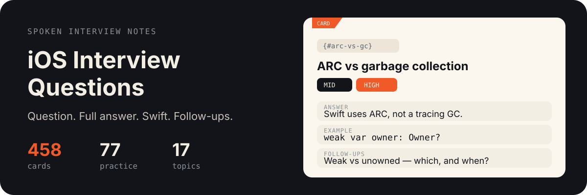

# iOS Interview Questions

<p align="center">
  <a href="./README.md"></a>
  <a href="./README.ru.md"></a>
</p>

<p align="center">
  
</p>

<p align="center">
  <a href="#start-here">High frequency</a> · <a href="#study-paths">Study paths</a> · <a href="docs/en/swift.md">Swift</a> · <a href="docs/en/memory.md">Memory</a> · <a href="docs/en/concurrency.md">Concurrency</a> · <a href="docs/en/architecture.md">Architecture</a> · <a href="docs/en/uikit.md">UIKit</a> · <a href="docs/en/swiftui.md">SwiftUI</a> · <a href="docs/en/combine.md">Combine</a> · <a href="docs/en/networking.md">Networking</a> · <a href="docs/en/persistence.md">Persistence</a> · <a href="docs/en/performance.md">Performance</a> · <a href="docs/en/security.md">Security</a> · <a href="docs/en/accessibility.md">Accessibility</a> · <a href="docs/en/frameworks.md">Frameworks</a> · <a href="docs/en/objc-runtime.md">Objective-C runtime</a> · <a href="docs/en/system-design.md">System design</a> · <a href="docs/en/algorithms.md">Algorithms</a> · <a href="docs/en/behavioral.md">Behavioral / process</a> · <a href="CONTRIBUTING.md">Contributing</a>
</p>

Spoken-answer notes for iOS interviews. Open a topic, read the question, then press **Show answer** for the spoken version and the Swift.

**458** cards · **381** with a written answer · **77** practice prompts · **249** often asked · **17** topics

Answers are rewritten, not copied. API names stay in Swift.

## How to study

1. Try **[one card](#identity-vs-equality)** below — say the answer, then reveal.
2. Follow a **[study path](#study-paths)** (~20 min). Or start with [High frequency](#start-here).
3. Topic decks live in `docs/en/` (Russian twins in `docs/ru/`). Cards sit by **Junior / Mid / Senior**.
4. Practice cards are prompts only. Talk them through. There is no pasted solution.

## Try one card

Say the answer out loud, then reveal. About 60 seconds.

<h2 id="identity-vs-equality">== vs ===</h2>

<code>Junior</code> · <code>High</code><br>[Open in the Swift deck](docs/en/swift.md#identity-vs-equality)

<details>
<summary><strong>Show answer and Swift</strong></summary>

**`==`** is `Equatable` — same *value*. **`===`** is identity — same *instance* (classes only). Two `UIView`s can be `==` if you defined that, and still `!==`. Two structs are never `===`; they have no identity. Typical miss: using `===` on a struct, or `==` on a class that only inherited `NSObject`’s pointer equality and thinking you compared fields.


```swift
class Box { var n: Int; init(_ n: Int) { self.n = n } }
let a = Box(1)
let b = a
let c = Box(1)
a === b   // true
a === c   // false
```


**Then they usually ask**

- Why does `NSObject`’s default `==` often match `===`?
- When do you write `==` on a class by hand?
- How does this show up in a unit test of a cache?

</details>

<h2 id="study-paths">Study paths</h2>

Finite lists. Checkboxes live only here — not on the cards. About 20 minutes a session.

- [Junior high-frequency](paths/junior-high-freq.md) — 6 sessions
- [7-day mid](paths/7-day-mid.md) — 8–12 cards a day
- [14-day senior](paths/14-day-senior.md) — plus system design and behavioral


<h2 id="start-here">High frequency</h2>

Titles only. Open a card, say the answer, then reveal.

### Swift · 51 often asked

- [== vs ===](docs/en/swift.md#identity-vs-equality) · Junior
- [Access control](docs/en/swift.md#access-control) · Junior
- [Any vs AnyObject](docs/en/swift.md#any-vs-anyobject) · Junior
- [Array vs set](docs/en/swift.md#array-vs-set) · Junior
- [Classes vs structs](docs/en/swift.md#classes-vs-structs) · Junior
- [Closures](docs/en/swift.md#closures) · Junior
- [Dictionary vs array](docs/en/swift.md#dictionary-vs-array) · Junior
- [Enums](docs/en/swift.md#enums) · Junior
- [Float vs Double vs CGFloat](docs/en/swift.md#float-double-cgfloat) · Junior
- [Hashable, Equatable, Comparable](docs/en/swift.md#hashable-equatable) · Junior
- [Higher-order functions](docs/en/swift.md#higher-order-functions) · Junior
- [Identifiable](docs/en/swift.md#identifiable) · Junior
- [Implicit vs explicit types](docs/en/swift.md#implicit-vs-explicit) · Junior
- [Nil coalescing](docs/en/swift.md#nil-coalescing) · Junior
- [Optional chaining](docs/en/swift.md#optional-chaining) · Junior
- [Property observers](docs/en/swift.md#property-observers) · Junior
- [Protocols](docs/en/swift.md#protocols) · Junior
- [Stored vs computed properties](docs/en/swift.md#stored-vs-computed) · Junior
- [String? vs String!](docs/en/swift.md#string-optional-vs-iuo) · Junior
- [Swift collections](docs/en/swift.md#collections) · Junior
- [Type safety](docs/en/swift.md#type-safety) · Junior
- [Value type vs reference type](docs/en/swift.md#value-vs-reference) · Junior
- [What is an optional](docs/en/swift.md#optionals) · Junior
- [deinit](docs/en/swift.md#deinit) · Junior
- [guard](docs/en/swift.md#guard) · Junior
- [if let vs guard let](docs/en/swift.md#if-let-vs-guard-let) · Junior
- [lazy](docs/en/swift.md#lazy) · Junior
- [let vs var](docs/en/swift.md#let-vs-var) · Junior
- [map vs compactMap](docs/en/swift.md#map-vs-compactmap) · Junior
- [mutating](docs/en/swift.md#mutating) · Junior
- [static](docs/en/swift.md#static) · Junior
- [switch](docs/en/swift.md#switch) · Junior
- [try vs try? vs try!](docs/en/swift.md#try-try-try) · Junior
- [Associated types](docs/en/swift.md#associated-types) · Mid
- [Copy-on-Write](docs/en/swift.md#copy-on-write) · Mid
- [Custom property wrappers](docs/en/swift.md#property-wrappers) · Mid
- [Enum associated values](docs/en/swift.md#enum-associated-values) · Mid
- [Escaping vs non-escaping closures](docs/en/swift.md#escaping-closures) · Mid
- [Extension vs protocol extension](docs/en/swift.md#extension-vs-protocol-extension) · Mid
- [Generics](docs/en/swift.md#generics) · Mid
- [Method dispatch](docs/en/swift.md#method-dispatch) · Mid
- [Opaque return types](docs/en/swift.md#opaque-return-types) · Mid
- [Result builders](docs/en/swift.md#result-builders) · Mid
- [Result type](docs/en/swift.md#result-type) · Mid
- [Why immutability matters](docs/en/swift.md#immutability) · Mid
- [defer](docs/en/swift.md#defer) · Mid
- [final keyword](docs/en/swift.md#final) · Mid
- [self vs Self](docs/en/swift.md#self-vs-self) · Mid
- [some vs any](docs/en/swift.md#some-vs-any) · Mid
- [Struct memory layout](docs/en/swift.md#struct-memory-layout) · Senior
- [Type erasure](docs/en/swift.md#type-erasure) · Senior

### Memory · 7 often asked

- [Explain ARC](docs/en/memory.md#explain-arc) · Junior
- [How Swift handles memory](docs/en/memory.md#swift-memory-management) · Junior
- [ARC vs garbage collection](docs/en/memory.md#arc-vs-gc) · Mid
- [Identify and resolve a memory leak](docs/en/memory.md#memory-leak) · Mid
- [Identify and resolve a retain cycle](docs/en/memory.md#retain-cycle) · Mid
- [autoreleasepool](docs/en/memory.md#autoreleasepool) · Mid
- [weak vs unowned](docs/en/memory.md#weak-vs-unowned) · Mid

### Concurrency · 23 often asked

- [Concurrency vs parallelism](docs/en/concurrency.md#concurrency-vs-parallelism) · Junior
- [@MainActor](docs/en/concurrency.md#main-actor) · Mid
- [Actor vs serial DispatchQueue](docs/en/concurrency.md#actor-vs-serial-queue) · Mid
- [AsyncSequence](docs/en/concurrency.md#async-sequence) · Mid
- [Checked continuations](docs/en/concurrency.md#checked-continuation) · Mid
- [Concurrency problems](docs/en/concurrency.md#concurrency-problems) · Mid
- [DispatchGroup](docs/en/concurrency.md#dispatch-group) · Mid
- [DispatchSemaphore](docs/en/concurrency.md#dispatch-semaphore) · Mid
- [GCD](docs/en/concurrency.md#gcd) · Mid
- [GCD vs OperationQueue](docs/en/concurrency.md#gcd-vs-operationqueue) · Mid
- [GCD vs async/await](docs/en/concurrency.md#gcd-vs-async-await) · Mid
- [Locks](docs/en/concurrency.md#locks) · Mid
- [Quality of Service](docs/en/concurrency.md#qos) · Mid
- [Sendable](docs/en/concurrency.md#sendable) · Mid
- [Task cancellation](docs/en/concurrency.md#task-cancellation) · Mid
- [Task groups vs async let](docs/en/concurrency.md#taskgroup-vs-async-let) · Mid
- [Task vs Task.detached vs TaskGroup](docs/en/concurrency.md#task-detached-taskgroup) · Mid
- [Thread-safe shared state](docs/en/concurrency.md#thread-safe-state) · Mid
- [main.async vs main.sync](docs/en/concurrency.md#main-async-vs-sync) · Mid
- [Actor reentrancy](docs/en/concurrency.md#actor-reentrancy) · Senior
- [Isolation domains](docs/en/concurrency.md#isolation) · Senior
- [Swift 6 strict concurrency](docs/en/concurrency.md#swift-6-concurrency) · Senior
- [Thread explosion](docs/en/concurrency.md#thread-explosion) · Senior

### Architecture · 13 often asked

- [Delegates](docs/en/architecture.md#delegates) · Junior
- [MVC](docs/en/architecture.md#mvc) · Junior
- [Dependency injection](docs/en/architecture.md#dependency-injection) · Mid
- [Design patterns in iOS](docs/en/architecture.md#design-patterns) · Mid
- [Feature flags](docs/en/architecture.md#feature-flags) · Mid
- [MVVM](docs/en/architecture.md#mvvm) · Mid
- [Protocol-oriented programming](docs/en/architecture.md#protocol-oriented-programming) · Mid
- [Repository pattern](docs/en/architecture.md#repository) · Mid
- [SOLID](docs/en/architecture.md#solid) · Mid
- [Singletons — when they help](docs/en/architecture.md#singletons) · Mid
- [Clean Architecture](docs/en/architecture.md#clean-architecture) · Senior
- [MVVM-C](docs/en/architecture.md#mvvm-c) · Senior
- [VIPER](docs/en/architecture.md#viper) · Senior

### UIKit · 23 often asked

- [@IBOutlet vs @IBAction](docs/en/uikit.md#iboutlet-vs-ibaction) · Junior
- [Aspect fill vs aspect fit](docs/en/uikit.md#aspect-fill-vs-fit) · Junior
- [Auto Layout anchors](docs/en/uikit.md#auto-layout-anchors) · Junior
- [Auto Layout formula](docs/en/uikit.md#autolayout-formula) · Junior
- [Cell reuse identifiers](docs/en/uikit.md#reuse-identifiers) · Junior
- [Dark mode](docs/en/uikit.md#dark-mode) · Junior
- [Modal vs push](docs/en/uikit.md#modal-vs-push) · Junior
- [Safe area](docs/en/uikit.md#safe-area) · Junior
- [Storyboards vs code layouts](docs/en/uikit.md#storyboards-vs-code) · Junior
- [UIImage vs UIImageView](docs/en/uikit.md#uiimage-vs-uiimageview) · Junior
- [UINavigationController](docs/en/uikit.md#navigation-controller) · Junior
- [UIStackView](docs/en/uikit.md#stack-view) · Junior
- [UIViewController lifecycle](docs/en/uikit.md#viewcontroller-lifecycle) · Junior
- [frame vs bounds](docs/en/uikit.md#frame-vs-bounds) · Junior
- [prepareForReuse](docs/en/uikit.md#prepare-for-reuse) · Junior
- [Collection view vs table view](docs/en/uikit.md#collection-vs-table) · Mid
- [Diffable data source](docs/en/uikit.md#diffable-data-source) · Mid
- [Intrinsic content size](docs/en/uikit.md#intrinsic-content-size) · Mid
- [Passing data in iOS](docs/en/uikit.md#passing-data) · Mid
- [Responder chain](docs/en/uikit.md#responder-chain) · Mid
- [Size classes](docs/en/uikit.md#size-classes) · Mid
- [Table view with remote images](docs/en/uikit.md#remote-images-table) · Mid
- [setNeedsLayout vs layoutIfNeeded](docs/en/uikit.md#setneedslayout) · Mid

### SwiftUI · 23 often asked

- [@Binding](docs/en/swiftui.md#binding) · Junior
- [@State](docs/en/swiftui.md#state) · Junior
- [@Published](docs/en/swiftui.md#published) · Mid
- [@StateObject vs @ObservedObject](docs/en/swiftui.md#stateobject-vs-observedobject) · Mid
- [Choosing SwiftUI property wrappers](docs/en/swiftui.md#swiftui-property-wrappers) · Mid
- [Environment object vs observed object](docs/en/swiftui.md#environmentobject-vs-observedobject) · Mid
- [GeometryReader](docs/en/swiftui.md#geometry-reader) · Mid
- [How an observable object announces changes](docs/en/swiftui.md#observable-object-changes) · Mid
- [LazyVStack vs VStack](docs/en/swiftui.md#lazyvstack-vs-vstack) · Mid
- [MV vs MVVM in SwiftUI](docs/en/swiftui.md#swiftui-mv) · Mid
- [MVVM in SwiftUI](docs/en/swiftui.md#swiftui-mvvm) · Mid
- [ObservableObject vs @Observable](docs/en/swiftui.md#observableobject-vs-observable) · Mid
- [PreferenceKey](docs/en/swiftui.md#preference-key) · Mid
- [Programmatic navigation](docs/en/swiftui.md#programmatic-navigation) · Mid
- [SwiftUI environment](docs/en/swiftui.md#environment) · Mid
- [SwiftUI view lifecycle](docs/en/swiftui.md#swiftui-lifecycle) · Mid
- [SwiftUI vs UIKit](docs/en/swiftui.md#swiftui-vs-uikit) · Mid
- [UIKit in SwiftUI](docs/en/swiftui.md#uikit-representable) · Mid
- [View initializer vs onAppear](docs/en/swiftui.md#init-vs-onappear) · Mid
- [When SwiftUI re-renders a view](docs/en/swiftui.md#swiftui-rerender) · Mid
- [Why SwiftUI views are structs](docs/en/swiftui.md#views-are-structs) · Mid
- [AttributeGraph](docs/en/swiftui.md#attribute-graph) · Senior
- [View identity vs a ViewBuilder property](docs/en/swiftui.md#view-identity) · Senior

### Combine · 2 often asked

- [Combine and reactive programming](docs/en/combine.md#combine) · Mid
- [Combining publishers](docs/en/combine.md#combine-operators) · Mid

### Networking · 11 often asked

- [HTTP methods](docs/en/networking.md#http-methods) · Junior
- [HTTP status codes](docs/en/networking.md#http-status) · Junior
- [JSON](docs/en/networking.md#json) · Junior
- [Making a network request](docs/en/networking.md#network-request) · Junior
- [NotificationCenter](docs/en/networking.md#notification-center) · Junior
- [URL vs URLRequest](docs/en/networking.md#url-vs-urlrequest) · Junior
- [Push notifications](docs/en/networking.md#push-notifications) · Mid
- [REST](docs/en/networking.md#rest) · Mid
- [Retry with backoff](docs/en/networking.md#retry-backoff) · Mid
- [Token authentication](docs/en/networking.md#token-auth) · Mid
- [URLSession](docs/en/networking.md#urlsession) · Mid

### Persistence · 8 often asked

- [Codable](docs/en/persistence.md#codable) · Junior
- [How you persist data on iOS](docs/en/persistence.md#persist-options) · Junior
- [UserDefaults — good and bad uses](docs/en/persistence.md#userdefaults) · Junior
- [CloudKit vs Core Data](docs/en/persistence.md#cloudkit-vs-core-data) · Mid
- [Core Data](docs/en/persistence.md#core-data) · Mid
- [Core Data migration](docs/en/persistence.md#core-data-migration) · Mid
- [Key decoding strategies](docs/en/persistence.md#key-decoding-strategies) · Mid
- [SwiftData](docs/en/persistence.md#swiftdata) · Mid

### Performance · 11 often asked

- [Debugging on iOS](docs/en/performance.md#debugging) · Junior
- [Hang vs hitch vs crash](docs/en/performance.md#hang-hitch-crash) · Mid
- [Identify and resolve crashes](docs/en/performance.md#crashes) · Mid
- [Identify and resolve performance issues](docs/en/performance.md#performance-issues) · Mid
- [In-memory cache](docs/en/performance.md#in-memory-cache) · Mid
- [Instruments](docs/en/performance.md#instruments) · Mid
- [LRU cache](docs/en/performance.md#lru-cache) · Mid
- [NSCache vs Dictionary](docs/en/performance.md#nscache-vs-dictionary) · Mid
- [dSYM](docs/en/performance.md#dsym) · Mid
- [Binary / IPA size](docs/en/performance.md#binary-size) · Senior
- [Launch time](docs/en/performance.md#launch-time) · Senior

### Security · 6 often asked

- [App Transport Security](docs/en/security.md#ats) · Junior
- [API keys](docs/en/security.md#api-keys) · Mid
- [Encoding vs encryption vs hashing](docs/en/security.md#encoding-vs-encryption) · Mid
- [Face ID / Touch ID](docs/en/security.md#biometrics) · Mid
- [Keychain](docs/en/security.md#keychain) · Mid
- [SSL pinning](docs/en/security.md#ssl-pinning) · Senior

### Accessibility · 4 often asked

- [Dynamic Type](docs/en/accessibility.md#dynamic-type) · Junior
- [Accessibility focus in SwiftUI](docs/en/accessibility.md#accessibility-focus) · Mid
- [Main accessibility problems to solve](docs/en/accessibility.md#accessibility-problems) · Mid
- [Testing with VoiceOver](docs/en/accessibility.md#voiceover) · Mid

### Frameworks · 1 often asked

- [StoreKit](docs/en/frameworks.md#storekit) · Mid

### Objective-C runtime · 6 often asked

- [Messaging and nil](docs/en/objc-runtime.md#objc-messaging) · Mid
- [RunLoop](docs/en/objc-runtime.md#runloop) · Mid
- [Timer pauses while scrolling](docs/en/objc-runtime.md#timer-runloop) · Mid
- [+load vs +initialize](docs/en/objc-runtime.md#load-vs-initialize) · Senior
- [Mach-O and dyld](docs/en/objc-runtime.md#mach-o) · Senior
- [isa and object layout](docs/en/objc-runtime.md#isa) · Senior

### System design · 31 often asked

- [Build a checkout UI in 60 minutes](docs/en/system-design.md#checkout-ui) · Mid
- [Design a short match / score simulator](docs/en/system-design.md#match-simulator) · Mid
- [Real-time ETA polling](docs/en/system-design.md#eta-polling) · Mid
- [Design Notes / Gmail / Facebook (iOS client)](docs/en/system-design.md#design-client-app) · Senior
- [Design a caching library](docs/en/system-design.md#caching-library) · Senior
- [Design a chat app](docs/en/system-design.md#chat-app) · Senior
- [Design a file downloader](docs/en/system-design.md#file-downloader) · Senior
- [Design a home screen of rails](docs/en/system-design.md#home-rails) · Senior
- [Design a live delivery tracker](docs/en/system-design.md#delivery-tracker) · Senior
- [Design a location sharing library](docs/en/system-design.md#location-sharing) · Senior
- [Design a networking library](docs/en/system-design.md#network-library) · Senior
- [Design a news feed](docs/en/system-design.md#news-feed) · Senior
- [Design a pagination library](docs/en/system-design.md#pagination) · Senior
- [Design a payment checkout](docs/en/system-design.md#payment-checkout) · Senior
- [Design a push notification system](docs/en/system-design.md#push-system) · Senior
- [Design a server-driven UI engine](docs/en/system-design.md#sdui) · Senior
- [Design a short-form video feed](docs/en/system-design.md#short-video-feed) · Senior
- [Design a video streaming player](docs/en/system-design.md#video-streaming) · Senior
- [Design an A/B experiment library](docs/en/system-design.md#ab-experiments) · Senior
- [Design an analytics library](docs/en/system-design.md#analytics-library) · Senior
- [Design an audio player](docs/en/system-design.md#audio-player) · Senior
- [Design an image loading library](docs/en/system-design.md#image-loader) · Senior
- [Design an image upload pipeline](docs/en/system-design.md#image-upload) · Senior
- [Design an offline media catalog](docs/en/system-design.md#offline-media) · Senior
- [Design an offline-first sync engine](docs/en/system-design.md#offline-sync) · Senior
- [Design deep links](docs/en/system-design.md#deep-links) · Senior
- [Design iCloud-style device sync](docs/en/system-design.md#icloud-sync) · Senior
- [Design search with autocomplete](docs/en/system-design.md#search-autocomplete) · Senior
- [Edge-first mobile design](docs/en/system-design.md#edge-first) · Senior
- [How to run a mobile system design interview](docs/en/system-design.md#sd-interview) · Senior
- [Unread count / badge](docs/en/system-design.md#unread-badge) · Senior

### Algorithms · 6 often asked

- [Big-O](docs/en/algorithms.md#big-o) · Junior
- [Fibonacci](docs/en/algorithms.md#fibonacci) · Junior
- [Merge two sorted lists](docs/en/algorithms.md#merge-lists) · Junior
- [Reverse a linked list](docs/en/algorithms.md#reverse-list) · Mid
- [Sliding window](docs/en/algorithms.md#sliding-window) · Mid
- [Two-sum](docs/en/algorithms.md#two-sum) · Mid

### Behavioral / process · 23 often asked

- [App and scene lifecycle](docs/en/behavioral.md#app-lifecycle) · Junior
- [Swift Package Manager](docs/en/behavioral.md#spm) · Junior
- [Test types](docs/en/behavioral.md#test-types) · Junior
- [Background tasks](docs/en/behavioral.md#background-tasks) · Mid
- [Code review process](docs/en/behavioral.md#code-review) · Mid
- [Code signing](docs/en/behavioral.md#code-signing) · Mid
- [Continuous integration](docs/en/behavioral.md#ci) · Mid
- [Improve an existing take-home app](docs/en/behavioral.md#improve-existing-app) · Mid
- [Minimum deployment target](docs/en/behavioral.md#deployment-target) · Mid
- [STAR stories](docs/en/behavioral.md#star) · Mid
- [Screening OA / assessment platform](docs/en/behavioral.md#screening-oa) · Mid
- [Snapshot tests](docs/en/behavioral.md#snapshot-tests) · Mid
- [Swift Testing](docs/en/behavioral.md#swift-testing) · Mid
- [Take-home interview](docs/en/behavioral.md#take-home) · Mid
- [Test doubles](docs/en/behavioral.md#test-doubles) · Mid
- [Testing async code](docs/en/behavioral.md#test-async) · Mid
- [Third-party vs custom](docs/en/behavioral.md#third-party-vs-custom) · Mid
- [XCTest and UI tests](docs/en/behavioral.md#xctest) · Mid
- [Brazil product-company iOS loop](docs/en/behavioral.md#brazil-ios-loop) · Senior
- [CIS product-company iOS loop](docs/en/behavioral.md#cis-ios-loop) · Senior
- [FAANG iOS loop](docs/en/behavioral.md#faang-ios-loop) · Senior
- [India product-company iOS loop](docs/en/behavioral.md#india-ios-loop) · Senior
- [Marketplace iOS loop](docs/en/behavioral.md#marketplace-ios-loop) · Senior

## Topics

- [Swift](docs/en/swift.md) — 95 cards · 51 often asked
- [Memory](docs/en/memory.md) — 10 cards · 7 often asked
- [Concurrency](docs/en/concurrency.md) — 27 cards · 23 often asked
- [Architecture](docs/en/architecture.md) — 25 cards · 13 often asked
- [UIKit](docs/en/uikit.md) — 46 cards · 23 often asked
- [SwiftUI](docs/en/swiftui.md) — 30 cards · 23 often asked
- [Combine](docs/en/combine.md) — 3 cards · 2 often asked
- [Networking](docs/en/networking.md) — 18 cards · 11 often asked
- [Persistence](docs/en/persistence.md) — 16 cards · 8 often asked
- [Performance](docs/en/performance.md) — 14 cards · 11 often asked
- [Security](docs/en/security.md) — 8 cards · 6 often asked
- [Accessibility](docs/en/accessibility.md) — 5 cards · 4 often asked
- [Frameworks](docs/en/frameworks.md) — 19 cards · 1 often asked
- [Objective-C runtime](docs/en/objc-runtime.md) — 18 cards · 6 often asked
- [System design](docs/en/system-design.md) — 54 cards · 31 often asked
- [Algorithms](docs/en/algorithms.md) — 28 cards · 6 often asked
- [Behavioral / process](docs/en/behavioral.md) — 42 cards · 23 often asked

## Contributing

New questions go through the ritual in [CONTRIBUTING.md](CONTRIBUTING.md): one source at a time, dedup by meaning, rewrite the answer, then regenerate with `python3 scripts/generate_readme.py`.

The local source log lives in `inbox/` and stays out of git.

## What this is not

- Not a dump of someone else's repo, course, or paid bank.
- Not tagged by company. A Sber or Flipkart recap can enrich a card; the card itself stays generic.
- Not a checklist with progress boxes on the cards. Track a path or a local `STUDY.local.md`.
- Practice prompts do not include third-party solutions.
